# P19：030-分析技能列表 - 教到你会 - BV1DS4y1n7qF

大家好，我是郁金香老师，那么今天这节课，我们一起来分析一下技能列表，为后边我们使用技能方面的功能来做准备，那么进入到游戏，我们打开全部功能里面有一项是工，那么这里呢就有一个技能列表，我们使用的时候。

需要把技能里边的相应技能呢，移动到最下面的快捷栏里边，然后呢再选中怪物在进行相应的攻击，可以鼠标右击啊进行一个攻击，那么首先呢我们要取得这个对象，数组里的对象，然后呢往这个地方来写作。

那么我们先分析一下这个对象数组，那么之前我们分析过啊动作的这个数组，那么你们也是选中我们的对象之后呢，这里鼠标呢会变会有一个相应的图标跟随，那么实际上呢是有一个变量里面呢，它存放了这个相应的动作的对象。

那么今天我们这里也是一样，我们按下鼠标左键之后呢，它也有一个对象，保存到某一个变量里面去了，所以说我们可以用c一啊，来搜一下这个相应的变量，那么收到这个变量之后呢，我们就可以慢慢的追到相应的技能列表里。

那，么我们重新扫描一下，那么开始扫描的时候呢，它是一个未知的一个数值，然后我们选中了一个数字之后呢，它是一个变动的数值变动了一下，然后我们把它放回去啊，再取出来，那么这个像这个变量里面写入的对象呢。

它没有变化，我们是未变动的数值，然后我们放回去，它放回去之后呢，一般我们那么前面我们分析动作的时候呢，它是用零来表示的啊，会选中对象，那么我们再搜一下，可以尝试一下声明，然后来选中这个对象。

再放回去再声明，然后再选中这个对象，那么收大于零的数值，然后收未变动的数值，因为这个时候我们没有选中其他的技能，没有去改动这个变量里的值，啊然后再放回去，放回去之后，我们再收你，然后再选中一个。

那这个时候还没有真正的选中啊，那么这里呢它有一些数据出来了，我们还可以把它过滤掉，那么也就是前面的这一堆的数据，我们全部都可以给它过滤掉，刚才在变动图，那么这个时候我没有选中的，这段时间我们也把它删掉。

或者这里我们再搜一下精确数字零，然后我们选中一个数字，那么选中了之后，后面我们赢的这一段呢，我们那是算掉，你要收大于比零大的一个数值，然后放回去，这个时候呢我们应该收零，那么中间这段它没有变化的啊。

这三个数字呢我们拿出电，选中啊，那么后边这几个呢双掉会变化，这两个双掉啊，最后就剩下这几个数字，我们看一下这个数值是多少，用16进制显示一下是c开头的，那么然后我们给它放回去，放回去之后，这个时候变化。

再选中一个吧，有大的数值，然后未变动的数值放回去，然后再选中它还是会变动的数字，去死，搜数字零，好这几个数字我们都添加进来，看一下这个，然后我们全部用16进制来显示，那么这几个呢都是以c开头的哈。

那么可能呢都不是对线的这几个数字，而且是相同的，在变化不断改，那么这几个数字在变化的数字我们删掉，这个一也删掉，好那么再选中一个对象，第三方再选中第一个对象，既爻画，那么我们查找一下访问这个第几个代码。

那么选中之后呢，他写的是二八，然后我们停止看一下，那么从第一个开始看，我们找一下周围有没有数组，第二个，第三个，第四个，第四个，在这里我们找到有一个数字，但是这个数组呢它这里ex写下呃。

一个对象加一个偏移，那么这个e4 x来源于这个机制，那么这个ex呢来源于这个列表里410，这个列表的话我们很熟悉，还有找这个动作的这个机子，它都有相应的数组的，都有一个410的一个偏移。

那么这个的可能性的话非常的大啊，那我们先把刚才的，这个记录一下，一个是28，这里面取出来一个对象，还有这里面有一个410，那么关掉我们的声音，那么接下来我们用lp来看一下，未来我们还有我们要看一下呃。

刚才这个是有名，这里他e d i它的机制是多少，再来搜一下。

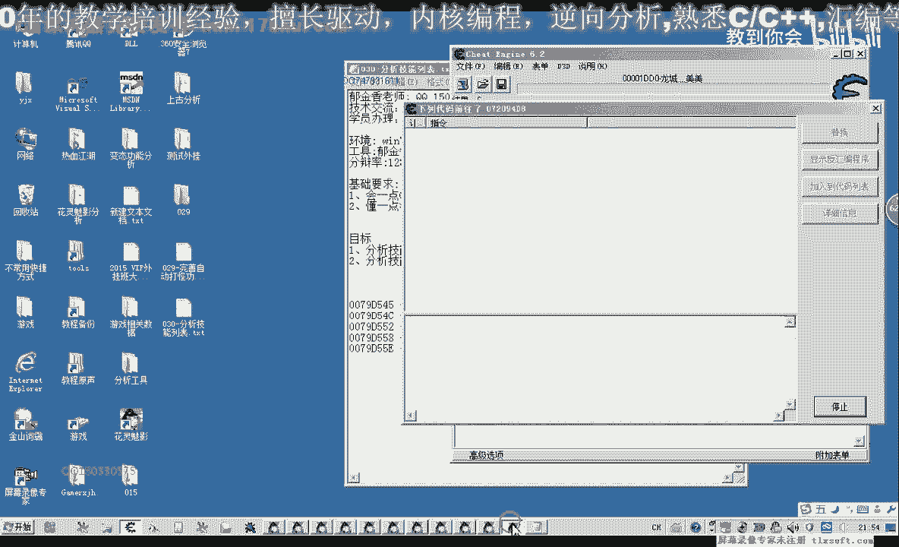

放回去之后啊，这个地方我们看一下详细的信息，那么详细信息e d i的数值呢，我们把它复制出来，e d i等于这个数值，npi也就是这里的机子，那么我们搜一下这个机子，它来源于什么地方。

那么把这两个绿色的添加进来，这两个绿色的就极有可能就是鸡舍，它来源于这个地方，有最终我们这个数组的一个机制，在udi的来源，那么另外一个呢我们来看一下下边这个，那么访问它的地方。

那么我们看一下访问他的地方呢，又到了这个740里边去了，它又是一个相应的一个数值，相应的一个数据啊，所以说这个的话它不是我们的机子呃，这个更像是ex神是加什么什么多少，更像是我们之前的那一个呃。

所有对象的那个数据，当然这个我们也可以把它自己抓下来，另外一个对象的话，它是在两个地方存在，我们之前分析了啊，它在所谓的对象里面，也存在了这样一个呃机制，那么接下来我们用o p来查看。

那么首先我们到到这个地方，看一下它的机子，数组的机子，那么它的机子就是这里边的这个数字，那么偏移呢就是这个410啊，这就是一个数组的下标，加410，加上4c下标，那么他一共有一个两个三个四个。

五个六个八个对象，那么我们看一下，能123可能在前面的也算上了，或者是在后面的也算上了，那我们看一下，进去看一下它相应的对象的名字，那么他对象的类型呢，我们发现呢这个是1b哈，那我们看一下第二个。

第二个有点奇怪，我们看它的这个呢是ec，为什么这两个不同，那我们再看一下第三个，第三个，它的这个加八的分，路边偏移的话也是1c啊，进入对象，那么我们跟他说一下，加八的偏移。

它的分度确定是1b50 x1 c，当然为什么会有这这样的区别，那么我们先看一下，好像第一个它的名字，这个叫疾风刀法啊，这里有个刀客，那么看一下，看看这个地方是六八个左右，这里加一点b，然后五四。

那么5c这个地方，那么与之前我们找的对象，和他一致的，都是在这个地方是对象的名字嗯，那么后面这里呢它还有一个九开始的，这里一个刀客是对象的直列啊，那么这个是大概是加编辑左右。

还有差一点b10 b一这个地方，这是对象的啊，应该是我们的玩笑的，或者是技能的技能所学实验好，那么我们这是第一个，那么第二个呢我们再来看一下，这里是刀客加50这个地方疾风烈火。

那么我们看这是第几个疾风烈火，那么疾风烈火是这一个，那么第一个的话疾风刀法是这一个啊，再看一下家里的这个地方是疾风刀法，那么这样呢我们就把棋吹分开了，这个疾风刀法呢是一个分类，真正的技能的话。

它的分类的话是ec，在前面的这个分类呢是1b是这样来的，那么我们看一下，第四个是多少烈士刀法啊，那么我们看一下主题，看一下它的分类也是1b应该是拿一本书，这是灭世刀法，在后面的是一个灭世屠龙。

这四个平方好，那么我们大致清楚了，那么1b呢是我们的技能的一个人，又是一个技能的一个分段，那么一岁呢是我们的嗯技能对象啊，的一个分论，这个呢我们说直白一点呢，就是前面讲那一本技能书。

记得出在后面呢是进入对象，那么我们看它里面一共有几个对象了，哈哈哈哈哈哈，这里有1234678个对象，那么八个对线呢就应该是前面的这八个，那么后面这里还有四个呢，我们看后面还有个啊，后面这里才还有四个。

那么中间的呢他没有出来就是0米，那么一共有12个技能，相当于是啊，这前面的这个书算上这个书，算上他一共来这里面8494，应该是36啊，那么我们加上加上30，这36的话，843423 14。

这里过了再来看一下这里，123412345678，884 32的最后那一个的话，应该是742 18 28开，好家，但我们这个是16进制的，16进制的话，它应该算算成我们的幺六，也是1a1 b b。

这个地方开始恰好是这1b1 c，这个地方是后面四。

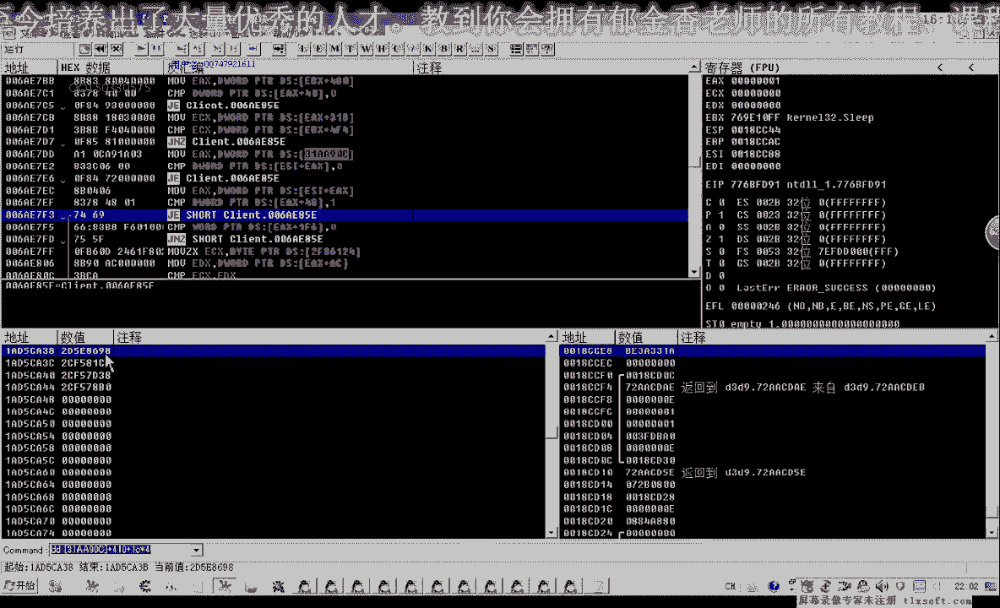

哎哎哎哎。

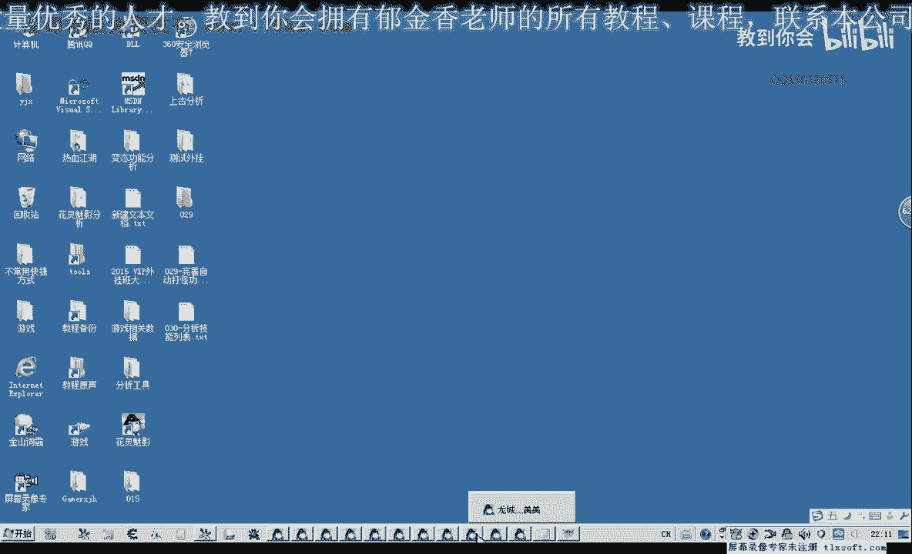

那么我们分析出这个列表的基址和偏移，出来之后呢，我们再把它的属性给他备注一下，到5c啊，b1 ，还有当然嗯加零四这个点是我们的，也就是这个数据的啊，一个下标这个大数组所有分类的，在这个地方。

31c e740 ，就是这一句，我们再来看一下，当然还有一个属性，应该还有一个属性，之间的话，它应该有一个区别，比如说122个他是学的，第三个他没有学，那么我们把这个数据下标改一下，一，dc啊。

这个是疾风刀法，4x2，这个也是疾风刀法刀口啊，几乎段位，再看一下这个对象是多少mic，那么这两个之间的话，我们的三和四之间呢，它应该有一个二和三，他们两个之间应该有一个区别，那我们再看一下。

我们把这个这一段把它复制下来，把前面这一段，那么复制下来之后呢，我们把它放到记事本里面。

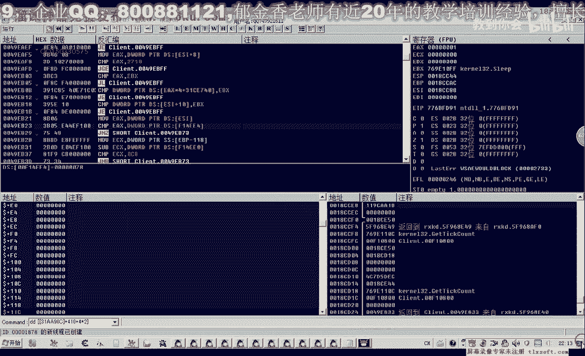

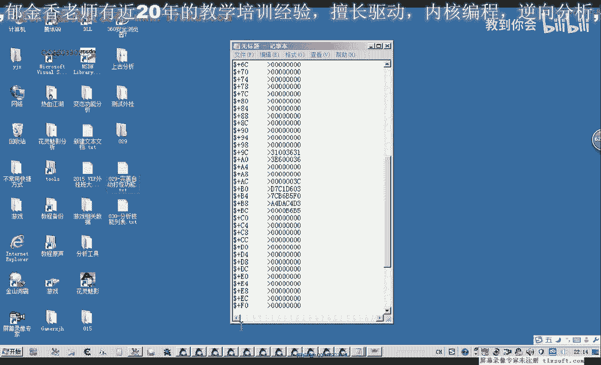

也就是，第三个，那么实际上它是第四个啊，下标13名就是这个这个疾风残影，他没有学，啊疾风残影，那么我们看一下这里面的数据，他们之间学有没有学的之间的，他们有一个什么区别。

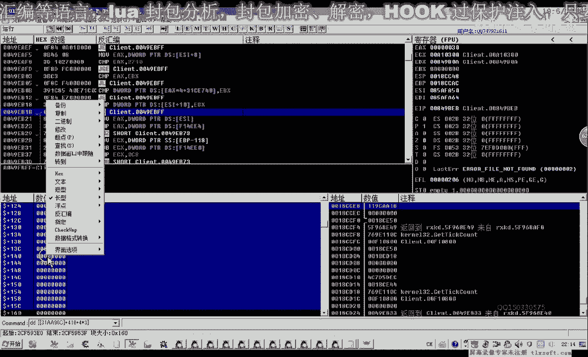

试一下相关的数据，然后再打开一个记事本，调整一下，我们做一个比较吧，那么首先是前面的这个都一样差不多啊，然后是前面的一样的，我们删掉f f，然后设置里一个一，表示这个地方它不一样啊，学英语没有学的啊。

嗯除了腰射这里，但是他低位都是一，那么后面的这里这里这里没有些不一样的，零二，所以这里呢就是我们的名字，那么50之后呢，我们再来看一下，未学的可能是零啊，那么学到的他应该用一来表示，那么在后面这一篇呢。

还没有看到哪里有一个数量统计，那么就这个数字呢，还可以可能会做一些区分。

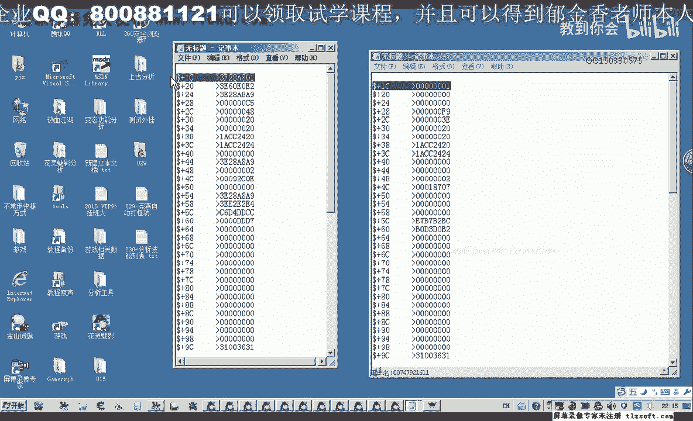

我们看一下你设这里是什么，加二这个位置，是一而三这个位置的医生，现在他也变成一了，这个数字可能是在变化，重新把它抓一下，我们从前面的，我们把这个数据做场面中，或者我们还可以这样，这样是最方便的。

我们可以呢，呃你这个数据三为例啊，之前我们是没有学，那么学了之后呢，它有一个数据的一个变动就可以搜到了，应该那么比如说现在没有学好，那么我们搜一下零，等一会儿我们再搜一下一，我们用数据来看一下。

那么先看一下它的机子，这是我们的疾控产品啊，现在这个疾风产品呢他没有学啊，没有学，我们附加进调试器，然后呢我们在这个范围搜一下，搜一下一字节的零，当然这个时候应该是，我们应该把它复制到这里。

收益自己的名义，那这个时候呢应该是有很多数据很多，那么我们可以跟它限制一个大，大致的一个范围和输入的时候，因为这个一个对象呢他不可能再大太大，那么这里我们给它设为2000字，几是16进制的2000。

那么在收你这个时候就比较少，那么学起来之后呢，这个数字它就变动了，就应该成为一，那么我们看一下f离他最近的，就是这个还有f57611 变动的，就只有这几个数字变动了，那么我们再看一下啊。

这个与它的偏移有多远，然后我们替换成刚才查找的这个，他是第一位，这个时候为一了，是1f6 ，这个地方我们用dw来查看它，呃整形完整性啊，那么我们就能够看到ef 6这个这个地方呢。

他可能是表示的加1f6 ，这是两个字节字节，但是不是这样，我们嗯再看一下后面的拼音，我们就先记录一下这个只是有这个可能，然后我们再看一下后面这个，这个是也是两次节，低两位，高两位呢。

它是这个是2000啊，这有我们用短整型的就能看到。

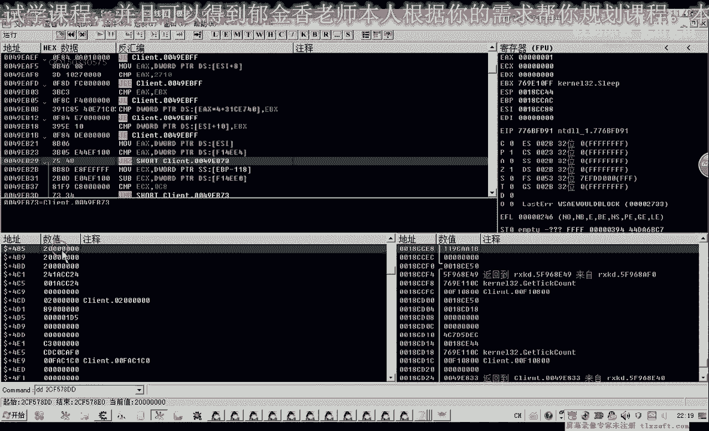

现在它为零了，这个地方再来看一下无名，那我们就不需要了，后面的这一串人，他现在都零零了。

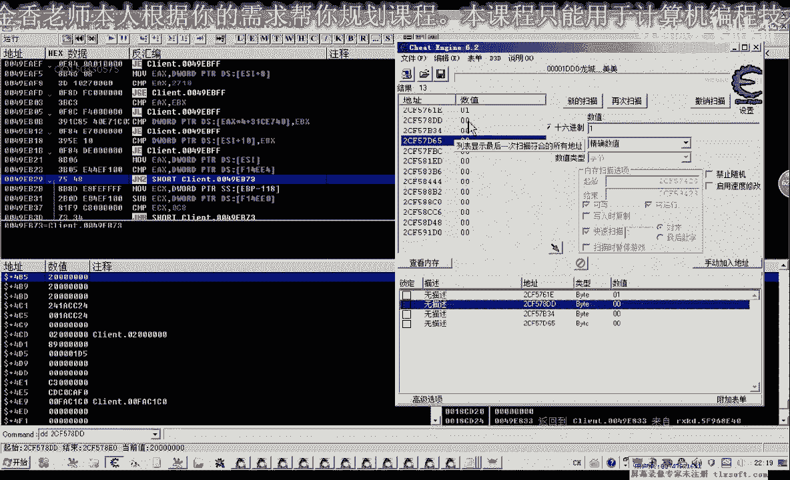

已经变化了已经变化了，只有这个地方明显，那么我们可以看一下这个列表里面，再来尝试一下，加上e和六。

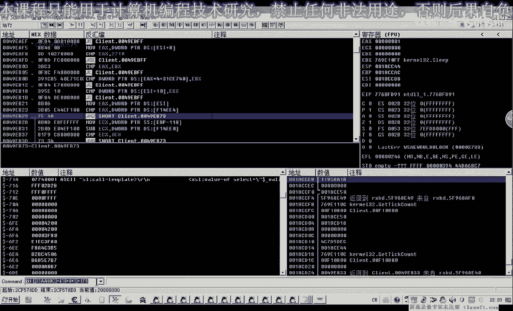

dw我用dw的显示这是一，那第二个也就是第三个技能，你学的啊，那么看哪一个没有学呢，这是0123，那么这里更没有学历，下标是，那么这个是零，那么下周是六的话，那一个也是学了啊，这个就是一要不要升六六。

然后呢789 十，我们这里742 18，2974 28哈，这个是下的是27，这个是2929分啊，这里是3030，我们表示成16进制的话，那么这里是是要e的样子啊。

你看a410 b c d r e d这个地方，那么1p呢是这个那么1p过来，我们看1e啊，这里是零，ef这里是零，那么基本上可以断定呢，这个ef 6，这个地方呢就是就是学或者是未遂。

那么我们可以尝试修改这个数字，那么我们看到这里的弹链，它已经就是说发生变化了啊，修改这个属性之后，那么我们在修改前一个属性，好，那么这个呢相应的技能呢，它也可以拿出来使用了，也可以拿出来使用。

这样我们可以修改，那么这一个的话它的下标是01234，那么我们期待这一刻，012345啊，这个也可以打六七，那么我们先修改第七个，啊那么这个呢它也可以拖出来的哈，但是游戏更新之后呢。

它这个数据呢它就没有了啊，有没有，那么到时候我们知道啊，刚才的这个呢，他就是这个相应的技能，是否可用的一个标志，我们下一个断点，那么下断点，我们这里也能看到一个word的gf 6，它的一个偏移。

说明的话它的确是双字节的啊，这能够说明一个问题，就能试图讨厌的样。

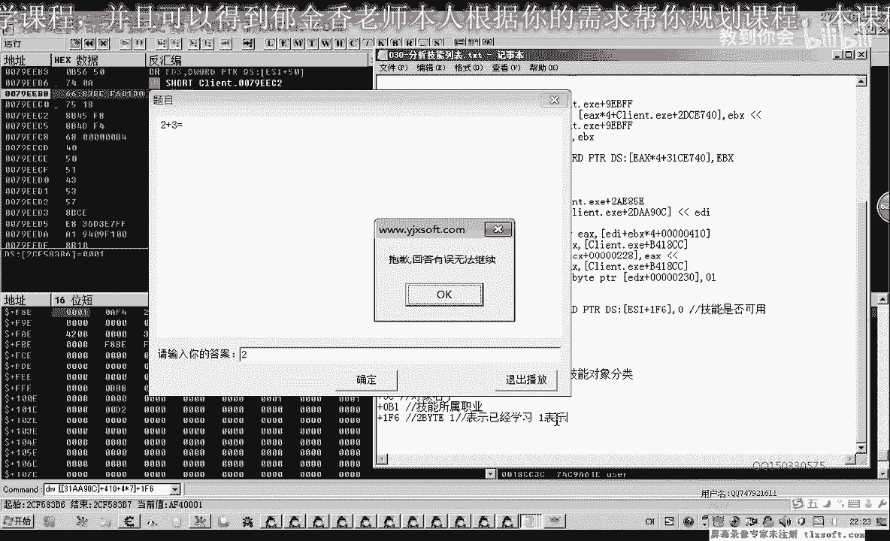

好那么这节课呢我们关于技能列表呢，我们就分析到这里，那么下一节课我们在编写代码，读书里面相关的一些数据，进行下一步的分析，好的。

