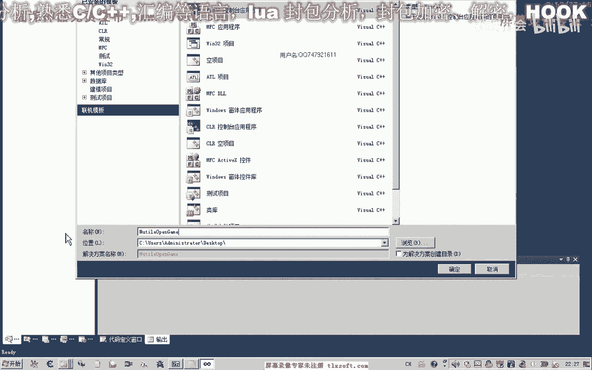
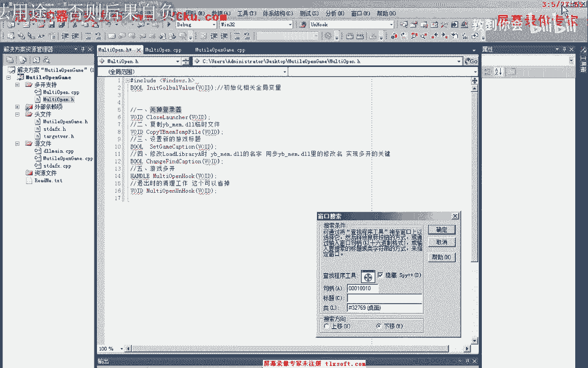
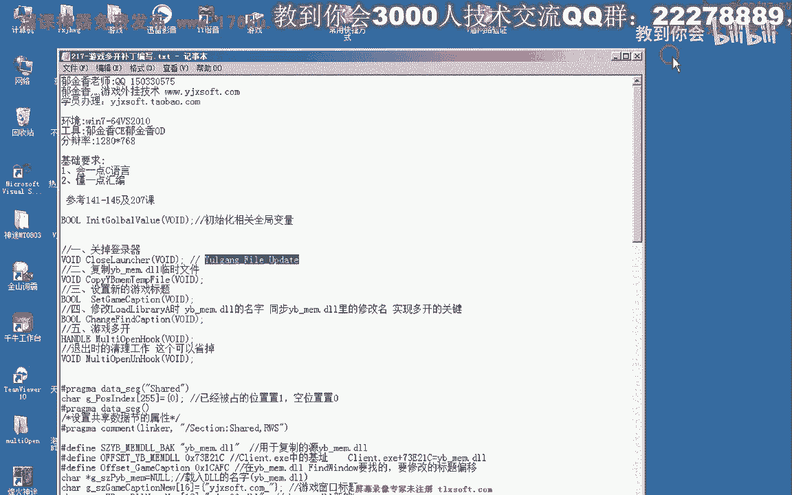
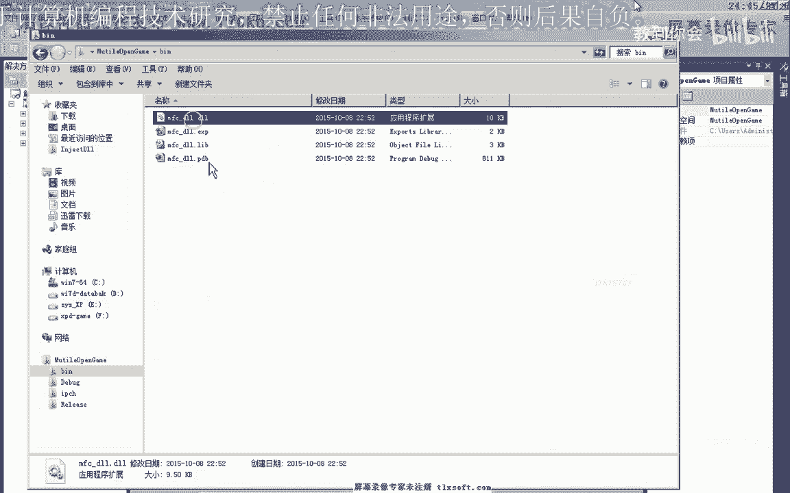

# 郁金香老师C／C++纯干货 - P200：217-游戏多开补丁编写_old - 教到你会 - BV1DS4y1n7qF

大家好，我是郁金香老师，那么上一节课呢我们简单的探讨了，那以下这个游戏多开的另外的一种原理，那么这节课呢我们通过上上一节课分析的数据。

然后呢来编写相应的代码，那么首先我们打开vs 2010。

然后在这里呢我们建一个动态链接库的程序，选动态链接库，然后这里呢可以选套出的符号。

然后在这里呢我们添加一个新建的新建的这个目录，这里边呢我们主要是多开支持的相应的函数，那么在这里呢我们先建一个源文件，多开的，然后呢再添加一个图文件，然后我们要写的话，大致我们需要写这几个函数。

那我们先把这几个函数来啊，复制到我们的重建里，那么首先呢我们要写一个关闭我们登录器的相应的函数，关掉登录器，也就是我们这个多开必须的这个步骤，那么如果我们不关掉这个登录器的话。

那么新的登录器呢将无法打开，那么所以说我们在打补丁的时候，客户端启动了之后呢，我们就找一下呃这个登录器，那么登录器的话我们需要知道它的进程的句柄，才可以关闭它。

那么首先呢我们可以用spi加加来获得它窗口标题，通过窗口标题的话，我们可以获取进程的id。

然后可以获取它相应的具体，那么这是他窗口的标题，那么这是我们登录其他的相关登录器的窗口标题呢，我们就可以通过它最终呢来结束这个进程。

好的，那么我们看一下代码应当怎么写。

当然为了节省大家的时间呢，往这里来，直接拿写好的代码做一下参考。

那么关闭登录器的话是只需要这一段代码就可以了，好的我们把它写过来，那么首先呢我们通过翻的windo来获取这个登录器的窗口句柄，获得这个窗口句柄之后呢，然后呢我们获得登录器的，登录器的话，进程p i d。

然后通过进程p i d，我们获取登录器的进程，具体，然后有了这个进程，具体呢我们可以来强制的结束这个进程，那么强制结束之后啊，当然我们就一个平台上啊，只要没有相应的保护措施的话，那么我们就可以了嗯。

结束掉这个进程，好了，我们编译生成一下我们的代码，那么在这里我们需要包含相应的图文件，当然我们这个调试函数呢我们也需要写上，因为我们写代码的话容易出错啊，所以我们需要写上这个函数。

然后呢把它放置在我们的头文件里面，方便在其他地方调用，那么在这里呢我们需要呢添加一下我们的字符串，直接拿去，好的，那么包含了这个string这个铜件之后呢，我们就可以使用相应的字符串联相应的函数。

那么接下来就是设计我们的，其他几个步骤，那么我们再来看一下，第二步呢，我们是要复制我们的这个保护的动态链接库，生成一个临时文件，用来在之后呢啊把它载入到我们的客户端里面去。

那么这个时候呢我们需要写一个啊这个copy file的文件，那么我们来看一下该怎么写，那么这一句的话相当的简单，只需要调用一下我们的货币发展就能够实现，那么copy的话，第一个呢是我们的源文件。

第二个是我们的目标文件，那么这个源文件和目标文件在这里呢我需要做一下相应的定义，那么在这里呢我们设置了相应的变量，那么我们也把它复制过来，那么首先呢我们这个呢是它的源文件，源文件就是这个文件啊。

那么它本身就是存在的这个文件，那么目标文件的话，我们在这里呢需要对它进行动态的一个修改，就是新生成的一个名字，每一个进程的话，这个名字呢需要不同，那么第一个呢可能就是零一，第二个就是零二。

但是有时候我们中途会关掉一些啊这个程序啊，那么所以说他可能是顺序的，那么有可能他是第一个位置，第二个位置，那么比如说我们那第二个进程它关掉了，那么这个位置就空出来了，那么所以说我们可以通过座位的原理呢。

来设计这个相应的这个动态链接库的名字，那么所以说在这里呢我用共享结的方式啊，在这里呢嗯设计了一个座位，那么这个座位呢一共有255号，那么开始了他全部是指民表示相应的座位的话啊，都是控制。

那么当某一个比如说我们第一个打开之后呢，那么第一个位置呢它就值一，那么第二个位置打开之后呢，第二个位置也是第三个位置打开之后呢，那么它数组里面第三个位置也是，那么比如说我们第二个进程它关掉了。

在退出的时候呢，把它殖民，把它殖民，那么所以说我们再次打开的时候呢，它会顺序的检查，检查到第二个位置位置呢就是控制的，那么所以说呢他会来嗯行占用这个位置啊。

那么这样的话就避免了我们这个位置来被占完的情况下，那么有时候我们反复的打开进程，所以说这里呢共享节嗯这个动态链接库的话，嗯那么这一片的路程的话，它都是共享的啊，能够共享我们的数据，好的。

那么接下来的话我们就是分配这个嗯座位的问题，还有就是我们当前进程的这个动态链接库名字的问题，因为我们不能所有的这个动态链接库的名字呢都是零零，我说了他第二个的话就是零一，第三个呢是零二的。

然后后边的呢我们依次类推，那么所以说我们也要写一个函数来获取这两位的这个字串，那么在这里呢我们也写了一个相应拿去，那么这个函数的话我们先来看一下，那么首先呢它是进行判断。

那么这里呢我们当前所在的位置呢是-1，是负数的话，表示呢就是说我们还没有嗯对这个程序来进行相应的初始化啊，这一类没有占占领相应的位置，那么所以说首先呢我们进入这个函数呢。

我们首先呢判断是否这个位置已经占领了，那么如果它是-1啊，显然这一段是不会被执行的，他会继续来骗你这个相应的位置，那么它偏离到某一个位置为零的时候，就表明这个位置呢是控制，那么控制的话。

然后呢我们就站在这个位置，那么在这个位置的这个函数呢，呃i这个位置呢我们负值为一，表示占占领这个位置，然后这个位置就是这个position呢，嗯就记录它的这个价标啊，这上面这个是index，这个是数据。

那么这里呢是具体啊，当前进程呢它所占领的位置，那么记住这个位置的话，他最终的目的呢是用来在退出的时候呢，把这个位置空出来，要写一个零啊，在这个地方，好的，那么这个位置计算出来之后呢。

我们只只需要两个字节，因为我们可以看到在这个空间的话，我们需要用这两个字体呢来替换掉，那么所以说我们在在后边格式化的时候，前面呢是这里是用了16进制来格式化，然后呢占两个字节，那么如果不出两个字节来。

前面我们是用零来填充，从这里可以看出来，那么然后呢我们把它写到这个size position，那么下一个position的话，它实际上呢就是我们的就会生成输入0102。

或者是啊k1 a0 这一位的16进制这个字串，然后我们把这个16进制的字出来呃，在初始化的时候我们追加到这个位置，那么所以说我们还涉及到一个变量初始化的一些问题，那么在这里呢我们也写了一个初始化的函数。

初始化变量，那么初始化变量的话，首先呢我们就是要活成这个标题，那么这个标题的话我们也是来通过之前的嗯这个郁金香抗下划线，那么后边呢我们追加的标题就是刚才生成的这两个字。

那么生成的字符呢它将会追加到这个后边，但是这里呢他不能够追加啊，需要直接修改它01234啊，第四位和第五位，所以说在这里初始化是这样写的，那么第四位和第五位呢。

分别呢由他取得了制服的第一一位和第二位呢来填充这两个字啊，以字符的形式来进行填充，那么前面呢这里呢我们是追加到它后边形成新的标题，比如说我们追加到最后跟他之前的这个标题的话，是这个标题，那么追加之后啊。

那么我们就可能形成危机零二这样的一个标题，那么同样的在这里的话，它被修改之后，他本来在这里呢是零零，那么经过了这前面这一句的修改之后呢，太可能了，比如说前面这一位他是一的话，这位呢就会改为一。

那么如果后面这一位，比如说这个地方它的字符呢是二，那么这里同样的不会改成二，改了之后呢，这里呢就是幺二，那么如果前面这里是零的话，那么这里呢它本身就会被改成敌啊，这样的一个形式当然是相应的字串。

那么最后还有一个呃，这个呢就是我们，我们来看一下啊动态链接库所存放的地址，那么这个地址我们就是上一节课所分析的那一个偏移啊，那么73121c啊，这一条，那么这个地方呢它存放着这一个字串。

那么这是它的这个偏移，那么偏移呢它相对于于是我们这个进程的，那么所以说我们获得进程的机制的话，用了一个，fty mode handon啊，这里面实际上是获得，过去看另一，那其实啊这个模块的机制。

然后呢最终呢加上这个偏移，那么最终呢它指向了我们之前的嗯，指向了这一个字串的地址，那么也就是我们上一节课说所分析的。

啊也就是这一个地址的，它加起来之后呢，最后呢会形成这样一个地址，那么修改了之后，那么我们这里所指向的就会变成一机箱零零这一类。

好的，那么我们接着看一下后边的函数。

那么另外呢我们就是要设置一个游戏的新标题，那么这个设置新标题的话，我们需要等待一段时间，这里需要用到一个循环，因为我们在载入我们动态链接库的时候呢，可能我们的这个窗口呢它还没有创建。

所以说这个循环的话啊，一定是需要，那么这里呢我们呃大概是每次来循环10ms，600次，大概是600ms，大概是需要六六秒钟的一个时间的来查找这个窗，因为他不如果是不用这个循环的话。

那么这里他可能窗口还没有创建，那么我们反的就是一个工具品，最终呢达不到修改这个窗口标题的一个目的，那么所以说这里呢是呢这个i的值要减一啊，最多如果我们一直没有找到啊，最多来循环600次。

那么当然也可以把这里修改大一些，好那我们复制一下这个函数中，那么下边呢还有一个就是要修改我们，这个位置啊，因为我们在这里嗯，它的这个保护的函数在y dem这里给我们分析的。

他会用这个final window来来不停的查找，那么所以说我们要更改这个地址里面的字串，如果是这个字串的话，我们把标题重重新设置过了之后，他就找不到，那么就会退出的游戏，那么所以说我们在修改之后的话。

要把它以我们的窗口标题来进行同步，那么所以说需要写出这个地方，好那我们来看一下这段代码，那么这段代码的话我们再来看一下，因为呢它也是相当于是这是它的偏移，前面的是他的机子，那么我们之前呢也强了一个偏移。

那么所以说我们首先呢用这个load lib保险一些啊，有可能就是说我们的这个动态链接库还没有载入的话，我们就用它载入一下啊，那么在用之后我们获得它的机制，即使获得之后呢，然后呢我们加上它相应的偏移啊。

这就是我们要修改我们标题的地址，然后我们用rider process memory来写入这个新的标题，那么新的标题的话，也就是我们修改之后的这个标题在后边加了相应的字串。

那么这里呢我们最好呢是要打开他的页面，属性为可读写的啊，好了，我们复制一下这段代码，然后我们看下一个函数，那么下一个函数来这里呢，就是我们的这一段，这个新的动态链接库，这里需要做相应的这个修改。

那么显得我们预期将零这一类的好的，后面要配置一下，那么在这里呢我们也是把这个新的字串名字，就知道之前的这个字串名字，而且它的这个初始化的话是在前边的这个全局变量这里，这里来实现，好。

那么最后我们来看一下，最后就是多开的啊，多开了，我们一次次关掉登录器，然后呢初始化全局变量，然后复制我们的这个临时文件啊，动态链接库的保证我们每个进程拥有不同的这个y g man。

然后呢我们设置在这里啊，我们设置这个新的要加载的啊这个名字啊，因为我们要做修改，把这个y冰棍呢改成郁金香啊，0002这一类，然后最后呢这里呢是设置修改之后的标题呃，这修改这一个地址啊。

那么最后就是设置游戏的标题，那么这个呢放在最后好的，那么这个函数就是我们的关键，可以设置成一个套出的函数，好的，那么这一段完了之后呢，我们还需要最后的写在一个函数。

我们要让他在一个单独的一个线程里面来来执行这一段拍，那么所以说我们还需要写上一个函数，那么最后呢我们就调用这个函数来来实现多开，那么这个线程最终会执行到这里，会一步一步的执行下去。

那么我们再次变成生成一下，那么这段代码的话，我们把它放到，这个动态链接库加载的时，好的我们再次给你生成一下，在这里呢我们包含一下相应的这件，那么在这里呢我们心里面生成，这里我们做一下相应的修改。

然后把我们这个动态链接库啊。

嗯复制到。

相应的目录下边，那么为了方便测试呢，我们把之前的这几个文件呢啊删掉。

然后我们再次来针对你的问题。

当然这段代码的话，我们请参考一下141，140以及207克的这个截止注入。

那么我们再次登录第二个，那么这个时候的话我们就能够实现网友的这个多开，这，好，那么我们用c来查看的话，我们就能够看到它里面的这个相应的字串的话已经被修改过了。

那么之前的计算应该是这个啊，那么这里呢我们不同的进程的话，我们做了不同的修改，那么这个是零零，那么下边这一个的话是零一，那么同样的这个地方它也是经过修改，那么这里呢我们另外一个进程，这里呢是年龄。

那么之前我们没有修改过的，应当是啊这个动态链接库的地址，那么我们要做的就是修改这几个地址，好的，那么这节课呢我们就探讨到这里，那么有什么不懂的地方呢，请给我的qq呢嗯进行留言。

