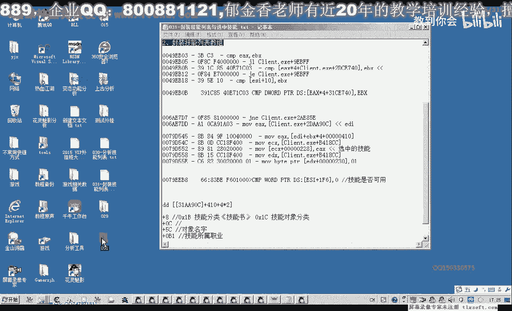
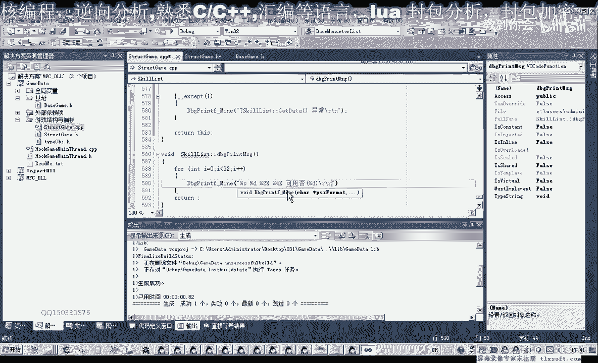
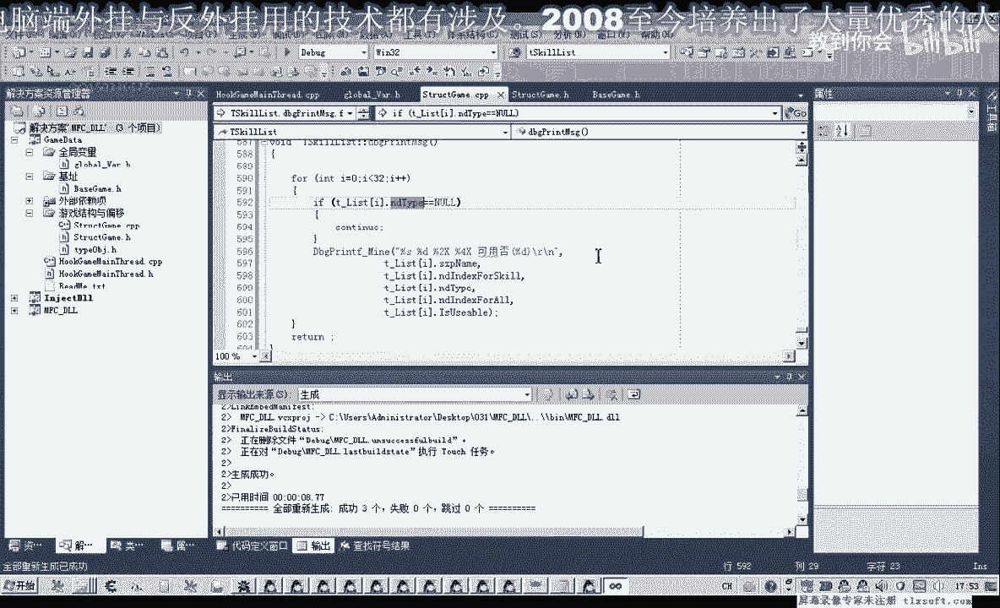
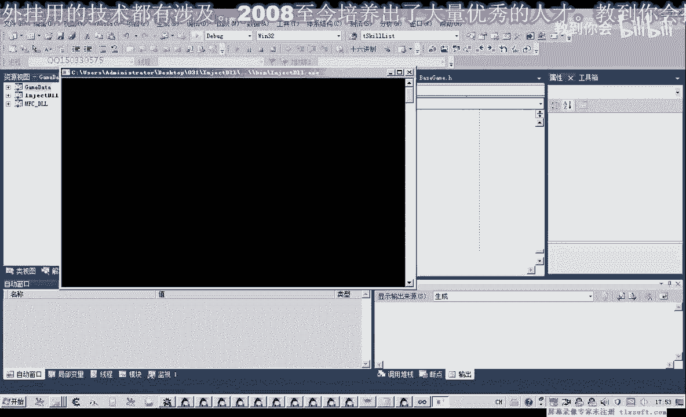
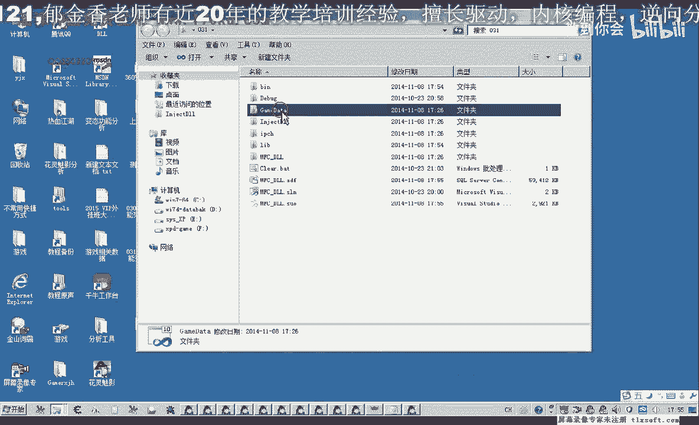

# 郁金香老师C／C++纯干货 - P20：031-封装技能列表与选中技能 - 教到你会 - BV1DS4y1n7qF

大家好，我是郁金香老师，那么今天呢我们对技能列表以及技能对象呢进行一个封装，那么打开第29课的代码。

那么首先我们展开我们的机子单元，添加我们的技能列表的机子，啊，那么技能列子的呃，技能列表的基础添加之后呢，我们再展开我们的结构单元，添加智能对象，那么智能对象我们看一下嗯，这几项属性给它添加进去。

那么添加之后呢，我们先注释掉三个说，那么第一个呢是它的一个分类，那么第二个呢是一个数组的下标，所有的所有对象，数组的下标，那么第三个是对象的名字，那么最后最后一个对我们有用的呢是这个技能是否已经学习了。

它是一个物流系统的职业，这个呢但是只占两字节，可不是我们初始化的时候，读的时候要注意，啊，那么除了这几个属性之外的话，我们还要给它添加一个属性，也就是他在这个技能里边技能列表里面的一个下标呢。

我们要给它添加进去，嗯，好的，那么我们保存一下，接下来呢我们建议了对象之后来定义一个相关的技能数据，那，么这个技能数值，我们看一下它的一个大小，1234，这里是八个八字呢，也不是32数字的大小。

那么它的类型呢就是我们的这个技能，那么然后呢我们还要对它进行一个相关的初始化，对这个技能数据，然后转到我们的设计是当年移到最后，然后把这个几个相关的属性做出来。

啊那么我们就要对这里面的这些偏移来进行一个相关的初始化，那么初始化的时候呢，我们要再看一下这个公式，好的，那么然后呢我们要对内存进行一个相关的读取操作，那么在这里呢我们做一个相关的日常处理。

那么首先呢我们先取出前面的数组的一个基地址，那么后边呢这里是数组的一个下标，顺着这个下标i那我们先定义一个变量，好，那么这个变量呢我们就用来指向这前面的这段地址，那么首先呢我们是读出这个机子。

好那么这样呢我们把这个机子呢就读出来了，那么读出来之后呢，我们还要加上这个4100的偏移，那么这样呢我们这里我们需要进一层指针，需要进一层指针，好那么这样读出这个数组，最后呢我们还需要给它加一个括号。

把它转换成指针的类型，那我们再来看一下啊读书前面这一段，然后加上我们的410编一下，这里还需要一个防护器，好那么这个数组读出来之后呢，我们就可以对它进行一个相应的片假a哎。

那么数组的大小呢是刚才我们看了一下，是32嗯，下次，那么首先呢我们对相关的数据来进行一个复制tmal啊，第一个我们是它相应的一个下标，jpm下载，那么复制为i。

那么然后呢再是我们的这个类型对象的对象的类型的话，我们就需要用这个数组，那么这个数组呢它取出来是对象的基地址，那么这个地址呢我们需要加上一个相应的偏移0x08 ，这样呢就直到我们的分类这里了。

应该是放这里，那么直到这里之后呢，我们还需要呢把它当成一个整体来看看，这那么需要图书里面的一个地址，好那么这里读出来之后呢，我们后面呢我们可以复制一下，那么写法也是类似的，这是所有数组的下标。

那么呢它是0x0 c和这个题，嗯然后我们就是它的名字，那么名字呢这里呢它是掐着这个类型，而且它的数据呢它本身就是一个指针，所以就不需要提出来啊，这个这个偏移是c，那么还有一个它是否可用。

那么这个它是两字节的，那么我们要注意一下，这里这是word的，只能读两次，解读多了的话他也会啊，这个数据来显示就很乱啊，不会是我们想要的零或一这两个数字，咳咳咳，那么也取出对象的基础。

再加上我们的偏移x t和六，我们看一下，大概就是这几个偏移，那么在读的时候呢，我们说的这个1b这个类型的话是我们不需要的，我们需要的是技能对象是连x1 c的，那么所以说在这里呢我们还要做一些判断啊。

那么第一个判断呢我们就是还有一部分它是为空的，这里面没有对象黑黑的，那么为空的话，我们也要做一个判断，就要判断相应的这个数组和对象取出来它是否为空啊，那么如果它为空的话，我们这里呢就继续下一轮循环。

那么后面呢我们还要加一个if语句，那么这个if语句呢我们是来看它的这个对象的类型，也就是这个数据它先读出来，我们懂了对吧，这个这个数据就在前面，那么如果读出来他的这个类型啊，如果是等于多少呢。

等于我们的0x1 b那么这个也我们也不需要把现在在里面啊，你继续下一轮的一个循环，继续下一个循环，或者我们就直接用这个数值来表示，看，我们先把它读出来哈，进行一个判断判断，如果不是ec的这个类型的话。

那我们就继续把下面的一个循环，那么在这之前我们还需要对整个列表来进行一个初始化，zs就是个对象，过年来初始化，当它的大小来源就是这个结构的大小，嗯，好那么这里初始化单元的话，这样我们就写完了。

加上我们看一下这一句，你可以说对了，这里我们需要一个尺寸的那个转换，转换了之后呢，我们就可以少了一个新号，那么这里完了之后呢，我们再添加一个相应的呃打印信息的一段代码，那么这个打印信息的话。

我们也可以直接就可以骗离呃，整个对象数组，那么打印的话我们就用我们的调试信息这个函数来打印，那么首先呢我们是它的名字嗯，名字之后，然后是它的一个下标下标，然后是它的i t i t呢类型是类型。

然后再是数组的i d，还有是否考用。

那我换一个行也是，那么这里少了一个t secure，那么我们只需要在前面呢初始化一下就行，那么在这里呢就不需要每次都调用这个函数，但是我们要知道使用之前呢要初始化一下，不然我们就用这个指针的方式来调用。

就像嗯做这种方式来调动我们的这个数据，但如果前面经过一次初始化呢，我们就可以不写这个前缀，就直接用里面的这个数据就可以好看，然后呢是它的名字，那么名字过了之后呢，是数组的一个下标或kill。

那么这个下标过了之后呢，是它的，所有对象数组的1i下边我们就把它叫做it这大，然后是是否可用，那么就是这四项应该还有一项，先我们看一下名字，那么这个是它的下标啊，这个是类型，还需要一个类型。

一九泰国什么，好那么就是这几项，一共五项，我们编译一下，那么这里我们找了一个tk，kiss kill lis，好那么这里写成功了之后呢，我们需要定义一个全局的一个变量，一到函数的程度。

全局变量实际上我们最好的做法，我们是加一个g的一个情绪，然后我们把它加到啊全局变量单元，啊，那么既然这里我们加了一个g的一个前缀，这里呢我们全部都把它加上，这样的一个命名规则都要好一些，世界上的内容。

哈哈哈，哈哈哈哈，那么刚才我们替换的时候呢，我们没有啊，没有注意这个大小写的一个区分，所以说出了一些错误嗯，我们撤销一下，啊，先编译一下，真的，好，或者我们要替换的话，就要注意这个大小写。

如果因为我们前面和后面的这个命名的话，刚才是一样的，然后我们再移到它的一个头部啊，做下相关的一个修改，这里呢我们把tm去掉啊，再重新编译一下。

那么这里呢我们要注意一个大小写的，一个匹配的啊，注意一个匹配。

嗯，不错，好然后我们再编译，这次应该就不会出错了，四三，那么编译成功的时候呢，我们还需要切换到这个测试啊，这个消息这里我们添加相应的测试代码，哈哈哈哈哈，那么由于它里面本身这个第八个point啊。

max前面本身它有初始化的这个代码本身加了的，所以说我们可以不用标题的题啊，当然使用啊，先初始化再调用呢，这是一个好的一个习惯，但这里我们不加的话，我们就需要用这个第八个问题。

因为这个或者我们都这里不做一个初始化，都一个做一个相应的一个约定，那么在这之前呢，我们都用这种gt代替的方法先初始化，然后呢再来使用，二，好的，然后呢我们进行相应的测试查看，全是信息化解到主线程。

嗯然后呢中间它有一些数据呢也打印出来了，因为他没有做一个相应的一个判断啊，那么我们还代码来进行一个相应的优化，那么打印单元，再做一个判断，那么我们做了一个什么判断呢，如果他的这个类型的话。

都是我们赢的话，说明没有向里面写的数据，那么在这里呢我们就讲听了个就不打印相关的啊，他没有信息的，我们就不答应，或者用这个名字来做一个判断也是可以的，然后我们再重新编辑一下，或者主线角，然后打印出来。

看一下，可能听的人听的太多了。

再执行一下。

看起来应该是正确的问题，你看一下nd type我们有没有普及听，啊这里我们nd type本部又复制，我们刚才把它移动到前面去，所以说造成了所有的一个数据也导不出来，那么nd太婆呢它等于加八这个偏移啊啊。

这下就应该可以正常打印出出去。

那么可用的来一共就是这几个技能，前三个这里有一个，最后这里有一个，我看一下是不是这里嗯，它的下标分别是1231203，这里是四五，那么五是不可用的，六可用啊，呃最后呢我们倒数回来，这里是313029。

那么第二次球都可以用，最后那个不可以用，那么这前面的这个这个书呢，这个对象呢他的c1 b，所以说就没有偏离它，它就被忽略掉了啊好的，那么今天的这个呃代码的封装呢，我们就可以执行到这里。

那么以后呢我们就可以通过这些条件来判断某些技能可用，那么我们在使用技能的时候呢，我们就可以用到这些相关的数据，那么在下一节课呢，我们就呃就封装这个选中的呃。

这个技能怎么把它啊移到这个会快捷栏上面找相关的数据或者是扣，那么大家这个也可以把它当成是一个作业啊，再去做一下，那么我们把今天的代言先进去。

那么这节课的作业啊，就是去分析一下，哈哈因为这个游戏的话，它这个对象呢直接我们在这里面的话，这样直接是不能不可以掉鱼的，必须要把它放到这个上面的才可以调用，当然也不是说绝对不可以。

那么我们可以通过发起相应的红包啊，也可以来调用它们也是可以的好的，那么我们主要是学一些分析的方法，那么下去之后呢，大家看一下，就怎么把这个过程把它嗯用相应的库或者是数据来进行一个事情，来进行一个实现啊。

啊这个相应的考验技能移到啊，下面的这个f一到f60 的这个技能列表里边，技能栏或者叫快捷栏啊，好。

