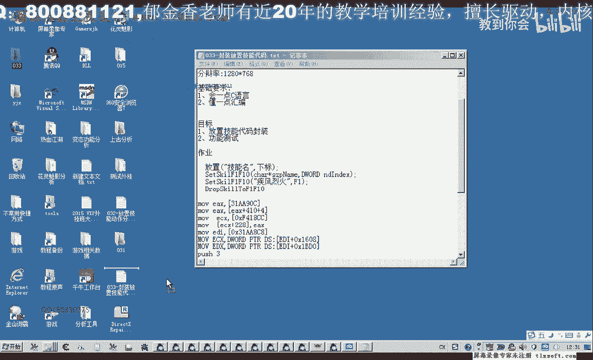
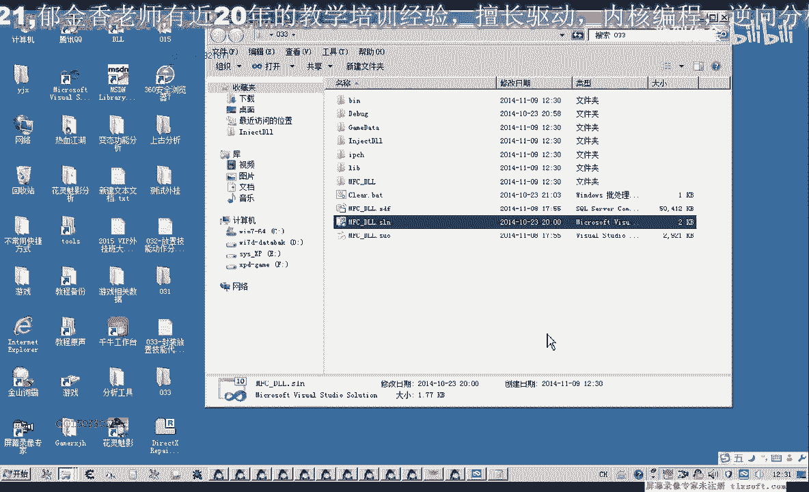
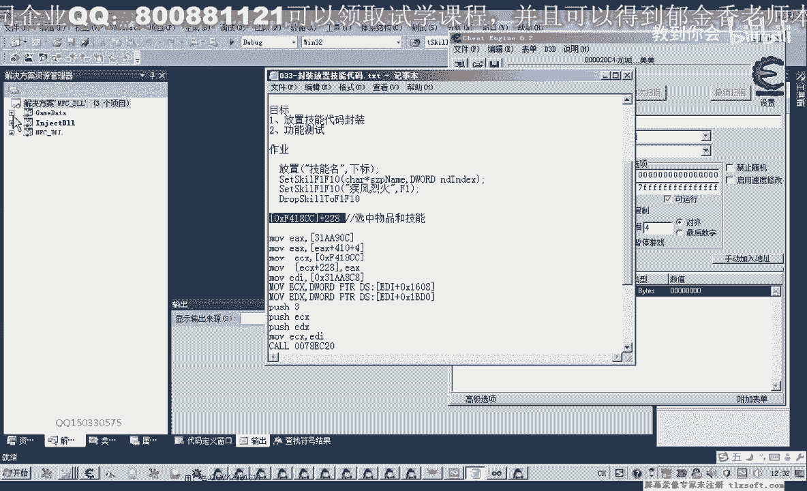
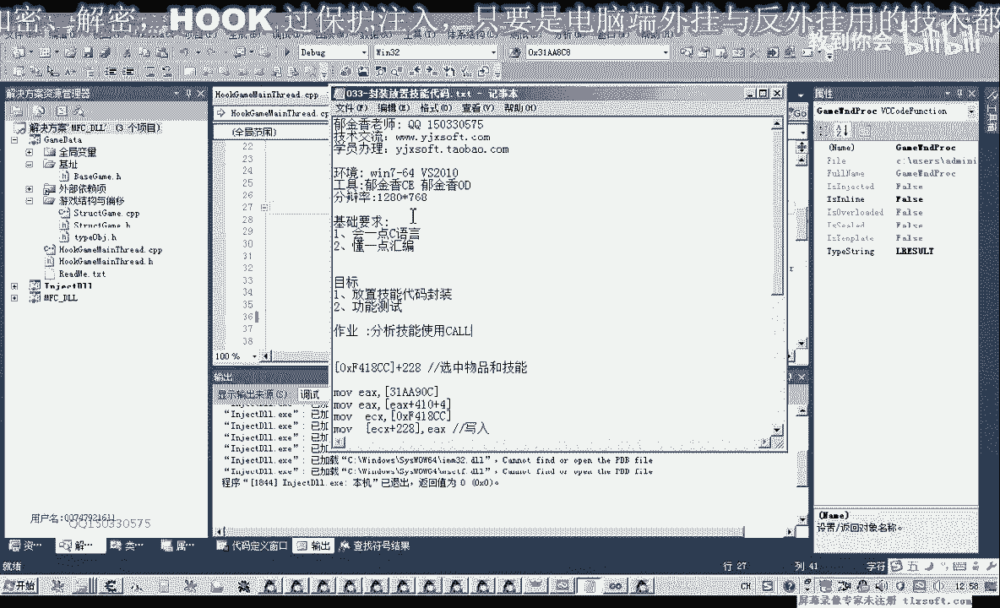
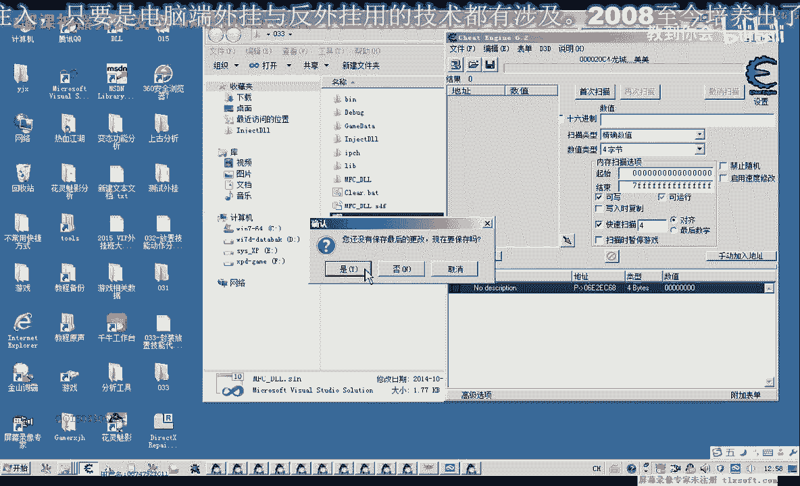

# P22：033-封装放置技能代码 - 教到你会 - BV1DS4y1n7qF

大家好，我是郁金香老师，那么我们在上一节课分析了放置技能的功能，这节课我们对相关的代码进行封装。

那么首先呢我们添加一个机子啊，这个是一个新的机子，这是选做技能对象的，那么这个机子呢可能在选中我们背包的机子的时候，可能它也有效啊，那么我们现在做一下测试，这个机子，会加到游戏里面。

来看我们打开我们的背包，那么我们选中这个药品的时候呢，我们发现呢这里呢看着也会有一个，选中药品的时候，还有选中选中我们背包或者是装备啊，这些呢它都贵，有一个对象的地址往这里写入，所以说这个它不是技能啊。

不是选中技能专有的，不是选中啊，选中物体专有的转移，选中物品或技能，但是呢这个呢他又不能够选中我们挂一部什么啊，比如说我们选中自己，这个呢它没有行业，或者是我们选中怪物啊，这个有选中怪物没有关系。

那么选中怪物我们是用的一个数组的下标，那么这个人物品和技能呢我们是一个对象好，那么我们添加这个机子，先展开我们的机子单元。

那么我们这里是选中的啊，物品我记得，那么然后我们再来添加下面的功能代码，在上节课呢我们已经写了相关的代码，这节课我们要把它转转化成啊c语言的这个代码，那么我们试一下这一段代码。

那么这个函数我们先展开我们的结构单元，看添加在什么地方呃，选既然是选中技能的，那么我们就暂时把它这个相关的函数呢，把它放置在我们的技能列表里，放下我们的技能对象，到f一再f10 。

那么这里呢我们要呃有应该有两个参数，一个是我们技能的名字，技能的名字，那么第二个参数呢，我们应该是放置在这个f一到f 10的这个数的下标，啊应该有这两个参数，具体放在某一格f一到f 10。

啊然后呢我们把这个复制一下，添加到我们的代码单元，那么首先的话我们是应该是要找出啊找出这个技能的对象，要通过这个技能的名字在我们的这个技能列表里边啊，找出这个对象。

那么然后呢把这个对象呢写入到加288这个偏移写入到这个地方，好那么我们还是把这段代码复制一下好吧，还会考，呼呼，否则最后我们注释掉，那么首先呢我们是通过这个名字找到这个对象啊。

或者说是取得还有相应的一个下标也可以，那么我们可以呃要偏离我们的技能数，首先我们在偏离之前呢，我们做一个初始化，在这里我们先初始化数据，然后我们再偏离整个技能内容，9898，然后我们取出它的名字。

那么这个名字来由我们传进来的这个参数的名字呢，我们这两个名字来放在一起进行一个比较，那么如果这两个名字它相同了的话，那我们就取出相应的一个对象，当然最好的办法是怎么样呢，我们这里还要去计算的话。

比较麻烦，最好的办法我们是在呃这个技能对象里面再添加一个属性，那么在这个技能对象里面呢，我们再添加一个属性，再添加一个什么属性呢，再返回一个它的一个对象对象的一个积极啊，就这样一个属性。

那么我们就用不着再通过下标去把它算出来，然后呢我们进入到它的初始化部分，那么在这里进行初始化的时候呢，我们首先呢就初始化它的嗯一个机制，我这叫错白，对不起。

那么这个机子的话就是我们啊取出来的前面的这个nd list，再把这个名字修改一下，把头文件单元，那么在我们编写代码的时候呢，我们就可以直接用这个机子了，在这个地方我们就可以直接用这个气质。

那么如果偏离到了之后呢，我们就直接就什么呢，就写入，然后就退出，就写作我们相关的，这个地址，那么这里呢我们就直接用汇编写，用，16，加上x258 这里的偏移哈，然后再写入我们的对象。

但是要先把对象取出来，应该，那么取出对象的话，也就是我们tlist啊啊对，但是我们这样学的话啊，在汇编里面他好像是不支持这样的一个网数据访问方式，我们需要另外再定义一个变量，嗯嗯，哈哈哈。

好那么这里呢我们就取出相应的一个对象的一个机制，那么取出来了之后呢，如果这两个相等，然后我们就写入到这个2688的地方，啊这样我们就是写入了，但是如果是整个循环完了之后，我们都没有找到的话。

那么我们就返回来，啊如果成交for循环都循环完了，那么循环完了之后呃，如果我们这个nd base它还是等于等于这个空等于零的话，那我们就直接就反过怎么，那我们就返回fs。

就是说放直放置我们这个技能对象呢失败啊，这个可能调用失败了，那么如果这个不为空，那么我们继续执行后面的代码，那这前面一部分我们已经相当于已经完成了，就是这个我们去完成，那么接下来就是后面这一部分。

后面这个模拟只是加入这个空调，这个空，那么这个库的调用的话，我们直接嵌入汇编就可以把这段语句呢我们把它再修改一下，那么第一个呢这里要改一下啊，首先我们这个机子我们用红来替代它。

你看一下这个机子我们有没有添加相应的这个红，在这里来找一下啊，这个我们也需要添加一下，它是相应的一个机制，相当于是这个放置技能课的，参数，那么我们也添加在这后面，哈哈哈不是，参数这个是它参数相关的机制。

啊还有一个是我们放置技能扣这个机制，我们聊天一下，来过，啊或者是我们修来的，把它写好了之后呢，我们把它复制一下，用相应的代替，那么这一行呢我们可以写成两句啊，首先把这个词放到我们e d i里面。

然后呢我们再取出这个eti x是有了个数字，这样写，或者写成一句的话，我们就需要加这个d word加ptr的一个前缀，那我们先就这样写，然后呢在后面这两句呢我们就可以不改动它，这里我们也不改动。

那么要改动的就是这一句，那么这个括呢我们首先把它放在ex，rocare啊，然后我们过一这样的编辑才能够通过，我们不能就直接扣，还有就是这个下标的问题，下标的话我们就是通过这个参数传进的。

当然这里呢我们最好是先放到我们的寄存器里，再放在剖析他直接啊呼吸这个变量的话，有可能会出错，那么我们再编译一下，哈哈哈哈，对了这里我们缺少一个汇编的这个相应的总用于限定，好再编译一些。

那么还有一个就是异常的处理，那么这里呢我们也加上相关的一个调试信息，哈哈哈哈，那么如果是出现异常的话，这里我们就直接就返回了，然后fast也是放置不成功啊，如果是成功的话，我们会处。

好那么接下来我们进行一下相关的测试，然后我们已经到测试单元，那么这个测试这里呢我们就是get data，这里打印信息我们就不用了，就直接是，然后呢后面就是我们的技能名字，然后比如说我们放置到第三个。

它的下边就是2米，然后我们放置这个疾风端木疾风残影呢，我放这个疾风残影到第三个，把它再编译一下，哈哈哈哈哈哈，好然后我们进行测试，那么第三种没有放置技能，我们化解主线程，那么我们看一下是哪里。

这里出现了异常，那么我们看一下我们代码哪里出错了，88取出来的，r c c我们看一下怎么学习班，in sex加，那么在这里呢我们还需要加上一个判断，好爱，那么如果呢相应的像我们没有啊。

就是他的i d或者是它的类型，如果是无理的话，如果是空的话，那么我们就继续下一次循环，那么要加上一个判断啊，如果没有这个判断的话，那我们来执行后面的话可能就会出错，好那么我们再重新编译，再测试一下。

哈哈哈，然，后呢放在主线层放置，然后我们看有没有成功，那这个时候汉字呢失败了，嗯疾风疾风产品，那么我们再看一下啊，消息是传过去好，然后我们看我们的名字是否团队，棋风残影，我放在第三个世界，哈哈。

还有我们看一下它的地址是否取出来，去正确的这里取出，放到地址，写到这个机子里，那么我们先把后面这一段代码，先帮我看一下啊，取出来，然后我们传参数的1602561356，五第二。

那么看它是不是在这个地方放了，他没有找到匹配的字串，我们这里的条件少了一个零啊，因为相等的话，它是几个名字，这样犯了一个错误，好，好，那么我们再来编译一下，挂件竖线程啊放松，然后再切换到游戏里面看一下。

那么这个时候来启动成语呢，对他就是已经放到了第四个，然后再点进行，那么这个时候呢我们测试了就是成功了，好的，那么如果我们换一下啊，疾风端木或者是疾风烈火，来看一下，放在第一，这个人可还有图，疾风烈。

那么这个价格是五的话，我们是放到了第六个，把其分裂孔放大，好，那么就是，挂件主线程啊，放到了第六，好的，那么今天我们的代码就写到这里，那么下节课呢我们就找这个下面的这个f一到f 10的这个功能呢。

以及相应的技能使用的功能，那么技能放到上面，我们要使用这些技能啊，要用技能来攻击我们的这个怪物，所以说我们还要分析这个技能的啊，或者是相应的一个功能，那么这个呢也先当成是一个坐垫啊，大家下注做一下。

那么就分析一下这个技能的相关的空，好的，那么我们下一节课再见。

