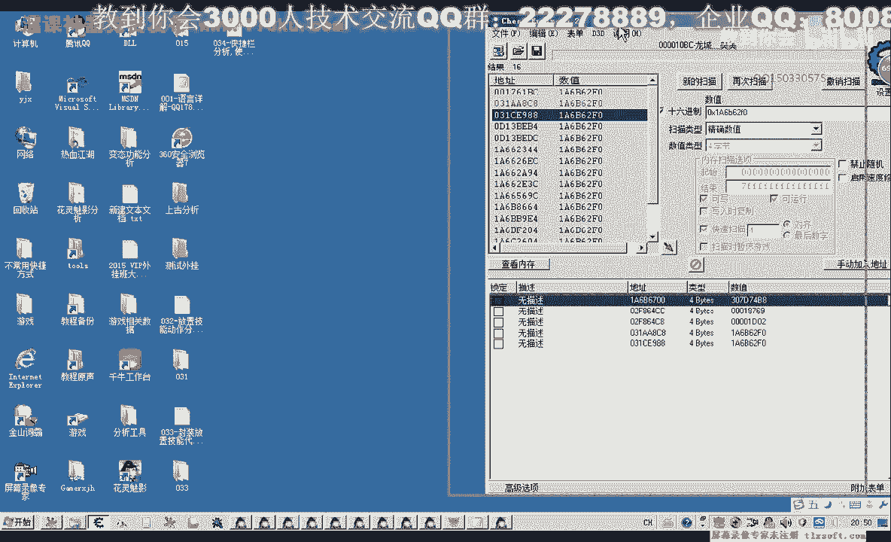
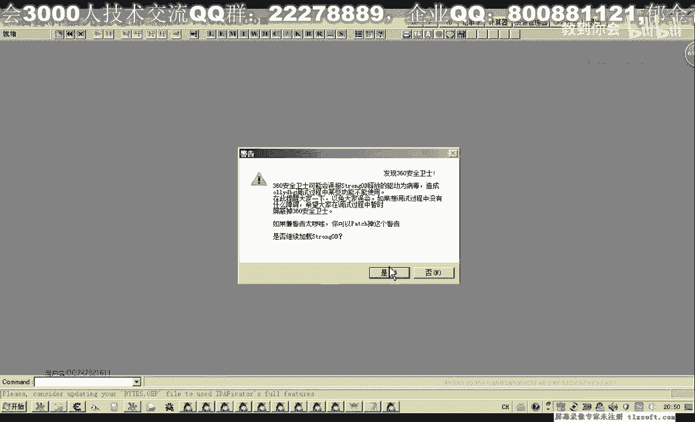
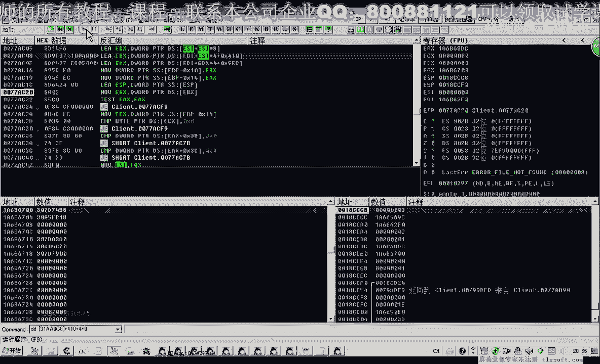
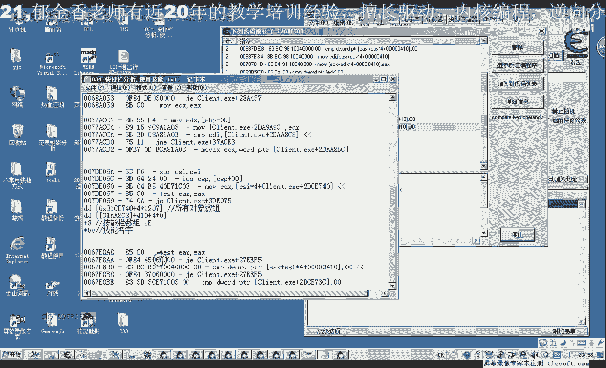
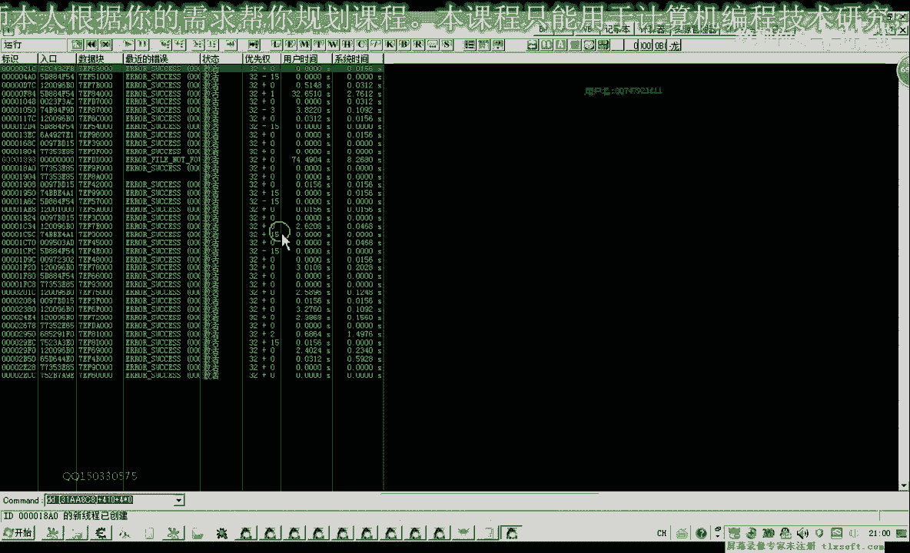
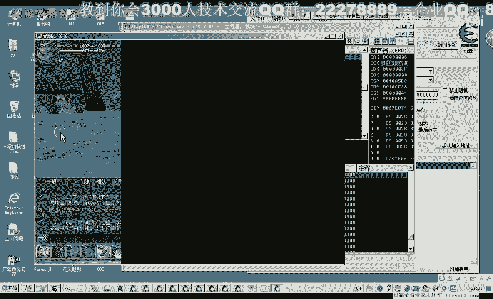
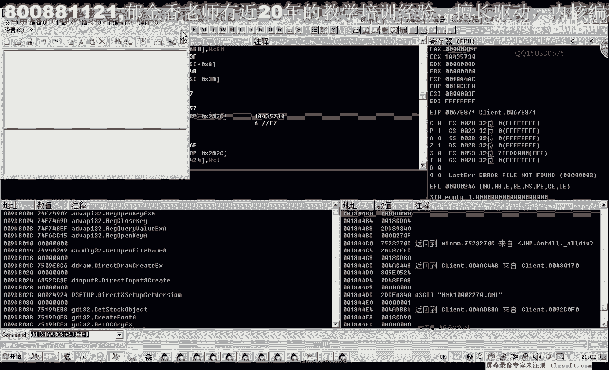
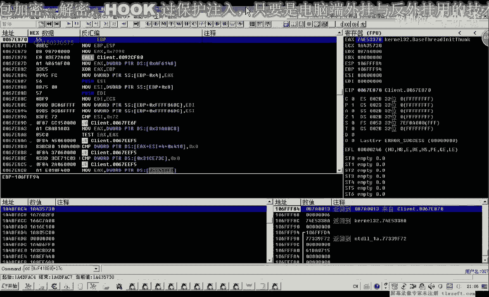
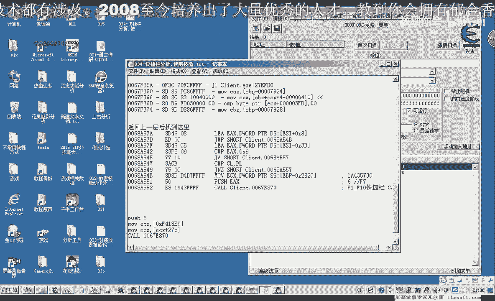
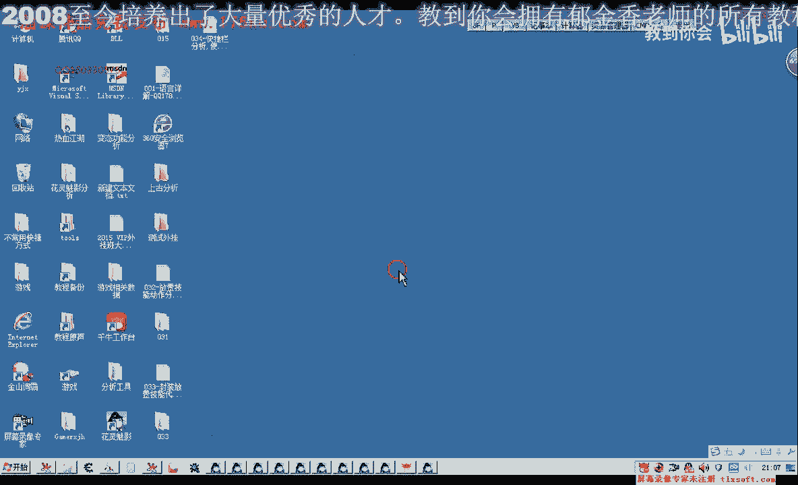

# 郁金香老师C／C++纯干货 - P23：034-快捷栏分析,使用技能 - 教到你会 - BV1DS4y1n7qF

大家好，我是郁金香老师，qq 15033657，欢迎大家参加郁金项技术编程培训，那么今天这节课呢我们一起来分析一下快捷栏的数据，分析，所有的目的呢是分析技能的一个调用，那么这个游戏的话。

记得呢它需要放在下面的这个快捷栏上面，然后点我的右键或者是按相应的f一这个功能键的，才可以调用相应的我们的这个技能，那么所以说我们可以呢，也就是说在使用技能的时候。

他肯定要访问这个所谓的啊成熟这个对象的这个地址，这个地址的话f一到f 10的话，很有可能是一个数组，就像我们的背包数组技能数组一样，那么所以说我们可以先尝试一下，找一下有没有这样一个数据，有的话。

等会我们可以等一会，我们可以从这个数组呢来一下啊，来回溯找这个技能的使用扣，那么我们先打开c找这个技能数据啊，快捷栏的这个数据，啊那么我们先附加到相应的进程，那么这些呢我们是收未知的初始值。

然后我们让我们以这个f一啊，我们先找f一这个变量的地址陈述这个对象的地址，那么我们往f一在上面呢移上去一个东西，那么这个数值呢肯定就变动了，但是它只变动了一下，然后我们没有去改变，它就是未变动的数字。

因为变动的数字我们可以修很多次，好我们可以在里面走上两句话，然后再说会变更的趋势，可以去改变一下其他的单元，但是在第一个了还是没有变，还是收入变动的数值，那么然后呢我们把它移开，这个时候呢它变动了。

我只想变动的数值，然后再升未变动的数值，然后我们再移动一个对象到f一上面，这个时候它的数据的变动只有变动的数值，只剩一次，再稍微变动的数字，移开之后再移回去，再交换一下，是变动的数字。

现在这上面有有这个对象存在呢，而且这个数字呢他应该比你大，所以说也可以在搜一下丙丁大的数十，再收为变动的数值，啊好再把它移开，那么移开呢它很有可能就是用数据零来表示这个地方是空的，那么我们再搜一下主题。

那么这样说出来就比较少，然后我们再把相应的技能放到f一上面，这个时候呢这个这个这个啊是有数据的，我们看一下16进制的值，这个那么我们都知道地址的话一般都是定位啊，定位16进制的数量来表示一个地址。

那么所以说的话这两个的话可能是表示的i p啊，也可能是那么可能性最大的呢是在第一个啊，我们先因为它的数值呢看起来更像是一个地址，那么我们先找一下什么地方的代码访问了这个地址。

这个时候呢我们就可以来找到一个数据，这里呢是一个数组的方法，我们哪个方式，那么这里ex是机子，这里ec x是机子，那么ec x的值呢，我们把它记录一下，mix 1 a6 b16236401 16性质的。

这个要勾选16进制，然后我们能够找到这两个地方是一个机子，能够找到一个机子，再来个电话，那么我们先把它记记录一下这一段，刚才这一段我们这里写出了一个对象，但是我们，锁入动向是快捷栏，会。

那么它的这个机子的话就是这两个当中的一个，那么我们再来看一下谁是他真正的机子，那么这个时候呢我们看到这一段，这个clint e x e加上什么，这个就是它模块的机子加上这个偏移。

那么实际上这一句呢它里面包含的肯定就是机子，那么另外还有一个我们看看有没有事情，那么这个呢它也是一个机子，但是呢后面跟了一个e e s i s4 啊，那么这个呢它是一个740，这个我们印象很深刻。

但是我们数组的真正机制应该是这个字，这个那么也就是这个312848，哈哈哈哈，加410+40，我们的下标，好了，那么我们机子现在找到了啊，接下来呢嗯我们用d来看一下。

说那么打开我们的d。

附加到我们的游戏进程，嗯嗯，那么附加到游戏性质之后呢，我们看一下这个所谓的技能啊数据，那么前四个我们放了四个技能对象，那么前面四个呢就是四个地址，那我们改动一下，那么改动一下之后。

我们发现这里也空了三个，那么大概它就是我们的这个快捷栏，在这个数组，然后我们再用第一次进去看一下对象的名字，有些，真的，前面我们少加了一个括号，这里还要加一个括号，把地址取出来。

那么我们能够看到第一个对象，这里有个月影，让施展对象为1~69级啊，就是这个对象，那么第五个对象呢，我们看它的下标是四，那么我们看一下它的偏移的话，那么之前呢我们也有分析过啊。

还有一个c的偏移在背包对象和那个技能列表里面啊，那么这个呢对象呢它也是5c，这个地方是技能的人进，那我们加上cd啊，计量的文字，那么我们看一下它的类型是什么，去掉50偏移，那么它的类型又变了。

它的类型呢是1+8这个地方，这是机器和对象，那么这个上面除了放技能呢，它也可以放我背包里面的那些作品，也可以放放到里面去，那么我们换一个看一下，下边是一，这里就是fn这个地方放的是什么。

还是音译成长加50，这个地方呢tc啊，你三声变，嗯知道，那么在这里的话就应该是我们说的那个740那边的这个数据，这个地方所有所有对象的这个数据，那么我们来尝试一下，那我把一si来改成这个下标。

我们来试一下，加四乘以下标的话就是这个107，交换零七，那么按下回车之后呢，我们发现了刚好是指在指向这个地方，那么它加57的地方呢也是33指向的地址呢是同一个地址，那，么今天我们认识了一种新的类型嘛。

就是一是快捷栏的这个数据，我虽然是进了名字，那么目前我们所要的就是这两个地方啊，就是这两个属性，那么我们就够了，那我们在使用的时候呢，我们只要能够偏离到这个名字就可以，那么接下来呢我们就要就来看一下嗯。

他在这个时候我们可以先在指定的对象上面下一个断点作为尝试，那么我们就就以tq对象为主了，那么我们在上面下一个按键访问的断点，切换到游戏里面看一下，这时候我们按一下f一试一下，那加f一没有反击值。

那么我们把这个断点先删掉，那么我们用内存啊，内存访问的断点来试一下，那这个路程访问的重点，我们发现你试之后呢，他马上就会断下来，这个数字放慢之后，他为什么会断下来，因为他平时他在显示我们嗯显示的时候呢。

他也会去访问这个技能数据，那么访问了之后，他才知道第一格，这上面的应不应该显示相应的这个图像啊，那么所以说这种我们要找的话，我们还是要把og先退出来，借助我们的c a d来找看有哪些代码访问的网。

那么我们先删掉这个，这是机子，那么这是我们第一个f一对象刚才找到的这个地址，这个是f一那-1对象的一个地址，那么我们把它移开之后呢，他就会赢啊，你上去之后他就有，那么这个时候我们按下f一的话。

那肯定就会去访问这个地方，那么附加调试器，那么附加调试器之后呢，这个时候有很多地方在不停地访问它，但是这个时候当我们按下f1 ，按一下f一之后，那么新增加的这些呢就应该是在我们使用的技能周围的啊代码。

那么这后面的这一串都是我们按下f一之后才出现的代码，它并且只用了一次，还有现在比较比较这个相应的对象，f依赖的地方呢也没有放这个对象，那个兑现了是否为空，如果不为空的话。

可能呢他才执行相应的我们的就是技能，那么我们先把它记录下来，这个状态，那么有可能就是在他的后边，后边就是我们的相应的技能的一个这样轮廓，那么也可能是下一个，那么这几个呢我们都记录一下。

需要一个一个的尝试，但是我们能够看得到啊，都是67e开始671，这是67f，那么所以说像这种的话，我们记一个就可以了，那么这个六cf呢稍微要远一点，我们进行这个，那么再往后面移啊，也没有了啊。

就只有这几个，好的，那么我们再次把这个调试器取消掉，取消掉之后呢，然后我们还是用我们的o t来找一下，巧克，那么刚才我们已经用c一的话，应该是找到比较关键的代码附近，那么这个关键的技能调用库的话。

它就在前后左右上下这几个地方，那，么我们先转到第一个地方去看一下，那么第一个和最后一个呢它的可能性比较大一点，那是这这个后来是第一个啊，它首先呢会比较我们相应的，那么这里呢有一个下标g e s s下标。

那么这个下标它是怎么来的啊，我们找一下，那么ui的话它是来源于一个bp加八，那么bp加八它是上一层的一个参数啊，那么我们在这里下一个段来看一下。

那么这个时候我们按一下，啊比如说按下这个f7 ，那么按下了f7 之后呢，他就走到了这里，那么f7 的话，这里呢它的下边呢我们就啊那么回到上一层，这里呢啊汇编窗口图当中跟随。

那么这个ea x的话恰好就是传进来的下标f7 就是六，那么在这样的一个库的话，它是不是代表就是按下了我们的f7 ，另外我们看一下e4 x的是这个数值，这是ex的数值，然后我们让它跑起来。

然后呢我们再按一下f5 试一下。

那么f5 之后呢，我们看ex的质量模式，这里呢参数呢进来了解为四，让它把它运行起来，那么我们可以做一个尝试，按解控退回到这个阶段代码。

那么我们可以就测试一下这个库，它是不是就用了相应的啊，调用了相应的格数，调用这个库之后，复制一下这个过，用我们的代码输入器编写一下代码，那么比如说我们复习一是不是就是使用的f2 ，还有一个ecx的值。

我们看一下ec x的值，我们在这里下一段看它是时候每次都会变，那么我们再按一下f43 ，试一下f3 ，这里没有东西，它也会断，在这里我们看一下ec x值，那么ex的值没有变。

那么我们可以做一个有效的参数，按下f2 取消断裂的，把ec x的值复制出来嗯，然后我们诸如在游戏里面看一下，那么f2 这里呢是这个野山参，那么我们注入成功的话，它就会使用它。

那这里也生成的数量呢从120减到了119，那么我们换一个f7 ，这里我们就试一下，那么我们选中一个怪物，啊然后我们发现了我们相应的技能呢就可以使用，那么证明的话这个库呢就是我们所要找的课。

就在它的上一层，就在它的上一层，那么我们把这段记录一下，那么还有一个就是关于这个ecx的机子，那我们是通过啊，通过这上一层，然后呢就找到多种点地，那么就就找到了相应的扣，那么我们再进入这个框看一下。

那么我们实际上调用这个库的话，应该有两个地方，一个是我们在用按f一到f 10的时候，还有一个呢我们是用鼠标右键在上面点击的时候，他这里也会断下，也会传出一个相应的值数字姓名，那么我们从这里返回看一下。

那么返回的话，我们这个时候呢能够找到一个e4 x的一个机子，就在这个地方，这个过来是鼠标，实际上是一个空，只是它调用的地方不一样，那么这里呢机子呢它就解决了。

那么我们就可以在这里呢我们就能够找到一个相应的机子，当然刚才那个破败他的经历，他很显然影响到加上27c，啊就是我们刚才e c x的值就是这个名字，那么这里改一下的话，我们就可以这样写，哈哈哈，嘟嘟嘟嘟。

啊这样写就可以了，就是调用第六个，那么我们再来做一下测试，当然这里呢它也会传到这个货这里来执行。

好那么今天这节课呢我们就讲到这里，那么下一节课呢我们在对这个技能相关的这个扩展，进行一个相应的代码的一个封装，那么我们下节课再见。

