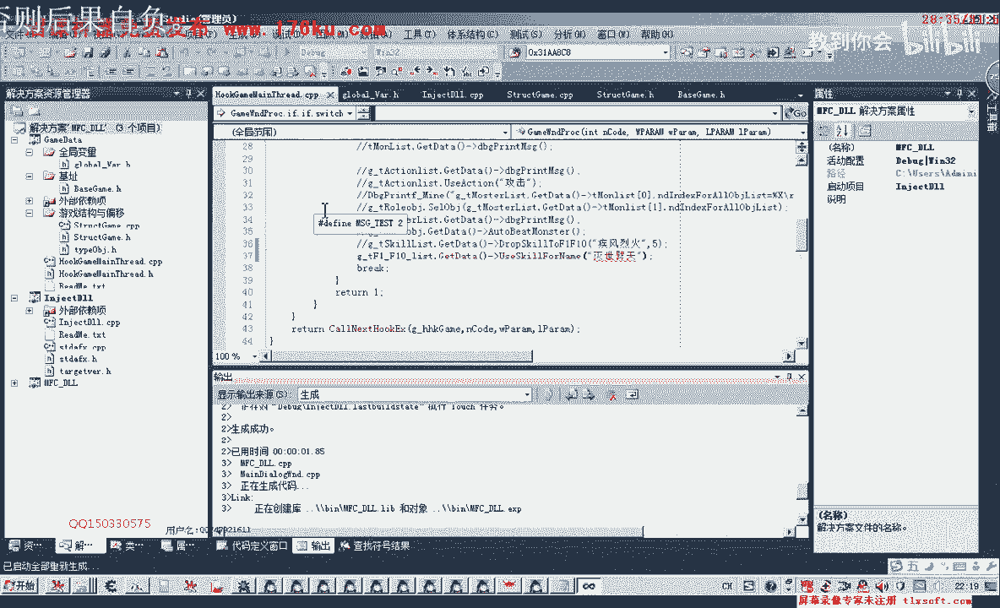
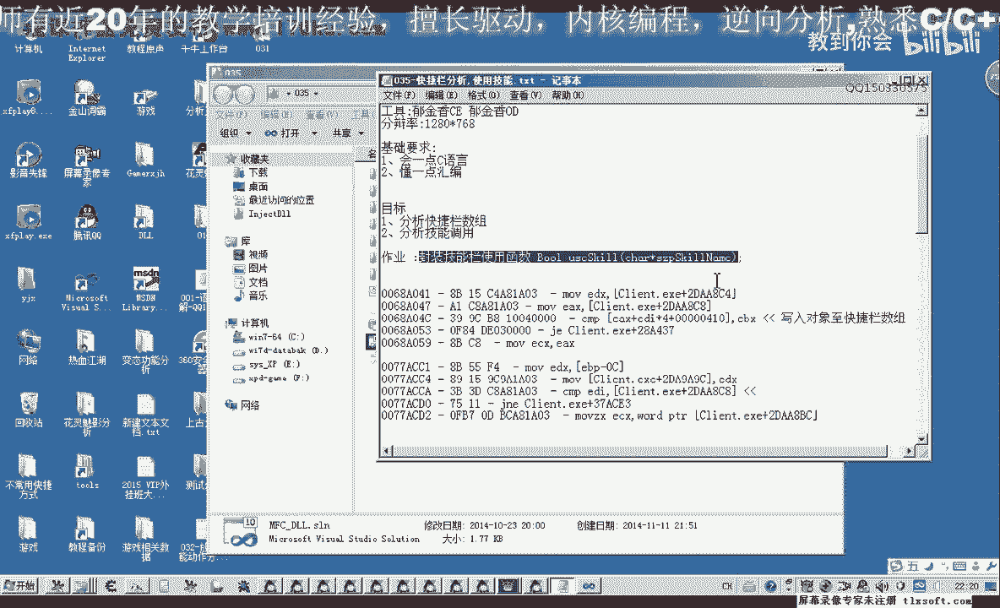

# P24：035-快捷栏分析,使用技能 - 教到你会 - BV1DS4y1n7qF

是郁金香老师，那么在上一节课呢，我们分析了技能的一个使用啊，那么这节课呢我们把这个代码进行一下整理，嗯然后呢我们把它封装成一个函数啊，那么上一节课呢这个是一个作业啊，不知道大家做没有。

那么我们打开第33课的代码。

那么在他的基础上呢，我们进行一些修改就可以了。

哈哈哈哈，那么首先呢我们也是要添加相应的机制，那么一个是我们快捷栏的数据，f一到f 10的这个数组，318 18，啊这个呢我们在上一节课呃，已经添加了这个放置技能的这个参数。

我们看看这是放置技能的参数啊，那么这个参数呢实际上就是我们今天要找的这个技能数组，现在我们才发现嗯，那么我们就可以直接呃另外取一个名字就可以了，对这，那么我们可以把这个放在前面。

然后这里呢我们直接就这样替换一下就可以了，可以了啊，然后更新基础的时候呢，我们就更新这个地，那么另外还有一个机子呢，就是我们相应的技能调用cod这个快捷栏扣，或者像那么我们添加在这里面，好。

添加好了之后，我们看一下还有一个ecx的参数，f41810 ，这个我们添加上，那么这里它需要一个偏移来完成，那么这里我们可以把这个偏移的公式来给它加在，哈哈哈哈哈，好了，那么有了这些准备之后呢。

我们就可以开始封装相应的函数，那么首先我们封装的这个函数呢，嗯首先我们要做的应该是把下面的这个快捷栏数据啊，把它偏离出来，我们看上一节课有没有做这方面的工作啊，有一些我也忘记了，f一到f 10的，八。

当时呢这个只是把它放置到我们相应的这个技能的f一到f4 上边啊，那么在这里呢我们可以来把它一起封装在这个技能列表里边，也可以，另外工作也可以，那么再生们还是把它另外封装一下，太变态。

那么这个技能栏数组的话，快捷数组的话一共是它的数大小是十，那么我们还要定义一个技能栏的对象，那么这个对象的话我们把它复制一下，嗯，那么目前呢我们对我们有用的属性呢就是一个技能的名字。

但是我们也把这个它的类型也加上，一个是技能名，一个是技能的类型，这两个呢对我们有用好，那么我们先进行一下偏离啊，因为我们要判断上面有没有我们的技能名字啊，没有的话，我们还需要调用上面的这个函数。

来把我们可用的技能栏放到我们的技能栏上边，那么我们先获取我们的数据，转到我们的cp p单元，移到最后，嗯嗯，那么移到最后了之后呢，然后我们对这个我们的对象列表来进行一个初始化，异常处理对对对。

那么数组的大小来是10，那么我们是从0~9就可以了，所以说是小于一零哎，加一下骗离我们整个数组，那么在偏离数组的时候呢，我们就要先取出前面的这个机子，先取出这个机制，哈哈哈哈哈，哈哈。

然后呢这个机子取出来之后，我们还要加上饲养的这个偏移，0x4100 ，那么加上面才是最最终它的一个机制，那么有了这个机子之后呢，在里面我们就可以了，用数组的方式来访问，这里我们定义成指针嗯。

想一下定义成指针的话也不太好啊，那么我们还是先定义成指针，当然定义成指针之后，这里我们看把数据读出来，那么这里还需要做一个类型的转换，不好好在后面也要扩散的这个好，那么这样我们把机子读出来之后。

那么后面呢我们就可以用它取里面的对象地址，然后呢我们再用我们的这个列表来进行复制，但在复制之前我们也要判断一下，判断一下我们所取出来的这个词啊，是不是呃为空，那我们先看一下相应的数字。

比如说i那么如果这个值等于空，那么我们呢就继续下一次输，就不执行后面的代码，那么如果它不为空，那么我们再做相应的，那么这个地址取出来之后呢，我们要加上相应的一个偏移，那么第一个偏移是0x08 。

那么第二个平移我们再来，然后再加上一个他的地址，取出来之后呢，我们再加上一个他的圈子里面就是火c啊，那么加上之后呢，我们再进行相应的一个复制啊，当然这两个呢偏移如果是用的多的话。

我们最好的还是建一个偏移管理的一个单元啊，那么当然也可以自己去了啊，把这些偏移了，把它集中在像我们这个机子一样集中在一个单元里面啊，管理的话要好一些啊，那么我们现在我们先不管它。

那后边我们一起来整理一下，那么这里我们复制完了之后呢，呃初始化的工作呢我们就做完了，当然在前面呢我们还要用一个masert，最大兴趣初始化，不是，嘟嘟嘟嘟嘟，好再编一下，那。

么在后面呢我们要定一个相应的类型，给它加上，好那么这里呢我们把相应的这个数据来进行了一个初始化，那么初始化之后呢，我们再封装一个相应的一个使用技能的一个函数，使用我们相应的一个技能。

那么这个呢我们在结构里面先添加啊，1234，哈哈哈哈哈，嗯那么首先呢我们要根据这个技能的名字呢，要先找到相应的它在哪一个要获取一个它的下标，因为我们找到的这个库是用下标来做参数的。

那么所以说我们首先是要定位它的一个下标，那么这个可以单独写成一个函数，也可以就集成在这个函数的公式，那么首先我们来骗你整个teast的这个数据唉，那么取得了它的名字，那么取得他的名字之后呢。

我们与传进来的这个参数呢进行一个比较，那么如果这两个名字相等的话，它的最后返回值呢是零，那么相等的话，我们就在里面呢调用相应相应的这个库功能的这个库，那么我们来看一下我们的这个课。

上一节课写的就是这一段，那么这里呢我们直接嵌入后边几部，呼吸的，这是e x，然后呢我们在第二个参数呢是ec x，b c x，然后呢它有一个，有一个偏移，看一下这个偏移是多少。

那么偏移呢是你应该开始227c这个偏移值，加上第374，那么最后呢进行扩，那么扩的时候呢，我们先把它放到e x，那么这样的话我们就能够调用相应的相应的技能啊，比如说要调用这个疾风灭火。

那么先他会找到它的下标六，然后呢这个六呢传给这个ex进行压栈操作，最后来调用这个库就可以了，那么这个完成之后呢，我们这里也放管理，那么涉及到这个扩的一个调用的话。

那么在这里呢我们也可以加上一个异常的处理，不知，进行一个换行的处理，那么如果是异常的话，那么这里呢我们直接就能带回家，这，里我们多了一个0x，再重新申请一下，好生成成功之后呢，我们注入到我们的游戏。

快去，对啊，我们还需要来进行一个测试单元的一个代码的一个添加，那么在这里呢我们也给他申请一个全局的变量，然后来进行一个套出的一个处理，接下来我们在测试单元啊，hook这里呢进行相应的测试，先get到。

然后呢nekill，然后呢我们这里加上一个几分类，好的，那么我们再重新编辑一下，这里我们注意退出一下，先把我们的og啊也抽一下，看到o d的话，这个时候呢d呢它会加载这个动态链接库的一个符号列表。

那么呢造成它改写文件，改写不了，编译不成功，好这下编译成功了，然后呢我们输入到游戏里面，那么我们要需要先选中一个怪物，然后呢再调用这个技能，那么我们测试了没有成功，我们看一下啊。

看我们的调制器消息传过去了啊，但是可能他没有尽到相应的单元里，那么我们再来看一下我们的代码，use carefully，那么我们转到里面再看一下，技能啊，技能名字我们看有没有这个技能，有疾风。

练好这个技能呃，那么找到之后呢，我们在这里呢给他加上一段调试信息，看下我们的代码有没有执行到这个地方来，当当，好那么重新编译一下，嗯对了，还有一个问题这里哈，那么就是他在比较的时候啊。

有可能相应的某一到数组里面的，它没有这个相应的对象，那么这里我们就取不出来，它可能会造成一个像异常，嗯我们再来看一下前面的一个赋值啊，那么在这里你看在这里啊，如果是空的话，那么直接就跳过了。

那么造成了这个数组里边它也有一些空的一些数据啊，那么所以说在这里呢我们前面还需要做一个另外的判断，啊如果他这个i里面的这个类型或者是名字啊，它等于等于零啊，这里我们也可以用分外表示等于零。

那么直接就写平吧，那么等于零的话，那么我们继续下一次的一个地方，那么两个名字相等呢，我们在执行相应的这个相应的一个扩，好的，那么我们再重新编一下，放进到主线程啊，然后呢我们看一下这个听写。

这个时候消息都没有传过去的啊，那么我们看看一下，可能是前面的代码出错了，再来看一下这个地方，neko，那么可能是执行到头部的时候，由于什么意外，他就返回了这，那么我们看一下这个函数它有没有执行到头部。

这个时候调试，那么这个也是一种解决问题的一种方法，那么我们看一下调试信息，那再重新编译一下，还有我们看一下这个启动项这里面，那么这个启动项目里面他的一个工作的目录也没有设置对啊，这个我没有设置对的话。

应该是注入的时候就注入不了，那我们再看一下挂机主线层，然后再执行它执行到这个框里面啊，然后呢被跳过了，那么这一句呢他没有执行到啊，名字让我们看一下疾风烈火，那么我们看这是名字传错了，这个是，疾风烈火。

这里我们少了四点水，所以说造成了他比较的时候呢找不到这个名字，好再次运行，挂机主线程，然后我们再看一下，放在主线程，然后呢这个时候呢它就能够调用相应的这个技能了，那么我们的测试呢就ok。

那么如果我们换一个技技能，比如说这个劣势劈天啊，我们可以再试一下，再重新编译一下。

哈哈哈，花间出现成，选中一个怪物，当然前面我们选中怪物的功能呢也是形象也写好了啊，已经写过了啊，那么这节课呢也给大家留下一个作业哈，那么就是我们如果要找的这个技能在我们快捷栏上没有的时候。

那么呢大家为它添加相应的一个代码，那么比如说我们这个疾风烈火，它没有在上面啊，那么我们搜索整个列表都没有找到这个技能，但是这个技能他又可用的时候，那么我们应该怎么编写代码来完成这个技能的使用。

那么这个就作为一个坐垫啊。

没事，那么也就是相当于我们在完善哈，这个函数做的就是，完善这个函数啊，呃当谢人口啊，已经学啊，已经学习学习时，让我们来蛋会放在我们的快捷栏上，那么这个时候呢就不能够使用啊。

就需要我们用之前的这些函数来把它放置到我们的快捷栏上啊，那么这个呢就是要完善我们的这个you scared for name啊，这个括了，那么你就是啊要先呢这个时候呢要完善的话。

就先把这个劣势p天放到这上面的空的这个如果这个技能没有在干，没有在这上面，那么呢先要偏离第一个呢，它是有多有对象的，第二个也有对象，那么只能放到第三个啊，这个是算法来自己去算一下，然后放到第三个之后呢。

再调用这个技能啊，好的。

