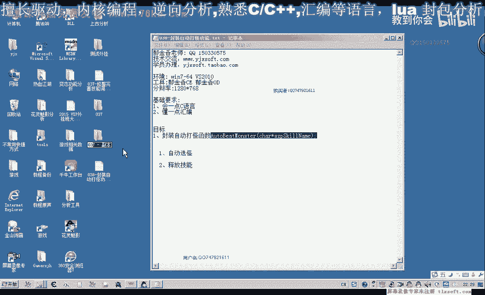
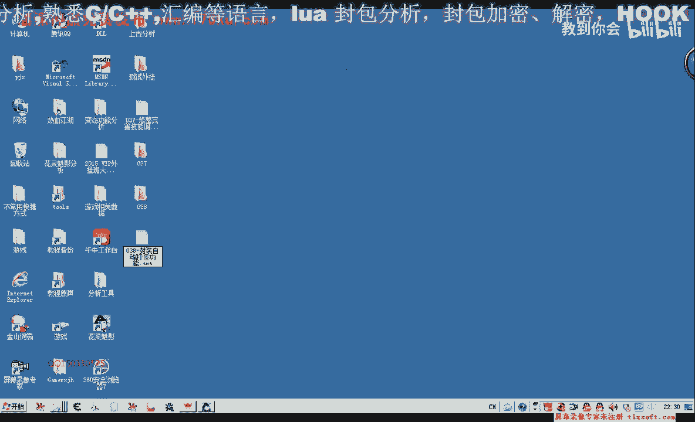
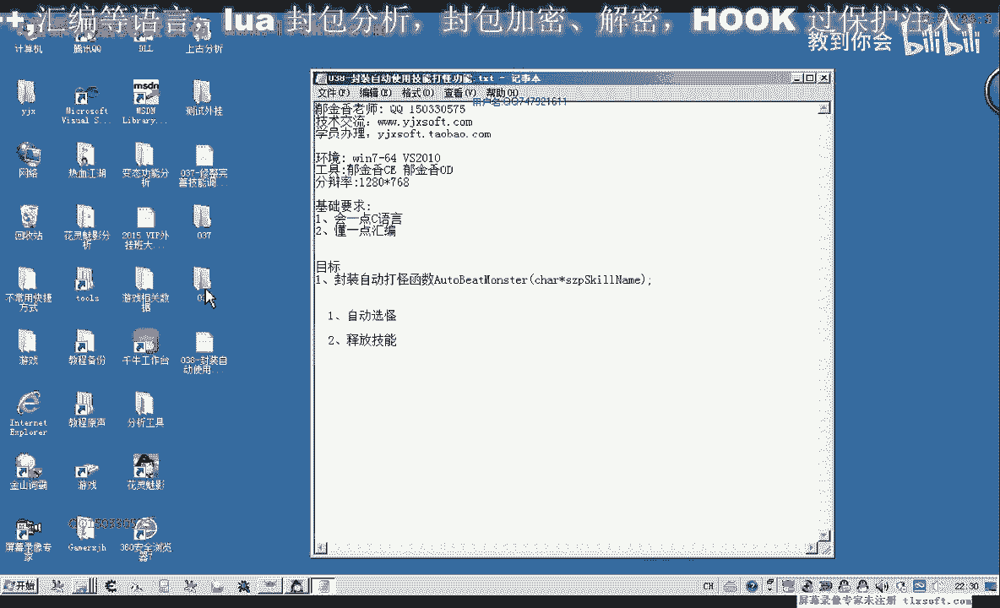
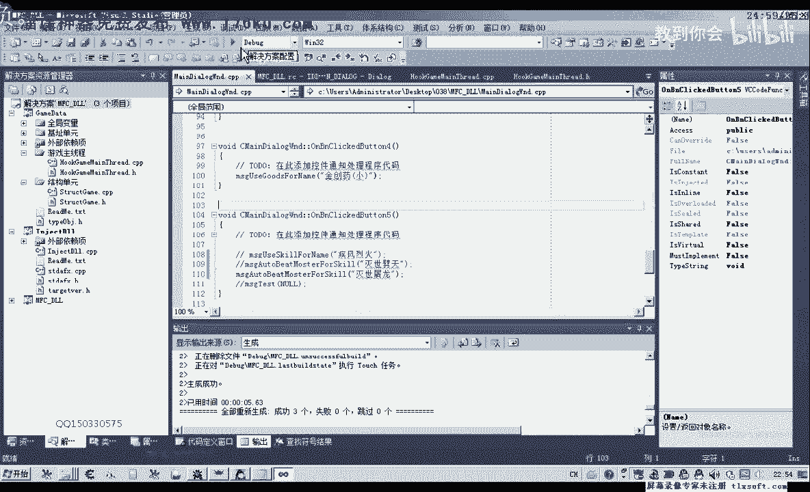

# 郁金香老师C／C++纯干货 - P27：038-封装自动使用技能打怪功能 - 教到你会 - BV1DS4y1n7qF

大家好，我是郁金香老师，那么前面呢我们已经有一个普通打怪的，也是自动打怪，但是呢他没有使用技能，是使用了一个攻击的动作啊，他已经实现了一些呃相应的功能，那么这节课呢我们在前面的基础上面进行一些修改啊。

嗯那么我们今天这节课呢主要是实现一个使用技能啊，自动打怪的打击为怪物的一个功能，那么我们打开第37课。

知道。

哈哈。

那么第37课的代码打开之后呢，我们先切换到，结构单元移到我们的人物角色的相关的这个结构里，玩家角色可以找一下，让玩家属性动作啊，这里有一个，那么这里面呢我们已经有一个自动打怪了。

但是这个自动打怪呢呃他没有参数，是用的一个普通的一个动作，所以说这节课呢我们要做一些修改，那么在它后面来存在一下这个函数嗯，加上一个参数，加上一个我们的技能名字，使用相应的技能呢我们自动打怪。

然后我们转到这个自动打怪的，用普通的这个函数的后边添加我们相应的代码，那么我们把上面的这一段代码复制一下，在它它的基础上进行修改就行了，那么空气动作这里呢我们就换成我们的技能，二。

那么这样理论上我们就可以了啊，但是我们上一节课呢，我们对这个相应的课呢进行了一些修改，那么如果技能没有放在上边呢，我们同样的啊不能够嗯，那么同样的不能够呢呃使用这个技能，所以说在这个自动打怪的前面呢。

我们再加上一句，那么再加上一句什么呢，就是呃放置我们的这个技能吧，不知道，那么先放置技能之后呢，然后我们再使用这个技能啊，这样呢我们就可以了，那么如果这个技能呢它没有放置了。

我们就会调用这个库去调去放置技能，如果他本身已经放置了，那么在这个函数内部的话，它会有这个检测啊，那么如果他已经放置了这里呢，他直接就返回了，检查到他放置了这个技能对象的话，好的，那么写好了之后呢。

这个课呢我们把它嗯把它添加到我们主线程的单元，自动打怪啊，那么这里设置好了之后呢，我们切换到流线线程单元，那么在这里呢我们给它添加一个自动打怪使用技能，2021，哒哒哒。

那么我们把前面啊这里的代码复制一下，把它移到这个test的测试代码的前面，那么这里还还需要一个消息的类型，那么我们这里需要定义一个红，那么这里呢是使用技能的，那么这里我们应该是一个自动打怪的。

啊啊打打怪啊，使用我们的建筑，那么转到消息处理这里开始，那么转到消息处理这里呢，我们也是啊先取出我们的这个技能名，那么在这里呢我们也可以用一个指针先进一点，那么这个指针就指向我们传进来的参数。

二那么然后呢我们在里边呢再调用调用法相应的功能就行啊，那么这样呢理论上我们就能够呃自动的打快了啊，并且还会传一个相应的这个参数技能技能的名字，那么我们在这个函数里面呢再进行一些呃修改。

那么攻击我们看一下，如果这个技能它不存在的话，那么放置这个技能动作如果也有失败的时候，那么如果放置这个技能动作失败了之后呢，我们就调用普攻啊，普通的攻击啊，做一些处理，那么在这里呢它有一个返回值。

我们先把它取出来，那么这里的返回值呢嗯它是一个布尔值哈，真和假，那么我们在这里面定义一个相应的一个变量，这，那么在这里呢我们进行以下判断啊，那么如果他呃返回的值已经就是说调用这个放置的函数成功之后呢。

那么我们再进行后面的这个代码，应该执行，或者说它这个返回值等于啊失败了之后啊，fs让我们进行一个啊相应的一个处理，那么调用失败之后呢，我们就可以调用相应的嗯不带参数的这个扣法，让它自动的使用普通攻击。

好的，那么我们再重新申请一下，cr初始化操作有case标签跳过，那么我们就把这个变量呢我们定义到前面去，这个加上一个括号，再重新编译一下，听说八八，那么我们在定义变量的时候呢，要提到这个前变了啊。

不然的话在这个case里面的话，它定义变量呢它会出现一些错误，好的，那么我们再执行一下，啊挂件我们的主线程，我们看一下调试信息，那么我们使用的技能疾风灭火。

那么这个时候呢我们可能出现的问题还是没有选中这个怪物嗯，但是我们对了，我们还有这里呢没有添加相应的测试代码，使用技能，然后呢我们需要在这样的窗口这里呢更改我们的代码才可以，那么前面的只是使用技能。

不是自动打怪的，那么自动打怪使用技能，这里才需要加一句，然后呢重新编辑一下，这样才能够自动选白板块，好然后我们再注入到游戏中去，逛街出现场，我们看一下调试信息，我们使用的这个疾风裂火。

但是选b的这种动作栏没有，那我们进去看一下，新的类似情况哦，这里我们的消息类型传错了，哦对我们应该传这个消息进去了，他这里呢才会转到我们相应的标签去执行好，那么我们再重新测试一下，挂机曲线层。

然后自动打开，那么这个时候呢他就只要我们在这里点击的时候，点击这个按钮的时候呢，它就会自动的选怪打怪使用技能啊，好的，那么我们换一个技能来试一下，那么换一个这上面不存在的啊，我们看一下。

比如说就是这个劣势列阵啊，我们来试一下，那么还有这个呢劣势图呢我们没有学过啊，等会儿我们测试一下，看着用它的话会出现什么情况，那么先编译一下，跨界主线请，这个时候我们发现了我们放第一次的时候呢。

它同样好放不上去啊，再把它拖出，那么按第二次的时候才会来去打这个怪物，我们再看一下，因为我们写的代码呢，它本身有点问题，那我们还需要进行一些修改，那么我们在这里呢它有一个啊放置的这样一个动作嗯。

那么它它使用的应该是不对的，那么我们应该调用的是另外一个动作来放置，那么我们把这行代码把它删掉，还是，自动打怪啊，那么我们只需要自动打怪，这里呢我们只能够使用技能，那么放置我们的这个技能。

它需要另外啊加一个动作，那么放置动作的这个呢，我们将在这个地方我们实现了，那么我们这里需要把它另外封装成一个或者是同一个函数吗，哈哈哈哈，那么先这样先做一个测试。

就先直接调用这个m s去开头的调用下放置这个函数，然后呢再调用这个类似内置啊，那么我们再来执行一下，啊，然后进入到游戏里面，化解主线程啊，现在这个快捷栏上面没有放这个密室利刃这个技能。

但是我们这个时候呢我们只需要按一下它就可以了，不需要第二次进行一个操作，因为我们还是需要把相应的这个动作呢需要把它独立出来，那么如果要封装成一个函数的话，在这里边呢我们可以另外的进行一个封装。

比如说在这个单元，我们在他发送消息之前呢，先调用message s，调用调用一下这个放置技能的这个函数，那么我们重新这边这样是可以，我挂一下主线程，把技能移掉，看一下调试信息，再重新编一下。

好像是没有收到相应的消息，我们看是什么地方出错了，他应该是先转到这里来执行，然后呢放置我们的消息在这，二，来，那么在这里我们先打印出一个调试信息，100，那么我们再看一下下面这段消息有没有被执行。

这里呢是使用技能，我，们看一下调试信息，在这里呢，他没有接收到消息的，那么可能是我们刚才忘了调用，啊这个地方呢我们忘了调用，他应该是调用了劣势灭刃，应该是p t调用，这，那么这样的话我们也需要啊。

也需要两次啊，第一次的时候我们这里呢他也会打怪，那这个现在也可以了，跑到这里了，但是他们可能是选中这个怪物的问题的，那么我们再另外选一个怪物，那么看一下调试信息，乐视披肩。

哦因为这里呢我们没有这个相应的啊啊这个内功十了，所以说呢这里他不行，然后我们再来试一下，那这个时候就可以了啊，刚才是未公不足，好的，那么我们在知道这个测试呢，这个时候是ok了哈成功。

但是这里呢还有一个小小的问题啊，就是什么呢，那么有时候呢我们呃这个技能呢，比如说这个技能灭世屠龙，他可以修炼，但是我们没有修炼啊，但没有修炼，所以说我们不能够使用它。

那么这个时候呢我们也需要给出一些相应的调试信息，但是我们现在代码里面好像是没有处理的，因为这个技能的话他能够骗得到，但是放置到这里的时候呢，它会失败，所以说他会失败的话。

但是他还是会返回一个相应的一个下表，我们来看一下它执行的一个流程，那么我们先把这里大小写的清空。

瓦解祖现场，那么这个时候呢他就不能够进行攻击，但是这个时候呢它却显示了哈使用这个技能灭世屠龙啊，那但是呢实际上呢它没有使用它啊，因为它这个技能呢呃没有放，直到我们相应的这个技能栏上，他没有找到啊。

没有找到，但是呢这个时候呢他又在这里面存在，所以说我们在放置技能的时候呢，我们最好修改一下它的一个判断，要判断一下这个函数它是否已经修炼了啊，如果是没有修炼，它可以修炼的话。

我们要加上一个自动修炼的一个公的一个代码，那么这就是我们下一节课的这个内容，好的。