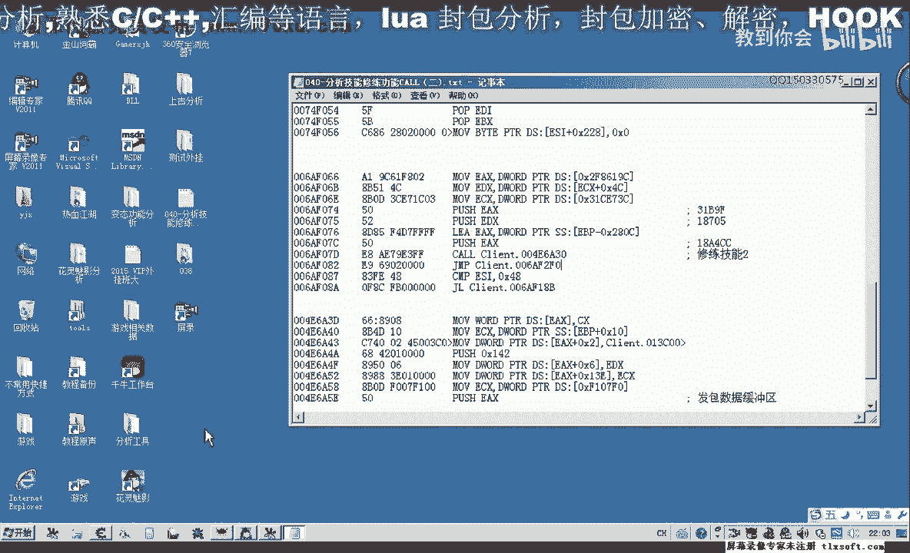
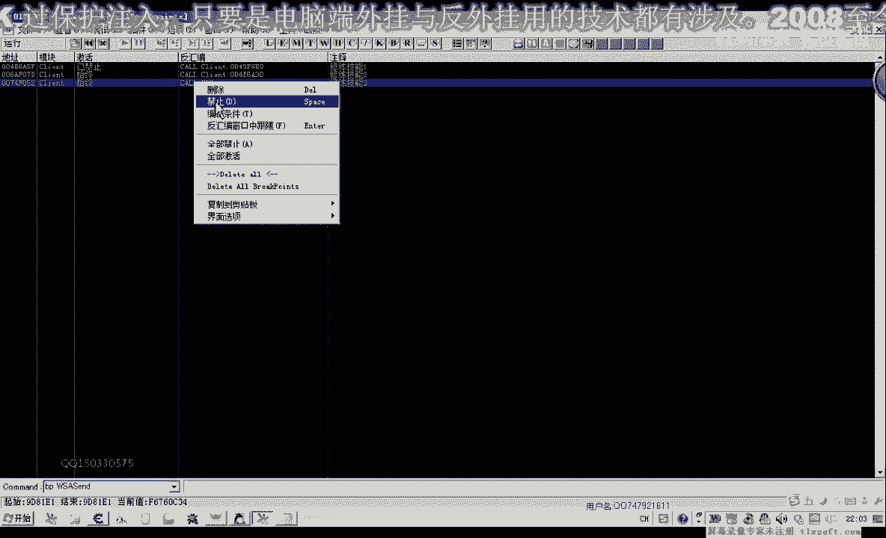
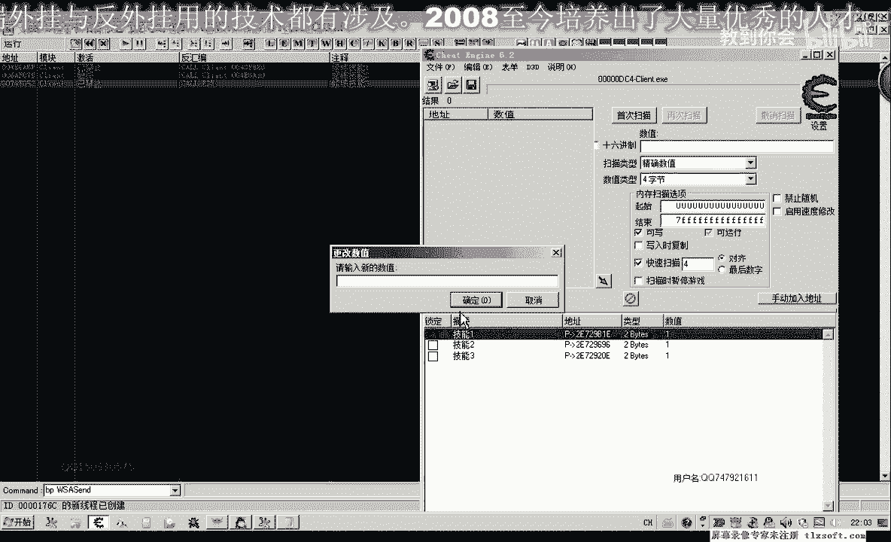
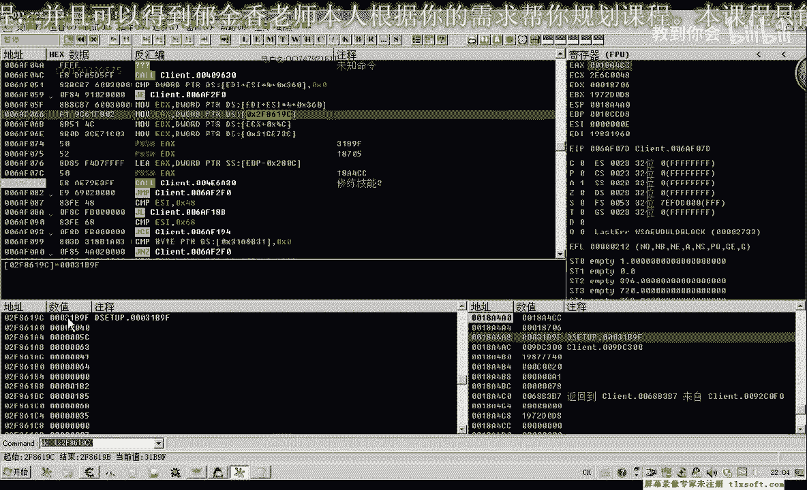
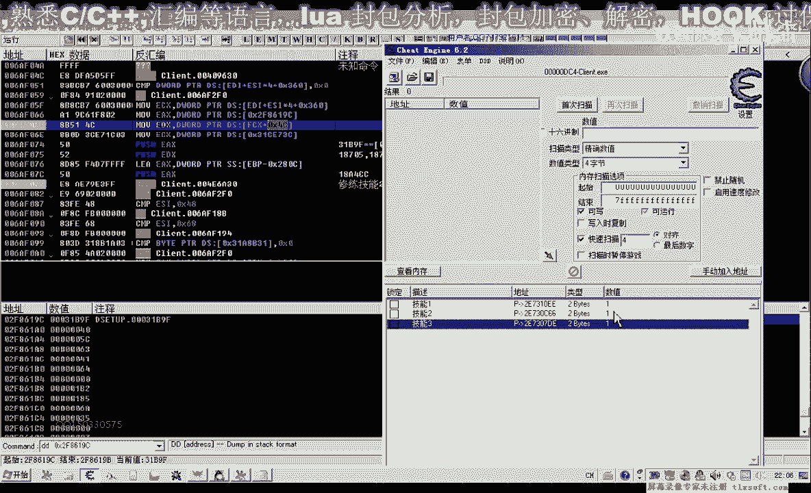
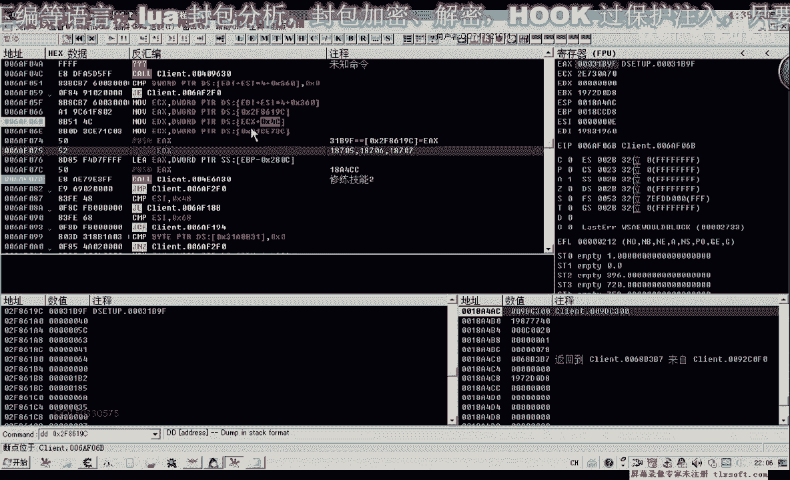
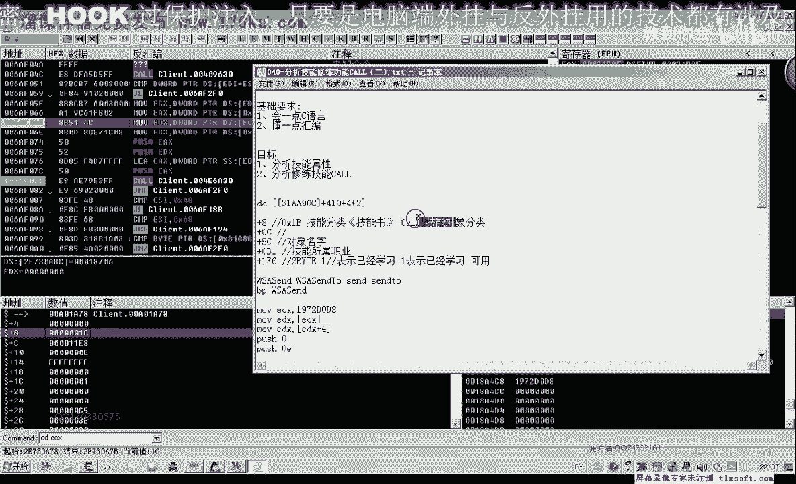
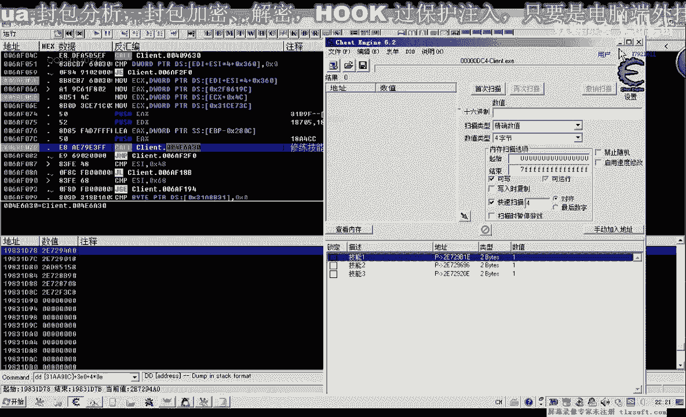
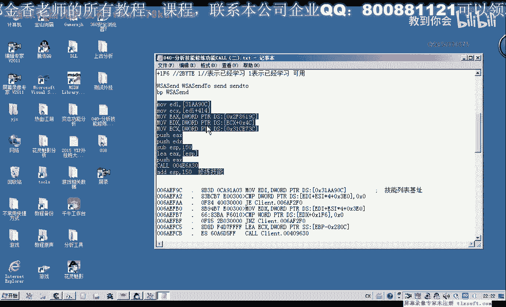

# 郁金香老师C／C++纯干货 - P29：040-分析技能修练功能CALL（二) - 教到你会 - BV1DS4y1n7qF

大家好，我是郁金香老师，那么在上节课呢我们分析了修炼技能的这个功能啊，分析了前面的这个扣，那么后面还有两个课呢，我们没有分析啊，因为在前面的这个库呢，我们分析的情况呢，它并不是很理想啊，并不是很明显。

因为它的这个序号的话，用我们的这个技能呢，它相关的技能之间的话，它的关联性不是很强，我们不知道要修炼哪一个技能，当然也有手动的关联方法，那样的话比较麻烦，所以说我们再分析一下后面的这两个技能。

看这两个可能不能够实现相同的功能，并且它的参数的话能不能够再简单一些，好的。

那么我们打开我们的ot哈，继续跳到我们的修炼技能二的这个位置来来进行一下分析，那么在这个位置下段啊，那么我们先把其他的断点呢先禁用掉啊，把技能删的这个先进进调。

然后我们也打开我们的工具，嗯把技能机修改一下。

然后我们在这里呢点击一下修炼，那么我们看一下它的一个参数，那么它的参数了1a x，首先呢我们找它的来源是来源于这里有一个机子啊，它这个应该是一个固定值，我们看一下嗯，31b9 f。

那么我们换一个技能试一下，看它还是不是这个数值，那你技能二我们试一下，那么我们发现了这个数字呢，还是31b9 f，那么证明的话它是应该是一个常量啊，这个，而且它的来源呢就来源于这个机子里面。

那么我们直接把它读出来，就能够调用，把括号去掉，直接就来源于这个地方。

那么我们在这里写上，这是我们ex的来源，那么1d x呢它来源于一次x加c啊，这个要复杂一些，那么最后呢这里呢还有一个呃缓冲区啊，这里取了一个地址英文，那么这个参数呢要较复杂一点啊。

那么我们再来看一下e d x呢，现在他是18706，7005706，那么这两个数字呢它也是a组的，一个是七，一个是706，那么后面一个的话可能就是707啊，那么这个编号的话它数值比较大。

看起来更像是一个我们服务器的i d，而前面的我们那个0d0 f呢看起来只是像一个数组的一个下标，那么我们再把它更改一下技能三改一，那我们再修炼一下现在传进来的数字，我们看一下堆栈还是31b9 f啊。

这个是18707啊，跟我们猜想的是一样，这可能是一个服务器的id，因为呢这个呢也就是我们的堆栈的一个机子一个缓冲期，然后传进去啊，缓冲区传进去，然后我们再继续来看一下，这次我们来看的时候呢。

我们看一下主要是这个187018706嗯，它它的一个来源啊，它的一个来源，那么在这个地方呢下一个段子再修改一下，我们以技能二为例修炼。

那么我们看一下这个ec x。

那么ex呢等于ec ec ec好像是技能对象的一个编号，我看一下1b1 c是技能对象的分类。

那么技能对象的话，大家我设计的有一个名字，那么我们来看一下它的名字是多少，那么就是一个疾风断木啊，那么这里呢我们就能够找到它的对象呢，能够与我们的对象关联起来了。

好那么这个参数呢就是我们的对象加5c这个点啊，加上4c这个地方好的，那么我们让它跑起来，那么在这里呢我们对象属性里面再给他加一下4c，这个是我们暂时把它命名为服务器的it。

啊这个就是服务器的i p的这个名字，谢谢，那么我们把它记录一下，那么现在的话我们知道他说这个是服务器的i t的名字的话，我们就可以建立这个数组，然后把这个id取出来啊，做这第二个参数。

这个参数呢我们就可以这样来取，那么我们偏离到相应的这个技能对象之后呢，我们就用我们的技能对象加5c来取得这种，那么这个数字呢就等于我们的角度，像，加上4c这个偏移来来取得。

那么这前面的这个是一个常量来源于这个机子，那么最后呢就是这个呃这个所谓的缓冲区啊，那么这个缓冲区我们看一下它的数据复不复杂啊，然后我们再次修改一下，嗯然后断到这里，那我们看一下ex这个缓冲性主体e x。

那么我们看这里面的话，它是大片等于零啊，那么也就是说这个缓冲区它足够大就行了啊，足够大就行了，但是具体有多大呢，我们可以根据这个扩去看一下它有用到的最大的偏移是多少，在这个地方我们按下回车键。

那么跟进来之后呢，我们看到嗯，这个时候呢我们的一sp呢加四人是参数，然后铺起一个e p p之后呢，那么它这个就是这里就变成了我们的usp了，加八啊，就是我们的参数一，也就是缓冲区。

那么而这里e s p呢又转到了我们的bp啊，bp等于一比jsp了，所以说在这个位置的话，我们就是e p p加八啊，实际上就等于我们上面传进来的第一个参数，那么我们可以在上面啊返回到上上一层。

那么在这里我们按f7 往里面跟一下，那么我们看到现在的第一个参数相对于e s p的话，就是这个位置啊，那么我们当执行了一个谱写一bp之后，它就变成了一sp加八。

而这个时候呢e b p又来相对于我们的e s p啊，覆盖了e b p，所以说在这后面的话，e b p加八它就取出来了，取出来这个地址啊，那么取出来这个地址之后，我们看后面就是对它偏移的一些操作。

那么从0206最大的是131啊，那么这个数值可能还要大于它啊，那么这里有个142啊，我们最后呢进行了一个发包，然后我们就跟到这里边来了，这里面就是一个圣等一个数据的一个发包，那么我们可以猜想的话。

很有可能的话他最大的偏移就是142，那么我们这里跟他写大一点，写成150，我们来试一下，做了测试一下，那么再按减号退回来，首先我们用我们把前面几句啊复制一下。

那么实际上我们还能够在这个地方来看到一个数组，ec x来来源于这个数字啊，我们在这里下一个段看一下，那么这个数组是一个什么样的数组，然后再测试一下，但是我们看一下这个时候呢它直接执行到这里了。

这个地方呢没有被执行，说明是从其他地方跳过来的，那么我们先分析一下，看还有什么跳转跳转到我们在后面的位置来，那么分析完了之后，我们可以看到在这个地方它有一个有一个大于符号，那么是从前面跳转过来的。

这里有个跳转来字啊，我们转到这个地方去，那么我们发现了这里有一个数组1d i乘以10，i乘以十，我们在这里下个段再让它跑起来看一下，那么看这个数组与我们有什么关系，在修炼。

那么我们看一下现在数组的下标一si等于多少呢，等于零一，恰好是上一层这个扣它传进来的一个参数，那么我们这里呃也就是我们，这个修炼技能三这里有个0d0 g0 f，那么实际上它这个时候我们分析之后才知道。

他传进来的实际上是一个下标啊，这个下标，然后这个下标我们看它取出的对象又是什么，啊是一个对象类型的话，我们看一下，假设这个地方是1c是技能啊，那么它加5c这个地方呢就是技能的名字。

那么就是我们后面的这个啊起风断路啊，那么实际上我们这个e d i来自于多少呢，我们看一下e d i呢在这里是31a90 c，那么这个31a90 c的话，我们很熟悉，它，实际上就是我们的技能列表。

只是这个技能列表呢它的开始位置呢是310，而我们这个开始的位置呢是410，二零是410，说明的话我们也可以把这个记一下，这个呢也是一个技能列表，那么这个技能列表呢可能还是一个更大的一个技能列表，那。

么我们把它记录一下，那么再往后执行，那么就能够看到啊，这里呢就是从数组里面取出来的这个e4 x，那么实际上这两个技能列表之间有什么关系，我们把它复制到后面呢，再看一下。

那么因为游戏呢这前面还有个升天武功啊，可能它里面有一些东西啊，所以说呢这三个可能这个升天武功攻击武功不做武功的，他可能来全部都把它放在这个列表里边了啊，放放在这个310开始的。

那么你看一下这个310和我们的410的话，他恰好相差了多少，算一下41031g过了，再加的话就是3f，但是它这里呢它加的下标的值呢要加的多一些，实际上肯定是指向的同一个地址，那么我们可以做一个测试。

那么来这个地方啊，我们看一下它的地址，树主要是看了，那么这个地方呢我们是a70 啊，a70 这个地方是什么，我们看一下，是我们的疾风断木，那么如果是疾风断木啊，这个啊这个呢它它的下标应该是d一啊。

如果是用3g里面来开始的话，就是310+4神明，第一我们看一下，实际上这两个地址呢它是指向的同一个地址，那么只是它所用的下标呢不一样啊，不一样，所以说我们在调用这个技能课的时候呢。

可以骗离我们前面的这个技能列表就可以了，那么有两个技能列表整理一下，这个也是一个技能列表，只是它的下标呢不一样，好，我们保存一下，那么这个时候我们就可以开始写相应的这个功能啊，这里代码不知道。

代码输入器，然后这一句呢已经全部啊复制出来啊，这句辐射出来，那么这个ecx呢我们还需要给他找一个来源，那么前面不是有一个数据，就是e d i，那么先把我们数组和机子找出来，31k904 。

那我找出来之后，我们再用e d e c x，那么等于我们的e t i加上ec嗯，加上我们的e s i s e，它的一个下标相当于，那么我们这里是从4100开始的，那么我们选414啊。

这样呢就是我们的第一个技能表示学习啊，取出它的一个对象，那么第一个技能后面的话我们这里呢是一个复习1a x，我写1d x照着写就行了，然后呢一个类1a x，当然这一句呢就比较复杂一点。

这个时候我们写为e bp就行了啊，切回e s p，但是呢我们之前呢我们要跟他分配相应的一个空间，这个e s p，那我们就沙包e s p，刚才我们看到我们说分配150个字节，应该是个。

然后呢在这里呢我们复习ex，那么这里呢我们就不用这个累了，累的话，我们后面呢需要地址的话，我们要需要加括号，那么这句话我们就可以直接，ex 01 p就可以了，当然刚才这两句是以等价的。

与我们这一句的指定是等价的，随便的成绩就可以，nee x e x p好push ex，然后呢我们再或，这个地方，那么用完了之后，我们还要什么a d d e s p要怎么恢复相应的一个堆栈嗯。

但是我们需要还是需要来测试一下，这样写看是否正确，那么414来代表的是我们的实际上是嗯410，那么这里呢加上我们的4x1啊，是这样来的，但是我们这样的语法的话，它并不支持啊，这样。

所以说我们需要直接用一个常量，那么我们把这个技能改一下，卡为零，好那么我们就测试一下，这个时候呢他说了这个审法院他在里面呢，他直接这样写，他肯定是不支持，所以说我们这里需要写成常量414啊。

这个时候呢就ok了，那么这样的话我们就能够通过对象就能够把它关联起来了，那么这个扩展才是我们理想的啊这个库啊，所以说上面上一节课找的那个课了，虽然说也能够实现相同的功能。

但是我们需要的代码量的话就比较大了，我们需要去把这个相应的这个id呢一个一个的把它关联起来，因为它与技能零之间的没有关系，而我们找到的现在这个库的话，它与我们的技能对象有关系。

那么我们偏离这个列表之后呢，我们就可以直接调用这个孔，所以说这个扣才是我们理想的啊，修炼我们技能的这个库，那么上那么上一层我们上一节课找的那个课呢，应该是点击我们修炼按钮的那个那个库。

而这个呢才是真正的修炼技能的库，所以说我们把它区分开来，当然他们都能够实现同样的功能。

那么具体用哪一个呢，再看你自己的一个选择，这个才是我们的啊，修炼某个技能对象，就是，如果我们上一节课，这个呢应该是什么，点击啊，修炼啊，这个技能的按钮，或者只是一个点击的一个动作啊，点击了它的一个对象。

当然两个都能够实现同样的一个功能，好的，那么这节课呢我们的分析都照到这里，那么下一节课呢，我们将对这个修炼技能的这个功能呢进行一个呃代码的一个分。

