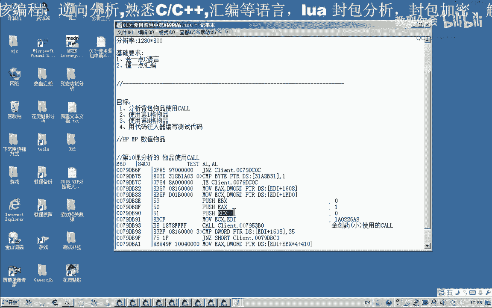
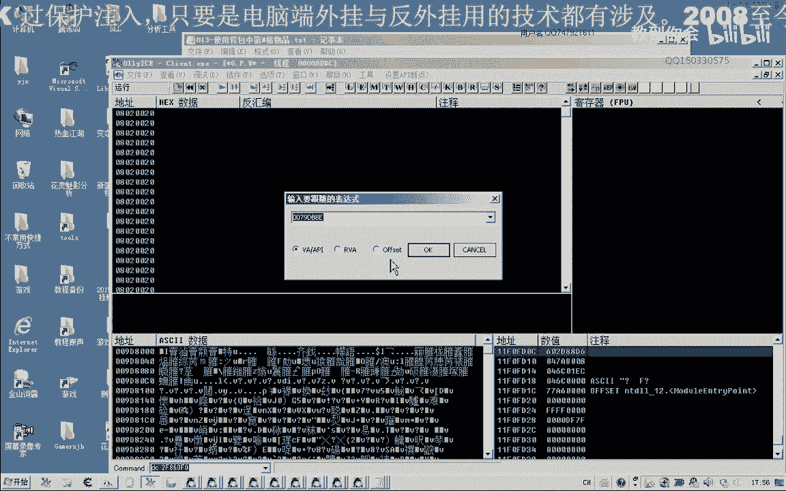
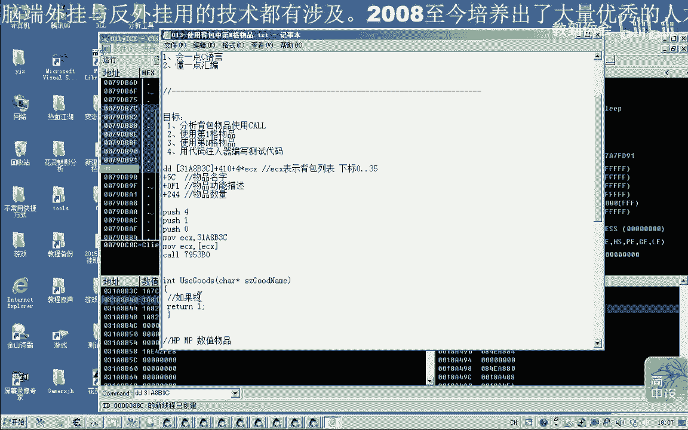
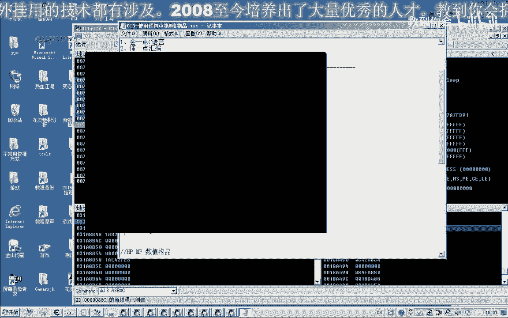
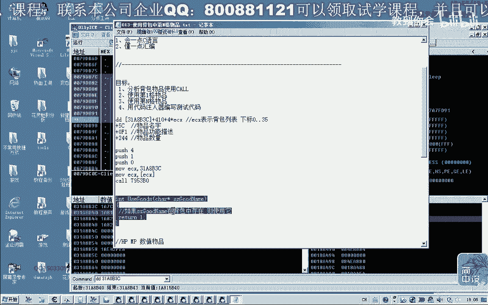

# P2：013-使用背包中的第N格物品 - 教到你会 - BV1DS4y1n7qF

大家好，我是郁金香老师，qq 1503365秀，欢迎大家参加郁金香技术编程培训，那么在前面的课程里面啊，我们分析了一个金创药使用的一个靠盘，那么当时的这个金创药呢，我们放在的是第一个啊，放在第一个。

那么如果我们要使用其他的啊，某一格的物品，那么应该怎么办啊，还有我们这个ec x它的机制，当时我们还没有分析它的来源啊，来源于什么地方，那你为什么定，那么我们还要继续的找一下。

那么首先我们把这个机子先分析一下。

打开我们的o d嗯，然后转到我们相应的函数来，转到相应的代码这里。

那么在这里下一个段，那么我们首先分析这个ez x的一个来源，嗯，那么我们首先让他断嗯，直接往前面找一下e c k来源于e d i，那么e d i我们往前找一下，先分析一下范，哈哈，好。

那么我们移到函数头部，来看一下pi的一个来源，再再看一下啊，e d i，那么我往前找什么时候这个e d i的值对，写错了，那这个扩呢比较大，应该里面封装了不少的功能，比较大的话。

我们就用c a e来找一下，已到手后，我们看一下e d i a它来源于上级的ec x，我们在这里下一个段，或者它本来这里就有一个调用的来源，我们转过去看一下，转过去看一下他的e4 x，320我们看一下。

在这里使用一下物品，点一下右键，e4 x我们看是不是这个数字，我们先把它记记录一下，uc写的c图四的啊，我们要找的应该是这个c c f是啊，你们要找的是这个来，那么我们在在某个物品上面啊，点一下右键了。

实际上实际上我们所找到的这个库呢，嗯这个使用的一个call，我们可以从这里还可以看出来，从1b x这里可以看到它有一个下标，这个是七，我们是用的是这一个第八个，那么如果我们在第六个上面，我们按一下右键。

那么这里是六，如果在第四个这里按下，那么这里按下右键呢，我们这里是三环，所以说我们这这个课的话，它实际上并不，是说啊金疮药的一个使用的一个课，那么这个参数是固定的，是一，那么这个参数是零。

啊这个是第11个，第11个好了，那么我们再来找一下它的机子，找一下机子，接着我们可以用c一来找一下，我们看到这两个地方来呢，直接就有一个数值出来啊，那么究竟哪一个是呢，53卡。

3c这个数字有点比较局不行，这个三幺被8b3 c，那么我们前面分的分析了，恰好就是我们所要找的这个地址，那么他传的这个mc x的值，那么所以说我们在这里呢实际上用不多。

早之前我们就把这个机制已经找出来啊，只是不知道的啊，这里呢恰好就是放了他他们的，如果我们取出来的这一个呢，这里呢它是什么呢，就是我们的，取出来也是我们对方的一个对象，好那么我们把它整理一下，复制出来。

那么结合我们今天所分析的啊，这个库啊，它可以使用某一格的物品，那么前边我们在，第11课的时候呢，这里有一个公式啊，还有一些啊属性的一些值，那么这两点我们结合起来的话就可以了，写成一个函数。

那么比如说我们要使用金创药，片名片离到金疮药啊，它的下标是多少啊，它就能够使用金创药，那么如果我们要使用这个人生，原来这个人生是在第一个的，下标引进来，如果我们要使用金创药中啊，那么我们可以写一。

这个金创药中，它是不是存在的啊，如果存在啊，就返回一个它的一个下标值啊，原来他是在第二格，那么我们把这个电热格这个下载了，传到这个函数这里啊，那么我们就可以使用第二格，那么我们先来测试一下这个函数啊。

啊，那么首先呢我们呃这是下标，第二个参数是一入定的，这里呢我们要改一下hc x，取出里面的词，然后我们输入到，游戏里面，那么比如说我们看一下啊，现在第一个的人生是51啊，数量是。

那么如果我们在这里使用一下，这等一下变成50再使用一下啊，47，如果我们要使用第二个的金矿要小，我们这里下个来数一，这个时候呢我们看到啊，如果要使用第二个呢，这里我们哦第三个呢我们输入下标二。

看到他也在变化，能看到他的变化是法伤口，那么如果我们要使用第四个呢，这里呢我们就输入三啊，三现在它的恢复量是10458，107458啊，这个时候他没有这个血量没有掉，说明这边的血量不是满的是吗。

那么如果我们要使用第五可能是个物品，它的价格是四，那么他就直接就回城了哈，那么如果我们使用一下的话，那就不会回城，就回到城里面来了，这个时候，好的，那么我们的这个代码的测试呢，就测试到这里。

那么我们下一节课呢，我们呃对这个物品使用的功能呢，进行一个封装，写成我们的一个函数，通过我们所分析的这两个数据，安装成这样一个函数，当然大家下来也可以自己写一下啊，不是，故事，根据这个物品呢。

如果它存在的话，那么使用成功之后呢，我们就不看，然后成功，就逻辑的话就是呃，如果这个物品就是物品的名字。

然后下一节课呢，我们就要写这样的一个函数，这个呢你呃作为这一块的一个价值，一个拙劣啊，那么厚厚的一个主力啊，有一个大家思考一下啊，那么下一节课呢，我们对这个函数来进行一个功能的，一个封装起。

从我们的c加加的一个代码啊，那么今天这节课，我们这个机子那个分析过一个破的。

