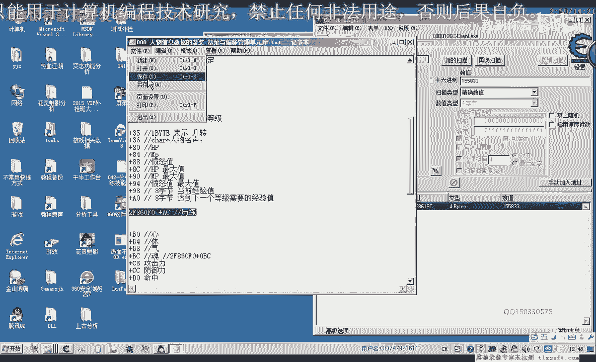

# 郁金香老师C／C++纯干货 - P31：042-分析修练技能所需条件数据 - 教到你会 - BV1DS4y1n7qF

大家好，我是郁金香老师，那么在上一节课，我们一起编写了代码和封装了修炼技能的一个功能，但是呢还有一些地方呢不是很完善，比如说这个技能神龙破甲，那么我们在偏离的时候呢，他也是未学习的。

那么我们就去修炼他的话，显然是错误的嗯，因为修炼他的条件根本就达不到，于是我们必要的力量不够，还有一个就是等级也达不到啊，那么所以说我们必须要对这两个条件进行一个判断，如果不判断。

我们就去调用一个相应的课的话，那么可能呢会向服务器发送的这些信息呢，会被判定为非法的使用外挂啊，这个位置，所以说我们最好是加上这一类的判断，那么要进行这个判断的话，第一个呢我们需要读出我们当前的历练值。

要进行判断，要大于这个20万啊，那么才行，那么第二个呢就是我们当前的这个等级哈，要大于这个第74集才行，所以说我们要获取这些数据，那么今天呢我们就来分析一下啊。

这个历练和这个等级的历练和这个技能的历练需求，还有当前等级一级技能的等级需求吧这些，那么我们先来分析一下当当前的历练和嗯技能需求历练，那么打开我们的c。

那我搜一下我们当前的利润是多少，155833是不是1555833，这个数值呢可能是比较特殊，那么我们一收呢就出来的是一个绿色的呃，机子是f8619 c。

那么这个机子的话我们以前面的第八课里面所分析的哈。

嗯有一些相像，那么我们看一下，那么我们第八课我们分析了一个是2f860 f0 ，那么他们之间的话9c啊，19c减f0 的话等于a c，那么恰好这个机子加上ac的话，就等于我们的历练啊。

那么所以说历练的偏移的话。

就是我们的人物属性的这个偏移加上mc这里面就是我们的历练，后面的b0 ，当时我们还以为这个力量没有用啊，所以说我们当时就没有读出这个属性，实际上当时我们已经分析过了。

那么当前历练我们取得了，接下来我们就看一下我们技能需求应用的一个需求，那么技能的历练呢我们也可以收啊。

比如说就这个20万，但是如果直接这样搜的话，肯定搜出来的数据是非常多的，那么因为它肯定是技能对象的一个属性，那么我们就从技能的基地址开始收，那么这里呢也是2434 12。

这里技能数组的下标呢是11 12 13 14啊，这个技能的下标是14，那么14的话它的呃技能的七地址的话也就是4x14，那么是你空了这个4x14等于我们40 10 66，56等于我们的零二开始三方啊。

那么所以说在这里的话，我们就加上448就行，就能够取得相应的一个对象地址31a9 c，这里呢加上我们的4410+38448，那么这是我们的第14个，技能，机制，啊这是一个相对的一个机制啊。

这是我们对象的机制，那么我们可以从这个对象的地地址呢这里开始收，那么他需要的是20万个领，那么这个时候呢我们从它这个地址开始搜的话，搜搜出来两个数值，那么这两个数值呢我们看第三的话明显离它很最近。

这个离得比较远，但是两个呢我们都可以搜一下啊。

访问看一下访问的数字啊。

这个没有，嗯这个有没有可能要我们要显示一下，它才会反问他，这里出来一个268啊，e si我们看一下这个e si的数字是多少，他一si的数值呢是d3 c0 ，d3 s0 。

看一下我们设法中的这个就是1i的数据c9 d3 c好，那么第一个偏移我们就是268，我们把它复制出来，那么在前面一个呢我们也来访问一下它，看一下它的数值，是不是这个也是268哈，那么我们看一下。

这是它的地址，好像不一样，3238都是一样的，地址而求，那是不是访问错了，再来看一下下面这个，嗯这个很奇怪啊，两个都是e s i e s i2 c9 t3 s0 哦，这个是2c9 。

我们这里2c a9 t3 c，这个有一点不对啊，呃这个是2c9 d3 c0 ，那么在前面这个它应该不是这两个地址不是一样的，那么我们释放一下，看一下e si的数值设置为d c s0 。

那可能是下的这个断点呢，他就是访问前面这个不是访问在后面，这个在后面，这个明显它不是加上268啊，断下来的，那么我们应该就是这个2c9 d3 s0 加上二六方，就是我们的这个偏移的数量。

那么我们也可以加一下，在这里用这个数字，这个数值我们加上一个偏移，加上268的偏移，那么这个偏移的话，它明显是指向我们的d28 的，而不是指向这个c50 的，那么这个c50 的他可能是没有没有访问他。

啊这个是没有访问的测量，刚才只是他先访问了前面这一个啊，所以说在这里的时候他才断下来，所以说这个人应该是没有关系的，因为我们那么我们为了验证一下这个历练是不是正确的呢，我们可以用之前的。

那么之前的这个单元来做一个测试啊，第13单元的这个作为一个测试，那么我们可以这样改，先改一下，把第13的一个技能，4号考用的那个数字改一下。

这里就是ef 62次解，啊对，这是第14的一个技能，第13的一个技能，这里是444，好那么我们再读出它的一个当前的历练，啊历练需求了，那么历练需求的话，刚才我们找的那个a6 方，我们看是不是正确的。

这里是3万多嘛，好的，那16进制的话是8488，嗯那么我们在这里看到的它必要的立面是16万多11 零，这里需要改成实际上的显示好，我们显示的必须是四字检测对啊，显示是四字节，恰好就是16万啊。

这里我们看到的啊，因为之前我们已经学习过了，那么我们这里历练它是达不到的啊，我们可以看到，那么所以说这个经过测试的话，哪个比较的测试的，把这个当前啊历练的需求的偏移的话，就是啊不是六八这个偏移。

那么前面这个力量呢就是我们刚才的第八课的这个a c这个a c，那么这个历练的我们已经解决了，那么还有一个是等级需求的呢，再来搜一下，那么这个的等级需求是74，那么我们就可以来从这个s0 这里搜一下。

其实啊因为它是这个对象的一个属性之一，肯定在这个地址的后边，那么第三开头的呢，我就只有这一个能看到第三个。

那么看看一下他的这个偏移的话，恰好是也是a c啊。

它的等级是a c，那么我们第14个技能我们把它复制一下，等级需求，需要啊需要，那么它的偏移呢是a c f74 ，那么我们再来看一下第13个技能，它的一个等级需求，如果两个都正确的话。

我们就证明它是正确的，那么这里呢第13个呢是444，那么我们这里要显示是十进制的。

那么一个是71，一个是74啊，那么证明它也是正确的，那么当前等级啊，他也出来了，这样我们还要，a c a的偏移啊，反正我们已经找出来了，既然等于稀释了，就是加上0a c，那么当前的等级呢。

当前的等级我们已经在第八课的时候了，这里它就有一个当前的等级，加042034这里。

但是它是一字节对当前的等级，因为我们这个等级的需求不一样，这里是四字形，这里加上我们的三次与自己，好的，那么这几个数值我们现在都已经取到了，那么在下一节课呢，我们在对这相关的数据来进行啊整理啊。

然后封装成一个判断的函数，嗯。

技能对象的啊，能不熟悉，好的，那么这个呢我们当成是一个作业，就大家就自己啊公众一下啊，指定的技能呢是否可学啊，是否呢就是可以学习啊工作的这样的一个函数，那么对这几个偏移来进行一个判断检测就可以了，好的。

那么我们下节课再见，这节课分析数据啊。

