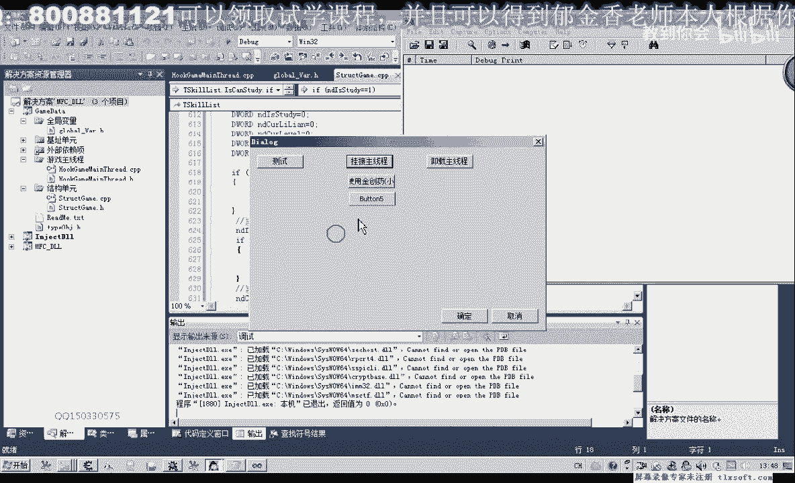

# 郁金香老师C／C++纯干货 - P32：043-技能学习条件检测函数IsCanStudy - 教到你会 - BV1DS4y1n7qF

大家好，我是郁金香老师，那么上一期给大家留了一个作例，就是检测某一项技能是否满足了一个修炼的条件，那么这期我们就来一起来完成这个作例，那么可能这样，然后写看是否可以学，那么这4个条件应该说三个条件。

我们相关的数据我们都已经分析出来了，那么接下来我们就把它封装成一个函数，那么打开第41课的代码，这是第43课，那么我们把属性把它当成是一个属性。

添加在我们的技能对象里面，结构单元，我们有一个技能对象，但是技能对象里面的话，它本身是没有属性的，所以我们跟他添加进去的一个属性，那么可以封装成属性，也可以封装成函数，可能是我看封装成函数可能要好一些。

某一项技能是否可学，这是我们自己添加的一个属性，那么我们要添加成属性的话，这里我们需要在列表的相关单元进行一个添加，属性可能不是太好，那么我们还是把它添加在技能列表里面，做一个函数的形式来调用。

那么它要检测某一个技能是否可以调用的话，我们也需要一个相应技能的一个下标，(敲擊中)，(敲擊中)，然後我們轉到getty的後面，這裡進行一個添加，要檢測某一個技能是否可以修練的話。

我們需要先取出幾個數據，取出我們當前的歷練，當前的等級，那麼還要取出來我們技能歷練需求，另外一個是技能等級需求，那麼還有一個，第一個數字的話，就是我們的當前技能是否已修練，技能未學習，那麼這幾個數據。

我們全部都要給它取出來，那麼我們在這裡來建個變量，用來存放這幾個數據，(敲擊中)，(敲擊中)，第二個我們是當前的一個歷練，還有一個是我們當前的等級，那麼後面這個是技能的，技能的歷練需求，技能的歷練。

那麼還有一個是我們技能的一個等級的一個需求，那麼這幾個數字的話，我們需要先把它讀出來，那麼第一個我們是讀取我們當前的技能是否已經學習了，(敲擊中)，(敲擊中)。

那麼這個我們可以從EF6這個屬性裏面讀出來，這是第一個數字，(敲擊中)，那麼第二個數字是當前的一個歷練值，當這個當前的歷練值的話，我們需要在之前的人物的屬性裏面，先給它添加，這個人物屬性的單元，那麼A。

C這個位置，我們要給它添加一個歷練的數字，(敲擊中)，那麼這個歷練的話，我們需要在它的個體代替單元進行一個數值化，當然還有一個是等級的，等級的我們之前A，C，我們看等級在三四這個位置。

那麼人物屬性等級我們已經讀出來了，那麼這裏我們歷練，(敲擊中)，歷練的話，它的偏移是0x，A，C，那麼我們需要把它讀出來，另外人物屬性，我們需要跟它建一個相應的全球變量，(敲擊中)，這樣好了之後。

我們在相關的單元添加我們的代碼，應該是，(敲擊中)，當前的歷練，那麼這個等於我們的人物屬性代替代替，(敲擊中)，那麼歷練這個數字讀出來，我們還需要一個當前的等級，(敲擊中)，後面這兩個就是讀我們的。

我們先編一下，(敲擊中)，這裏我們寫錯了，它的類型應該是不是指針類型的，需要把它修改一下，(敲擊中)，那麼這裏我們最後需要一個返魂值，(敲擊中)，當然返魂值的話，我們等一會再計算出來，(敲擊中)。

那麼還有兩個條件，我們需要把它取出來，就是我們相應技能對象，一個是歷練，一個是等級，那麼這兩個我們要先到相應的技能對象裏面，添加這兩個屬性，這技能對象的，技能對象，我們還要添加一個是當前的歷練。

歷練需求，那麼還有一個是等級需求，歷練的話，我們是上一期分析的是268，等級是AC，(敲擊中)，把AC調到前面一點去，調到名字的後面，這樣按照它的偏移的大小來進行一個排序，好。

那麼我們在一到相應的初始化單元進行一個初始化，EF6已經初始化了，另外還有一個就是AC的需要初始化，AC排到後面，T-LIST2，它的歷練需求，我們就複製為相應的一個偏移，機子交偏移讀出來。

那麼這裡是268，等級需求是AC，那麼再把這個複製一下，那麼歷練需求，這裡是268，讀出來相應的一個數字，那麼相應的打印單元，我們也可以給它添加進去，應該是名字，類型，ID是否可用。

那麼後面來添加我們的歷練，等級需求，那麼應該是歷練需求，那麼接下來我們就可以取出這兩個條件，那麼接下來我們就可以取出這兩個條件，那麼接下來我們就可以取出這兩個條件，(音樂)，那麼在讀之前。

實際上我們還需要判斷的是一個問題，就是我們讀出來的數值，如果我們相應的數值為空的話，我們就不需要進行後面的判斷了，那麼我們還是通過它的ID來判斷，如果它的ID的話都為0，那麼我們這裡直接我們就返回來。

就表示了不可學，這個東西不能夠學，就返回假，那麼後面的這幾個，我們一一的進行一個判斷，那麼最後我們返回真，那麼這幾個條件，我們都要進行判斷，那麼首先我們判斷的是什麼，這個技能是否可學。

當然我們為了把它分開，分開的判斷可能要簡單一些，那麼首先這個值如果它已經學習了，那麼我們也返回，那麼就不用去調用這個技能，那麼然後這是一個歷練的一個，當前歷練與技能歷練的一個需求的進行一個比較。

那麼如果當前的歷練小於的話，那麼小於我們技能等這個歷練一個需求，那麼這裡我們也直接就返回Fast，那麼後面是一個等級的一個判斷，那麼如果這個等級當前的等級需求，那麼如果小於我們技能的一個等級需求。

那麼我們也不能夠學習這個技能，返回Fast，那麼最後這幾個條件，我們如果都沒有把它攔住的話，最後我們就返回真，就表示了它學習技能的條件成立，然後我們編譯一下，(音樂)，(音樂)，(音樂)。

這裡我們需要加上一個Xturn，這個表示了套出我們的符號卡，而不是從定義塔，(音樂)，好的，那麼這個我們編譯完成了之後，那麼這個條件我們可以加在什麼地方，剛才這個條件，那麼這個條件。

我們需要加在修練技能這裡，需要加在這個地方，那麼我們在執行後面這些語句之前，我們就先加上一個判斷，(音樂)，(音樂)，我們先判斷指定的下標，它滿不滿足這個需求，那麼如果是不滿足。

它返回的如果是Fast的話，那麼在這裡我們直接就返回-1了，那麼如果是返回的是真，它能夠學習，可以學習，那麼我們再繼續調用下面的，修練技能的這個功能就可以了，當然這裡我們也可以打印出一些。

相應的調試信息，(音樂)，那麼我們也可以編寫一段測試的代碼，來進行一個測試，那麼這裡我們可以打印出一些調試信息，來進行一個判斷，(音樂)，這裡就是把技能，(音樂)，這裡是我們的某一個條件，達不到。

(音樂)，不存在這個字母，(音樂)，那麼這裡是技能已經學習，(音樂)，那麼如果是這裡就返回的話，就是技能的歷練，(音樂)，那麼是這裡返回的話，我們也就是技能的等級不夠，(音樂)，達不到一個相應的要求。

好的，我們也可以進行一下測試，(音樂)，那麼我們這裡用一個循環來測試，(音樂)，(音樂)，那麼掛機到主現場，打開我們的信息查看器，那麼我們可以看到，它就會遍移出來，那麼這個技能已經學習。

在前面的技能它是不存在，因為這個是一本書，是判斷的，它不存在，那麼這三個是歷練不夠，這個也是判斷的不存在，這個學習，這個已經學習，這個不存在，當然存在的，它就沒有打印出相應的調試信息。

那麼如果它返回為真了，那麼我們也可以打印出一段調試信息，來進行一個相應的判斷，那麼最後這裡也可以打印出調試信息，(音樂)，(音樂)，那麼我們可以看到前面的有三個都是滿足，這個條件的，都是可以學習的。

那麼它分別是我們可以看到，這個下標這裡打錯了，我們看一下，技能百分之D，後面我們應該要跟一個NED Index，下標沒有打出來，(音樂)，(音樂)，然後先把信息清除掉。

我們看一下，這個時候就說技能一二，還有技能七它滿足學習的條件，就這三個，那麼其他的都是歷練不夠，或者是已經學習了，那麼第十個十一個已經學習，那麼這個就是它的下標是七八九十，九十十一，這幾個都是學習。

下一個不存在，那麼這三個都是歷練不夠，最後已經學習，歷練不夠，當然它是先判斷的歷練，沒有判斷等級，好的，那麼這一節可能我們就講到這裡，那么下节课再见。

