# 郁金香老师C／C++纯干货 - P33：044-编写挂机选项卡 - 教到你会 - BV1DS4y1n7qF

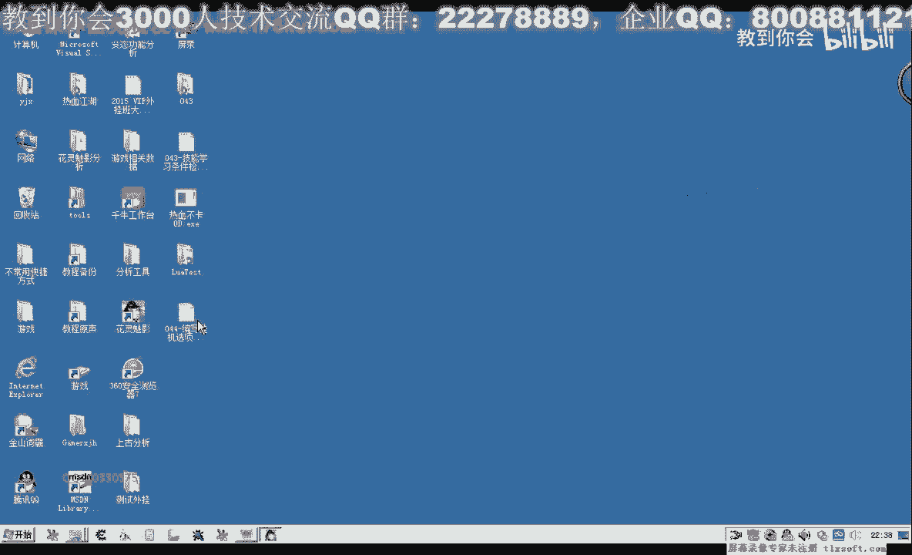

大家好，我是郁金香老师，那么在前面的课程里面，我们已经分析了一些数据，今天呢我们将为我们这些功能呢添加一些界面的设计，那么我们打开第43课的代码。

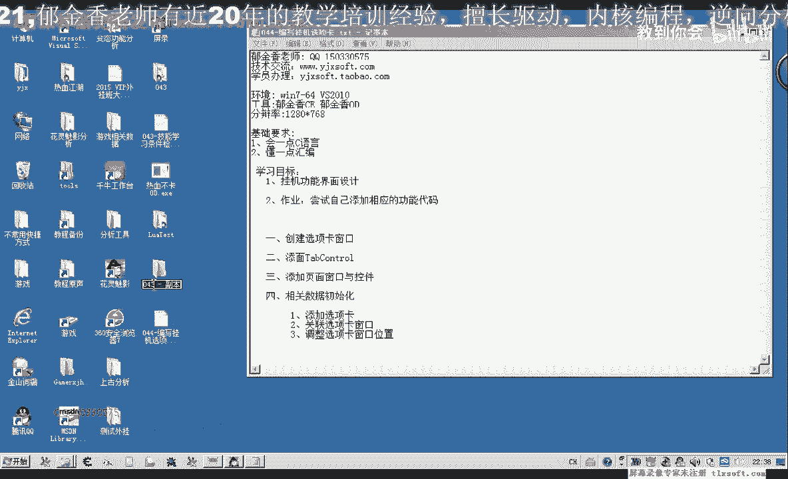

打开代码之后呢，我们切换到资源选项卡，然后添加新的资源选择啊，这个窗口当然那个新建。

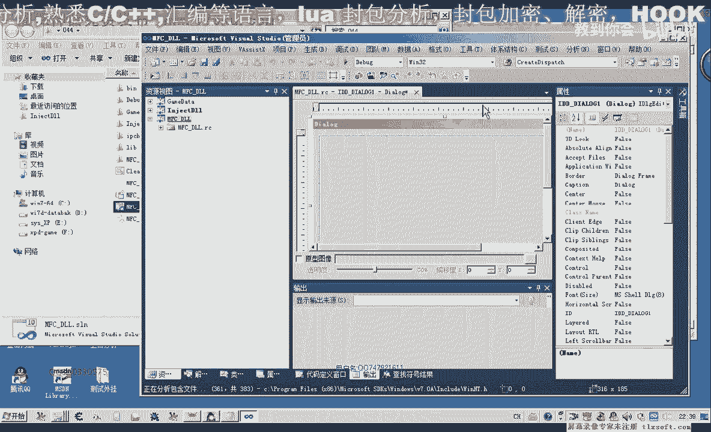

那么删掉多余的按钮，那么我们在制作外挂的时候呢，用的最多的就是这个table country选项卡控件，用它设置了比较方便啊，到时候它会有很多的选项卡，每一个选项卡呢我们会关联一个相应的窗口。

那么添加好了之后呢，我们再对它的id啊进行一些修改，这样大家看起来更具有可读性，八，那，么修改好了之后呢，我们还可以把这个标题啊这些进行一下相应的设置。

然后这个tab control的样式呢也可以进行一些修改，那么改成你喜欢的样式就可以了，那么暂时呢我们不做修改，啊那么调整好了之后呢，我们需要来添加一个这个相应的内，那么我们这个呢就叫做c，开启。

好添加完了之后呢，我们点完成，那么另外呢我们每一个每一个这个table控件呢，我们每一个这个选项卡，我们需要跟它关联一个这个对话框，所以说这里我们还需要添加相应的单元，比如说我们添加一个挂机的啊。

这个选项卡，那么我们就要建一个挂机的窗口页面，那么在这里呢我们把它的这个boder这个属性呢我们改为long，就是没有这个窗口，那么调整好了之后呢，我们添加相应的控件。

比如说我们添加的自动挂机这个贡献或者是自动转换都可以，啊添加好了之后呢，那么等一会呢我们为了呃确定它的位置呢，还可以另外加一个控件，加在最下边啊，加一个静态的空间，啊然后呢对它进行一些调整，窗口的大小。

好调整好了之后呢，我们接下来呢就进行一些代码的设置，进行一个关联，当然这里呢我们需要添加一个类，那么这个内容我们就叫做c配置，搞挂挂挂机的一个页面，然后呢点完成嗯，在关联这个录之前呢。

我们对这个对话框的id呢给它进行一下相应的修改，那么这里呢我们就要做page，挂机，啊然后呢再添加位，点完成，那么完成了之后，我们切换到类似图，然后我们选刚才的这个page one table。

转到这里之后呢，挂机这个页面添加了进来之后呢，我们给它添加一个pc的单元，然后添加我们的成员变量，把它作为，再去挂机，然后呢把它作为一个成员变量，好添加完了之后，我们可以先做一下编译，那我检查一下。

我们看什么地方有错，佩奇挂机啊，然后呢，他说这里要缺少一个数，那么这个c page呢挂机呢他不认识，那么我们看一下在这个配置挂机这个单元里面，我们是怎么定义的，刚才，啊c配置挂机啊，可能是大小写。

也可能是法，然后我们再转到这里，再来看一下，录制一下挂机，然后再编译生成，啊重新编译一下整个解决方案，好编译成功之后呢，那么这个单元我们添加进来了，添加进来之后，那么我们注入之后要显示这个窗口。

方便我们测试，在这里我们再添加一个，那么在外挂没有完成之前呢，我们就在这个位置显示显示外挂或者叫登陆外挂都可以，那么在这里呢我们进行的刚才的这个空间的一个形式分析，在显示之前。

播完这个page mutable啊，这个单元，然后我们在他的这个录里面呢，给它创建一个相关的成员变量，先把带了个windo，在patch my page，然后，科技这，同时我们选重写。

那么重写这里呢我们在它的初始化函数这里，对话框初始化的这个i p大案的这里来添加代码，那么在这个位置呢我们创建窗口啊，因为我们显示的不是模态的话，那么在这里创建窗口c pc i t t。

把他的id传进来就可以了，然后再编一下，那么这里编译成功了之后呢，我们就可以显示这个窗口，显示外挂这里，嗯，修文的。

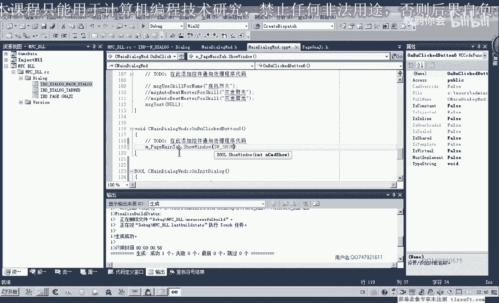

啊然后我们就可以进行测试。

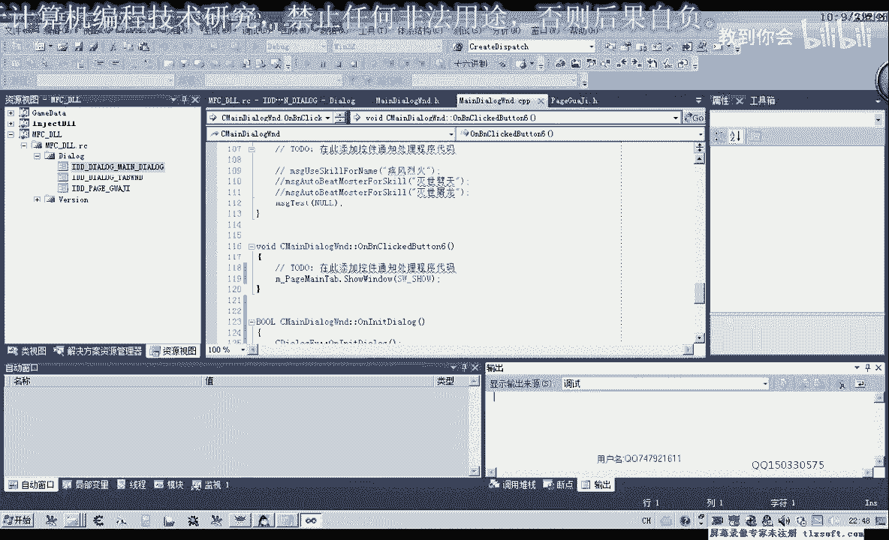

对了我们还需要把它重新再编一下，还有相应的单元，我们需要做一个调整，把它的标题啊复制下来，替换到这个地方，啊然后再编译一下，同时把它设置为启动项目，那么调试啊，这里的工作步骤我们也要跟他设置一下。

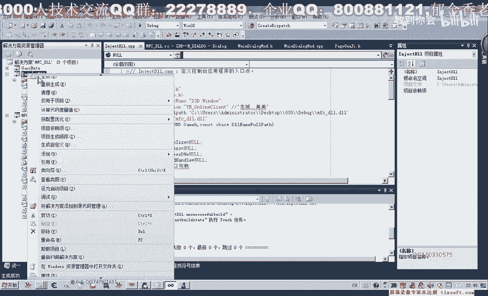

那么这个时候我们显示外挂，我们看显示出来的这个新窗口呢，还没有这个选项卡，因为我们想象的不一样，那么这个时候呢我们把它关掉。

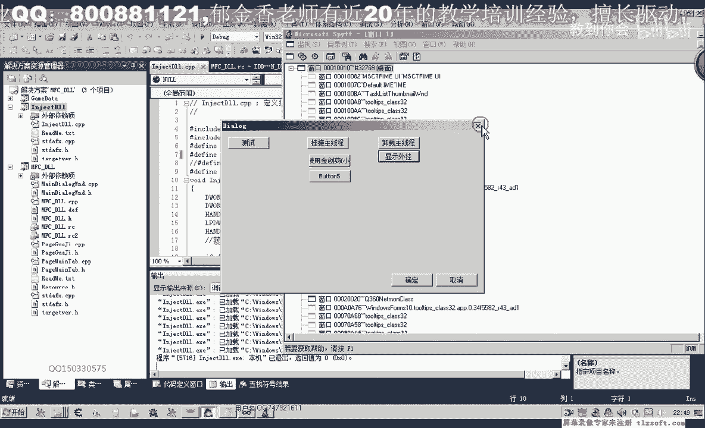

因为我们还要进行一些初始化，要添加这个框架的选项卡，那么这个时候我们转到啊这个mtable单元，重写它的初始化函数，那么在这个位置呢我们添加啊，当然在之前我们还需要呢呃关联一个table选项卡的控件。

控件变量能，点完成，那么完成了之后呢，我们再切换到内饰图初始化按钮。

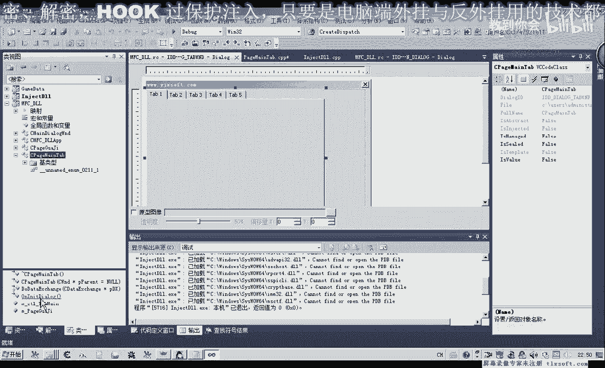

这里按tab，然后呢对它进行一些相关的操作，添加选项卡，那这是我们它的一个序号选项卡，第一个选项卡，那么这个呢我们就叫做挂机，那么再添加一个选项卡，那么这个选项卡我们暂时还不知道做什么，就叫做测试。

好然后我们再编译一下，来看一下效果。

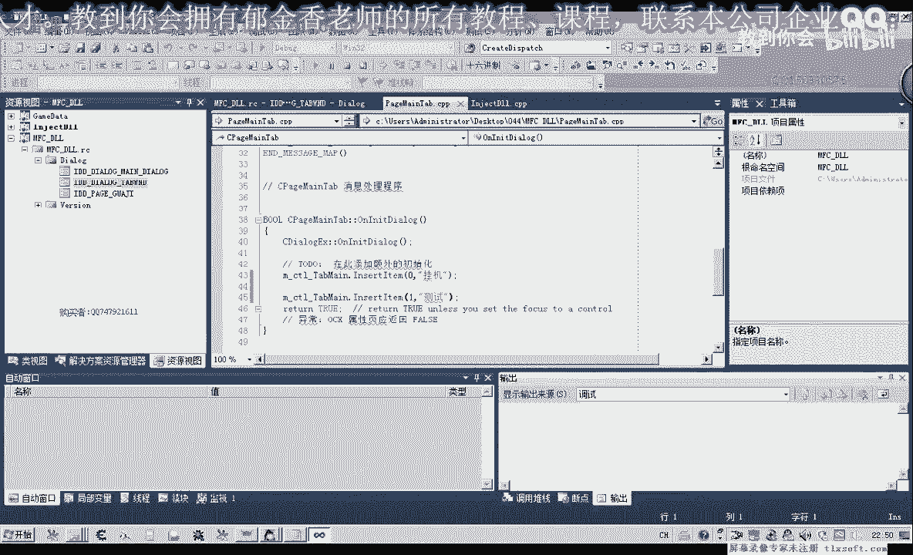

那么这个时候呢就有了两个选项卡，但是里边呢它没有内容，要内容的话，我们需要呢把我们刚才建的这个页面啊给它关联上去，也就是挂机自动打怪，这个页面我们要给它放上去，要放上去的话，我们在这里呢。

要进行相关的一个优化，自动的自动挂机啊，刚才我们好像已经建了一个相应的对我们看一下啊，自动挂机的内建好之后呢，这里我们添加了一个成员变量挂机页面的，那么这个挂机页面呢我们也需要转到它的初始化单元呢。

进行初始化的操作，那么首先我们在这里也是要创建这个窗口，因为我们不是显示为模态的，那么它的窗口的i t来源就来源于这个另一面了，这个阴谋他i t啊每句都行的，i t好，那么创建好了之后呢。

我们需要给它给它设置一个副窗口，如果不给它设置一，个副窗口的话，这个时候呢它显示出来的这个窗口位置啊，不对，那我们显示一下这个窗口，看一下，那么便宜。

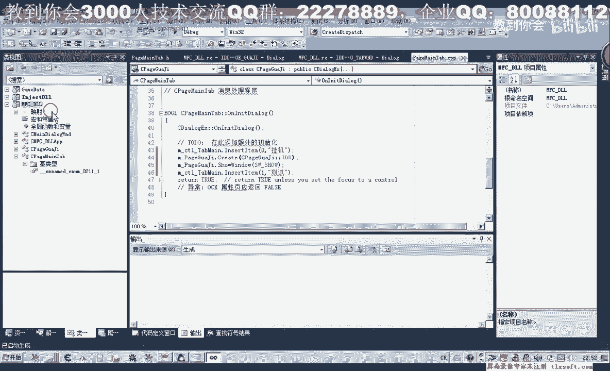

好编译成功之后呢，我们再来看一下现在的情况。

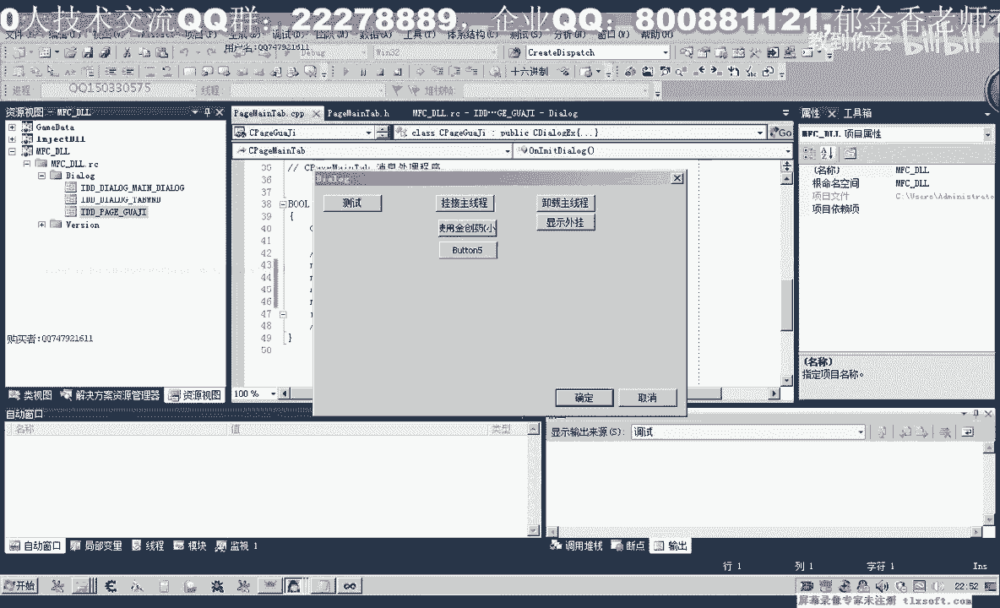

那么这个的时候这时候的情况比较乱，那么我们显示外挂的时候的话，那么这个窗口和这个窗口呢它会独自的显示出来啊，所以说呢这种效果的话明显不是我们所想要的，那么这个时候我们需要添加一些代码。

要给它设置一个副窗口，这个新的页面，因为它的这个副窗口的话，我们就要设置这个控件，这个tab控件，然后呢取得这个控件的支撑，啊然后呢我们再来看一下效果，啊显示外挂，这个时候呢什么都没显示出来。

但是我们刚才的这个窗口呢，它不会乱显示啊，这是，那么我们还需要做的呢，就是嗯要为这个相应的选项卡啊，关联一些待遇，那么我们在移到我们的这个泰国window，在这这里呢我们双击这个选项卡控件。

在这里呢我们为它啊关联这个选相应选项卡的代码控件变量，然后我们取得当前选中的选项卡，这个表示我们当前的选项卡的一个数字组，那么这里添加相关的课程，也就是挂机，那么在这个位置呢，我们就显示了，挂机啊。

这个窗口，k那么在后面这里呢，如果单击了其他的选项卡，那么我们就隐藏好，再编译一下，但是我们想要的那个窗口呢，它还是没有显示出来，也就是这个自动打怪的窗口，因为它的位置的话可能是不对的啊。

那么我们还要对它的位置呢作为一个调整，那么转到这个嗯pg啊，mtable在在他的这个初始化这里呢，我们再对它的位置呢做一个调整，那么它的位置的话是相对于这个选项卡控件的。

那么所以说我们先啊取得取得这个选项卡控件的位置，那么在前面呢我们听下去一张，为此，那么在这里呢我们先取得他的嗯这个客户区啊位置，那么该题肯定啊，2014题，然后呢我们传一个呃这个矩形结构的历史基础。

那么取得了之后呢，我们不能够直接拿来用啊，因为我们来看一下嗯，这个资源窗肯定，那么因为它上面这里有一排的话，他取得的是这个点，这个点还有这个点，一共四个点，上下左右的一个位置。

我们要剪掉前面的这个按钮的一个位置，在这里呢它大概是占20个单位，那么所以说在这里的话，我们要加上相应的，那么我们还要对他取得这个矩形的坐标之后呢，我们还要对它进行一些修改，那么它的这个top，那么我。

们要加副手位，在它原有的基础上呢，我们将日式左右啊，然后它左边的坐标呢我们root，我们给它加上，加上二左右框，再让我们的这个挂机页面呢移到这个位置上来，move等等啊，然后传直接传这个矩形坐标就行。

然后我们再编译一下，显示外挂啊，这个时候呢我们发现它已经能够显示出来了，但是它的位置的话还有一点不对，如果再往下面移一点的话，可能会更好，还有在下面的这个位置呢，感觉也被超出了啊。

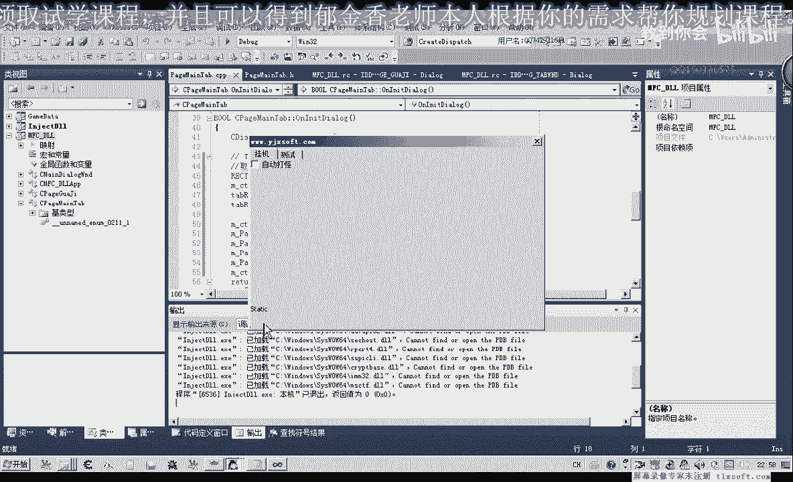

那么我们再做一个相应的调整，再在它的基础上呢，我们加三，这里呢它的基础上我们再加三嗯，然后下面的坐标呢我们再给它减减一部分，tab，那么下面的这个坐标呢叫bolton，这个坐标呢我们给它减三减负值三。

然后还有一个右边的坐标叫right的，那么我们也它减负数，在它原有的基础上减三。

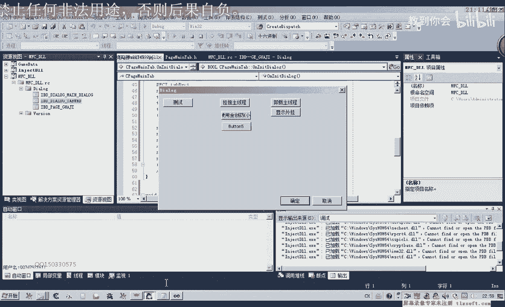

再显示，那么这个时候我们看看一下啊，上下左右的话，看起来的话，它显示呢就比较正常一些了，就比较正常一些，那么他的观点的话，我们啊就这样了，那么下一节课呢我们在为这个界面呢添加相应的代码进行。

或者是增加一些啊界面的一些元素，那么比如说我们设置好了之后，我们还可以呢在这这两边呢添加一些按钮啊，用来应用设置开始挂机啊，停止挂机啊，这一类的，好的具体的操作呢我们又在嗯下一节课啊再进行。

那么大家呢可以把它这个代码的添加当成一个坐列哈，先下去先下去之后呢自己操作一下，好的。

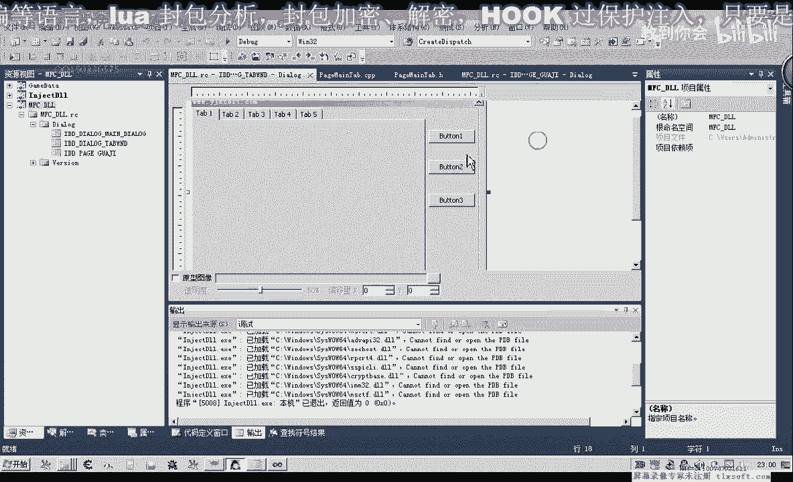