# P36：047-快速更新基址方法 - 教到你会 - BV1DS4y1n7qF

我是郁金香老师，那么今天的游戏有一次大的更新，嗯，大部分机子都不能够使用了，那么所以说今天呢我们讲一下机子的更新，那么首先呢我们找到跟dt，然后wega这个单元，那么这里面呢我们有啊。

这就是我们目前用到的这些机制啊，先把它复制出来啊，那么今天呢我们就以前面这三个啊做一个例子来谈一下呃，怎样快速的更新我们游戏的机制，那么首先呢我们以背包的这个机子为例，先把它复制一下。

然后我们建一个新建一个文件，把红的名字复制一下，然后我们打开呃，之前我们的分析的一些资料做一个参考，背包的我们找一下背包，大概第11课，那么11课呢在这里呢我们抓了一些啊，这个代码把它复制出来。

这是我们11号分析的时候呢抓的一段汇编代码，那么在这个地方就是我们背包的机子，但是游戏更新之后的话，这些汇编的指令实际上呢它的改动呢不是很大，比如说像像下面这个数组的访问的方式，它一般来说是没有变化的。

只是我们改变的只是上面的这个机子，那么所以说我们可以通过这条指令来进行一下搜索，搜索这条指令，还有这条指定啊，因为搜索一条指令的话，可能呢它会有重复的，那么我们可以这样来定位更新我们的机制。

先打开我们的游戏。

打开了之后，我们用ot附加到游戏里面。

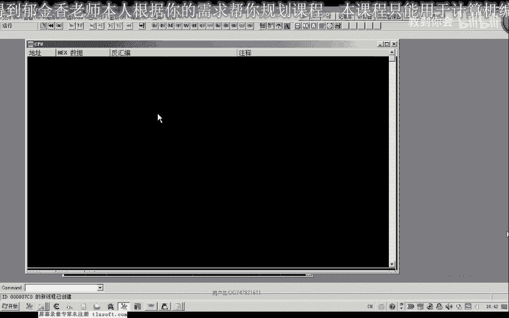

那么附加到游戏之后呢，我们转到之前的地址。

那么之前的机子呢是在这个位置开始。

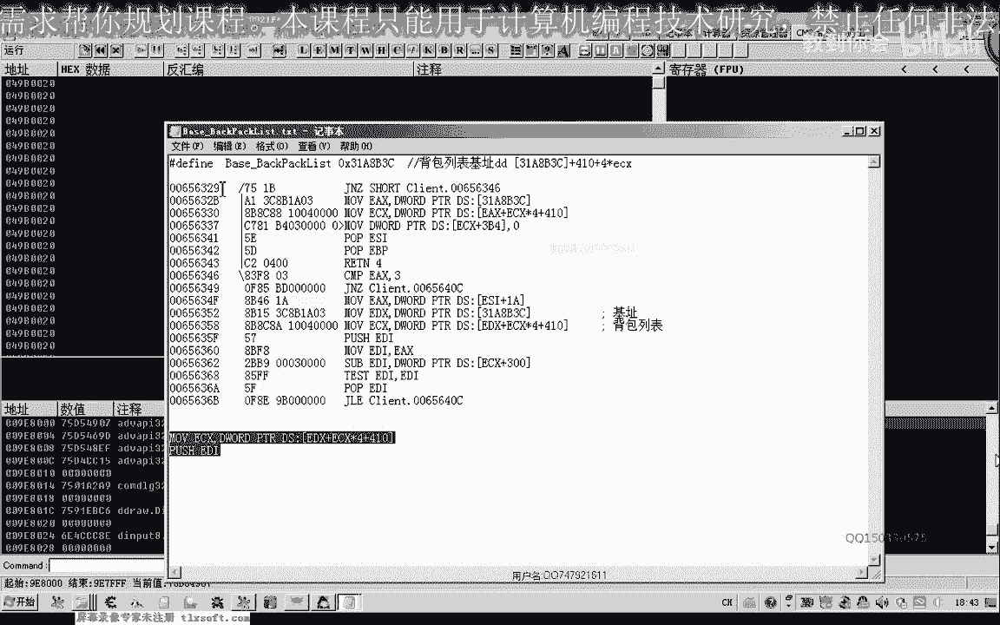

我们把这个地址复制一下，因为代码更新之后的话。

它也是在它的前后，这个机制呢不是在他它的前面一些呢，就是在它的后面一些啊，那么我们可以在这个地方呢来搜一下我们的这两段指令，当然在后面的复习一点，后面的这段指令呢也可以把它复制下来。

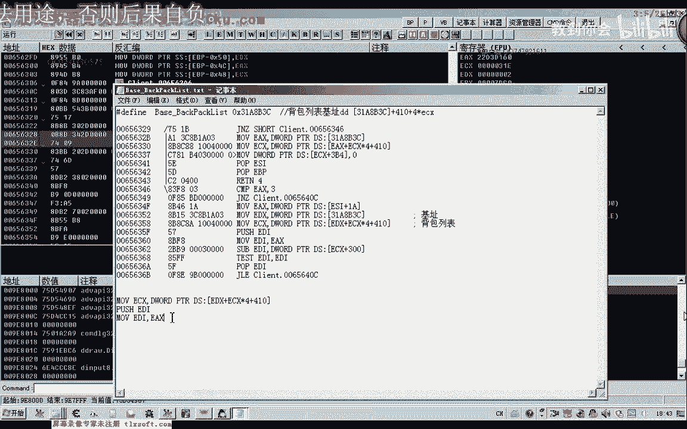

复制下来之后，然后我们在这里有一个查找所有命令序列，然后我们复制进去点一下查找，那么这个时候呢我们找到两个地方嗯，这个地方我们双击进去，然后呢就是我们找到的地方。

那么它的前面这里呢就是我们的机子就能够定位到底，这样我们很简单哈。

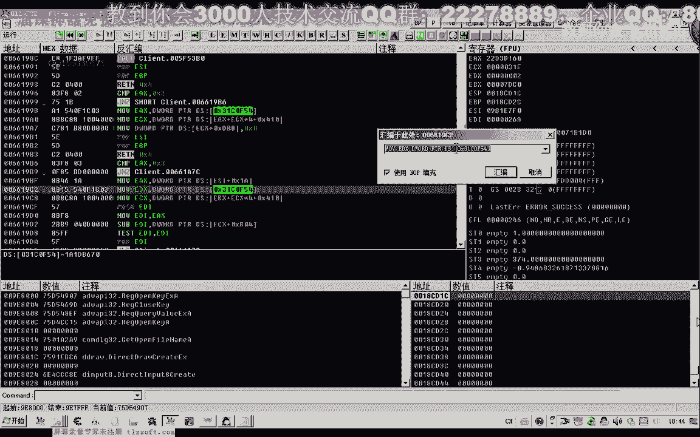

通过我。

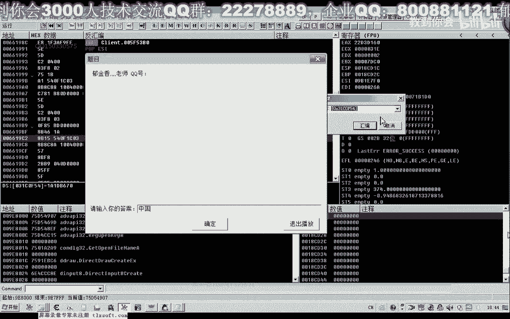

们的命令序列来定位，这里加上410啊，加上我们的5c就是第一个的名字。

那我们用tc来看一下精通要到这是我们第一个方法，那么第二个是雪原声，我们看一下，这里加上一个4x1啊，血缘生，那么证明我们找到的是正确的啊，这是我们嗯新的机制，然后我们把它更新在前边。

那么这个老的这一段呢我们就可以删掉了。

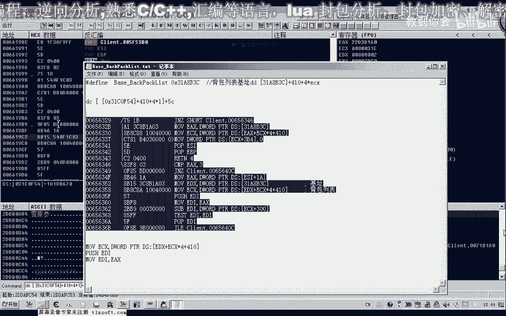

因为下次游戏的更新的话，它的机制呢肯定是更接近于我们这一次，那么这里是我们的背包气质。

那么这是新的背包机子，我们把它注释一下，那么前面这里还有一个这两个都是，那么把这一段呢周围的这一段啊，尽量多复制一点，那么下次呢我们就用这个新的代码作为一个特征码来进行一个搜索。

那么这是前面的我们提取的指令特征，那么除了这个指令特征之外呢，我们还可以用c一来更新这个快速的更新这个机制，因为这个指令的话，实际上我们说到这个指令呢，它实际上都是一段机器码。

在前面的话都是以机器码的形式，那么我们也可以把这段机器码把它提取出来，比如说这一句指令，这个是五七复制在后面，这个指令是八bf 8点或者在后面，那么这段指令呢，而2b b9 什么的，比九什么什么的。

我们也把它复制在后面，然后删掉空头啊复制，然后呢这里呢我们附加到游戏，这里我们选16进制，选字节数组，然后开始搜索，然后我们也能够搜索到这个指令的附近，搜索到之后，我们把这个地址栏复制一下。

然后点查看内存前往地址，前往我们找到的这个地址，那么它的最前面一句呢就是我们的机子，那么在这里呢我们也可以汇编，那么这个3c31 c6 f54 呢就是我们要找的这个句子，那么这是用c一的方式来来更新。

那么在这里呢我们不是自己代码，好了，那那么这是我们背包的这个机子的一个更新啊，那么下次的话我们就可以按照这种方式来来快速的更新，当然这个特征码我们也可以把它加到相应的工具里面，或者自己编写一个工具。

通过这个特征码来更新也是可以，但是特征码的话最好让我们去多取几个啊，比如说我们还可以取后面的特征，比如说啊这一段，那么再加上我们的，这一段是，那么这段代码呢我们也可以作为一个特征码。

那么它也可以定位到它的一个附近，2p81 ，我们看一下是不是不是错了，滴滴，我是复制了这一块没服把500分，这是8b f80 ，然后是2p b成，那我前面还有一个5c，是删掉重新，之所以是。

啊这样呢它也能够更新到它的一个附近，然后我们也能够转到相应的一个内存，好的，这是我们的啊一种方法啊，那么我们再来做一个测试啊。

再来找一下core的一个地址，那么第二个呢我们这个是啊，第三个这个是背包括物品使用的这个扩的一个地址，我们来看一下用同样的方式能不能够实现，同样的把这个红的名字啊复制一下，作为它的一个文件名。

然后我们找到java里边啊，之前我们分析的背包的物品使用第13课，那么在这里呢我们也提取了一段相应的特征码，把它复制一下，那么我们也可以根据这段特征码来进行一个定位。

那么首先呢我们把这前面的这一段啊复制一下，我们先用c一来进行一下尝试，搜一下它的特征，看能不能够收到，而复制转到我们的声音清扫描，这个时候呢我们发现这个特征呢我们没有收到，那么我们再尝试下一个特征。

因为他有一部分特征，它可能以及有些更新之后，它肯定有一部分变动了，好然后呢我们复制，新商标啊，那么这个时候呢我们找到一个戒指，找到之后，我们把这个地址复制出来，查看内存，前往地址，那么前往之后呢。

我们看一下，那么它下面三个push之后呢，就是一个空，那么这里有三个图形啊，我们看一下这一段指令与我们这一段指令的话，它都是一样的，都是一样的，然后下面这里是一个空，那么这里是一个扣。

那么这个扣的话就是我们的物品使用的扣，那么我们在这里会给啊，就能够找到它，好那么我们不把它更新一下，那么也把这段新的特征我们给它加在后面，不是，那么前面的这个特征呢，我们实际上可以把它删掉了啊。

当然我们还可以做另外的一个测试，这只是用我们的o d来说了，我们也可以在c一里面通过指令特征来收它，那么指定特征的话，我们呢因为前面两句，我们说这个相应的这个呃机器特征码已经搜不到了。

证明这两句指令的话也是废了，那么所以说我们直接嗯用后面的这个指令做一个特征，然后这里呢我们加上一个5514x1 tx，因为前面后面的这个空已经变了，那么这一句肯定不能够做一个指令的一个特征。

那么这个我们做指令特征的时候呢，有一个圆角，这里边呢不要包含这一种啊，呃地址啊，直接的我们可以包含偏移或这种指定好的，那么我们复制一下。

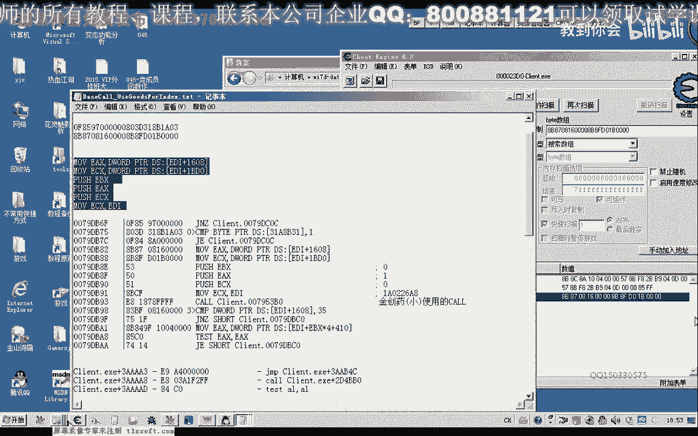

那么在复制了之后呢，我们还有一点要先转到他以前的指令的周围，这样的话我们搜出来更快一些，然后呢我们知道它的前比较前面一点，再复制这个指令串，那么在这里呢再查找一个相应的所有的命令序列，查找。

但是这个时候我们并没有找到啊，因为找到我们可以尝试一下，从前面这一段取消掉一条指令，再来讲一下所有文件序列，好那么这个时候呢找到了一个地方，就是这个地方就是这个地方。

那么这里呢就是我们获得这个物品使用库的一个地址，背包物品使用，那么我们可以在这里下一个段，那么使用一个物品做，做一个上市云深啊，那么它的下标应该是一啊，这里我们可以看到它的物品下标是一。

那我们看一下这里呢是它的一个参数，是它的一个参数。

下标参数应该是ex，那么我们使用第一个看一下，第一个的话ex的啊应该是这上面一个才是，这里是零一，这个才是下调，这个ebx应该才产生它的下标，你看唯一的只有这个啊，产生了一个变化，好的。

那么我们再来进行一下尝试，把它移到地理三个啊，下标13，这个时候b b x，好的，那么我们把这个也复制一下新的机器码，我这个使命套餐这一段，用这个新的指令来来替换以前的这个指令。

因为游戏下一次更新的时候的话，肯定它是在现有的基础上进行一个更改，那么替换掉我们之前的机制，好保存一下，然后我们再分析一下人物的属性，那么人物的属性我们找一下，人物属性的分析，那么人物属性这一块呢。

我们没有一个没有提取相应的这个指令以及这个特征码，所以说这这这个我们只以另外的方式来更新嗯，我们可以打开第八课再看一下，那么我们也可以另外新建一个文件，能够属性的，新建文本文档。

然后打开把这个属性的红名字啊复制一下，然后把相应的偏移，我们把它复制出来，这，好保存一下，那么我们要更新这个机子的话，人物的名字可能重复的地方比较多，那么我们可以根据一些比较具有呃。

具有一个相对唯一性的一些数据呢进行一个呃回溯，比如说我们可以找到历练或者是当前的一个血值啊，精炼值，然后再减掉相应的偏移，可以求出这个机制，那么在这里呢我们选一下清扫描，全是自己，十进制。

然后看一下现在的力量是多少，103919，然后03919，那我们搜搜索一下，那么这个时候呢搜索到一个地址，就是这个地址2f9 g啊，那我们把这个历练的地址复制一下。

转到我们的o d里面，那么既然这个地方是历练啊，那么因为我们的机子加上ac是历练的地址，所以说这个地方呢它减0s的话，就恰好是我们的机子人物的名字啊。

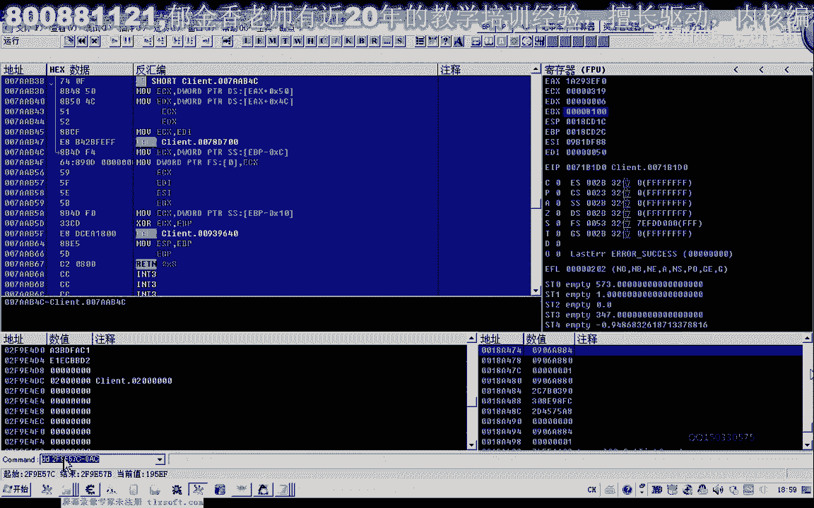

这个地方，那么我们把这个地址抄下来，2f1914 。

大，那是一四进好，那么这个地方的话，我们再回来加上ac就是历练，那我们再来看一下它的其他偏离。

然后再加上84hp mp。

我们看一下加80这个位置，现在的血值是1113，血值1113，内功是678，那我们看一下内工程啊，678。

再看一下我们的。

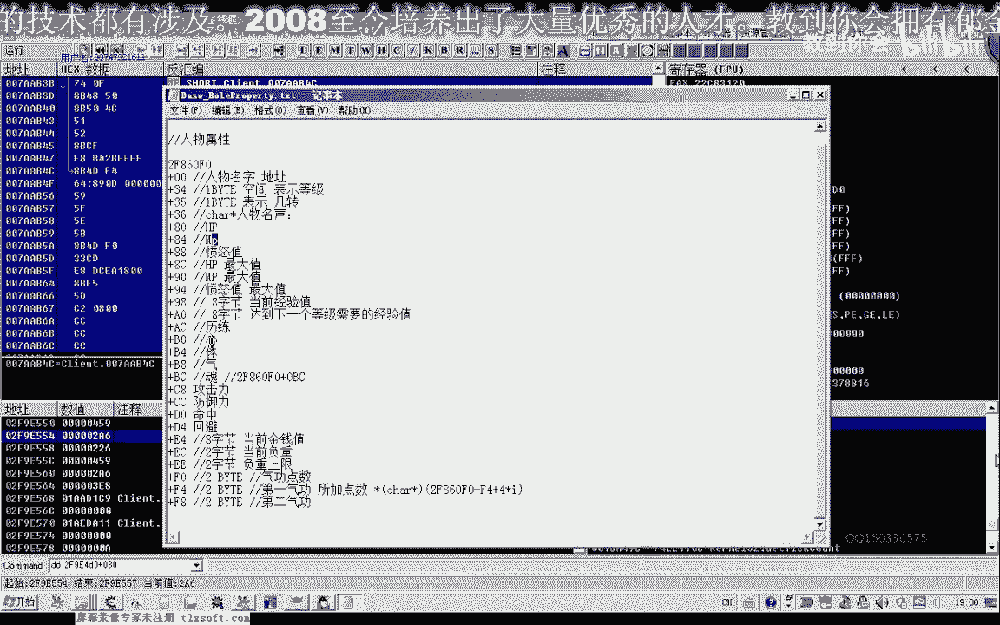

防御啊，防御力加cc，这个地方，那么防御力是多少，我们看一下483，那么这里呢是483，那么说明我们找到的是正确的这个地方，它就是我们新的呃人物属性的一个机制更新在这个地方。

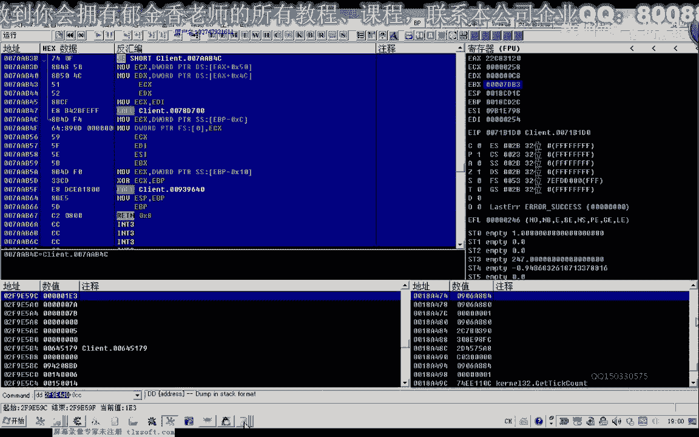

那么保存一下。

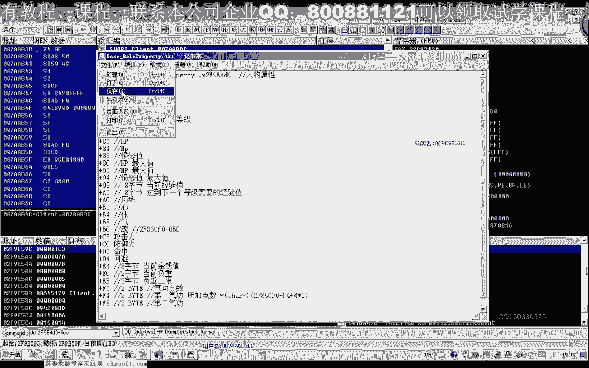

那么同时呢我们下次呢也可以用特征码来搜，但在这之前呢，我们在里边在ot里边呢搜一下啊，这个常量，所有的常量搜一下，那么我们可以收到很多啊使用这个人物属性的这个机制的地方。

那么在这里呢我们用第一个比较靠前的，这个是要开头的，这个这是我们的人物属性介质，那么这个机子的话，我们也把它称为的代码啊，呃复制一下。

那么下一次呢我们也可以通过相应的这个特征码来进行一个定位了。

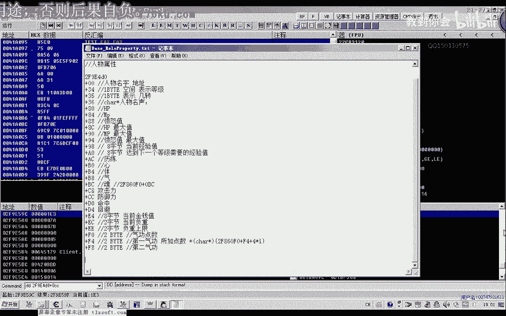

那我比如说我们就可以把这前前两句这个指令做一个特征嘛，那么进行一个定位，然后找到它的一个附近，那在这里边呢他也可以搜啊，也可以查找我们的这个所有的常量或者是二进制的字串，它也可以找。

也可以把这个数字来复制进来，进行一个相应的一个查找。

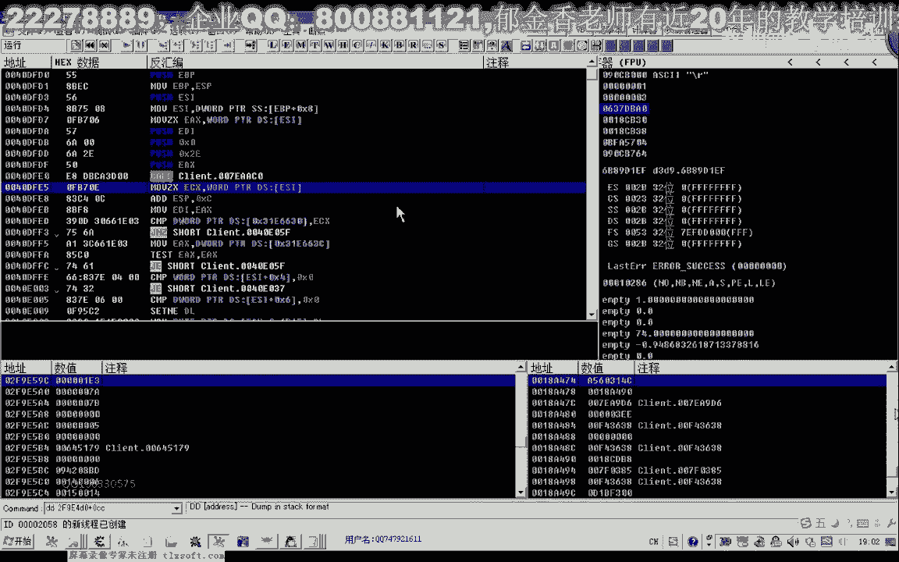

但是呢他肯定没有我们的这个c一啊，用途方便。

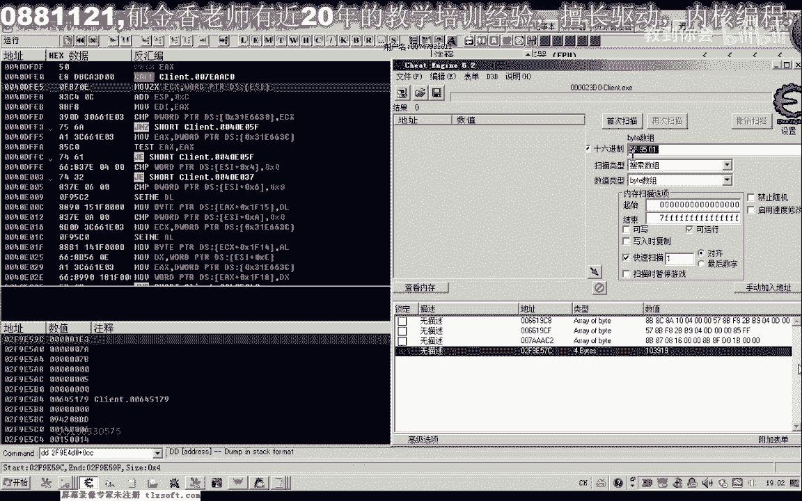

好我试一下。

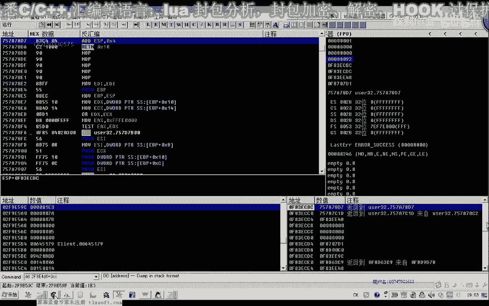

这个时候我们也能够进入到它的一个附近啊。

然后呢把它添加进来，把这个地址复制一下，然后呢我们查看六场前往到前往到了这个地址，那么前往到地址之后呢，我们需要把这两个特征呢进行一下对比，它距离我们后面真正的这个地址有多远，需要有一个大致的一个偏移。

那么在看一下啊，这前面的有一个呃一个17c e x e x的一个174的这样一段视频，才能够定定位到它的一个周文，那么我们往后走一下，那么这里有个174，那么这里的话就是我们的在这里汇编的话。

再看一下174，后面还有一句话，还有这样的一个语句，那么还要往后面移一下，应该是这个地方才是我们的机子啊设定，那么要注意它前后的一个指令，那么实际上我们用这一段指令的话，就可以直接定义到它的一个附近。

用它来做一个特征，加上我妈，这直接就是我们的后面就是我们的特征码b9 来自木啊，ex那么加上这一段，那么这样的话我们就直接能够定定位到我们的机子附近，注意这个空格我们要删掉，不然的话找不到，再看一下啊。

能够熟悉啊，再加上我们的这一句指令，删掉空格，然后再加上一个，在一起，复制一下，刚才我们中间少了一段啊，少了两两条指令，那么这样的话我们也能够直接定位到这个412056啊，这个我这条指令。

那么它的下面这里的话就能够找到我们相应的机制，查看各，我想前往地址，那么直接就可以定位到我们的基础布局好的，那么这节课呢我们就就讲到这里，那么剩下的这些机制呢就做一个作业啊，大家下去把它做一下。

这是提取的特征码，那么我们下次也可以，下次游戏更新的时候，也可以用它做一个尝试。

