# 郁金香老师C／C++纯干货 - P39：050-动态定位技术-ScanFeatureCode - 教到你会 - BV1DS4y1n7qF

大家好，我是刘基贤老师，那么前面结课的时候。

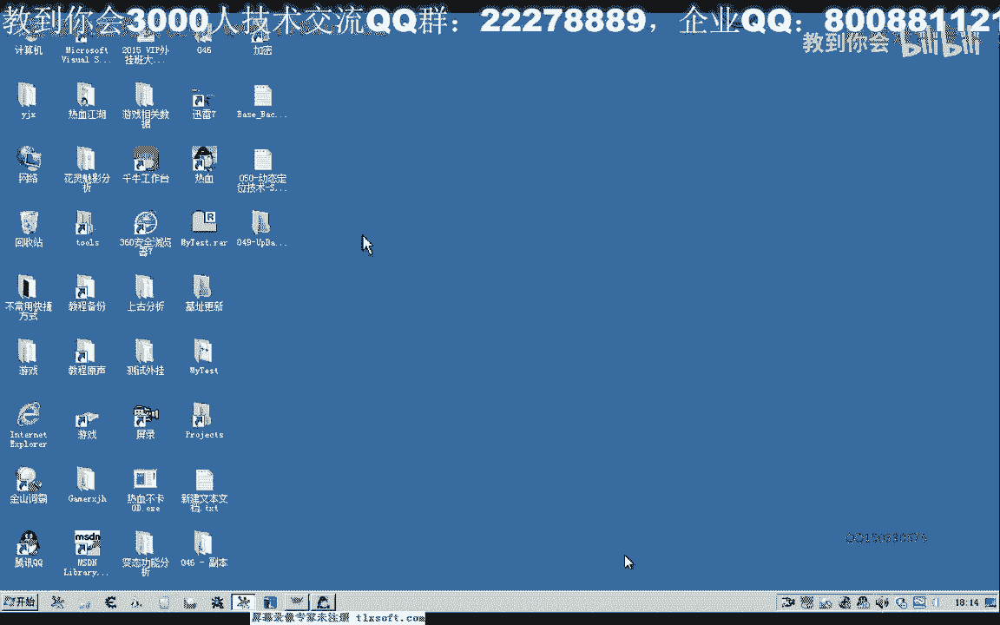

我们已经为这个动态定位啊，在这个函数呢嗯编写了一些相关的函数，那么今天呢我们一起来嗯写这个主函数啊，搜索特征码头，那么我们打开第49课的代码。

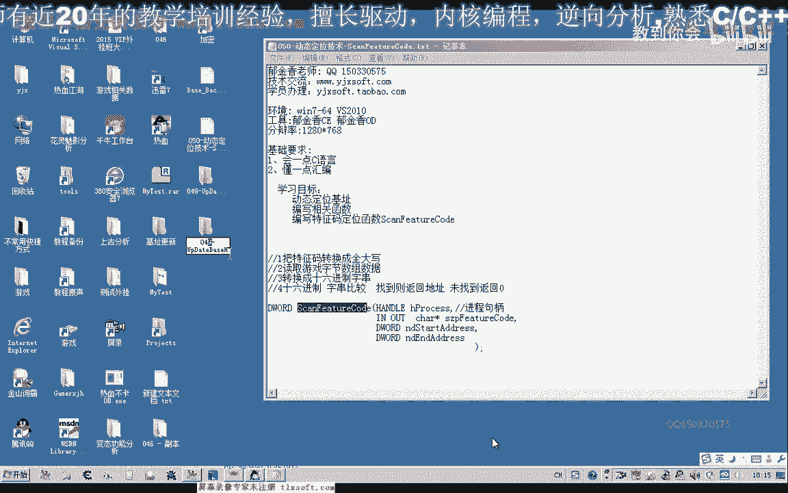

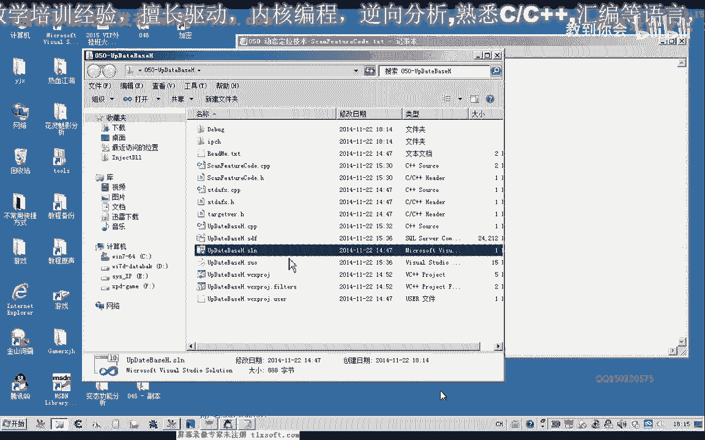

那么展开我们的机子定位这个目录，首先我们把这个函数的说明给它添加进去，那么这个函数呢首先我们要需要一个游戏窗口的进程距比，那么第二个呢是我们的特征码啊，字符串特征码的字符串16进制的。

那么第四个参数呢是我们要在进程里面哈开始搜索的一个地址，那么最后一个呢是结束的这个地址，这个就相当于我们c一里面的这个起始或结束啊，未成扫描选项就相当于这这两个选择选项，而我们的。

比如我们的特征码就相当于是呃这个字节数组啊，这里面，好的，那么我们自己来写一下相关的这个函数，那么转到我们的cp p单元，移到最后。

嘟嘟嘟嘟嘟。

那么首先呢我们要做的工作呢是把我们的特征码转换成大写，那么如果最后都没有找到这个字串呢，我们就返回空，那么这是我们的特征码字串，那么关于这个16进制的嗯字串转换为我们的大写的这个函数呢。

我们之前已经写过了，并做了相关的测试，那么我们直接拿出来用就可以，那么经过这个转换之后呢，接下来我们就读取我们的游戏里面的数据啊，那么读取的话我们也要循环的一个读取，那么从这个开始地址到结束地址吧。

然后我们全部的数据啊都要读取，但是我们也不可能说一次性的所有都读出来啊，这样比较耗内存，那么所以说我们把它分解，它进行分页的读取，那么这个每一页的话，我们读起来1k b卡，也就是1024字节。

那么这个大小呢也可以是其他的整数啊，那么我建议的话是这个1024的倍数啊，因为这样很方便技术啊，1024kb的话就是1024字节的话就是一kb，刚好每次读一kb的大小，那么但是呢我们需要循环的图啊。

那么循环的读读读出来之后呢，每次读取的这个大小的话，也要嗯至少也要读这个102424这么多大小，那么这个用来存放这个数据的缓冲区肯定要大于这个1024自己，那么至少我们还要加上这个特征，马的一个长度啊。

这样方便我们比较啊，这样我们才能够所有的内存呢都能够搜索到，不然的话我们直接是1024，这样读取的话，那么有一部分呢我们将搜索不到，那么在这里我们建立一个相应的缓冲区，能进义为bat类型。

那么它的一个大小呢，我们在这里呢把它定义成一个指针，定义成指针的目的呢，我们是为了方便呢嗯分配这个内存空间的大小，这样我们可以用六指针代表来额分配它的一个大小，那么它就等于page size。

加上我们的字串的一个长度，那么之前我们还需要把这个字串的长度跟它计算出来，那么这个字串长度呢等于我们传进来的特征码的这个长度，但是我们特征码的长度的话，它本身是嗯是否串类型的。

那么比如说我们0x a f那么这个呢它实际上的话字串的话，a f这两个字串的话，它是占了两次几，但如果是实用性质的话，实际上它只占一字节，那么所以说在这里的话，他这我们要取得的长度的话。

这里呢实际上实际上除二才是他真正的一个长度，那么所以说在这里的话，我们再加上嗯等等，那么它除以二，再加上一个，再加上一，最后呢还有一个字串的一个结束，我们要给它加上，尾部要加一个零。

这里加一或加二都是可以的啊，那我们设大一点，那么这个是每次我们要读取的一个缓冲与大小，3号，但是我们一共要把这个开始的到结束的地址来一嗯嗯痛，要读完的话，一般来这里我们可以从零满32位的话。

其实地址来可以是零，这里是可以是0x7 fm 1034号，这样我们可以给它规定一个起始大小，那么如果是我们这个游戏为例的话，我们来看一下它的模块机制的一个大小，那么在这里的话。

它是从0x40100 开始它的机制，那么我们在模块里面可以看到它的机子，那么机子的话是004，后面五个零，那么所以说我们在这里的话，我们也可以看到取名为004。1234。

那么这样来跟他复出值也是可以的啊，因为我们要查找的本身就是从这个地址开始，那么接下来的话我们需要循环的读取来，那么在这里我们给它用一个建一个相关的变量，用一个for循环来读取，那么当前的地址来。

我从起始地址开始看，第四大的也就是传进来的这个400开始，那么这个最终的地址的话，它是要小于，小于我们的n d n的，但是我们还有这里呢它有一个字串的一个长度，字串的一个长度。

那么所以说我们要还要减掉这个特征码的一个长度，五点n put除二，因为是字串类型的，我们这里的话是字节啊类型的数据，那么每次呢他还要加上一串数字，那么下一次的时候的话，他就要进行一个向后推移。

这个地址不足以能够停止，加上排气size，那么这就是我们下一次要读取的一个啊机制，那么每次来每一次循环的话，它就增加了女儿是自己，然后我们读取的时候，我们用追的process慢慢追。

第一个是游戏窗口的句柄，第二个是起始地址，那么起始地址呢我们就是当前地址，那么我们要读取的缓冲区大小就是这个数值的尺寸，那么每次他要读取的大小呢，我们就是32。

那么这里好像用这个size of好像是不可以的啊，对对对，那么这里我们每次要读取的大小的话，就是这个排气赛季，再加上打法，那么就是这一段实际上我们要每次要读取的一个大小，实际上也是这个缓冲区大小。

但是这种我们分配的这种而动态分配的指针呢，我们用set of的话，好像它是不能够取出它的一个取值的，所以说在这里呢我们直接嗯要加上它，那么我们就直接把这个字串儿加镜头，那么后嗯嗯嗯嗯。

后面呢是我们每一次把它读取的一个实际的一个大小，那么我们在前面再建一个变量，目前，那么这个呢我们给它进行一个相关的初始化，在这里我们传它的地址程序就行了，这是我们实际所需的大小。

那么这样的话我们每次的话就读了一片内存区区域出来啊，那么读取出来之后呢，沉到了这个缓冲区，那么接下来的话我们就要对这个缓冲区来进行逐一自己的一个比较，逐字节的比较好数据啊，数据我们比较的话。

那么主世界的比较的话，我们也要用一个for循环来比较，那么我们用一个下标i来表示i赋值为零，那么从呃首字节第一次节开始比较，那么i的值来，最终呢它要小于我们的这个配置size。

要小于我们的page size，那么而且的话我们在比较的时候呢，嗯i加加，然后每一次的时候呢，我们要给它建一个临时的字串，用来转换成16进制的字符串，然后采取我们的特征码呀，它的类型才相同。

我们才能够进行一个比较，那么在这里呢我们再进行一个，恰，三，退，等等，那么这个呢我们就给他建建一个固定的大小256自己，那么这里呢我们给它做一个值，给空空的一个字串啊，铺一个初值。

那么然后呢我们对这个呃对这个缓冲区来进行一个初始化，并且转换特征码长度的一个字串，那么这里呢我们要用到同文件里面的一个函数啊，之前我们编编写bt图啊，这个bt的数据呢我们把它转换为16进制的字串。

那么首先呢我们是要转换的这个缓冲区，那么缓冲区的话就是我们之前读取的这个nb date 8分，那么这里呢因为要循环，那么第一次的话我们就是下标零，然后呢每次从1234这样循环啊，那，么第二个参数。

就是它的一个大小，那么它的大小的话就是我们的前面的这个ending line啊，除二就是它的一个大小，那么最后一个呢是它的缓冲区，用来存存放这个字符串的这啊。

然后我们就是特征码比我们的这个参考能够比较好比较之后，那么如果这个数值呢它等于处理啊，那么我们就返回，或者说这个数值它不等于，那么呢我们这里呢就返回，地址嗯。

但是这个地址呢我用我们要把它计算出来才可以进行一个访问，那我们来再来看一下我们的逻辑啊，这里呢我们转换成16进制，然后呢就可以进行一个相关的一个比较，那么比较之后的话，当前的地址又该返回多少。

那么当前的地址就是我们的啊，应该是我们当前的这个当前地址，嗯嗯嗯嗯，再加上一个我们这里呢i的这个下标，那么最终呢是我们搜索到的这个地址，那么这就是我们要返回的地址。

那么如果整个循环循环完了都没有搜索到的话，我们就应该返回一个空子啊，那么我们再编译一下，那我们再来再一次来看一下我们的逻辑，看起来没有问题，但是我们来测试一下哈，如果有问题的话，我们就能够体现出来。

那么之前的这一段呢我们都可以删掉了，或者先注释掉，那么现在我们要测测试的这个函数呢，就是搜索相关的这个他怎么，那么搜索特征码的话，首先呢我们要取得游戏的句柄。

八那么呢然后我们要取得这个游戏的罪名或标题名。

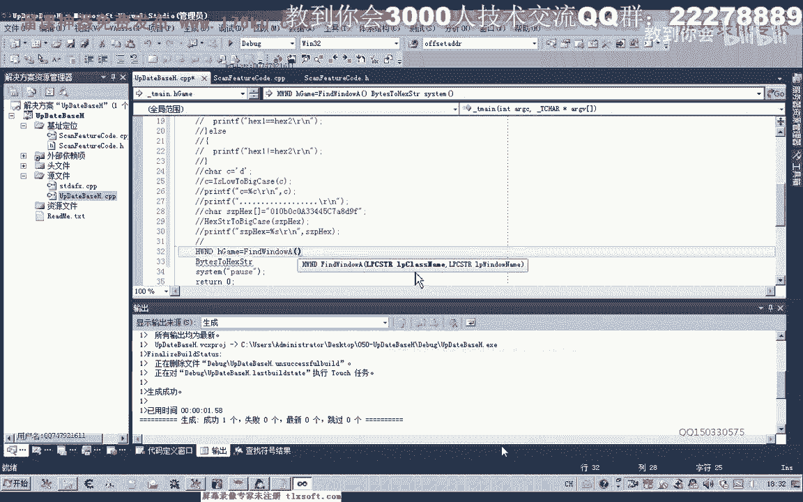

那么这个我们打开之前的46氪领域呢。

这里面有相关的信息，把这两句啊进行一下复制。

如果找到了这个窗口去，比如果这个窗口去评，找到的是等于零的话，那么我们就打印相关的一个一段信息，好那么如果我们这的这个窗口区别找到了，那么我们先获取进程的i d，那么这个p i d获取到之后呢。

我们再再获取这个进程的句柄，那么这个进进程的句柄呢，实际上我们只需要有一个读取曲线就可以，然后呢这里呢是我们的p i d啊，进程i d环境，那么这里呢我们再做一个判断，那么如果进程句柄给你个空的话。

那么我们也打印出相关的信息，啵啵，好然后呢我们如果这里的进程成功打开了之后呢，我们就接下来就可以调用我们的特征码搜索，但是呢我们要之前呢我们要定义一段啊相关的一个特征码。

然后呢我们看一下前面的背包和相关的一个特征码，那么比如说我们就用它稳定来搜索一下，那么如果是搜索到的话，就应该是这个六六啊，19d1 ，啊这这是在我们游戏未更新的情况下。

那么应该是如果是游戏更新的，也应该是在这个地址周围，那么特征码我们先进行复制，那么复制之后呢，我们再进行一个搜索，第一个我们的游戏的进程句柄，第二个我们的特征码，那么第三个呢是起始地址。

后面的这两个我们可以不管，然后呢我们打印出法需要用一个变量来接收它的返回值，然后我们把这个找到的地址来打印出来，好的，那么我们让它跑起来，那么这个时候呢他会说不能够接受两个参数，那么我们再看一下头文件。

那么我们把这里呢进行一个初始号，那我把函数里面的这个初始化呢，我们就需要关掉，不然的话编译的时候它一定不错。

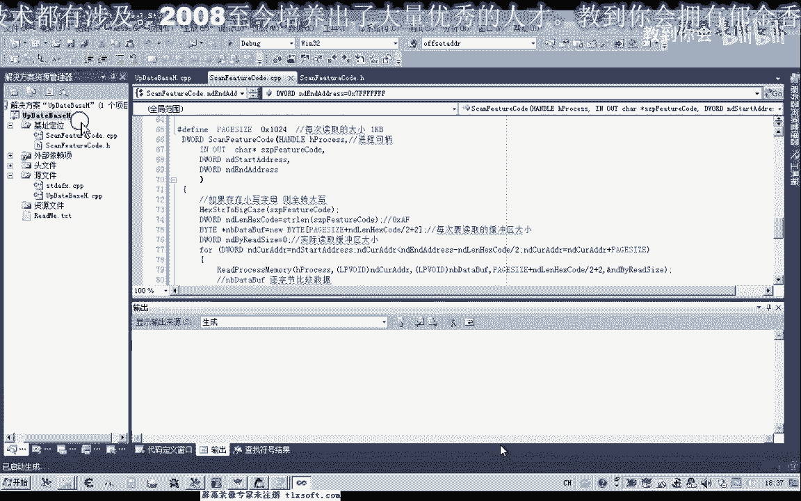

好那么我们让它跑起来。

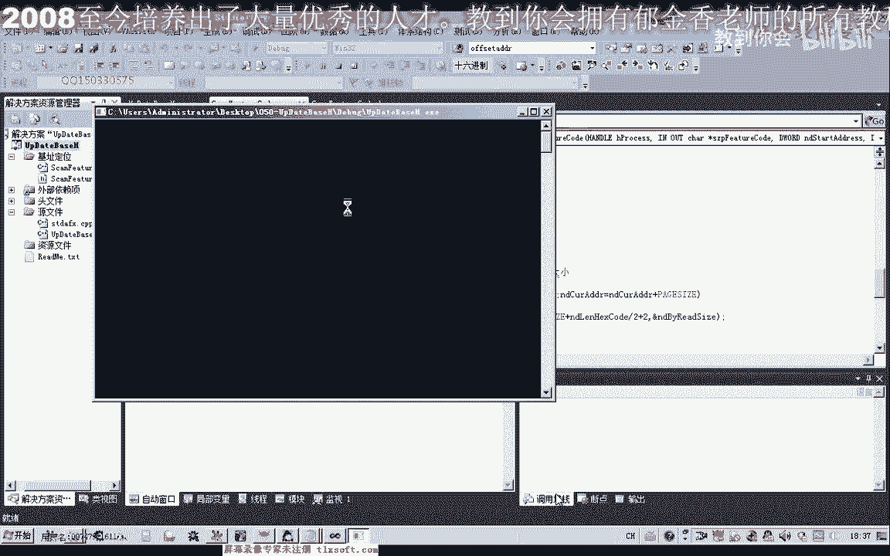

那么这个时候呢可能是反应很慢哈，这里呢在不断的在循环再找啊，最后呢呃找了很长的时间呢，最后才定位到了6619b1 ，那么这种算法的话啊，嗯应该是有问题的啊。

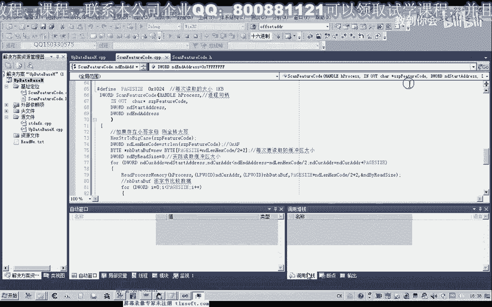

要进行一定的优化，那么一般我们自己写的代码的话应该是比较优化的，那么唯一出问题的话就是在我们的这个字字串转换这里，它转换的效率呢可能不是很高，那么可能是我们嗯这个bt的图啊。

就是字节节类型的转换成我们16进制，那么下一节课呢我们自己来写一个啊相关的函数来提高它的速度，替代我们的这个格式化字串，那么应该呢它就比较快，那么还有一种方法呢它也可以提高，那么我们在这里的时候呢。

我们主动的传入我们这个，这个代码的起始地地址我们给他传给他，比如说我们就传嗯，6616348传这个地址进去的话，他搜索的肯定就要快一些了，因为它离它比较近，然后我们可以尝试一下，把这个地址进去。

然后再开始搜索。

那么这样的话他也能够很快的搜索到达。

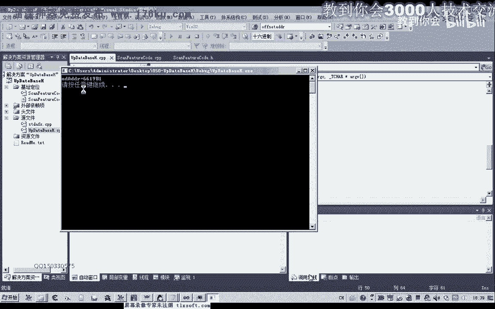

那么我们再换一个地址再进行一下测试，看能不能够找到，那么如果我们是收啊，是这个地址呢，把b开头的，那么我们看看能不能找到。

啊它也能够搜索到这个地址，这个时候那么也就是我们的6619以及，那么这个时候的话，我们也可以编写相应的代码，把这个嗯机子呢把它读出来啊，要读出这个机子的话，我们需要加上二幺的偏移。

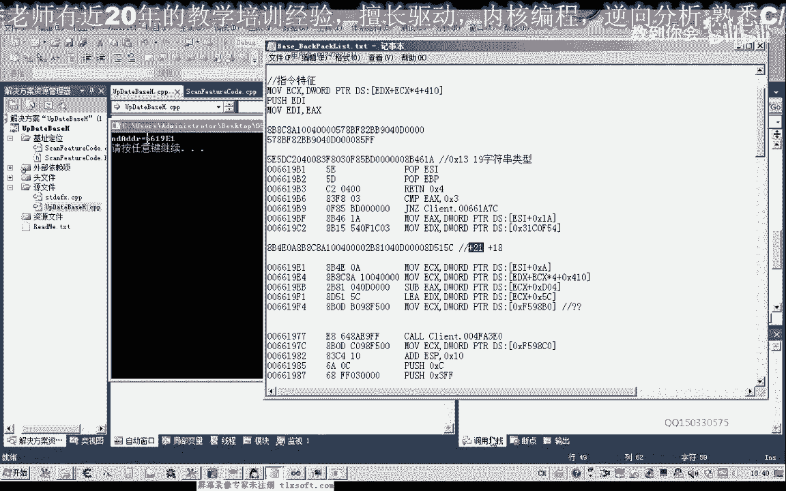

然后再读四字节出来就可以了，那么我们也可以把它读出来，那么这个时候啊，这个机子呢就要加上对焦的这个偏移，然后呢我们需要用，repos设置版本里面再读一次，那么其实这几，那么要读取的缓冲区的话。

我们也选这个地址，或者是另外写个也可以录取数据的话，我们另外定义一个变量，用来读取它的一个一debus，好最后我们这里来读四字节啊，一次性，最后这个呢我们就可以不要了，使劲读取了多少字节了，我们不关心。

那我们再运行一下。

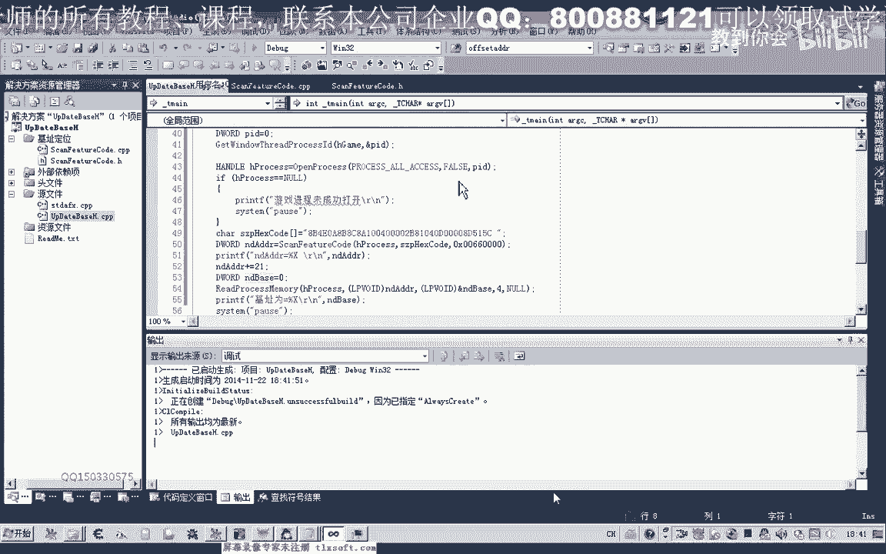

那么这个时候呢我们就可以把我们的相关的机制，这个f598 b0 就可以读出来了。

好的，那么这节课呢我们就就到这里嗯。

那么这里这节课呢也给大家留一个作业，那么这个作业呢就是我们之前说的要优化啊。

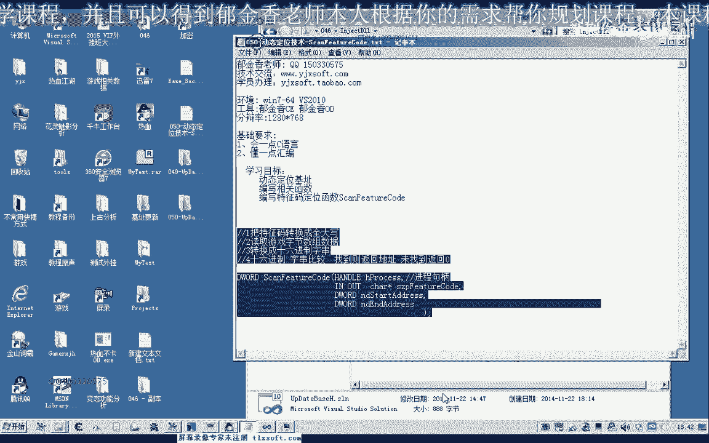

优化这个速度啊，那么提升这个速度速度，那么因为我们自己编写的代码的话，肯定呢它都相对要精简一些，那么我们就要少像这种情况的话，我们未来要提高一个效率的话，我们要少调用这个相关的一些函数。

那么尽量在这个循环里边的话，要少调用相关的这个函数，那么比如说我们在这循环里面，如果调用到point tf比较多的话，他应当也比较慢，那么在这里的话，最有可能出问题的就是啊，就是这个地方。

当然这个我们需要下一节课啊，测试的时候才知道啊，那么现在呢我们就需要自己来，大家就尝试一下自己编写一个函数来替换这一段代码的一个功能，好的。

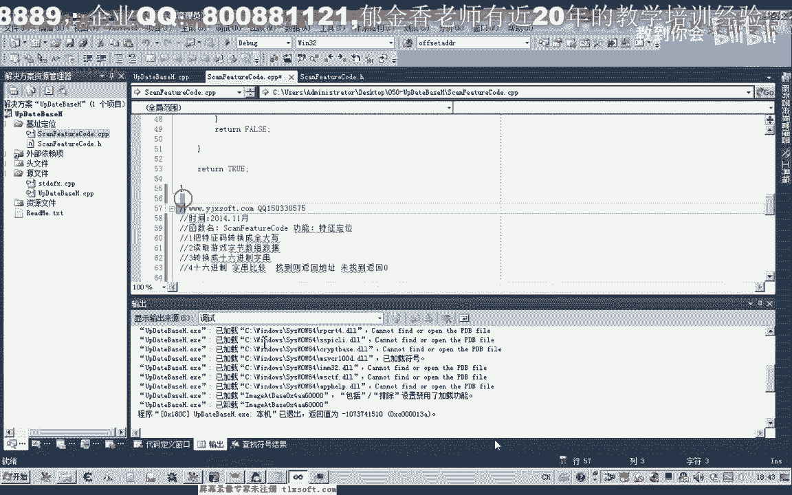

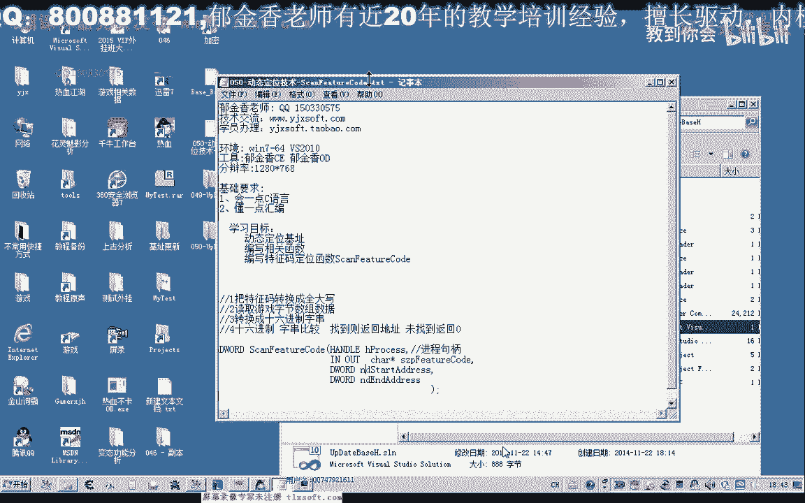

