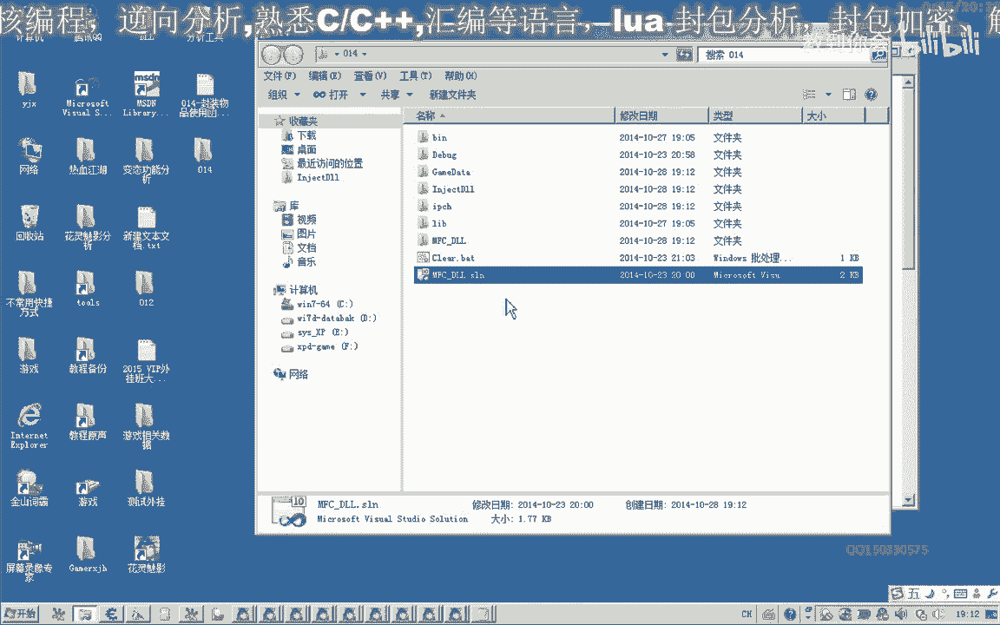
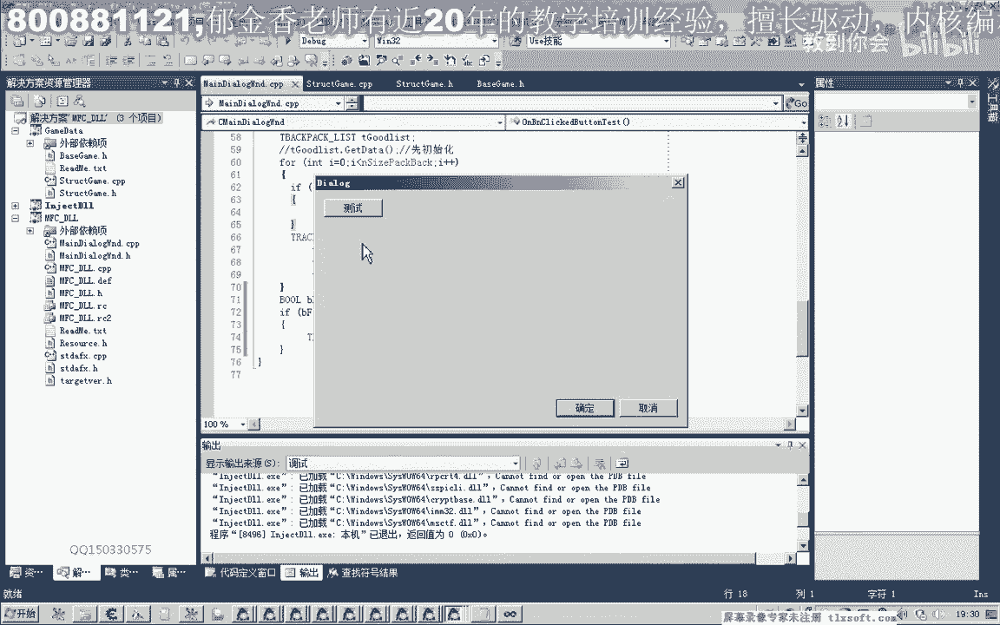
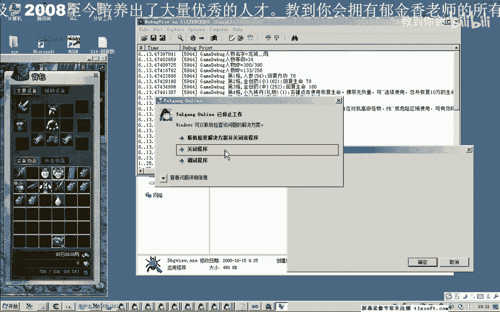
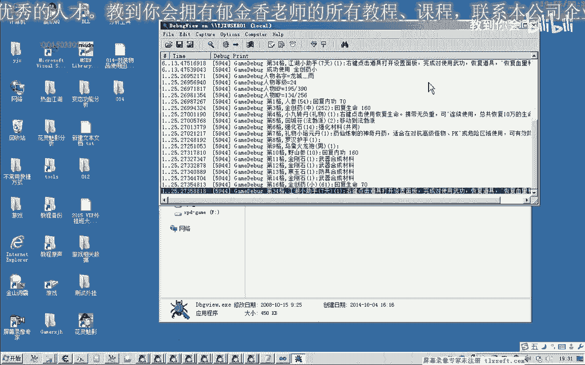
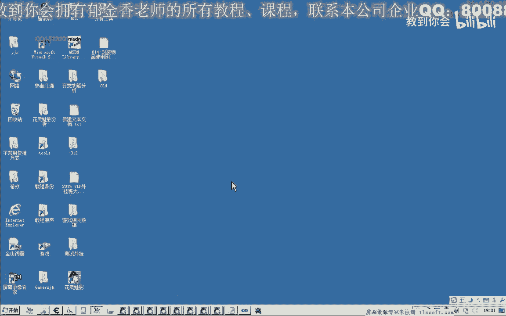
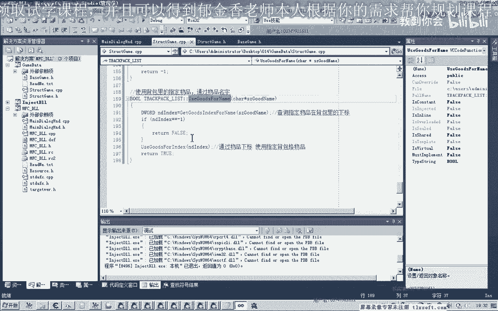

# 郁金香老师C／C++纯干货 - P3：014-封装物品使用函数 - 教到你会 - BV1DS4y1n7qF

大家好，我是郁金香老师，qq 15033059，欢迎大家参加预期项技术编程培训，那么今天我们这这节课呢，主要对啊这个背包物品使用的这个函数来进行功能的一个封装，那么封装好了之后呢。

我们可以直接传入一个呃药品的名字，就可以使用背包里面啊相应的一个物品，那么首先呢我们打开第12课的代码。

那么打开之后呢，首先我们还是添加我们的相关的机制，首先呢我们是这个啊背包物品使用课的啊，这个机子给它添加进去啊，啊使用物品，这，个是它的参数呢是一个下标，应该是使用背包，四格的物品。

那么第二个机子呢就是我们的呃背包的这个机子，之前呢我们已经有过了，有过定义了，那么接下来就是这个啊函数的一个封装啊，那么这个函数呢嗯可能是通过背包的一个下调来使用这个物品。

那么我们先把这个函数来封装一下，那么这个函数封装的位置呢，我们可以把它写在我们的结构里面，也就是背包啊相关的一个结构，我们可以写在这，那么这里我们添加了这个成员函数的说明之后呢。

然后我们再切换到我们的这个cpp代码单元啊，添加相关的按钮，那么我们这个时候在使用这个课的时候呢，我们也考虑到一个异常的一些处理，比如说这个相应的呃扣的这个地址又改变了之后。

所以说在这里呢我们先用一个tra处理处理相应的一个立场，哈哈哈，然后呢这也是，汇编代码块啊，好我们刚才复制的这个呃测试通过的这个代码，把它复制技能，然后还要做一定的修改。

那么第一个呢就是我们传进来的这个下标下标，那我先把它放到ex好，这里呢就是我们的这个机子背包的妻子背叛妻子，那么这个呢我们扣的时候呢，在我们编写代码的时候呢，不能够直接啊跳转到这个地址。

那么我们也是先把它放在t7 t e x c p，ex，那么如果出现异常的话，我们在这里啊，用我们的调试字串奥体附体，第八个尺寸的调试信息，我们说这个函数呢这里来出现了异常，好那我们先编译一下。

然后如果我们使用成功了，执行到了最后，那么我们在那里打红一个盘数值，这个我认为数值的可能，啊发光器啊，这里的防护器，当然我们要封装的这个课呢，这样使用的话，我们不是很方便。

因为我们不知道某一格它究竟是一个什么物品，所以说我们在这里呢还要另外封装一个扣，那么我们存在一下啊这个函数，那么另外呢我们要根据一个物品的名字来使用它，把物品的名字来使用，那么物品名字来使用的话。

在游戏里面呢没有直接的这样一个扣，那么这个需要我们自己来写，那么如果要写这样一个课的话，我们先要根据这个名字去搜索整个我们的背包数组啊，要搜索我们的一个背包，那么搜索到他某一格啊，如果在背包里面存在。

那么返回到这个下标，再调用前面的这个空来实现，那么所以说我们在写这个函数之前呢，我们最好呢呃另外再封装一个函数，用来查询这个物品存不存在，如果这个物品在背包里面的第n格存在呢，那么我们就返回这个下标啊。

对啊，好我们根据名字来去查询它的一个下标，在背包里面，把这个复制一下，然后，添加到这里，添加结构的前缀哈周音域的一个限制，咳咳咳咳咳，对，那么在写这个课的时候呢，我们的思路就是先骗你整个背光。

对方看你是否指定名字的物品是否存在这种存在，那么现在我们初始化，初始化结构，这样呢我们看才能够获取背包里面的数据，能够填充进来啊，前面的那么填充进来之后呢，我们用一个for循环来查询一下。

背包的大小加6/14到，然后我们查询的时候呢，我们就比较它的名字是否相等，有没有与我们传进来的这个物品的名字相等的，如果有相比的，那么我们就返回这个下标，它的下标i啊，那么我们可以用一个判断。

字符串的一个判断，三是内和我们这个背包里边的这个相关的这个数组进行一个判断，背包列表啊，然后呢对它的名字进行一个比较啊，比较，那么如果相等的话，它会返回零啊，那么如果相等呢，我们就返回它的一个下标i。

但如果执行整个循环，执行完了之后，我都没有查询到这个物品的话，那么我们跟他缓缓一趟，复一不一，因为这个下标呢它是从零开始的啊，所以说我们不能用普通的布尔值真或假来表示，所以说再来一张，我们只能访问-1。

那么如果不是-1的话，它从0~35就是我们的一个下标啊，这样就可以了嗯，啊，在骗你整个背包去查询这个物品的名字，然后呢这个列表，背包列表里面的这个名字，来与我们传进来的这个参数的名字来进行比较。

那么相等之后呢，我们把它的下标，那么有了这个下标之后的话，我们接下来我们工作这个函数的就是通过物品的名字啊，来使用这个背包里的物品，我们就呃很容易写，我出息，然后使用背包里看指定物品，通过这个物品一次。

差那么使用成功呢，最后呢我们这个我们可以用个电子来表示这个我们啊，我们在增值这个参数我们可以改一下，天气，那么首先呢我们要查询这个名字呢，就要调用一下前面的这个函数来查询一下指定的物品。

它在背包里边的啊，这个下标，咳咳咳，那么首先呢我们要进行判断，如果这个下载的话，它是等于的啊，-1，也就是说它不存在，那么直接呢我们就使用物品不成功啊，返回一个啊，这个假肢啊，也就是零啊。

返回名子啊就行，那么如果执行到了后面呢，就证明了这个嗯它不是为-1，是0~30之间的一个数值，那么我们就直接调用前面的这一个扣就行了，我们前面封装的这个空，直接这里来引一个下标的一个值来调用就行。

调用指定的物品的使用空，那么这里呢直接传递它的这个下标值进去，哈哈啊，这样的话逻辑的话就比较清晰啊，比较清晰，那么接下来呢我们呃测试一下我们所写的这个扣，慢慢到我们的测试单元。

那么前面呢他已经这里定义了这样一个结构，那么直接我们使用就行了啊，那个是故事不累，我们看一下啊，应该是一个，这里应该是分类，这里要改一下，使用物品i那会上面啊这样吗，这样我们代码的可读性要高一些。

通过物品的名字来使用它，那么这里呢我们写清创，要写，那么这里呢它有一个返回值，我们看一下它的返回值究竟有没有实验成功了，咳，好那我们看一下输入到哪一个窗口里面去了，注入到最后这个窗口里变量。

然后我们打开我们的嗯调试信息查看的一个工具，首先我们看一下啊，金创药小是62啊，它们数量测试一下61，那么我们成功的使用了这个金仓量，那么如果我们把它的这个移动一下，一到其他的格子啊。

我们也能够这个时候呢也能够使用到，但这个时候呢我们游戏呢嗯它有可能会崩溃啊，这是因为呢我们这个县城呢，因为我们的游戏限制呢，它所在的哈，就是说他访问这个相相关的数据的时候时候呢有一个冲突啊。

嗯因为它不是属于一个呃同一个线程的多线程，它的多线程操作同一块这个数据的时候呢，你可能会产生一些冲突和错误啊，那么这个问题呢我们在下一节课啊解决好。

那么这节课呢我们就到这里。

那么下一节课呢我们在这个函数本身它是没有问题的，应该只是说说我们的这个线从来没有挂机在游戏的主线程上边，那么下一节课呢我们修改我们的代码，那么我们可以呃解决的方法很简单。

我们通过呃这个贺卡的方式来注入我们的这个动态链接库就可以了。

