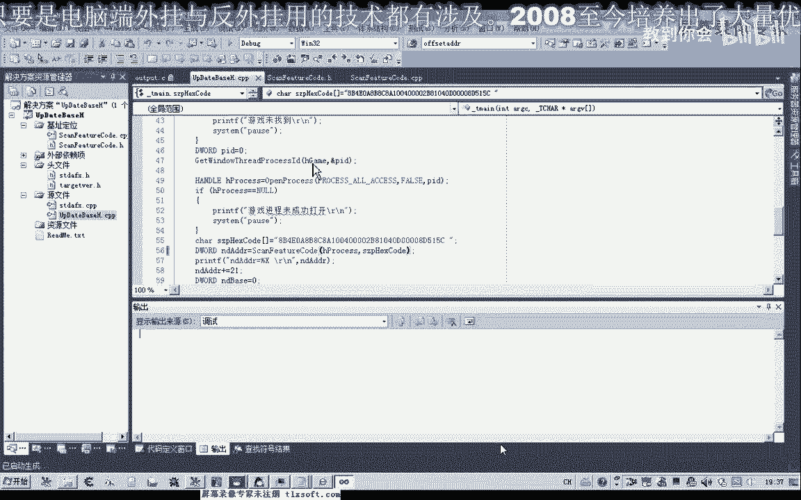

# P40：051-动态定位技术代码优化-扫描提速 - 教到你会 - BV1DS4y1n7qF

大家好，我是郁金香老师，那么上一节课我们编写了嗯搜索特征码的这个函数，但是我们在测试的时候呢，我们发现了搜索的这个定位的速度特别的慢啊，占用cpu资源非常的高，那么在这节课呢我们做一些优化处理啊。

进行一个相关的提速，那么打开第50课的代码。

那么经过我们的这个测试发现呢，嗯我们所编写的代码的话，大部分代码都是自己所写的，那在循环里边的话，我们反复的要用一个啊，也就是嗯这个字节的数组转换成16进制啊，那么也就是这个函数反复的在调用。

那么这一个函数的话都是我们纯手工写的哈，里面的话应该是没有任何问题的，那么在这之前循环的外面这一层的话，也就是这个it to嗯，h e x s t2 哈字节集转成16进制的字串。

那么循环里面呢就含有这个函数，那么可能会存在一个速度的问题，那么在这里呢调用了一个格式化，这，不串也没法信啊，那么我们这节课呢就尝试一下自己写一个函数来替换，替换掉这个s p r i n g f。

那么当然我们在替换的同时呢，它的这个功能呢我们不能够变，那么也就是说我们自己要把后面的这个字节的数据，转换成16进制的字符串的一个形式，那么在这里呢我们写一个新的函数，那么在书写之前呢。

我们要做一下分析，首先比如说我们这个用c来表示后面的这一个字符啊，那么这个c这个字符的话，比如说它是二五，我们要转换成16进制的f f的话，那么我们应该怎么转换呢，那么这个时候呢我们第一位可以用呢。

还有公主，那么取它的余数取多少呢，取整除16之后的余数啊，那么这个时候呢那我们可以算一下，用计算器，255÷16，那么这个时候呢它等于一五，那么一五在乘以一六呢，240，也就是说250255。

他它的余数的话也就是多少呢，也就是幺五啊，那么这个幺五的话也就是我们个位上的这个f啊，那么我们的这个高位上的f呢，它实际上也就是我们整除的这个结果，也就是我，们先清一下名字，那么这个25255÷16。

那么这个时候呢它本身呢等于幺五啊，那么也就是说他这个低位等于幺五，高位高位也等于腰部呢有两个腰部来组成的这个，那么这个需要我们自己的转换呢，把它拆分成分成，分成两部分，那么另外一种情况下。

比如说这个幺零，那么这个幺零它如果是，来取余数的话，那么除以幺六的话本身就等于幺零，那么它的高位的话等于零，那么最终呢这结果就是0a啊，这个a呢来表示的十进制的压力。

那么这个呢是f那么比如说我们再换一个形式，比如说啊330这个数值时间最短，它要转化成我们的16进制的话就是360，首先我们取它的低位除以16，那么这个时候的低位等于14，高位呢等于一啊。

因为整除之后呢等于一，那么加起来呢腰四呢是d啊，那么最终的结果呢你就是1d啊，应该是一四，应该是1g1 e才对啊，这样的啊啊那么我们知道了大致的原理的话，那么我们就可以开始写我们的这个代码。

把这个函数的说明复制一下，那么我们就在它的前面呢进行一个相应的代码代码书写，那么首先传进来之后呢，我们就需要来取他的这个呃，低位和高位，那么这里我们建两个变量，用来专门存放它的低位和这个高位，哈哈哈。

那么第一位的话我们用l来表示no，那么低位呢我们先复制为零坏的，然后高位，那么也复制为零，那么我们这次先来进行一个初始化，那么接着呢我们再对它进行一个复制。

那么第一位的话我们就等于它的一个呃取模等于一个余数c啊，这个取余数，然后呢幺六因为它是16进制的，这里是它的一个进制，16进制，然后高位呢就直接就等于我们的c除以幺六啊，那么这样我们就取得了高位。

那么去直接问，那么这两部分我们组合起来就是我们的呃，就是我们的16进制了，那么我们要来怎么来组合它呢，现在我们得到的是一个什么呢，呃这高位肯定也是一个0~15的一个数据。

那么低位和高未来都是0~15的一个数据，所以说我们就要对它进行一个转换，那么我们要把这个数值来转换成为字符，那么这个时候呢我们要加一个判断，那么首先呢我们来进行低位的一个进行高位的一个处理啊。

应该是先进行比海，那么如果这个呢它大于嗯我们有一个范围啊，首先我们有一个嗯，如果这个数值它大于等于九的话，大于九的时候我们应该怎么处理，那么小于九的时候，我们有一个处理，它是一个两方面的一个处理。

因为大于九之后的话，我们就要用什么来表示呢，要用a b，c第1f要用这几个字母来表示，那么如果是太小，那么如果不是大于九的话，那么肯定就是小于九啊，那么它就只有这两种情况啊，那么如果是小于的话。

我们就用另外一种处理的方式，那么另外一种情况的话，肯定也就是我们的0~9个这个数值，那么分为这两种情况，那么在这种情况下呢，我们这个呃三，啊sp这个buffer，那么它的嗯我们也要取他的高位和低位。

那么他的高位的话恰好呢是从零开始的啊，那么零开始呢我们这里呢我们就要对它进行一个赋值，那么首先它从零开始的话，我们就是从多少开始呢，嗯，那么它最先的一个起始地址的话。

就应该是a b c d e f这几个数字当中去选，那么去选的话，我们在这里呢可可以来给他做一个相关的一个计算，那么就是首先我们用大写的字母a表示，那么这个a它究竟嗯我们看它究竟比这个九大多少。

或者说是这样来表示的，那么这个b还减掉一零，那么如果他恰好等于一零的话，那么这个就是10-10，那么这里呢他最终呢返回的也就是一个字符a，那么如果这个值它等于幺幺的话，它减它就等于一。

那么这个a加一的话，它恰好了，就等于我们的b，那就等于我们的b那么这样的话我们就可以了，根据这个差值呢就可以得到a b c d e f的这个高位的这个数值，那么另外我们又来算另外一种情况啊。

另外一种情况呢就是0~9的这种情况，那么0~9呢我们就是另外一种情况的一个负值，那么这里从零开始，那么0~9的话，我们同样的这里呢就是零啊，零的话我们后面我们加上多少呢。

就加上一个它相应的一个数值就行了，0~9，那么这里呢我们还是从零开始的，那么我们再加上beh，那么这个时候就行了，他也是，那么如果这个数等于一的话，那么恰好呢这个字符零它的后面一个呢也是数字一啊。

那么如果这个点二的话，那么这个数字零呢它加上二呢，他也就等于我们的这个字符的二，所以说我们这里可以这样的处理，那么另外的也就是他第一位的那几个字节，我们要进行一个判断，那么第一位的话。

我们这里呢它的下标呢就成一了哈低位，那么这里呢我们也要变成了below啊，那么这里后面的也进行一下替换就行，也是同样的一个原点好，然后呢最后呢我们还要因为它毕竟是一个字符串，那么这个处理完成了之后呢。

我们最后呢还要跟他这个季节三，这里呢要给它进行一个复制，那么这个数值呢就是我们的智慧零啊，我们要跟它写进去，那么这个字符零呢也就等于我们的零都是可以的，直接-0。

也可以直接付这个字符串转结束标志已经这两个视线相等的，这两个是相等的好，然后我们最后再返回就可以，one retur，那么我们就返回这个字符串的缓冲区，或者也可以啊，这里直接返回或者返回数据多位类型。

在这里我们把它改一下，或者他也可以没有返回类型都可以，那么这里写好了之后呢，我们呢要先做一下测试，那么在应用，一到原文件单元，然后呢我们在这里呢也前面也进行一个相关的测试，和这里加一个retur。

那么把后面的这一段数据呢就不会执行了，那么在这里我们先做一个测试，恰c等于我们的222，然后呢我们进行一个相关的啊转换翘算了，哈哈哈哈哈，好那么这里呢我们进行一个付出值啊，那么-2初始之后呢。

我们就可以对这个函数来进行一个啊相关的测试，卡图h e x嗯嗯，那么前面是缓冲区，那么后面是字符c，那么转换之后呢，我们再打印就可以，那么这里我们就可以这样写啊，c等于多少，它转换之后等于多少。

那么我们来看一下，那么这里我们少一个分号，哈哈哈哈，老铁主体，那么这里面说错了，我们重新把它嗯分离进行一下调试，再来看一下，point啊，然后呢这里面c啊，这里应该是什么呢，这个c应该是百分之d啊。

几乎呃在这个位置的话，不然的话如果没有这个格式化字符的话，它实际上打印的字串来是打印的c啊，这个数字说，所以说他去访问这个地址的话，明显就会出错啊，那么我们再运行一下，哈哈哈。

然后这里呢我们要把它暂停下来。

那么这个时候呢它是显示的-34啊。

d一等于多少多少。

那么在这里的话，我们要怎么来一一个自己的哈，那么我们要把它定义为bat的类型啊，无符号的，还有这个百分之d格式化。

这里的应该是啊或者是u也可以，那么这个时候呢就会显示222转换成了我们的16进制的字串第一。

那么我们就。

算起来算一下，对不对，二二十六进制第一，那么证明我们算的是正确的，那么接下来呢我们就可以把这段代码注释掉，注释掉我们就可以替换掉相关的这个函数，那么这里呢我们就把这个注释掉，接下来呢我们就用一个恰啊。

那么这个字符字符转16进制的，啊然后后面在b的i当然在前面呢，我们把这一串啊，把它复制一下参数好，然后呢我们再来生产，然后游戏啊这里打开，打开了之后，我们再来定位。

靠这么。

哈哈哈哈。

然后我们再编辑一下，再来看一下，那么我们这里的特征码也没有定位到。

再重新执行一下。

哈哈哈。

那么这个时候呢我们发现了他也没有结果，没有结果，我们再来看一下是不是我们这个呃转换的时候出来一些什么问题。

那么上一节课我们测试的话，这里的话它是有结果的，或者我们替换一下刚才的这一段代码，那么换成我们以前的这个格式化来看一下。

那么以前的话这个呢机子呢他会马上就找出来啊。

那么我们替换之后说明这个函数呢功能上还有一些问题啊，那么我们再来看一下啊，它所传的这个数字传进去之后呢，他应该对这个地址来进行一些改写，那么还有呢一个三字经的，那么我们再转到这个函数里面去看一下嗯。

012，那么最后呢这里是显示，两种情况啊，这里是below啊，那么这里呢我们还要进行一个相应的一个判断才对，不然的话他会出错错了，刚才的错误就在这一句啊，他判断错了啊，这上面才是高高位，这里是低位的好。

然后我们再来看一下，那么这样的话速度就非常的快了。

一下子就出来了，嗯而且我们相信的话，这个起始地址这里我们不约掉啊，从零开始收的话，他速度应该都都会很有提高啊。

再来看一下，这样的话我们也会很快搜出来。

即使我们后面这两个参数我们把它忽略掉啊。

这样的话速度也快上了许多，怀上了。

好的，那么我们下节课再见啊，那么这节课呢我们就到这里。

