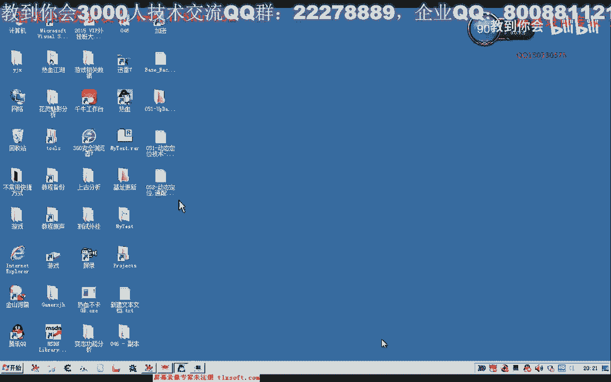
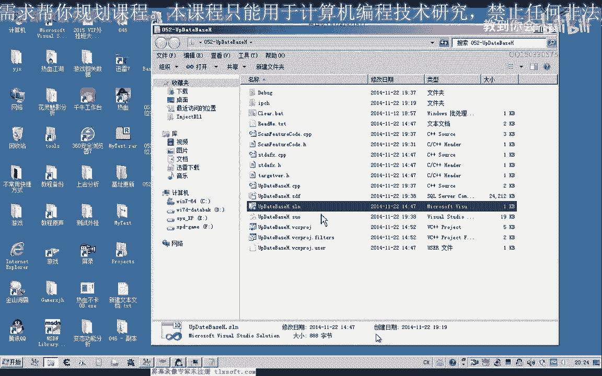
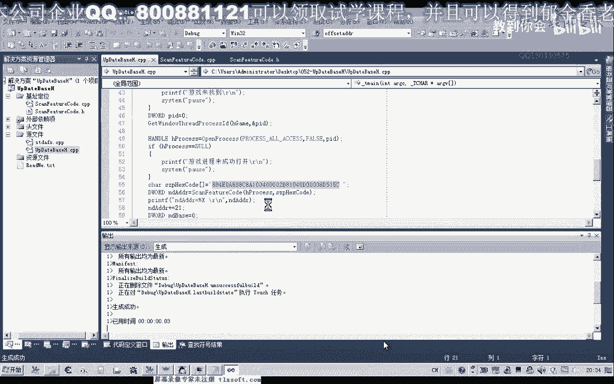
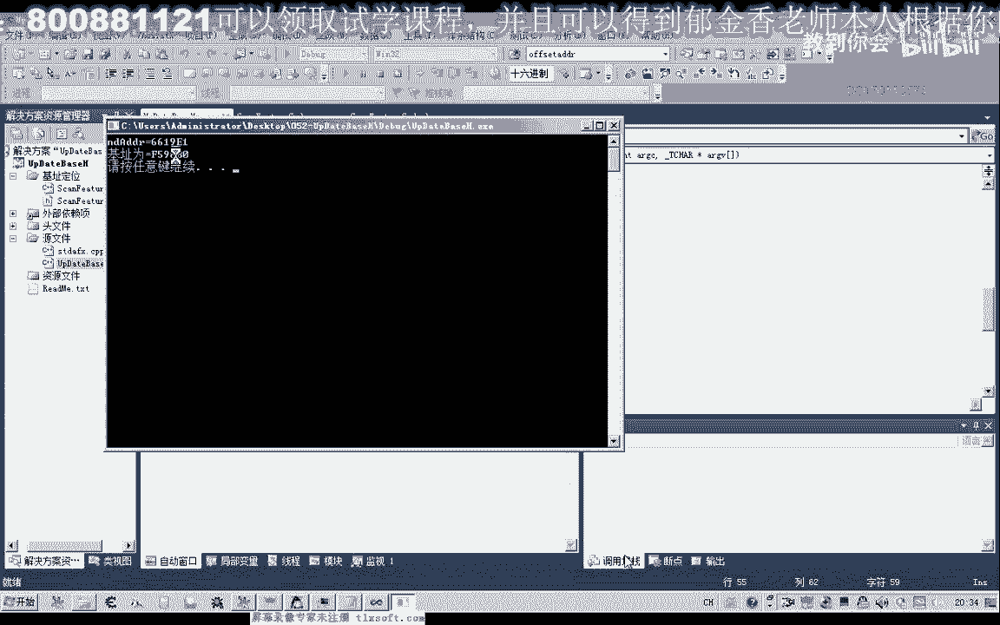
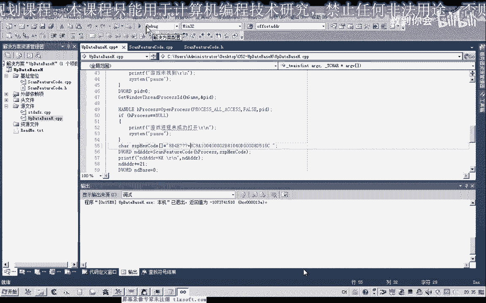
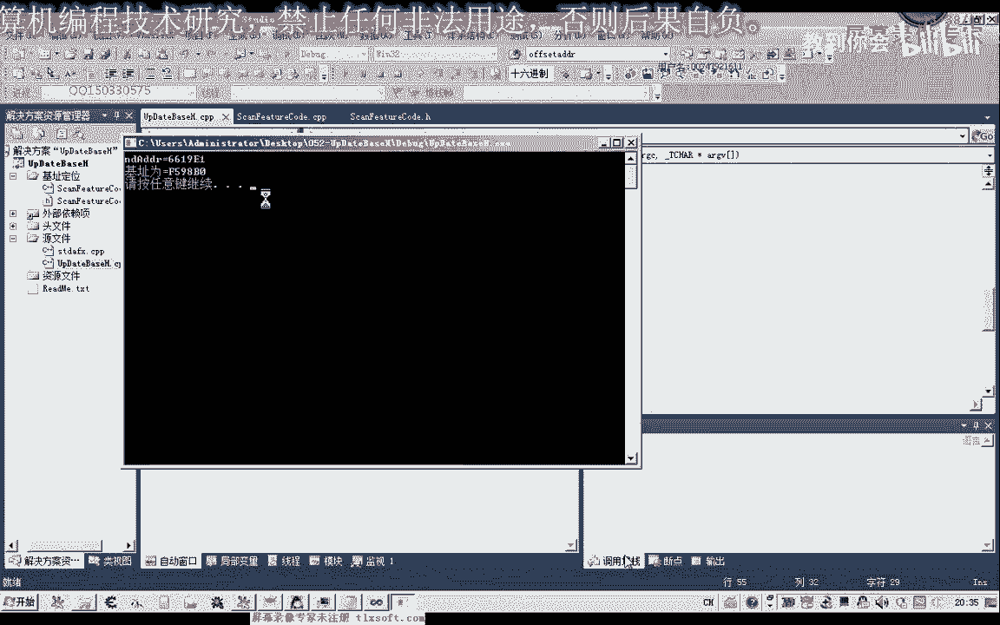
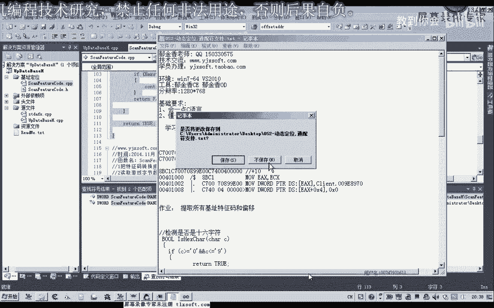

# 郁金香老师C／C++纯干货 - P41：052-动态定位,通配符支持 - 教到你会 - BV1DS4y1n7qF

大家好。

我是郁金香老师，那么这节课我们在之前的基础上，那么添加通配服的一个支持，那么也就是所谓的一个模糊的定位搜索，那么什么叫模糊搜索，我们都知道以前我们的多识命令，我们用星或者是用问号来代替一个任意的字符。

那么我们大概特征码也是这样的，那么比如说我们在这里随意的取一段特征码，那么这里它也有一段机子，那么我们以这段代码为例的话，那么我们要搜索这个位置的话，我们可以搜索这段特征码。

但是如果我们要实现一个模糊的搜索，比如说这里的话，它可能是一个任意变动的一个数字，那么在这里的话，我们就用4个星来代替这一段数字，表示我们中间的这4个字符可以是任意的字符，那么我们都可以搜索到它。

那么这里我们可以用问号来代替，那么也就是说它不属于我们16进制的这些字符，我们在转换的时候，都可以把它替代成一个任意的一个字符，那么这样来达到我们的模糊搜索，那么这样的搜索的话，它功能的话将更加的强大。

好的，那么要实现这样的功能，我们在第51课的基础上再进行一些修改，那么首先我们要修改的也就是要将这种带通配服格式的，特征字串那么进行转换，那么转换了之后后边方便我们比较，那么在这里我们将把它把4个字符。

除了我们0~9和A~F之外的这些字符，不在这个区域里边的，我们全部把它替换成大写的X，在这，我们全部把它替换成大写的X，好的，那么在这里我们打开第51课的代码。

那么打开之后我们展开我们的源代码单元，那么在这里我们需要另外再添加一个函数，那么类似于我们字节集转我们的字串的这样的一个函数，把它复制一下，那么在这里的话。

我们是把前面的字串把它替换成后面的这种字串的这种固定的格式，那么这里实际上它只需要一个参数，它既是一个输入的参数，也是一个输出的一个参数，in out它是一个空的一个活，这两个可以，那么这个函数的作用。

也就是检查我们特征码里面有没有0~9以外的一个字符，0~9和A~F，这个之外的一个字符有的话，我们就把它统一的，那么替换成大写的X，用来代表任意的字符，当然也可以把它替换成新也是可以的。

那么可能替换成新的话，或者替换成问号，这样我们更好理解一些，代表一个自己的字符，都是可以的，那么这里我们把它替换成大写的X，然后我们复制一下相关的说明，然后我们移到开始的位置进行一个转换。

那么我们也要逐字节的把它取出来，所以说我们先要取得特征字串的长度，那么取得长度之后，我们再开始相应的一个循环检测所有的每一个字节，那么在这里面，我们依次取它相应的字节的数据，取它相应的字符。

那么字符取出来之后，我们就要做一个判断，判断它是否是16进制的判断它，那么如果不是16进制的，我们就替换成这个字符X，当然这里我们可以另外的写一个函数用来判断是否是16进制。

那么在这里我们另外写一个函数用来判断是否是16进制的字符，那么在这里我们用byte录像，用恰也是可以的，byte和恰实际上是一个是有符号的，一个是无符号，那么在这里我们对这个C这个字符来进行一个判断。

那么如果它大于等于字符0，那么并且这个C小于等于我们的字符9，那么如果是这个区间的话，那么我们把一个增值，那么如果不是这种情况，那么我们就做另外的判断，那么如果是它大于，那么如果大于等于我们的字符A。

那么这里我们只说大写的判断就行了，因为之前我们已经把所有的小写都转换成了大写，那么在这里我们就只判断大写就可，那么如果它大于等于A，并且它小于等于我们的F，那么在这里我们也返回，增值它也是属于16进制。

那么如果这两个字都不是的话，那么我们就返回，那么要注意的就是什么，这里它取出来的是一个字符，要注意是一个字符，而不是一个字串，当然这里也可以加上一个小写的判断是可以的。

那么小写这里就改成相应的小写就可以，那么只要是前面这三种情况，它都会返回一个增值，那么这个函数的作用就是检查，是否是16进制字符，那么0-9A-F这些都属于16进制，好。

那么在这个时候我们就进行一个相关的判断，把这个字节取出来，那么如果这个是16进制的，当然我们就不对它进行一个更改，那么如果它返回的不是16进制，而返回的是一个Fans。

那么说明它应该我们把它替换成一个通配符，那么这个时候SizeP16进制的，BufferHight，那么我们就等于大写的X，所以这个时候返回大写的X，就是这个X，那么这样我们经过这样的一个转换之后。

我们还要修改一个地方，那么还要修改哪一个地方，我们来看一下，在后面的比较这一部分，我们还要修改这里，那么在这里比较的话，我们就变成一个带通配符的一个比较，那么在检测的时候，只要这两个字脆的某一个字节。

它就其中包含了一个大写的X的话，那么我们就让它继续，那么所以说在循环的这一部分，我们还要给它加上一句，在前面，那么如果它等于X，那么取出来了字符等于X的话，那么我们就继续表示它相等。

那么继续进行一个下一次的一个循环，那么还有如果是H2，它两个当中的一个，只要某一个数字的话，等于X，我们都进行下一次的循环，那么这样的话，理论上我们就可以通过就能够进行一个，模糊的一个搜索。

当然还有一个地方，我们需要进行一个替换，那么也就是大小写，我们特征码搜索，看一下特征码搜索这里，那么在这里我们全部转换成大写之后，我们还要进行什么，通配服务，替换，那么我们在这个地方。

那么我们再进行一下相应的调用，好，那么这样进行这样的一个转换之后，理论上我们就可以用通配服来定位相应的，一个特征码，那么比如说现在游戏是打开的，那么我们再搜一下这串特征码，最后它得出来的地址是多少。

F598B。

那么现在的话我们就可以把特征码改掉，中间的几个字节，那么比如说我们最后几个字节，或者是，你这四个字节无的，那么我们就可以改为四个问号，或者是其他的字就代表一个通配服务，那么我们就可以这样来进行搜索。

那么这样的话，它也能够搜索到机制，但是这样的话灵活性更大一点。

那么即使我们中间的这四个字节，它有变动了游戏更新之后，那么同样的它能够定位到我们所要的代码的一个附近，好的，那么这一节课我们就讲到这里，那么特征码这里我们再来看一下，400开始，好的，那么我们下一节课。

那么这里下去也留一个作例给大家，那么这个作例就是来提取所有机制，就是所有机制的一个特征，偏移，那么我们举个例子，那么比如说我们要读04，那么我们就可以把前面的这一段定位为一个特征码，那么收到之后。

这一段特征码所占的字节数就是一个偏移，这里是两个字节，加上这里的6个字节，8个字节，8个字节，加上这里的偏移就为10，那么这里就为123456789，那么这个地方的偏移就为10，那么10的话。

我们读字节出来的话，就是04，就是04，那么今天我们要下去做的作例，就是提取特征码，这个偏移，偏移了，在后面我们说明，比如说它的要读取04的偏移的话，就是10，那么提取特征码之后，那么下一节。

可能我们再来进行一些机制的一个更新，其实，代码的形式，到时候我们生成相关的机制偏移的一个同文件，那么我们下一节课再见，這種情況 LAURAowslet 我也會強烈的支持你，在這次的投票當中。

我有贊成你的決定，謝謝他們。(音樂)，(笑)。

