# 郁金香老师C／C++纯干货 - P42：053-提取特征码和偏移 - 教到你会 - BV1DS4y1n7qF

大家好，我是喻吉箱老師，前面我們已經編輯好了特徵碼定位的函數，這幾個我們為它整理出相應的特徵碼串，以及我們機子的一個偏移距離，我們先打開第46課的Base Gun圖文件，在這裡我們先對它進行一些整理。

然後我們把機子管理單元把它複製出來，在複製之前像這種就是兩個共用機子的，我們把它放到最後，像這種我們是不需要更新的，我們只需要更新前一個就可以了，那麼我們把前面的這些複製一下，然後保存。

或者整個我們把它複製出來也可以，整個複製出來，然後我們為它每一個抓取一個相應的特徵碼，偏移，然後我們把它放在後邊，那麼首先我們從人物屬性的開始，那麼人物屬性的我們找到它的一個機子，看一下在什麼地方。

上次更新的是2F9400，我們收一下，那麼人物屬性我們並沒有添加相應的代碼，那麼沒有添加代碼的話，我們轉到OT裡面，為它重新提取一下特徵，那麼這是人物屬性。

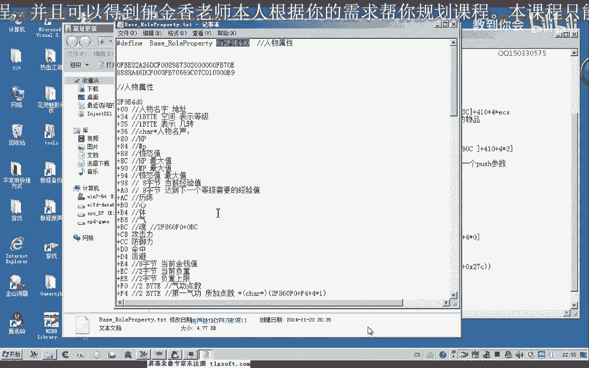

進到OT裡面，然後我們用PC來看一下，那麼人物屬性的話，第一個地址是人物的名字，那麼我們在底邊收一下這個藏料，那麼這個時候我們可以收到很多，很多的地方，那麼可以收到很多的地方。

這個時候我們隨便選一個就可以了，那麼比如說我們選這個地方，那麼選這個地方之後，我們把前面的這一段或者是後面的這一段，複製一下都可以，然後提取相應的特徵碼偏移就可以了。

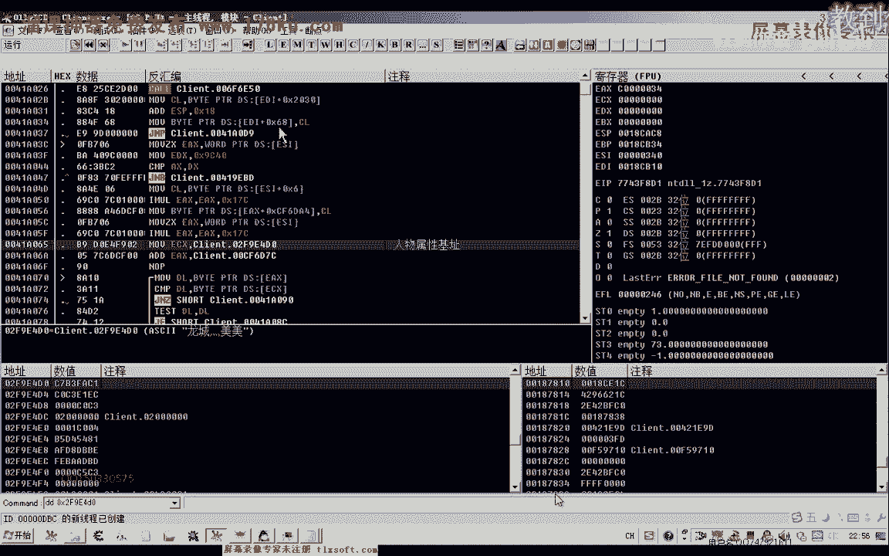

好的那麼我們複製一下，這個我們不用。

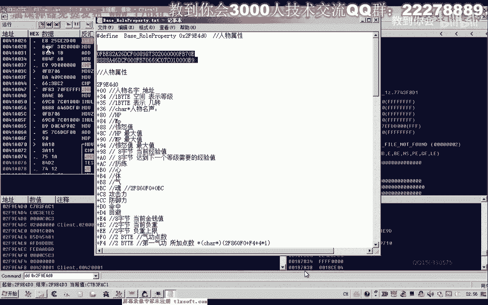

因為前面的自己提取的沒有計算它的一個偏移，那麼現在我們這個是我們的人物的屬性，那麼這個人物的屬性，我們可以看一下，它是從這裡開始，2F914D0，那麼我們提取它前面的這一段特徵碼，提取前面。

然後我們進行上色，把這個複製一下，複製到前面，那麼複製到前面之後，我們先找特徵碼，然後這裡再取一個B9就可以了，後面的我們不取，因為後面如果是遊戲更新的話，這個機制可以，可能會變。

但是前面的這些代碼它變動的可能性會小一些，會小一些，那麼這裡我們看一下，一共有多少個字節的偏移，那麼我們也可以在OD裏面把它計算出來，那麼也就是我們66，減掉我們前面的數值，用一個問號表達式。

來減掉這個地址，因為我們通過前面的字串特徵串來搜索到的機制，如果正確的話，就會返回這個地址，所以說我們要取得它的一個偏移，那麼它的偏移是，10進制的24，那麼16進制的18，那麼我們記好這個偏移。

可以記成是偏移是0x18，然後讀取的方式，我們來看一下，它也是一個直接讀取，這個機制就行了，應該是02F914D0，那麼直接讀取這個地址就行了，那麼計算出這個地址，那麼我們保存一下，好的。

這是我們第一個機制，冷幕屬性的，那麼我們把它輔助到我們的課程裏面，那麼第二個我們找背包列表的，那麼也可以直接在OD裏面找也可以，找一下，產量，因為這個產量的話，我們之前的地址已經更新了。

我們需要一個新的最新的一個機制，那麼所以說以前的是不對的，我們在這裏找一下背包的，這是才更新的地址，那麼這個時候找到的地方也比較多。

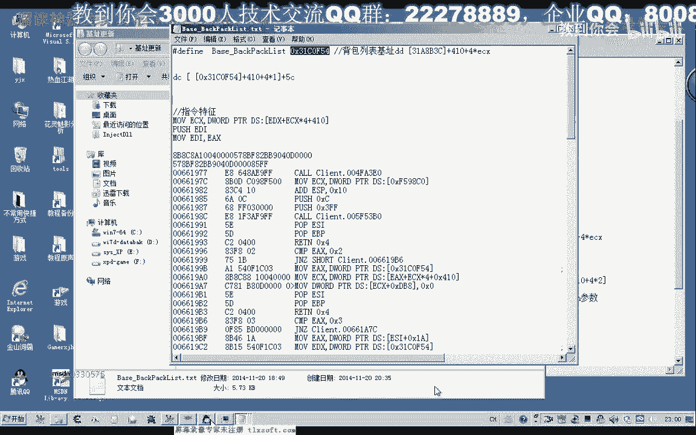

我們選比較靠前的，那麼這個是背包的機制。

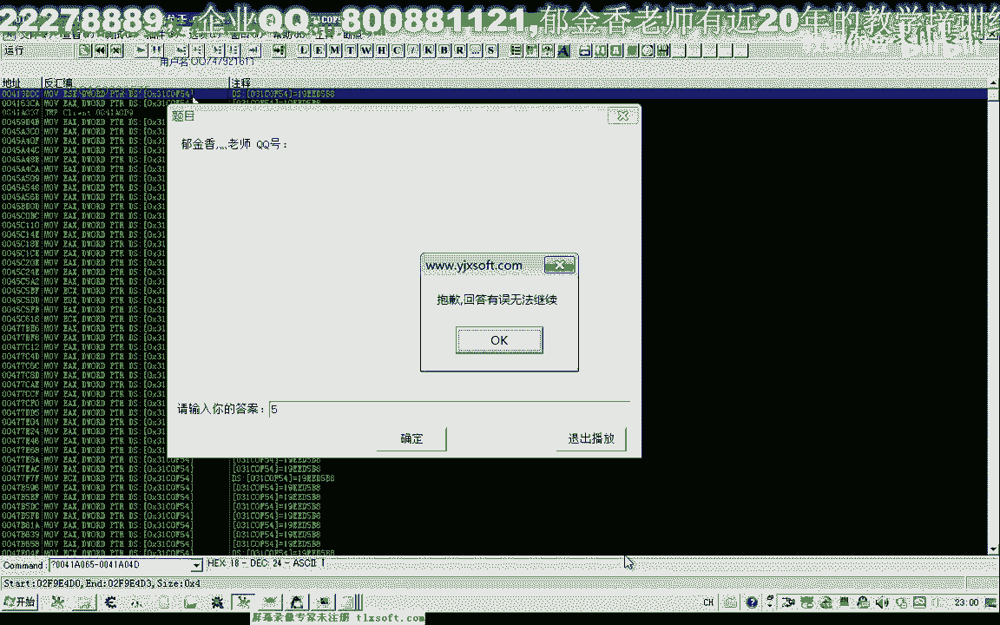

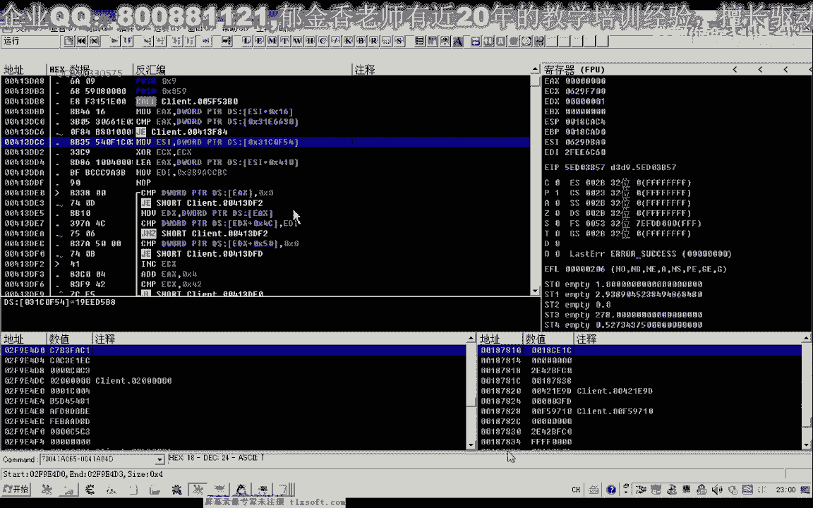

那麼我們再提取一下它的一個特征碼，就以前面的這一串為特征碼進行提取，那麼這個特征碼提取之後，我們可以先在CAN裏面進行一下嘗試，那麼如果這裏能夠收到的都是501的話，那麼證明它是有效的。

注意我們這裏選的時候要選一個可寫，這個要去掉這個勾，那麼這個時候我們能夠找到一個51的，一個地址，那麼我們就記錄下來，那麼接著我們提取這個的特征碼，那麼這個的特征碼，我們可以去這三行的先做一個嘗試。

那麼我們就在這三行的先做一個嘗試，那麼我們就在這三行的先做一個嘗試，那麼我們就在這三行的先做一個嘗試，那麼我們就在這三行的先做一個嘗試，那麼我們就在這三行的先做一個嘗試。

那麼我們就在這三行的先做一個嘗試，那麼我們就在這三行的先做一個嘗試，那麼我們就在這三行的先做一個嘗試，那麼我們就在這三行的先做一個嘗試，那麼我們就在這三行的先做一個嘗試。

那麼我們就在這三行的先做一個嘗試，那麼我們就在這三行的先做一個嘗試，那麼我們就在這三行的先做一個嘗試，那麼我們就在這三行的先做一個嘗試，那麼我們就在這三行的先做一個嘗試。

那麼我們就在這三行的先做一個嘗試，那麼我們就在這三行的先做一個嘗試，那麼我們就在這三行的先做一個嘗試，那麼我們就在這三行的先做一個嘗試，那麼我們就在這三行的先做一個嘗試。

那麼我們就在這三行的先做一個嘗試，那麼我們就在這三行的先做一個嘗試，那麼我們就在這三行的先做一個嘗試，那麼我們就在這三行的先做一個嘗試，那麼我們就在這三行的先做一個嘗試。

那麼我們就在這三行的先做一個嘗試，那麼我們就在這三行的先做一個嘗試，那麼我們就在這三行的先做一個嘗試，那麼我們就在這三行的先做一個嘗試，那麼我們就在這三行的先做一個嘗試。

那麼我們就在這三行的先做一個嘗試，那麼我們就在這三行的先做一個嘗試，那麼我們就在這三行的先做一個嘗試，那麼我們就在這三行的先做一個嘗試，那麼我們就在這三行的先做一個嘗試。

那麼我們就在這三行的先做一個嘗試，那麼我們就在這三行的先做一個嘗試，那麼我們就在這三行的先做一個嘗試，那麼我們就在這三行的先做一個嘗試，那麼我們就在這三行的先做一個嘗試。

那麼我們就在這三行的先做一個嘗試，那麼我們就在這三行的先做一個嘗試，那麼我們就在這三行的先做一個嘗試，那麼我們就在這三行的先做一個嘗試，那麼我們就在這三行的先做一個嘗試。

那麼我們就在這三行的先做一個嘗試，那麼我們就在這三行的先做一個嘗試，那麼我們就在這三行的先做一個嘗試，那麼我們就在這三行的先做一個嘗試，那麼我們就在這三行的先做一個嘗試。

那麼我們就在這三行的先做一個嘗試，那麼我們就在這三行的先做一個嘗試，那麼我們就在這三行的先做一個嘗試，那麼我們就在這三行的先做一個嘗試，那麼我們就在這三行的先做一個嘗試。

那麼我們就在這三行的先做一個嘗試，那麼我們就在這三行的先做一個嘗試，那麼我們就在這三行的先做一個嘗試，那麼我們就在這三行的先做一個嘗試，那麼我們就在這三行的先做一個嘗試。

那麼我們就在這三行的先做一個嘗試，那麼我們就在這三行的先做一個嘗試，那麼我們就在這三行的先做一個嘗試，那麼我們就在這三行的先做一個嘗試，那麼我們就在這三行的先做一個嘗試。

那麼我們就在這三行的先做一個嘗試，那麼我們就在這三行的先做一個嘗試，那麼我們就在這三行的先做一個嘗試，那麼我們就在這三行的先做一個嘗試，那麼我們就在這三行的先做一個嘗試。

那麼我們就在這三行的先做一個嘗試，那麼我們就在這三行的先做一個嘗試，那麼我們就在這三行的先做一個嘗試，那麼我們就在這三行的先做一個嘗試，剪掉前面的地址，找到的地址，找到的地址。

那麼這個時候會得出一個偏移，那麼這個時候會得出一個偏移，16進制的11，10進制的17，那麼隨便選一個，那麼這裡面我們用16進制來表示，那麼這裡面我們用16進制來表示，裡面是11是它的一個偏移。

那麼加上這個偏移了，我們就能夠得到地址，然後就能夠讀出我們相關的這個地址，然後就能夠讀出我們相關的這個地址，好的，那麼這一串我們又把它剪掉，那麼這一串我們又把它剪掉，特徵碼提取了。

那麼我們再來提取兩個特徵碼，那麼我們再來提取兩個特徵碼，一個就是這個Qord這個特徵碼，一個就是這個Qord這個特徵碼，那麼我們來找一下，最新的使用背包的Qord。

那麼我們來找一下最新的使用背包的Qord，那麼我們來找一下最新的使用背包的Qord，那麼我們來找一下最新的使用背包的Qord，那麼最新更新的是這個地址，那麼最新更新的是這個地址。

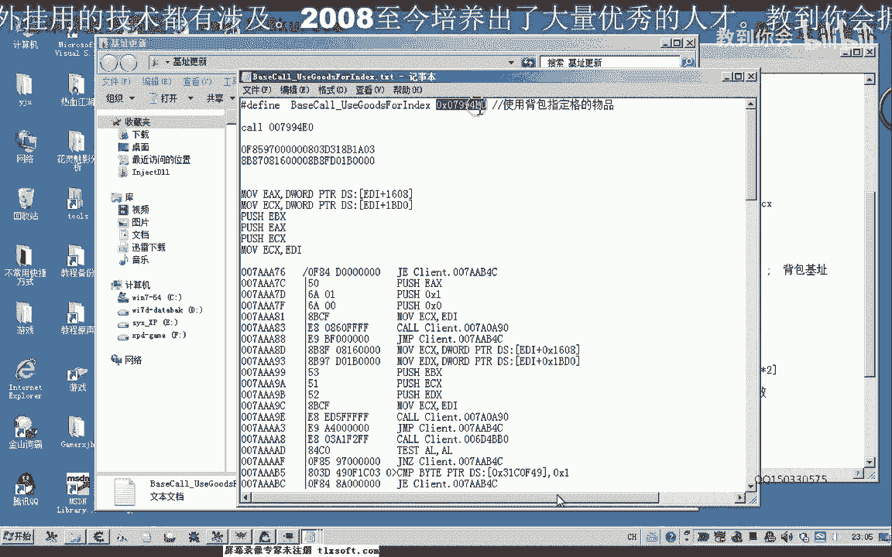

我們來提取它的一個特徵，那麼這個是在一個循環裏面，那麼像這一段，那麼這個是在一個循環裏面，也似乎也做一個相應的特徵碼，也似乎也做一個相應的特徵碼，好的，我們把這一段複製一下。

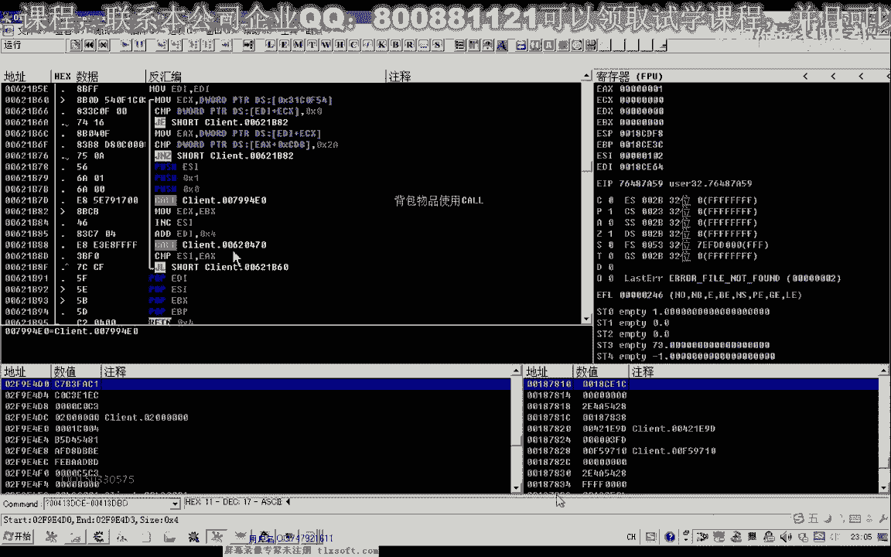

那麼複製到它的下邊，那麼現在我們也開始提取它的一個特徵碼，那麼現在我們也開始提取它的一個特徵碼，那麼現在我們也開始提取它的一個特徵碼，再看一下，410。

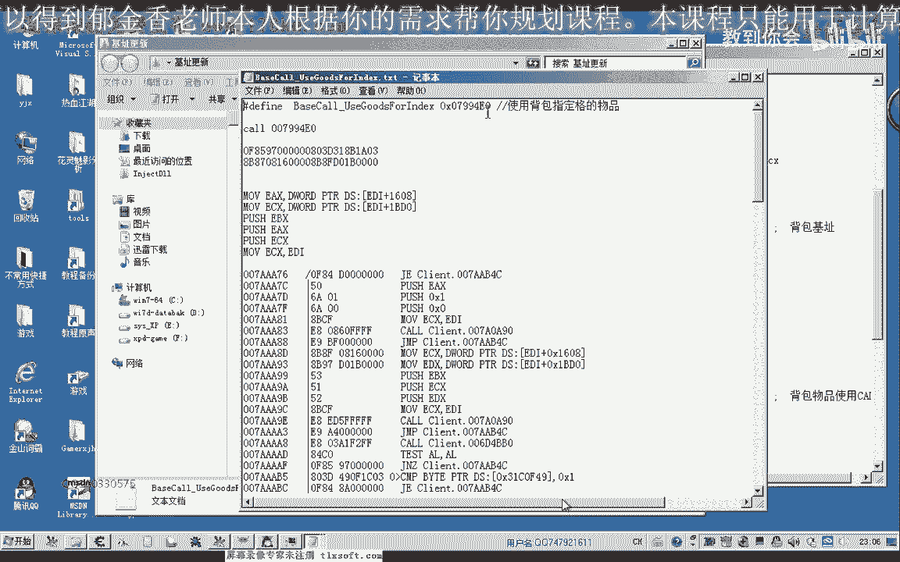

這是9410，這是9410，這是9410，在下面的不是我們刪掉，那麼它的特徵碼，我們可以提取前面這一部分，那麼首先這一段我們也把它提出來，那麼首先這一段我們也把它提出來，那麼首先這一段我們也把它提出來。

這兩個我們可以提取一個，這兩個我們可以提取一個，後面這個是偏移，後面這個是偏移，我們用通匯服來代替，因為偏移的話它最容易變，像這一種，那麼變化，我們就用通匯服來代替，那麼這種指令。

它不涉及這種跳轉的偏移，它不涉及這種跳轉的偏移，所以說它一般是不會變的，那麼這種指令，它一般也不會變，那麼我們直接，用相關的數據直接代替就行，那麼這個JJ前面75，那麼這個JJ前面75，它是不會變的。

那麼後面的這一個字節，一般它會變，後面它實際上是一個相對的地址，後面它實際上是一個相對的地址，是通過A的值計算出來，8日的位置，偏移了10個字節，那麼這裡是一個偏移，所以說這個我們要用通匯服來表示。

那麼後面的像這種，6，6，一般也不會變化，包括後面的這種，都不會變化，好那麼這一串，我們把它編輯好之後，也放到我們的聲音裏面，搜一下，看它具不具有一個五一性，那麼這一段，可能是我們中間那裏出來的問題。

導致我們搜不到，那麼我們再來，核對一下，74或者這裡是16，兩個字節，然後是8B065，83，7，0A，然後是56，另外015，另外018，那麼我們再來測試一下，可能是後面我們剛才跟了一個，尾部的空格。

沒有搜到，那麼我們刪掉後面這一串，再試一下，刪掉後面這一串再試一下，那應該是在後面這一段出了出，7416，然後是8B40F，那麼我們先上示前面這一段，那麼我們再嘗試這一段，那麼它的錯誤，應該是在這後面。

7 0A，然後是56，6為01，6為00，18，但是看不出來，什麼地方出錯，那麼我們再把它，加進去試一下，756，750A，我的6A01，那麼可能這一段，可能是變化了，那麼後面這一段我們重新取取一下。

7，這後面這一段，7，4個0，7，那麼這一段可能是沒有顯存，我們看一下，那麼後面還有一個2A，這個地方它沒有顯示，我們進到OT裡面看一下，這裡剛才這一段，它這裡藏了一個2A，這一段剛才我們沒有抓下來。

所以說造成了，這什麼，我這個2A它被忽略掉了，所以說在調整的時候，我們要注意調整一下這個位置，造成了這個2A，沒有被複製到，所以說剛才我們一直收不到，這裡我們加一個2A，它就能夠修復，那麼75，過來了。

750A的前面，有一個2A，那麼我們再搜索一下，這個特徵書，那麼這個時候就能夠，搜索到了，那麼搜索到之後，它找到的值是這個數字，那麼所以說它的偏移的話，就等於，後面的這個數字要減掉，那麼這裡是7D。

那麼7D加上，這一字節的話應該是7E，這是它們的一個偏移，我們來計算一下，那麼它的偏移是18，搜索到之後。

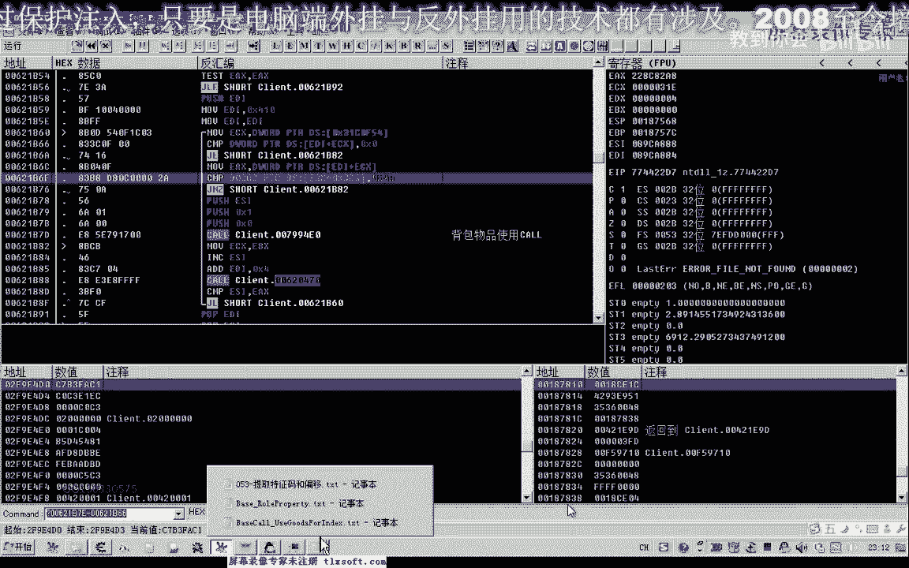

我們加18，好那麼我們接著更新，下一個窗口，遊戲主窗口的一個劇本，那麼遊戲主窗口的劇本，我們來進行一下，到OD裏面直接提取。

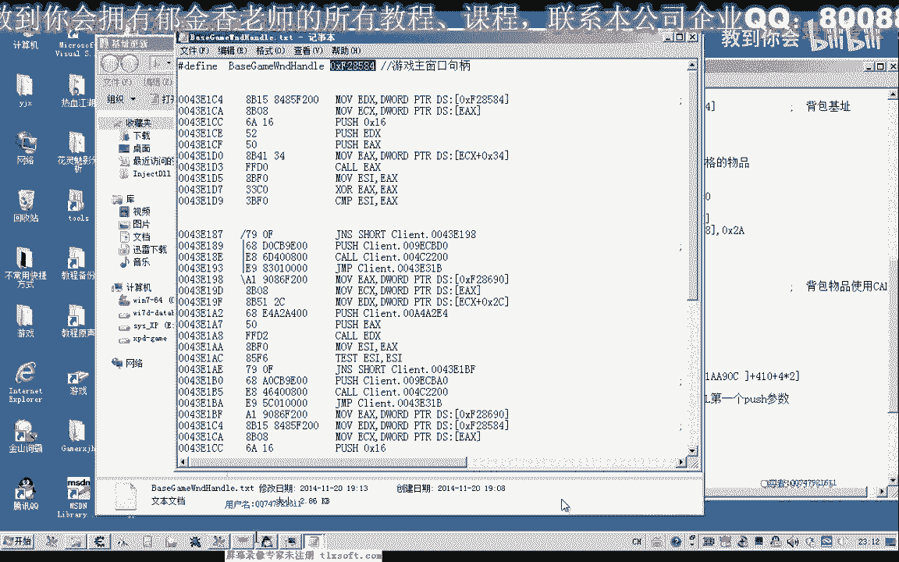

那麼我們也選比較靠前的，那麼像這一種的，這一串全部都是機制的話，遊戲更新之後，這裡面的數字也要變，那麼我們要用很多的通匯服來進行搜索，那麼這種地址的話不太適合，做我們的特徵，那麼所以說我們換一個在這裡。

那麼換一個圖取的地址，那麼這個地方相對的話。

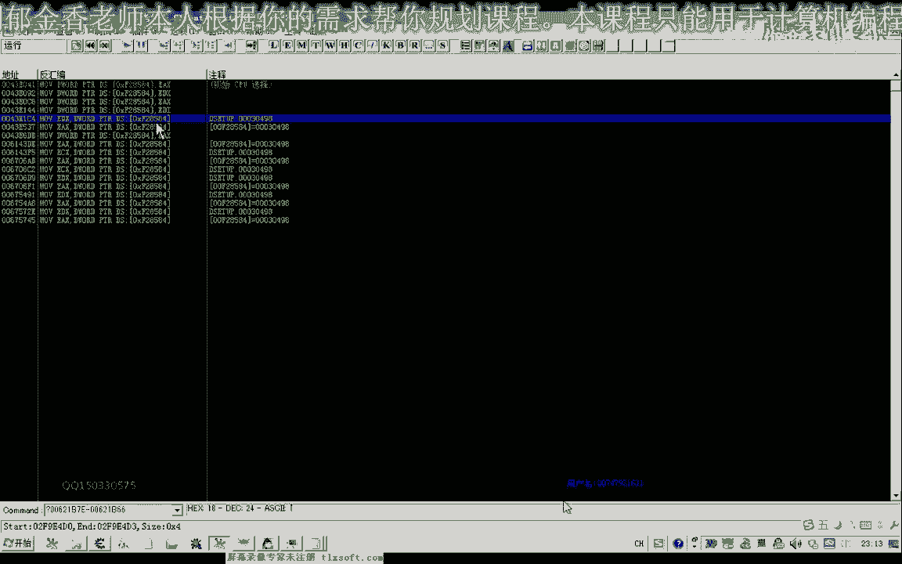

用來做我們的特徵，要比較好一些，那麼我們把這一段進行一下複製，那麼複製之後，我們這個比較靠前，那麼我們可以搜索，在後面的這一段做一個特徵碼，那麼把其他的刪掉，留下我們的特徵碼就可以了。

我們也可以直接數也可以，16我們看過了是多少，那麼我們直接用下面的，16過了是52，然後是8B4134，然後是FFD0，然後是8BF033C3DF，好的，那麼我們搜索一下，那麼這個時候也搜索到了。

搜索的地址是這個地址，那麼我們這個時候，用這個地址，用這個地址應該來減掉這個地址，它就等於一個負數，我們還是用比較大的數字來減，那麼減掉這個C4，好像是等於6，那麼這個時候他們的偏移是6。

但是由於我們找到的地址，它比這個還大，所以說這個數字減掉的，數字的話，它應該是等於負6，這個偏移應該是負6，實際上是要減6，而不是像我們前面的，它是一個正的偏移，所以說它是一個負的偏移。

那麼我們從這個地方開始，因為我們收的是它後面的一個特徵，再定位到前面，所以說這裡要加減掉6，但是減掉6的話，我們看一下，這裡還有兩個字，那麼實際上我們只需要減掉4，就可以了，這裡退回來。

我們是要讀取的這四個字，先退回來的這四個字，好的，那麼我們保存一下，那麼接下來我們是怪物列表機制。

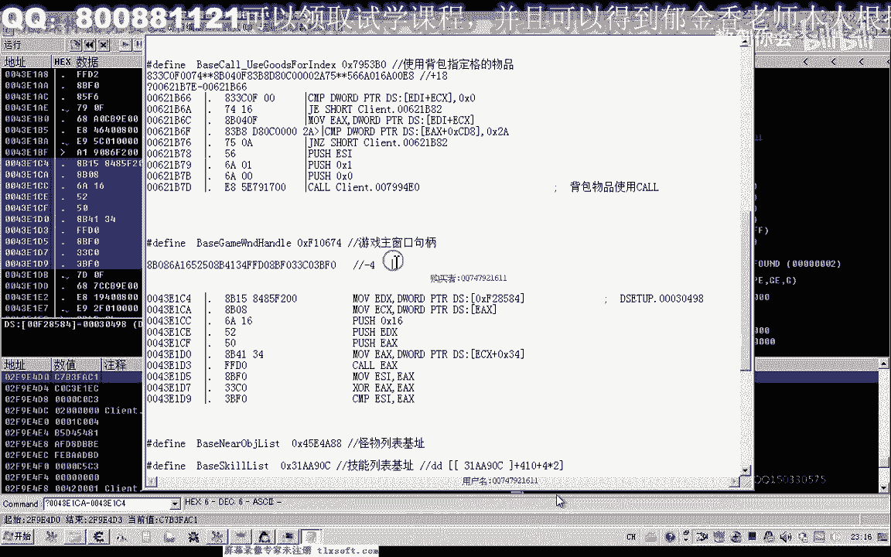

怪物對象檔。

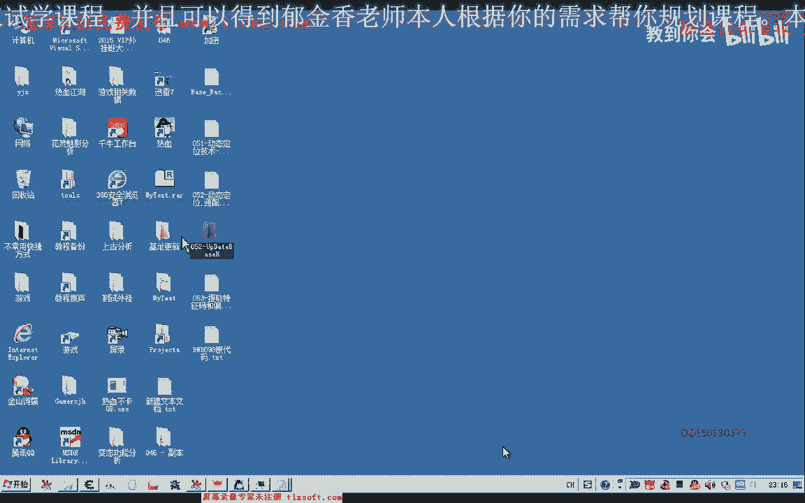

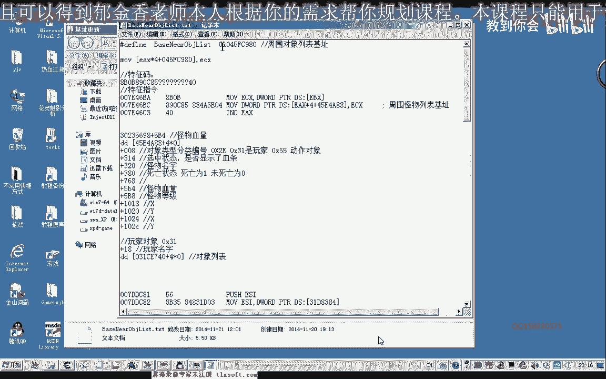

這是最新更新的機制，我們進行一下搜索，那麼這個時候，我們找比較靠前的，那麼這個特徵碼，我們選前面的後面的都可以，我們就選在前面的這一個。

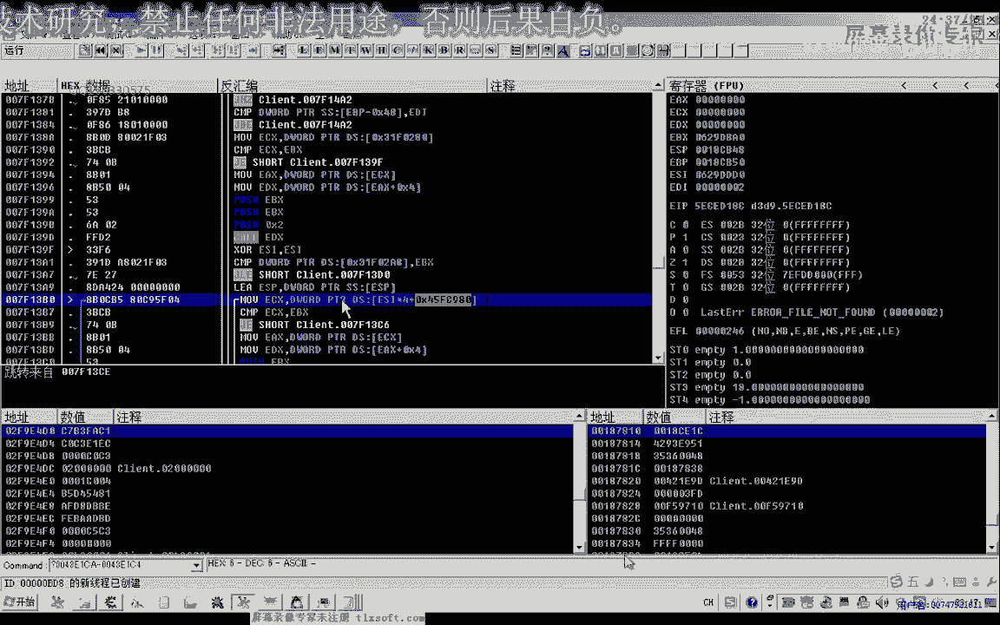

這一段，我們來做一個特徵碼，那麼我們可以從這裡開始。

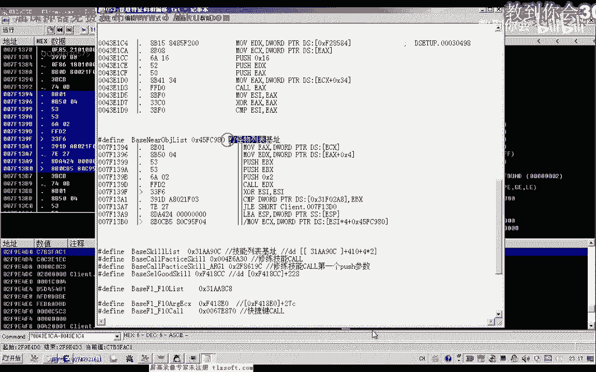

搜索組織我們的特徵碼，後面的我們就手動添加，53-6102-FFD233F639ED，然後這裡也有一個機制，那麼這個機制的話，我們用通配符來表示，1234，它一共是八個字，那麼後面這裡一個接127。

那麼27。

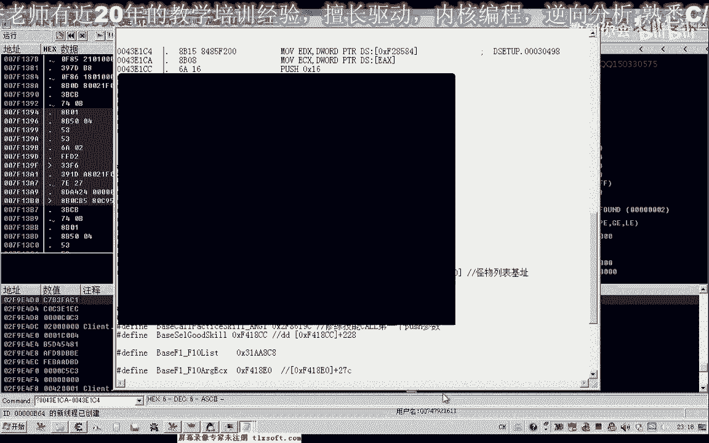

它是一個跳轉，像這種的話，它也很容易變動，這個偏移，所以說27的話，這個偏移，它不是數據的一個偏移，那麼我們也用通配符來表示，那麼這個我們直接複製，大致這麼長了，我們就可以了，進行一下定位。

然後在CE裡面搜索，那麼我們看到它定位的是這個位置，那麼所以說它也有一個偏移，那麼偏移就是我們要取得的，機制的偏移是在這裡，三字節，三字節就是B3，那麼它的偏移的話，就應該是B3。

來減掉我們前面的這個數字，最終你們看一下，多少，這個等於EF，等於十進制的31，我們統一取成16進制的。

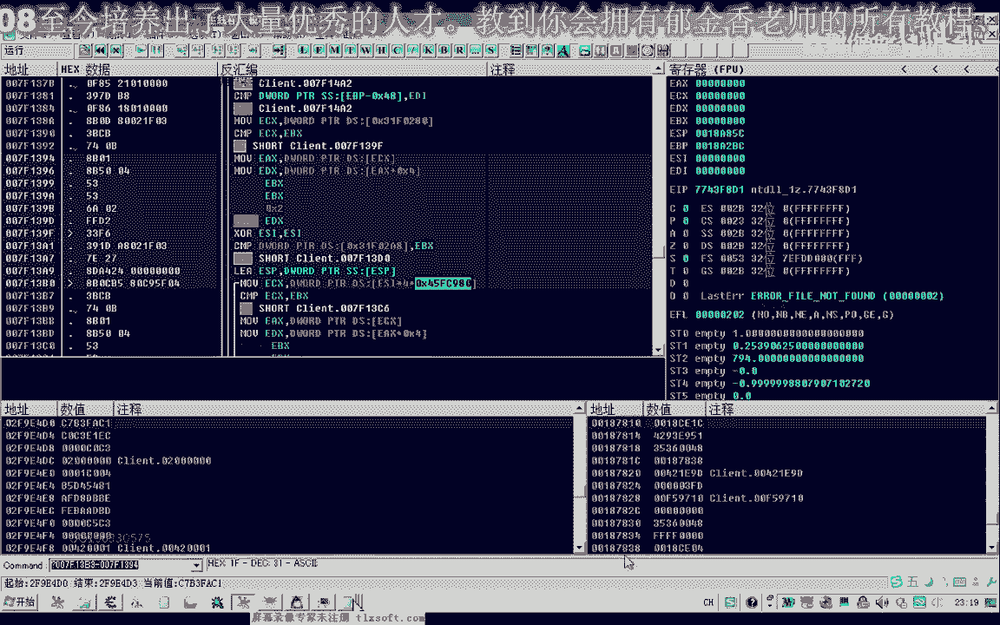

EF，這個等於，好的，那麼剩下的還有幾個，這些機制的話，那麼請結合前面的快速更新機制的一個辦法，那麼把特徵把它按照前面的這種格式，把它提取好，那麼下一節課第54課的時候，我們在編寫代碼。

然後統一的更新出，用代碼來更新出我們所有的機制，好的，那麼我們下節課再見，那麼後面的這個就是一個作業了，大家請結合前面的快速更新機制的那一步，好的，那麼我們下一節課再見，再見，再見，再見。

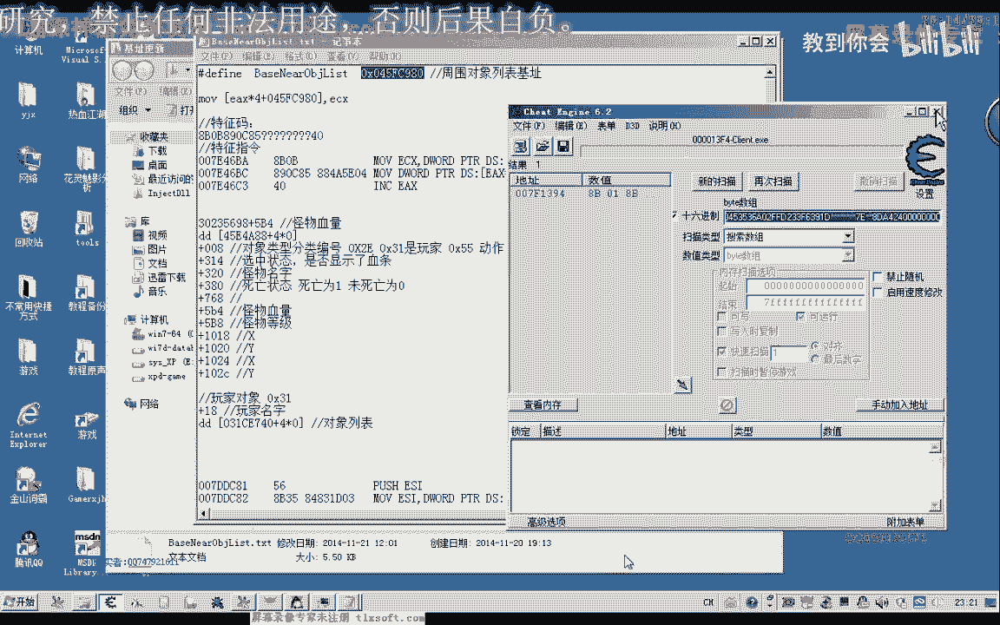

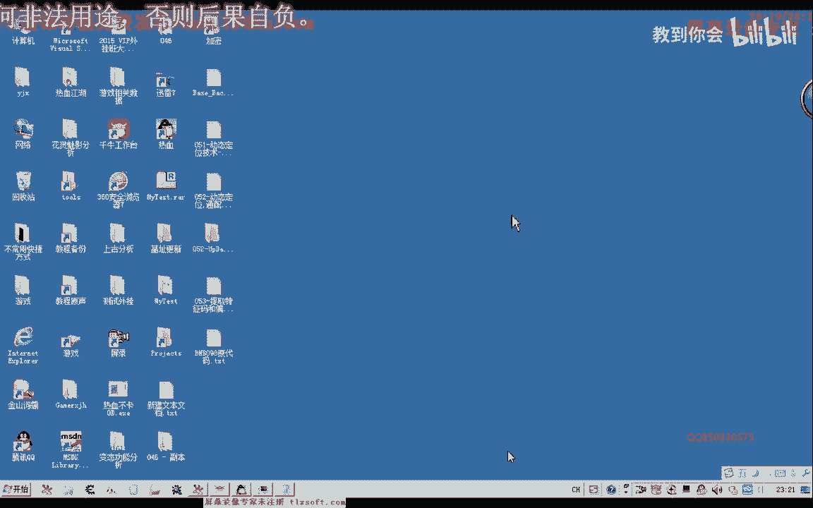