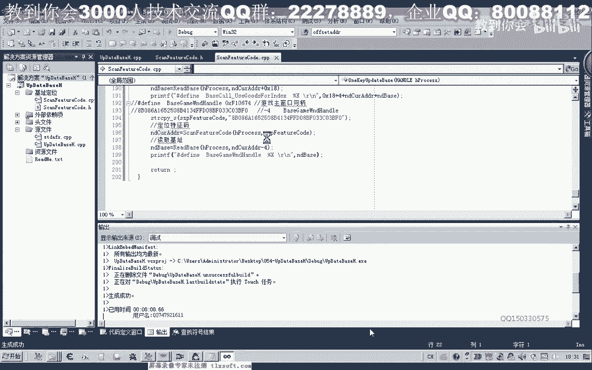

# 郁金香老师C／C++纯干货 - P43：054-一键更新基址 - 教到你会 - BV1DS4y1n7qF

大家好。

我是郁金香老师，那么在前面呢，我们一起编写了定位特征码的函数，以及提取了特征码和机子的一个偏移，那么这节课呢，我们来编写一个一键更新机子的函数，那么打开第56课的代码。

那么首先呢我们展开机子定位的单元啊，移到最后，我们把这个函数呢再进行一些优化，那么在这个位置呢，我们在读取这个缓冲区的时候呢，每次呢是读取到1024啊自己，但是某一些地址的话。

它并不存在数据或者读取的数据的话，并没有这么多，那么我们在这里的话就用不着啊，比较做这么多次，那么说所以说我们在这个循环的结束条件，这里，我们可以用它实际读取的这个字节数。

来作为它的一个结束的一个条件好，那么我们开始封装我们的一键更新，及时的函数，那么这个呢我们就把游戏的进程句柄啊，传进去，然后我们在cp单元添加我们的代码，那么在这个函数里边呢，我们要做这么几件事啊。

于是呢呃特征码我们把它添加进来，然后我们就是定位特征码，那么然后我们通过特征码，定位的这个地址呢，读取我们的机子，那么我们在头部来先建一个，存放我们特征码的一个缓冲区，那么这个缓冲区大小呢。

我们把它定义成256个字节，在这里呢，我们就用第一个这个机子的特征码，来初始化它冷漠属性的这个注意，我不空格，我们要把它删掉，并且我们把人物属性的啊，这个，特征码啊，把它复制进来，然后注释掉。

好那么我们现在开始定位我们的特征吧，那么第一个参数来进行区别，第二个参数就是我们前面的特征字串，那么这个时候呢它会返回一个地址，那么我们还需要在前面的定义一个呃指针，来存放地址。

那么这个指针呢我们直接啊为了方便操作，我们直接就用一个d word类型来存放，那么我们先把它初始化一下，在这里呢我们来用来存放特征码，定位的一个地址，那么定位了之后呢，我们就开始读取这个机子啊。

读取相应的这个呃数据，那么在这里我们在另外呢建一个变量，indebase，用来存放这个机子，那么在这之前呢，我们还需要分装一个函数，用来读取我们基础的这个函数，那么在前面呢我们再进行一下封装。

d word返回一个地址，那么第一个呢我们也是进行了一个具体，那么第二个呢就是我们要，读取的一个地址，然后最后呢我们就返回这个地址，先定一个变量，关于地对，然后我们用api函数来读取。

第一个参数呢就是进程句柄，第二个参数呢就是我们的起始地址，转换一下心，那么第三个参数呢就是我们的缓冲区啊，debase，那么第四个参数呢我们要读取的字节，因为地址都是四字写的。

所以说这里的话我们就不需要另外传地址，就直接呃读取四个字节，因为32位的系统的话，它的地址都是四字节，那么最后这个呢我们可以通啊，然后呢最后我们返回inbase就可以了，然后在这个地方呢。

我们直接就用前面我们b中的函数rebase，来读取它pd当前的地址，那么这是普通的呃，这种机制的一种读取方法，读取好了之后，我们打印出相关的这个数据，把前面这一段啊记一下。

那么后面呢我们就跟这个nd base，好的，那么我们先来进行一下测试，转到我们的南海宿舍，那么把前面的这一段啊全部删掉，这里呢是只只需要传传入一个呃，进程的句柄就可以了。

那么这个时候呢，我们读取出来的数值为69064，18a啊，好像这个数值是错的啊。

呃我们再来看一下，首先这个地方是6565，加上这一字节的话是六六，六六来减掉前面的这个数字，那么我们首先看一下它的偏移，我们上一节课是否计算正确了，那么它的偏移呢是幺九，上一节课的时候呢。

我们计算偏移也不，那么这个时候我们再改一下它的一个偏移，对了这个地方呢我们还要加上一个偏移，这样才才对啊，还还不止一个地方出错啊。

那么这个时候呢。

读出来的数值是2f94 d0 啊，也就是这个人物属性的机制。

那么这个时候呢我们已经读取正确了，那么然后我们来更新第二个啊，背包的机子，那么背包机制的一个特征或偏移，我们添加进来，然后我们再把上面的代码复制一下，这串代码，那么复制下来之后呢，我们这个数组的话。

它肯定不能够这样的进行一个复制，这样编译的话就通不过，那么所以说在这里的话，我们需要借助一个函数，来把它拷贝到这个前面的这个缓冲区里边，再编一下，那么然后呢，再把我们的这一串偏移啊添加进去。

那么添加进去之后呢，在这里的话我们加上0x11 的一个偏移，然后在这里打印出来的是背包的一个机子，好的，那么我们再测试一下。

3140f4 ，那我们来看一下3140f54 ，那么这个时候读取也是正确的，那么接下来呢，我们嗯来更新这个扩的这个地址。

那么这个扩的地址的话，它稍微要更新的复杂一些。

那么首先我们也是把前面的代码复制一下，那么第一步呢我们也是把特征码添加进来，那么添加进来之后哈，呃这里也是找到了他当前的一个地址，也要加上它的一个偏移x18 ，但是最后呢我们这里打印出地址的时候呢。

呃我们要注意啊，他因为这个扩的话，它读出来的数值的话实际上是前面这个啊，这个的话我们从高位算起来的话，也就是0017啊，然后呢再是795亿，实际上读出来的数值的话会是这个数值，那么我们可以做一下测试。

而这个数值的话，实际上它不是我们真正的一个扩的，一个地址，那么读出来的这个177951，实际上是这个呃，扩你当前地址的一个偏移啊，离这个地址的一个偏移，那么这个地址的话，我们要加上前面的这五个字解。

实际上也就是我们这个从7d这里开始，那么实际上呢，就是从我们搜索到的这个621b66 啊，这个位置呢要加上幺八，加上幺八之后的话，是到了这个位置啊，还要加上这四肢解。

才等于当前这个获得一个相对的一个机制，然后呢再加上这个偏移，也就是我们的17795g，那么最后呢才会等于我们的这个扩的，真实的一个，地址，那么所以说在这里的话，我们要加上幺八。

然后再要好这里读取的时候加上幺八哈，最后打印这个地址的时候，来这里也要加上0x18 ，再加上它所占的四字节，还要加上一个当前的一个地址，那么这样的话才是最后，最后我们的这个货的一个机制好的。

那么我们再来看一下，那么这个时候呢799799410。

读出来的话，就是我们这个获得真实的一个地址，而不是读出来的前面的那个偏移啊，那么这个偏移，为什么它会显示成177951了，因为这里的话这后面的是高位，他会放在前面啊，这个幺七是高位。

那么在最低位呢它是5g啊，他就这这样要反过来显示，显示成16进制的时候。

好的，那么我们再看一下下一个，那么下一个呢，是我们游戏的主窗口的一个区别，那么我们也把它复制一下，好再把前面的这个地址复制一下这段代码，那么复制进来之后呢，替换特征码，哈哈哈哈哈。

那么特征码替换了之后呢，我们的偏移啊也要替换，那么这里不再是加四，这个偏移是减四，那么最后这里呢因为我们不是空啊，所以说不需要加这种偏移，那么直接打印出这个地址就可以了，嗯还有一点哈。

我们这里呢它是我们的游戏主窗口，句柄打印的红是这一句，那我们再看一下后面一段啊，那么游戏主窗口句柄的话读出来的，它也是这个地址，读出来的是f28584 ，我们先运行一下。

啊这个时候呢啊读取也正确了啊。

那么后面的话这个呢就当成是一个坐列啊。

大家按照相同的方法把后面的这些机制嗯，也把它更新一下，那么下一节课呢我们再一起探讨一下，怎么来生成呢，通过编程怎么来生成一个相应的直接啊，实现真正的一键更新啊，生成这样一个头文件啊。

直接就不用我们再去动手了，好的。

