# 郁金香老师C／C++纯干货 - P45：056-更新基址后的测试 - 教到你会 - BV1DS4y1n7qF

大家好，我是郁金香老师，那么上一节课呢我们自动的更新的头文件啊，这个机制单元的，那么这节课呢我们主要是进行一些相关的调试，看还有些什么错误，那么首先呢我们打开第55课的代码。

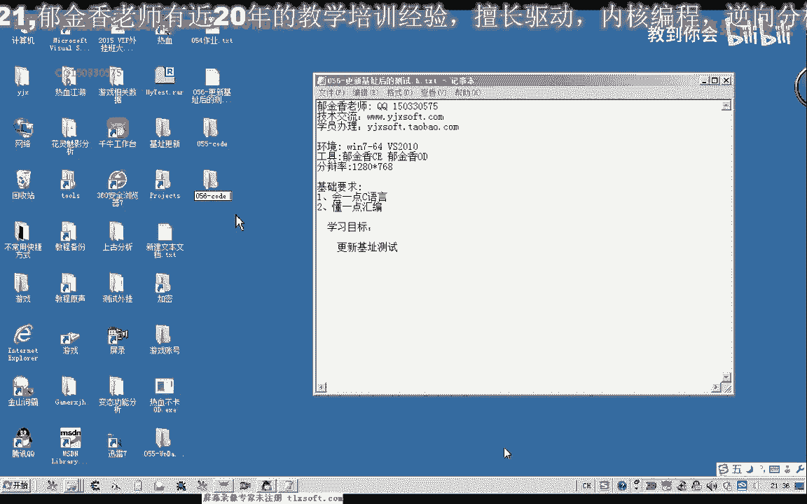

那么打开这个工程，那么首先我们上一节课呢，已经生成了这个白根的这个头文件啊，那么我们先编译一下啊，看能不能够通过，那么最后生成的时候呢，他说有一个失败哈。

请将原文件转换为多次格式或者是unit music，什么格式啊，那么我们注意到这里的换行呢，比如我们其他头文件里面的换行它不一样，那么这个换行是我们在前面的这个生成的时候呢。

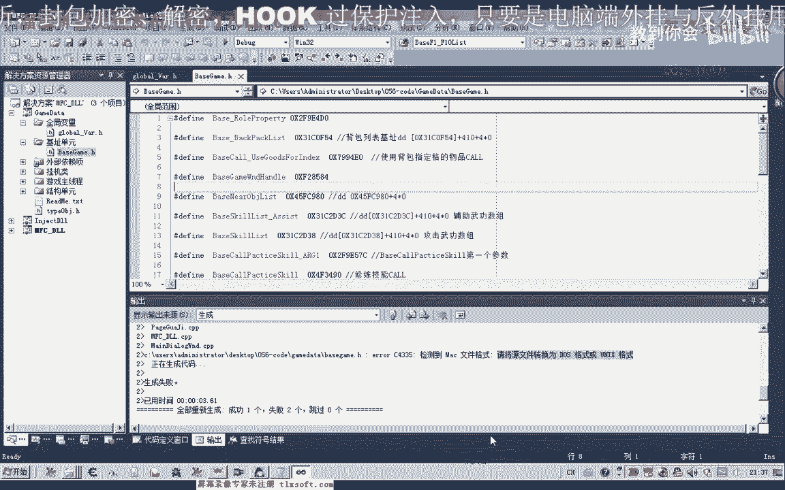

它就是说加了一个换行和一个回车啊，那么实际上我们只要一个斜杠r就可以了，那么我们先更改一下第55课的代码。

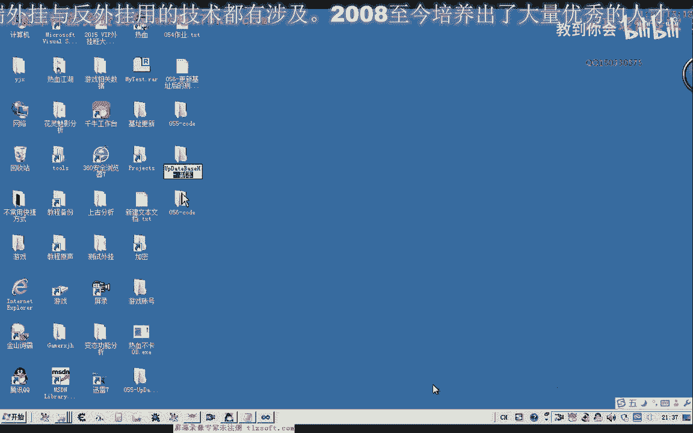

那么首先我们提到这个基础单元移到最后，那么我们可以注意到这里的我们每一每一个文件的换行呢，都是一个斜杠r或一个斜杠n表示一个换行，一个是不凑，那么我们只需要后面的一个换行就行了。

前面这个来表示的是回车键啊，那么所以说我们可以把这段代码呢先复制出来。

啊剪剪切掉，然后呢，我们打开一个记事本，选一下替换，那么我们把这个回车和换行呢替换成一个直接的换行，然后呢我们再把这段代码复制回去。

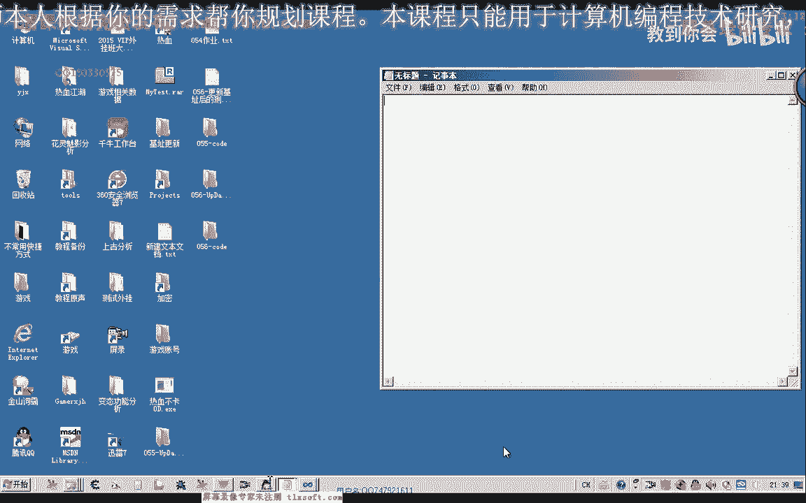

那么这个时候呢我们再生成一下，生产好了之后呢，我们把这个相应的呃exe的文件对了，我们看一下它生成的地方在什么地方啊，对不起，1x一有个1x一的这个目录，但是我们没有找到这个ex的这个目录。

我们看一下它的项目的属性输出目录，ex 1，目标文件再重新生成一下，再打开这个资源，可能是申请到我们的这个上一层来了这个地方，那么这里呢我们可以啊。

这个ex e的这个文件呢啊复制到我们这个56克的啊跟代替单元，让它重新生产，那么替换掉这个跟best的这个文件，那么生成成功了之后呢，我们再看一下，那个头文件，那么在这两个地方啊，这两个地址好像。

这这个机子好像有一些错误啊，那么我们先来测试一下有没有错误，再重新的编译一下啊，这个时候呢我们说全是啊，重新再移一下，然后再编译生成，然后呢他又说提示有一个标签的未定义，这是由于我们改动了这个标签。

在这个地方我加了一个1c x的后缀，再重新编译一下，好编译成功之后呢，我们进入到游戏里面进行一下测试，那么启动项项目啊，然后呢这里我们需要在它的项目属性里面设一下它的调试目录，好那么我们注入到游戏里面。

挂机主线层显示外挂自动打开应用设置，开启挂机，用调试信息查看器，我们查看一下，那么这个时候呢它报异常了啊，我们先停掉嗯，卸载掉主线程退出来，那么一个是gtdt这里报的异常，一个是这个都是f 10相关的。

一个是f 10的这个get it代替，一个是f4 的这个哦，一个是放置技能的这个空有两个地方，那么我们证明就是说这两个相关的机制可能有问题，一个是我们的f一到f4 ，那么。

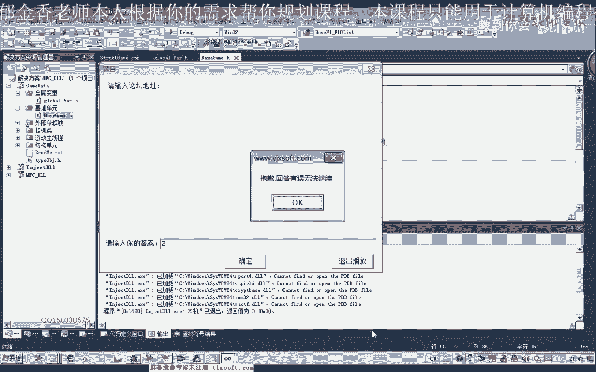

这个机子可能有问题，那么我们转到他相应的这个特征码看一下。

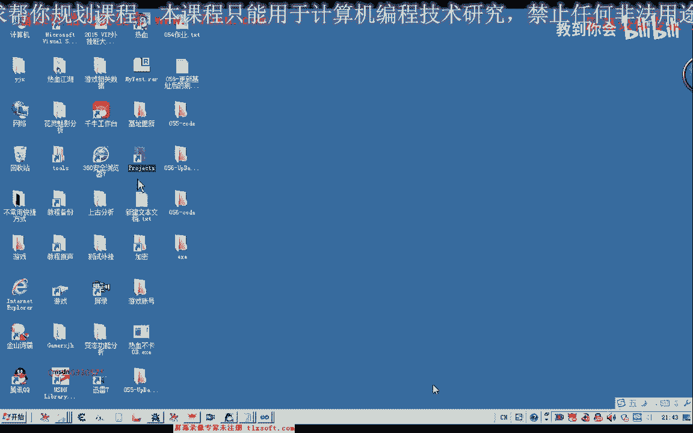

一个是f一到f 10的，那么当时我们提取的偏移的话是17114这个地方124，这里啊是正确的，124来减掉f d，那么我们啊这两个呢剪一下。

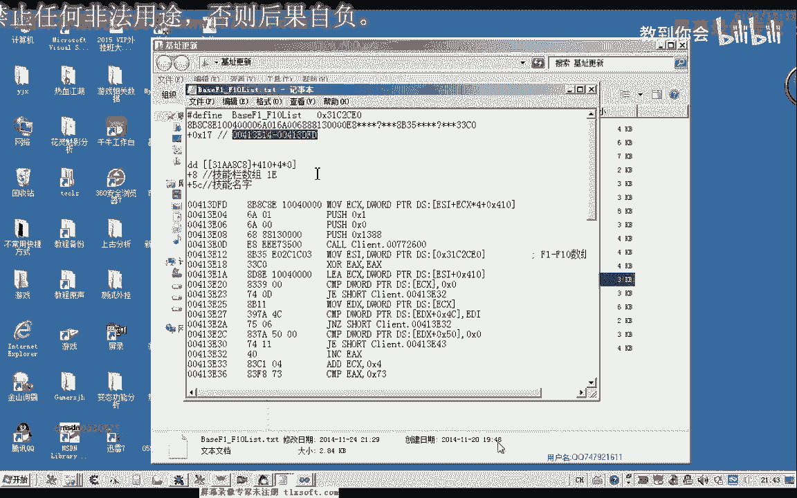

看我们的ot再次来计算一下这个数字，那么我把这个公式复制到里面。

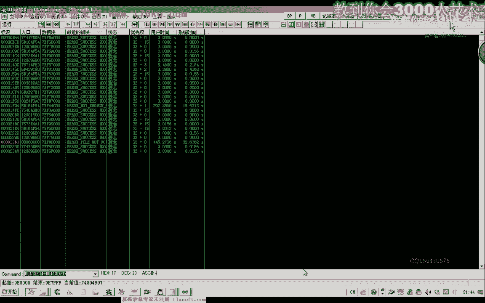

这个幺七好像是没有错的，x17 e14 减d f d那么我们再来看一下异常的信息，f一到f 10的gd，但是我们看一下头文件啊，f一到f4 ，那么这个机子明显是错的啊，那么再来看一下它文件的生成单元。

f一到f 10的这一部分，这是f一的功能call，这是它的list相关啊，加幺，那么我们这里呢是加幺七，这个偏离啊，我们当时可能是不小心啊，这里有一个失误啊，那么这个地方错了。

那么它还有一段调制信息的异常，是在，标题标题还有一个是放置技能，这里异常，还有一个是f一到f 10的个体代替，这个我们已经改变了，还有一个就是我们f一到f 10放置这个空。

那我们看一下相应的条文件的一个设计，f一到f 10放置了这个勾啊，那么这个数值放置技能的控，这是f一和f4 的这个库，那么这个库好像也有问题嗯，我们来看一下，f一和f4 的这个库做的这个笔记。

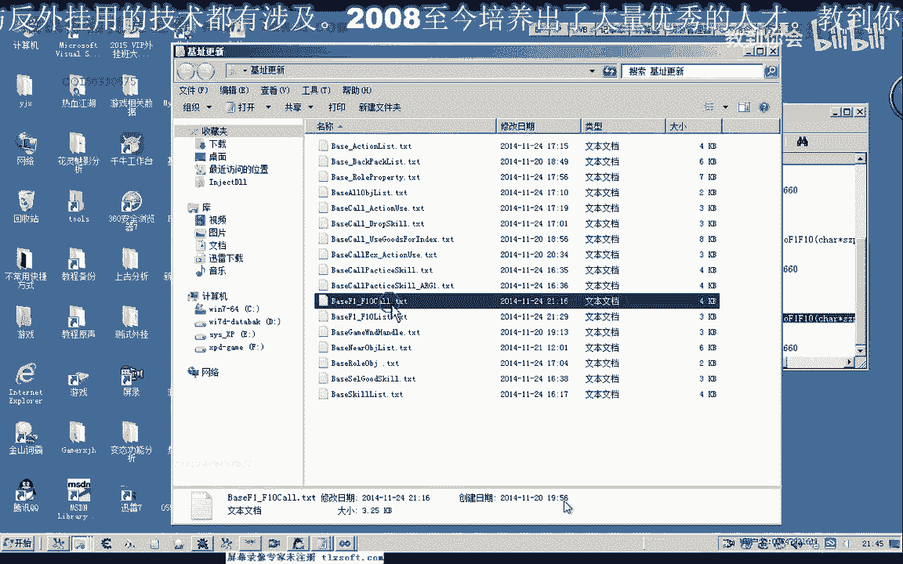

还有应该是f一到f4 的库，我们先找到这个库库在这个地方，那么这个地方da这个地方是db，那么db呢要减掉前面的这个b，我们看一下db这个数字。

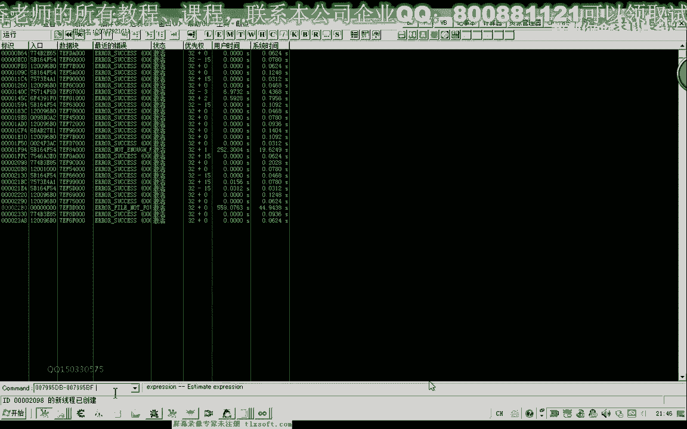

等ec那么我们转到这里边看一下它的一个偏移，是不是ec f一到f 10的这个库，那么这里呢我们写的是二八，这个库呢我们要把它改一下，这里是1c放到前面，这，这个平局我们看有没有错。

前面一个偏移41010好的，那么我们看一下还有什么地方做f一做，放置技能的这个，那我们先把这个异常清清掉啊，等一会儿我们再测试一下，这个我们保存一下，然后我们切换到这个单元。

那么我们从这里还看到有一个f一和f 10的这个过错，还有一个放置技能，这个技能呢他说这个破解是错的，7a7 a0 这个啊，那我们来看一下放置技能的这个空，在这个地方它的偏移是一七啊，慢慢c嗯。

它正确的地址，720a90 ，那么这个地址是没有错的啊，没有错的，我们把这个工程呢关掉，然后在这里来重新生成一下这个重建，再试一下，把这个ec x复制一下，在上一层吧。

那么如果我们要在这个本目录下面生成这个ex一的话，这里去掉一个点输出目的，那么同样的这里调试这里，90分钟都给我们的感情重新再生成一下，那么这个时候呢会出来一个1e x e啊，我们复制一下。

关掉这个工程，桌面上这个ex让我们删掉，复制到56页的代码，下面，替换变化，那么再重新生成一下，要等大致一分钟的时间好的，那么更新完了之后，我们再来看一下这个头文件嗯，let's go。

那么我们再检查一下，看有没有异常的一些地址，那么用用我们的肉眼来看的话，暂时还没有发现问题，那么我们还是让我们的这个代码来检测一下，那么重新生成一下，好那么我们再次运行，那么输入好了之后。

我们再来看一下挂机主线程，显示外挂自动档案，然后把我们的这个调试器开启啊，开始挂机，这个时候好像能够使用了，我们转到游戏里边来看一下嗯，那么我们的更新来说明已经完成了啊，ook这个时候没有报异常的。

好好的，那么今天这节课呢我们就到这里。

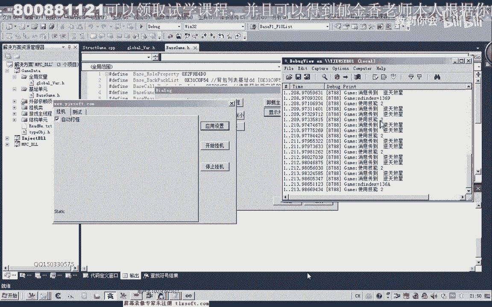