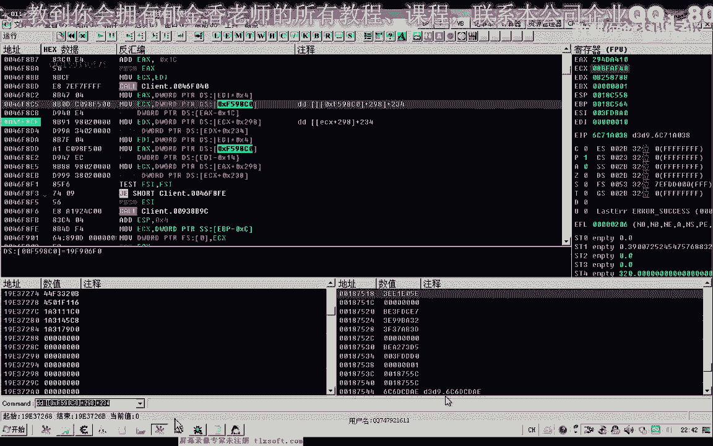

# 郁金香老师C／C++纯干货 - P46：057-寻路分析-相关数据准备 - 教到你会 - BV1DS4y1n7qF

大家好，我是郁金香老师，那么今天这节课我们来讨论一下怎么分析寻路的这个扩，那么我认为呢我把这个寻路的这个课的一个分析来分分为了两种情况，那么一种呢我们是通过关键的数据啊来理想分析啊。

比如说通过我们的目的地的一个坐标啊，这一类或者是相关的一些判断，那么另外一种呢就是因为我们在寻路的时候，肯定他要就是说像服务器啊发送一些数据，表示我得要移动到某一个点。

那么也可以通过发包的函数来来进行一个相应的一个逆向回溯，那么今天呢我们先讨论一下这个关键数据的一个逆向分析，鬼畜这个呃寻路，那么我们进行尝试看这样能不能够找到我们的寻路扩。

那么首先呢这个这些关键的数据的话啊，我认为呢应该有目的地的一个坐标，它应该会有这样的一个判断哈，根据当前的一个坐标与目的地的一个坐标来进行一个比较，那么既然要访问坐标的话。

这个坐标呢是我们当前的嗯人物角色的一个属性，那么可能呢他也会有一个关键的数据呢，可能也是我们的呃人物的角色对象啊，他也会对对它进行一些访问，那么还有呢可能还有我们的一个寻路的一个状态。

可能有这样的一个值啊，那么我们就是寻路结束了之后呢，他会把这个寻路的状态啊关掉，那么我们就不会走动了，这个人物就不会移动嗯，暂时的话可能就是这几个数据的话比较关键啊，当然可能还有其他的一些呃。

我们说的这个寻路的时候，可能呢它也会产生一个呃坐标的一个数组的一个序列啊，比如说我们在这个小地图上啊寻路，那么这个时候呢我们看到有一个有一个弧线的很多红色的小点，那么每一点的话它肯定都代表着一个坐标。

当然这个坐标的话可能早起来要复杂一点啊，因为我们不知道呃它的这个点的坐标的一个具体的一个数值，那么如果能够找到的话，它也是一个关键的数据啊，那么今天呢我们先来分析呃，看这三个数据是否存在。

那么如果存在的话，在下一节课的时候时候呢，我们就用这三个啊数据来做一个立项的一个突破口来进行一下分析，好的，那么我们首先来分析一下目的地的一个坐标，那么打开我们的c附加到游戏里面。

那么首先呢我们这个时候看一下当前的坐标是多少，我们就收x坐标，那么收到之后呢，因为xy坐标的话，他肯定能比如说是有可能它的一个主播是x y z或者是x z y。

那么这样的一个祖国或者是xy哈这样的一个组合3d游戏呢，一般它有三个坐标啊，那么这个z坐标呢有可能它把它放在中间，也可能是放到最后都有可能，那么这三个坐标它一般都是在一片与连续的空间里边。

那么所以说我们一般只需要找到目的地的x坐标了，那么后面就能够自然而然地找到它的z坐标和y坐标，那么现在的话我们不知道他要前往的目的地坐标是多少，那么现在呢我们先搜一下位置的一个初始值。

那么这里呢我们一般来说它是用佛点数来表示，也可能是用双火点数来表示，那么也可能是用我们的四字节，八字节都有可能，那么甚至有可能用字串来表示，那么我们只有一样一样的去尝试，那么最大的可能呢就是佛点数。

那么所以说我们先选否定数，再选，再选这个未知的初始值，那么选了之后呢，我们再让它跑起来，那么跑起来之后呢，这个目的地的坐标可能就有变动了，那么我们这个时候呢收下变动的数值。

那么这个时候呢我们还没有到达这个目的地，那么这个最终的这个目的地的坐标的话，应当是人为变动的一个数值，然后我们改动一下它的这个坐标啊，另外找一个来点击一下，让它进入一个寻路的状态。

那么这个时候呢我们再搜一下变动的数值，那么我们所说的是最后的这个结束点，不是前面的这个红点，然后我们再另外换一个地方再搜一下变动的数值，而且这个数字的话呃，它是呢比零一般说要大。

那么这个数字呢当然它也可能产生这个负数啊，可能产生负数，所以说我们最好不这样收，那么我们还是搜一下未变动的数值，那么现在呢是负的啊，-509，那么现在这个坐标，那么我们所以说这个时候呢我们可以搜一下啊。

负的509是负的506之间啊，这里我们收510~507啊之间的一个数值，那么受到这样一个坐标，那么我们再呃访问一下其他的，让他寻路跑起来，这个时候呢它最终显示的地址呢是879。

那么我们看一下最终他跑到的地址是不是这个879，那么最终的地址呢这个地址就是879，那么证明呢这个就是我们的目的地的一个坐标，那么我们再搜一下有没有其他相同的一些坐标。

当然现在的当前坐标它也与它的这个数字呢也相同了啊，那么这个时候我们可以搜一下呃，精确的数值，在次数的时候欣赏秒，那么这个时候呢我们未来达到一个精确的数值呢，我们可以收啊，把它转换成16进制来显示。

那么这个数字比较多啊，然后呢我们再换一个目的地的一个坐标，让这个数字来发生改变，那么我们再搜一下新的数字，那么这个时候我们可以看到，实际上呢这个目的地坐标来它也有两个啊，有两个，好了。

那么我们把它显示成我们的考点数，方便我们查看，那么这个时候呢我们就显示了这两个都是目的地坐标，那么接下来呢因为我们扫到的这两个坐标呢，它不是机子，那么所以说我们还需要来访问它的一个偏移。

偏移和机子要给他找出来，好那么这一段呢我们随便只访问了一次的这个地方，那么这个地方的话它最有可能呢就是我们的寻路过的这个附近啊，那么后面呢这一段呢他应该是在那个走路的库里边啊。

因为它会反复的调用这个目的地坐标啊，因为寻路的话它就是反复的调用了一个走路走路的一个库，那么所以说我们在后面的啊，这些地址的话可能就是在我们的整个库里面，那么我们都可以把它复制出来。

这个呢我们可以标标记一下，寻路啊，执行这个寻路动作时，只访问了一次，那么我们的寻路课的话，实际上的话他也只是执行一次，而什么会执行多次呢，走路的这个扣它会循环的在执行。

那么所以说在后面这个的话是走路客的附近的可能性要大一些，那么前面这个呢是寻路库的附近嗯，可能性要大一些，那么接着我们把它停掉，那么再来看一下第二个啊，目标地址，那么等一会儿我们再来分析它的一个机子。

那么我们先来看一下第二个呢这个数值的一个偏移，那么再次让它跑起来，那么前面这里呢它也会反复的会执行，那么这两个地方呢也只执行了一次啊，那么执行一次的我们把它分对在前边，那么执行了多次的。

我们把它分类在后边，好的保存一下，那么保存了之后呢，接着呢我们那一会儿啊，一会儿我们在d里面去追他的这个相关的一个机制，那么这是目的地坐标的一个分析，那么我们再来分析一下啊。

它相关的看有没有这个对人物角色，这个对象有没有这个访问在寻路的时候，那么人物角色对象的话，我们嗯之前好像是有分析的，来看一下，今天，那么当时我们分析的这个人物对象啊，好像是这个地址。

那么我们加上一八来看一下，对不对啊，咳，从今，那么这是我们的人物对象，这是我们的人物名，那么人物对象的话，这个也很很好分析啊，当时我们好像分析过，那么可以通过我们人物的这个名字没搜索到它。

那么也可以来通过我们啊相关的一些坐标的一些数字，应该也没有收到他，而且我们发现还有一个问题，就是这里是2d1 d这里是2018，这两个数值的话，实际上目的地的坐标哈，这两个坐标它好像也相对的比较近。

看一下三，它的其实是2。18，这是d还是相差的，还是嗯不算计啊，那么这是我们的人物的这个指针，那么我们把它加进来看一下，那么它在寻路的时候有没有对我们这个地址产生一些反问。

当然访问这个地址的地方呢非常的多啊，前面的反复的访问这个人物对象的，那么我们看一下寻路的时候有没有新产生地址，那么这个时候我们按下了寻路啊，找一下这个时候呢这几个地方呢它执行了一次啊。

那么执行一次的我们看一下啊，人物角色的访问，然后把它停掉，房子，嗯，那么这个时候呢他寻路结束之后呢，有第二次访问他，他可能会这个人物的对象里面可能会有一个什么状态这一类的啊，他再一次掉入了他。

这个时候他已经执行了两次好，相当于这个地方，那么我们把一次的地方复制一下，还有这个地方它也是执行了一次，那么还有这三个地方呢，它也是执行了一次，好的大致就是这些地方我们把它保存一下啊。

呃那么人物角色对象的这个我们也分析了，然后我们再分析一下有没有一个寻路的一个状态啊，那么许诺的状态的话，他有可能是用特殊的字来表示的，那么最常见的表示呢，它就是用我们的灵活一来表示这个操作状态。

当然它也可以用其他的任意数值，比如说他用幺幺来表示我们寻路啊，用我们啊三三来表示不许动，他也有可能，那么我们只是说这种用灵活依赖表示的这种可能性大一些，我们先进行一下尝试，那么如果他是用灵活一来表示的。

我们先把它记录一下啊，如果不是呢，我们就先分析在前面的这些数据先进行验证，看能不能够找到我们的寻路库，好的，那么我们现在看一下，现在呢他们又进入一个寻路的一个状态，那么没有进入巡逻状态的话。

我们可以尝试一下so数值零啊，重重新搜一下啊，清扫描这个时候呢因为灵活一的话，我们用一字节来表示就够了，嗯所以说这里呢我们苏宁，然后我们让它跑起来寻路，这个时候呢我们搜一下数值一。

而且我们这个时候还发现有一个问题，那么这个目目的地的这个坐标的话啊，这两个坐标呢呃它不一样了，那么哪一个才是我们真实的目的地坐标哈，我们会来看一下，那么可能是一个刚才更新的一个速度啊，它可能是跟不上。

啊我们得重新搜一下了啊，因为刚才我们这个跑的寻路状态已经结束了，那么我们在欣赏描下一，现在是寻路状态，然后呢我们让他停止寻路，那么停止寻路之后呢，我们找一下离，然后呢我们再次让它跑起来收一。

然后我们再次让它停下，来，是数字零，然后我们再让它跑起来，收数值一，然后再停下来，只有数字领域，然后我们再让它跑起来，那么数字音，再停下来数字零，这那么大概这两个呢就是我们的呃走路状态，有没有状态图的。

想，那我们再来做一下测试，因为在这里的话，我们只是来走路，那么走路的时候我们发现了这个状态是之一的，这个应该是走路，那么寻路的话，我们访问小地图，那么寻路的话，这两个人都值一啊，那走路的话只有一个。

那么所以说我们这上面这个是寻路啊，下面这个是走路，可能那么在因为在寻路的时候，他同时来走路的状态呢也要质疑，那么这个呢是我们真正寻路的状态，应该我们再来测试一下，走路的时候呢，下面这个五一。

那么寻路的时候呢，两个都不一，因为在寻路的时候，肯定他也要调用我们指路的这个空，那么所以说在这个时候呢，我们在呃寻路这个状态这里我们看它是几字节的，我们用字节来看一下啊，证明他这个地方呢可能是四字写的。

我们在这里找一下什么地址啊，访问了这个什么代码，访问了这个地址，然后呢我们再让它跑起来寻路，那么这个时候我们发现这两个地方呢它进行了比较，而且只执行了一次，那么我们把它复制下来，那么越靠前的话。

他可能性还越大，那么我们再保存一下，那么顺便我们可以分析一下他ei的这个机制是多少，看一下e si的值是129c12 f d0 ，我们看一下有没有这个数字，419多少，我们在这里面搜一下他的这个机子。

这里选是自己19412675，那么这里只知道一个地方是七次，那么这里存在一个对象啊，相应的那么这个对象的话可能是在我们这的所有对象数组里面啊，也有可能我们看一下我们的人口是31c e啊。

不是我们人物的属性的，可，那么我们再来看一下，把这个机子添加进来，看是不是这个机子嗯，我们看到这里呢是一个数组的一个访问方式啊，那么在这里的话，他可能就是我们的所有数组，而不是我们直接的这个机子啊。

所以所以说这个绿色的机制相当于是无效的，但是这里边也有很多地方访问到了这个地址，我们先把这个去掉，从最开始的这个19f开始，我们看一下有没有访问它的地方，好那么这个时候呢我们又能够找到另外一个啊。

这个机子好偏移，那么我们来看一下这个时候ex的数值是多少，ec x19 ，还有511070，那么我们把它记录下来，我们再来看一下这里的偏移是多少，i，那么e下来刚才是228的这个偏移，这里呢他只取了呃。

当时比较的时候，他只取了一个字节，而且那么我们暂时把这个人取一个字节。

那么他的第一个p是298，第二个偏移呢是二八，幺九的时候我应该只有一个偏移啊，这里加上加上298145，我170所在的呃支撑收出来，那么这个时候呢已经收到了两个机子嗯，那么我们随便拿一个出来。

用这个f598 的可能性要大一些，没有f598 ，它是一个机制，然后呢在这里我们添加它的两个偏移，一个是498，应该是228，那么最后呢它计算出来的机制就是这个寻路的状态，好的。

那么游戏呢这个时候呢呃已经异常退出了，由于我们的这个访问可能是过于太频繁了哈，那么可能是与我们的主线程之间呢，它产生了这个冲突，因为他毕竟啊多线程之间这个数据库的一个访问呢，呃平常了之后嗯。

频繁了之后的话就会出现战略的异常，那么我们重新再进一下游戏，进入游戏之后呢，等一会儿我们再搜一下其他的机子，那么这个是我们的人物角色啊，没有对象，那么等一会儿我们再搜索一下哈。

目的地坐标与我们的嗯人物对象，这个已经搜出来了，主要是搜一下目的地坐标的一个机制，那么我们再次打开游戏，那，么这次呢我们可以直接用d来找一下也可以了。

刚才我们用c e来找，那么现在呢我们可以直接用o d附下来找一下它的一个机子。

那么这里呢我们要把它记录一下它的机子呢，就是嗯水路的状态啊，那么我们再次把它附加进去，那么寻路的状态的话，其实呢它的一个298，一个28的一个偏移。

那么这个就是我们的巡逻状态啊，它只有一个字节啊，应该是，那么在这里我们也可以给它加一个相应的断点，来看一下究竟是几字节的，那么这里呢我们看到它比较的是前缀是bt啊，那么所以说呢它是一个字节的js i。

所以说这个时候呢我们把它备注一下，那么走路的这个状态的话，暂时我们用不到啊，那么寻路的这个我们暂时把它分析了就可以了，那么接下来呢我们再分析一下目的地的一个坐标，那我们看一下目的地坐标的话。

是在这个位置，还有一个访问，那么我们转到这个地方，234这个地方e d x，那么这个时候呢我们需要找1d x的一个来源，那么dx啊，它来源于ec x加298，那么所以说我们在这里的话可以这样表示。

加298，那么再加上我们的234，好那么我们在这里下一个段，然后呢我们点寻路，这个时候呢它会断下来，断下来之后我们看一下e4 x的数值是多少，我们把e4 x的数字来带进去。

那么这个数值的话也是19f开头的，这比我们这里的这个数字呢离得比较近，19f906 又不理，那么的话也就是说他的机子的话跟我们寻觅的状态的话是在一起的，他的机制就是这个啊，那么我们就用不着去找。

而且在前面的话也有啊，这个地方就有它的一个机制，他们是一起的，看着他让他跑起来，那么就在前面不远处啊，再加上这个机子就可以了，按下空格键把机子复制出来，看来这个寻路和寻路状态哈，寻路坐标呢。

他们都是一起干嘛，这里括号啊，多加了一个。

那么再来看一下它坐标的形式呃，坐标有两个坐标，19452079啊，那么它也就只有一个x坐标和一个y坐标，这个目的地坐标呢它没有我们所说的z坐标，那么寻路的话，它这些坐标看来是自动调整的。

好那么这个坐标呢我们也把它复制一下，做一下标记，那我们就做到后面一起这个状态嗯，加，加2号这个地方呢是我们的巡逻状态，那么加上我们的234，这是x坐标加238，这里面就是我们的y坐标。

那么但是另外还有一个目的地坐标，那么我们来看一下当时的话第二个目的地坐标，我们看还需不需要分析，可能这个第二个坐标的话，分起来的作用都不是很大了，嗯那么在这里呢它有一个写入的一个读取的一个动作。

那么我们走到这个地址去看一下，那么这个e a x呢它来源于是我们前面的e s i加1964，那么我们在这里呢下一个段，寻路啊，那么它是先从这个地方断下来。

那么说明这个扩的话离我们的寻路的话应该还要近一点，那么另外这个的话分布分析的话应该嗯都可以啊，我们来看一下e s i加1964，那么e s i的坐标是多少，2d低多少多少2d d b c610 。

那么我们找一下它的一个来源，加上164，那么这里的话我们也能够看到两个坐标，但是这两个坐标后的话，它有一个z坐标，然后呢再是我们后面的这个坐标嗯，y坐标，那么我们再找一下这个2d d bc啊。

它的数值的一个来源，那么我们先用c一找一下，看看成不成。

在机制，啊这个时候呢我们能够找到一个机子45f980 啊，还有这一个啊，31c163 岁，那么这个的话也就是我们角色对象的这个机制，那么就可以用角色对象呢来表示它，再来看一下啊。

对象里面他也有这样一个机制，说明的话说明我们在寻路的时候的话，肯定要访问到这个对象，要，那么我们来看一下这个是不是对象加上一八，dc啊，这个的确是我们的这个对象啊，那么我们就把这个地址记录一下。

好组织下来，那么今天这节课我们的分析呢就到这里，那么下一节课的时候，我们在利用这些数据呢，嗯再来进行我们就是群路过的一个分析，那么顺便我们把这个数据栏再整理一下。

在人物角色这里边呢，我们再加上一个呃相应的一个偏移，就是刚才我们复制的这个公式，他加上我们的啊，加上我们的161964，这个时候呢是我们的坐标指针入体就做掉，我们再来看一下是不是这样，加上1。4。

那么这个地方里面呢就是放在我们物体地坐标的指针，而且这里他接连三个啊都是放的这个目的地啊，对象的这个指针它实际上是放了一个结构的一个指针，这个结构呢就是我们所说的x y嗯，x z y。

然后这中间这是z坐标，它是稳赢的，那么我们写下p x z y保存一下，然后这个地址呢我们也把它保存一下，我们看一下我们的头文件里面有没有这个呃f59830 的这个地址，看了一下56克的著名的这个代码。

然后我们把刚才分析的这个机子啊，找一下有病，啊，这里我们找到一个，那么这个机子的话是在我们的呃动作，或者这个机子里面已经存在这个数值了吧，那么我们就也把它进行一下备注，动作克里，那么也就是这个数字。

那么这个数字呢我们另外再把它定义成一个红，现在还不知道怎么来取名这个对象啊，因为这个对象呃它是一个什么对象，我们暂时我们还不知道嗯，动作也是这个对象为机制嗯，今天我们的目的地坐标也是以它为基础。

那么暂时它把它备份一下，那么用得到的时候呢，我们再做一个相关的一个呃注释，那么这里呢我们就把它叫做动作吧，因为我们在询问一下动作啊，u3 x，那么这里呢我们到时候也把它改动一下。

就把它替换成我们这个前面的这个不就可以了好的，那么这节课呢我们暂时就到这里。

