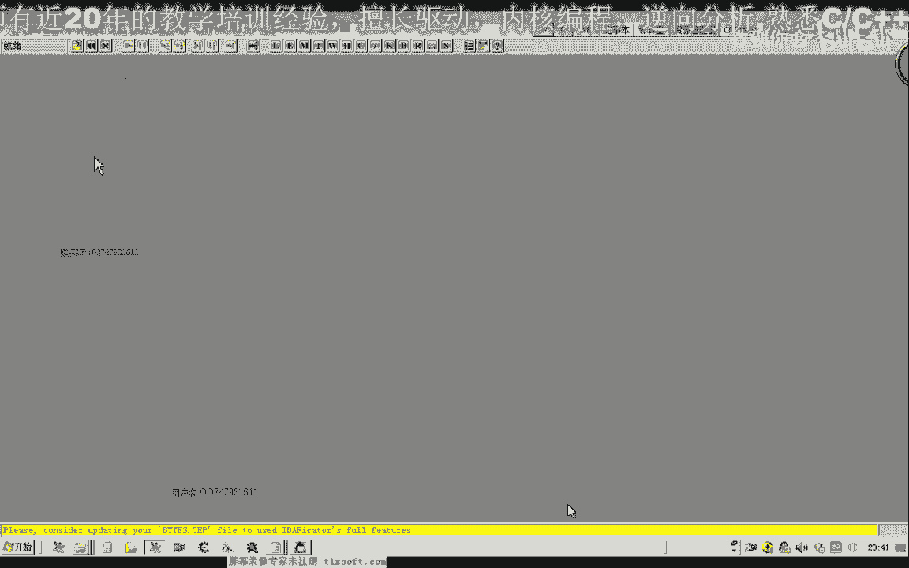
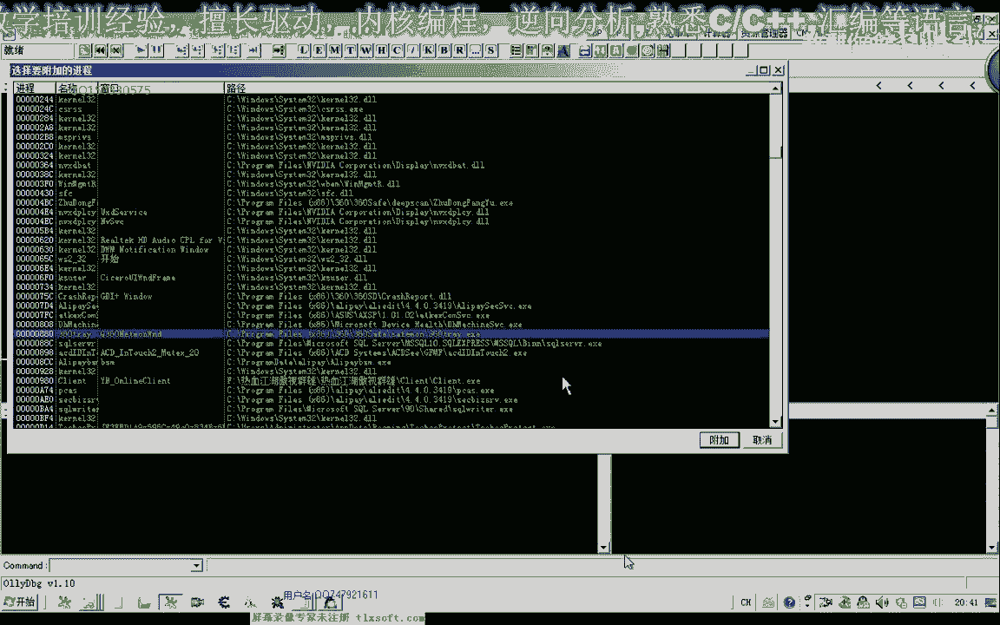
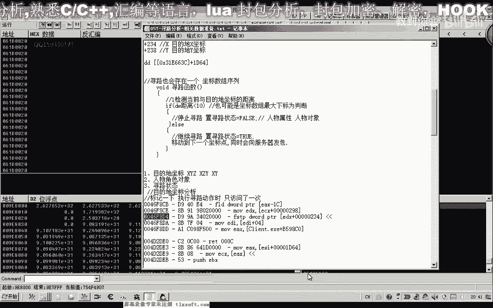
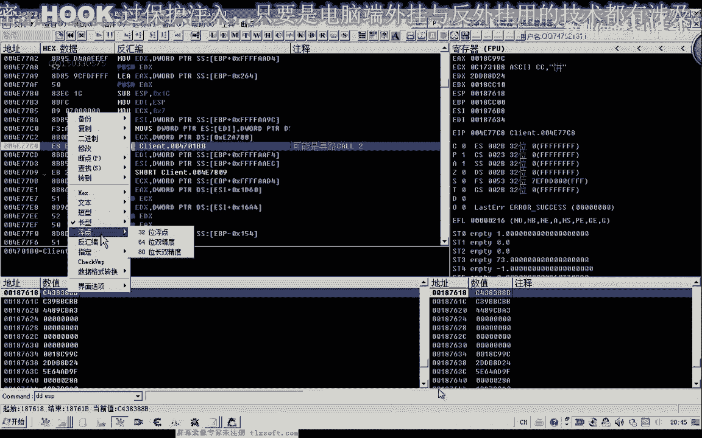
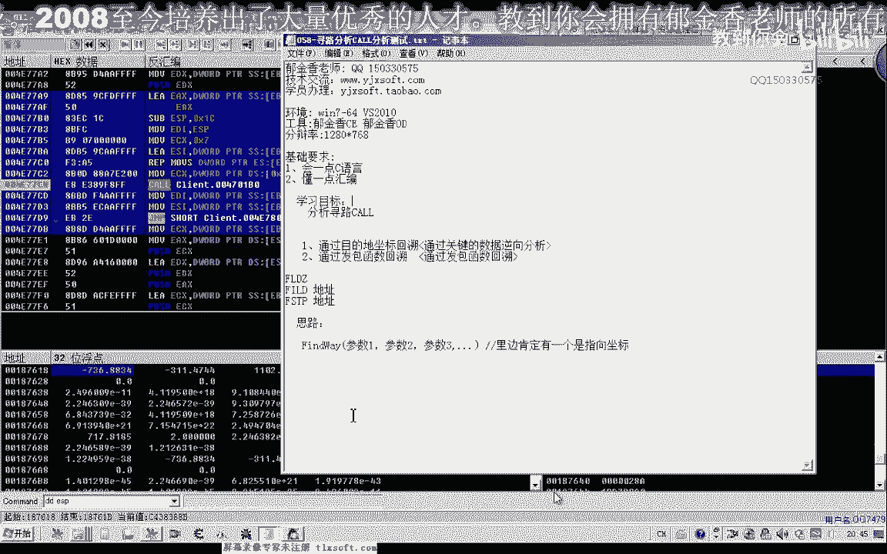
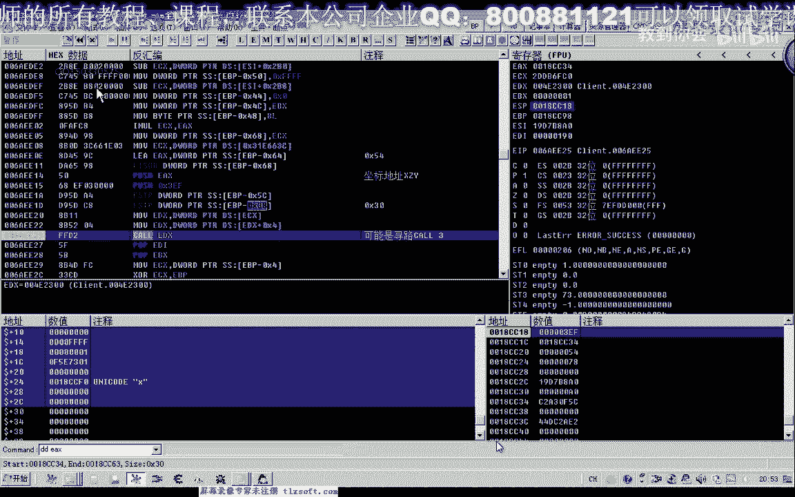
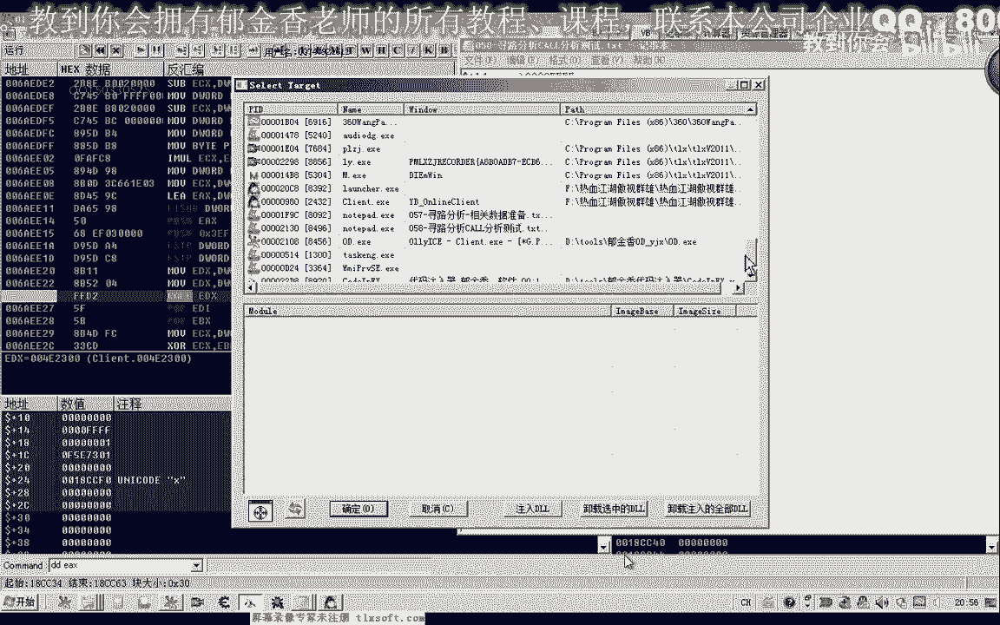
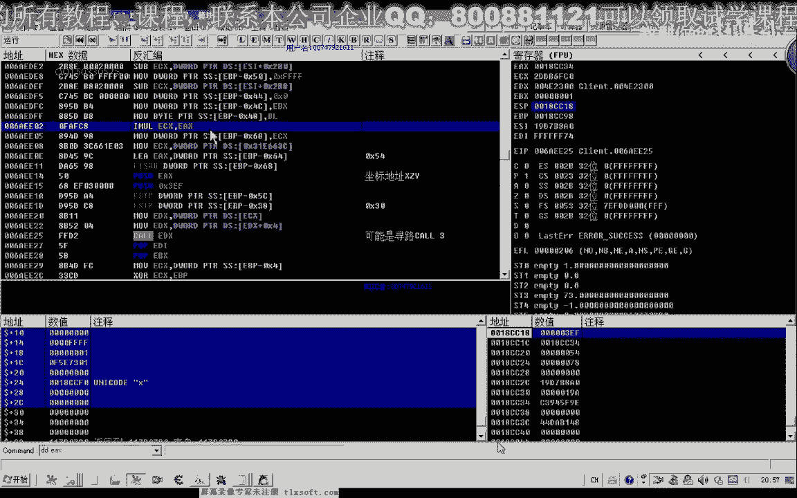
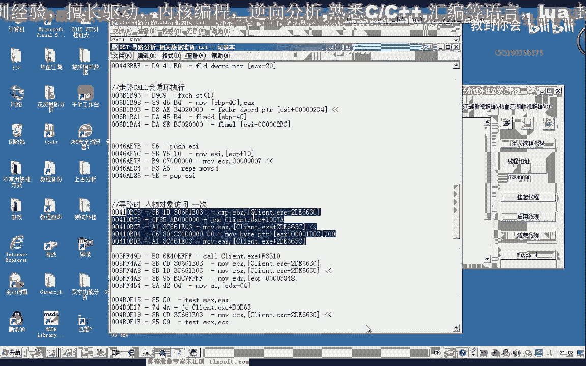

# P47：058-寻路分析CALL分析测试 - 教到你会 - BV1DS4y1n7qF

大家好，我是郁金香老师，那么今天这节课呢我们一起来分析一下寻路的课，在第56课的57课的时候呢，我们一起分析了寻鹿相关的一些数据啊，那么我们并把访问了这些数据的代码呢做了标记。

那么这节课呢我们就根据这些代码来来分析一下我们寻路的空。

首先打开我们的固定工具。

然后附加到我们的进程里面，转到我们的第一个地址，那么这个地址呢是我们的目的地的一个坐标，那么在我们巡逻的时候呢。

他访问了一次，那我们在这个地方呢进行下段，当然这个时候我们走路的话，它不会断下，而且我们走近了，好像他也不会断断一下，我们走远一点，把大地图打开啊，因为这个扩的话。

它可能的话上一层扩呢不是我们要找的寻路扣啊，如果是寻路扣的话，应该说一访问可能他就会断下了，那么这个时候我们按ctrl f9 执行到返回，那么这个时候会返回到这个地址，我们在这个地方呢跟它下一个断点。

但是呢这个地方它可能是我们的选修课，我们做一个标记，然后再次按下ctrl t执行到返回这个地方呢，我们是第二个可疑的地方啊，你跟他做上一个标记，按f2 下段，再次按下我们的ctrl f9 执行到返回。

然后我们返回到这个地方啊，是第三个壁纸，你给他做下一个标记，然后继续的执行到返回，那么这个地方呢是第四个地址，再给他下一个段，然后我们也可以通过这个堆栈哈转到我们的b p。

那么它的上一层呢也就是我们的上一个空啊，这个地方当然也可以通过执行调返回它，同样的会返返回到这个地址，那么这两种操作呢都是一样的，那么在这个地方呢也给了下一个段，那么这里可能是我们的寻路货物。

然后让它跑起来，跑起来之后呢，我们然后再走上几步，这个时候没有断下，然后再点一下小地图的寻路，那么这个时候我们点任意地址的话，它都会断下了，那么第一个段下的扣，那么我们来看一下，那么这个扩的话。

它有可能是我们点击了鼠标的一个鼠标啊，点击的一个响应的一个扩，那么也有可能是我们的寻路，那么在这里呢我们看它有一个三是固定的一个常量，那么另外一个七八和零啊，那么另外这里有两个参数。

它显然都不是我们的坐标啊，那么四坐标的话也可能是窗口里面的相对的一个坐标，那么我们可以，那么再次执行的时候呢，我们执行到这个地方，那么这个地方呢我们一个是七八，一个是零啊，还有一个也是七八。

那么这里有一个地址，我们跟进去看一下，那我也看不到坐标的眼，那么所以说这个的话我们也把它的断点取消掉，那么再执行到下一个，那么这里有一个路障的参数是三ef。

那么这里呢一八cc 34呢是这个地方的一个地址，那么这个地方的地址的话，我们看它这里有两个数啊，这两个数的话这种数值比较大的，一般都是否定数，那么可能是一个坐标，那么另外这里还有一个验证的参数是五四啊。

那么这个站嗯这个地址呢比较考虑一点，我们转到数据窗口来看一下，那么36位的佛典数，我们发现呢这个呢是一个坐标啊，我们把它标记一下坐标地址x z y，因为中间一个是零，然后我们再次执行啊。

再来看一下呃这个数值，那么这个数值的话都在里面呢，他直接好像就是一个坐标dd sp来看一下。

那么这里呢也是一个坐标，但是与我们上一层的坐标呢它不一样啊，那么所以说的话像这种情况的话，上一层的困难应该是比较最上层的，应该是最可靠的啊，但是这个呢也有可能是啊，我们都把它复制一下。

那么然后把它的断点呢取消掉，那么这里呢它也是原封不动的啊，与上一层的这个坐标也是一样的，736多少多少，然后我们把这个段里面也取消掉，把它抓一下，抓一下相应的代码，但是这个呢它是叫里程的。

可我们跟它标记三这个标记二，那么最顶层的那个带参数的呢，我们等一会儿啊，再抓起它的一个特征码，让它跑起来按减号，然后我们退回来退回退回到这个地方，那么这个是最外层的，最外层的可能性是最大。

那么我们要优先的进行测试，那么这个呢我们标记为一，那么这三个空它的参数呢都带有一个坐标的一个地址，那么这三个扩理论上来说都有可能是我们的寻路扩，因为它的参数里面呢代表我们的坐标啊。

但是我们目前还不知道这个是不是我们目的地的一个坐标，那么接下来呢我们先对它进行测试啊，那么如果这里通不过测试的话，我们再继续的啊，下面的还有这么这么多代码啊，我们可以一个一个的进行一个测试，好的。

那么我们开始编写第一个call的一个测试，那么第一个我们首先呢要知道他压榨的参数，那么它看起来的话，这个货呢只有两个压榨参数，一个是普sh ex，另外一个是三级f，但是呢我们要确定的话。

第一个方法呢是按f7 跟进这个空，那么还有一种简单的方法，那么我们再次让它断下，我们先把它取消掉啊，先让它复活了才能够走动，好的，那么我们再次下段嗯，然后呢我们点击寻路来看一下它的参数。

那么现在我们看一下e s p的指南是c418 ，也就是这个位置我们双击一下这个地方，那么因为它或执行完了之后呢，它会执行一个return多少多少自己，那么我们这个时候来观察一下。

因为return的话也就是对我们esp的值来进行一个呃相应的增加，它会增加相应的一个数值，那我们看一下这个时候usp的一个数值，它增加了多少ren之后，嗯现在的数值的话是c24 。

那么大概是在我们在后面这个位置来了，它大概是加了啊12个字节，我们看一下日式与幺八之间的话，它是现在是c24 ，这里是c18 ，那么加了16个字节的话，呃也就是说我们的参数的话要占到我们的16个字节。

它应该是压占了三个啊，嗯三三个参数，也就是说它前面还有一个，那么另外一种方式呢，我们就可以来再次断下的时候跟到这个框里面去看一下，按f7 跟进，那么跟进了我们一直执行到return。

也可以看到它实际的呃屏占的字节数，也可以计算出它压榨的一个参数，那么我们可以看到这个时候return是零碎啊，也就是12个字节，而我们每一压压战一次呢，实际上它要让我们的1p的职能啊要剪掉啊。

应该是是要减掉啊四个字节啊，那么所以说这里呢他要加上12个字节来评价，也就是说之前的话我们亚洲的话一共12个字节，是一个分住三次亚战的好的，那么我们既然知道了，我们就能够呃它参数的一个数量。

那么知道数量之后呢，我们就知道3f4 ，还有这个呢是我们一个指针的一个地址，那么这个地址也是啊，地址的话，它可能呢呃有一片是一个什么什么结构啊，前面是一个指称，后面可能还有一片地址。

那么还有一个职能是五四之前的啊，那么五四人是第一个压榨的一个数值，那么我们知道这些的话，我们就可以开始写我们的代码测试了，第一个复习0x54 ，第二个ex第三个呢0x3 f。

然后接下来就是我们的ex为什么是e4 x呢，因为这里呢它用到了e4 x来计算我们科的一个地址，或者地址呢是存放到e d x的比例，那么最后呢叫我们1d x，那么在这里的话，后面的这个写法都很简单。

关键是我们的这个ex的这个地址啊，它究竟分配了多少个字节呃，这个结构的大小有多大啊，这个才是我们的难点，那么我们往前找一下，看能不能找到他有没有分配空间的一些相关数据，那么在这里的话可能很难找到。

可能再找的话可能要找到我们的这个函数的同步去啊，那么我们还有一种简单的方法，就是通过这个六四的这个偏移来减掉我们最小的这个偏移，最小的这个偏应该是3864-38，那么这样呢我们能够得到一个偏移值。

因为在这里的话，他出战也对，这里的相当于是我们传进去的数据来进行了一个相相当的反访问，那么最大的这个偏移，最大的偏移应该是6868 -68减掉三八嗯，那大概他的所占空间的话就是0x30 。

那么我们可以先给它分配这么大的一个空间，然后去填充相关的数据，那么这个数据呢我们就在堆栈里面进行抓取，那么看一下现在的ex，那么这一篇数据我们抓2c啊，这么多个字节，那么实际上呢加上零这个偏移来。

一共它就抓了三点各自己。

那么我们先把它复制出来，然后在这里呢我们也要跟他分配这么大的空间，那么分配这个空间的话，或者说我们依次从下面的零开始谱写复习零铺起名，谱写这个数字，这个这个这样谱写下去也可以。

那么最后呢我们这里呢给它屏障啊，a d t usp 30就可以，那么除了突袭之外呢，我们还可以来给它进行赋值，当然这个push的话，我们要从最大的数值来开始剖析，因为这这个人才是占比啊。

当然我们也有另外的一种写法哈，另外一种写法呢我们就是先分配一个空间，sub e s p3 年，然后分配了这个空间之后呢，我们就把这个暂停的这个地址呢给我们的ex。

然后呢我们再用这个ex来为偏移加0+4+8加c，这样来负责也是可以的，那么这种结构呢可能会清晰一些，那么这个呢我们因为你是在堆栈上啊，所以说这里的他的这个状态寄存器呢是s s。

那么后面呢就是ex加零开始，后面就是我们的副词啊，这个数值x坐标，然后我们把这一串的复制一下，哈哈，然后我们加上它的一个偏移484，这过的是101418142024，28，那么再加一个呢就是日c啊。

就是绿色的话，再加上我们前面的这四个字节的话，就是三零啊，全部都复制完毕，那么这里呢是我们的z坐标，它本身是为零的，那么我们传一个零值进去，那么下面后面这里来跟两个零，我们也传进去。

明确这个地方是你的一零，这个地方是零，一，是这个地方呢是f f下面这个地方呢是一，那么在下面这个地方呢，它是一个数值，具体我不知道它是多少，那么在下面呢是零，那么在下面呢，这里是一个地址。

那么一般用到这个地址的话，这个地址呢也是堆在里面的，那么可能从24开始，在后面的这些数据的话，可能都是无关紧要的好的，那么这样我们就可以进行一个相关的测试，复制一下，然后用代码输入器打开。

然后呢我们就可以开始测试输入，然后把断点取消掉。

然后我们用代码输入器啊，输入我们的代码，那么这个时候呢我们就发现了他已经跑起来了，就能够向某一个地址呢呃进行移动了，那么证明的话我们的寻路代码的话已经ok了，那么这个呢可能就是我们的寻路空。

那么我们再尝试改一下后面的数值，看它有没有影响，那么发现他是没有影响的，那么说说明后面这八个字节的话可能就可以不要啊，那么或者是无关紧要的，还改一下这个地址，看有没有用，我们发现它也能跑。

说明这个地址呢也是没有影响的，再改一下这个数字，但是这个数值改了之后呢，我们就发现它不能够跑，我们再改为一，这个时候他又能跑了，那么说明它影响的这个结构的话，大概就在二零个字节可能就够了。

但是我们可以多分配一些呢，这个也没有错啊，只是我们把多余的这一点小小的空间浪费了日子好，那么我们的call就写好了，那么这个呢就是我们的一个呃寻路的一个空，那么后面的话我们都可以了啊。

这样子都可以不进行测试啊，那么大家有时间的时候呢，大家可以把剩下的这些地方呢进行一下测试啊，看还有没有其他的地方也能够达到一个寻路的一个功能啊，那么理论上来说，在后面这些的话啊。

从这后面这些数据来追的话，可能也能够追溯我们群众的空，那么可能会要稍显复杂一些而已，好的，那么这节课呢就到这里了，那么下一节课呢我们再编写一个代码的一个测试嗯，那么另外呢这个后来还有另外的一种写法。

在这里呢我也说一下啊，因为在这里的话我们传的都是一个16进制的一个数字，不是直接传的一个法点数，那么这样的话我们来测试的时候的话，就显得的话不是很方便，那么实际上我们也可以看一下现在的坐标是多少。

是负的153和正的1545，那么如果我们要移到253 154，那么如果我们要移到这个地址的话，我们可以了嗯，用另外的一种方法来进行尝试，那么腰杀我们看16字节的153是多少，130。

那么这里呢就是获得九九十六进制啊，然后1545我们再来看一下啊，1545609，那么我们可以借助一些佛典指令啊，这个我们以前在2013的这个网速教程里面有讲这些佛典指令。

那么我们可以用火点指令呢来进行呃一些转换，那么可以使它更具有一个考图性，那么我通过不点指令的话，这里呢我们就可以来直接全复米x99 这个坐标整形的，那么这里呢我们也可以穿啊，x609 。

那么前面的这个前缀呢也可以去掉，它默认的就是16进制，那么这个16进制的话，我们要转换成借助我们的浮点指令来转换的话，他们有一个呃可以通过两个指令配合，一个是f l l d，f i l l d。

就是把整形的数字来转换成我们的佛点数，那么然后呢压到我们的佛顶上，然后我们再通过另外一条指令ftp，谈战啊，把它弹到我们的堆栈里边，这个时候呢就完成了我们的一个呃，整数转换成我们的浮点数的一个过程。

那么后边呢我们也把这一段复制一下，那么y坐标呢我们也用同样的方法，好的，那么这个时候呢它就会移动到负的1531545，那么我们来测试一下，当然我们现在要走几步，然后再让他回到这个位置去好。

那么如果我们这里的话，要其他的数值的话，我们这里来可以给它增加一下，看来它转换成十进制的话是1801，我们来看一下，那么所以说我们也可以用这种方式，那么用后面这种方式呢。

它也就是看起来呢可能要容易懂一些哈，这个坐标呢它更容易让我们理解一些好的，那么这节课呢我们就到这里，那么下一节课呢我们在编写代码，把它封装到我们的社交夹里边好，那么我们下节课再见，那么这里给一个坐对啊。

大家可以下去之后呢进行一下尝试，嗯嗯那，么根据我们下面这些代码，看能不能够找到我们的群入库啊。

根据下面这些代码进行返回进行尝试。