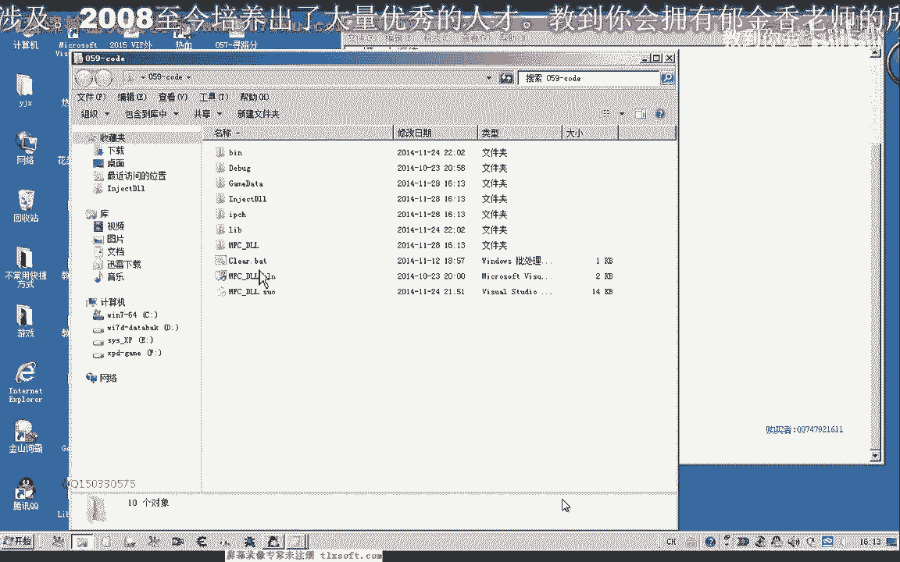
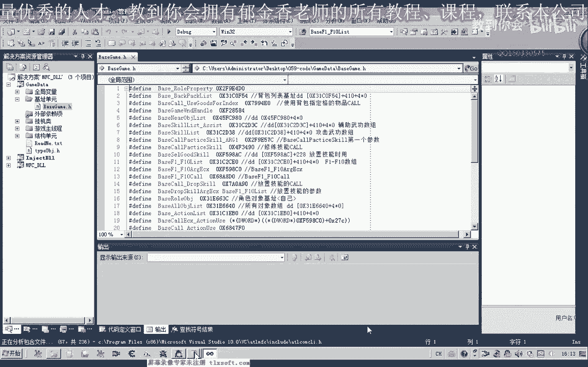
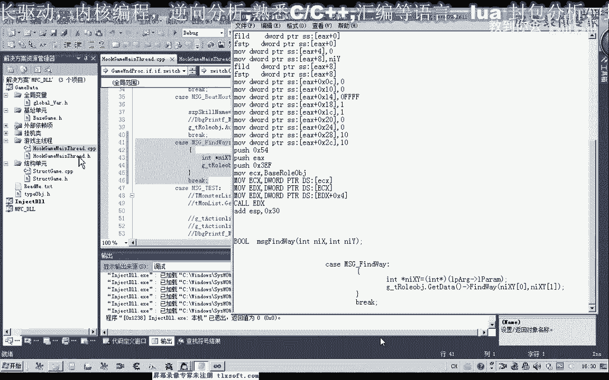
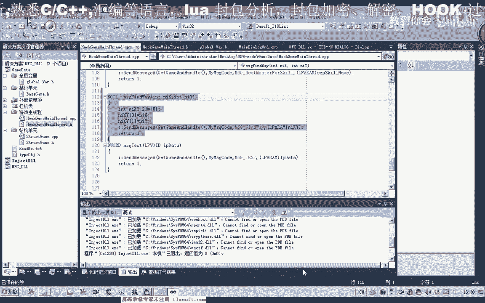

# 郁金香老师C／C++纯干货 - P48：059-寻路CALL封装测试 - 教到你会 - BV1DS4y1n7qF

大家好，我是郁金香老师，那么今天这节课呢我们一起来封装一下寻路的课，那么在第58课的时候呢，我们分析了这个寻路的课，那么我们把相关的资料打开再看一下，那么这一段呢是我们测试通过的代码。

那么其中这个负的九九呢是x坐标，这里是我们的y坐标，那么我们先把它测试一下。

那么打开游戏啊，修改我们的呃相应的坐标，然后呢我们进行测试对了，要注入到我们的游戏里面，然后输入代码，那么这个时候呢它就可以了，开始巡逻了啊好的，那么既然我们的空测试通过了，我们把这段代码复制一下。

然后我们添加到我们的呃项目工程里面，把第56课的代码打开。

然后我们展开我们的基础单元，添加我们相关的机制。

那么这个时候我们可以看一下，那么涉及到的机子呢只有一个人物角色对象的。

而这个机子的话我们已经有过定义啊，那么在这里呢我们直接把它替换成这个机子就可以了。

复制一下，那么在这个位置来替换成它，那么在这里的话，我们宁愿这部分数据呢就替换成e c x，要注意的是，不能够直接啊替换在这这个里边啊，不能够直接的这样替换，那么另外呢还要需要重要的是。

我们所有的都是16进制的，那么在我们c c加加编程的时候，如果你不加这个0x的前缀的话啊，他是认不了啊，不能够认识这个数据，所以说在这里呢我们每一个数前面的都要加上0x的前缀，当然九以下的这些数字呢。

我们可以不加啊，因为它代表的是一样的，可以加也可以不加，但是也不要加这个零的前缀，那么这两部分呢我们就把它变为我们的y坐标，那么这里呢就替换成我们的x坐标啊，接下来我们就可以进行我们函数的一个封装了。

当然还有这个位置，你要注意加上我们的前缀，好的，那么我们把这段代码复制一下。

然后转到我们的结构单元，转到我们的呃人物角色对象啊的封装，那么这里呢有一个选中对象的类型啊，那么我们就在它的后面的添加相应的寻路函数，啊，那么这里呢我们可以不用定义成驼点数嗯，定义成简单的整数就行了。

而且呢我们也是需要两个坐标就可以了，因为中间一个坐标的话，它都是一样的，是您可以被忽略掉啊，为了简化它呢，我们就定义两个坐标，然后我们转到呃前面这个函数的后面嗯，为它添加代码。

那么首先我们是进行一个异常的处理，那么这里呢我们打印出如果出现了异常的，我们打印出调试信息，啊，123，那么最后呢我们这个执行完了之后呢，我们还是跟他正常的执行完了之后呢，我们还是跟他返回一个数值。

那么这里呢我们返回真啊，如果是产生了异常呢，我们在这里呢就直接返回f，那么在这里呢我们添加我们的汇编代码，那么把我们刚才写的这一段啊，汇编呢我们把它复制进来，当然这一段的话。

我们也可以来用我们的呃这个临时变量来代替这个数据块啊，这样的话我们显得更加的简单一些，好的，那么我们先把它排列一下，那么还有这个地方呢，我们需要加上一个里面x的前缀，这两个地方我们也需要加上。

那当时我们测试的话，好像后面这两个数据的话都是没有多大的用处的啊，但是呢我们可以这样的啊，把这个空间呢这个结构的空间给它分配大一些啊，这样呢不容易出错，好的我们编译一下。

那么这个时候呢我们看一下他说不正确的一个操作数，因为我们这个nx呢它是变量局部变量，而这个局部变量呢它也是一个内存的地址，那么这种内存地址到内存地址的寻址方式呢，它是不允许的。

所以说我们必须来先先把它放到一个寄存器变量里边，然后呢把这个数字呢再转进去，这样才可以后面的这个y坐标也是一样，我们先把它放在inc x里面，然后再把这个数值呢传进去。

那么这个时候呢我们重新编译的话就可以了，那么我们可以标注一下这个地方呢是我们的啊，z坐标，那么这个坐标是我们的y坐标，那么前面这个坐标呢，是的，x做，好的，那么我们写好了之后呢，我们编译也成功了。

那么接下来呢我们进行一下测试，那么转到我们的mfc啊，这个单元在这里呢。

我们添加我们的测试，那么这个测试的话我们需要来带一个参数，当然你可以添加两个边界框，但是这里为了我们为了简单的测试呢，我们就把其他的先去掉啊，先把其他的呢我们先注释掉，那么我们看一下我们的全局变量单元。

是否添加了它相关的一个全局变量啊，关于我们对象角色，那么这里有一个对象啊，我们把它复制过来，啊测试单元，嗯ba会，当然之前的话我们也要用个gt dirt，看它有没有封装这个gt di体的单元。

那么这样呢是一个良好的习惯，虽然说我们没有用到里面的一个数据，那么在这里呢我们给它传入相应的一个坐标进去，那么我们最好能让他跑近一点啊，方便我们测试111801啊，那么我们这里呢就是18011800。

那么这样的话我们可以来测试的速度可以快一些啊，然后我们再编译一下，那么这里呢我们需要包含我们的全局变量单元，咳，那么还有一个问题呢，就是这样的测试的话，实际上哈呃它是容易出错的。

因为我们还没有挂靠在主线程上，而是直接调用的啊，当然我们可以先做一下测试。

那么设置一下它的一个调试目录。

嗯，好那么我们把游戏展开测试，那么这个时候呢我们发现呢啊因为这个坐标呢它离得比较近，所以说它几步就走回来了，那么我们可以走到一个远的位置，那么再进行一个测试啊，那么他这个时候呢就走到了1111800。

那么这个坐标，那么我们看一下我们的坐标也是这个负的1111800啊，所以说我们的测试呢也是成功的嗯，但是这种测试的话它并不是安全的，那么我们还需要在主线程单位呢给它进行一个相应的封装啊。

那么把这一行注释掉，那么展开我们的主线程单元，那么在这里呢我们还需要跟它封装一个啊寻路的函数，啊，那么然后呢我们再给它添加相应的代码，把这个函数的说明啊复制一下，然后我们转到它的定义后，变。

然后呢我们把这里面的代码复制一下，那么现在前面一段呢我们可以把它取消掉，那么这里呢我们还需要来给他注册一个相应的一个消息啊，这一个红用来表示了我们是呃是寻路，那么转到头文件里面。

那么在这里呢我们注册一个啊相应的消息，注意我们这里的话一定不能与前面的值相同，那么这里呢就是我们的find the way，全都好，然后呢在这里我们改变它的消息的一个种类。

当然后面的话这里呢我们第一次出现的啊，呃之前我们都是传递的字串这一类的，那么在这里的话我们需要来传递的是什么呢，那么我们需要的是传递的一个结构啊进去，那么这个结构呢它包含了两个数字啊。

那么这里呢我们可以稍微规范一点的话，我们可以去定义一个啊这个坐标的一个结构啊，那么这里呢我们简单的写一下呢，我们就直接用数组来传递这个数值进去，打错了，那么首先呢它的，呃第一个下标啊。

零这里呢我们用来存放我们的这个x坐标，放在x y，那么y坐标呢我们放在下标一这，那么这里呢我们再传送啊它的这个指针地址进去，修底针，这个指针的地址进去就行了，那么这样呢我们就能够把我们的坐标来传进去。

那么传进去之后呢，我们在这里来增加这个寻路消息的一个处理，那么在这后边我们添加一个寻路的一个处理，开始，那么寻路的时候呢，我们就调用这个全局变量啊，对象里面的寻路注意先get到，然后再去用。

然后我们再呃在之前呢我们先要去，取出取出我们的这个数组里面的数字，因为它传进来的是一个参数，那么在这里呢我们定义一个int型，另外one，那么这个指针呢我们呢就来源于它的最后一个参数。

那么取出这个指针之后呢，我们就用n i x y0 和n i x y一来把这个坐标传进去，那么我们再次编译一下，那么它的一个定义呢，我把它放在啊前面哈，这里我们用括号把它括起来，代码块，那么再次编译一下。

啊不然的话它会这里呢它编译会通不过会报错，所以说这里呢我们给它添加一个相应的一个代码块，那么这个时候我们再来进行一下相应的一个测试，那么这个时候呢我们嗯就调用这个主线程的这个函数来进行一个测试。

那么再转到我们的资源测试证，那么传入我们的坐标，那么比如说我们的-122888这个坐标，那么再次编译，嗯，这那么这个时候呢我们就需要了啊，挂解主线程，不然的话测试它是没有啊，没有这个反应的，嗯。

然后呢再做我们的测试，把游戏打开点测试，那么这个时候呢我们发现呢它也能够移动，那么我们所要的目的地坐标，我们再来看一下，可能移动了，它要要等待一些时间，那么是12888啊，现在的坐标的话应该还早。

那么我们用这个来可以快一些，12888快到了啊，最终停留在12888这个距离，那么说说明我们的测试呢也ok了，那么这节课呢我们就到这里，下一节课我们再见。

