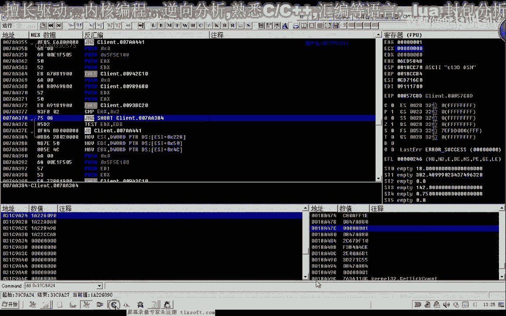

# 郁金香老师C／C++纯干货 - P50：061-存仓库CALL参数分析测试 - 教到你会 - BV1DS4y1n7qF

大家好，我是郁金香老师，欢迎大家参加郁金香技术编程培训，那么上一节课呢我们已经分析了一些纯仓库的这个功能的一些数据啊，那么以及参数呃，那么这节课呢我们再来对他的一个相关的机制进行一下分析。

也就是ecx这个参数e d i它的一个来源，那么如果我们分析到这个参数的话，实际上那么前面的1b x和啊，这个ecx我一dx的数据的话，就直接可以通过它的偏移来来获取。

那么只有这个下标呢它是一个唯一的参数，相当于那么实际上这一个e4 x或e dx呢，它的来源的话都是来源于e d i加上这个偏移，而这个扩的话，实际上我们在前面的物品使用的库里面的话，就见到过这两个偏移。

那么我们再来回顾一下，呃物品使用的这个空，那么当时我们分析的物品使用库，它也有这两个偏移，那么也是瑞士啊，所在的代码段的话也是在这个附近的，但是呢它调用的库不一样，7203908。

那么这里是720a20 ，但是前面的这几个参数的话，它的形式也都是类似的，当时我们分析的时候的话，也是呢前面这里呢是参数，这里呢一个是16081b0 d8 e x e4 x也是来源于这两个偏移。

那么这里呢他也是啊，当时我们这个这里是背包的一个机子啊，但是呢这是我们不凭使用的这个空，那么今天我们的这个扩的话，那么这个参数的话有可能的话也是一个背包的一个机子，那么我们先来分析一下。

用o d先加载到我们的游戏里面。

先打开游戏。

那么先附加到我们的游戏里面。

那么首先我们先在背包里面进行一下移动啊，移动到比如说任意一个呃，让它断下，让我们上一节课所分析的这个地方。

先转到ca a2 e这个地方，转到之后呢，我们进行一个下段，然后呢我们先在背包里边啊移动，那么这个时候呢我们发现在背包移动的时候呢，它也会断一下啊，因为我们上一节课分析了。

那么这个呢是一个呃物品移动的入口，那么只是说可以用通过这个物品的移动课呢，来实现一个成仓库和嗯移动到我们的这个技能栏这一类的操纵，那么它在一移动的同时呢，我们看一下它的ecx的参数是多少。

嗯ec x当时我们说它是一个背包的一个机子，那么我们先把这个数据来记录一下，那么我们这次那么有可能这个就是背包的机子，那么我们看一下现在背包的机子是多少，最新的背包机制，那么是这个数字。

嗯嗯，那么我们可以可以看到啊，这个背包机子这里成的这个对象呢的确就是这个对象啊，那么也就是说，这个对象的加上我们的，410偏移，这就是我们背包的第一个，那么它加上5c，这里呢就是它的一个名字。

那么说如果我们换成仓库的话，它会不会这个地方就是我们仓库的一个呃相关的一个对象呢，那么我们在这里呢也跟他下一个断点，那么我们就在仓库里面啊移动一个数据，那么取出来或者是什么的啊。

那么我们先在仓库里边啊移动一下，那么这个时候e c a x的e d i的这个数值我们要看啊，因为我们执行一步之后呢，才会变成e c x好，那么我们看一下这个时候e4 x e d i的数字呢都是6090。

那么我们找一下这个数字的一个来源，先打开我们的c一附加到六七点，选16进制，那么这个时候呢我们会收到两个地方，那么一个人是，31c9 a24 ，那么另外一个呢是这个i d里面的啊。

那么我们在游戏里面再搜索一下这两个常量，我先下一个段，然后再搜索所有的常量，那么这个时候呢我们可以搜索出很多很多的地址啊。

但是呢我们任意的拿一个地址先来做一下示例，比如说我们这个地区，那么我们替换掉前面的这个背包的机制，因为我们发现的话，但凡是这种背包的这种数据，无论是我们的技能栏背包还是我们的啊物品背包。

以及我们嗯其他的这些背包的话，还有就是我们动作的这些背包呢，好像它都有一个410的偏移，那么我们也可以把这个410的偏移来加上去试一下，那么这个时候呢它会显示是皮革啊，恰好是他的第二个。

第二个呢是一个金刚石，那么我们选下标一啊，这个时候呢金刚石全部气功等级二，增加它的属性也在里面，那么第三个呢是一个青玉珠，那么说明我们找到的这个地方的话，它就是我们的一个呃仓库的一个背包的一个机制。

那么我们顺便也把它记录一下，那么同时呢把它的公式我们也记录一下，好的我们也把它复制在我们的后边。

那么我们看一下这个仓库对象，它的一个属性是什么。

那么它的属性呢是ea，那么背包的话，这里呢也是1a，那么它都是背包里面的，只是呢这个是仓库的一个背包，我就把它放在这里边嗯，这是仓库背包的一个机制，怎，么，那么或者我们取存仓库列表和背包列表的话。

这样来便于我们的一个区分好的保存好之后呢。

我们关掉，那么我们再退回到我们之前的这个地址，那么现在的话我们大致知道了嗯，它的一个对象啊，哈哈，那么这个690的话是我们的仓库背包，这个是我们的背包，那这个呢是仓库列表，那么我们再来做一下试炼。

那么如果我们是乘务频道，背包里面，我们看一下他用的是哪一个机子，那么我们这个时候呢我们发现的话啊，把这个数值也是八零，那么实际上这个的话我们可以把它啊射程e也可以，因为它会自动的调整，这个时候移动。

那么我们看一下ec x的值的话，我们存到仓库的话，呃，移动到啊，那么这个e4 x的话，我们要存到仓库来，那么这里就是嗯仓库的一个机制，那么这个一是x的话，我们就可以这样的倍数，这是我们的目的地列表机制。

那么如果目的地是我们的背包的背包的话，那么呢嗯这个机子呢就是背包，如果我们的目的地是仓库呢，这个地方呢就是仓库，那么另外呢它两个参数的话都是来源于我们背包机制的一个1608。

以及一个1b d0 的一个地方，好的，那么有了这些数据的话，我们就可以了，把这个呃地方呢把这个扣啊重新的整理一下。

那么我们就可以了，第一个是，把这前面的代码我们可以直接把它抄下来，当然在抄这段这段代码之前呢，我们还有还有一点要做啊，就是要把他的机子给它加加上，仓库的这个，two two two。

那么另外的话这里呢我们就可以直接仿照他的来复习就行，第一个坐标呢我们陈仓库里面的话，我们直接呃嗯复习一就可以，任意的字都可以，实际上只要不超出它下边的范围，应该都是可以的。

那么第二个数字呢就是我们的ec x，第三个数字的人就是一tx啊，那么这样的话我们呢也要方便一些，我们可以少少用两个场面啊，因为这个偏移里面呢它自动的就代表了一个目的地的一个类别。

那么最后呢我们这里呢用e c x一加照着写就行，最后调用这个库，当然我们说了，他也有一个前提啊，那么有一个前提呢，就是要先选中我们的这个物品，那么选中物品的这一部分的话，之前我们已经有过这个分析。

那么我们再来看一下移动技能相关的这个机制，啊这个drops scary这里了，当时的话我们有对它相关的一个参数进行一个分析，放置技能，这，也是另外一个，我这里有一个选中物品的这个机子，那么就是这个地方。

那么当时选中技能的话，大概是在这个位置，7a a372 ，那么我们再转到这个地址看一下，但是呢这个地址的代码呢它已经发生了一些变化啊。

这个时候我们可以看到，那么发生了变化的话，我们先搜一下它的一个特征吧，游戏行。

有更新的啊，那么选中我们的大数据，然后这里可写呢，我们把它去掉。

那么我们重新再搜索一下，那么这个时候已经变成7a2 f。

那我们改一下2f1 。

那么收到帖子帖子码之后呢，我们可以看到这里呢直接写入我们的ex就行了，那么写入到这个地方，那么实际上它要选中的话，就是我们啊我们要存到仓库的话，就是选中背包里面的一个物品好。

那么这一点的话我们用代码来实现呢，呃用户从汇编的话相对要麻烦一些啊，那么写好了之后呢，这里呢它还有一个往这里写了一个东西，那么这段代码的话应该就是要嗯选中某个对象啊，并且显示出来啊。

那么在这里的话它传到了b i呢，是他的机子1b x是它的一个下标，那么实际上我们也只需要把这一段代码的话啊，复制一下就可以了，那么选中对象的话。

这里呢我们最好呢还是把它整理在哈相应的这个单元里选中或评测，那么这段代码呢我们可以啊，直接也把它照抄下，那么后面呢这几句呢都是一个读取数据的啊，没有写入数据，那么你们来上来说的话。

对于我们来说的话就没有必要了，那么我们所需要的就是前面的这一段呢写入的这个数据啊，需要写一个数据，因为读取数据的话，它是为了后后边的这个一个比较判断，这里为了一个相应的一个跳转。

那么所以说我们要需要的呢就是前面这些主要是写入的这一段，那我写入的这一段呢，我们还有一个e d i或e bx呢，需要给它赋予一个初值，那么这个eb x就是我们背包的一个下标啊。

那么背包的某个物品我们要选中它，那么这里呢应该就是我们背包的这个机子啊，那么我们先在这里看一下我们现在背包的机制是多少，那么我们看一下这个背包机制还可不可以用啊，嗯，那我们看一下背包的第一个。

在进到游戏里面看一下，那么看来的话是可以用的，那么我们再看一下第三个是不是相应的幸运符啊，那么证明这个机子是可以用的，那么我们把这个机子呢把它复制出来，选中物品这方，那么di的这个数值我们把它写好了。

那么另外还有一个e bx蓝色背包的一个下标，那么我们也需要把它写好，那么我们就写它的第一个，第一个就是零，那么这就是我们的选中哈物品，那么我们先来测试一下选中物品的这一个啊，第一步。

那么现在我们是没有选中的，那么首先呢我们用代码注入器啊，把我们这段代码复制进去，那么我们再做一下最后的检测，那么看有没有相应的计算器没有初始化的，那么用到的嗯，一个是e d i初始化了。

e bx呢也初始化了，那么后边的话这些呢都是另外的一个曲子，就用不着还管它了，呃那么注入到一部戏里面，好的我们运行一下代码，那么这个时候的话我们发现呢他就选择选中了第一个的这个物品啊。

那么我们把断点呢取消掉，那么如果我们要选中这是第七个的这个物品啊，那么我们要选中它的话，我们改变一下它的下标试一下，那么现在移移动过来了，这个鼠标下面的图片呢没有变，那么在移动过来我们发现呢。

这个时候就选中了第八个的这个相应的金刚石，那么如果我们要选中这个含义时的话，回避是十这个的话，那么我们这里下标可以选，那么移动到第二个思想，但是这个时候呢我们发现移动的时候好像还有一点问题不能够移动。

你这样搞，本来这个时候就是不能够移动的，因为我们打开了仓库，如果没有打开仓库的话，应该说可以移动，那么这个时候呢我们可以把它放到第二个啊，那么如果是没有物品的话，可能还会出错啊。

那么这个下去之后我们再做测试，那么第四个的物品的话，我们也可以做一下尝试，第四个是这个幸运符，那么我们移动到啊，第二个好的，那么移动的这段代码呢，我们已经呢就是选中物品的这段代码呢，我们已经把它写好了。

那么如果是要选中仓库的这个物品栏，也应该可以用类似的一个办法，好，嗯，嗯嗯，那么我们的第一步已经实现了，第二步呢就是调用我们的移动的这个扣，那么移动的扣我们放在下边，再来看一下我们移动的相关的一个参数。

那么这是移动到我们的仓库的这个代码，那么这个下边的话它是可以为一个呃，零到下边的一个最大值应该是都可以的，因为在城仓库的时候，他的目的地的一个呃这个下标的地址的话，它是会自动调整的。

那么我们把这段代码你复制一下，那么复制到里边啊，那么理论上来说，执行完上面的这个代码之后呢，我们就会把背包里面的某一个物品的存放到我们仓库里面，那么我们再来做一下测试啊，打开我们的仓库。

那么这个时候我们把第一个的这个物品存进去，啊哈，好的，那么这个时候成功了，如果我们把第二个的物品存存到这个仓库里面去，那么从第三格的物品，那么这是第五格的物品，嗯那么这第五格的话啊。

我们应该是存的是第六格哈，第五格的话，这里呢下标是四啊，所以说的话我们在纯仓库的时候呢，我们要做一些判断啊，看它相应的个相应的背包里边是不是有这个对象存在啊，如果是不存在的话。

我们这样把它放进去的话就会出错，好的，那么我们把这个代码呢嗯存一下档，那么下一节课的时候呢，我们把它整理成我们的一个代码啊，存仓库的，那么在这段代码的功能呢，就是，把背包里的，作品也是移动到仓库仓库啊。

那么是通过这个下标来移动的，它只有一个参数法，就是这个下标，那么其他的这些都是常量，但是呢在这种存仓库的方式呢，它有一些弊端啊，就是呢他还需要先打开我们的npc，然后再打开仓库之后。

他才可以做这些相应的动作啊，那么我们在后面的课程里边呢，一步一步的来完善这些啊，那么有时间的时候呢，大家也可以分析一下存仓库，一这个库看调用它来存放到我们仓库里面的时候嗯，会是怎样的一种形式啊。

需要是不是会更加的简单一些，那么这节课呢我们先到这里，那么下一节课呢我们封装相应的测试代码写成，把我们的这段代码写成我们的呃函数，好的，那么我们下一节课了再见，好，这个应该是一个分类的一个编号啊。

嗯仓库的时候好像是八，背包的时候好像是一啊，在背包里面启动的时，那这是一个背包的机制，那么这个呢是仓库的介质啊，这个是最高的介质，这个是仓库列表气质，好的，我们下节课再见。

那么这节课的作业呢就是把这段代码了，大家自己把它呃，用c语言啊，把它编写成一个啊相关的一个函数，好的。

