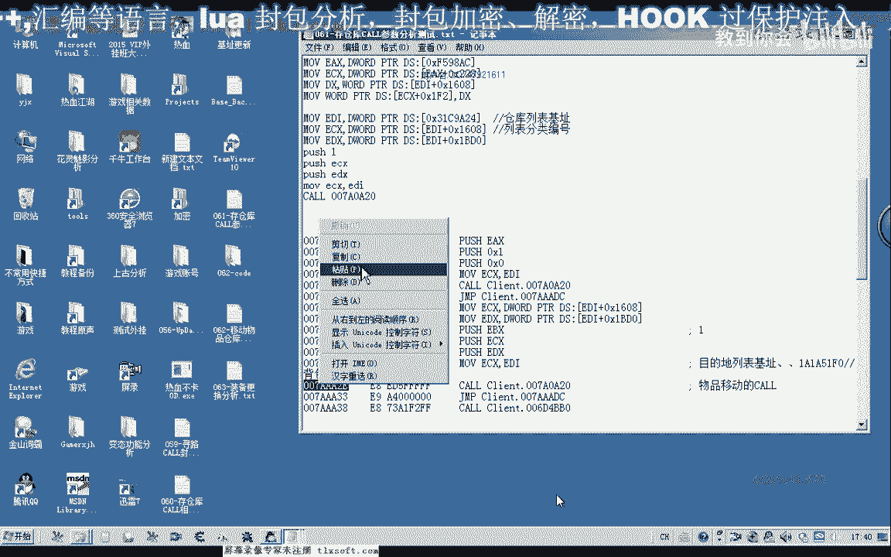
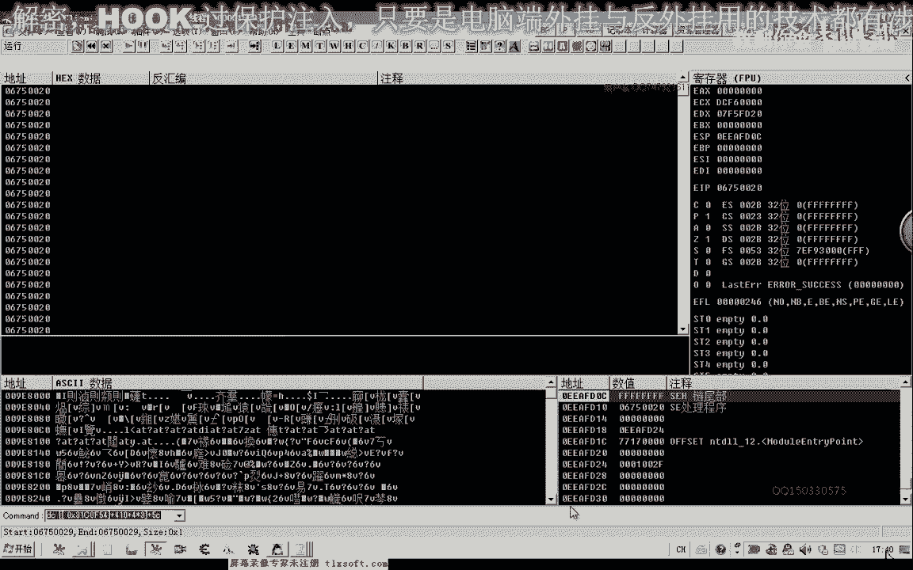
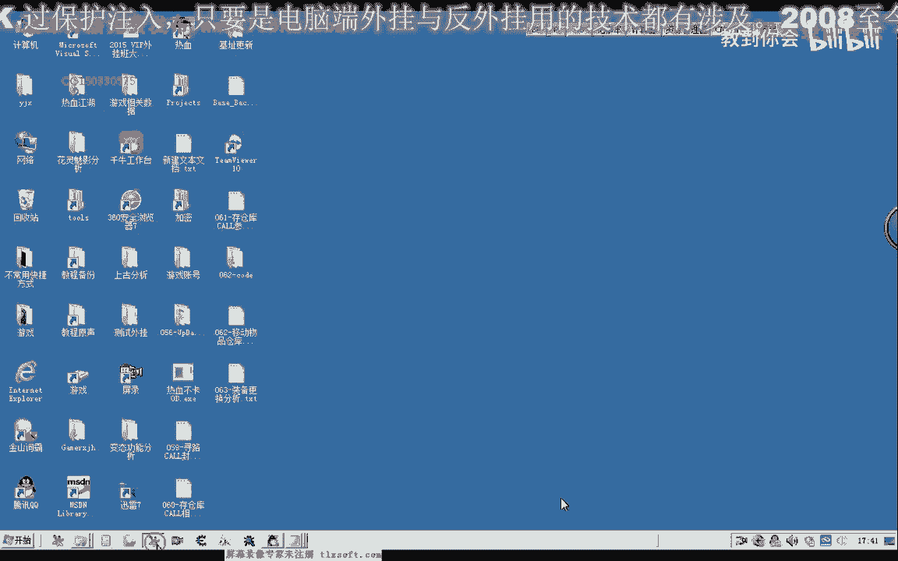
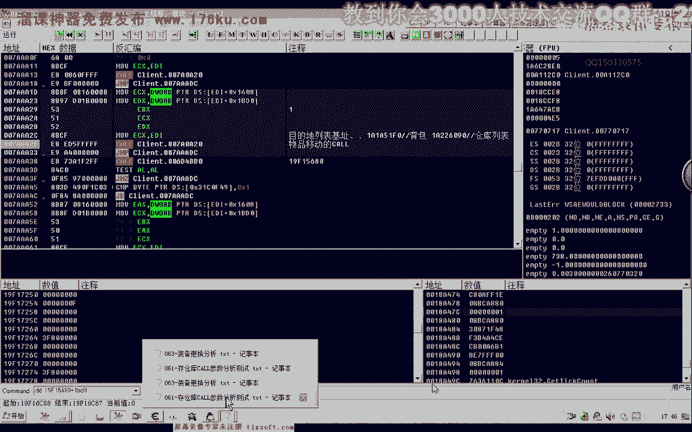
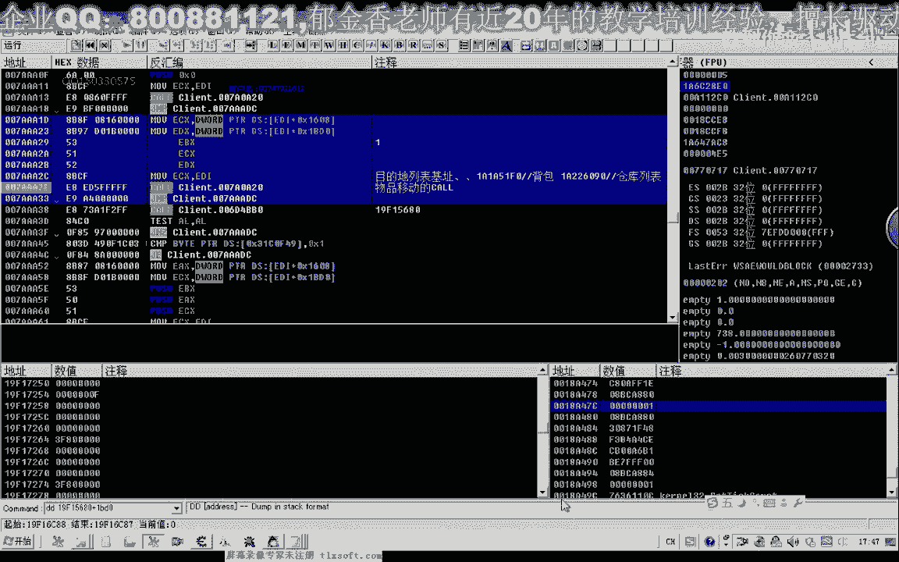
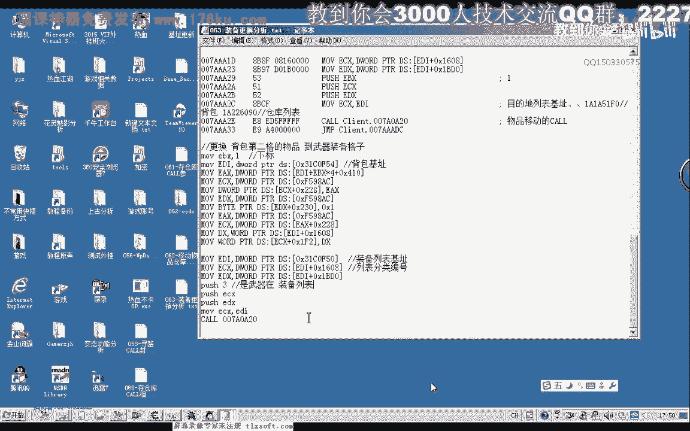

# P52：063-装备更换功能分析 - 教到你会 - BV1DS4y1n7qF

大家好，我是玉溪香老师，前面的几课呢我们分析了移动物品的这个库，那么这节课呢我们在他前面几节课的一个基础上来分析呃，更换我们装备的这个库，那么比如说我们要上一个装备武器到这个地方。

那那么实际上呢它也是从这个背包里边的移动，我们的这个对象到这个装备的这个列表里边，那么可能有可能的话它是调用的同一个库啊，所以说我们可以接着上一节课呃的这些数据来继续的进行一个分析。

我们打开第61课的相关的这个代码，那么我们在相应的这个扣嗯，这个地方我们进行一个下段先进行尝试。

那么我们先打开d附加到游戏里面。

那么在这个物品移动的这个库呢，这里我们进行下段，那么因为我们更换装备的时候的话，它也是一个物品的一个移动，那么可能会在这个地方断下，那么这个时候我们看它一点也断下啊，从这个地方那么断下之后呢。

我们看一下现在的e4 x是680啊，那么我们记录一下这个ex的一个数字，那么并且呢我们看一下它是不是一个相关的一个数据，加上我们的410加上c你们看一下。

那么这个时候呢我们发现了他的第一格的话是一个地藏枪一，那么第一个呢他应该是中间这个位置是他的第一个这个数组啊，因为它的格式的话，这个对象的格式基本上都是一样的，它都是用相关的一个偏移。

410这个偏移来表示的啊，背包仓库嗯，还有我们的装备以及我们的快捷栏里，那么我们再来看一下第二个它是在什么地方，那么第二可能是一个理应副手啊，防御八防八防八，这是它的几个属性的一个增加啊。

是这个领域的一个副手，那么我们看第四第三个是什么啊，也是零命，不是啊，他是这样来的，那么第四个呢才是我们的武器啊，坐标为三，这个地方啊，那么我们知道这些的话下标，那么更换武器的这个下标呢。

这里就应该是数值就是为三，那么我们再来看一下下段，那么这个时候呢我们发现了下标四三，后面这两个呢它数值都是零，而这个数字呢它来源于我们的这个装备列表的这个偏移，加上我们的1608这个地方它是零。

那么还有一个地方来源于我们的yb d0 ，那么这两个地方都是零，所以说这两个参数呢它是零，那么这里呢是我们要更换的装备的一个下标值，但是这个参数我们必须得传进去了，他跟我们这个移动到仓库的时候不一样。

那么移动到仓库的时候呢，我们这个值呢它可以自动的进行一个调整好的，那我知道了这么多之后呢，我们接下来呢可以找一下他相关的一个机制，那么我们首先也是用c a一来搜一下。

那么这个时候呢也是搜出两个机子，那么一个机子应该是我们所有对象列表里面呃，那个数组里面的，另外一个呢才是我们真实的这个装备列表的一个机制的指针，那么我们对它进行一下修改，然后呢到og里面进行搜索。

那么这个时候来找出来的这个数字呢，就是我们的机子他用到的地方呢也非常的多啊，我们选第一个在这个地方，嗯然后呢我们把它复制下来，这里注意一下，是我们的装备，这个贴纸，好然后我们进行一下复制。

那么第二个因为第一个找到的话，第二个的话这个呢可能就是我们的所有列表的这个建机制，所有对象的，那么我们也可以搜一下，那么这个的话就搜不到啊，呃因为它是所有对象列表里面的哈，这个虽然说搜出来。

因为我们c e里面搜出来这个是绿色的话，实际上它是在数据段，所以说它这里呢它就会显示是绿色啊，也就是我们平时看到的这个d e s这个前缀所标示的这一段，那么即使它没有这样一个变量，它也会显示嗯。

从这个绿色的在c里面，好的，那么我们接下来来进行一下相关的测试，那么按减号哈退回来，那么同样的这个地方呢它也可以更换我们的装备，哈哈哈，那么我们看一下啊应该怎么写。

那么首先呢我们把前面几句啊可以照抄下来，就可以，那么实际上我们可以在前面的基础上进行修改就行了，在我们上一节课62课里边写的这个代码里面。

移动的这个代码，把这段代码在他的基础上进行一下修改，那么就很好完成，61课啊，我们来看一下61克的这个代码，这里呢没有用我们的替换掉，方便我们测试，那么只是这个地址呢我们需要呃哦仓库列表。

它的一个机制呢我们需要更改一下，应该为我们装备啊等一个地址，那么后边的话这里呢我们如果是武器的话，它的下标是三就行，那么这里呢我们是需要更换我们武器，它所放在的呃，所放置的相应格子，那么我们也选一。

那么也就是第二个，那么我们现在接触到这个地方，放置我们的服务器，那我们再来看一下第二格的武器，那么我们要用我们的代码输入器来进行相关的测试，这，怎么会。

那么这个时候呢我们发现呢它就可以来更换我们的这个武器装备哈，那么这个时候呢我们有的时候呢在编写我们的程序的时候呢，也需要用到这个功能，那么这节课呢我们的分析呢就到这里。

那么下一节课呢我们对这个装备更换的呃代码来进行一个相应的封装，那么大家呢也可以把它当成是一个坐垫啊，下去之后呢进行一下，完完成，哈哈哈，哈哈哈哈哈，嗯。

好的。