# 郁金香老师C／C++纯干货 - P53：064-封装更换装备代码 - 教到你会 - BV1DS4y1n7qF

大家好，我是喻吉祥老師，那麼前面的幾個我們已經對更換裝備的相關數據來進行分析，那麼這幾個我們主要是對更換裝備的功能進行一個封裝。

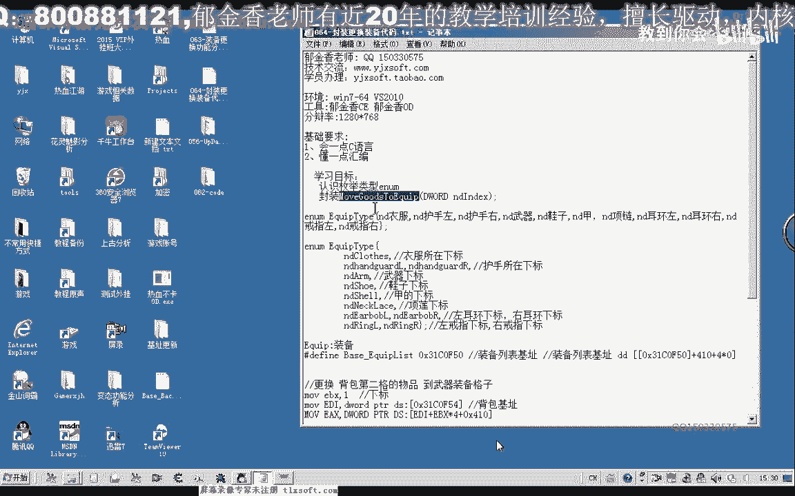

那麼在封裝之前，我們要來了解一下裝備列表，那麼裝備列表的話，我們在更換武器的時候我們就必須要放在，武器的下標裏面才可以，那麼我們在傳遞下標的時候就要注意，那麼下標的話就必須是武器的下標才可以。

那麼如果我們要更換的是副手，那麼也要獲得副手相應位置的下標，那麼才可以，而不是說隨意的像我們存放倉庫一樣，隨意的傳遞一個下標進去就可以，那麼所以說這個時候我們需要打開OD，來先取得相應位置的一個下標。

那麼我們看起來的話，武器的位置它位於的所有裝備列表的左上角。

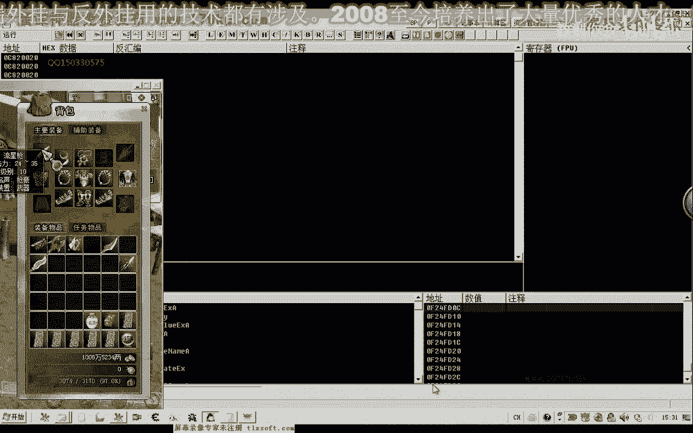

那麼可能它的下標是0，但是我們還是要來進行一下測試。

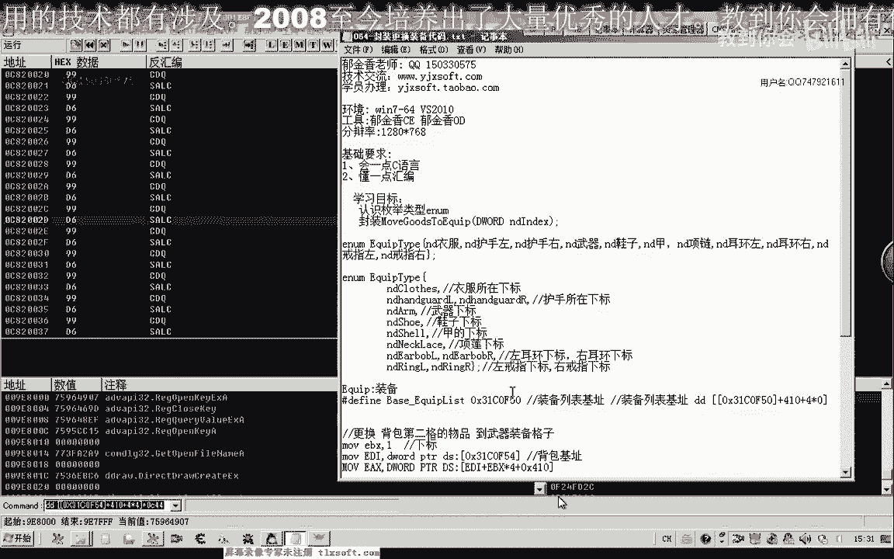

那麼我們用DC來顯示一下它的名字，我們就能夠看出來，加5C偏移這個地方。

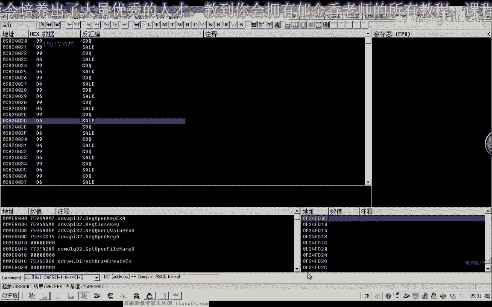

但是我們可以看到下標為0這個位置，它是衣服，那麼這個時候我們可以來定義成紅，把衣服相關的地方的紅定義為0，那麼第二個我們看一下是副手，那麼副手有兩個，我們看一下究竟是某一個副手，那麼這個時候我們發現是。

那麼下標為1的時候是左邊的副手，那麼所以說我們在這裡定義的時候，我們可以分別是第一個下標是衣服，第二個是副手左，副手右，然後第三個下標，這裡為3的時候是武器，也就是流星槍，這個是武器。

那麼我們換一個上去，這個是武器，那麼所以說的定義的時候，我們可以直接定義成紅的形式，那麼還有一種更簡單的方式，我們就是定義成每一局類型的長量，把它定義成每一局類型的一個長量，這樣也可以來使用。

那麼我們可以來先認識一下每一局類型，簡單的做一下介紹。

那麼我們隨便定義一個每一局的一個類型，那麼後邊就是它的一個長量，它的長量如果我們沒有指定的話，它就會從0開始編號，比如說我們隨便寫一個ID1、ID2、ID3，那麼這個時候我們可以打印出這些長量的值。

它就是012這個數字，那麼實際上它本身的一個每一局類型，它也是就是一個整數的一個序列，那麼這個時候我們看到它實際上就是012這幾個數字。

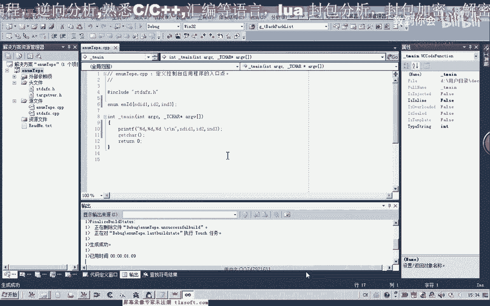

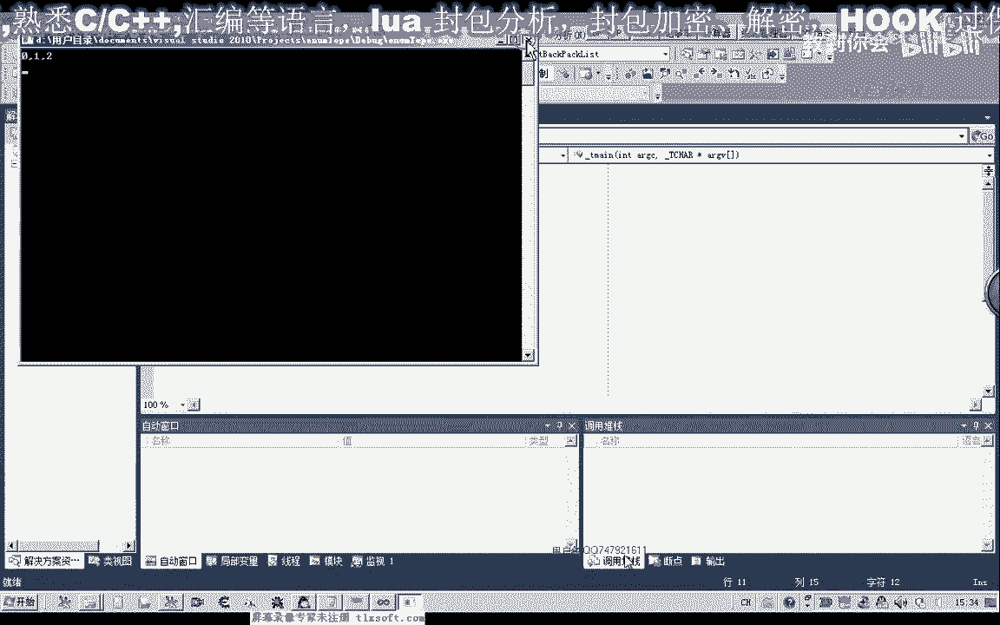

那麼同樣的，如果我們的相應的數值表示我們相應武器和裝備的，下標的值，我們也可以把它定義成每一局類型，那麼定義成這兩種形式都是可以的，那麼實際上它都代表同樣的值，那麼這個放在第一個位置的它代表的是0。

第二個位置1、2、3、4，那麼這樣我們就可以用這種符號的這種長量來替代我們的下標，可以使我們的程序更具有一個可讀性，當然你也可以直接傳012，比如說我們更換武器的時候。

你也可以直接傳長量3進去也是一樣的，但是我們的威懾++它對我們的中文的一個提示不是很完善，所以說我們還是建議用英文的，或者是用拼音都是可以的，那麼首先我們打開第62課的代碼，那麼首先我們添加相關的武器。

裝備的機制，然後我們再添加相應的一個函數，展開我們的結構單元，你到我們的背包列表裏面，之前我們是封裝的移動到倉庫的某一個，那麼在這裏我們改一下，把它改為裝備，那麼實際上我們也是要移動到裝備列表的某一格。

但是由於我們的某一格的話，如果我們單純的用數字來表示的話，代碼的可讀性不是很高，那麼所以說在這裏我們也用剛才所認識的，每一局的類型，那麼在結構的前面我們給它添加每一局的類型，那麼表示衣服所在的下標。

表示武器所在的一個下標，那麼今天我們就以武器這個為例，等會來進行相應的一個測試，然後我們把函數來複製一下，轉到我們移動到倉庫的後邊，那麼首先我們把在前面的代碼移動到我們倉庫的代碼，我們把它複製一下。

因為它的核心代碼都是一樣的，那麼複製下來之後，我們要改動的就是這個Base，這裏，那麼這裏我們需要改為我們裝備的一個機制，那麼還有這個地方我們需要改動一下，上一期我們忘了改動，同樣的在上邊這裏。

我們也需要傳進來的是它的一個下標，那麼代表放在了某一格，那麼武器的話，這裏我們肯定要傳入到下標就是3，好的，那麼我們接下來進行一下測試，轉到我們的測試單元，那麼在這裏我們看一下，把它放在第三格，狼牙槍。

我們把它更換上去，第三格的話，第四格下標是為3，然後在選中第三格，然後在這裏的話，我們是要移動到我們的裝備列表，那麼在這裏，我們就直接用我們的NPM，全機變量，背包，用這個，數字來代表3。

當然這裏它的效果與我們直接傳，長量3的效果是一樣的，實際上在編譯的時候，它也會自動的就用3這個長量來替換它，只是我們這樣來它的一個可讀性的話，要高一些，這個就是武器的一個所在裝備列表裏面的一個下標。

好的，那麼我們把它編譯一下，那麼在說明的時候，我們把這裏的後面的複製核心數字刪掉，只需要在說明的時候，給它進行一個默認值就可以了，好。

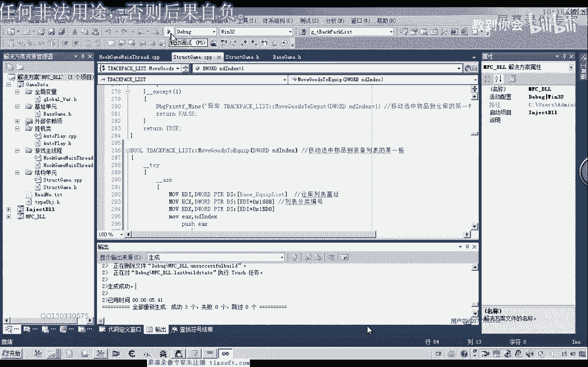

然後我們開始進行測試，那麼這個時候。

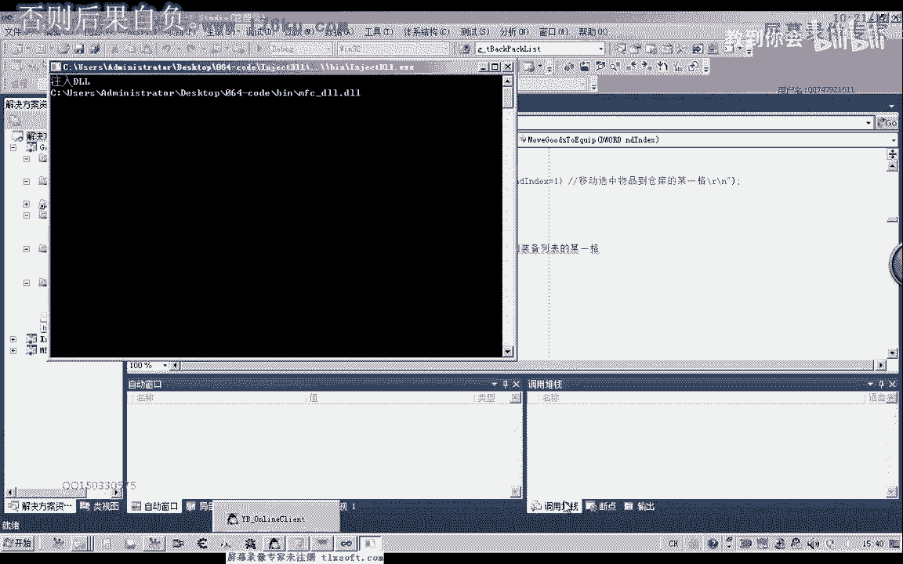

由於我們Od附加到了遊戲裏面，那麼所以說它輸入會慢一些，掛機到主線程，然後測試，那麼這個時候我們發現的話，它就能夠把狼牙槍換上去了，實際上它會把背包裏面的第四個裝備換到上面，但是這個必須是武器。

如果是其他的裝備的話，這樣的話就換不上去，好的，那麼這個時候我們測試成功的，那麼測試成功了之後，我們再對它進行一下相應的改進，那麼我們比如說我們的更換武器，更換衣服，更換我們的副手左，副手右。

那麼這些我們可以再單獨的把它封裝成一個函數，更換裝備，那麼比如說我們更換武器裝備，那麼後邊的話，我們在這裏，我們就把它改一下，就改成我們的背包裏面的一個名字，裝備的一個名字。

我們要把背包裏面的某一個裝備，然後更換到我們的武器在欄上面，那麼我們可以這樣的封裝這個函數，那麼其他的封裝就當成是一個座列，大家下去之後對它進行一下相應的封裝，那麼我們在移動到武器的後邊。

我們再來添加一個這樣的函數，那麼首先我們要做的函數，就是要取得裝備名，它在背包裏面的一個下標，那麼這個的話，我們之前有封裝函數，GetGoodIndexFlip，那麼我們直接用這個函數就可以了。

那麼獲取裝備名在背包裏面的下標，那麼獲取這個下標之後，我們再調用的我們的選中，選中這個物品，當然我們還要做一個判斷，那麼因為這個它傳回來的一個值的話，是整形的，那麼如果它傳回來的數值，如果是<0的話。

那麼如果這個值<0的話，那麼我們就直接去看，就調用Spark，那麼如果這個返回值大於0的時候，我們再執行後面的代碼，那麼我們首先來選中，那麼選中了之後，我們再調用之前的一個代碼，那麼我們替換哪一個。

就把我們的MDM傳進去，那麼替換的是第三個裝備裏面的，我們替換的是武器，好了，那麼我們再來測試一下，那麼在這裏的時候，我們就可以直接的移到我們的主現成單元，進行一下代碼的修改。

那麼這前面的這一行就注釋掉，然後把我們的武器的名字傳進去。

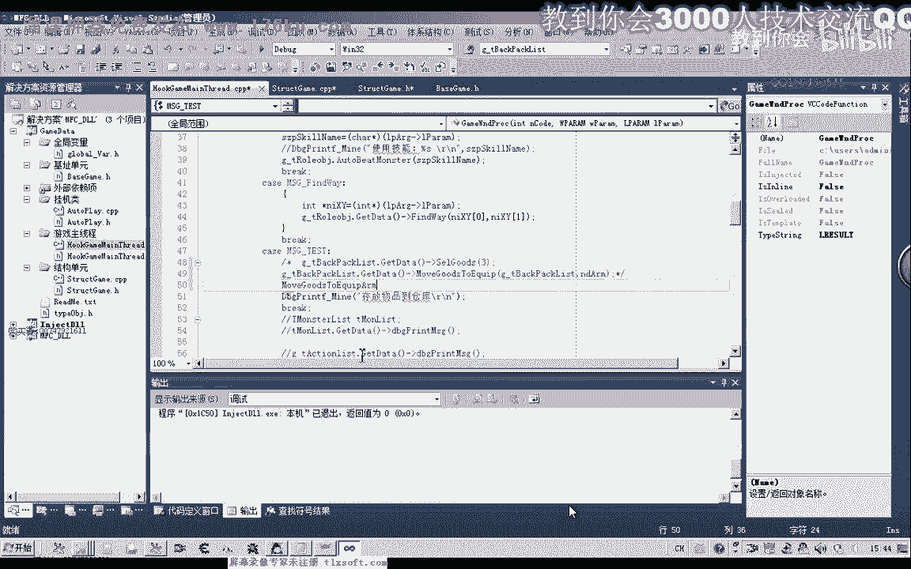

那麼我們看一下，我們就以狼牙槍為例，好的，那麼我們進行一下測試，編輯，這個時候我們可以退出OD，這樣我們注入的時候。

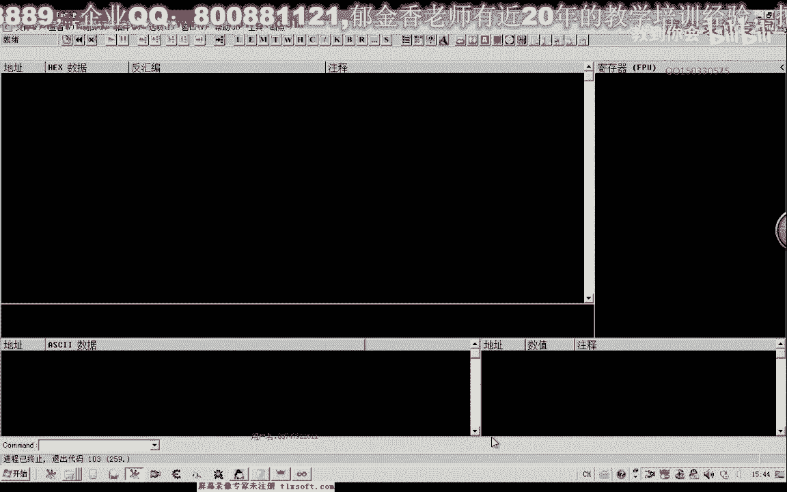

速度會快一些，掛接到主現成，然後我們看一下遊戲裏面進行測試，那麼這個時候它能夠測試成功，我們再把它移下來，再進行一下測試，都是可以的，但是這個時候我們發現移動到後面某一格的時候，我們測試都不成功了。

那麼可能是在訪問這一格的時候，我們沒有做一下相應的一個判斷，可能造成了異常，因為這裏是一個空的對象，那麼我們來看一下，如果是出現異常的話，在哪一個地方容易出現，因為後面這兩個我們都是測試過的。

如果出現異常的話，應該是獲取這個名字，這裏面比較容易出現，那麼在比較名字的時候，我們對它相應的對象沒有進行一個判斷，那麼在這裏我們加上一個判斷的語句，那麼如果它沒有對象的話，我們先來看一下。

在GOTY的時候，它是怎樣進行複製的，那麼在這前邊，我們來看一下，GOTY。那麼在這裏，我們對數量進行了一個零的複製，那麼如果，那麼實際上我們可以對整個列表進行一個初始化，在進行複製之前，那麼在前面。

我們進行一個初始化就可以了，那麼在這個地方，我們就用不著做相應的一個判斷，直接contain就行了，那麼所有的結構裏面全部都清零了，那麼我們現在我們做判斷的時候的話，就很好判斷。

那麼我們再回到更換武器的函數，獲取我們的下標，然後在這個位置的話，我們就直接來判斷它的一個名字，那麼如果它的名字為空的話，是一個空指針的話，那麼我們這裏就繼續進行一個，下一次的一個循環，好的。

那麼我們再重新把它編譯一下，對了，這個時候我們還需要一個返回值，那麼我們直接用它的返回值就可以了，移動裝備，好，生成之後，我們再一次進行測試，掛接到主線程，然後測試，那麼這個時候我們無論放在任意格的話。

我們都能夠把相應的武器把它替換上去，好的，那麼這節課我們就講到這裏，那麼我們下一期課再見，那麼如果出現了剛才的這種錯誤，如果我們是猜不到，它所出現錯誤的原因是在這個函數裏面。

我們可以在前面打印我們相應的一個調試信息，那麼我們可以做一些相應的標記，然後在它的後邊也做一些標記，那麼直到每一個地方我們都做一些標記，看它究竟執行到某個地方，那麼我們再去定位它出現錯誤的代碼。

那麼也是一種方法，好的，那麼我們這節課就講到這裏，下一節課再見，那麼這節課也留了一些作例給大家，那麼這個作例的話，我們就是來自己封裝一下，更換我們其他的這些裝備的一個函數。

比如說更換我們的左邊的一個介質，更換我們的副手左邊的，比如說更換我們的項鍊，或者是我們的靴子這一類的，當然這裏都已經把相應的下標已經定義好了，那麼大家有條件的話就下去了，測試一下，編寫一下相應的代碼。

那麼我們代碼的話是要多寫多念，好的，那麼我們下一節課再見，如果遇到什麽問題的話，可以發帖到論壇。

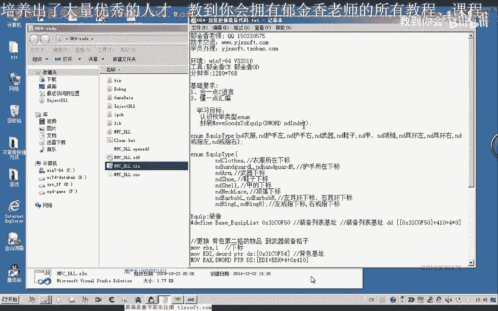

也可以直接留言到我的QQ裏面，請不吝點贊訂閱轉發打賞支持明鏡與點點欄目。