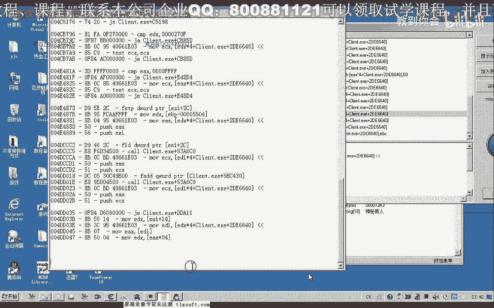
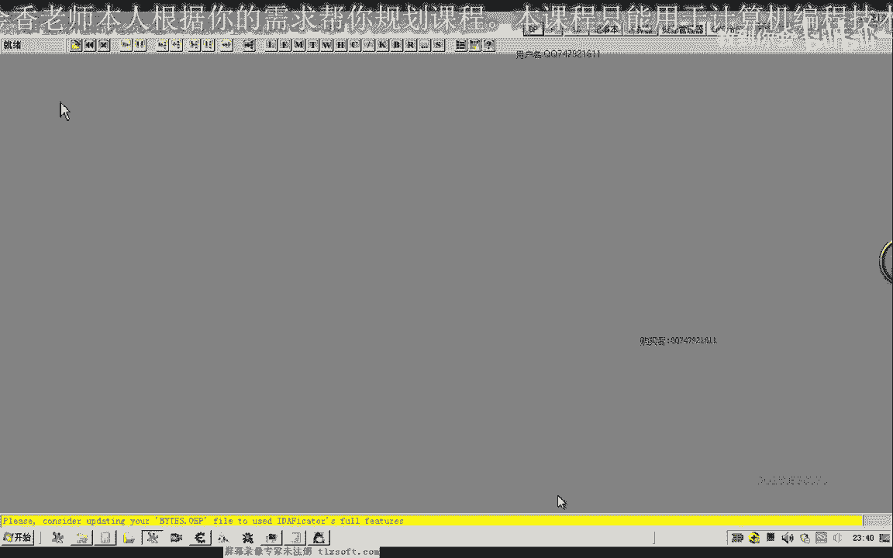
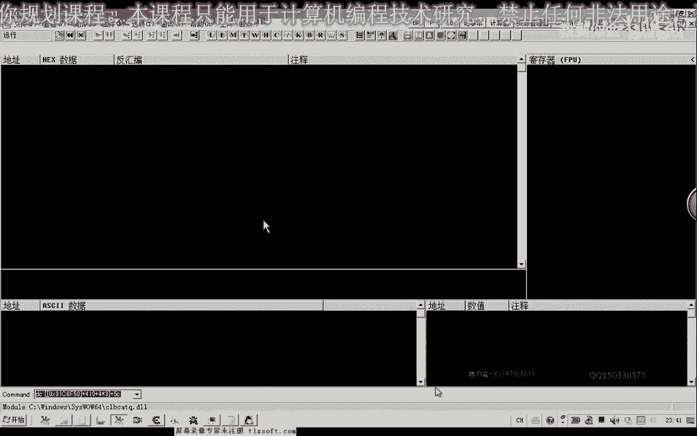
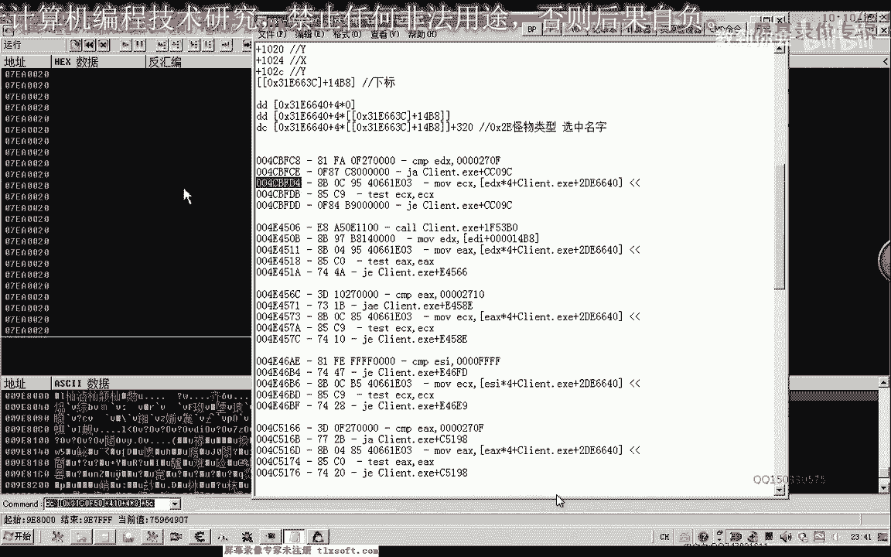
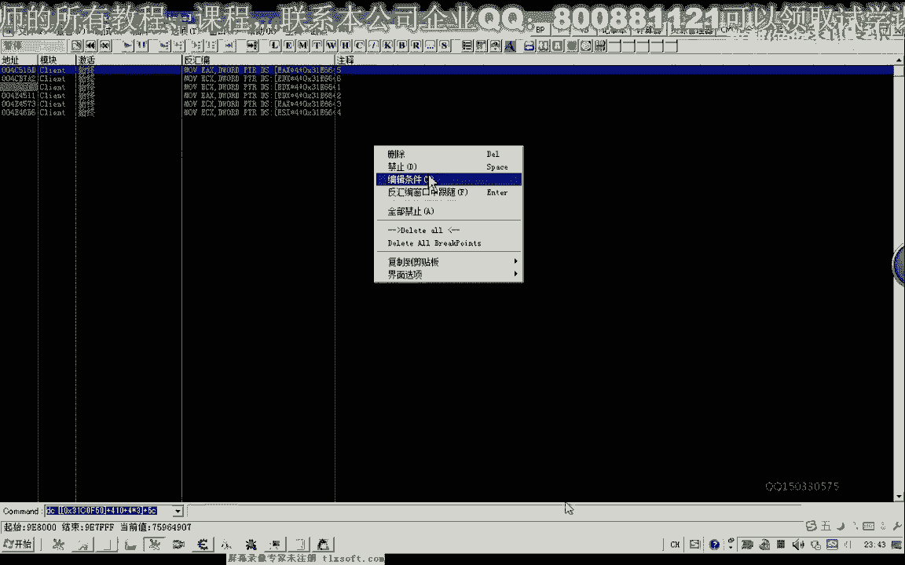
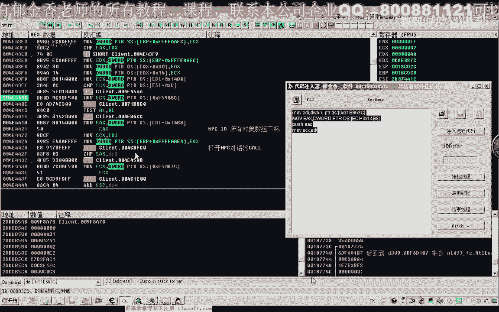
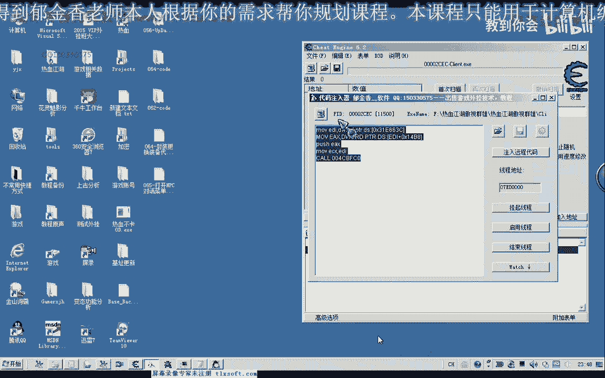
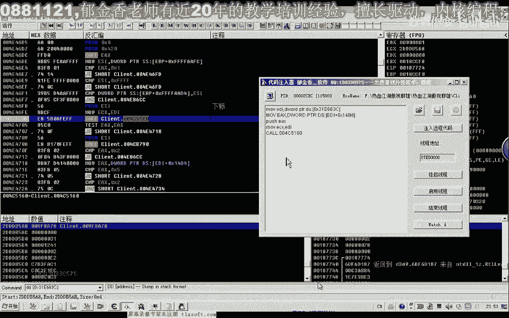
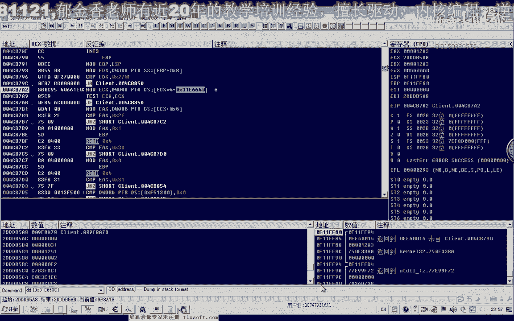
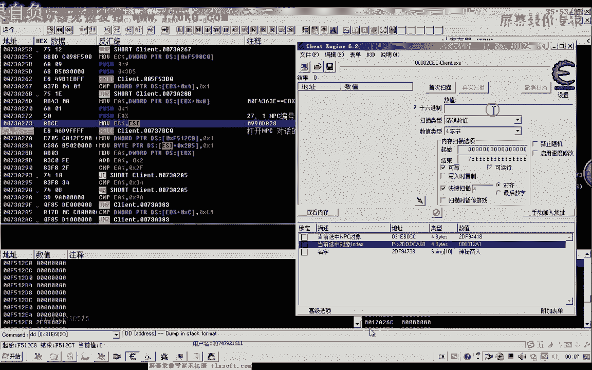

# 郁金香老师C／C++纯干货 - P54：065-打开NPC 对话菜单 - 教到你会 - BV1DS4y1n7qF

大家好，我是郁金香老师，那么这节课呢我们一起来分析一下啊，打开npc对话的相关的一个功能，那么首先呢我们在打开m p c之前呢，我们需要选中这个对象，或者是我们直接用鼠标来点这个n p c呢。

那么就可以打开我们的n p c对象啊，但是这个时候呢我们可以从两个方面来入手，那么第一个呢我们是在打开n p c的时候，因为我们打开不同的n p c的话，那么它的菜单它是不一样的。

那么所以说我们在打开的时候呢，它很有可能要访问我们的n p c对象，那么这个npc的对象里边呢它有存放哈相关的啊，用来区分这个n p c对象的数据啊，那么在访问你这个相关的这个区分npc数据的时候呢。

它就会打开一个不同的一个菜单，那么我们可以想办法呢先找出n p c对象啊，那么找出这个n p c对象的话，我们在之前的分析里面哈经找到一个呃，我们个人对象加上幺四比八。

这个地方呢就是我们选中对象的一个下标啊，在所有数组里面的一个下标，那么我们通过这个下标取出来乘以四啊，就可以得到它的一个偏移的一个地址，那么因为我们嗯所有对象列表的公式呢就是前面的啊。

这个公式当然地址呢它不一样，刚才这个是周围怪物的啊，那么我们所有对象的它的机制呢是我们下载这个，那么这个我们加上它的一个下标啊，这一段就可以取出我们当前选中的一个对象，那么我们取出这个对象之后呢。

我们就对这个对象的指针呢，下一个访问的断点啊，用c来搜索啊，访问的一些代码，好的，那么我们先来进行一下尝试啊，先我们把相关的这个公式来添加到我们的c里面去，先找出我们当前选中的对象。

那么我们先尝试用第一种方式，因为我们用第二种方式的时候呢，我们在走路的时候呢，它也会被断下哈，所以说不是很好跟啊，那么我们先尝试用第一种方式，那么如果要尝试用第二种方式的话。

那么我建议呢先让这个我这个人物角色来走到这个n p c的跟前啊，也就是说我们在选n p c的时候呢，它本身呢不会再走动啊，不会再移动，那么在这样分析的话呃，更加准确一些，好的。

那么我们先打开我们的游戏进程，那么我们先用第一种方式来找看能不能够分析道，那么首先呢我们把这个公式啊添加进去，那么呢这里我们有一个机子啊，先把它放进来，那么这个机子放进来之后呢。

我们还要求得它的一个偏移啊，那么我们先把这个偏移的话，我们需要计算出来啊，那么我们先另外再添加一个地址啊，先求它的一个偏移，那么这个是我们当前的人物角色，它加上腰四比八，这个位置是当前的好。

或者是我们说啊下标，那么我们用16进制来查看一下啊，现在它在我们所有对象数组里面的下标是这个，那么下标记这个下标计算出来之后呢，我们还需要乘以四，然后呢才是这个偏移，那么这个是我们当前选中对象。

那么这个时候呢我们需要进去把这个偏移把它求出来，12a34 ，但是这里呢它并不能够把它计算出来，它不能够计算出来的话，我们就需要自己来先把这个偏移了计算出来，因为它在我们的c一里边呢不支持这样的表达式。

那么我们先选16进制粘贴进来，把我们的下标啊粘贴进来，然后再乘以四，那么这才是我们的相应的一个偏移，那么我们在这里呢加上这个偏移，而且这里它的这个偏移的话是直接加在这个地方才对的。

那么我们把这个相应的呃偏移来移调，3116640，再加上我们的这个偏移，那么这才是我们当前的一个选中的对象，那么我们为了验证一下它，因为我们的np c对象的话，它也是怪物类型的。

那么它的320这个位置的话应该就是n p c对象的一个名字，那么我们来验证一下添加指针，添加320的一个偏移，然后我们再用啊数组的形式来访问它，那么这个时候呢会显示神秘商人啊。

那么跟我们这个n p c啊的名字是一样的，那么说明的话我们这个当前选中的n p c对象啊，它的指针啊我们选对了，那么我们看一下有哪些地方对它造成了一个相应的一个访问。

那么这个时候呢对他访问的地方非常非常的多啊，那么我们要看的是呢，等一会儿我们新的啊访问在打开mp的对象的时候，那么这个时候呢我们，点击一下np c对象，那么这个时候访问了一次的这些地方呢。

它的可能性呢就是最大的啊，就是后面这一片，那么在这段代码里边的话，就有可能有其中的一个啊，就是我们的打开m p c的这个空，好的，那么我们取得了这些信息之后呢，我们先把游戏最小化。

那么我们先把这些访问了一次的地方呢，把它提取出来，那么这些地方的话都有可能是我们的呃n p c，打开n p c对象的一个扩。

好的，那么我们把这些代码提取完了之后呢，我们就关掉啊，然后呢我们现在调相应的这个调试器，然后我们用d来进行一个附加。

那么d附加之后呢，我们依次对这些被访问的地方呢进行一个下段。

然后呢我们可以对这个地方来跟它进行一个编号，一，啊然后呢co，然后这个地方呢我们标记为三，这个地方我们标记为四，然后这个地方我们标记为，这个地方呢我们标记为六。

那么我们对前前面几个地方呢先进行一些分析啊，如果我们能够找到正确的这个打开p c的这个扩的话，我们就不用再对后面的这些数据了进行分析哈，那么如果前面的这几个地方我们都找不到正确的这个扩的话。

那么我们在对后面的这些数据呢进行一个分析，然后我们按减号退回来，对这些相应的有注释的地方来进行一个f2 啊，下一个断点，按减号啊，退回来好，那么这个时候呢我们再一次关掉我们的npc对话框啊。

再一次我们用鼠标点击npc啊，让他断下来，那么断下来之后我们看一下啊，上移它的上一级的话，这里呢有一个12a3 ，那么我们看一下这个1a3 是多少，那么恰好就是npc的一个i t那么传进来了啊。

上一集的这个空，那么很有可能也就是我们打开npc的这个扩的话，就是通过啊npc的这个id号来打开的，在这上面这这一个地方，那么这个地方呢很有可能就是我们打开mp 3，对话的这个空，好的。

那么我们先把其他的断点先禁止掉。

然后让他跑起来，那么既然我们刚才第一个断点的时候，我们就对他啊，嗯那么可能就已经找不到了这个正确的这个扣，那么我们先对它进行一下测试啊，对这个空，那么我们首先呢要分析它的参数。

刚才我们分析到了它的这个参数呢，嗯这里是我们的n p c的i d，或者是我们说是所有对象数据和下标，然后我们就调用这个库啊，另外呢还有一个是e4 x，那么ex的很有可能就是嗯从这里取得的啊。

那么我们可以再次在这个地方下段来看一下e4 x的一个变化，好那么再次点击npc的时候，我们看一下，注意一下e4 x的一个变化，那么12a3 ec x的一个数值390。

那么这个时候呢e4 x发生了一个变化啊，我们看一下e d i啊，e d i的一个数值啊，e4 x是来源于e d i的，那么这个e d i这里有个一四比八好，那么这个一四比八的这个偏移的话。

我们也很熟悉呃，就是我们的人物角色的对象，那么我们来看一下这个人物角色对象里面放的地址，是不是，我们的，e4 ，x，因为这个偏移引起了我们的一个注意，那么我们发现啊二dd 580啊。

恰好就是我们角色对象啊，这个参数，好的，那么我们参数分析完了之后呢，我们让它跑起来，那么接下来呢我们就用我们的嗯这个代码输入器来进行一下测试，那么这段代码的话，我们就可以这样写了。

那么因为它的这个参数的话也是来源于我们人物的这个角色对象，加上幺四比八这个地方，那么我们就可以了，先把我们的人物角色的这个数字来放到e d i里面，加上前缀啊，dond的前缀p t r代表是指针。

后面d呢我们仿照这里写，表示呢是在数据段，那么加上括号了，晚上那么在这样取出来的对象的话，就是我们的当前的人物角色的对象，那么取出来之后呢，我们再再仿制啊这段代码来写啊，直接把这段代码复制出来。

然后取出我们当前的这个选中的对象的一个下标，然后呢复习ex，那么最后这里呢e4 x呢来源于e d i，就是前面这一句前面，那么如果写的再简单一点的话。

我们直接就e d i这里来用我们的ec x来来替换也是可以的，那么然后呢再接着调用这个库。

好的，那么我们来看一下啊，进行一下测试，那么我们选择游戏啊进行注入，但是这个时候我们注入的时候呢，发现嗯是没有作用的，它不能够打开mp c，那么所以说这个库呢它只是长得有一点像啊。

但不是我们实际所要的这个库啊，好的我们还是把这个相应的测试来放在这里，那么这个地方不是的话，它极有可能呢嗯是在它的更上一层的这个库，那么我们再返回到它的上一层来进行一下相应的测试。

在这个地方呢我们再进行一次下段，再次我们选择打开这个np c的一个对话，然后呢这个时候会断下断下，那么我们再看一下上一层，执行到返回这个时候，那么执行到返回之后呢，会执行到这个地方。

那么我们在这个地方进行一个下段啊，然后再跑起来，但是我们发现在这个地方的话，它会反复的断向啊，这样的话就不方便我们的一个测试，那么如果是反复的断线的话，那么这个扩的可能性的话要小一些。

因为现在我们还没有打开这个mp 3的对话，他应当来说是不会断下的，那么还有一种可能呢就是在它的更上层，那么我们在再次打开我们的n p c对话，让他断下来啊，按减号退回来，在这个地方呢再次进行下段。

然后打开mp c对话，那么这次呢我们返回两次哈，ctrl f7 ，执行到返回，然后呢我们再按f8 再上一层，我们在这个地方进行下段看，是不是，那么我们在这个地方下段的时候呢，我们仍然发现它会反复的断下。

那么我们接着再分析后面的这个空，那么我们分析第二个啊，嗯用water加b打开我们的断点列表，那么我们在第二个位置，在这个地方的断点呢，我们把它打开，然后我们接着哈再次来分析。

那么这个断点呢我们就取消掉了啊，因为这里的话已经不是我们所要的，然后我们会执行到这个位置，那么在这个位置的时候，我们再次执行到返回看一下，那么我们发现呢它也也是返回到这个位置。

那么刚才这个位置好像我们已经做过测试了啊，那么这个地方是我们打开这个npc对话框的可能性来极小，那么我们再次退回来啊，把这个断点呢也取消掉，再用alt b啊，打开我们第三个猝死的地方。

那么第三个这个地方的话，它也在同一个框里面，我们发现啊，那么所以说这个地方的话，我们也用不着分析，我们接下来分析第四个地方，那么在这个地方呢下断，这个时候呢它会断下来啊，断下来之后呢。

我们再次返回到上一层，结果他返回的地方呢还是同一个位置啊，所以说我们这个断点呢也取消掉，那么我们再看第四个位置，第五个啊，在这个地方呢进行下段，然后我们打开我们的npc，那么呢再返回到我们的上一层。

好那我们在这个地方进行一个下段，看一下e si的这个数值的一个来源，那么同时呢我们再返回一层啊，那么再返回一层之后呢，我们发现了也是这个位置的，好那我们现在来运行起来，好再次断一下之后呢。

我们看一下它的一个参数e s i，那么e s这个12a3 的话，同样的是我们的一个下标啊，因为这个数字di呢也是我们人物角色的这个地址，刚才啊外八这个，那么我们在对这个地方来进行一个测试。

那么这里测试的话，我们只需要改动一下后面这个扩的一个地址，前面的参数来都是一样的，这两个孔。

好的，那么我们再次进入到游戏里面进行一下测试，那么这个时候测试呢我们发现仍然没有反应啊，那么证明这个地方呢它也不是等差，我们已经测试到这个位置了，那，么我们接着来第六个啊，这个断点这里呢我们进行一下。

就是4c b啊，4c那么在这几个地方好像也挨着挨得很近啊，那么我们转到相应的地址进行下段第六个地方，然后第七个地方，那么这里呢我们也给他标注一下啊，七，然后第八个地方，那我们也下下一个断点标注八。

那么再找一下后面的啊，第九个地方，标注一下记录，好的，那么我们先测测试这几个地方，那么首先呢我们打开npc啊，让他断下来，那么这个地方呢我们已经做过测试了，它不是的，那么我们在测试另外几个地方。

那么这个地方我们看一下它的上层，那么上层的话依然是传的这个参数坐标啊，呃嗯，会返回到这个位置啊，然后然后我们调用一下这个库啊，进行一下相应的测试，而它的ecx的话，我们看一下，同样是没有变化。

然后我们再看一下这个扣的一个返回值，执行到八这个地方来了，然后再返回一下啊，同样的会返回到这个地址，啊让他跑起来，那么第九个位置，我们再来看一下，那么第九个位置呢会返回到这个位置。

我们跟他下一个段再访问一次，啊也是返回到同样的一个地址啊，嗯那么我们先让它跑起来，那么这个地方会反复的断下，我们取消掉它的一个断点，然后在这里呢我们先做一下测试吧，扩一下这个地址啊。

那么刚才我们测试的时候，在这个地方它的参数也是一样的，是一个下标，那么我们注入到游戏里面，那么注入到游戏里边的时候呢，我们这个时候呢它因为会调用到这个第六个哈，这个扩的一个内部调调用到这里来好的。

那我们再看一下有没有效果。

那么这个时候呢依然没有打开我们相应的一个操作啊，那么证明的话我们的访问呢还是失败了，那么接着呢我们再来看一下后面的一个代码，那么我们尝试一下啊，从七开始的这两个代码，因为前面我们从四开始的这一段来。

全部都是失败的，那么我们来看一下从七开始的这一段代码，那么在这个地方呢，我们进行一个下段，然后再打开我们的n p c，然后我们再返回到上一层，然后我们发现呢也断代了，断在了这个地方啊，那么我们从这里来。

再返回一层，再试一下，那么我们再返回一层试一下，应，下段之后啊也不行，好的我们再次让它跑起来，那么跑起来之后我们再重新打开一次npc对话，然后再返回到上一层，那么我们再试一下最后这个地方，这。

那么在这个地方呢我们进行一个下段，然后呢我们，打开我们的npc对话，把前面的这个断点呢取消掉啊，然后呢我们执行到返回，嗯跑起来啊，然后在最后我们下的这个断点，这里呢执行到返回，那么这里好像是一个循环。

在执行到返回，那么这个地方呢它会有一个循环啊，好像是可能是找过了，也有可能，那么再次在这个地方进行一个下段，那么这个地方的话明显是找过了啊，那么无论我们呃就是说走路啊，这些都会断下啊。

那么我们再次倒回来再看一下，那么这个时候呢我们走上两步啊，然后再打开我们的npc，这个时候呢它会在这个地方呢断向，那么断线之后呢，我们从这个地方呢再返回一下，那么它会返回到这个地址。

下一个断点再次缓缓的啊，会返回到这个地址，那么我们再次跟他下一个段战，再次返回一下啊，然后呢在这个地方哈，再次跟他下断，然后再执行到防护，在这个地方同样下断，再执行到访问题，那么在这个地方呢。

我们再次下一个段让它跑起来，那么这个地方会反复的断下的啊，我们把它去掉，然后我们发现了这个时候呢关掉n p c对话的时候呢，它也会在这个地方断下啊，那么这个地方的话可能是与嗯打开打开和关闭npc啊。

可能的话都有一些关系，那，么我们把它放在后边，然后我们再次打开npc，那么这个时候呢，首先呢是断在这个地方，我们看一下di的一个数值是多少，那么e d i的话，后面呢他跟了一个cg。

那么证明呢这个呢它本身是一个机子，应该，我们应该在里面啊，能够收到这样一个常量，这里能够收到这个常量，然后我们按减号再退回来，然后我们再按运行啊，这个时候呢也会执行到这个地方。

我们看一下1a x的数值来是二七啊，这个这个地方我们给他标注一下，然后ecx的数值呢是99d828 这个数字我们不知道是怎么来的，它来源于1d x加八的这个位置，那么eb x呢这个呢它也是一个呃机子。

我们从这里看到，好的我们再让它跑起来，那么这个时候呢又会执行到这个地址，那么这个地址的话我们就看的不是太懂了，ec x直接又掉用的，那么我们先把所有的断点呢先禁止掉，然后呢我们先进行获得一个测试。

让减号退回来好，那么我们着重来对这个地方呢进行一个扩的一个调用进行尝试，那么我们再次看一下e d i的一个数字是多少，啊关掉的时候也会这个地方也会断下啊，e di的一个数值看一下，把它复制出来。

那么这个呢可能是一个打开和关闭都是相关的一个括号，但是肯定不是说是我们打开这个n p c对话的一个空，那么你便他可能的话还有另外的一个空，就是我们刚才传送二期的那一个地方，那么我们再按减号退回去。

啊日期这个地方按加号啊，好的，那么我们主要测试一下这个地方进行一下尝试，看不见，这个地方ex 427啊，然后我们的e4 x把它复制出来，好的，那么接下来我们就可以进行相应的测试了，不写27盘。

mod 4 x co 737 b c0 ，好的，那么我们再次注入到游戏里面，那么这个时候我们可以看到可以打开我们的npc了，那么我们换一个npc来，打开之后。

我们看一下它下的一个参数的一个断点又是什么样的，那么这个时候也断下了啊，但是这个时候呢我们ex的值呢它是一，那么说明这个地方的话很有可能是一个n p c的一个npc的一个编号啊，n p c的一个编号。

那么通过这个来来打开我们不同的n p c，那么有有这样的一个可能好的，我们让它跑起来，那么跑起来之后呢，我们打开了我的大宝啊，那么我们再次输入我们之前的代码，我们看会打开某一个npc。

那么这个时候的话我们发现呢是打开了升级手势的这一个啊，这不是打开仓库的这种，应该是打开的这边啊，这个神秘的商人这个pc啊，那么所以说我们这个课呢就是我们的呃，打开npc的这个库，那，么经过测试的话。

这个就是打开mp c对话的来扣，那么这个呢就是n p c的一个编号啊，而这个参数的话我们来看一下它的一个机制来源于火出，那么我们搜一下这个数字。

那么今天由于时间的原因呢，那么我们暂时就讨论到这里，那么关于他的机子了，那么我们下一节课呢再继续来分析它好的。

