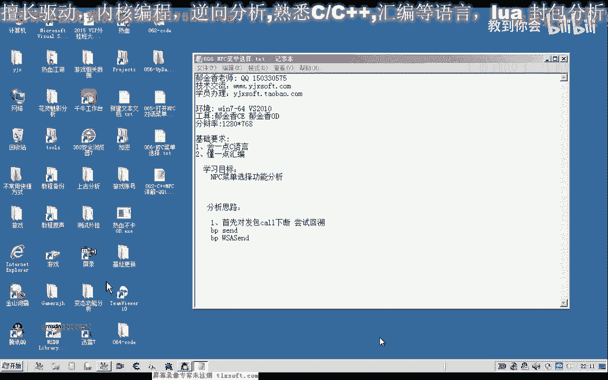
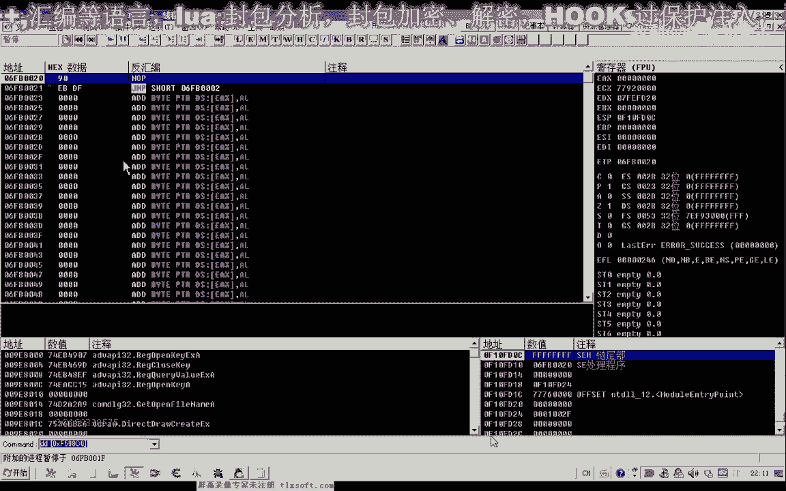
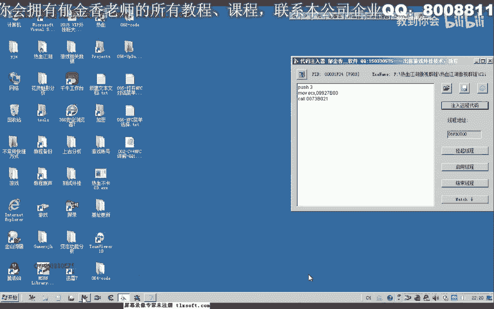
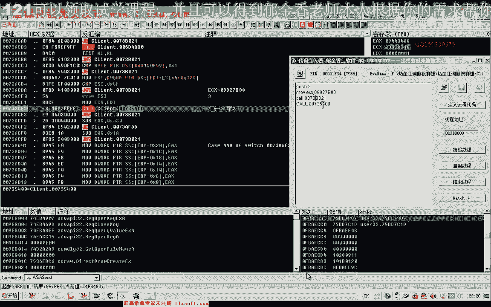
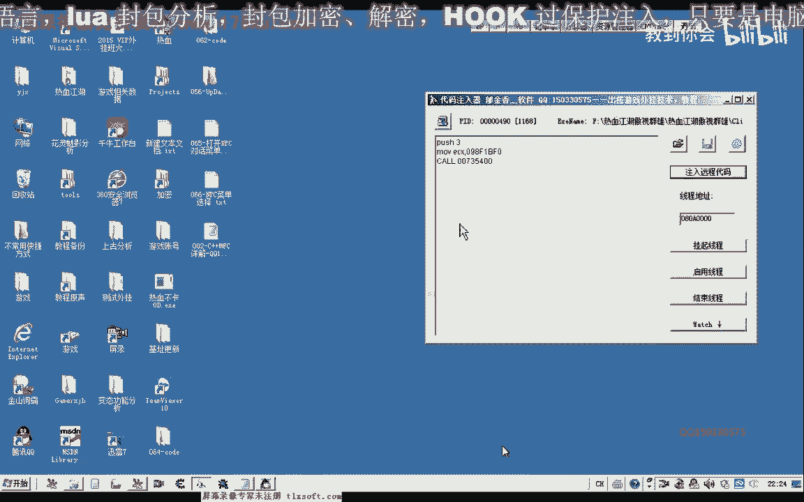
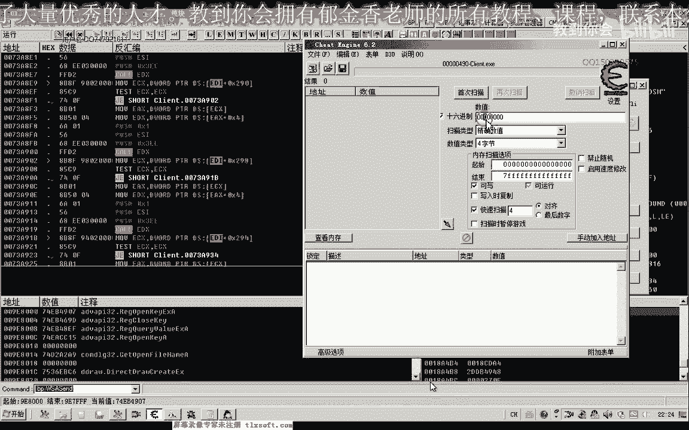
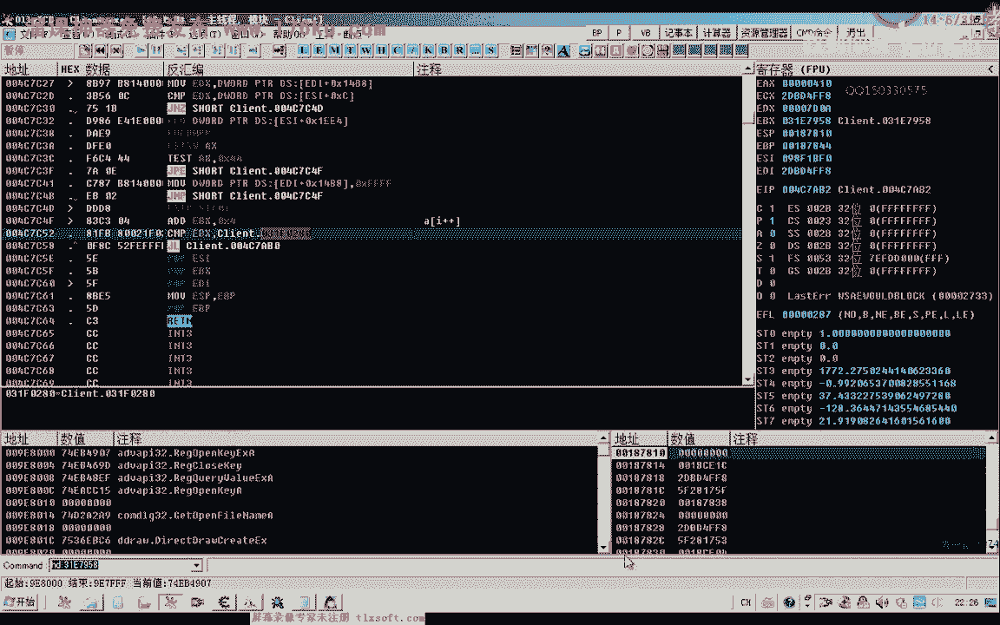
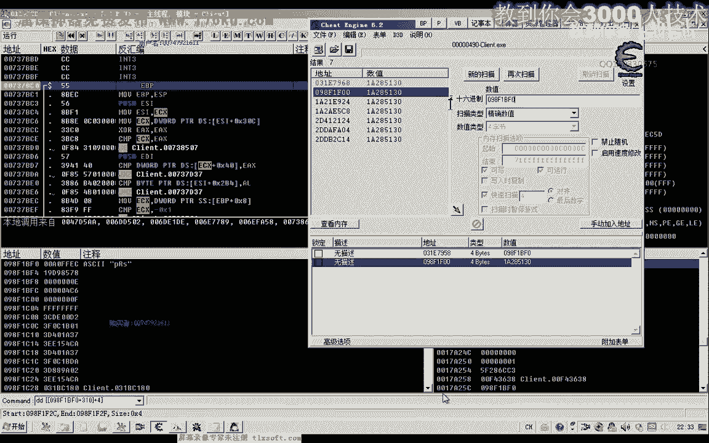
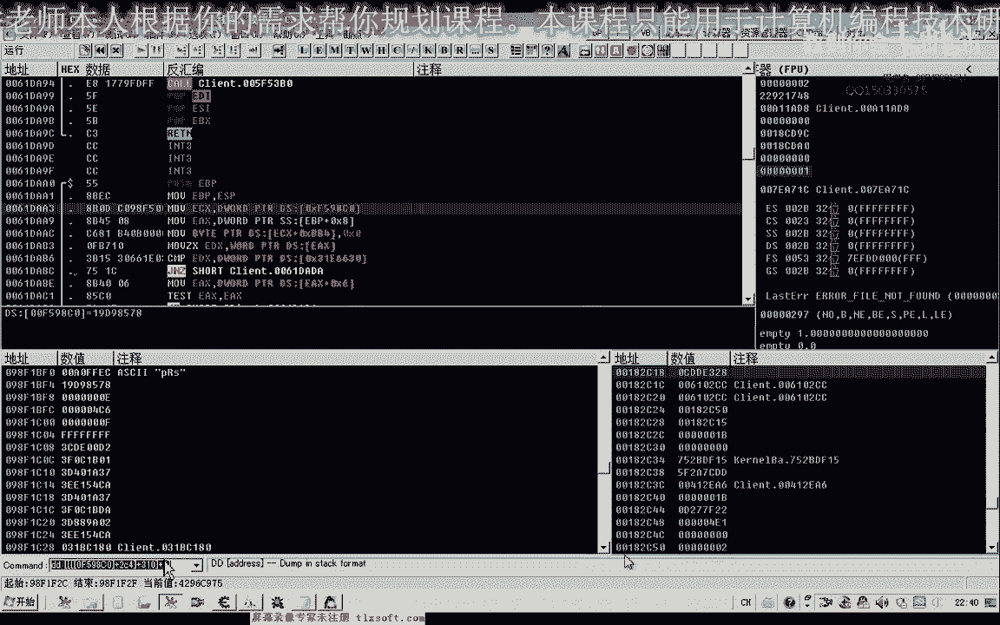
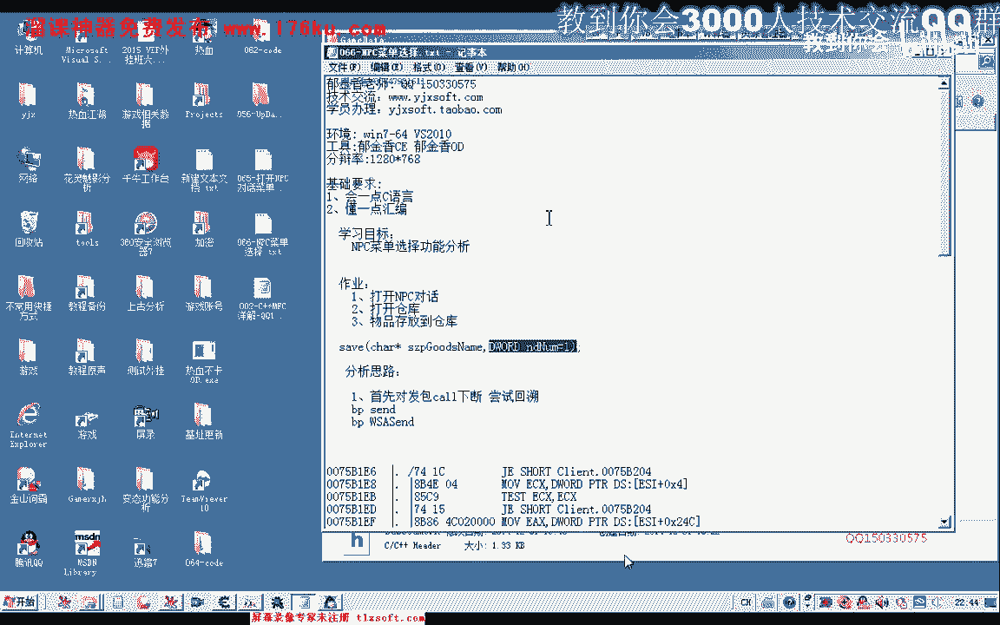

# P55：066-NPC菜单选择CALL - 教到你会 - BV1DS4y1n7qF

大家好，我是郁金香老师，那么在上一节课呢，我们分析了打开npc菜单的功能，那么这节课呢我们主要来分析一下呃，npc菜单选择的一个功能，我们说的肾的函数进行一个下段，然后回溯。

当然我们今天这个游戏呢它是用的w s a sm的啊来进行的发包，好的，那么我们先来打开我们的啊。

打开游戏之后，我们把调试器啊附加到游戏里面。

然后按下回车回车键哈，我们下一个断点，那么下断点之后，我们先让它跑起来，然后我们再打开仓库啊，那么这个时候断下了啊，断下来的话证明我们在打开仓库的时候呢，它向我们的服务器发送了相应的一些数据请求。

那么如果是当时没有断下的话，那么我们也可以找一些啊关键的一些数据来进行相应的一个分析，那么如果我们在打开仓库的时候，没有向我们的服务器啊发送这个数据，那么实际上这个步骤的话，我们就可以省略掉啊。

啊但是这个时候他向服务器发送了数据的啊，说明这个与我们的服务器数据呢有一些关联，那么所以说呢我们嗯今天来分析一下这个功能，那么我们再次在顺德啊发布这个函数，这里按下f2 下段再次打开仓库，然后我们。

执行到返回ctrl f9 ，然后在这个位置的时候呢，我们可以备注一下，打开仓库，然后再算一下ctrl f9 ，返回在这个地方，我们再次给他做一个标记，打开仓库二，然后再次按ctrl f9 。

在这个地方呢我们再次下一个到f2 ，然后再次按下ctrl f7 ，那么执行到这个位置的时候呢，我们就可以把呃相应的断点可以取消掉了，因为这个位置的话，很多地方他都会照执行到这个位置啊，很多地方。

那么我们对npc对嗯进行一些相关操作的时候呢，它都会断断在这里啊，断在这里，那么我们再执行到上一层，那么这是一个循环啊，那么我们可以下一个段进行尝试，然后我们再把所有的断点呢，把前面的这些断点删掉。

把我们新设置的这三个断点呢我们禁止掉，然后呢我们再次把它激活，那么这样呢我们就可以过滤掉一些哈，与我们打开仓仓库没有关系的地方啊，如果这个时候我们把这个断点开启了。

他马上就断下了啊，那么说明的话这个货的话与我们打开仓库是没有关系的，好然后我们关掉仓库的时候呢，我们发现呢它也会在这个地方呢呃断下，那么我们也备注一下，然后让它跑起来，而且它断下会断下很多次。

这里是一个循环，然后打开仓库，这个这个地方呢也与我们的关闭仓库有关了，好的，那么我们再一次打开我们的npc，打开仓库，那么这个时候呢也会断下，我们看打开仓库的时候，ex的数是多少，是319记录一下啊。

然后这里呢e s i的数字我们也把它记下，yes，i这个时候打开仓库是三好，然后我们再关掉仓库，那么关闭仓库的时候，我们看一下ex的数值呢是六二，那么e4 x的数字呢，我们也把它记录一下。

好然后再次让它跑起来，然后我们再次打开仓库啊，分析一下它的参数，这个时候我们发现呢319这个参数没有变，但是变化的是这个ecx的一个数字，它发生了一个变化，那么ex和我们的一dx实际上都有变化，好用。

因为它是两个不同的对象啊，在这里呢它实际上也是调用的两个不同的空，因为e d x e d x的一个数值的话也不一样啊，那么也就是说在调用这个库的时候，它关键是这个对象啊。

然后是调用对象的一个成员函数加四啊，这个地方的，然后我们再次让它跑起来运行，再次我们看一下一si的数值，那么ex e s i的数值来是三，那我们看一下现在e4 x的数值，啊。

那么这个三的话它是从啊从前面这个数组这里，好像过去的加174这个位置，那么我们从前面的分析来看的话，那么这个库呢更像是我们的呃，打开仓库的这个功能库啊，因为它的参数来比较稳定。

那么我们对这个后来可以做一个测试来试一下，那么这个地方呢我们先把它记录一下，然后把断点取消掉，那么理论上调用这个库的话也是可以来实现的，但是我们要先找到之前的这个ec x对象的一个来源才可以。

这，打开仓库，那么这个的可能性可能会大一些，好的，那么我们看一下e4 x的数值呢也是没有变的，那么我们用代码输入器来进行测试好，知道，那么首先呢我们要打开我们的n p c对话，然后呢我们再输入。

那么这个时候呢我们发现注入之后呢，呃这个程序来终止了。

那么说明我们传的这个参数呢可能有问题，我们再来看一下，退回来，首先我们看一下七三嗯。

应该是传入的这个数值的话，应该是734cm，那么这里扩的这个地址的话，我们刚才写写错了，写成了，我当时是看成前面这个73b021 来了，好的，那么我们重新再进一次游戏，那么游戏打开之后呢。

我们再次啊附加到游戏里面。

然后我们再用d来，可能这个ecx的数值的话，可能他已经重新启动之后，可能已经变化了，那么我们先用d来附加进去，把ec x的数值来获取。

好的呢，那我们再次打开一下仓库，看一下呃e4 x的数值，那么这个时候e4 x的数值已经变化了，那么我们先找到e4 x的数值，先进行测试，测试成功了之后呢，我们再去找这个数值的一个来源，啊然后输入代码。

那么这个时候我们可以看到它可以来打开我们的这个仓库了，但是如果我们单独的注入的话，它没有任何的效果，他必须要有一步哈打开mp 3的这个操作啊，看来他两部呢应该都是向服务器已经发送了数据。

然后服务器它获取这个数据之后呢，再传送了一些相应的指令过来啊，让他打开我们这个相应的一个仓库，那么好的，接下来呢我们分析一下这个e4 x数据的一个来源。

那么我们看一下它来。

白云ti，那么di的话，我们向前边找一下，那我们记一下现在e4 x的一个数值，我们先用c a e来找一下，看能不能够直接找到机子，这样会更快速有效一些。

那么这里呢只有一个地方哈，那么我们先搜一下这个数值能不能够在我们的d里面收到，如果能够在在这里边收到的话，他肯定就是一个机子，那么搜不到的话，那么可能就是我们其他的呃数组里边去了。

我们可以下一个断点看一下，那么现在ebx的一个数值，就是我们刚才的呃下的一个断点，那么它这个机子的话是来源于前面这一个数字，那么这里的ebx的话，它的数值应应当是在这个循环里面变动的。

那么这里呢每次来让11b x的数值来加了四，相当于每次呢我们的一个数数组的一个下标啊，加了一啊，相当于是这种情况，那么所以说在在这里的话，它是一个数组的一个访问的一个方式。

那么在最下边的话应该是一个数组的最大的一个下标的一个地址，好的我们再删掉它吧。

那么现在呢我们有两种方法来找这个机子，那么第一种方法呢，我们就是通过在，在这个c e里边哈不停的去搜索啊，去尝试一个一个的，那么我们可以从呃这种比较单一的地址来开始找，那么另外一种方式呢。

我们就是在o d里边找这个相应的数值，那么我们可以先进行一下尝试嗯，再一次我们让它断下，打开仓库啊，断一下，那么我们看一下这个bf 0啊，998f1 bf 0，我们看一下它的一个来源。

那么首先呢我们可以在这个堆栈里面找，从这个18a49 c里面看一下，看一下它是不是来源于我们呃前面的某一个地址，那么我们可以呢在这里边来找一下堆栈的一个数字，那么移到最开始的18a开头的。

那么我们发现的话，这里边没有啊，没有18a开头的，那么没有的话，我们，就只能从前边啊一步一步的来讲，或者是我们先回到上一层来看看一下，执行到返回，那么这个时候看一下上一层的e4 x的一个数值。

那么好像它的这个来源的话就是来源于这个ecx这个地方，那我们在这个地方再下一个段，重新再打开我们的仓库，好，那么这个时候断下，我们看一下这个时候e c x的数字呢。

我们发现啊恰好就是这个98f p f0 啊，那么这个时候的话，我们只需要来往前面继续找这个ecx的一个来源，但从这个e c x这里来的话，它又来源于e s i。

那么我们也就是要找这个腰1a2853130 啊，找这个数字，那么找这个数字呢，我们可以先在我们的ca一里面来找一下，那么先把公式计算出来，那么在c里边我们先找一下，那么这个时候呢我们也会找到一个啊。

又找到了这个968这个地方是一个机子，但是这个968这个地方刚才我们进行了尝试，那么这个是在所有对象里边啊，所以说我们不能够找这个，那么在这个时候呢，下面的这些指针的话数量比较少。

我们可以一个一个的尝试。

看能不能够找到机子，那么首先我们对这个地方呢进行一个呃访问的一个断点，hr，那么我们在这个断点下了之后呢，我们看一下好像是在e s i，那么好像是在它的上一步的时候呢，这里呢有一个断点。

我们981f00 ，你就该杀，1a3 加上我们的310，我看一下，那么恰好就是1s来i来加上我们的310啊，然后呢我们再取出来，本来之前的公司的话是这一个，啊那么但是这个130它的这个数字的话啊。

我们在这里呢就可以用前面的这个e s i，加310的替换掉，那么现在一si的数字呢，我们把它复制出来，那么最后呢我们这个公司啊就变成了这样啊，八好的。

那么我们接着来我们去找一下这个数值e si的一个来源，那么我们可以前面呢有两个地方跳转到这到这里，那么我们先看第一个地方，那么这个第一个地方的话，我们附近没有发现有对这个e si进行赋值的。

那么我们跳到前边那个地方来看一下，那么再找一下对e si这个地方进行赋值的，那么我们发现了它来源于我们上一级的e4 x，但是我们上一期的话，我们可以看到很多地方呢都会调用这个库。

那么我们先下一个断点进行尝试，那么我们发现呢嗯看一下现在的ei，那么现在的e si的话，刚好是我们所要找的这个e si啊，我们看一下e4 x啊，对啊，那么我们这个时候来返回到上一层。

那么也就是说这个e4 x呢就是我们刚才所要找的数值，而它的数值呢又来源于e s i，那么我们再往上面走，啊先让他跑起来，按减号再退回到我们刚才找的这个位置，嗯，那么我们发现的话。

它也是来源于再上一层的啊，e4 x，那么我们继续讲，当然也可以用c来搜一下。

可能会更简单一些。

那么这里我们收到一个3117 958，只有一个地方是吧，那么这个地方的话我们看一下它是不是机子，那么四基石的话，我们在d里边呢就能够找到它的常量，那么这个时候呢我们同样的没有搜索到啊，没有搜索到来。

我们继续让这个地方断下，再进行回溯，把这些断点呢我们先取消掉，那么这个时候呢我们会在这里呢断下，断下之后呢，我们再返回到上一层来看一下上层这个e4 x bbf 0呢，就是我们要找到地方了。

返回到上一层找ex e si，那么我们跳转到最前边，那么这个地方呢我们找到啊有一个对这个e s i进行赋值的地方，那么我们对他下一个段看，等会儿会不会在这个地方断下来，那么没有在这个地方断下来的话。

说明的话它的数字应当不是来源于这里，那么可能还在更前边一些，或者我们也可以移到这个扩的头部，那么来看一下它的一个来源，那么头部的话一般呢会有这两条指令啊，那么如果一个是谱写bp。

另外一个是move e bp后面e s p的话，那么这样呢一般就是一个函数的头部啊，很大的可能性当然不是绝对的，那么我们在这个地方来下段，那么这个时候呢它也断下来了，断下来之后呢。

我们看一下e c x这个b f0 呢恰好就是我们要找的一个数值，那么我们又返回到它的上一层去找，那么我们发现呢实际上嗯找到了这个打打开关闭npc这个地方，那么它呢这个ecx呢来源呢更上一层，好的。

这个时候断下之后呢，我们看一下e4 x来说，我们要找到数值，那么我们再返回到上一层，那么呢这个这个地方呢也是我们函数的一个头部，那么说明的话我们还需要返回到上一层，那么呢最终要返回到这个地方。

这个时候呢我们可以看到ex的数值来来源于e d i加2c4 啊，我们在这个地方再下一个段，再按一下f8 ，那么我们看一下e4 x的数值来来源于前面这个公式，那么我们看一下e d i的数值，把它复制出来。

再加上我们的234，那么我们这个时候呢需要去找di这个数字的一个来源，那么这个过来看起来好像是比较大，我们先让呃游戏来跑起来，首先呢我们在，在c里边我们先搜索一下这个数字。

那么这个时候呢我们能够找到两个地方啊，那么后面这个698的话我们比较熟悉啊，嗯这个f998 c0 这个的可能性要大一些，我们先在ot里面搜索一下，从，那么这个时候呢我们可以找出来大量的这个机子。

这些地方我们都可以找出来，那么证明他最终的，应该机子就应该是这个f59830 ，这个，好像这个数值的话，我们也之前好像也有啊。

分析过，那么我们先把它做一下记录，31开始，那么这就是我们的ex的一个数值，那，么这个呢是我们打开仓库的这个库，啊，好那我先保存一下，那么保存一下，我们可以打开之前62课的代码。

那么进入到我们的基础头文件，可以看一下，那么这个数字呢也是我们的f一和f 10的这个e4 x的这个参数，那么实际上这个机子的话，我们之前呢就已经啊就已经分析出来了啊，只是说我们这个相应的偏移它不一样。

那么我们这里呢也可以用另外一种方式来代替，二，好的，那么这节课呢我们就分析到这里嗯，我们打开仓库的这个过来就分析到这里，那么下一节课呢我们在对我们最近分析的这些数据来进行一个整合啊。

那么我们把前面的一个，当然这个呢也有做一个作业啊，大家下去自己做一下，那么首先呢也就是我们第一步是打开，n p c对话，那么第二步呢就是我们的打开仓库好，那么第三步呢就是我们的存取物品。

当然我们之前呢呃也用这个移动我们物品的这个函数来，来实现了我们物品的程序啊，那么下一节课呢我们就把这个呢，嗯把这几个功能呢把它写到一个函数里面来执行。

也就是我们啊就写成一个存放某个物品到仓库的这样一个括号，那么我们可以，呃写一个行列式serve的一个库，然后呢就是我们物品的一个名字，那么应该还有一个呃成分的一个数量，应该还有应该是有这样的一个参数。

那么有一些物品呢它是有比如说药品啊啊，或者是我们的补hp mp的这些药品，还有回城符啊，这些它都是有数量的，那么我们一次乘多少沉到这个仓库里面啊，那么这些的话应该都可以把它分析出来啊。

并且呢写成一个函数，那么但是呢我们暂时不要求数量的这个函数啊，那么暂时这个数量呢我们一就可以了，那么后边呢我们再添加这个有关数量的呃一些分析好的，那么今天呢我们就嗯就讲到这里。

