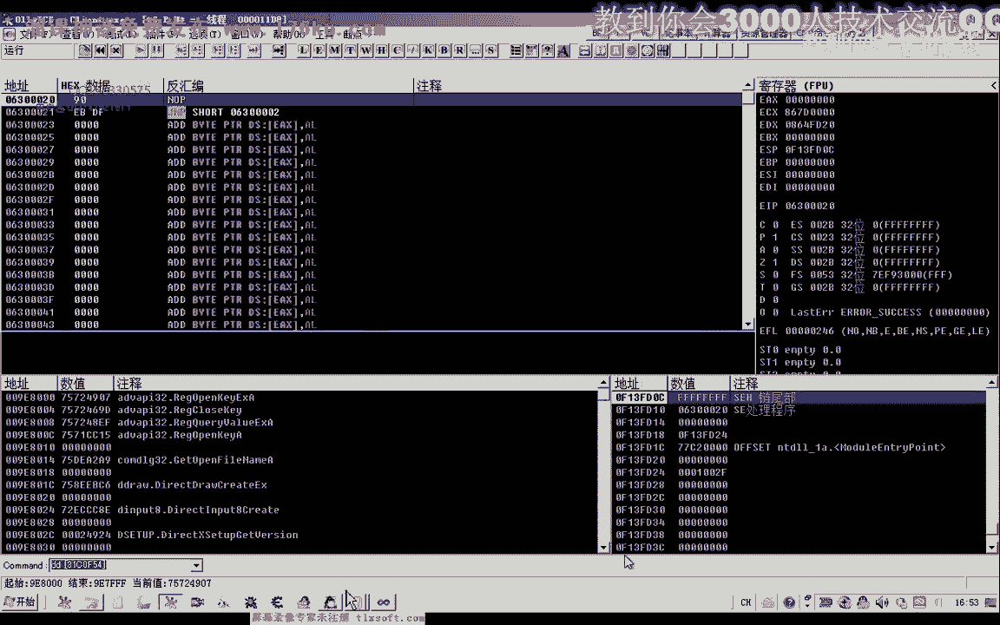
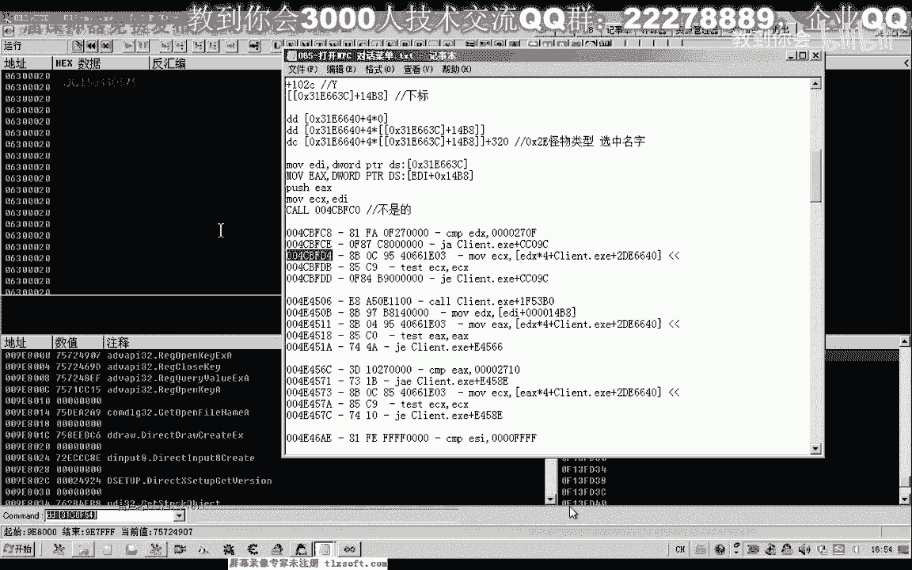
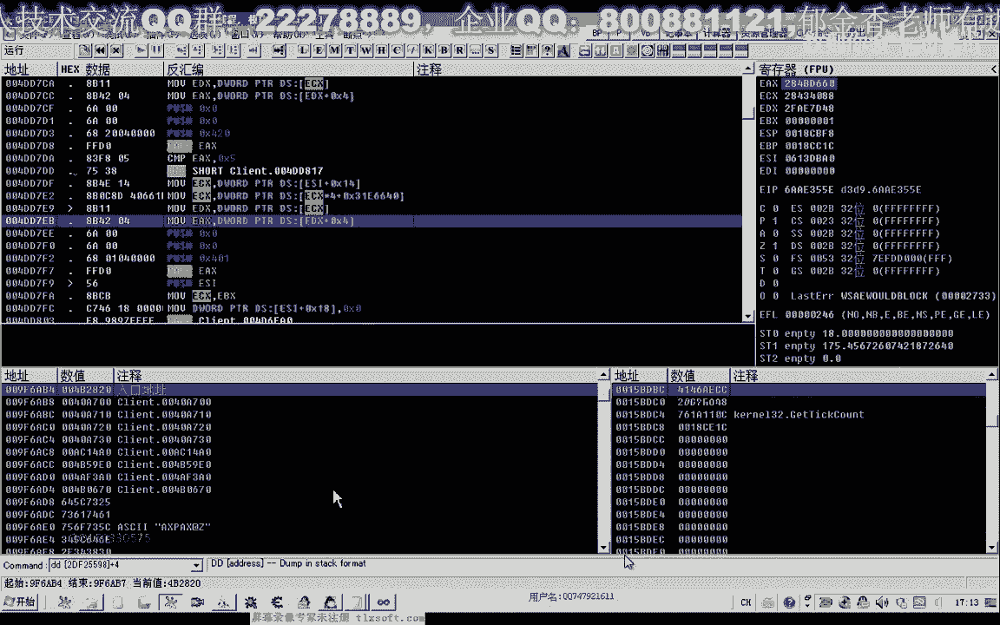

# 郁金香老师C／C++纯干货 - P56：067-封装测试NPC对话CALL与仓库CALL - 教到你会 - BV1DS4y1n7qF

大家好，我是郁金香老师，那么前面65克和66课的时候。

我们分别分析了打开npc对话以及npc啊菜单选择的这个括号，具体功能呢是打开我们的仓库功能，那么这节课呢我们把第64课的代码打开，在它的基础上呢，我们把新分析的这个功能呢添加进去。

那么首先呢我们添加我们相关扩的这个机子，那么然后呢我们添加两个呃相应的函数，一个是打开mp 3，一个是打开我们的仓库，啊，嗯，那么打开这个npc对话的时候呢，因为不同的npc呢我们有一个参数来区分。

所以说在这里呢我们通过npc的一个id来打开它，那么另外还有一个函数是打开仓库的，那么关于这个函数的话，呃我们呢没有相关的参数啊，直接定义就可以，然后在我们的源代码单元啊添加相关的代码。

那么把握我们第65课的哈，我们先把它相应的汇编代码我们复制一下，那么他的1c x的这个参数呢就是f一到f 10的啊，之前用的这个参数也就是这个f98 c0 这一个更新的，那么是一样的。

这里做了一个相应的替换啊，获得这个地址呢，我们也进行了相应的红的一个替换啊，这样方便我们更新好的，我们把它复制一下，嗯，把上面这段代码复制一下，粘贴到下边的，那么其中我们只需要替换相应的汇编代码就行。

打开仓库，啊这个时候保存一下，那么上面这个地方呢，它是它的这个n p c的呃，i d相当于是一个分类的一个编号，那么在这里呢我们把它传进来，好的，那么接下来让我们到主线层这里来进行相应的测试。

那么这里一呢代表的是我们的平时指的这个i d，那么我们在另外啊建一个txt 2的这个这样一个分支，开始分支用来测试我们的，打开仓库，那么再定义一个相应的红，在前面的基础上加一。

然后我们做一些相应的改动哈，在cp区单元，那么这里的自然也要需要给它变动一下，然后把它复制一下，那么这里我们把它替换成一，三这前面的函数名也进行一个相应的替换，这样呢我们方便啊分开测试。

然后再移到我们前面的测试单元前边，这里改变了一二，三，好的，那么在切换到我们的资源视图上啊，添加两个测试按钮，测试二测试三，那么这里的头文件的一个说明呢，我们也要添加呃，123这样三个啊。

测试函数的一个说明，二三好的，那么我们编译生成一下，再看一下我们的测试单元一，三啊再重新编译一下，好编译成功之后呢，我们启动了测试，那么首先呢我们挂接到主线层啊，打开我们的这个时候。

我们发现我们执行我们的这个打开仓库的时候啊，那么好像是出现了一些问题，那么这个时候呢这个仓库呢它不能够打开，那么再点第二次的时候呢，这个菜单呢它打开了，然后呢我们点击这个打开仓库的话。

他开不了这个仓库啊，那么也就是说这两个括当中呢某一个扩它可能出现了问题，那么我们先手动的选一下，看是哪一个问题，那先打开我们的npc的对话，打开仓库，那么我们发现了这个打开仓库的这个库应该是正确的。

而第一个我们的打开npc对话的这个这个的话可能是错的，那么我们手动的这个时候打开仓库，那么这个时候，也是不行的，那么说明我们第一个括在分析的时候呢，它只是徒有其表，只是有一个显示这个菜单的功能啊。

但是呢它是一个错误的这个空，那么在这里的话，我们这节课呢我们先把第65课的这个打开npc对话的这个扩呢，重新把它更新过啊，那么下一节课呢我们再来进行相应的测试，那么这样出现这种情况的话，我们呢可以呢。

嗯回过头来把所有的呃65克的分析资料来再重新的分析一遍，但是这样分析的话呃工作量呢比较大，那么我们可以有一个取巧的方法，那么因为我们在打开菜单的时候，可能也会向我们的服务器发送一个断点，发送一些数据。

那么我们可以呢嗯在这些之前的啊这些访问的地方呢，先下一个断点下来之后，我们看是在哪一个断点的后边，他发送了这个数据，那么这个扩呢可能就是我们真正的这个打开mp 3的这个库，当然实际上我们也。

可以用选中n p c c之后呢，我们可以用这个技能的一个攻击呢，它也可以打开这个n p c的一个对话，那么也是一种方法啊，但是这节课我们还是本着研究的精神呢，我们还是来分析一下。

那么我们先用用我们的id哈。

附加到游戏进程里面。

那么我们把之前的这些断点呢，呃对我们npc的对象进行了访问的地方呢，我们进行一个下段。

或者桌上相应的一个标记啊，当时我们注册了123的这个标记，先下一个断点，二这个地方是，可能这里呢我们都跟他做了相应的这个断点的一个注释啊，那么然后呢我们下一个啊发包的一个断点。

因为我们在打开的npc的时候呢，也可能会向我们的服务器发送数据啊，因为它不光是一个菜单，如果光是菜单的话，我们上一节课的分析的话，可能就是正确的吧，好的，那么这个时候呢我们再打开npc。

打开这个npc之后呢，我们再用这个p p4 的下段按下回车，按下回车之后呢，我们再让它跑起来，跑起来之后呢，去掉断点啊，执行到返回啊，执行到返回ctrl f9 。

然后我们看一下它的前后有没有我们的一些注释，那么我们发现的话在山的这个地方啊，这个地方呢也就是呃np的对象，我们之前的一个注释，那么在这里访问了对象之后呢，他对这个对象的test进行了一个判断。

如果这个对象为空的话，那么来跳过这个空，如果不为空的话，在这里来呢，嗯向服务器发送了一个数据，那么这个数据的话也可能就是一条打开我们pc对话的一个指令，但是一般来说呢我们的，这个打开mp的对话的话。

他可能不会像服务器啊，按按照我们正常的思维来分析的话，它可能不会像服务器啊发送这个数据的，因为只是一个菜单，那么理论上呢在打开仓库的时候才应该发送这个数据，但是也有特殊的情况。

那么我们先来测试一下它发送的这个数据，是不是就是我们的打开npc对话，那么我们看一下它是首先取出了从这个地方来分析的，取出np的对象，然后呢呃判断如果不为空的话，那么就取出这个np的对象。

里面的应该是它的一个呃成员函数列表的一个指针，然后成成员函数里面加四这个位置啊，函数指针取出来，然后呢进行一个调用，那么所以说我们还要需要来在这个地方的话，需要先获取我们的npc的对象。

才能够调用这个库啊，当然也可以直接把这个扩来提取出来哈，但是这样的话呃不是很好，我建议的话还是我们先找到这个npc的对象啊，然后呢在这里呢，来调用相应的库，当然在这里的话。

我们也可以把这个n p c的id啊写进去，然后用数组的方式呢嗯来取出我们的npc的对象，好的，我们在这个地方下个段，那么重新让它断下来，我们先取得五大宝这个npc对象的，先取得他的一个ecx。

那我们看一下，这是我的大宝嗯的这个npc的对象，那么它是在这个位置，那么取出了这个对象之后呢，它加了4号这个地方，一层括号，按下回车键嗯，应该是这个四比2820这个函数。

那我们往下次先看一下现在的ea x啊，也就是这个四比二八人这样计算出来的，好的，当然我们也可以直接的这样调用啊，先做一下测试，用代码输入器啊不行，音呼吸音，复习0x450 。

当然这里还有一个e4 x这个参数要给他放了进来，这个是扩的一个参数，那么我们的e c x我们看一下，13x59839 ，四比2821，好的，那么我们注意一下我们的代码，那么这个地方好像还是没有。

我们没有一个反应，我们再来看一下这个库，那么理论上来说的话，这个扩的可能性应该是很大的，那么我们再回到这个扩的上一层去看一下，或者说它的一个附近，再测试一下后边的这个扩来试一下。

那么这个过程我们测试的话，它可能只是向服务器发送了一个什么数据请求啊，那么我们继续来看一下啊，这个三后边的这些数据，然后试一试这个地方，看一下它附近有没有这个相应的这个扩，那么这里也有一个空。

做了一个相应的判断之后呢，这里也是加四这个位置，那么可能也是刚才这个扩的一个地址，我们在这个地方下个段来看一下，那么这个时候呢也会断一下，那么1x的数值呢，同样是这个四比2820，只是参数变化了。

变成了四零，那么我们接下来再测试一下四二点，这个参数，那么同样的没有打开我们的这个npc的相关的这个菜单，那么我们接着往后边啊，再继续继续我们的一个测试，在这个位置，那么这前后的话没有这个相应的扣啊。

所以说我们不管它，再看一下后边这个访问的位置，那么六这个位置呢前后来也没有看到啊，相应的空，那么我们再往后边再看一下，那么在七这个位置呢，这里有一个过啊，三ea，那么我们在这个地方下个段来看一下。

那么这个时候我们发现了同样的同一个括号，但是这里呢它参数变了，那么我们把相应的参数来做一个改改动啊，但是我们注入进去之后呢，也是没有没有反应，那么我们再接着往后面看一下，那么这个地方呢有一个括。

他把我们的也是对象啊取出来，然后进到了这个括里面，那么我们这个我们看有没有测试过，没有测试过的话，我们也可以测试一下，那么我们先取一下它相关的一个参数，首先ex是我们的外部对象啊，e si。

我们来看一下，这个是一个未知的一个数值，那么一di，好像是这个我们也不知道是什么啊，好的，我们测试一下啊，这个相关的库，那么我们关掉npc对话，然后呢再测试一下，然后我们注入之后呢。

发现这个地方呢它同样的是没有反应，也不是的啊，那么我们再继续下一个获得一个测试，编号九这个位置我们看一下，那么这里呢也是取出了我们相应的这个npc的对象，我们这个地方呢，但是它断不下来的这个地方。

那么我们接着再看下一个地方，看一下四dd 023这个位置，那么我们在这个地方进行下段再看一下，ec x啊，外部对象ex这里是一零，然后我们的ec x，还有一个ebx，我们来看一下啊。

但是这种形式的话看起来也不是很像啊，那时候我们来进行一下相关的测试，第一个数字1014x等于我们的，df 2598，然后我们的e4 x等于648扩的地址呢等于4c4740 ，好的我们再一次啊注意一下。

那么注入之后呢同样没有反应，那么在下一个，那么我们再进行下一个数据的一个测试，那么下一个呢是在这个地方，然后31a哈，但是这个调用的话，我们应该之前已经做过相应的一个测试了啊。

那么这里有个4626tx g，这里就462，但是这个地方不知道有没有执行到我们下一个断点，那么也会断到这个地方，但是这个地方我们看一下dx的数值，同样的是我们之前测试的这个相关的代码。

那么它传进来的参数呢是00462，那么我们进行一个相应的测试，462先让他跑起来，那么同样呢没有反应，那么我们接着再往后看，是滴滴，我们生产是接近069，好像是测试到这个地方了。

那么这里来取出我们的e4 x之后呢，嗯这个呢也应该是我们的这个mp 4对象，然后来做了一个判断之后呢，这里有一个420的一个判断，那么可能也是我们这个n p c c的相关的这个库四零。

我们看一dx也是我们这个空，那么我们再测把参数改成4204项，那么同样没有反应，那么我们再看一下后边的代码，啊这个也是420420，我们已经做过相关的这个测试了，那么我们在这个地方下个段看一下。

看一下他数据的一个走向，420这个地方没有被执行到，但是这个时候呢ex呢也是我们相关的一个数据，这里有个401啊，同一个库，那么我们看一下这里传401相关的数据信息。

那么这个时候呢这个过来他也能够打开我们的m p c对话，那么我们点一下打开仓库啊，那么这个时候的话算是测试通过了，还可以来打开我们的这个仓库，那么说明的话我们这个扩的话才是我们真正的npc打开的这个库。

而在这里呢是我们的npc对象，那么所以说所以说我们在下一节课写这个代码的时候呢，我们还需要呢呃取得另外写一个函数，来取得我们n p c对象的一个这样的一个函数，那么我们可以通过一个npc的名字嗯。

来先骗你获取我们npc的对象，然后再来调用这个库，那么这里呢我们为了呃更新的时候少更新这个扩的代码的话，那么呢我们可以把这个扩的地址去取消掉，我们可以这样啊来访问它，ex。

那么我们可以仿照他的代码来写e4 x，ex等于e x加四啊，最后呢这样调用就可以了，那么也就是仿照的和这两句代码来进行一个书写。

好的，那么我们再次进行一下测试啊，这个时候也可以了啊，那么我们只需要一个参数，就是npc的对象啊，这里传1x镜头，好的，那么我们由于时间的关系了。

那么我们下一节课呢在正式啊重新来进行我们的代码的整理测试，那么刚才我们找到的四dd 7比三这个位置，没，那么这个加湿这个位置的话，它通过这个参数的一个不同的控制啊，它应该能够实现很多功能打开npc。

那么也可能是n p c菜单的一个选择的话，也可能再给你都有可能，因为我们在测试的时候发现这里从401420316，那么很多的这个参数呢都是从第三个参数啊，这里面传进去的好的。

那么下一节课呢我们再进行相关的数据的一个封装，那么这节课呢我们就测试到这里，好的，那么这里呢我们大家也可以把这个当成一个坐力啊，自己下去啊，先封装一下相应的这个功能的一个代码。

