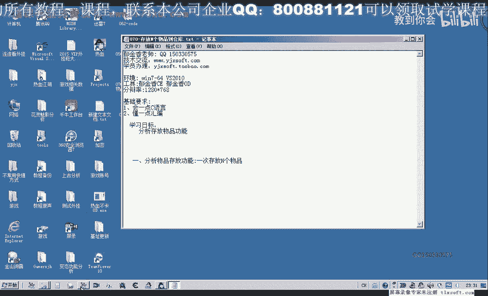
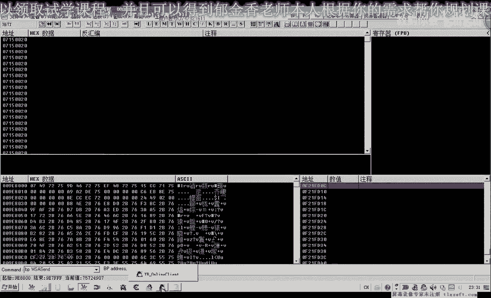
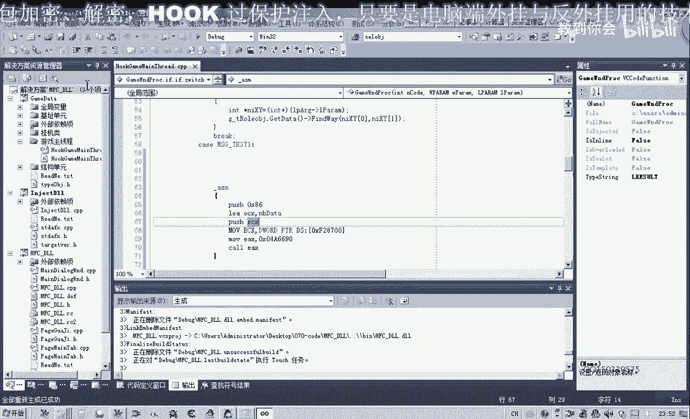
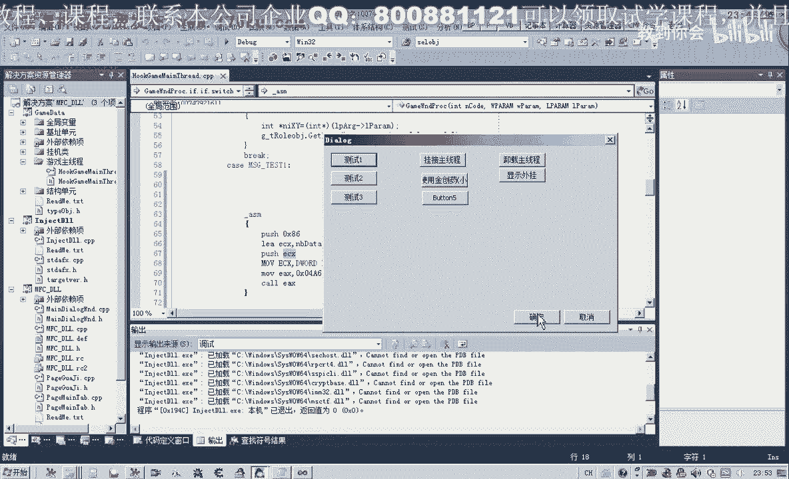

# 郁金香老师C／C++纯干货 - P59：070-存放N个物品到仓库 - 教到你会 - BV1DS4y1n7qF

大家好，我是郁金香老师，那么这节课呢我们主要来分析一下，那么一次存放多个物品，在我们存放物品到仓库的时候呢，我们有一个物品的数量啊，像药品啊或者是回城符这一类的，他需要输入一个呃相应的数量。

那么一次它可以成啊很多各相同的这个物品来到我们的仓库里面，那么这就是我们这一节这一节课所要分析的一个目标，那么如果还是按照我们之前的呃，通过移动物品来实现的话，那么中间的话它需要很多个步骤啊。

那么我们这节课主要来分析一下，看能不能够用一个空来实现哈，就一次性的把某个物品啊存放指定数量到我们的仓库里面，哈哈哈哈哈，那么我们分析的话，我们可以从两个方面来入手，一个是呃我们的这个物品的话。

肯定他要向我们的服务器发送这个数据啊，就是告诉服务器我们存放了多少数量的五个物品到我们仓库里面，那么还有另外一个呢就是我们的这里有一个数量啊，可以从数量这个关键的数据来进行逆向分析。

分析这个数量的一个走向，那么最终他在发包的时候，肯定也有一个关于我们物品数量的一个数据啊，这个是一个相当关键的数据，我们可以通过这个数据的话，肯定就能够找到这个存放的，存放这个物品的这个扩啊。

那么我们先打开我们的mod。

附加到我们的游戏里面，那么我们先尝试在呃数据发包的这个函数上面下断点，那么我们先不让它断下。

先我们在这里输入了一定的数量之后，然后我们在让它断下，断下之后，我们再按确定啊，这个时候呢他肯定就会向我们的服务器啊发送这个相应的数据，就是说我们的每一个物品啊存放了33个啊，到我们的仓库里面。

那么这个时候呢我们可以把这个断点呢取消掉，然后呢我们用ctrl f9 啊，执行到返回，然后这个地方我们可以看到它调用了这个函数来发包，那么一般来说的话可能就在上一层啊，就是我们的这个库啊，嗯发包的。

那么这个地方的话他也在就是说这个库里边它进行了发包的一些数据，那么在这里的话他可能就建了一个缓冲区，来把我们的物品数量，物品的一个种类啊，那么来向我们的服务器发送好的，那么我们在这个地方下段啊。

下一个断点，这里我们是纯仓库，物品的存仓库，然后我们再再一次按下我们的ctrl f，那么执行到这个地方，我们，仓库，那么我们也跟他下一个断点，那么然后我们再一次啊，那么我们发现呢，就这个时候呢。

就执行到了这个打开仓库或关闭仓库的这个注释的这个地方，那么我们先让它跑起来，在这个地方呢我们眼下一个断点，但是这个扩的话，理论上来说的话，因为我们之前的打开仓库或关闭仓库都会调用这个地方。

那么在这个地方的话，它可能呢呃是我们存放存放这个物品的可能性就比较小，只是说我们这个存放物品关闭仓库哈，或者是打开仓库，它可能都会像我们的服务器呢发出一段数据，好的，那么我们再一次存放一个相应的物品。

那么这个我们发现呢它在创建这个窗口的时候啊，或者是关闭这个窗口的时候呢，它都会来调用啊，这个地方调用这个库，那么我们先把这个断点来取消掉啊，它可能也就是我们的一个窗口对象这一类的啊。

窗口的关闭或者是嗯打开这类的操作啊，窗口的一个关闭或者是创建，它可能会通过这个库来实现好的继续跑起来，然后呢这个时候我们看一下这个地方呢，它也会断线，我们也让它跑起来。

但是呢这个时候的话我们并没有存放我们的物品，那么只是说把我们的某个对象移动到了这个仓库里面，那么这个过来它就会被调用，所以说这个地方的话他应该来，也不是我们的这个相应的存放我们这个物品的这个空。

那么最后一个的话应该就是我们离这个发包函数比较近的那一个是，那么在这里呢我们输入数量啊，输入九，然后我们按确定，那么这个时候呢会断在这里，那么这个库里边的话，它就会像我们的服务器呢发送相应的这个数据。

那么说明那么这个数据里面肯定包含了我们物品的数量，还有一个就是我们这个物品的一个标志啊，或者叫d它用来表明一个身份，表明我们是成的某一项物品，那么它肯定有一个相应的服务器的这个物品的一个分类编号啊。

这一类的，当然这个分类编号我们并不知道它是多少，但是我们知道的这个关键数据呢就是这个物品的数量，那么我们看一下这个谱写的话，它是一个常量，那么我们就不管它，那么我们就来看一下。

这个时候这里呢有一个数值啊，18a488 ，那么这个数字呢就是我们的一bp减2818，他是先取取了存放到ec x一点，但是呢在这里呢这个机制改变了我们的ec x的这个数值，那么所，他说要查看的话。

我们可以堆栈把这个18a488 把它复制出来，用db的方式来查看，那么我们能够在这个地方来找到我们的数量级啊，那么我们把这个地方记一下，大概是在要e e d啊左右啊，d e f大概在161718。

大概是在这个位置，我们先记一下，然后呢先让它跑起来，那么再一次我们存放到仓库的时候呢，我们把它的数量改一下，改为七啊，然后呢我们再按确定，那么这个时候呢我们看到有两个地方改变了，一个是七。

那么另外一个呢是八七啊，这个地方改变了，那么我们再次让它跑起来，那么数量的话，我们基本上确定的是在这个位置，好把这个相应的数据呢我们复制一下，那么这个地方我们可以数一下啊。

这里是1011121314116171819，这里是ea啊，那么就是说是这个缓冲区的数加1a这个地方呢是我们的物品数量，那么这是它的低位啊，那么高位的话可能后面的话这里呢他可能是占了四肢解。

但是现在我们还不能够确认他好的，那么我们继续来看一下，那么另外还有一个地方它改变了，那就是在我们的这个地方，b7 这个地方，那么这个地方改变了，我们是2a啊，这个地方，那么这个地方它究竟是什么意思呢。

我们也不知道，那么我们直接呃接下来呢再说一下啥事，那么分别呢我们用金创药打过这个血原声这两个物品来做测试，因为这两个物品的话，它肯定有一样是不相同的，也就是说它在服务器的一个分类编号肯定是不一样的。

它只有不相同才能够区分这两种物品，那么我们先存放这个雪雪原生存放数量三，然后我们看到这里是三，那么这里是八零啊，改变的数字呢是八零，那么这个80的话，它很可能就是我们的物品的一个分类编号。

那么我们再一次啊存放三个进来看一下，那么这个时候呢由八零变成了我们的7d，那么这个我们是那么我们发现的话是同一个物品，它这个数量呢也在变，那么说明这个位置的话啊，零三刚才我们是说的是2a啊。

这里呢是3a这个地方，那么3a这个地方的一个变化的话，它可能是其他的一个发包的一个技术啊，在不断的减少变化，那么我们也给他备注一下啊，3a这个地方，当然这个地方呢它在不停的变化。

那么二类这个地方呢b7 呢我们发现了它没有变化啊，那么我们再一次用金创药大啊，存放三个数量进去，那么这个时候呢我们发现的话它变化的地方有哪几个呢，你把它记录一下，当然数量这里哈嗯一个是被ea。

还有这个地方也变化了，六三再长一串啊，那么这一串的话极有可能就是我们服务器的一个编号，因为我们的这个物品的种类它比较多的时候呢，他可能就会这个编号呢可能就呃就会比较长，一就像我们的身份证一样。

它的位数比较多，那么这里还有一个六七，那么这里也是一个六七，那么我们发现了这个六七ca 9 a3 b啊，这一长串，那么这两个数字呢是一样的，那么这里呢还有一个1b啊，但是我们不知道它是什么作用。

那么我们先把这一串人复制下来，那么后面全部数字来证明，我们就不用复制，好的，那么我们再一次来测试一下啊，雪原声数字啊，三那么我们发现呢7a这个地方在变化，其他的地方都没有变化。

那么理论上我们把这一段数据把它复制进去，嗯，进去之后呢，然后把这个数量三把它改动之后呢，就能够嗯存放这个三个雪原声来到我们的仓库，那么关于其他的数据呢，我们下一节课来再详细的来分析。

那么我们先来测试一下，这个货是不是可以达到一个存放多个物品，到我们的仓库里面的这个作用，那么我们发现的话啊，这里是67c9 ，a3 b c9 ，第三批，那么这两个的话都是我们情况呢都是原声。

那么这上面这里呢我们应该是存放的是金创药，那么这个数据量的话比较大啊，那么比较大的话，我们直以来用我们的这个时候用代码输入器来测试的话，就不是很方便，那么我们呢现在呢只有用我们的打开第69课的代码。

用它来进行一下相应的测试，那么在测试之前呢，我们把这个相应的数据来进行一下处理，那么我们再进来看一下，这里有个八六啊，而我们在断下的时候呢，它后边的这个数据块的话差不多也是八六至九啊，我看看一下。

在这里的话，从8808182838485 86，那么还要多1。86878889，那么我们在这里呢就跟他分配90个字节的这个空间啊，然后呢来存放我们这个数据块的这个代码作为一个测试。

然后这里呢我们说的1a这个地方呢是它的一个数量好的，那么我们把这一块的数据来进行一下相应的处理，然后我们把这个数据块啊，呃字节起来啊，复制剪切一下，然后我们需要把它处理之后呢。

能够让我们的这个c语言里面的这个数据能够认识他，那么首先呢我们把里边的空格啊，把它替换成逗号，按下空格，然后按下我们的逗号，那么来全部替换掉，那么替换之后呢，第一个啊这个逗号呢我们用空格把它替换掉。

那么后边啊这里面全部我们也用户口来替换掉，或者在前面啊也用空格把它替换掉，那么我们还要必须要加上一个0x的一个前缀才对吧，那么我们再重新整理复制一下，那么首先呢我们要在空格前面加上一个0x那个前缀。

那么0x前面呢我们再加上一个逗号啊，这样的话方便我们处理全部替换，那么我们再把前缀的啊，前面的这个逗号栏删掉，然后在后边的多余的字符呢，我们也需要把它删掉，那你在车站的大家都。

好那么我们可以把这个来把它定义成一个数组字符类型的，或者是我们bt类型，应该开始九零，那么我们可以把它稍微变大一点，然后呢后边的这个呢就是我们所要初始化的这个数据块，那么这些多余的啊，我们都需要删掉。

那么初始化之后呢，我们还需要来调用这个相关的这个空啊，那么首先呢它是一个呼吸六零，那么我们在写汇编的时候，我们也把它写好，好push 0 x86 ，然后呢再复习一次x，然后再是move。

如我们把这句汇编指令的直接把它复制下来，那么然后再调用我们的空，那么这个扩的话我们也需要先把它放到我们的ex里边，然后呢再来call ex，那么这个ec x呢我们需要对它进行初始化。

那么这个1e x的话就是来源于我们的这个nmb被提，那么我们就是取得它的一个地址，这句，那么这样的话，我们理论上呢就能够存放我们的相应的物品到我们的仓库里面，好的，那么我们把这段代码我自己下。

然后打开我们第69课的代码，啊啊啊，那么我们直接移动到我们的主线程单元test一这里啊，然后把我们的代码粘贴进来，进行我们的测试，好的，那么我们首先编译一下，看能否通过我们的编辑。

那么这里呢我们要加上一个封号啊啊，再重新编辑一下，那么首先呢在这里边呢我们的这个局部变量的一个申请呢，我们需要跳过这个case标签嗯，申请到我们可以把它申申请我们全局的，或者是在这个扩的头部。

来进行我们的这个数据的一个定义，那么再重新编译一下，好那么这个时候呢我们编译成功了，那么接下来呢我们进行一下相关的测试，再检测一下我们的代码看起来没有错过了。

那么我们再注入到游戏里边。

那么我们先挂接到主线程，然后呢我们选测试一，那么注意这个时候呢我们的这个窗口来需要打开啊，仓库窗口需要打开，然后我们看一下现在的数量是374，那么我们测试一下，还有371，还有368。

那么每次我们存了三个这个物品才存到我们的这个仓库里面啊，那么证明这个库它肯定是我们已经分析正确了，那么关于相关的这个参数的这个分析呢，我们留到下一节课啊，再进行一个详细的一个分析，好的。

