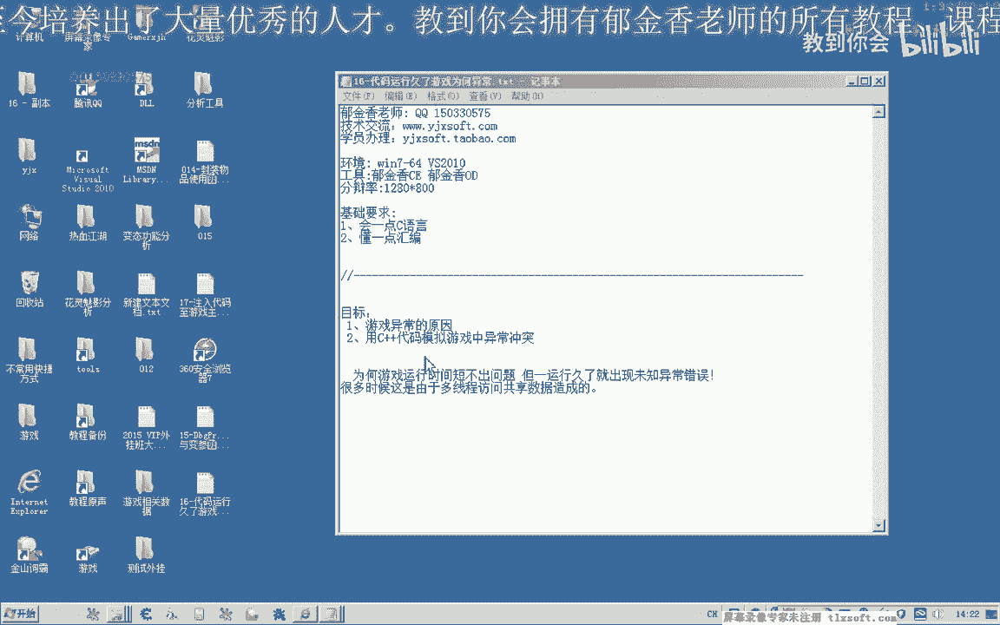
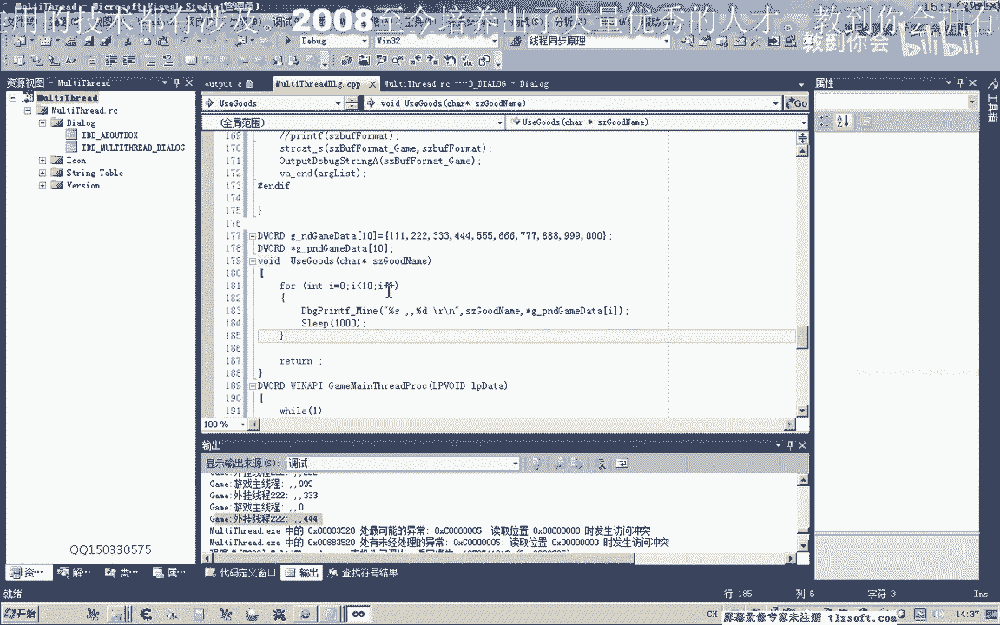
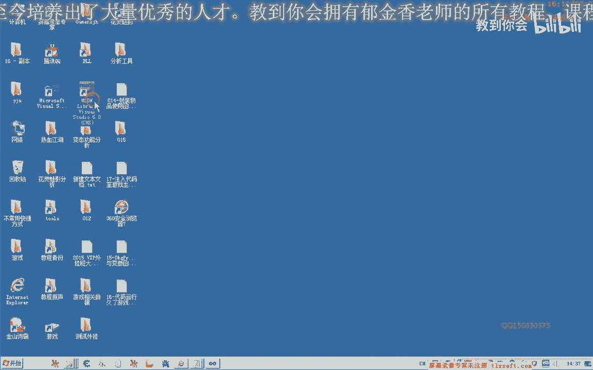
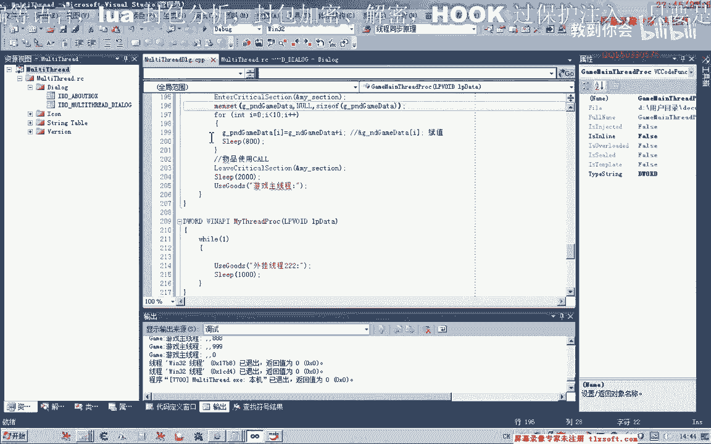

# 郁金香老师C／C++纯干货 - P5：016-代码运行久了游戏为何异常 - 教到你会 - BV1DS4y1n7qF

大家好，我是郁金香老师，QQ1503307，欢迎大家参加郁金香技术编程培训，那么我们在第14课的时候，我们测试我们物品使用的课的时候，那么当时出现了异常，那么但是这种异常一般情况下它不会出现。

一般情况下不出现，因为当时我们所用的注入的窗口，它与我们的游戏的主线城窗口它是不对的，也就是说它是两个线程，那么相关的有一些数据，它是共享的一些数据，那么当游戏的主线城也在访问这个数据的时候。

而我们的编写的代码也在访问这个数据的时候，那么有可能就会产生一些冲突，造成我们的这种异常，那么这种异常的话，平时的话它可能不容易出现，但是它容易造成我们编写的代码的一个不稳定性，有的可能是几个小时。

那么甚至更久的时间，它才出现这种，出现这种错误，那么今天我们通过C++的代码来说明一下，这种异常是怎么产生的，那么我们该怎么解决这种未知的一些异常，那么我们打开OS2010。

我们用一个MFC的程序，说一下，那么这种数据的话，一般来说是一个多线程访问一些共享的一些数据，也就是我们游戏里面的，比如说怪物列表或者是背包的一些列表，这样它有可能造成一些冲突，多线程的时候。

因为我们的线程与游戏的线程，它们有一个同步的一个机制，那么在这里我们添加两个按钮，复制一下按钮，按住Ctrl键，然后拖动一下，就可以复制它了，然后我们取名游戏主线程，那么我们取名为外挂线程。

那么首先我们模拟游戏的数据，定义一个全局的一个数据块，那么这个数据块，我们用一个文数是10的一个数组来表示，给它复一下数字，好的，那么另外我们再定一个全局的一个变量。

这个是一个指针指向刚才我们的游戏的数据，也是一时，这里我们定义成指针，那么定义成指针之后，我们模拟一下游戏的一个主线程，我们先写一个游戏的主线程，那么在这个线程里面，我们写一个循环，循环的操作。

那么循环是每次的我们先给这个指针复出，这里我们用N设定来给它复出，GP，全部复制为空，它的大小就是sizeO，GP复制为空之后，我们再用一个Full循环，把这个数组的这些相应的地址，复给这个指针。

那么这里我们可以这样写，也可以有另外一种写法，取它相应的一个地址，它就这样写，随便怎么写都可以，那么这里我们相当于给它复制，复制，这个指针复制，那么复制完成了之后，我们后面模拟一个物品使用的库。

那么我们另外写一个，选一个core，那么在这个core里面呢，我们先把第15个的打印调试信息的代码，先复制过来，这是我们上一节都写的，那么在这里，我们就把指针里面的速度的信息全部把它打印出来。

那么这里呢，我们也要用一个循环，因为它有第10个，那么我们是把地址里面的，实际上就是打的这些数据，只是我们在这里是用指针的方式来访问的，然后进行一个换行，那么为了让它打印的速度放慢一点，方便我们测试了。

这里我们在看有一个一秒的一个时间的一个间隔，那么我们这里是游戏渲染在使用，那么这个函数我们写完了之后，我们先更新一下，没错，我们在这个资源视图里面先创建一个主线程，那么在这个主线程里面。

也就是在引起来的主线程，那么只需要一个参数就行了，第三个参数就是我们的主线程的一个地址就行， the game's GameCenter。com。cn，我们先测试一下开启我们的游戏的主线程。

RTPUT输出的时候出错了，我们来看一下游戏主线程转到地址这里，对了，我们扫描了一个参数，再看一下，那么这里它就会去骗你我们的数据，读出它的一个数据，这是我们主线程这样读的话，它是不会出错的。

反复的读都不会出错，但是如果我们在另外再开启一个线程来调用一下，这个MuseQuotes，也就是物品使用的这个库，比如说我们再开一个线程2，当然我们要先写一个线程，我们把这个游戏的主线程把它写一下。

但是写一下我们只使用后面这一部分，那么这里我们也循环到调用台，当然为了方便测试，我们加上一个延迟，用不了的一个延迟，把上面的复制一下，这里来改成我们的线程，那么这个时候就有两个线程了，一个是我们的线程。

一个是游戏的线程，那么我们再来访问，那么只开一个线程的时候，这个时候你随便运行多久，它都是不会出错的，但如果我们把外挂的线程给开了，开始它也不会出错，时间一旦久了之后的话，它就有可能出错。

那么有哪种情况还可能出错的，我们可以把这个时间再给它调快一点，这里我们调成或者是把上面的时间，我们给它调慢一点，在这里复制，这里我们给它加上一个延迟，那么这样的话，它的异常就容易体现出来。

那么这个时候我们再开启我们的外挂线程，去访问它，那么当访问到一定的程度的时候，访问到这个位置的时候，我们就出错了，为什么会出错，实际上我们从这里也能够看到一些，这个时候我们主线程的话，打了一个0。

这是外挂线程，是这里，那么这个指针的话，它所指向的可能还没有进行一个初始化，那么这个时候为什么会产生冲突，那么实际上就是我们在这里，因为这两个数据线程的话，都会来访问我们的指针，访问我们的指针。

但是当我们这个游戏的主线程，比如说这里的下标，它只是这里的下标为4的时候，它只有前面那么4个指针，它对它进行了一个初始，它能够正常的访问，如果这里下标超过了4，在另外我们的外挂线程里面，它如果超过了4。

因为它这里会转到我们的，比如说固值使用物品这里面，那么如果这里的话，它爱的下标超过了4，那么后面的因为这些，它还没有来得及复制，那么它只是一个空指针，那么这个时候的话我们去读取它。

那么肯定会产生相应的一个异常，会产生异常，但是如果是我们自己的代码的话，要解决这种异常的话，很简单，我们可以用事件的临界区，或者是信号量这一类的，或者是加上一些其他的一些条件的，一个判断。

都可以解决这种冲突的一个问题，但是我们恰好是这个代码，我们是模拟的游戏的一个代码，那么游戏的代码，它是很方便我们Hook，这一类的，那么所以说我们要用另外的方法来解决，那么解决的办法就是我们可以了。

挂靠在用我们的代码输入到主线程里面来运行，它就不会有这种冲突，好，那么我们接下来讨论一下我们自己的代码，如果是我们自己的代码，怎么来解决这种数据的一个冲突。

访问的一个冲突，那么这里我们实际上我们系统，它提供了一些API接口，比如说我们的临界区。

比如说临界区，它提供了一些相应的，那么我们可以创建了一个临界区，先看一下相关的一个函数，那么这个是一个初始化一个临界区，它就是用来解决这种数据的共享数据的一些冲突，那么我们要使用一个临界区的话。

我们首先要对它进行一个初始化，当然我们先定义一个临界区的一个变量，定义了这个变量之后，我们首先要对临界区要使用它的话，进行一个初始化，把它的指示传进去，那么初始化做完了之后，我们在这里共享数据访问。

这里我们可以进入函数的时候，我们就进入这个临界区，进入我们的临界区，那么使用完这个共享数据了，然后我们再离开这个临界区，这个单手晃看一下，相关的一个函数进入临界区，那么使用完之后。

我们离开这个临界区就可以，那么这样的话，我们这两个线程实际上它就是排队，在使用这里面的共享数据，它就不会同时的来调用这个空，那么还有我们这个地方，线程里面也要加上这两句，用到了共享数据的这个地方。

都要加上这两句，那么在这里，我们要加上这个进入临界区，那么后面我们也要加上，然后我们再来运行，这个我们要把前面的那个LP，说了它表示的是指针的一个类型，我们这里是直接传到地址，所以说不需要指针，好。

那么我们先初始一下，初始化一下临界区，然后再开启我们游戏的一个主线程，然后我们再开启我们外挂的一个线程，然后我们再开启我们的一个主线程，然后我们再开启我们的一个主线程，然后我们再开启我们的一个主线程。

然后我们再开启我们的一个主线程，那么这个时候外挂线程，它会一直的在这里等待，但是一直等不到，因为这个主线程，它一直在使用，那么也就是说临界区，它相当于被锁死掉了，一直都是它在用，那么要解决这种办法。

我们在这里来开一个Sleep，那么这里我们腾出一点时间片，来给其他的进程使用临界区，这里我们可以调小一点，这个时候外挂线程和我们的游戏的主线程，就会能用的来使用这个库，而且他们就不会产生相应的冲突。

好了，那么这一节课我们就讨论到这里，那么我们下一节课就解决我们的游戏的一个冲突，把我们的代码到时候挂靠在我们游戏的，主线程上面来解决共享数据的一个冲突。

(字幕製作：貝爾)。