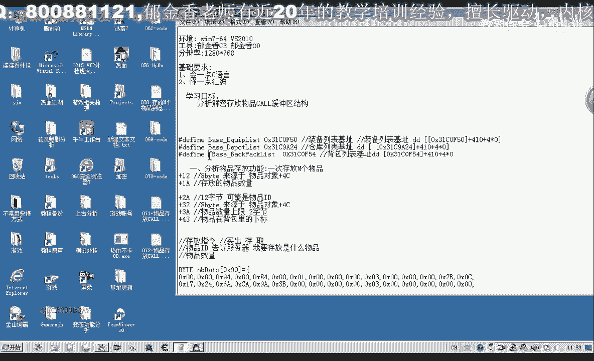
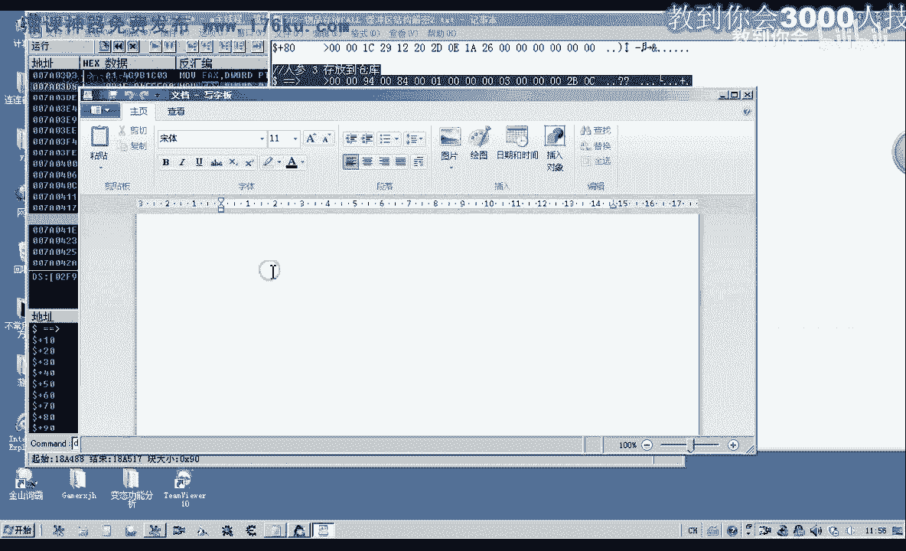
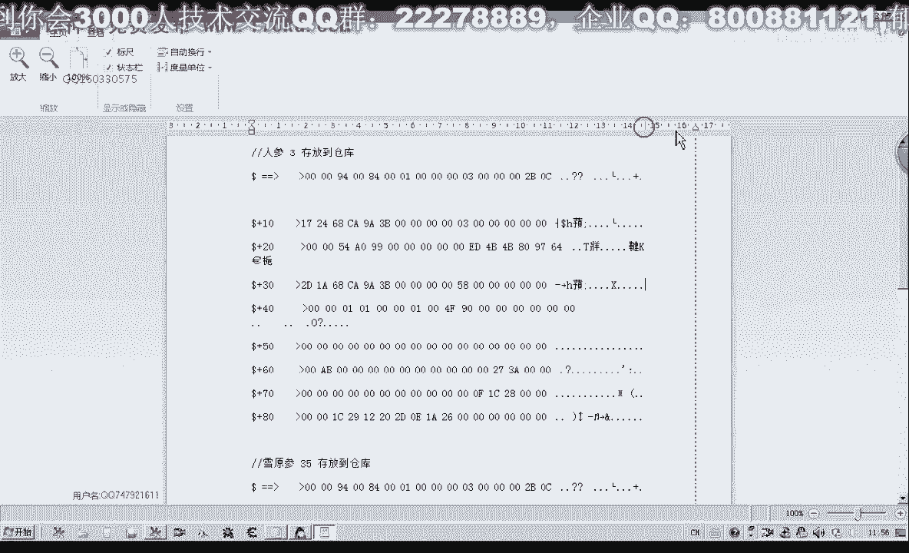
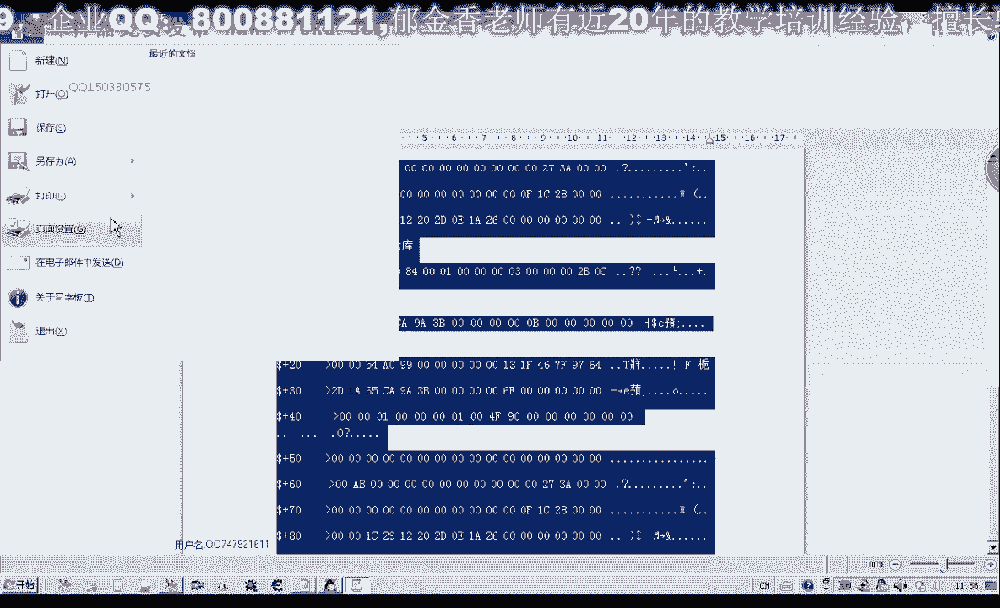
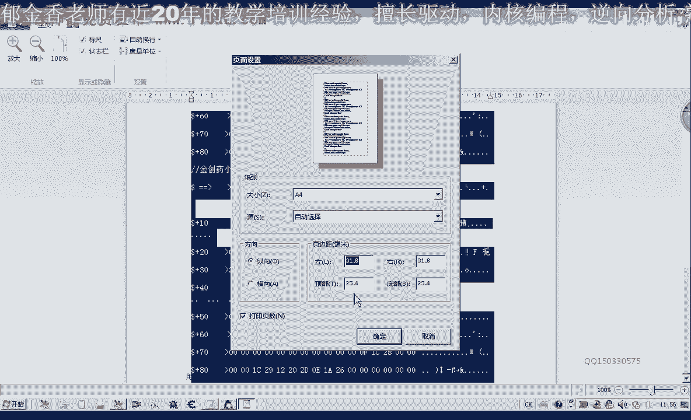
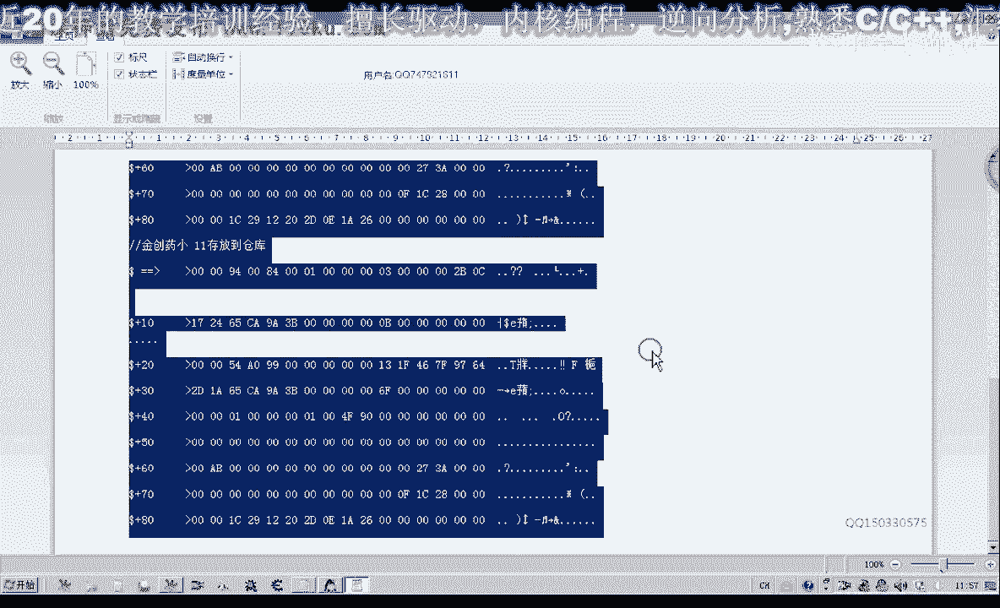
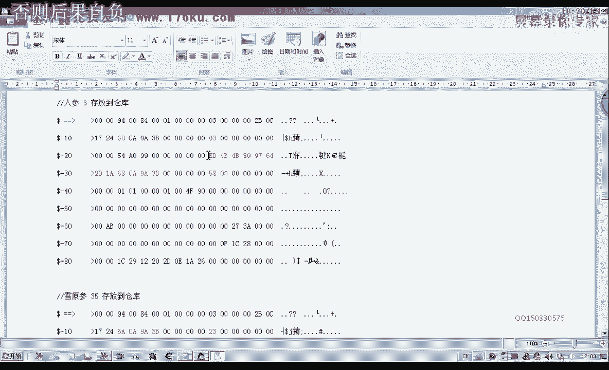
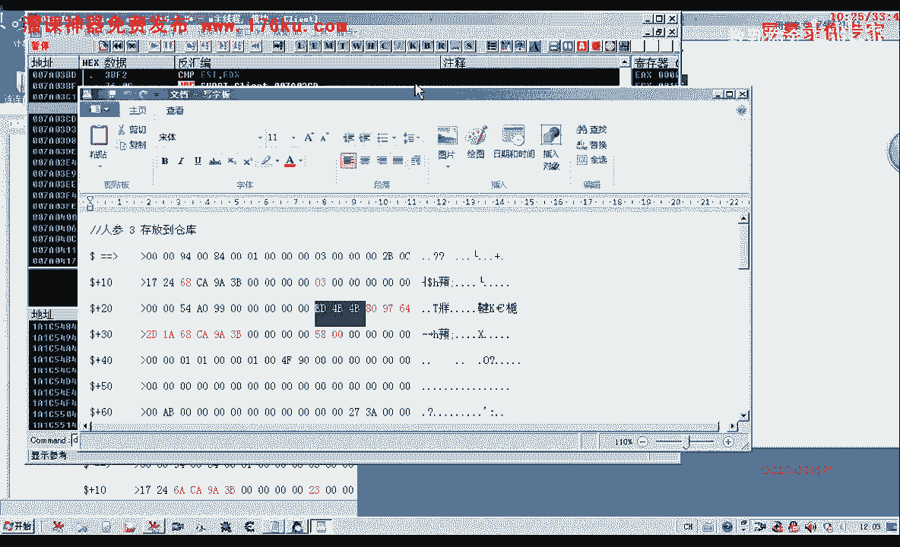
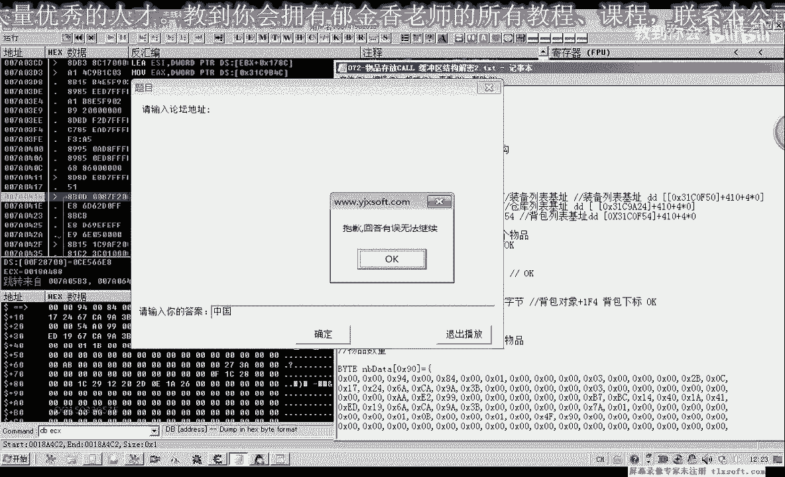

# 郁金香老师C／C++纯干货 - P61：072-物品存放CALL 缓冲区结构解密2 - 教到你会 - BV1DS4y1n7qF

大家好，我是郁金香老师，那么这节课呢我们继续呃，分析这个缓冲区的结构，那么这个结构的话，实际上呢，那么我们继续看上一节课的分析。

那么首先呢我们进入到游戏里边啊，对相应的这个地方来进行下段，那么首先我们，把这个人生啊存放一定的数量，到我们的仓库里面，那么这个时候呢我们d c d b d c x，把相关的数据呢我们抓取出来，前面的。

90个字节左右啊，16进制的，那么这是人生数量三，存放到仓库，再让它跑起来，然后我们再重放一下雪原声啊，也是存放了35个到仓库，d b e4 x，好的，那么我们也把相关的数据来也复制出来，让他跑起来。

那么我们再存放一个金窗，要小到我们的仓库里边11个，好的，那么我们来再来再次来比较分析一下，看它哪些地方是改动了的，数据是关键关键的这个地方，那么我们第一行看过去，那么第一行的话都是相同的啊。

那么呃不相同的呢，它是从第二行开始，那么我们再来看一下第二行，那么为了方便比较的话，我们可以来把这一段数据啊，放到我们的写字板里边，因为写字板里面呢它可以上颜色啊，我们可以把它区分出来。

那么我们把这个页面设置啊，设置大一点边距。

或者是设为横向，这样我们好好比较一些。

那么我们来看一下从第二行开始嗯，179a1724 啊，这里前面这里是六八啊，那么我们这里来找一下颜色相关的，嗯，那么这个地方呢它是不同的，后面都是c99 位啊，3b那么我们再接着看，这里是二三嗯。

然后呢这里是零币，那么这个呢是数量2350地，这里这里呢表示11个，这个23呢这里呢表示的是35个，这里呢是数量三，好那么我们接着再往后后边比较，54a099 ，然后从这个地方开始的话不一样。

那么这上面呢我们从这个地方开始呢，它也不一样，以及下边这一串，ca 6这几个应该是不一样的，c，那么我们从颜色这个标记来看的话，应该就是这一段大概有这里六个字节，加上这里的三个字节。

可能是十个字节左右的这一段数据，当然也可能是这一段也加上，因为它的编号的话，可能呢这是它的低位，那么高未来可能没有变啊，那么一般来说是四字节的这段数据，那我们再看一下d501 后边的。

这个地方它也不一样，473位a b，那么在后边这一段的话基本上都是一样的，那么最明显的就是，这一长串的这个数据不一样，那么我们先找一下这串数据的来源，它来源于什么地方，那么在这里的话。

我们数一下这里的话，ea这里是2a开始的，瑞瑞开始的大概有，12个字节啊，那么这12个字节呢，可能是我们的这个关键的数据，可能是指令动作，或者是我们的好物品分类id，好的。

那么我们对这段数据的来源进行一下啊，分析2a这个地方，那么我们再来这里看一下啊，e d i，那么这里呢他取的是啊，e d i是从a这个地方开始取，那么我们这里是2a的话，要减掉这个a的这个偏移。

就相当于是来源于我们的，在前面啊，这里是edi，数值还行，那么我们的e si的话，也就是相当于是从178c啊，也就是我们的它的来源的话，也就是1b x加上178c，然后呢我们还要加上一段数字嗯。

还要加上一个2a减掉a，那么这才是它相关的偏移的一个，数据的来源，那么我们再次下段啊来分析一下，看是不是这样，以人生为例嗯，这个时候会断在这个地方，那么我们看一下啊，前面我们计算的这个偏移，试一下dp。

那么这里是1d4 b开始的，我们来看一下金疮药啊。

2d1 a6 a4 a9 a3 b，那么这一长串后面的后面的都是零啊，后边的都是零，那么我们把这一串数据好复制一下，让他跑起来，那么我们用c一来搜一下这串数据，还有没有其他地方存在。

这个时候呢我们选人bt数组，那么我们搜索一下，那么这个时候呢我们搜索到的话，只有这一个地方存在啊，也就是我们刚才说的，1b x加上179c啊，那么我们先把这个地方来添加进来嗯，那么说明的话这一串数据来。

它可能是组合的哈，来自多个地方，不是来源于某一个地方，那么这个我们可以来先找一下ebx，它的一个机制，那么再一次我们让他断一下，嗯下一个相关的断点，好让他断一下断一下，我们看一下ebx现在的数值，嗯。

让他跑起来，那么重新搜索，那么在这里呢我们选新搜索四字节，那么这里呢我们会搜索到两个地方嗯，我们把它添加进来看一下，这个地方是绿色的，它可能是机子，那么是机子的话，我们可以在ot里面可以搜索到。

那么注意这里这里这个机子很多啊，那么这里呢有一个备注，那么备注的话，那么也就是说，刚才我们那一段数据的来源的话，也就是说这个ebx，减掉这个位置，这样来的啊，这一段数据12个字节，好我们把它记录一下。

然后把这段数据来复制出来，嗯那么这12个字节的话，也就是我们要找的这个关键数据，那么我们得先找一下它的来源，因为这段数据的话，我们不同的不同的物品呢它是会变化的啊，从二类这个地方开始。

那么比如说血延伸的话，那么这一段数据呢它就会变动啊，那么我们再来测试一下，如果是选原声点确定，那么这个时候的话，我们这一段数据呢它就变动了啊，就变动了，就从这个eb 4，b4 b变成了b7 什么什么的。

那么这段数据既然在变动的话，就有就有另外一个地方来，像有一段代码，像这个地方来写入这个数据，那么所以说我们要找到它的来源的话，我们可以来在，然后呢我们再另外出售这个啊，存放金疮要大，但是我们发现了。

还没有开始开始输入这个数量的时候呢，它就会断下来，那么在这个位置呢，nbx加17s，这个地方呢会写出我们的数据，我们来看一下1c x的数数值，那么ec x的话就是这个啊，634c a a b b。

那么我们看一下金川要到，那么也就是写的这一段就从二代开始的，写的是这这一段哈，数据就是我们的634c aa bb，那么从这里开始，那么我们找一下这个ec x数据的来源，往前边走。

它是来源于1a x加五四，那么这一段数据我们按一下新号，转到我们在1p这个地方，那么在这里面找，大于2e4 x的话，它来源于多少呢，来源于我们的ex加五四，那么这个ex它又是一个什么对象呢。

那么我们可以来看一下，那么在这里呢我们也发现它加c，这个位置呢是下标，这里呢是ea的这个类型，那么我们用dc来核实一下，那么这个时候呢我们能够查到查到哈，回复生命300金仓要大啊，那么也就是说。

它实际上这段数据的来源的话，来源于我们的1a x加上五四啊，这个地方也就是我们的这个来源，那么后边的话那这里就是金创药理啊，大概是前面八个字节啊，那么加再加上八个字节的话，大概就是我们的嗯。

这个金创要大的这个字母了，也就是说前面它只有八个字节的位置呢，它是表示我们可能是物品的id，那么我们再核对一下，那么这里有个09441d19 ，那么这里有一个09441d19 ，那么这是我们经常要到啊。

那么如果是回程符呢，那么可能的话也是也是这个地方，这四个字节，再加上我们后边的这四个字节，那么我们再来看一下，这个时候，先把这个断点哈取消掉，那么这个地方呢是人生啊，人生的话是在第一个。

那么它前面呢也有，这八个字节啊，后面的是人生，那么我们来看一下这里有没有相关的，那么人生的话，这里呢也是我们说的97642底，因为啊那么也就是我们的这八个字节，那么后面的这里还有14个字节啊。

可能是这一个字节，它又来源于什么地方呢，那么我们再看一下，这附近有没有相关的数据，那么我们在这个位置啊，能够发现和相关的这个数据，684a9 a3 b啊，那么这里呢，那么这也是一个好像。

也是一个数据的一个来源，那么我们再次来看一下，那么这里呢这段数据在后边，也有这一段数据啊，那么这个数据呢它出现了两个地方，那么也就是说这串数据呢可能是i d，那么这个可能是物品的类型啊。

这一类的反正也都是相关的一些数据，实际上呢从我们的这个分析的话，它都是来源于我们物品的一个对象，那么我们再做一个测试，嗯今天要回城符吧，啊这个金窗啊，我们是人声啊小，然后我们来看一下它的一个这个缓冲区。

那么缓冲区的话也就是我们说的啊，从二类这个地方，那么这段八字节的话，它实际上呢是来源于我们的，加上这个地方加上5c，嗯应该是看一下之前的，我们退回来，按减号，应该是加上五四这个地方啊。

那么这里呢有八个字节，1d cb加上我，我们再来看一下9764，271a，再来看一下e4 x那么ecx的这一段数据，这八个字节，恰好也就是来源于我们五四的啊，这里呢有八八个字节。

那么这里八个字节反正是关键的一个数据，数据的一个来源，那么另外呢还有一个，也就是我们从幺二这个地方开始的，还有这里从三二这里开始的一个四字节，那么这四字节的一个数据呢，9a3 b哈，68c a。

9a3 b，这个呢，它来源于我们的，加上好像是四八这个位置，db啊，18还要加上四字节，应该是4c这个位置，那么这里呢它也有四字节的一个数据啊，一个数据，然后用来填充我们，这个缓冲区的幺二开始的四肢。

那么另外呢还有一个呢，我们这里是它的一个数量数量下来，这里好像这个位置，那么我们再一次来确定，我们就知道了，嗯比如说我们的这个物品，它是幺幺，所在的下边幺幺是b，那114b的话应该是在在这里哈。

是四这个位置，4343，这里一字节呢，那么我们把它备注一下，13这里一次警，那么数量呢是在ea这个地方啊，记得看，大概这里是两字写的样子，啊，那么幺二这个地方，幺二，那么这里呢幺二的这四字节只有四字节。

来源于我们物品对象的4c啊，这个地方保存一下，然后再是我们的数过来，这里是三二类，这个地方有八字节啊，到这里八字节的来源于我们的五四，这个地方我们再退回来，源于五四，这里不是12自己是八自己。

加五次一共是八字形，那么五四过了之后呢，我们这里有一个三二，幺二和三二呢都是来源于同一个地方，加32号，加幺二的四次解，都是来源于物品对象的4c，那我们再次来看一下，就差一个图四啊，三。

那么我们可以看到这个哈ef 4这里啊，它实际上呢就是表示了它一个下标啊，从这里写入的呃，1b x加上1v94 ，1v9 c啊，这个属性，ef 4这个地方呢，一个属性的对象，那么所以说我们也可以说。

那这个一字节呢，加上1f4 这个地方，但是呢它就只有一次机，那么这一次节呢表示的嗯，应该就是我们汇报的一个下标，好的，那么我们再整理一下，那么大致的话3a这个地方啊，物品上涨数量上限两次减。

那么我们再来核对一下啊，这个我们合作也清楚的，我们写一个ok，那么这个地方呢我们也是啊强化好，这里也是我们三二，这个地方只有四次酒，那么3a这个地方是不是物品上限，我们再来看一下，那么物品的数量的属性。

我们先要确定在哪里，那么我们看一下七八啊，第一个是100，那么我们再来看一下它的物品数量，之前我们分析的物品数量是444，这个位置641 百啊，那么我们看一下这里有没有cs 4相关的。

那么这里有一个34啊，物品数量，那么物品的数量呢它也是写到了这个地方，那么也就是，相当于是从他所拥有的一个数量，那么我们再来看一下，比如说这个精通要小，我们存放三个到仓库里边，那么我们来看一下缓冲区啊。

d b e4 x，那么我们来看一下啊，这里是三，那么另外呢它物品上限是六四，我们在这里看到的物品数量上限，3a这个位置我们看一下啊，这里呢有一个六四，就是物品的数量的上限啊。

那么这里呢应该是可能是两个字节啊，后面这个零命这里，那么现在我们分析的可能是一个事情，当然都可以用化在后面是零零的，因为这个物品的数量的话，它可以比较大还是好，那么我们再来看一下呃。

用这个金疮药到它一共是360个，我们断下来再看一下，那么这个时候呢它这里的数量呢是六八，我们计算一下16进制的六八等于多少，那么这个时候呢等于104，但是我们看到后面这里还有一个幺啊。

还有一个还有一个腰，那么如果是用一个字节来表示的话，就不对啊，那么这里我们加上高位的这个数字，1680168相当于是16进制的，注意168，那么我们转换成十进制的，刚好就是360。

那么说明这个数量的上限的话，至少应该是两个字节好的，那么这节课的话，我们基本上啊，可能是应该是分析的差不多了。

数量两次减，那么这个物品数量的上限呢，来自于我们物品注意象，加上我们的1f4 这个地方，那么我们再来看一下对一下，那么它所在的下标我们再来看一下是多少，那么他这个所在的下标的话。

大概是6424242526 27，大概是27，这个地方27的话应该是1b，b41111 加162 17，那么我们来看一下呃，首先来看一下，它的名字c，金装要到加上1f4 。

dw来看一下ef 4还是ef 8，ef 4，二七，那么这是ef 4呢，是它的这个下标，那么数量的话好像是c44 ，这是下标，c4416 ，这是357，刚才是360乘了三个这个数量在里面。

那么至少呢它是两字起的，那么也可能是嗯，它同样的可以表示这个数量啊，那么我们暂时把它写成两字结论，那么后边如果是分析有其他的这个改动呢，我们可以再变，加上我们的零，c40 这个点，好的。

那么这节课呢我们的分析呢就到这里，那么应该说的话基本上可能已经完成了，其他的还有一些数据了，那么我们直接来可以呢，从我们的，可以直接用我们前面的啊，这里面的这个数据，因为这一部分数据的话。

除了我们改动的这些数据呢，我们基本上都已经分析出来了，就是这些偏移，那么其他的呢数据呢都是啊，这个不经常改动的，那么我们直接用这个缓冲区，初始化的这一串数据应该就可以了，那么我们下一节课呢。

再对它进行相应的测试。