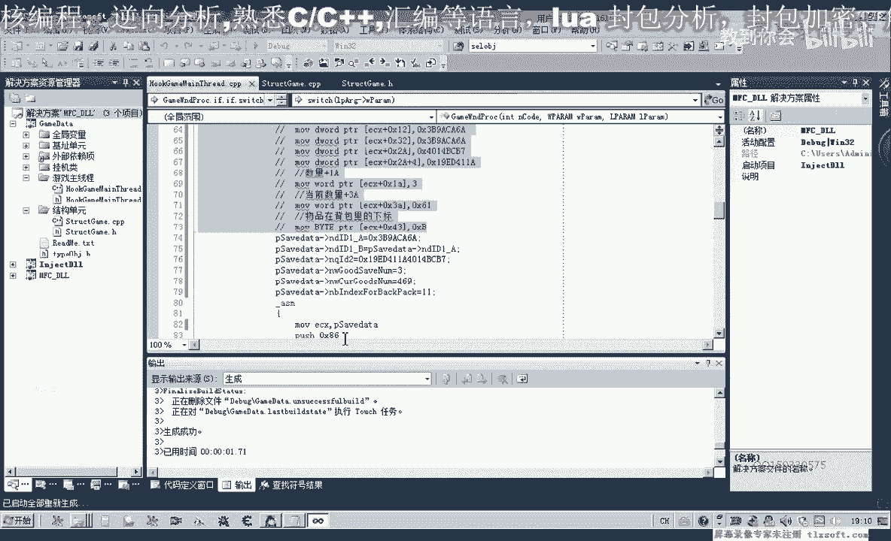
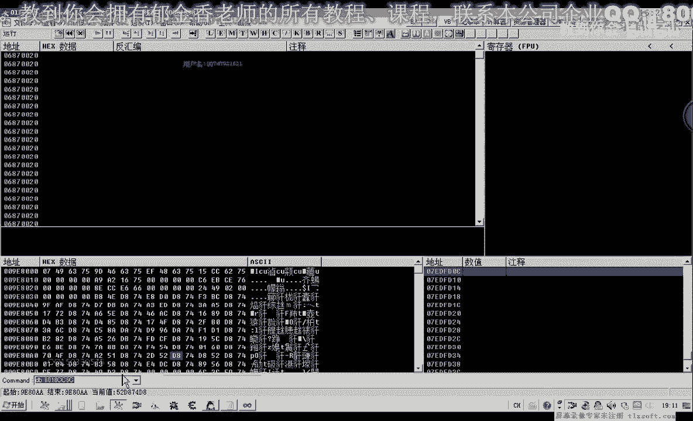
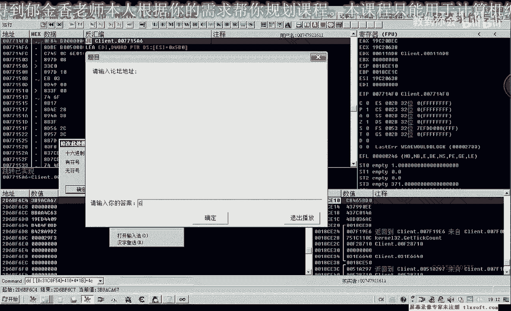
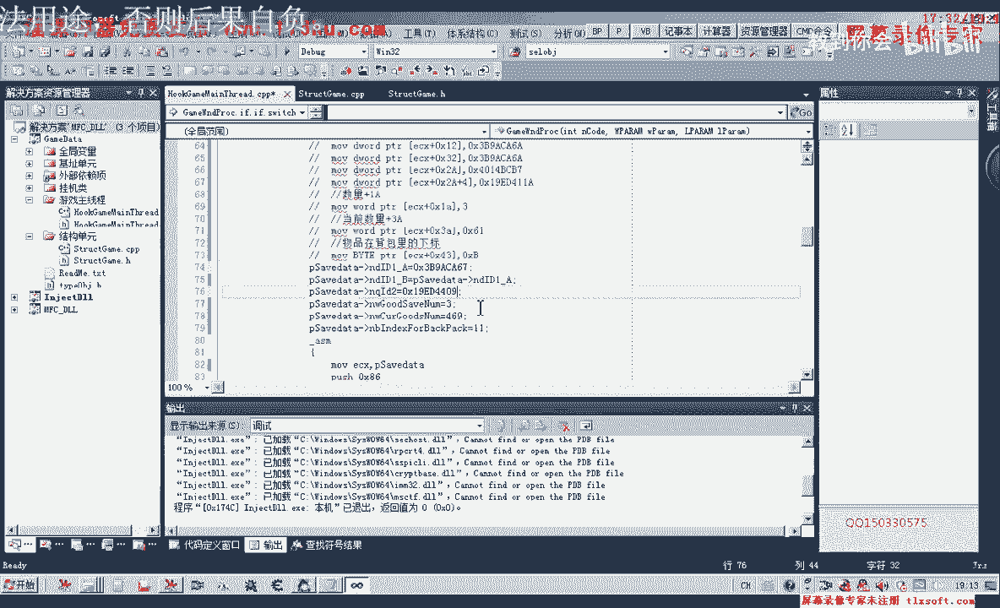
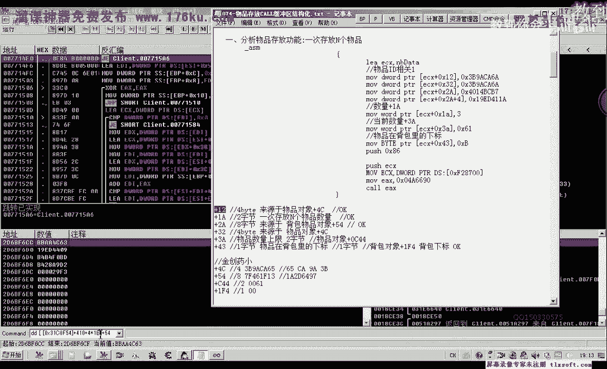
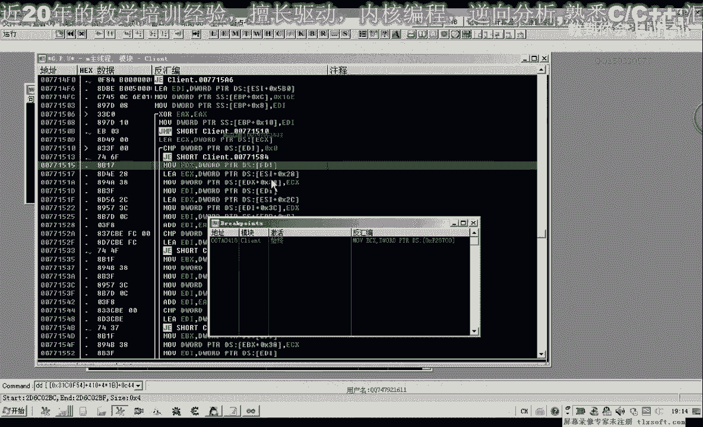
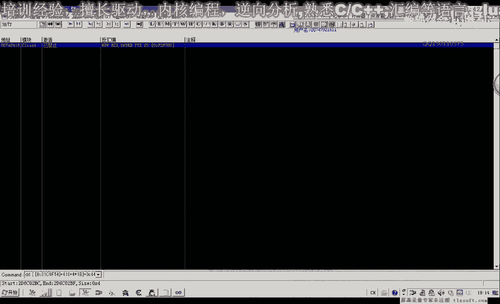
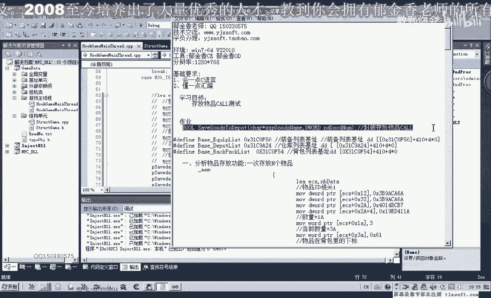

# P63：074-物品存放CALL缓冲区结构化 - 教到你会 - BV1DS4y1n7qF

大家好，我是郁金香老师，那么这节课呢我们对上一节课的代码进行一些优化，那么在为我们的这个存放物品的扩呢，嗯定义一些结构啊，并且对我们的背包对象呢添加一些呃这个属性，那么我们先打开第73课的代码。

那么我们先移移动到我们的结构单元，然后移动到背包对象这里，那么我们的背包对象呢，现现在新增加了几个属性嗯，也就是我们的4c偏移，这里有一个呃，我们可以把它取名为i d e。

那么还有2a这个地方呢有一个八字节的呢，我们可以给它取名为i d2 啊，这两个都是与我们存放这个数啊，物品相关的一些属性，嗯，那么这个是四字节的。

我们可以用这个int或者是d word这一类的类型来表示，那么还有一个呢是加五四这个地方，那么这个地方呢是八字节，八字节呢我们可以用d word的数组来表示，那么也可以有一个coword。

这个呢它可以用来表示我们的八字己，那么我们再来看一下，那么除了这两个之外啊，还有一个属性和物品对象c44 啊，这个地方的偏移给它改一下c44 ，那么这个属性已经有了哈，物品数量的另外一个呢是背包的下标。

那么它来源于呢来源于ef 4，这个地方是一字节的，那么这个呢我们可以是char或者bt啊，只要是一次性的就可以嗯，那么大致呢就是这几个属性，ef 4 c44544 c啊，那么这几个属性。

那么添加好了之后呢，我们再背包的初始化函数，这里呢还需要添加相关的代码，那么我们把前面这句代码来复制一下，那么首先呢ide这里这里呢我们需要读出数据啊，是d word类型的，我们需要读出四字解就可以。

那么在这里呢我们也需要给它定义一个相应的红，用来表示id的这个偏移，那么这个呢我们是id，下面这个我们给它表示为id 2，那么他们的偏移也不一样，这里是4c，这里是五四，好，那么后边呢我们还需要有一个。

下表豆先移加e f4 ，这里这里呢是一致结论，那么这里呢是八字节的，那么这里定义完了之后呢，接下来呢我们对它进行初始化，i d一的，那么下面一个呢是i d2 ，idea呢这里我们要注意它是八字节啊。

这里我们需要用cover啊来表示啊，一次性的读出八字形，那么读到是i d2 这个地方n q，那么还有一个也就是我们的下标，那么这个呢我们读取一致解，哈哈哈哈哈，好那么现有的这三个属性呢。

我们都给它进行了相关的这个数据的读取下标，那我们再来看一下啊，还有一个是物品的数量啊，那么这个数量呢在之前这个位置呢我们已经有读取了，那么大大致的话就是123，就是这四个属性，那么这个数据的话。

我们可以通过我们的这个代码呢把它初始化进行读取，那么接下来呢我们要定义一个结构啊，来就是存放我们的相关的这个数据的一个初始化，让我们这段代码呢更具有一个可读性啊，这这种代代码我们都是直接用汇编来写的。

这样的，话我们如果是另外的人看到的话，嗯这段代代码的话，可能他就不知道是什么意义，那么最好来我们用结构指针来进行这个相应相应的复制，那么这样呢这样的话显得更加的专业一些，那么我们可以在。

这个结构单元同文件的最后来添加我们的相关结构，那么首先呢我们把相关的这个结构呢啊啊啊不是进的这一段，那么我来解释一下它的一个大致的一个意义，那么首先呢这里呢我们要用一字节来对齐。

不然的话啊在前面的话可能这个偏移就会错位，那么首先呢我们第一个啊这个i d e啊，这里表示的是i d e，那么这个i d e的话它是四字解啊，四字解，但是它的偏移呢是从幺六这个地方开始的。

我们再移到前面来看一下啊，是从幺二这个地方开始的啊，那么所以说在前面呢我们定义了三个字景啊，那么加加上他自己一起来，那么在前面这一段数据所占的这个字写出来是幺六啊，16进制，的幺六个字节。

那么再加上这四字节呢，就是我们的1a啊，那么所以说这个数量呢它的偏移呢是从ea这个地方开始的，那么如果我们用指针指向这里的之后呢，那么我们就可以对ei这个偏移了，对缓冲区数据ea这个地方呢进行操作。

那么后边的也是一样啊，我们定义的这种nb多少多少开始的都是现在还还不知道它意义的呃，一些数据，那么对于我们有意义的，比如说这几个哈，一个是我们背包的下标，那么还有一个是当前物品的数量啊。

这个来源于物品对象c44 ，那么这个idea是coword，也就是来源于我们物品对象的啊，c这个二是这个地方，就是这上面注释的啊，还有我们物品就像五四，这里是八个字节，那么我们这样定义之后呢。

呃我们主线成单元的这段代码的话，我们就可以进行一些优化了，那么在这里呢我们就可以用指针来指向这个缓冲区，对它进行一些操作，哈哈，那么在后边这里呢我们需要进行一下运行的转换，好，那么我们再编辑一下。

那么编译之后呢，我们在接下来哈我们存放仓库数据这里，那么我们就可以把前面这一段啊数据相关的就可以了，把它，剪切掉啊，然后呢我们可以移到前面来进行一个赋值，用我们的结构来进行复制。

让它的可读性能变得更高一些，那么最后呢在这里呢从缓冲区的时候呢，我们直接就传入这个指针就行，好那么在前面的这个赋值呢，我们也可以直接用我们的c语言来进行赋值，那么首先第一个这个地方的一个负值。

就是我们的i d e这个地方，n d i d e啊，因为i d e呢它需要有两个地方进行复制，所以说把它分为了n d e a和b，好那么接下来呢就是我们ra这个地方的一个复制。

它来源于我们的数据呢是5c54 这个地方啊，那么我们在这里呢也可以对它进行一个简单的复制，嗯看来第二，那么这里的赋值呢，我们现在没有从我们的这个背包对象结构里面呢呃读取。

那么我们可以来直接先在这里进行一下组合，那么它的首先呢我们取它的高，高四八字节啊，高四字节，然后呢再取它的低低位的四字节，啊保持一下，这样呢我们就组成了一个八字节的coward的类型啊。

然后呢给它复制好，那么前面这段的复制完成了，然后呢数量1a这个地方，那么这个是我们要要就是说要存放到仓库里面的一个数量，那么这个就是我们要存放的数量，我们写为三，那么还有一个呢是我们当前的数量。

那么这个是我们当前的数量，那么当前的数量我们可以进入到游戏里面去看一下469，那么这里呢直接就是16 九，那么我们就可以不用不用进行这个16进制的一个转换，那么最后一个呢是它的下标啊。

嗯那么下边呢这里呢等于11，也就是我们的第12个这个位置好的，那么我们这样的一个写法的话，他明显的要比我们前面的这这段代码呢具有一个更高的一个可读性，但是实际上它的作用啊实际上是一样的，作用是一样的。

但是具体用哪一种方法好了，这个在于你自己的一个选择，那么我们来测试一下啊，是否可以用这段代码。

好挂接到主线程，然后呢我们进行测试，现在它的数量是469啊，存放了三个，每按一次测试按钮呢，我们可以存放上三个这个水平上来到我们的这个仓库里边，那么如果我们换成金疮要大的话，也可以。

应该也是可以进行测试的，那么我们也可以用og呢附加到游戏里面，我们进行一下相关的测试。

那么首先呢我们以这个清创药，这里的话应该是64242526 27啊，二期的话应该是，eb啊，这个地方，啊清创要到这个地方是，那么我们来看一下取他的五四的这两个字节先取出来，是在这个地方先取四字节出来。

嗯，那么这个是四色的四肢解，好四色的四字节呢，然后过来是我们的五四这个地方的八字节，那么我们先取的应该是高位，然后呢再取低位的，这四次解。

那么接下来呢我们再来看一下啊，其他的属性呃，其他的属性的话，另外一个是它的下标，下标来这里我们是1b啊。

那么这里呢我们变成16进制的1b，也就是二期啊，还有它的当前数量，我们看一下，当前数量呢是幺六，那么可能这个是四级啊，这个这里肯定是四级916，那么这里是要存放的数量啊。

比如说我们一次啊存放啊11个这个数量进去好的，那么关键是这两个i d或这个下标，这两个要对啊，就能够存放这个数据信息进去，那么我们重新编译一下。

挂接到主线层，然后我们进行相关的操作测试，那么我们每按一次来，这个时候呢就会呃把这个金窗要大哈，每次来乘放11个存放到我们的这个仓库里面，可以看到我们金创药数量在不断的减少，280269啊，258好的。

那么这节课的测试呢我们就到这里嗯，那么下一节课呢我们再对它进行一个更进一步的这个完善啊，把这个库来单独的封装成我们之前所这个所留作业的这个形式吧，那么这节课呢如果这个作业没有完成的哈。

继续完成这个作业啊，那么下一节课呢我们在，风中一个完整的函数。

