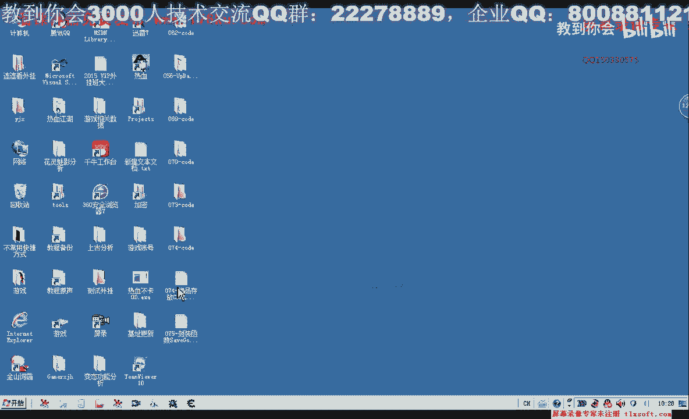
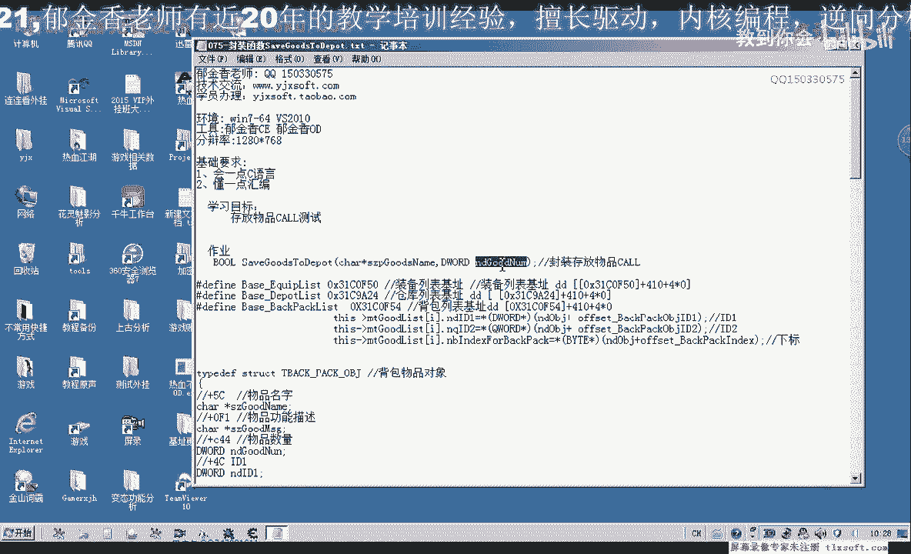
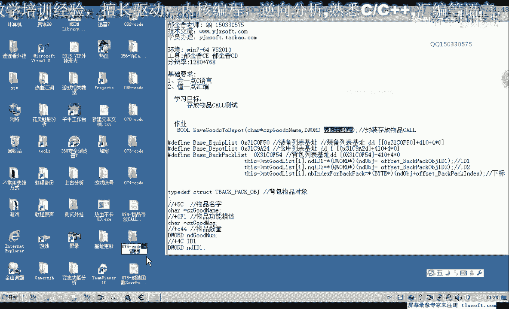
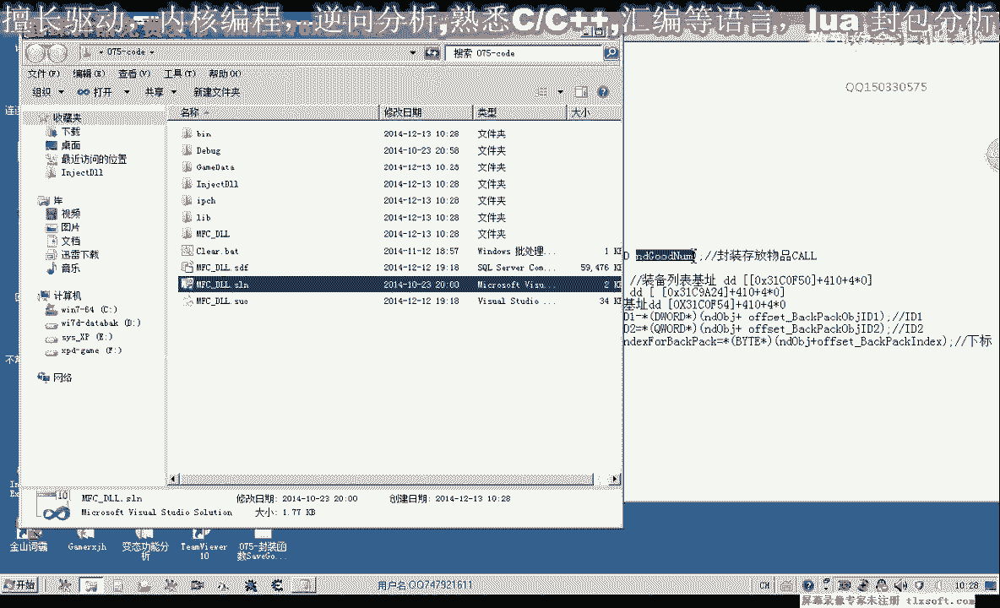
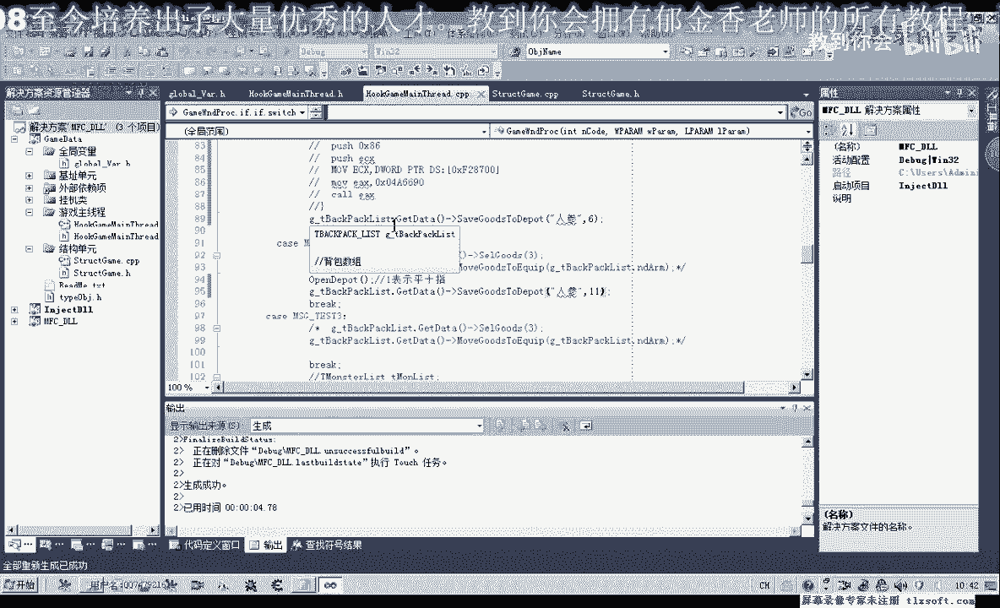
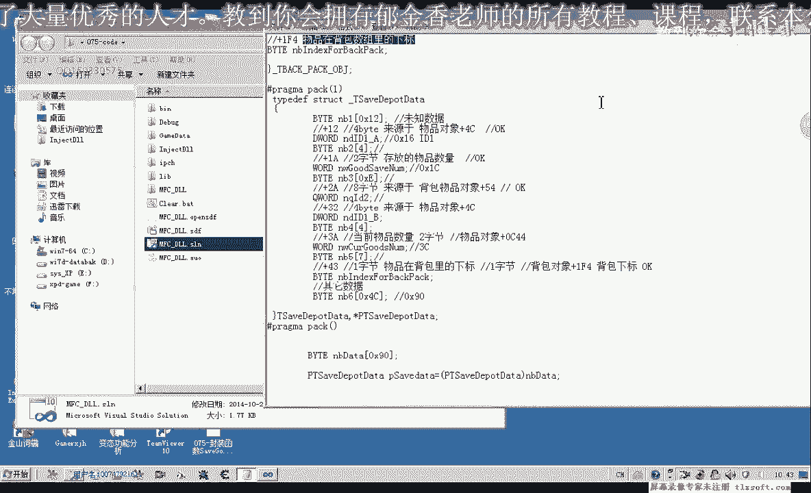
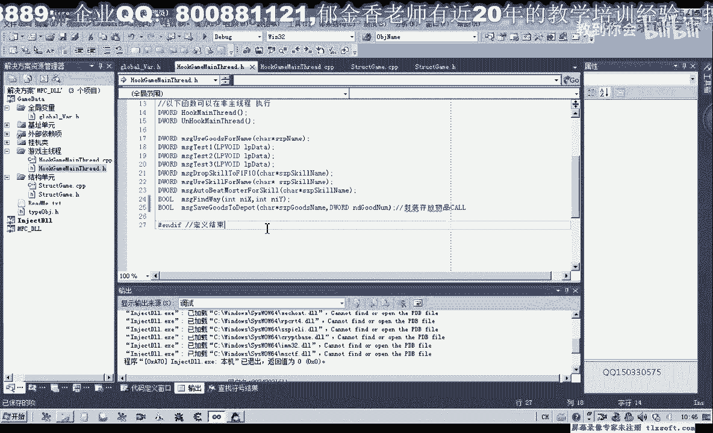

# P64：075-封装函数SaveGoodsToDepot - 教到你会 - BV1DS4y1n7qF

大家好，我是郁金香老师，那么这节课呢我们来完成前面的坐力啊。

一起来完成这个函数哈，so good to deo，那么呢我们这前面第一个参数呢是我们背包里面物品的名字，那么这里第二个参数呢是我们要存放到仓库的物品数量。

那么我们先打开第74课的代码。

展开我们的结构单元，那么我们先嗯一到背包的这个单元，那么在这里呢我们呃添加一个成员函数，就是我们的这个座力的这个函数，把它添加到这个地方，那么添加之后呢，然后我们再开始添加它的代码。

先给它加上这个前缀啊，这里可以不加，但是我们这里加上之后呢，方便我们复制，然后转到user故事分类后边，啊前边也可以，那么我们要存放物品到仓库呢，我们需要先取得它的相关的一些属性啊，采用的一些属性呃。

比如说我们之前所分析的这个id 1 id 2，还有我们的物品数量，它的下标这几个属性，那么我们需要所以说呢我们得想办法先得到这几个属性，那么呢我们可以通过它的名字呢来进行这个相关的查询。

而且我们之前已经有写的一些函数哈，那么我们可以来呃有一个get估值index for a啊，我们可以通过这个函数呢来获得它它的下标，或者是我们重新的写一个类似的函数来获取对象的一个对象。

的相关信息也是可以的啊，但是我们现在呢可以直接利用这个函数，来获得这个物品的下标就可以了，然后呢再来调用，这里我们有一个哈背包列表，然后再把再通过这个背包的这个数组呢，我们就可以得到相关的信息了。

好那么我们在这里呢先调用一下这个函数，那么我们把之前哈传进来的这个啊被包物品当同事了啊，传进来，那么我们首先看一下它能不能够正确地获取我们相应物品，在背包里面的这个下标啊，如果失败的话，它会返回-1。

那么如果这个数值为-1的话，那么这里呢我们就返回flash啊，就调用失败，或者也可以打印出一段调试信息啊，对，那么如果调用成功的话，返回的数字呢就是从零开始的一个下标，那么我们得到这个下标之后呢。

我们就可以了，调用我们啊相关的一些数据啊，调用我们成员里面啊，相应我们对象的啊相关数据就可以获取，那么获取之后呢我们就可以了嗯调用我们主线程的啊这个call，那么我们再把主线程的这一段代码进行一下复制。

把它复制到我们的，这里啊不知道这个函数里面，再转到主线程哈，那么这一段哈调用我们存放仓库的这个代码呢，也把它复制一下，那，我直接复制到这里行，那么如果是执行到这最后的话，那么我们就返回啊。

出当然这里来涉及到我们相关的扩的一个调用啊，那么我们呢在这里呢也加上一个try异常的一个处理，就是一，哈哈那么如果出现异常的话，首先呢我们打印出相应的调试信息，说明是什么地方出了错，然后出错的话。

这里呢我们也返回f，好先保存一下，那么我们看一下哈，其他的，那么这个位置的话，我们前面已经取得了它相关的背包的一个下标，那么这个数值呢de一呢我们就可以去他呃，相应背包对象的这个id的这个属性。

因为在前面的话，这里呢在这个good啊，get估值index flow呢实际上已经调用了一次这个get到题，那么我们在这个地方的话，实际上可以直接的呃用这个成员成员数组。

那么我们需要它里面的这个属性n d i d e哈，那么这样写的话可读性就要高一些，这就是我们的家是在这个地方的i d，那么第二个呢也就是我们这个位置，那么这个位置呢我们也可以直接取它这个数组里面的。

属性啊，就是我们的人口i第二这是加五四，这个地方，那么这要保存的这个数量呢，就是从我们这里啊传进来的这个参数，那么它的当前数量呢同样的是在这个背包里面的属性来取，物品数量啊，那么当时这个名字还取得。

这应该是命名呢，出错了，应该是拉姆多，那你rm了，那么最后这里呢是它的一个下标，牛批啊，这是我们的下标，好那么我们编译一下，那么另外还有使用到这个这个成员函数的地方呢，可能呢会编译会出错啊。

那么我们进行相应的修改就可以了，那么我们来看一下有哪些地方出错了，那么这里呢它会有一个提示信息，那么我们进行了相应的一个修改就可以了，你别浪，啊那么我们再重新编译一下，好那么编译成功之后呢。

我们接下来呢呃进行测试，那么再次回到我们的主线程单元嗯，那么相关的代码呢我们可以把它注释掉，这个地方这些用不着的代码呢，我们就可以把它先注释掉，那么在这里呢我们就可以直接调用我们刚才刚才的这个代码。

来进行一下测试，当然最终呢我们最好呢是在这个主线程单元呢，另外跟它封装一个啊m s级的呃，这个挂接到主线程的嗯这样一个函数啊，当然现在我们用这个m s9 开始体积了来进行测试啊，暂时可以不封装这个函数。

好的，那么在，这里呢我们直接就调用了我们的函数来，那么我们来看一下全局变量单元有没有这个背包的这个相关变量g啊，应该是g，bike bike，bike park list，这个，好的，那么我们调用一下。

先get dirty啊，然后呢我们再save so good to depp，然后呢是物品的名字啊，比如说我们就用这个人声为例，然后呢是它的数量，比如说我们存放数量三好，那么我们先进行一下测试。

特斯p3 ，这个是，那我们应该放在test t一这个单元，当然这里呢我们可以把它改成数量数量六啊，这后面呢我们改为数量三，那么这里呢我们也可以进行相关的测试，那么这里呢我们改为数量幺幺，那么编译一下。

然后呢我们打开我们的游戏进行测试。

首先挂接到我们的主线程，然后我们点一下测试，这个时候呢可以看到六个人是呢我们存到了仓库里面，然后这里呢检测12了，11个人生呢放到了我们的仓库里面，那么测试三测试三这里没有反应啊。

嗯我们看一下测试三这里我们有没有添加相关的代码，因为我们测试三这里的代码呢移动到我们测试二这个地方来了，所以说我们也如果需要了，那么在这里呢我们可以添加其他的代码，那么我们再次进行编译，再次测试。

好那么我们再次输入到游戏里边打开游戏，然后呢我们首先挂接到主线层，那么我们看一下现在的48个啊，测试一，六个啊，这里是11个啊，那么这里呢是三个人生，那么我们所有的测试都是成功的，好的。

那么这节课呢我们就就讲到这里，那么下去呢有一个坐垫哈，大家把这个save ods to depted，把它呃就是传递一个参数啊，把它封装成我们的m在这里呢我们封装一下啊。

这个相应的函数及其代码就可以解决，save故事不得碰，那么把它的参数列表传进，那么这样呢提供一个接口，我们方便呢在我们的这个啊方便在主线程之外呢来调用这个函数，好的，那么这节课呢我们就讲到这里。

