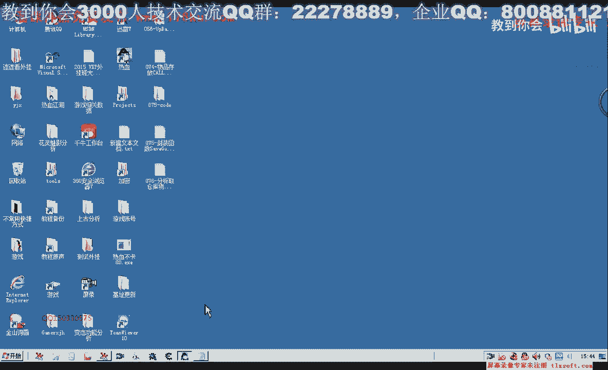
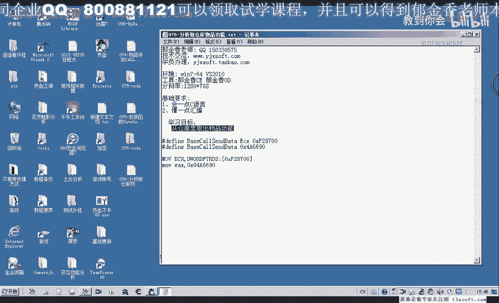
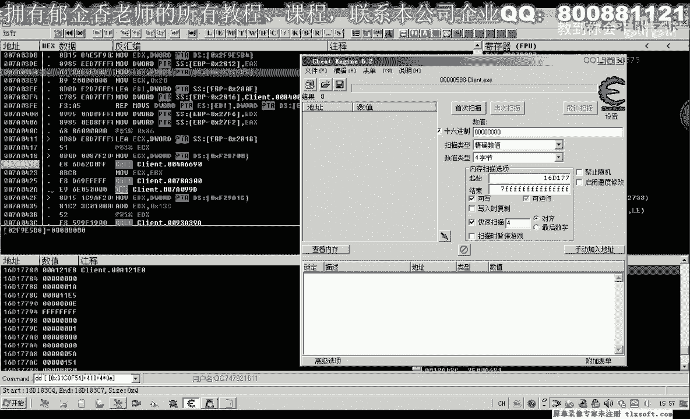
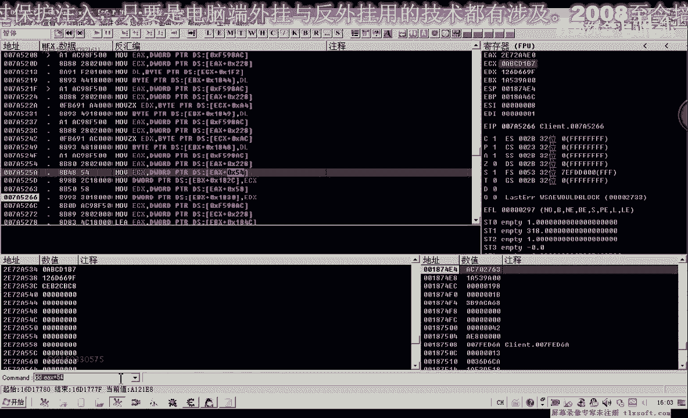
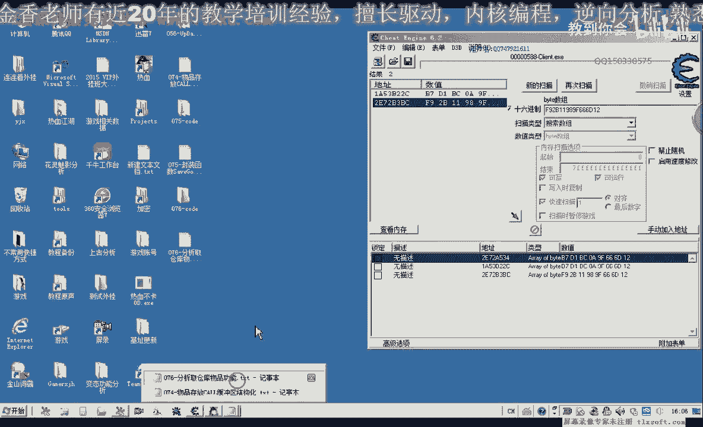
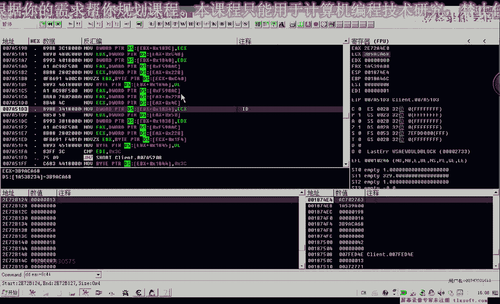

# P65：076-分析取仓库物品功能 - 教到你会 - BV1DS4y1n7qF

大家好。

我是欲金香老師，這節課我們分析一下，從倉庫裏面取出物品的功能，順便我們把第75課的代碼做一下，修改，是不是，我們當時沒有為存放物品的，它的相關的機制沒有進行定義，那麼這節課我們給它加上。

那麼首先我們移到機制單元，那麼這個應該是一個發包的一個，像服務器發包的，然後我們轉到我們，結構單元對它對我們上一節課所寫的，這個函數，替換掉它的一個相關的機制，然後再重新編譯一下，好的，保存一下代碼。

那麼這節課我們接著分析，從倉庫裏面取出物品的功能，那麼一個是前面我們分析的是一個，存放物品的功能，那麼這節課我們分析一個取出物品的功能，那麼首先用我們的OD附加到遊戲。

然後我們先取出這個物品，輸入一定的數量，然後在按確認之前，我們在這裏給它下一個斷點，當然馬上就斷下來的是心跳包，我們不管它，那麼這個時候點了確認之後才斷下來的，才是我們要找的數據，然後取消斷點。

執行到返回，那麼這裏是我們發包，那麼它的參數的來源的話是上一個，課，那麼我們再執行到一個返回，那麼這個時候我們發現它也回到了同一個，地方也是存倉庫，存放物品，看來它存物品與取物品的可能是同一個，課。

那麼我們先讓它跑起來，那麼我們先把它取名為存取倉庫的物品，那麼我們來分析一下，那麼在取物品的時候，它的緩衝區的一些變化，那麼我們再次取物品出來試一下，去拾一個，這個時候我們DB-ECX。

但是這個時候ECX由於機制已經產生了變化，我們只能用ESP+4來查看它的一個對戰，應該是ESP，或者是EBP-2818，也是它的地址，也就是站裏面地址，18A488，那麼實際上。

那麼我們來看一下它裏面的數據，一直到90的，那麼我們看一下，這個時候我們是取物品，那麼取物品的話，它的數據感覺要少上很多，要簡單一些，那麼我們來看一下，它的一個對戰，那麼這是取物品，那麼我們再來看一下。

我們存放物品的時候，也是存放11個，那麼存放物品的時候，我們來看一下，它對戰的一個變化，好，輻射到我們的剪貼板，讓它跑起來，那麼我們從這裏面的話，我們可以看一下，這前面是取物品，那麼這裏是存物品。

都是人參，11個，那麼從這段數據的話，與我們上一節課的存物品的話，好像還有一些變化，那麼我們可以對比一下，存放物品，68，那麼這個地方是一樣的，只有，這裏的有4個字節，它不一樣了。

存物品是2B0C1724，而取物品是2B2C6B4S，那麼後邊的我們可以看一下，基本上是相同的，這個地方也不一樣，還有這裏的，這4個字節是一樣的，然後這一段它也不一樣，那麼從這個來看的話，我們可能的話。

那麼這個是物品的真正的ID，那麼這一串的話，有可能是一個存取的指令，之前我們跟他取的名字叫ID2，那麼現在的話，我們就要找到這段數據的一個來源，還有也就是前面的2B0C，我們看一下。

是不是在取物品的時候，它是不是不變的，存取物品的時候，那麼我們再換一個，我們存放金創藥，11個，再把它的數據複製出來，那麼這個時候存放的是金創藥，那麼我們可以看到存放的時候，這裏都是2B0C1724。

那麼我們再來看一下取物品的時候，是不是都是前面這一個，那麼如果是的話，那麼這一段可能就是我們的存，就是說相關的一個指令，一個是存的指令，一個是取的指令，那麼有可能，那麼我們再存一下人身，存放人身。

已經再取一下金創藥，從倉庫裏面取出來，取4個，用鼠標點確定，然後我們複製出它的緩衝區數據，讓它跑起來，那麼這裏是取物品，那麼我們可以看到取物品的話，這4個字節它是不變的，那麼這裏應該是它的ID相關的。

那麼我們如果都是金創藥的話，那麼這個地方它也不變，那麼這個的話2B0C1724，它應該是一個存取的指令，我們可以把它叫做，好的，那麼我們把這個地方把它記一下，那麼這個地方的話，我們可以把相應的結構。

可以對它進行一些改動，那麼在這裏應該是，EDEF，那麼這裏應該是，EE這個地方，加上0E這個地方，有4字節，是存取指令，那麼存取指令的話，我們用16進制來表示的話，就應該是從高位的24開始。

24170C2B，那麼這是我們存放物品的一個指令，那麼取物品，那麼取物品就應該是從這裏開始的，取物品就應該是A4，A4，這裏B3，C6，B2，那麼這4個字節，我們用D2來表示的話，就可以這樣的一個表示。

當然如果是從字節來表示的話，就是與這個順序來相反，好，那麼我們再接著來看一下，那麼這裏應該是也是它的一個數量，這個位置沒有變，然後這裏，12這4個字節，應該就是來源於我們的物品對象的4C，這個地方。

那麼後邊，我們所說的在取物品的時候，那麼這8個字節的話，是來源於我們背包對象裏面的，4的8個字節，那麼我們再來看一下，取物品的時候，這8個字節它又來源於什麼地方，那麼之前的話。

我們是在物品對象的屬性裏面收到的，那麼我們這一次了，我們依然在這個物品對象，裏面來搜一下，看能不能夠搜索到，那麼在這裏的話，我們可以看到，這裏是11，12，13，這裏是14，它的下標。

那麼我們先從計算出人生的對象地址，那麼14的話，就應該是靈異，靈地，那麼我們先看一下它的物品數量，應該是靈異這個地方，140個，那麼這是我們的人生，那麼人生的地址，我們可以看一下，是從什麼地方開始。

那麼前面這一個，16D17780，那麼我們從這個地方開始搜索，16D17780。

然後我們搜索它的字節集，因為我們在取人生的時候，我們看一下取物品的時候，是這8個字節，我們把它複製出來，然後這裏還有兩個字節，把中間的空格，我們把它刪掉，注意這裏，我們要選字節數，那麼這個時候。

我們的確能夠收到這個地方，那麼我們收到一個地址，那麼這個地址的話，但是它離得比較遠，它的來源的話，不是來源於我們這個對象裏面，離得太遠了一點，那麼我們重新搜索一下，我們再搜索一下。

金創藥的取物品的這幾個字節，那麼金創藥的這幾個字節，它一共有兩個地方，那麼可能是我們搜的不完整，那麼我們看一下，66的後面還有一個6D12，我們一起把它複製出來，那麼我們現在要做的。

就是我們要把這個地址，把它複製出來，那麼我們現在要做的，就是我們要把這個地址，把它複製出來，那麼我們現在要做的，就是我們要把這個地址，把它複製出來，那麼我們現在要做的，就是我們要把這個地址。

把它複製出來，那麼我們現在要做的，就是我們要把這個地址，把它複製出來，那麼我們現在要做的，就是我們要把這個地址，把它複製出來，那麼我們現在要做的，就是我們要把這個地址，把它複製出來，那麼我們現在要做的。

就是我們要把這個地址，把它複製出來，那麼我們現在要做的，就是我們要把這個地址，把它複製出來，那麼我們現在要做的，就是我們要把這個地址，把它複製出來，那麼我們現在要做的，就是我們要把這個地址。

把它複製出來，那麼我們現在要做的，就是我們要把這個地址，把它複製出來，那麼我們現在要做的，就是我們要把這個地址，把它複製出來，那麼我們現在要做的，就是我們要把這個地址，把它複製出來，那麼我們現在要做的。

就是我們要把這個地址，把它複製出來，那麼我們現在要做的，就是我們要把這個地址，把它複製出來，那麼我們現在要做的，就是我們要把這個地址，把它複製出來，那麼我們現在要做的，就是我們要把這個地址。

把它複製出來，那麼我們現在要做的，就是我們要把這個地址，把它複製出來，那麼我們現在要做的，就是我們要把這個地址，把它複製出來，那麼我們現在要做的，就是我們要把這個地址，把它複製出來，那麼我們現在要做的。

就是我們要把這個地址，那麼我們現在要做的，就是我們要把這個地址，把它複製出來，那麼我們現在要做的，就是我們要把這個地址，把它複製出來，那麼我們現在要做的，就是我們要把這個地址，把它複製出來。

那麼我們現在要做的，就是我們要把這個地址，把它複製出來，那麼我們現在要做的，就是我們要把這個地址，把它複製出來，那麼我們現在要做的，就是我們要把這個地址，把它複製出來，那麼我們現在要做的。

就是我們要把這個地址，把它複製出來，那麼我們現在要做的，就是我們要把這個地址，把它複製出來，那麼我們現在要做的，就是我們要把這個地址，把它複製出來，那麼我們現在要做的，就是我們要把這個地址。

把它複製出來，那麼我們現在要做的，就是我們要把這個地址，把它複製出來，那麼我們現在要做的，就是我們要把這個地址，把它複製出來，那麼我們現在要做的，就是我們要把這個地址，把它複製出來，那麼我們現在要做的。

就是我們要把這個地址，把它複製出來，那麼我們現在要做的，就是我們要把這個地址，把它複製出來，那麼我們現在要做的，就是我們要把這個地址，把它複製出來，那麼我們現在要做的，就是我們要把這個地址。

把它複製出來，那麼我們現在要做的，就是我們要把這個地址，把它複製出來，那麼我們現在要做的，就是我們要把這個地址，把它複製出來，那麼我們現在要做的，就是我們要把這個地址，把它複製出來，那麼我們現在要做的。

就是我們要把這個地址，把它複製出來，那麼我們現在要做的，就是我們要把這個地址，把它複製出來，那麼我們現在要做的，就是我們要把這個地址，把它複製出來，那麼我們現在要做的，就是我們要把這個地址。

把它複製出來，那麼我們現在要做的，就是我們要把這個地址，把它複製出來，那麼我們現在要做的，就是我們要把這個地址，把它複製出來，那麼我們現在要做的，就是我們要把這個地址，把它複製出來，那麼我們現在要做的。

就是我們要把這個地址，把它複製出來，那麼我們現在要做的，就是我們要把這個地址，把它複製出來，那麼我們現在要做的，就是我們要把這個地址，把它複製出來，那麼我們現在要做的，就是我們要把這個地址。

把它複製出來，那麼我們現在要做的，就是我們要把這個地址，把它複製出來，那麼我們現在要做的，就是我們要把這個地址，把它複製出來，那麼我們現在要做的，就是我們要把這個地址，把它複製出來，那麼我們現在要做的。

就是我們要把這個地址，把它複製出來，那麼我們現在要做的，就是我們要把這個地址，把它複製出來，那麼我們現在要做的，就是我們要把這個地址，把它複製出來，那麼我們現在要做的，就是我們要把這個地址。

把它複製出來，那麼我們現在要做的，就是我們要把這個地址，把它複製出來，那麼我們現在要做的，就是我們要把這個地址，把它複製出來，那麼我們現在要做的，就是我們要把這個地址，把它複製出來，那麼我們現在要做的。

就是我們要把這個地址，把它複製出來，那麼我們現在要做的，就是我們要把這個地址，把它複製出來，那麼我們現在要做的，就是我們要把這個地址，把它複製出來，那麼我們現在要做的，就是我們要把這個地址。

把它複製出來，那麼我們現在要做的，就是我們要把這個地址，把它複製出來，那麼我們現在要做的，就是我們要把這個地址，把它複製出來，那麼我們現在要做的，就是我們要把這個地址，把它複製出來，那麼我們現在要做的。

就是我們要把這個地址，把它複製出來，那麼我們現在要做的，就是我們要把這個地址，把它複製出來，那麼我們現在要做的，就是我們要把這個地址，把它複製出來，那麼我們現在要做的，就是我們要把這個地址。

把它複製出來，那麼我們現在要做的，就是我們要把這個地址，把它複製出來，那麼我們現在要做的，就是我們要把這個地址，把它複製出來，那麼我們現在要做的，就是我們要把這個地址，把它複製出來，那麼我們現在要做的。

就是我們要把這個地址，把它複製出來，那麼人生也是人生，但是這個人生的話，它是不是我們背包裏面的人生，因為我們背包裏面的人生的話，剛才我們有計算過，背包裏面的人生是在這個位置，是在16開始的這個位置。

而我們現在這個位置的話，它也有一個人生，加上54，那麼有可能的話，可能就是我們倉庫裏面的對象，它也是54這個位置，與我們之前的沒有變化。

這個是我們所謂的ID2，之前是這樣來表示的，它，這裡是44，那麼我們看一下，它究竟是不是我們倉庫裏面的物品，那麼我們來看一下這個地方，它的一個數量，44，那麼它的數量，這個時候為19。

而好像我們剛才倉庫裏面的，人生的數量的話，也是為19，那麼我們再次來看一下它的一個變化，這裡恰好是19，那麼說明的話，也就是說我們，它的數據來源的話，也是這個位置，那麼只是我們有一個地方發生了變化。

那麼我們取物品的話，它的對象的話，就是倉庫的這個訴訟列表，而我們存放物品，它的物品對象，就是我們背包裏面的對象，它對象不一樣，那麼我們也把這幾個字節，也給它背出一下，加上，我們之前所說的12這個位置。

也是來源於物品對象，是這個位置，而加上我們的，這裡是我們的2A這個地方，也是來源於我們的物品對象，是這個地方，那是我們的倉庫對象，這裡我們取物品，就是倉庫裏面的對象，那麼其他可能還有一個。

也就是我們倉庫裏面的背包格數，我們可以來對上我們之前的分析，來做一下比較，物品在背包裏面的一個下標，那麼看有沒有這個參數，那麼實際上我們可以把這個來，因為它都是同一個庫，那麼可能有很多相似的這個地方。

我們可以參照之前分析的數據。

來進行相應的對數，那麼首先這裡我們只是要改一下，這個是倉庫對象，倉庫，那麼這裡同樣是來源於倉庫對象的4C，這個地方，應該也是我們一次要取的物品數量，取一個物品數量，1、2這個地方。

那麼這裡它同樣來源於5、4，8個字節，還有3、2這個地方，我們看到的這裡也有4字節，它同樣的是來源於1、2，這是存物品的時候，取物品的時候應該也是一樣，我們來看一下，在前面這段，補製一下。

那麼我們在存放物品的時候，這裡的A應該是10，取物品的數量這裡應該是10，10應該是A，那麼前面的這裡是B，取得人稱的數量是11個，3A這個地方，那麼3A這個地方我們來看一下，0B這是它剩餘的數量。

那麼這裡是15了，剩餘的數量是21個，那麼我們再來看一下是不是這樣，我們再來看一下人稱，這裡是19個，它當前的數量也就是13，那麼在這裡我們可以了。

把這裡的斷點先取消掉，刪掉那一層，那麼我們這個時候看一下，DSPDB來顯示一下，那麼這個時候我們可以看到3A，這個地方是13，那麼3A這個地方的話，也就是我們倉庫裏面的人稱的，當前數量。

那麼說明這個的話，它的預定也是一樣的，還有43我們看一下，那麼43在這裡它是0，代表的它的下標是第一個位置，那麼我們也可以做進一步的測試，比如說這個金創要中，當然這個時候它沒有數量，不會顯示這個框。

那麼我們先把它放進去，再來做測試，那麼我們取兩個數量，那麼這個時候我們再來看一下，43這個地方，它的下標是1，這裡也是代表了它的一個下標，那麼我們也可以用這個含義詞來做，一個相應的測試。

那麼它的下標是2，那麼如果我們取一個物品出來，我們看一下，那麼這裡它也會變成我們的數量2，因為都是這個框，存放物品都是同一個框，像倉庫存東西取東西都是同一個框，那麼所以說它的結構的話。

來說的話也是一樣的，那麼只是我們的分析當中，多了一個數據出來，也就是這個地方，B2這個地方，這個地方是加上我們的0，也就是B2，那麼加上0的這四個字節，應該就是它的一個動作指令，我們再來看一下。

那麼這個應該是它的ID，那麼加上0E這個地方，B2C6B3A4，那麼這個就是我們的取物品的指令，我們再來對比一下，看是不是這樣，那麼取物品的時候都是B2C6B3A4，這個一直沒有變。

那麼應該我們的分析應該是正確的，好的那麼我們做上這樣的一個標記，那麼這些都是一樣的，122這個地方，那麼也就是我這裡來我們對緩衝區結構的一個解密，多了一些東西，也就是0E這個地方。

還有一個存取的一個指令，好的那麼這節課的分析，我們就到這裡，那麼下一節課，我們對相應的結構做出一個修改，再進行一個相關的測試，那麼來練進一下我們的想法，好的，那麼我們下期再見。

