# 郁金香老师C／C++纯干货 - P66：077-封装仓库列表结构及取仓库物品函数 - 教到你会 - BV1DS4y1n7qF

大家好，我是郁金香老师，那么上一节课呢我们分析了啊，从仓库里面取物品的这个功能，那么这节课呢我们嗯会测试这个相应的功能呢做一些准备啊，首先呢我们把仓库列表相关的结构呢封装好。

那么首先我们打开第76课的代码，那么首先我们改一下这个缓冲区的结构，转到我们的结构单元，那么这个缓冲区结构呢，前面的我们这里呢本来前面12个字节我们都不知道它的一个意义，但是我们上一节课分析的时候。

通过一个比较好，那么我们发现呢从零异这个偏移开始的，后面的四个字节呢很可能就是一个存取的一个指令用来区分的啊，那么我们这个时候呢我们可以来在这里边呢减掉四个字节，也就是减掉四个字节之后呢。

也就是引进啊零一，那么后边的这里呢我们就可以定义四个字节的数据，来用来存放这个相应的指令，没问题，come on，那么这四字节，就是我们的相关指令。

那么这个指令的话我们已经发现的了宠物苹果取物品的这个指令啊，就是在后边这两条成物品，这是曲目平时并不或者说这个是一个发包的一个分类啊，那么我们存放物品来用用这个分类编号。

那么取物品来用这个分类编号用来区分的啊，存取之间的一个动作，好的，那么我们先把这里呢进行一个修改，然后进行保存，那么接下来呢由于我们的要用到一个仓库列表里面的，这些相关的数据啊。

所以说我们在这里呢也定一个仓库相关的结构，然后呢再对它进行一个get dirt的初始化，与前面的背包列表了，它大致是相同的定义，那么我们找到前面的背包列表，在它的后边呢，我们定义这个结构。

那么这里是背包的链表结构，那么我们在它的后边，因为这个相应的函数里面呢，它也要用到我们啊这前面的啊，这个背包对象，因为背包的对象的话和我们发现背包的对象偏移。

比如我们的仓库里面的对象的偏移呢它是一样的啊。

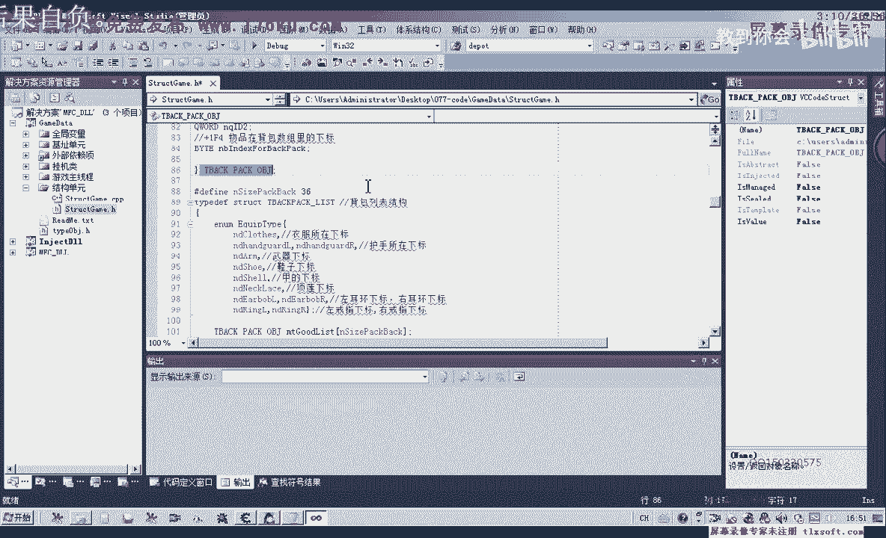

好像分队编号也是一样的，那么我们可以用d来看一下它们的分类编号是否一样。

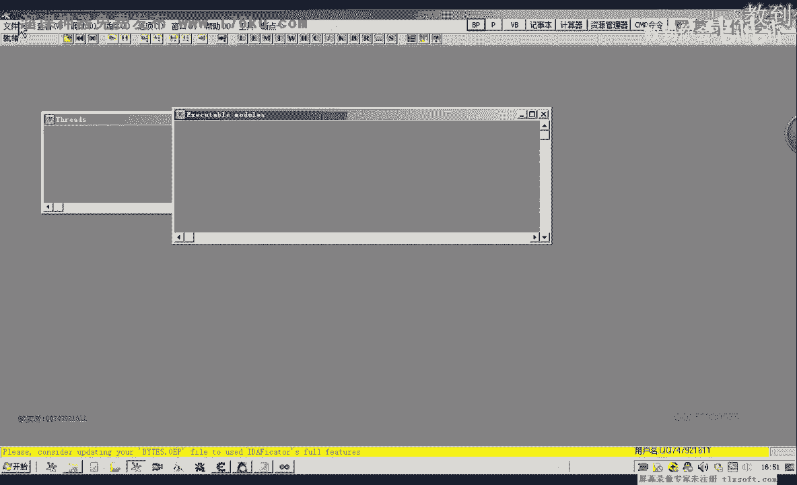

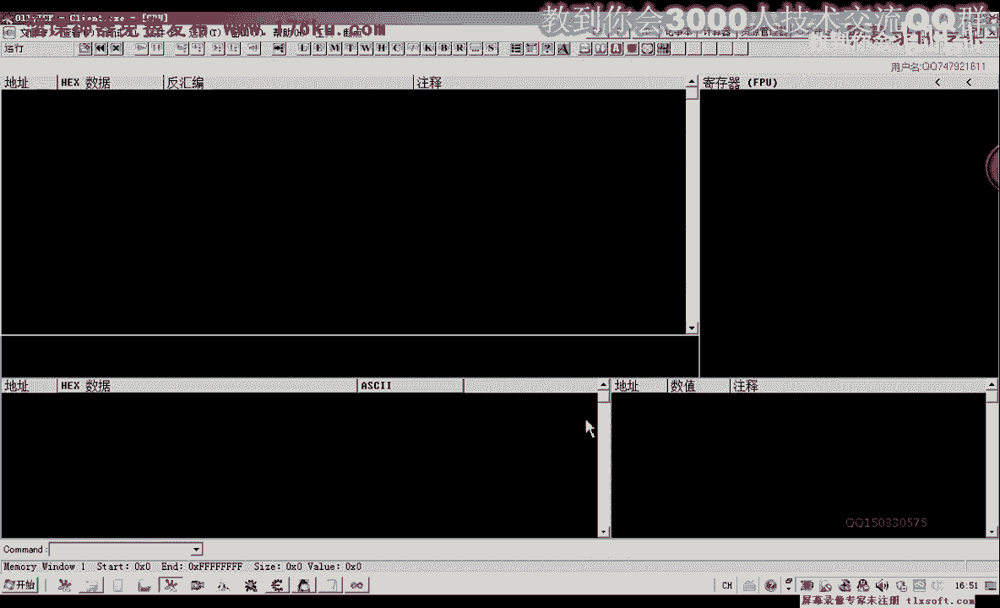

deporter mist，我记一下，那么它的类型呢是ea，那么我们再来看一下背包的，相关的公司，那么我们发现的话这两个类型呢它都是ea啊，都是ea，那么所以说它的对象类型都是一样的话。

那么我们也可以用同样的偏移来进行操作，那么所以说我们在这里定义的时候呢，也就借用了前面的啊背包对象，来定义我们的这个残酷的仓库列表的这个对象，那么它的大小呢我们可以看一下，他一共下来了，是死狗啊。

我们每一行呢是六个，那么所以说它的大小呢是60啊，这是仓库的大小，那么仓库的大小我们定义了之后呢，它里面物品的一个大小我们定义之后，那么我们也需要对它进行一个初始化，那么返回值呢也就是我们这个仓库的嗯。

这个结构类型那么好的，我们先转到我们的cp单元来对它进行一个初始化，那么为了方便复制呢，在这里呢我们直接给它加上一个呃未成员的一个限定，那么它的初始化呢我们就放在呃这个背包列表的初始化后边。

而且我们还可以来复制一下它的相关的代码，相关的代码，那么我们先把它复制一下，在他的基础上进行修改的话，我们会快得多，会快上很多，那么在这里呢，首先我们要改的就是它的一个前缀七deport poli。

好那么初始化的时候呢，还有一个机制呢，我们要改钻石以后的miss，那么同样我们要改的是它的一个大小，那么这是它的一个大小，那么其他的判断呢基本上都是一样啊，这里呢我们需要加上一个s。

或者我们在定义的时候呢，就跟他写的一样啊，这里这个s呢我们把它删掉，good list，啊，二，那么其他的话我们都可以不进行修改啊，因为我们所用到的都是一样的。

其他的这些属性i d i d及其他的要去除物品这一类的，那么我们先编辑一下，好，那么编译通过了之后呢，我们再来看一下，我们还需要添加一个相关的成员函数。

也就是very good index for name，这个时候呢我们是骗你的，是仓库列表，找到它相关的一个下标，那么我们也是仿照上边的这个函数来写标题，估值index类。

那么我们复制一下这个相关的函数，那么在他的后边呢，我们在这里呢改为我们仓库的前面函数里，那么同样的哈，这后边的写法呢也是一样，但是这个地方呢我们的写法呢要改动一下，这里的大小的不一样。

这里它的下标是60，那么后边的这些写法呢也是一样的啊，那么这里呢只是我们骗你的是一个仓库的一个背包，那我写完了之后呢，我们可以做一下相应的测试，那么还有一个呢也就是我们之前的这里有一个保存到我们的仓库。

现在呢我们是从仓库里面把它取出来，那么所以说最后这个函数，那么我们的写法呢也是仿照上面的这个写法来写，那么我们把这相应的代码呢也进行一下复制，那么复制之后呢，我们对它进行相应的修改。

首先名字我们要进行修改，还有这个结构，那前缀呢我们也要进行一个修改，那么修改之后哈里边的这些数据呢，我们还要进行移动，一定的改动，要加上一个指令，这里要变，deserve common的啊，这个要变。

那么come on，我们看一下我们区分的这个指令，那么取物品的话，之前我们是成物品，取物品的话就是这四字节的16进制的实力，那么其他的话应该说都没有什么变化，这个扩的话它也是相同的啊，也没有什么变化啊。

理论上这样我们就可以，那么接下来呢我们进行一下测试，那么测试呢我们现在我们的全局变量单元呢，这里呢添加我们的相应的全局变量，哈哈，最后啊miss，嗯，那么同样的我们要需要呢。

呃声明这样的一个变量在我们的这个跟结构源代码单元，好那么我们再次编译一下啊，在编译之前呢，我们在主线成单元呢添加我们相关的测试，那么这里呢我们把它改为depp啊，desty就行。

那么这样呢我们就啊后面的这个函数呢，我们还需要改一下，get out啊，那么这样呢我们就是每次都会从这个仓库里面呢，取出我们的相关的这个人生的数量，我们改为123好，那么我们再重新编译一下。

那么先看一下我们这里边有没有这么多人参考，有60个啊，可以供我们测试，那么这个时候我们先把o d退出来啊，这样注入的速度会快一些，这个时候没有注入进去了，是我们的这个工作目录啊。

对我们设置一下工作的目录，再重新生成一下。

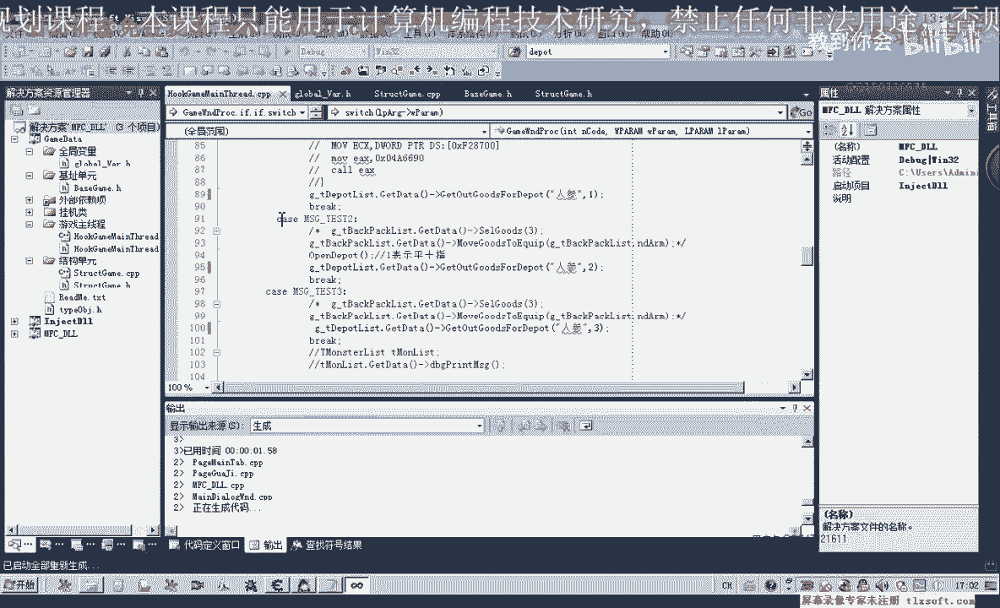

你唱，那么首先呢我们挂接到主线程，然后看一下仓库里面的人称的数量啊，测试，那么这个时候呢它会显示啊无法转移物品，那么说明的话我们的这个代码的话可能有一些错误，那么我们再接下来再对我们的这个相关的函数呢。

嗯进行一下调试，那么调试的时候呢，我们用o d啊先附加进去，看一下它相关的这个数据，对不对，那么我们现在这个相应的地方来进行下段。

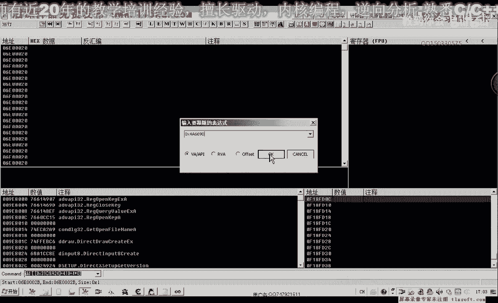

在这个地方进行下段，然后我们再次输入我们的动态链接库，这个时候断一下的话，我们先让它跑起来，会再断一下，好过一些主线程，然后下段，然后再次测试啊，断下来。

这个时候呢我们看一下它的对战d t e s p加四，好的，那么我们看一下对战里面的数据，那么首先呢b2 c6 b3 s68 80s，那么从这段数据的话看来的话，看起来没有什么错误啊。

那么我们再来对比一下指令没有错啊，幺二这个地方也看不出错，那么一这个地方我们看一下，1i这个地方呢是，一取一个物品，那么我们再来看一下后边的，他认为这个地方把自己，323a这个地方。

3a这个地方呢等于3c，3c的话，30x16=48，48+12等60个啊，这个物品数量也没有错，那么43这个位置，事实上这个地方呢为1a那么我们看一下1a的话，a等于26，也就是他所在的这个下标。

那么我们先把断点取消掉，那么这里的话我们可以看一下6424，这里是242526，那么它的下标也没有错，那么为什么无法转移这个物品，那么我们先取一个物品出来嗯，看一下比较一下他们两个的这个缓冲区。

好那么这个时候的缓冲区，我们看一下，第一批e s p加四，那么e s p加四呢，就是这个位置，也就是取出的18a488 这个缓冲区，那么我们来看一下它里面的数值，那么先把这段数字来复制出来。

然后我们自己取了一个数据来把它复制出来，啊这是正确的，这是一个男生，好先让他跑起来，那么是不是这个才是取得一个人称，3d，那么他是不是接连发了两个包，这个地方断一下哪里吃，我们看一下。

那么我们再取一次啊，试一下，可能它是有两次操作啊，这个读取人生的时候啊，存放这个人生，这是第一次操作，那么还有一次这个时候呢它还会断，下一次，一共是两次操作，那我们先先把它取消取消掉。

那么这个时候好像与我们的这个嗯，与我们的这个盛放人生这个物品的话有一些不一样，它在取的时候来回取一次啊，这是包包会发两次，这是发第二次，那么这里面都有我们人生的这个相应的id号。

那么前面这一段是相同的也是相同的，403068c3 b3 c那么前面看起来都是一样的，只是四零，这里呢它不一样，这里有个七八，后边再多了一段数据，那么会不会是我们后边这一段数据的一个填充方式，它不一样。

也可能是，那么这里还有一个我们看一下六零，那么我们自己我们看一下我们自己这里嗯发的这个数据是什么样的，数据测试，肚皮，好让他跑起来，那么这个时候呢我们这个地方呢也会断两次哈，但是断第二次的时候呢。

它不一样，那么这是我们自己发的数据，同样是取一个人参啊，前面的这个b2 c6 ，零一这里我们看一下它这里呢没有相关的这个取一个人生的时候呢，没有这个什么b26 的这个数据，这个地方全是零。

那么后面的数据的话，我们看一下，再看一下六八ca 9 a3 b，那么这个地方也不一样，这是我们自己的数据，他的数据等我们看从二在这个地方开始，那么这里的话b8069 g。

那么我们再重新取一下这个取人声的这个数据，那么我们看一下它调用的来源嗯，来源是同一个地方，那么再看一下它的数据，那么这个数据的话，我们发现与上一节课所抓的这个数据的话，好像也，有些不一样。

那么我们再次再从这个地方下段再看一下，那么然后呢他在另外一个地方又有一段数据啊，出现在这个地方又有段数据出现，那么这些数据呢我们先取消掉，再次到游戏里边，我们再抓一下其他的数据，清创药，啊，嗯。

那么这次取得我们是取得金疮药，那我们再取一下人声试一下，那么这个地方它不一样啊，一个是三，一个是五，那这个地方呢它也与我们上一节课所抓取的数据呢有一些不一样，那么可能是服务器的啊不一样。

所以说这段人还有一些差别，那么我们成物品或取物品之间的话，它应该有一个就是说应该有一个不同，那么我们再试一下存放物品，那么我们发现呢这里呢存放物品的时候呢是2b0 c1724 ，那么有先存放物品之后呢。

这个数据呢会发生一个变化，那么我们再次取物品再试一下，啊同样这个地方为零了，那么这个地方我有那么这个地方的话是里面这个地方它唯有好的，那么我们再做一些修改，那么这个地方呢我们我们做一下修改。

那么可能是这个地方是用三和五来分别来代表我们的，一个是存取物品啊，那么五来可能是用来取物品好的，那么我们再次重新测试一下。

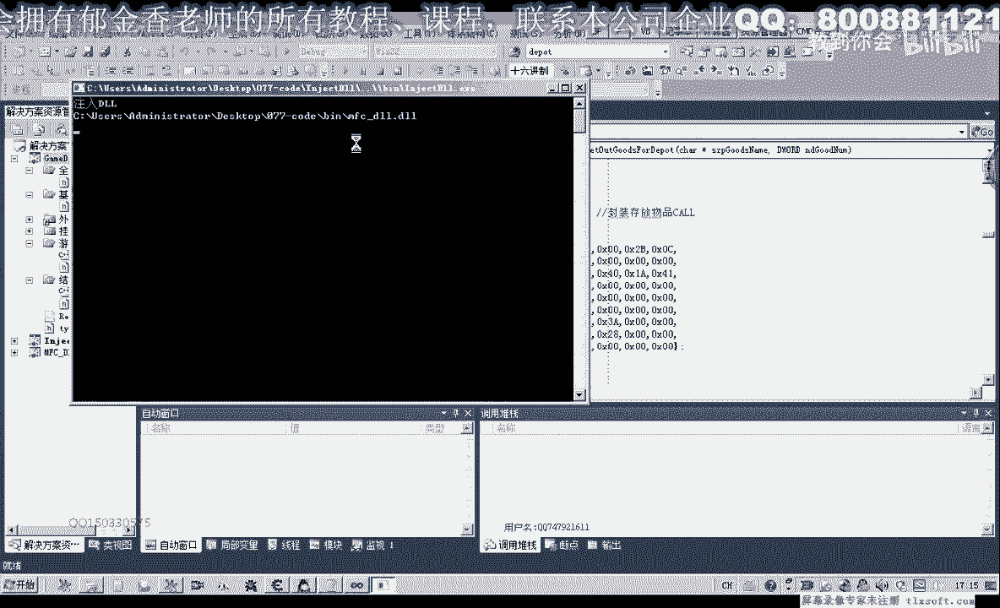

那么这个时候呢同样的物品呢无法转型，那么我们再来看一下啊，曲目屏的时候，端下，那么这个地方呢它是为零，这个地方，那么为零的话，我们再重新给它修改一下相关的指令，那么也就是说我们这个地方它问题。

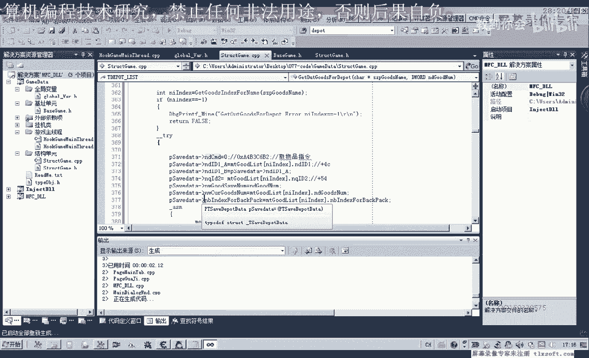

那我们再把o d啊退一下，把断点的全部要禁止掉，然后呢再退出重新测试一下。

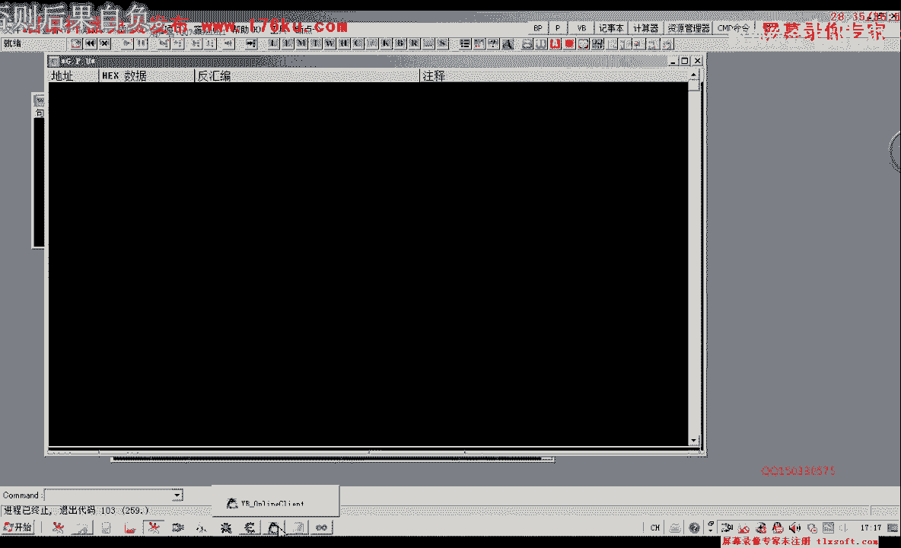

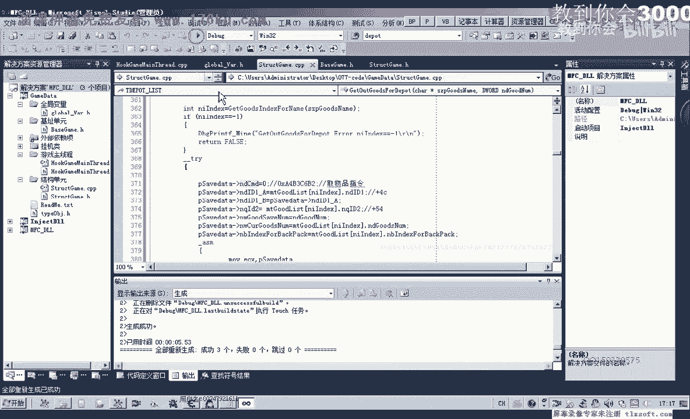

然后呢我们报接到主线程测试，这个时候呢我们可以看到呃可以获得这个人生了啊，每次来一个，这个是两个，这个是三个，那么说明的话呃这个地方的话它同样的是一个取物品的，可能是一个指令，但是由于这个服务器啊。

就说大区和小区它不一样，可能是这个取物品的指令呢它有一些变动，那么还有这个地方啊，里面这个地方的珊瑚它也是一个相关的一个指令，也可能是，那么但是这个地方呢不知道它是几字节的嗯，要分析的话。

我们也可以用ot呢加载到里面哈进行啊，更进一步的一个分析，或者是后边我们在存放物品的时候，可以更进一步的进行一个分析，查看这个数字五的一个来源，那么我们这节课呢再把，落地了，附加到我们游戏里边。

找一下这个数字五的来源来源于什么地方，是几个字节的，呜呜呜。

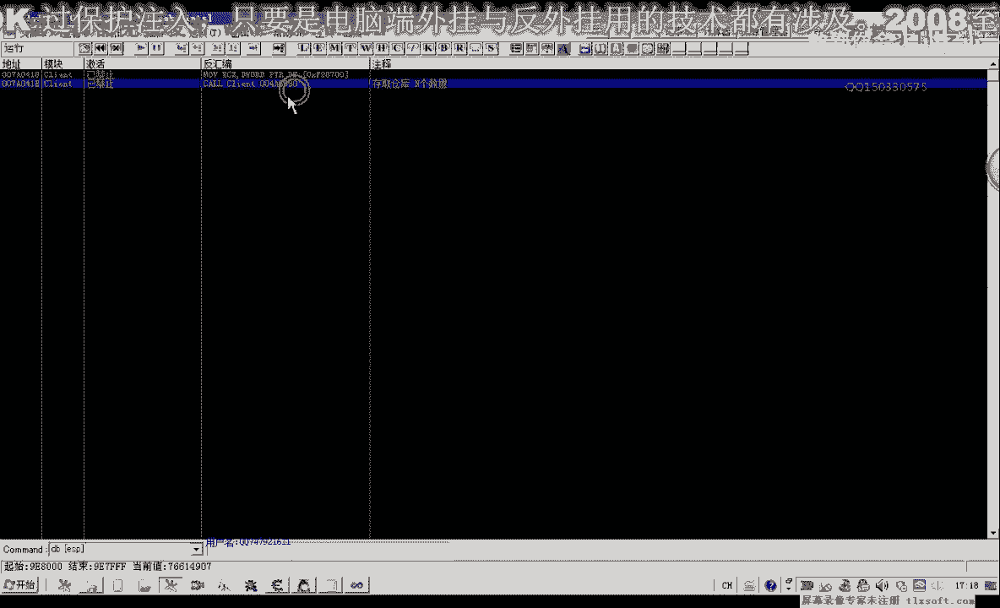

咳咳那么我们再次在这个存取物品这个地方下段呃，这之前的话我们看一下da这个地方，他恰好是写入的1874这个地方写入的第一个字节，那么我们看一下它来源于什么地方，在这个地方进行下段。

那么我们以成物品为例看一下，那么我们看一下eb x d d e b x加上1784，那么这个地方啊13啊，那么我们对这个地方呢进行一个呃内存写入的断点，看他是什么时候写入的，再次播放的时候。

我们可以看到这里呢有一个数字来自4341784，这里的它是低温的，是四字景啊，说明这个地方，那么这个可能就是一个存取的一个分类标志，比如我们上一节课所分析的嗯，那一个存取指令呢可能是呃可能不是的。

那么这个呢才是一个真实的一个存取的一个指令，那么我们把它复制一下啊，去掉为什么断掉，一个，那么取的话它是来源于另外一个地方，那么我们也可以在这里下断一曲的话是从下面这个地方转上来的。

那么从下面这个地方转转上来的话，它是1p x加1084，这个地方，那么我们重新把这个断点呢取消掉，找它的来源，那么取的时候我们可以看一下db加180c，那么这里呢有个数字五。

那么我们找一下这个数字五的来源，那么我们也可以在这里找到啊，这里呢有一个数字，那么这里呢我们还能够看到数字六啊这一类的，那么可能是其他的一个分类，那么我们暂时我们不管他。

我们只要把这个呃数字三和五先记住，那么这个呢才是一个指令的分类，那么它的偏移的话，我们看一下是，再来看一下它偏移的情况，我们，那么这个数字五呢是在0a这个位置的这四字节，那么也就是他之前的这四个字节。

嘟嘟嘟好的，那么我们再次修改一下相关的一个结构，直到最后，那么这个来come on呢，呃就有些错误啊，那么我们应该是在你a这个位置，那么后面的这四个字节呢，嗯应该是承包物品栏，应该是三取物品来。

应该是土木，那么后面啊还有四个字节呢，这四个字节我们暂时把它取名为nt come on，二八这个也是可能是一个区分的啊，但是呢我们暂时还不知道啊，没有具体的一个确定，那么同样的代码我们也要进行一个修改。

那么在这里的话我们就嗯复制为取物品的话，我们就复制微博，纯物品是三，那么我们再次进行测试，也就是说后面这个五的后面啊，这这几个字节的话可能是无关紧要的，那这这只是一种假设啊。

但是我们还是要进行一下测试才知道，挂机主线程，然后来测试，那么这个时候我们发现的话呃那个他们的二的话，那个数据预览它是没有用的啊，那么没有用的话，我们暂时来把他的名字还是改一下，就不叫come on的。

那么这四字节呢我们就用b先来表示，mp，随便给他取一个数值，那么占四字节的空间就可以了，这样方便我们对齐啊，那么这里的a呢加上这八字节呢就恰好了，等于我们的120啊，因为加上我们的八字九，好的。

那么这节课呢我们就呃那么就写到这里代码。

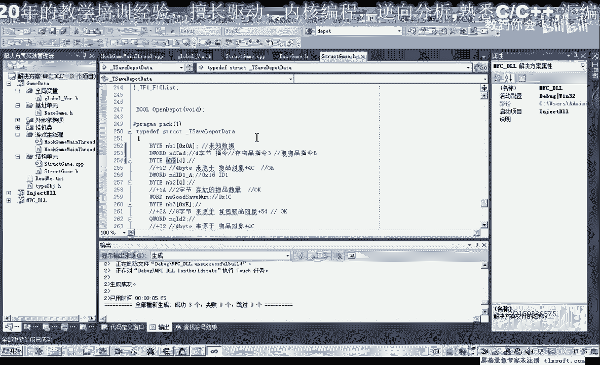