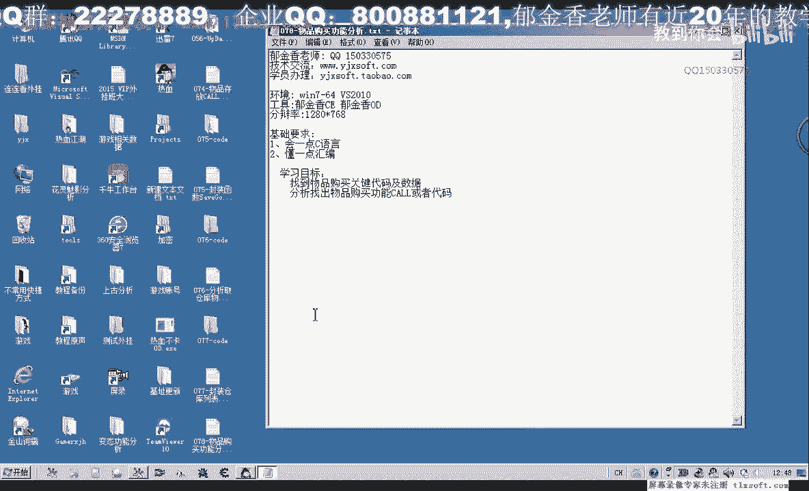
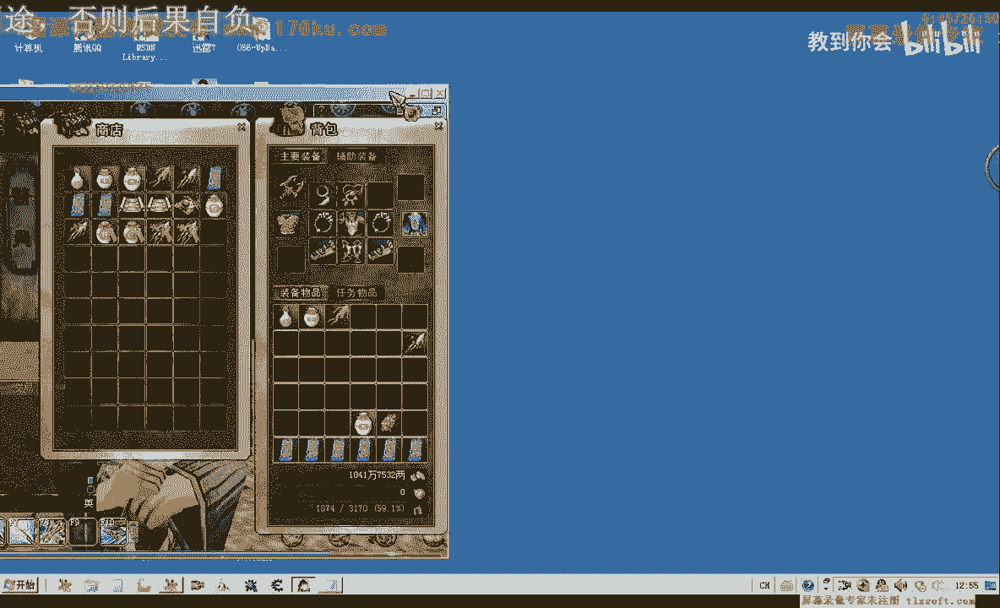
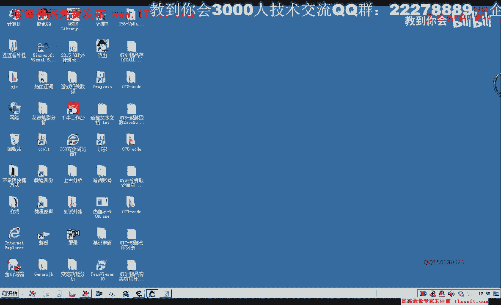
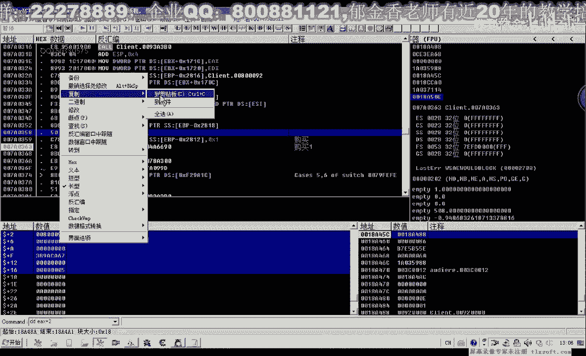
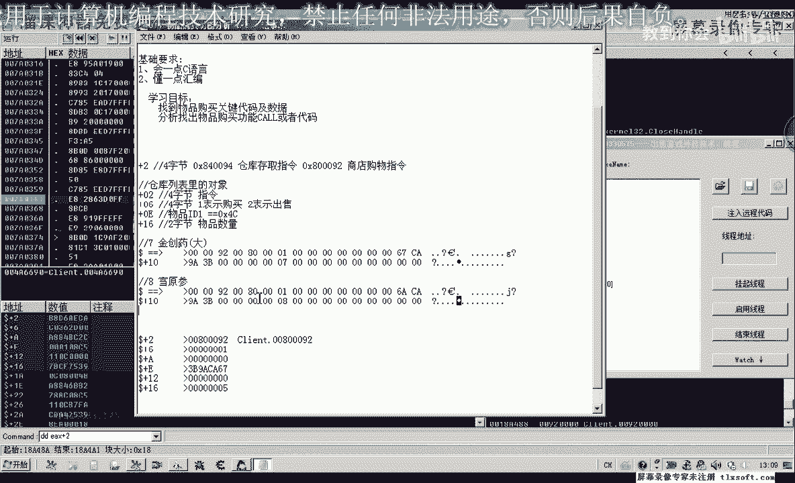
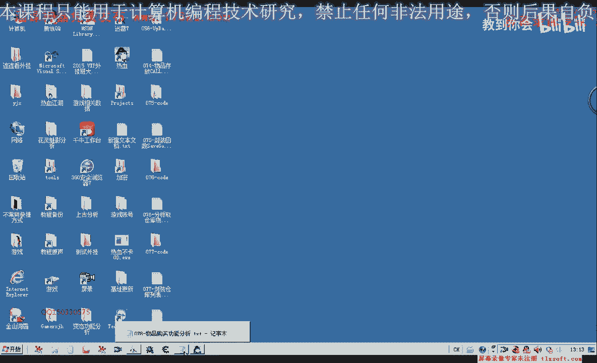

# 郁金香老师C／C++纯干货 - P67：078-物品购买功能分析 - 教到你会 - BV1DS4y1n7qF

大家好，我是郁金香老师，那么这节课呢我们一起来分析一下啊，物品购买的呃，关键的一些数据。

那么首先呢我们移动到这个平时指这个npc这里，那么打开商店，打开商店之后呢，在里面呢我们可以购买相应的物品，以这个金创新要小为例，那么我们比如说购买七个啊这个物品，那么这个时候我们按下确认的时候呢。

就会向我们的服务器来，肯定会发送一些信息，告诉我们的这个服务器我们要购买多少物品，这个味道，那么所以说我们在购买物品的这个功能的话，可以从这个发包的这个函数这里下段，然后进行立项分析。

啊找到我们的这个关键的代码，那么下载断裂之后呢，我们再点确认，但是现在呢我还没有点确认啊，它就断下来了，那么像这种情况，我们先让它运行起来，再次我们点还是没有点下确认之后呢，没有点确认呢，它就断下来了。

我们就让它跑起来好，再次点确认啊，这个时候是我点下这个确认之后呢，才下下来的这个断点，那么我们把断点取消掉，按下ctrl f9 啊，然后呢注意断到这个位置，那么我们给他做一个备注吧，注吧购买物品一。

然后给它下一个断点，那么再一次呢执行到反馈，那么呢会断到这个地方，那么这个是纯仓库的啊，那么买卖的呢可能也是这个呃，也要经过这个扣，那么我们在这个地方下断，然后再一次来执行到返回。

那么我们发现呢会断到这个地方，打开仓库，关闭仓库啊啊存放物品，那么这里那么买卖物品呢也要经过这里，那么这个呢可能很很有可能是我们就是呃仓库一些相关的一些操作，比如说点击确认这一类的一些操作。

但是真正的我们出售物品或者是购买物品的话，呃可能是离我们这个发包的这个比较近的这个空好的，那么我们让它跑起来，先让他嗯再一次我们购买物品，让他断下，首先呢它是断在这个位置。

我们看一下e d i的一个数字60嗯，那么这两个数字的话，它也既没有缓冲区，那么呃也没有取地址的这种啊结构啊，那么像这种这个地方的这个这个扩的话，它可能性比较小一些，那么我们暂时把这个断点呢取消掉。

那么然后移到这个地方，那么这个地方呢，最后呢他传的参数呢是取得一个对对这个缓冲区的一个地址，然后做一个参数传进去，那么这个地方呢与我们之前分析的仓库里面，存取物品的这个扩展是一样的，是同一个扩。

那么这个课的话呃，我们对他的这个ex进行一下分析，缓冲区，看一下逼逼，那么我们可以看到这个时候缓冲区呢嗯它有前面的两行数据，那么这个地方呢可能就是我们的数量，那么这里有个6c a9 a3 b了。

这个数字人应当是相当的熟悉啊，是我们i d相关的，我们在存储仓库的时候呢，遇到这个那个id也就是来源于我们物品对象的啊，是在这个地方的这样一个数据，那么可能的话从这个数据的分析来看的话。

很有可能呢那这个过来就是一个通用的呃，我们购买物品存向仓库里面存取物品，都可能要调用这个库，那么呢他就用嗯，可能呢就是用这个地方的指令来来区别我们的呃这个存取或者是购买。

那么我们再回过头来看一下waterp，看一下存储仓库啊，这个地方的哇，像仓库里面存取东西的时候呢，我们这里呢也有一个啊，有一个常量，那么而且呢很巧的都是在假日这个偏移，因为我们这里的话呃。

缓冲距e4 x来，2818281包，2818这个偏移啊，负的2818加上日的话恰好了，也就是我们付的2816，那么呢在这个地方呢我们存储嗯，也就是说加入这个位置，我们如果是这个数值的话。

就应该是向仓库里面存东西的缓冲区号都是加热这个地方四肢水，那么这个呢可能就是我们的存放物品之类的，仓库存，取几位，那么我们回过头来看购买这里，那么购买这里呢它也是2818啊。

那么这里呢也是他负的2818呢，加上日本也也等于我们的2816，但是呢它这四字节的区分不一样啊，这那么我们这个来看就是我们的嗯商店购买指令，购物指名说的是那么同一个位置。

那么缓冲区现在我们对这个缓冲区的了解呢可能就更多一些了。

多上了一个偏移，那么我们可以把第77课的这个偏移呢把它复制出来看一下。

那么这里呢又多了一个加二的这个偏移，然后我们把这这一段说明呢复制出来。

当然在下面的这些偏移呢，我们不一定能够用得上啊，但是我们看一下加热这个地方呢可能是用得上的，那么加名义这个地方呢它是存取指令啊，嗯之前的是一二，这个地方呢它来源于我们4c也就是那个i d。

但是这些好像我们都不一样了，还有数量之前的话它是在1a这个位置，那么我们看一下现在的这个数量的话。

我们再次让他断一下，比如说我们购买清仓要大购买七个，那么我们看一下它的缓冲区域，那么只有前面两行呢有这个相应的数据，我们把它复制出来，金疮要大机构嗯，那么首先呢这四个字节啊，就是我们的这个指令啊。

那么呢这是低位的，从这个9月开始零零，然后再次最后呢再次巴黎嗯，然后这里它有一个数字一，但这个数字一暂时我们还不知道是什么意思，那么这里呢有个674a9 a3 b。

那么这个呢就是以前我们啊像仓库里面存取物品的幺二这个位置说，说明在后面的这些呢我们可能都用不上，都用不上，那么这些不一样，那么它的结构呢我们看一下数量期的话，是从这里1011121314116这个点。

那么这个结构呢它又有一些不一样，是物品数量，那么这是低位啊，如果是高位的话，他可能也是占两个字节，来表示物品的数量，那么零六这个地方，嗯可能他也有他的这个意义，但是我们暂时还不知道，还没有分析出来。

还有就是这个地方这里是f这里是e0 e这个地方，那么零一这个地方呢成了我们的这个app，来源于我们的对象可能应该也是呃是在这个地方，但是这个四色的话，可能它的背包呢就不一样了。

它的这个数组的话应该是这个商店的这个数组列表，但是我们现在的商店这个列表的话，我们还没有找到他的一个机制好的，那么我们继续做一下测试，以人生为例，或者是这个血缘生命为例，那么在这里呢我们购买八个数量八。

让他断下来，那么血缘三发我们看一下它的这个缓冲区，好先让他跑起来。

那么这个缓冲区呢要简单的多啊，这里呢我们可以看到也是数字一啊，那么这里呢从六七这里变成了6a说明他们的i d呢不一样，这里是数量，那么呢它可能就只有这样这样几个属性呃，一个是指定啊。

那么这个指令呢可能还包含了这个零一，或者是在后面再这四个字节有可能是，那么it用来表示购买的是某个物品，那么一六这里的是物品的数量和两个字节，大致就是这样，那么我们再进行一下尝试。

如果我们是出售物品又会怎么样，三那么我们看会不会断在同一个位置，那么这个时候呢我们发现没有断在同一个位置，那么这里呢都是一个发包的一个函数，我们在这个地方呢，下段也是相当于必须是你啊。

那么下段那么我们再来进行一下尝试出售物品的时候，那么这个时候呢它马上就会断下啊，马上断下来应该不是我们所要的，我们点了确认之后呢，再断下的这个地方才是啊，它在它前面一点啊，那么这里呢就是我们的出售。

出售物品，那么我们可以在这里来看到2812，这里呢也就是说我们的2818+6个字节，那么这里呢表示是出色这个常量，而且的话这里呢是四字节的，如果我们这里呢有281来代表的是什么呢，购买好。

那么所以说这两个的话它也是一个一个是购买，一个是出售啊，这两个，所以说我们也能够找出这里的这四个自己的一个意义，那么这四个字节我们看一下，从零六这里开始，012346，那么原级也就是加1。6这个地方。

那么这里呢是支持一表示620表示出售，那么说明它的出售和购买的话也应该是呃调用的同一个空，而且是用的同一个结构，都是这样的一个结构，那么是不是这样的一个结构呢，我们再来啊分析一下。

那么我们需要在这个地方呢进行一个下一个断点，那么我们看一下这个时候呢它的这个缓冲出来是dx啧啧，但是这个时候的话我们可以看到，那么如果是出售物品的话，他后面的这个缓冲区呢就非常的长啊。

这么长一串比我们的要比我们的购买物品呢显得要复杂一些，这是我们的出售物品，那么好像我们也是出售的五个物品，那么或者是说这后面的这一串他可能没有用啊，也有可能，那么有没有用呢，我们可以来做一些尝试。

那么比如说这里出售三个人参，那么我们在这里呢把后面的这一串缓冲区呢，我们全部给它清零，可以用零来填充，看会不会出车成功，很快这个时候呢我们可以看出啊，也迈出了这个人生的啊，从这个消息的具体有没有成功呢。

我们看一下这个人生他剩余的数量啊，这里是六个，那么我们再卖出五个试一下，然后呢我们再看一下它的缓冲区，那么这个缓冲区呢我们给它进行后面的，我们给它进行一个清理，好然后呢再卖出。

那么我们可以看到这个时候呢卖出来它是没有成功的，那么说明这个出售物品的这个结构呢与我们呃购买物品的这个结构呢，它不是完全一样啊，那么显得更加的复杂一些，好的那么这一节课呢我们先分析购买物品啊。

出售物品的这个呢我们留在下一节课再进行这个分析，好我们清仓要倒啊，再来进行一下尝试，一个金仓要到，那么后边的全是零，这里是五，这是67c a，嗯那么我们大致知道这个购买物品的一个作用了。

嗯那么出售物品呢他可能是要进行一个判断啊，判断这个物品呢是否存在啊这一类的，所以说呃他可能这个嗯结构呢里面的数据来可能要多一些啊，多一些好的，那么我们再次来看一下这个结构啊，这边674a啊。

这里是我们的i d，这前面是我们的指定啊，这里这里是我们的数量，那么我们大致都分析好了，那么分析好了的话，我们接下来呢就可以进行一下相应的一个测试啊，初始物品我们就在下一节课在进行讨论。

那么这节课呢我们主要是购买物品，咳，那么接下来我们购买物品的话，我们也可以进行一个以下相应的测试，因为这里呢它只有大概是我看一下，大概只有20个自己的一个空间，那么这样我们可以用代码输入器啊就可以完成。

那么比如说我们要就以这个购买金疮药大为例，那么我们在这里呢也可以呢先跟他分配相应的这个空间，然后呢我们对它进行相应的赋值就可以。

那么在赋值的时候呢，我们用嗯先用16进制，来表示，比如说精通要到这个时候，我们测试这里不够，那么这里呢我们用滴滴来显示一下cp ex，那么这里呢就代表着事物嗯，这样表示的话，我看也不是很方便，加二。

这样来表示好像要好一些啊，这里是四肢解，这里是四肢解，这里是四肢解啊，这里也是四肢解，这样方便我们对齐啊，这里是，这里是我们的嗯，一个字节相当于来表示我们的数量啊，但是我们都可以用四字节的来表示。

这样的修改的话，先复制一下。

那么我们测试的时候呢，就可以直接把这些数字来放进去，那么我们也可以嗯，不如果我们是不分配这个空间的话，我们也可以直接的破写，但是这样我们要写的指令的话就非常的多啊，那么我们直接就这样写嗯。

通过e x e s p i t t e a x加二，那么加二的话都到这个偏移这里，到这个偏移这里呢，我们再对它进行一个协助就可以了，那我写入后面的这个数据，然后再是我们的ex。

或者是我们直接按照这个偏移来也是可以的，那么我们这里的就不需要加二个，那么在这个地方加上，那么这个地方呢我们就是加6+6呢，我们写入一把前面的这一行复制一下，加六之后呢。

然后我们是加0k0 k这个地方呢全是零，然后这是灵异，那么零一这个地方呢就是它的id用来区分物品的这个分类的，然后再是一二，然而这个地方呢是零，然后呢这是一六，要对这个地方呢是它的数量。

比如说我们12哈，最后呢我们在复习ex，当然push ex之前呢，我们还需要来复习0x86 ，最后呢我们是5e4 x。

我们看一下它e4 x的数字是这一句，我们把它复制出来，最后呢再次扩，那么这些这样的话，我们以此来理论上就能够购买了两个这个精通要道啊。

但是我们不知道它后边后边的这一串数据是不是全部需要清零才可以。

那么我们直接先进行一下尝试，那么我们看一下啊，输入到游戏里面，看一下现在金创药的数量是35米，真的，那么我们还需要加上一个前缀，还可以看到，好，的，那么我们再次注入到游戏里面。

那么这个时候呢我们可以看到啊，购买了两个金创药，但是为什么游戏里就关闭了呢，因为我们这里的堆栈它没有来这里分配的空间，这里没有屏障，这里还要让usp加上九零，因为之前我们在这里呢减掉了9年跟字节啊。

相当于是分配的这个空间，但是这里呢我们要把分配的空间呢释放掉啊，理论上这样才可以，那么我们重新再打开游戏上进行一下测试，好打开游戏之后呢，我们再一次打开n pc，打开我们的商店嗯，打开商店之后。

我们看一下现在金创药啊，357，因为刚才购买成功了两个，那么再次输入到游戏的原测试，看一下商务机构359个啊，因为每次来会买两个啊，数字如果这里我们买12个啊，这里是16进制的，相当于一次买18个啊。

3793 97 415，这里433相当于一次就买了18个啊，这里面就相当于一次了，那么我们的购买呢是成功的，那么这里呢我们可以改一下，改为6伏呢，那么就是金创药小改为六六了。

应该就是这个金创药中的这个位置，那么我们如果是改为六八，那可能就是人生有可，啊这个时候呢人生比如说我们去买一个了啊，这个时候呢就买了一个人生，那么在后面的话，这些人可能他的id呢有可能是i卓的。

也可能没有挨着，我们可以尝试买一下啊，这个六九，那么这个时候呢我们发现没有作用啊，没有作用，那么只有在前面这几个的编号呢，它才是i做的啊，说明，轻松要小三个啊，这里可以看到买三个。

那么说明我们的呃这个测试是成功的，那么这节课呢我们就讲到这里，那么下一节课呢我们再来继续把它封装成一个呃相应的函数。

嗯那么这一节课呢也给大家布置一个作业啊，那么作业呢首先呢我们就是要把这个购买物品的相应的这个缓冲区呢，啊结构化，嗯，另外呢把这个呢把它封装成一个函数来进行调用，当然要把它封装成函数的话。

我们还需要有一个工作要做啊，嗯最好呢是要把我们的这个商店的这个数组列表要找到，找到之后呢，我们的这个i d啊，也就是我们的这个零一这个偏移后面的这个i d呢，它的数据呢才有一个来源啊。

我们需要骗你这个商店的这个背包，然后呃得到相应的id呢，然后我们才能够真正的实现这个购买物品，这样我们使用起来才方便，如果像这样，我们每一个我们都要去硬编码的话，这样呢非常的麻烦，好的。

那么我们下一节课呢嗯再来实现啊，相应的这个功能大家也可以自己下去动手一下，做一下，哈那么大家可以尝试进行封装这样的一个函数，那么也就是呃购买物品，根据这个物品的名字后面呢是一个物品的一个数量啊，好的。

