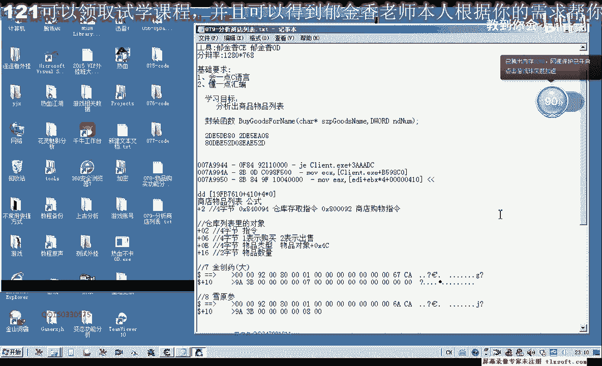
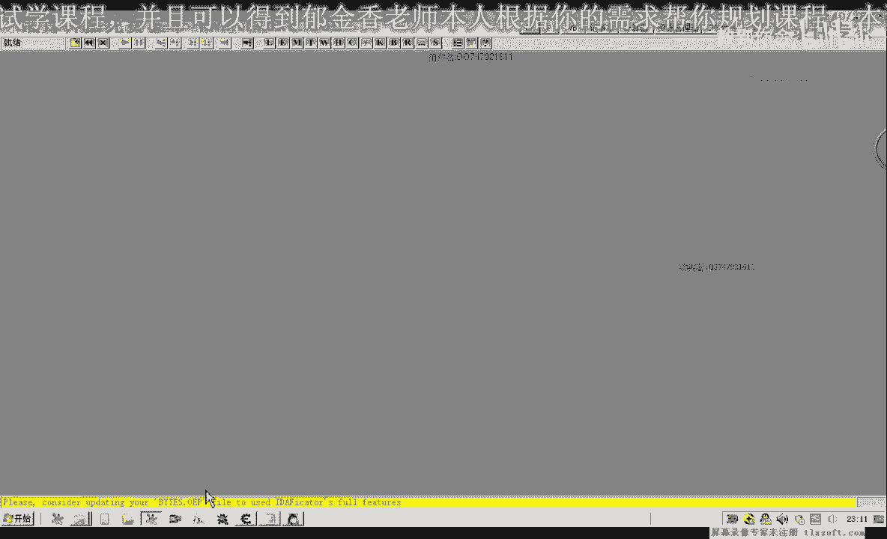
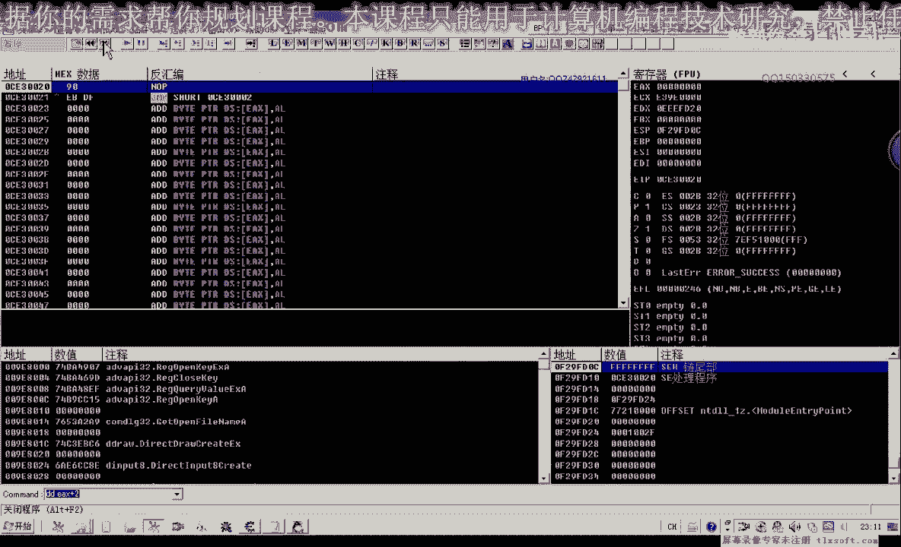
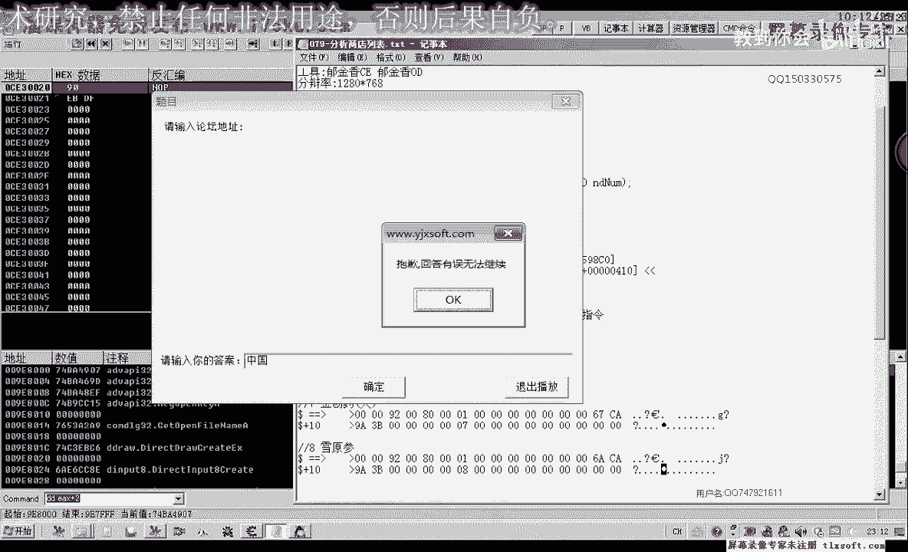
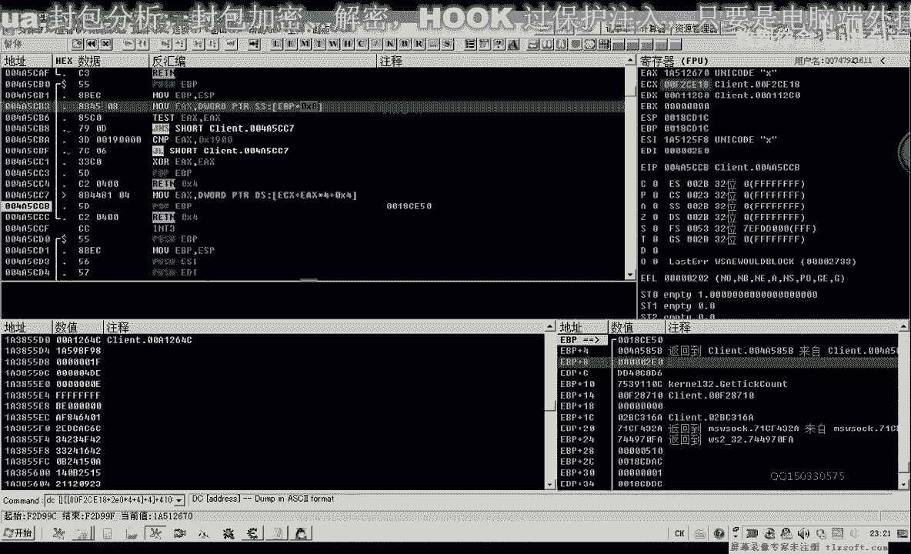
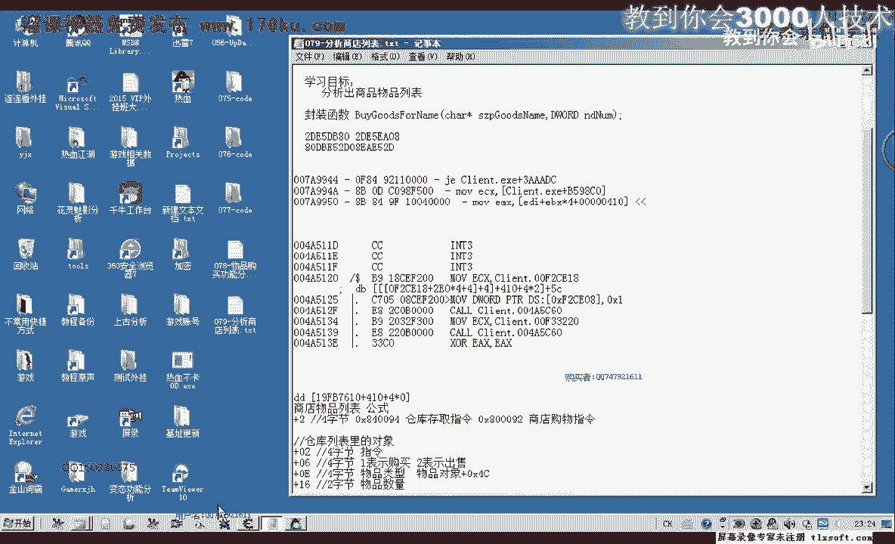
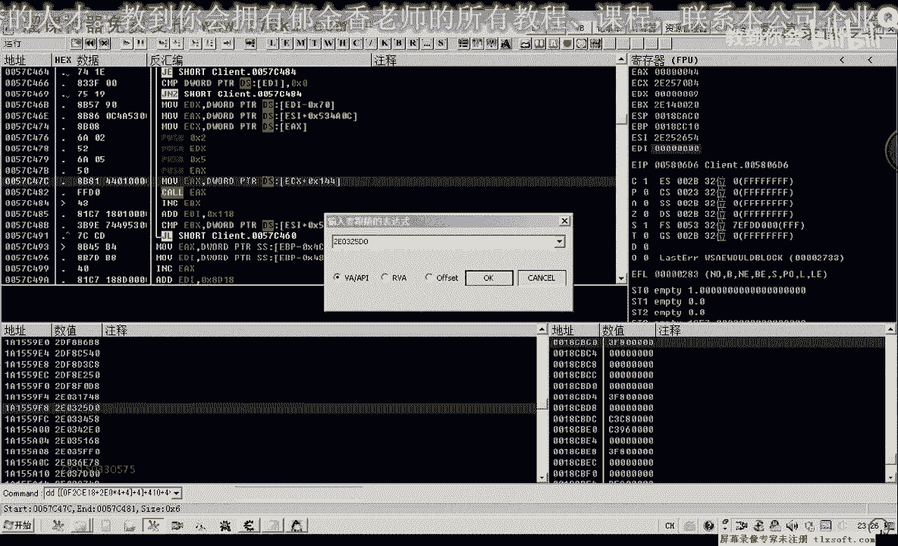
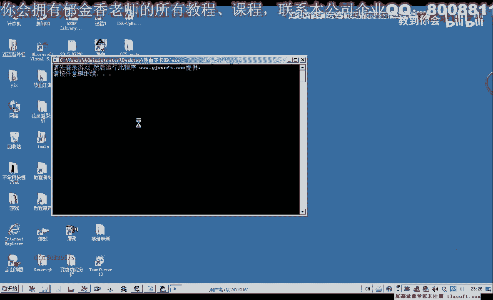
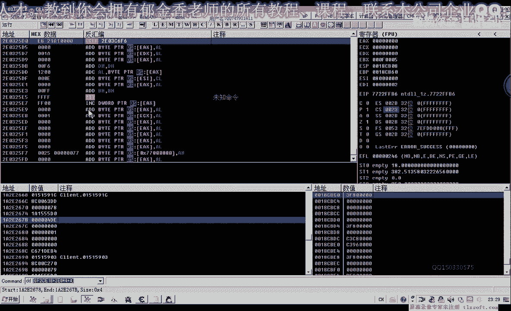
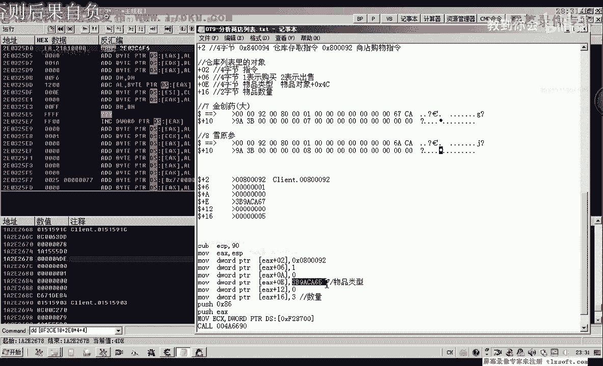

# 郁金香老师C／C++纯干货 - P68：079-分析商店列表 - 教到你会 - BV1DS4y1n7qF

大家好，我是郁金香老师，那么在上一节课呢，我们分析了物品购买的这个功能扣，那么它的缓冲区结构里面呢，那么其中有一项啊，零一这个偏移这个地方呢用来表示的是我们嗯作品的类型。

那么具体的这里我们称为物品的i d的话可能不是很恰当，i d呢它是唯一的，那么物品的类型的话，它可以是相同的，不就是说在不同的这个玩家类型里面，它可以存在做一个相同的呃这个类型。

这个可能我们叫做物品的类型，那么可能更恰当一些，那我们后边的啊在出售物品的时候呢，它才有一个唯一的一个id啊，身份的一个标识，因为那个身份的这个标识的话，它这个物品呢嗯标识呢应该说它的这个数据量比较大。

是用的我们之前的存仓库的这个功能库啊，缓冲器结构里面呢它是用八个字节来表示的，而物品的类型呢它这里是用四个字节来表示的，那么这节课呢我们主要呢就要分析一下这个商店的这个对象，的一个列表里面的这些对象。

那么我们分析了这些对象之后呢，对象的属性里面，那么按照我们以前的分析的话，就是在4c这个地方啊，对象的，物品对象假设在这个地方呢是我们物品的类型啊，那么之前呢我们把它叫做i d e啊。

那么现在我经过我们的这个分析呢，我发现的话，那么我们把它的名字取名为物品的类型可能更加恰当一些，好的，那么这个商店的这个物品列表的话，与我们背包的这个列表的话，分析的方式呢也有一些类似的地方啊。

那么我们也可以从一个关键数据来作为一个突破口，那么也就是说我们在选中一个对象的时候呢，它会像嗯二是把这个偏移来写入一个对象，嗯，那么这个机子或偏移的话，在我们之前的分析里面已经有。

那么我们先找出这个机子，看以前我们有没有保存，那么以前选中技能的时候，我们有这样一个地方嗯，多少多少加28这样一个偏移，那么我们看一下他最新的机制是多少，在跟贝斯里面有。

那么这个地方啊这是他最新的一个偏移，放置技能的时候用的，选中某个技能的时候，那么实际上我们在选中背包里面的相关的数据的时候呢，它也会啊是同一个机子加偏移，那么比如说我们现在选中的这个地方。

我们看一下它加上5c是它的名字，我们来看一下，加上在这个地方，那么这里加上50的话，就等于六四，那么前面这个偏移呢，我们把它移开，那么这个时候呢我们得到的我们现在选中的啊，也就是金创药宗。

那么如果我们换一下，比如说换这个一元三啊，那么我们这里呢就要改成嗯这个机制来加上我们的c，那么这里呢就等于我们的4c大概是10+5 c这个地址，那么这个时候呢就是一元三。

那么所以说我们要找这里面的这个列表的话啊，我们就可以通过这个选中的对象来搜索，那么我们可以这样来搜索好，首先精创要小，那么我们记下精创要小的这个对象啊，那么第二个呢我们是金创药中啊。

选中的时候呢是这个对象，而这两个对象呢它在我们列表里边呢，它是这两个呢，它是i做的啊，地址的话它是i做的，那么我们可以属于一个字节集啊，如果这两个他都在从同一个地址的话，那么我们就能够把它搜索到。

那么字节级的话，我们应该从第一位来80d b d e52 d，然后是081a12 d，那么应该这样来一首啊，这结局，那么这些集呢我们要从第一位来算起，从这个地位是要转过来，这样啊倒推过来。

当然我们也可以在这里显示的时候呢，我们就显示为这个字节数组，这样也是可以的，好那么我们这里选16进制，然后这里呢我们选字节的数组，然后进行搜索。

那么搜索出来的这个的话应该呢就是我们的列表的一个呃相对的机制，这就是我们的呃商店列表，那么这是数组的机制呃，相对机制，那么它的绝对值机制的话，我们可以在这里来找一下访问这个地址的代码。

那么首先呢我们在这里选中某个对象的时候呢，它的机子呢就会出来啊，我们可以看到，那么这一段的话就是我们的商店的一个相对的一个，就是一个机子的一个公式，那么我们可以把它复制出来啊。

那么这个时候的话我们可以说来就找到了我们的商店的列表，那么它的公式呢就可以通过这里呢推导出来，那么我们可以看到e d i的数值是多少，来看一下，那么就是这个数字啊，e d i。

那么我们再找一下这个e d i它存放在什么地方就行了，那么现在的公司就是这个嗯加上410，加上四神与它的一个下标，我们就可以这样的表示，那么我们再通过c一来搜一下新搜索，这里我们搜他的地址。

那么呢这里呢它就能够收到一个对象啊，我们看一下这个对象是不是我们主要的对象，那么在这里呢我们可以看到了呃，他应该是在所有对象里边啊，从这个嗯因为在这里收到的访问他的地址呢也是一个数组。

那么所以说我们收到的这个地方它不是的，那么应该有另外的一个地址，那我们再重新搜一下，那么我们再看一下，从这些列表里面再找一下有没有相关的这个机制，那么我们先找一下啊，这个地方，三交易，再次访问一下。

那么从这里来看的话，应该是这个所找到的，应该是所有对象列表里面，好的，那么游戏推出了之后呢，我们再重新进一下游戏，因为o d来进行一下分析，跟踪一下。

那么重新打开游戏之后呢，我们先用核武梯附加进去。

那么然后呢我们在这里呢可以找一下啊，它的这个呃e d i的这个数据的来源。

那么在这里我们找一下di数据的来源，那么我们先在这个地方下一个段，然后我们在这里啊选中哈某个物品的时候呢，它会在这个地方断下，先把它取出来，e d x，然后是达到一个相当于是下标。

那么我们看一下e d i现在的数值是多少，那么这个di的话我们看一下55d0 ，1a3 ，那么是在这个堆栈里面啊，这里有一个数据，那么我们在在c一里面先找一下，那么这里呢有一个机子堆栈的话。

它是在180c d18 这个地方啊，18c d8 ，那么我们在这里先找到18c d8 ，直接转到18c d18 这个地方，那么我们也就是从这个口进来的一个参数，我们从这里呃，反馈边窗口跟随。

那么是从这个ecx这里来的，那么这个地方呢它来源于e si加四这个地方，那么我们又要去找这个ei的一个来源，那么我们在这里呢下一个条件断点嗯，e c x300 ，好的先让他跑起来。

然后这个时候呢我们e4 x呢会断下啊，我们看一下，那么它来源于是e s i加上四，那么现在我们找到的这个地方的话，就是它加上四，然后加上410，加上四乘以我们的下标啊，这样来的。

那么这就是我们的这个相应的这个列表，那么我们可以来进行一下测试，dc精创要小，那么下标五一的时候呢是金创要中，那么这里呢是经常要大，那么我们从这里来分析的话，它这个列表呢与我们以往的这个列表呢。

它又有一些不不相同的地方，那么以前我们在这前面的话，直接就是一个机子，但是这里呢它不是，好那么我们再继续找一下e si的一个来源，我们先在c里面搜一下，看能不能都收到相关的机制，那么这里呢它有一个机制。

是f2 d，99c啊，我们找一下它，那么这里呢我们在找的时候呢，要加上一个零前缀，那这个时候呢我们还是没有找到啊，嗯那么没有找到的话，我们可以呢，嗯先对这个地方呢下一个断点选r，没找到机子的话。

说明他是一个偏移，那么我们这个地方呢呃也是一个相应的一个数组，我们可以在这里找到啊，是e c x加上1a x加上四，这样计算出来的，那么我们来看一下gt e4 x加上我们的啊。

这个时候ex呢它已经取出来了，好那么我们不知道之前的这个ex是多少，那么我们再让它跑一下，跑到这个地方，啊再走一下，这里也有一个es si，也是来源于我们e4 x加c，那么我们先把断点取消掉。

再重新登一下，那么我们先来看一下它的是在这个地方，是不是我们所要的这个物品的分类信息，67c9 a3 b，那么看起来的话应该是不，那么我们再重新对这个地方呢，下一个访问断点再来再来跟踪一下。

那么从这里我们来看一下哈，那么之前他的ex的来源来源于什么地方，那么ex的话，我们从，从这里来看的话，它来源于我们上一层的这个bp加八这个位置，那么e b p加八的话，在这里的话等于210。

那么我们看一下现在的app是多少，加八恰好等于210，也就是说这个可能是相关的一个机制，那么这个呢再加上我们的210神影4+4，然后呢再取出里边的这个数字，比ef加2670，那么是这样来的。

然后呢我们再加上外边的410，所以我们的一个下标，那我们再来看一下我刚才的公式e670 对了，还要加上一个死这个地方，再加上我们的5c d c。

这里就只加一个四啊，多加了一个括号就能知道，4611670，我们再把它替换一下，看一下，那么这个e6000 我们替换成我们的公式，就是我们的ec x呃，0f2 c e18 ，再加上2100x4+4。

好那么现在这个地方呢才是我们的青春要大，是这样的这样的一个公式，那么我们再找一下，这个时候找一下ec x看它是不是一个机子，那么这个时候呢我们可以从这个地方来发现的，那么这个e4 x呢，它就是一个机制。

那么当时还是还要考虑的一个问题，就是这个210它会不会变化啊，每一次的时候啊，他会不会改动啊，重启游戏之后，那么我们先把它复制出来，先让游戏跑起来，保存一下，那么我们先退出游戏，那么再重新进一次游戏。

那么进入游戏之后呢。

我们再用ot哈附加一下，读一下刚才这个地址，好那我们现在呢，但是我们还没有打开商店啊，可能的话这个数据量没有初始化，我们访问不到，那么我们先打开这个商店，再用这个公式来访问一下。

那么这个时候呢我们发现了金窗要大啊，那我们看下标零这个地方呢，金窗要小，下标一啊，也就是第二个第三个，第四个，那么第一个我应该是第六个，第七个，那么第七个的时候我们发现了，这个时候它访问不了。

那我们先看一下第七个有没有东西，那么第七个的话应该是这个回程图，我们再访问一下第三口，第三个是人生第四个，第五个测试，第六个开始呢，他就不能够访问了，那么我们移到相应的嗯，把前面的括号去掉。

那么我们看一下它相应的这个列表里面也没有相关的这个数值，那么我们从这个地方的话，我们能够看到啊，12346它都有相关的一个数值，那么只是后边呢我们可以看到这里呢他没有这个数据窗口的这个跟随。

那么这可能是我们o d的一个bug，那么我们先转到这个地方去。

那么转过去之后呢，可能这个地方呢我们才可以访问第七个，这个时候呢我们就能够访问了嗯，然后我们再给它加上括号加5c移到前边dc再加一个括号啊，灰尘-33弦关了，那么这个时候呢我们就可以访问了。

这可以说是我们呃这个og的一个bug啊，这是南明湖的地图，南明洞的一个地图，那么说明我们这目前来看的话，呃，这个公式是可用的啊，直接计算出来就可以了，好的，那么我们把这个公式呢啊标注一下。

那么最终找出来的这个公司呢，就是这个地方，那么它的加四塞这个地方呢就是我们的物品分类编号，好那么我们把它改一下，之前我们把它叫做id啊，现在我们把它就是一个物品的一个类型，啊。

那么下一节课呢我们就可以根据这个公式来来，对我们的整个这个商店里面的这个物品呢进行一个偏离啊，然后呢得出我们具体的一个数值，那么但是从这个公式这里来看的话，它可能也是一个数场啊。

但是呢也有可能就是说我们找到的这个它不是一个真实的一个地址，只是我们现在的测试了，这个偏移呢它没有变，那么也有也有可能我们重启几次游戏之后呢，这个偏移呢它有可能变，那么如果它变化。

那么我们再继续啊用新的方法来分析它，用其他的思路来分析，那么这节课呢我们就先分析到这里，那么这个就是我们的商店的列表，好的，那么这节课呢我们先分析到这里，那么下一节课呢我们在就是说封装我们的这个函数。

也就是上一结构的这个作业，那么我们需要先通过这个列表，先要取得呃这个物品的一个分类编号啊，然后呢我们才能够购买指定的这个物品，那么加加幺六这里面是塑料，这里是物品分类。

当然我们还有一种办法我们可以省略掉啊，呃就是说如果我们把这些分类的物品的类型编号，我们可以提前来把它提取出来，然后呢我们就用不着去建立这个商店里面的这些嗯这个列表，那么我们就直接可以硬编码。

就是把所有的这个列表里面的这个物品类型的，我们自己把它取出来，与这个与相应的这个物品的名字呢关联起来啊，那么这种做法也是可以的啊，只是我们的啊，我们几种方法呢都可以作为一个参考，那么最终你选选择什么啊。

什么方法呢都是可以的好的。

