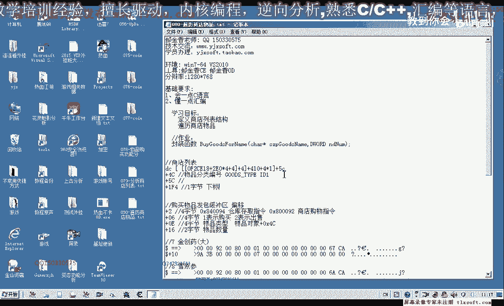
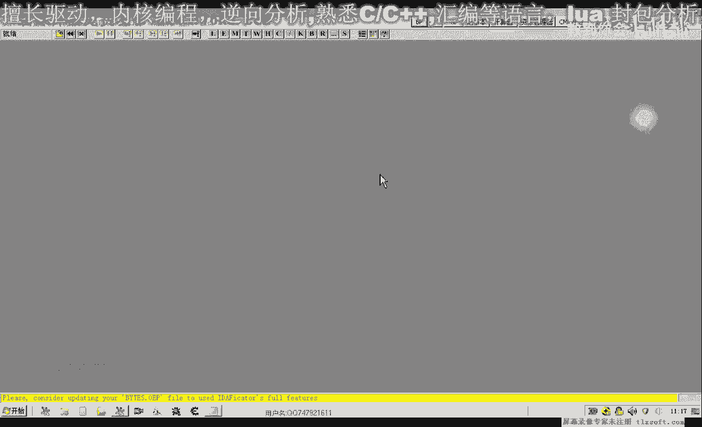
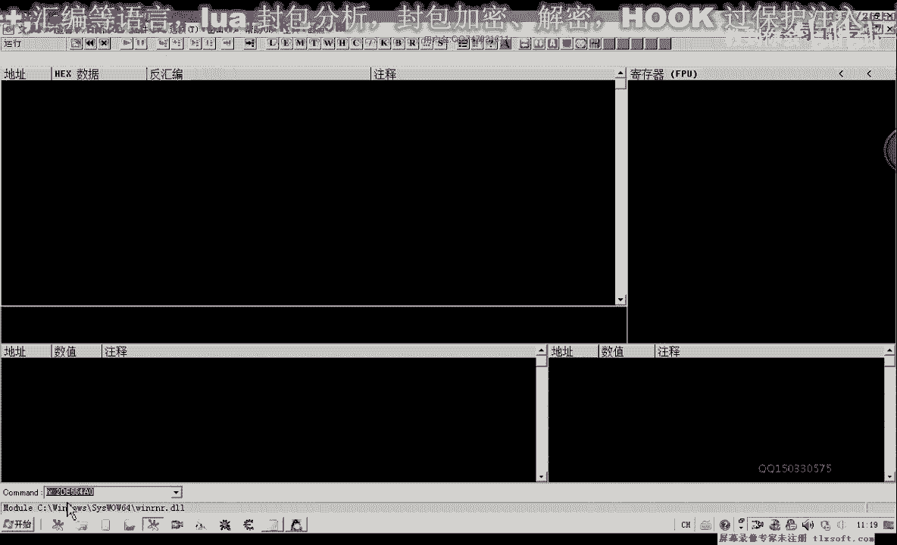
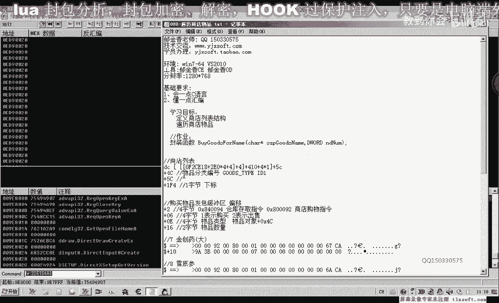
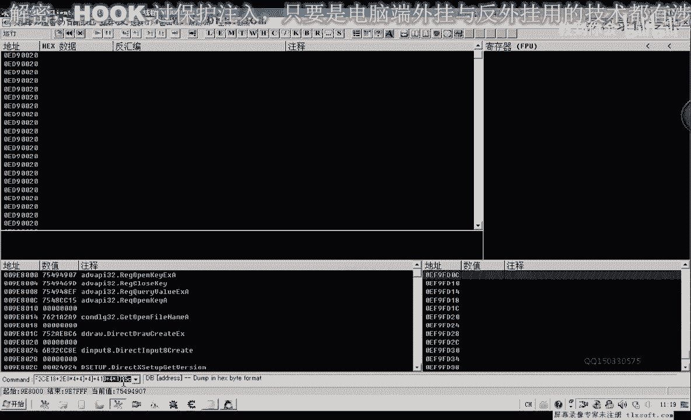
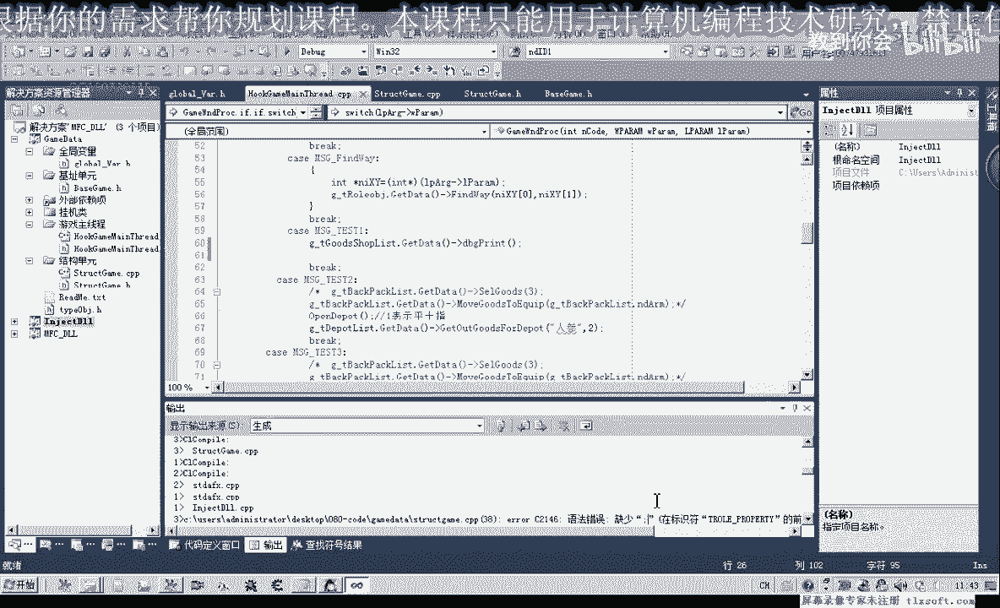
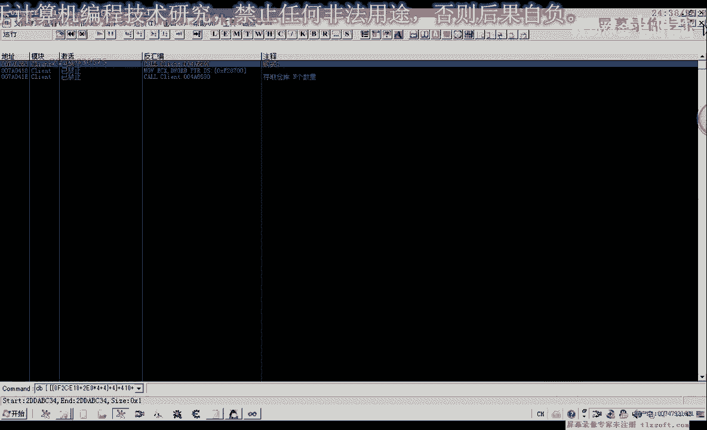
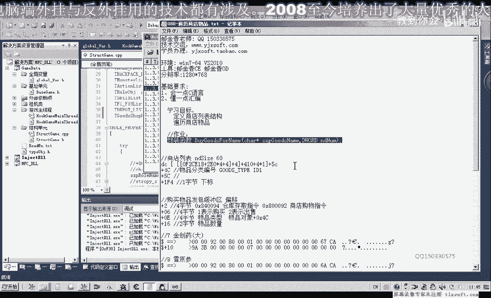

# P69：080-遍历商店物品 - 教到你会 - BV1DS4y1n7qF

大家好，我是郁金香老师，那么这节课呢我们先定一个商店的一个列表结构，然后呢呃偏离我们的商店，把我们的物品分类编号，以及我们的呃物品的名字，那么偏离出来。

那另外还有一个应该是物品在这个商店列表里面的一个下标，如果是没有变的话，应该是ef 4这个地方，你自己的下标，那么我们先用d来嗯加载到我们的游戏。

先做一下哈。

相关的偏移测试。

那么我们再看一下他之前的这个下标的这个位置是多少啊，这个偏移我们可以看一下，参考一下前面的背包的一个分析，1f4 啊，word两个字节对象在背包里边的一个下跌，那么现在呢这里的下标是一。

那么如果我们在这里的数组我们访问啊，下边呢它就是二这两个字节啊，应该是，那么说明这个与我们在背包和仓库里边的这个下标呢，它也是一样的啊，当时说这个是两个字节，但是一个字节它足够用了。

那么我们暂时来就用一个字节来表示，因为这个商店的话，我们数一下1234678 90，它的一个大小的话也是60，相对列表的一个大小，啊，它是它的元素呢一共有60个对象。

那么还有五色这个地方呢是它的一个名字啊，那么我们大致我们只需要这几个就可以了，那么我们再来看一下以前的背包的话啊，它还有一个窗口的坐标，这两个用不到啊，e f4 这个还有一个是数量啊。

数量这个明显也用不到啊，那么我们需要了自己输入要购买的数量啊，因为在商品商店里面的话，它的数量应该都是一对，好的，那么其他的这些属性呢我们都用不到，那么我们接下来呢就打开前面的代码进行偏离。

打开第77课的代码，那么首先呢我们添加它相关的一个机制，那么我们也就是这个物品的这个商店啊，然后他的机子嗯可以说就是这一个啊，这个机制我们可以直接把它计算出来，它也是一个机子在这个地方。

那么前面呢我们啊直接的也可以用在这一串公式来表示它，它的一个机子，然后呢再加四再加410啊，这样算出来的，那么我们也可以直接用这个机制，也可以，好那么然后呢我们再添加相应的结构呃，转到我们的结构单元。

那么我们就在物品背包的后边啊，添加一个相关的结构，那么这个结构呢我们也就包含一个啊，也是呃就是这个背包的对象呢，因为都是同类的啊，他们的这个偏移，那么所以说呢我们就用这个啊背包的这个对象和结构来定义它。

那么在后面的啊，这里呢都是相同的啊，包括这个相应的这个背包的这个函数啊，这些应该都是相同的，那么这个函数呢我们应该也是相同的，get goods index for l，那么唯一不相同的呢。

我们就是要到里面去啊，改变它的机制就可以了，那么首先呢我们也要对它进行一个初始化解题的题，哈哈哈哈，那么它的一个初始化的话，我们就可以仿照前面的它的一个初始化来写背包的一个初始化来写。

那么我们先复制一下，那么复制之后呢，我们可以转到这个背包的啊，初始化函数后边标题道题，那么在这个位置呢我们添加它的一个说明，那么里边的内容呢我们可以照片照搬啊，照搬前面的这一段内容，好复制粘贴下来。

但是我们有的地方我们需要替换啊，一个是嗯这个背包的大小，那么这里呢应该是呃60，我们需要另外定义一个背包的一个大小，那么我们回到结构的头文件，那么在这里呢它的大小呢我们需要重新定义，再回到这里啊。

我们也要需要进行把它的大小来进行改变，那么他的机子也不是我们背包的机子，那么这个机子的话我们需要也需要进行一个改变，bs which shop啊，然后我们需要通过这个公式来来计算出它相应的机子。

也就是在前面这一段，复制一下，他不是，那么首先呢我们取的是这个机子出来，那么取出来之后呢，我们还需要呢，嗯加上我们的后面的这个公式是2100x210 乘以4+4，好那么这样这样取出来。

就是这前面一个括号里面的内容，那么我们还需要再一次加四，那，么加上偏移四，那么加上偏移四之后啊，加到这个四，然后呢再一次啊加上我们的410啊，最后呢后面的都是一样的，那么加上410之后。

后面的这个四乘以a呢，我们在后边呢就是从这里啊取得对象的呃这个机制啊，然后这里我们也要进行一个判断，那么实际上如果我们取出来的某个物品为空的话，这里呢我们就直接可以返回了啊，这里为空的话。

我们就后边呢我们就可以不循环啊，就可以不判断了，那么空呢就可以做一个结束条件，那么这里可以进行一个优化，那么如果在这个地方为空了，那么我们直接来就放，返回this就可以了，那么这里处理异常呢。

我们建议的在用x啊这个呃红外处理，用这个加下划线的这个呢它可以了，抓捕到我们的就是呃只只承担违规的一些呃访问啊，那么这里呢我们也加上调试语句啊，对，344啊，这个地方呢实际上我们用不着啊，啊用不到啊。

但是呢我们多写这样一句了也没有关系啊，c0 f1 ，那么这个地方呢实际上也用不到，那么i d e这里呢我们可以把它改一下啊，这个i d e呢我们叫做物品的分类啊，分类编号。

那么这个我们全部来把它作为一个替换，那么可能这个地方呢才是一个真正的i d啊，这个地方是真正的i p嗯，那么替换成，后来我们先编译一下啊，好偏移的时候已经没有错误了哈，那么我们要呃等一会儿哈。

这里是进行了一个初始化，那么等会我们写段代码，把相应的信息呢我们读出来哈，显示一下，那么再回到我们的图文件，那么这个时候呢我们还需要呢嗯获取它的这个下标的这个函数，我们也需要来定位哈。

然后呢我们才能够取出来，那么这个函数的话我们书写呢呃先跟他为了方便后面方便操作了，我们先跟他加上一个前缀，然后再复制一下，那么再转到啊这个同名的啊背包里面同名的这个函数来转到他的前面。

或者是后面的进行文字，然后我们把上边的这个代码把它复制一下，那么我们看一下还有没有需要改动的地方，那么这个地方呢我们需要它数组的大小不一样，这里是60，嗯比较好，然后再返回。

那么基本上就是这样都是一样的，那么这样呢我们就能够取得某一个物品，它在这个商店列表里面的啊，这个列表里面的一个下标，然后呢我们就可以通过这个下标呢去访问初始化的这个列表，这个商店的这个列表。

然后呢就能够取出它的呃物品分类的编号，以及他的i d啊，也就是作为我们购买物品的一些参数，好的，那么我们再写一个偏离的一个函数啊，用来测试哈，那么在这里呢再写一个偏移的函数。

那么这个函数呢我们就写在啊这个gt indexed for类后面，或者这个get代替后面都可以，那么这样呢主要是显示我们的呃这个初始化的信息来看它是否对，那么我们需要用一个或循环，小于60i加加。

然后呢我们需要来先初始化一下吧，那么如果不初始化的话，我们调用的时候呢，我们就要用这种个体的体质的方式来调用，都是可以的，那么我们这里也可以不初始化，那么直接进行调用，那么首先呢我们要判断。

那么我们先判断一下里面的这个i d这个数字啊，通过这个i d或者是嗯物品的名字来判断一下，那我们就通过，那么这个i d呢实际上我们也要也需要要改一下啊，n d i d。

那么这个i d的话实际上不是i d，那么我们把它取名为物品的分类编号的话可能更好一些，那么这里呢我们也实现一个替换宫殿，都是看物品分类，全部替换，那么切换之后我们看啊编译一下能不能够通过。

这里需要一个返回值，那么偏离完成呢，我们返回true，那么我们对这个物品的编号啊做一个判断，那么如果这个是这个值的话，为空的话，就说明呢嗯我们就偏离了就完成了，就直接返回。

那么如果我们这个相应的这个物品类型的编号它不为零的话啊，不为空的话，或者我们最好是用名字来表示say good night，如果这个名字他都是围攻的话，那么我们就呃就直接就返回，但是我们看一下。

在前面啊，这里用main main city的全部是做了一个清零的一个处理，这好好，那么所以说我们在这里呢才能够添加这样的判断，那么如果他的物品的名字哈，它存在啊，这个地方它不为空。

那么在这里呢我们就可以来对它进行相应的偏离，显示相关的信息，当那，么首先呢我们显示它的一个分类编号，还，好，或者说叫物品类型，然后呢再搜物品名字，那么我们只需要这两个应该就可以了。

当然还有一个是它的一个下标，二，然后这里是物品的名字，然后呢最后是它的一个下标i，啊，那么这个直接啊下标i于它，它读起读出来的这个下标呢应该都是一样的，这两个栏数值应该是一样的，好的。

那么我们再次编译一下，然后测试，那么编译成功之后呢，我们还需要呢在我们的头文件里边呢，把它定义为一个全局变量，那么我们再找到我们的结构，这，三对列，gtr步骤做，第四题。

然后我们再添加到我们的全局变量单元，加上我们的ten，加上这个前缀的修饰符，那么我们解锁了就可以调用它，那么调用的时候呢，我们转到主线程单元，啊这里的除湿掉，那么在之前的啊这些测试呢。

我们就可以先把它初始掉啊，删掉，然后get that，那么我们看一下这个函数的返回值啊，对不对，初始化vs是这，再重新编译一下，看有没有代码，有没有错误，那么我们全局变量单元再引进来看一下。

这里少了少了一个分号，所以说造成我们刚才在这里主线程里面，它添加我们代码的时候呢，嗯它不能够显示出这个指针好，那么再次添加我们的代码，在这里，打印出我们的啊，偏离打印出我们的信息。

那么这次呢我们输入到游戏里面，再重新编译一下。

啊这里也少了一个分号，然后把这里的这个断点呢全部清掉。

然后退出来啊，这样我们输入的时候呢速度会快一些啊，然后我们再注入到游戏里面，这个时候呢我们化解主线程，打开我们的调试信息，查看查看的工具啊，然后我们点测试，这个时候我们可以看到啊。

一共呢有17个啊啊17个物品我们看一下嗯，3663148，那么减掉一个刚好是17个啊，那么所有的物品呢我们都偏离出来的，那么在前面的这些呢就是我们的呃物品的一个编号，65666768啊，6a1 f。

其名doc，但是它并不是说这个物品的分类编号呢，我们可以看到它这个药品的这几个它是哀求的呃，然后人声取原生，啊一延伸哈，这几个人他嗯间隔的距离要远一些，麒麟啊，地图这一类的。

那么我们也可以另外还有一种方法呢，我们就是嗯不骗你，那么直接把这些如果这些物品的类型比较少的话，我们直接可以把他就说硬编吧，就把它全部来把它保存好，然后不去骗你啊，直接就调用这个我们自己写一个函数法。

把它固化起来也是可以的啊，那么固化起来关联起来啊，放在我们自己建一个啊这个列表，商店的一个列表就用不着到游戏里面来来访问它啊，啊因为这些物品的类型的编号的话，它都是固定的啊，都是固定的。

那么愿意使用哪一种方法呢，这个就全看你自己的一个选择，那么这一节课呢我们就讲到这里，那么下一节课呢我们再来来封装，完成我们的这个呃物品购买的这个函数，好的。

