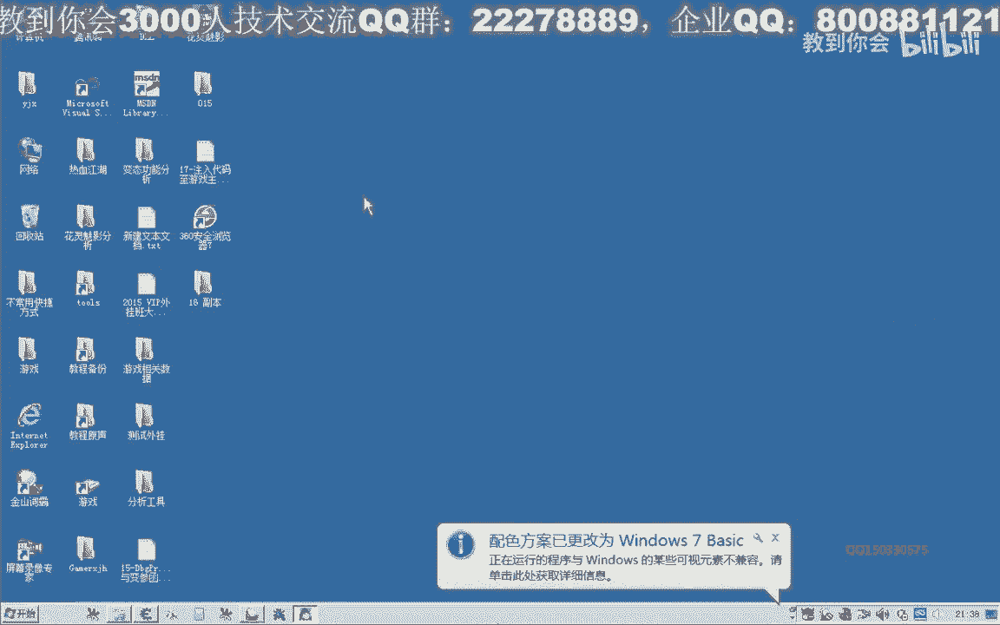
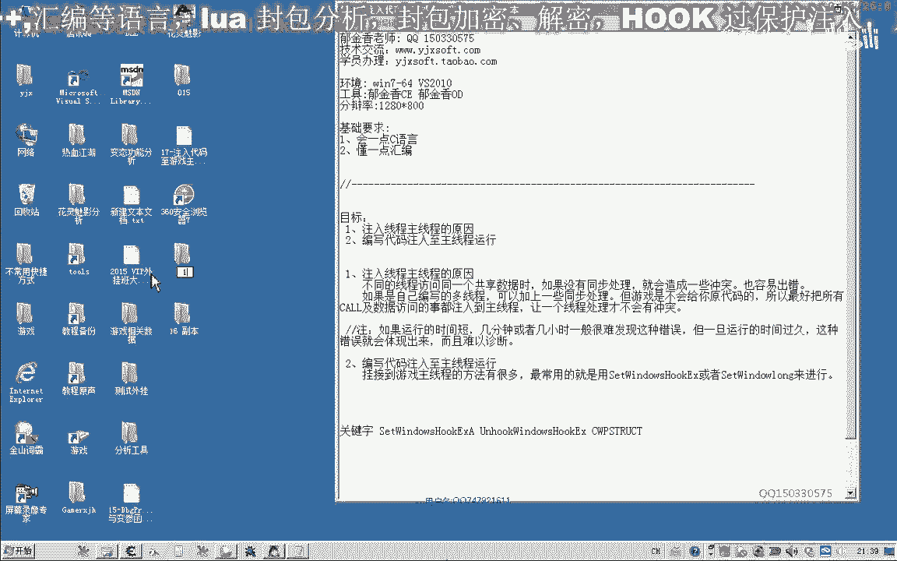
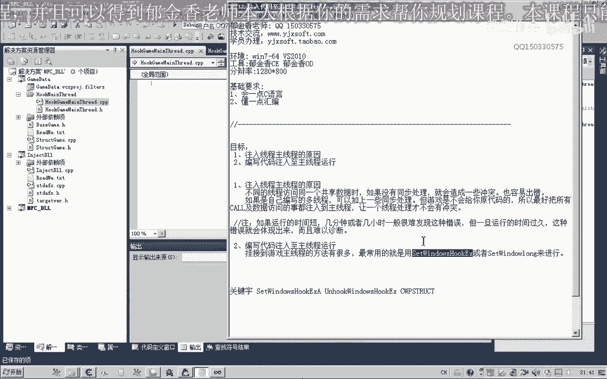
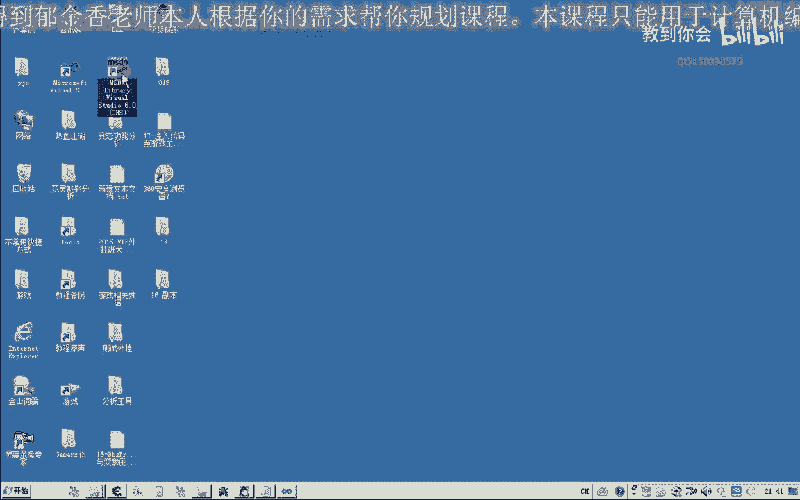
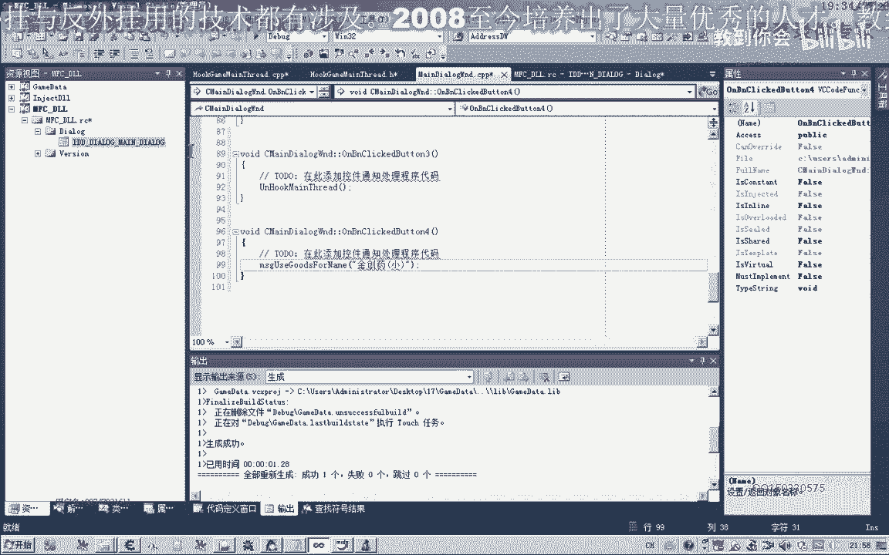
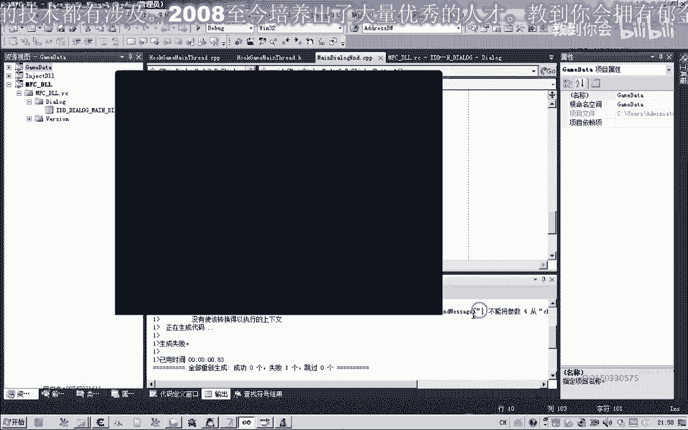
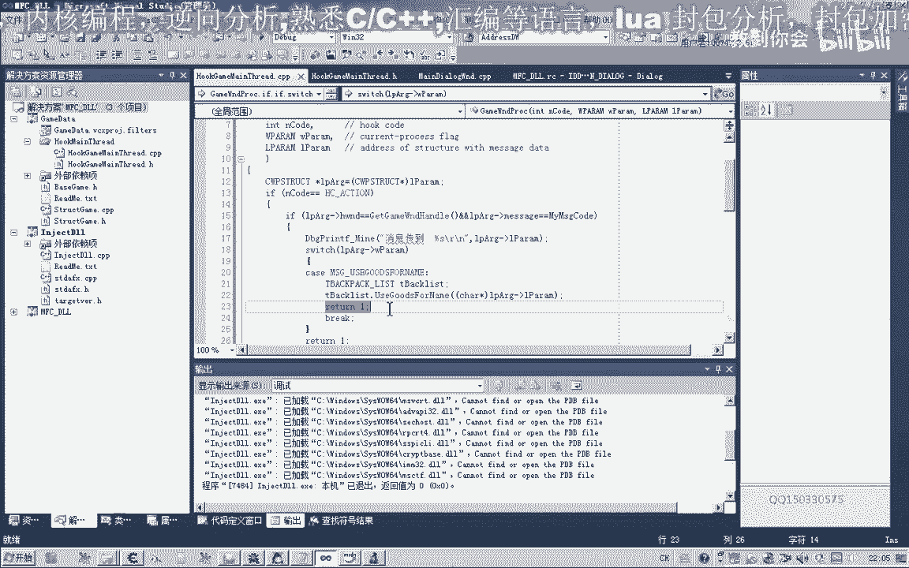

# P6：017-注入代码至游戏主线程 - 教到你会 - BV1DS4y1n7qF

大家好。

我是郁金香老師，QQ155，336575，歡迎大家參加郁金香技術編程培訓，那麼今天我們就一起來看一下，怎麼把我們的代碼，掛到我們的遊戲主線程上面一起，那麼至於原因，上一節跟我們也討論了一下。

也就是多線程，他在訪問一些全局變量共享數據的時候，如果他們有一個同步處理機制的話，那麼就可能造成一個衝突，就會造成我們的軟件的不穩定，那麼所以說我們在這個為了解決這種衝突。

就把我們的代碼輸入到遊戲的主線程運行，那麼首先我們把第15課的代碼打開。

那麼要把我們的數據，輸入到主線程實際上非常簡單，那麼以前我們也有講過，那麼今天我們再重複一下，我們把代碼輸入到遊戲的主線程運行，那麼現在我們就把我們的代碼輸入到遊戲的主線程運行。

那麼我們現在就把我們的代碼輸入到遊戲的主線程運行，那麼我們現在就把我們的代碼輸入到遊戲的主線程運行，那麼我們現在就把我們的代碼輸入到遊戲的主線程運行，那麼我們現在就把我們的代碼輸入到遊戲的主線程運行。

那麼我們再添加一個新增項目，這批就能見，那麼把我們的代碼掛到我們的主線程上面，一般我們常用的方式就是用Settings windows hook。

另外也可以用Settings windows log來替換我們創可的過程，兩種方法都差不多，那麼今天我們還是用Settings windows hook這個函數。

那麼在使用之前我們先打開我們的MSN scan。

先來看一下，那麼我們要掛接到遊戲主線程，我們可以選擇第一個勾子類型，也就是用來安裝一個勾子到我們的創可過程，那麼它一共有四個參數，那麼第二個參數也就是這個創可過程的標函數。

那麼第四個由於我們現在注入的是全局的這種勾子，那麼所以說我們第四個參數動態面積庫的劇品，我們就不需要進入空，那麼最後這一個也就是遊戲主線程的ID，那麼我們也可以通過它的創可劇品來獲取。

那麼所以說我們要先獲取遊戲的創可劇品，那麼遊戲的創可劇品的話，我們一個是可以通過Bundle window，但是為了我們的遊戲來便於多開，這裡我們直接找它存放機制的地方，現在遊戲創可的劇品是這個。

那麼我們直接收一打開，收一下它的機制，那麼這樣收出來的數據比較多，那麼最後我們可以過濾幾次，過濾幾次，我們先把綠色的添加進來，綠色的是機制，這裡有四個，裡頭有六個，那麼這個我們進去看一下。

它的地址是在動態鏈接庫裡面，所以說我們用不到，這個也是動態鏈接庫裡面的，那麼也用不到，那麼我們用得到的就是這個程序去模塊裡面，那麼我們選擇第一個，F010-6574，這個存放的創可劇品的機制。

那麼有關機制的，我們還是把相關的定義，放到我們機制的檔案件，開始，這個有點長，把它寫簡單一點，當然這只是它的地址，我們要把這個地址裡面的數字取出來，我們再寫，給它添加一個函數，以上五個，以上五個函數。

那麼這裡我們用紙，把它讀取出來，把這個地址，當然這裡我們直接用相應的紅來表示，那麼這是異常處理的，如果執行在這裡的話，我們就返回空，那麼執行到這裡，我們執行，返回它的一個劇本，好了。

那麼這裡我們遊戲劇品取到了之後，把它前置一下，放到我們的同文件裏，那麼有了這個遊戲劇本的話，我們就可以得到我們的相應的進場ID了，在這裡我們同文件裏面先訂閱，兩個函數，這個是hook，另外一個是。

那麼我們退出的時候，我們用一個unhook，卸載掉我們的主性成一個勾紙，那麼首先我們是得到窗口的一個遊戲窗口的劇本，那麼得到之後，我們根據它來獲取我們的進場ID，現場ID，那麼後面的進場ID我們用不到。

這裡直接指空就可以了，那麼有了，它我們就可以安裝我們的相應的一個勾紙了，那麼第一個就是我們勾紙的類型，那麼第二個也就是我們的回調函數，那麼這裡我們還需要給它寫一個回調函數，那麼這個回調函數的話。

它的代碼實際上就是運行在我們的這個遊戲的主線程序裏面，那麼在用它之前，我們還需要進行一個全機變量，這個後台，用來呈放它的一個迴值，那麼這個回調函數的名字我們把它改一下，作為它的第二個參數，第三個參數。

動態內景庫的這個魔幻劇本我們不需要，第四個參數，也就是我們的現場ID放進去，那麼這個回調函數的話，我們就會把它掛接到我們的主線程裏面，但是這個函數它也有一些要求，那麼我們的MSDN裏面說。

如果它的ND庫的傳進來的數值等於我們這個常量，那麼的話這個消息就是我們進行的一個消息，那麼我們就可以對它進行一些處理，就可以，那麼如果不是的話，我們必須要用這個Core Next Hook。

把這個相應的消息的傳遞到我們其它的一個，勾制裏面，那麼第一個參數就是我們的全球變量，勾制的序，第二個我們照抄，照抄這前面的，那麼這裏我們要做一個判斷，是不是我們自己的信息進來，需要做一個判斷。

當然還要做一些其它的一些判斷，那麼如果是我們的線程進來的話，我們這裏它還有一個CWP Struct這樣一個結構，這是我們進來的一個窗口的劇本，消息的類型，這兩個是附加的參數，那麼首先我們把這個結構。

就是一下需要定義一個結構變量，那麼我們轉換一下，強制的，那麼這個時候，我們取出裏面的值進行一些判斷，比如說它的窗口距離，是不是我們遊戲的窗口距離，那麼如果是的話，是我們遊戲的窗口消息的話。

那麼我們接下來進行另外的一個判斷，再跟它加上一個條件，那麼我們需要自定義一個信息，自定義一個信息，比如說，自定義一個信息，定義一個群聚變量，那麼註冊一個，我們讓系統來給我們分配一個可用的消息的ID。

這後面看到是一個字符串，那麼我們再做一個判斷，看是不是我們自己的一個消息，那麼如果是我們的消息，這裡我們先可以導入一段調試信息，消息傳到了，然後這裡我們看就可以了，如果是我們自己的信息，我們處理了之後。

直接返回就可以了，好的，那麼我們先編一下，看有沒有錯誤，那麼這個消息，我們怎麼把它傳遞進來，那麼MSDN上面它也有說，在這裡我們需要用Send message，把消息給它投遞進來。

或者是Post message都可以，那麼Send message，我們是要等待它把這個消息處理完，我們才返回，所以說我們這裡建議用Send message，那麼在這裡，我們另外寫一段函數，(音樂)。

那麼在這裡我們用Send message，把我們的消息，傳遞到我們的遊戲裡面，遊戲的主線程裡面，所以第一個參數，這裡是我們遊戲的組裝的一個句點，不然的話，投遞不到我們的，投遞不到這個函數裡面。

那麼第二個參數就是我們的MyMessageCode，這個是我們遊戲圖，給我們同隊的一個消息的ID，那麼後面兩個，我們暫時可以省略掉，暫時用不到，我們要用參數的時候，那麼現在我們可以把最後一個參數。

我們可以把這個指針傳進去，物品名字，那麼傳進去了之後，它就會轉到我們的回調函數裡面來，會轉到我們的回調函數裡面，轉到回調函數裡面來了之後，我們可以把它打印出來，最後一個是參數，這個參數我們可以。

因為我們這裡傳遞的是一個字符算，我們就先把它打印出來，然後我們就可以做一下我們的一個測試了，當然這裡我們還有一些清理的一些工作，這是我們退出的時候要進行的一些清理工作。

那麼接下來我們就可以在我們的資源窗口裡面，添加三個按鈕，這個是我們Hook，或者是叫掛接，這個我們叫卸載，然後我們掛上去了之後，我們可以做一個測試，在這裡我們就傳這個信息，就是使用我們的。

那麼添加相應的同件進行，現在主線程，掛接上主線程之後，我們就可以來傳遞信息，使用我們的青窗要塔，那麼這裡我們要用premise，當然這個函數還沒有，還沒有挖到同件裡面，先把它調整一下，好的，接下來編輯。

然後進行測試，這裡我們需要強制的轉換一下。

我們是自主創意型，先轉換成整齊的，那將，好，好，好，好，好，好，好，先掛接主線程，然後我們使用我們的，這裡它就收到這個消息了，青窗要小的這個消息，然後我們卸載之後的話，然後我們在這裡的話。

消息傳遞不進去了，那麼既然傳遞到了，那麼在這裡，我們就可以了，調用我們相應的一個信息，用一個Switch，這裡我們不是還有另外一個，參數3沒有用，就是這個WP，這個參數沒有用。

然後我們用這個參數來進行一個分類，然後我們給它定義一些紅，這裡是使用物品，或者從一開始看，從一可能要好一點，然後在這裡我們就可以了，調用我們之前的這個同意見裡面，包含相關的一個同意見，好。

然後就是我們的參數4，當然這個參數的話，它本來是一個整形的一個值，我們需要進行一個轉換，因為從這裡傳進來的時候，它也需要一個轉換，本來這裡傳進來是字符串，但是要轉換成這裡，轉換成一個整形的一個數值。

然後到這裡的時候，我們再經過一次轉換，就可以調用這個擴容，那麼這樣的話，我們就能夠使用我們的這個金創藥，使用金創藥，我們來測試一下，那麼首先我們這樣的話，它是沒有用的，我們必須要掛接到主線材。

然後再來使用金創藥，看一下我們的調試信息，關掉，相關的同意見包含進行，掛接到主線材，然後使用我們的金創藥，金創藥，使用成功，我們再來看一下，我們的代碼，對了，我們在這裡。

Send a message的時候，我們要進行一個消息的分類，在這裡我們是傳傳遞的0，那麼現在我們要傳遞的是1，這個時候，兩邊它才匹配，那麼這裡才能夠傳到這個消息分類，這個時候肯定就可以了。

這個時候它就可以使用金創藥了，325克，324，323，用完之後，我們要卸載一下主線材，那麼這樣的話，使用的話是非常方便的，當然還有一種，我們直接把窗口在這裡面，比如說這個位置。

我們可以直接讓它顯示一個窗口，那麼窗口裡面的所有代碼的話，它就是都是運行在主線材裏面，當然這種路式的情況，以前的老片子老的教程裡面有講，有說到，那麼可以參考以前的一個教程，那麼今天的一個討論。

我們就討論到這裡，那麼我們下期再見，再见。

網址：http：//www。spacevidcast。com/。