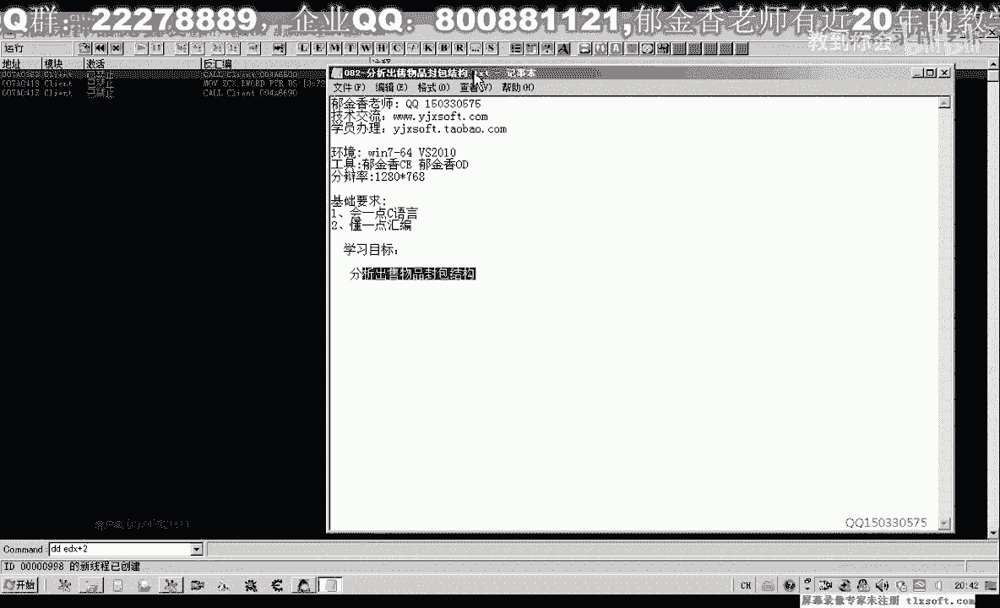
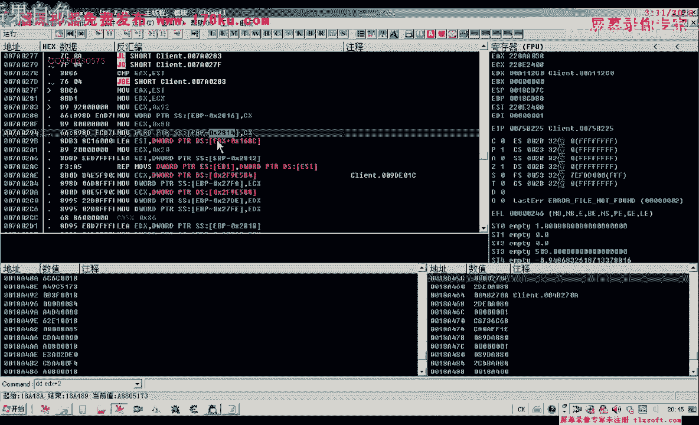
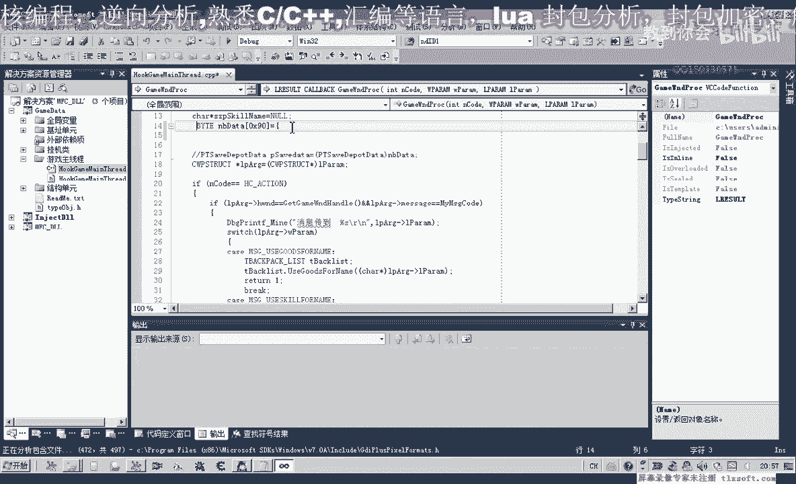
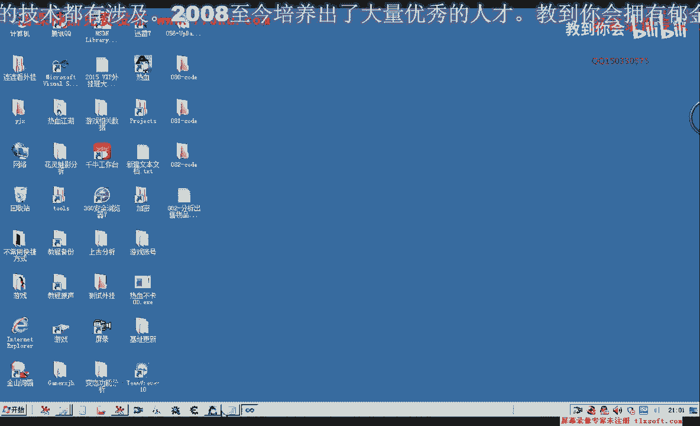

# 郁金香老师C／C++纯干货 - P71：082-分析出售物品封包结构 - 教到你会 - BV1DS4y1n7qF

大家好，我是郁金香老师，那么这节课呢我们一起来分析一下出售物品嗯的封包结构，那么在之前呢我们分析了购买物品的红包结构。

那么我们出售物品的话。

他在购买物品栏之前呃，这是我们之前的分析啊，那么在前面这个位置呢就是出售物品的这个相关的一个缓冲区，交易的货的话，那么在仓库的一些存存取，还有商店的一些买卖呢，它都是调用同一个库啊。

最终呢都是用这个方向服务器发送这个数据包来实现的，那么这里呢2818是它的缓冲区，我们看一下，那么之前呢这里同样的是2818，这个地方呢是它的一个缓冲区，那么2812这个地方呢，这里呢二代表的是出售啊。

所以说我们可以把之前分析的一些数据呢，嗯可能也是有用的，第80依靠，那么我们看一下给前面的一个分析，那么我们把前面的这个分析了哈，复制一下第79 81克的这个，阿斯，好的复制一下，那么用的脚的地方呢。

我们就直接来验证一下，看是否是否可用，那么首先我们来看一下啊，之前呢我们说商店购物的指令是这个80092，那么我们再来看一下啊，那么仓库存取的指令呢是840094。

那么我们看一下在这个出售物品的时候，有没有改变这个地方，再来看一下，这里是2818，我们找一下2816，2816呢，它的副词呢也有一些不一样啊，他是2816，这里呢写了一个呃九日进去。

然后再写了一个八零啊进去，那么它火起来也是00800092。

8000 9万，那么也就是说这个指令的话，虽然说它的写法不一样，那么实际上呢嗯这个商商店的啊，买卖呢指定呢它都是同一个指令。

那么从这里可以看出它是同一个指令，我们也可以在这个地方下一个段来看一下6816。

比如说青创要想出售一个，那么我们可以看一下db，dt 2816，那么我们可以看到啊，同样的是8009这个指令，8009，那么这个指令是没有变的，那么我们接着往下看啊，那么这里呢2812出售。

这里呢它是零二，那么我们再来看一下db 1 dx，那么这里呢是同样是28181d x开开始，那么我们用dd e d x加二看一下，加二的话，这里呢前面的这是，这是他的四肢解指令，然后这里姓名二。

那么我们先把缓冲区了复制出来，那么这个缓冲区的话看起来的话没有我们仓库存放的呃。

缓冲区复杂要简单一些，但是呢他要又要比我们的呃购买物品来的缓冲区来要复杂一些，好的，那么我们先让他跑起来，那么为了比较呃不同的物品分类呢，我们另外呢出售这个人生，出售三个，然后再看一下它的缓冲区。

复制出来，这是新创要小，好先让他跑起来，人生三，那么我们先找一下数量，那么之前的物品的数量的话是在加一六这个位置，那么我们再来看一下，这里是一六啊，这里是一六。

那么证明的话这里的四字解也就是我们的两只解或者是4g解放，因为它的物品数量的话最多是大概是6535996款，这里也有一个物品的上限啊，呃应该是两个字节就能够容纳它，但是这里的话可能他是四个字节的。

那么也是也就是加一六这个地方，那么我们看一下加零六这个地方呢，这里都是二表示我们的购买加4c这个地方啊，应该是加0g这个地方我们看下69块3b，那么这里也应该是我们的物品类型的一个分类编号。

但是呢它前面这里呢多了一串指令，260f1 b28 ，那么我们注意看到这个260f1 b28 ，与前面的这个260f1 b2 吧，它是相同的，那么也就是说在灵异的前面啊，我们还有一个四肢解。

那么这里呢是0a啊，那么这四字节嗯可能也有与我们之前的这个人类似的一个作用，表示了是一个购买的一个物品，那么我们先把它记下来，这四个字节可能是一个固定值，也可能是一个。

那么我们实际上呢也可以用这一段数据来来填充这个缓冲区啊，那么填充之后呢，我们只考虑啊变化的一个数值，那么我们主要就考虑一个变化的数值，那么这里呢我们也不做分析啊，那么变化的只有这个地方。

我们再注意一下后边，那么这个地方呢也是变化的嗯，这个地方的话我们是看一下数量，数量是一六，那么这个地方呢是二六，那么我们也把它标注一下，加26这个地方呢有变化。

那么我们看加26这个地方有多少个字节的变化，首先呢有四字节，然后后边我们再来看一下186，72d1 a，那么这里呢也有四只九，那么以后呢可能是八个字节这里，那么这八个字节的话，我们在分析仓库的啊。

存取的时候呢，也有八个字节，它来源于物物品对象的哦，是这个地方，那么这里呢我们也跟他先标注八字节，那么这个他看是不是来源于我们的物体对象，我们还有待分析，那么我们先找一下啊。

那么我们先找一下背包列表的一个机制，那么这是背包列表的一个基础公式，那么我们先来看一下纹身，他加五四的这个位置，那么我们看一下啊，那么这是第一个啊，金创药金创药小，这是金创要小的这四个字节。

f36429 db，17672d1 a那么我们发现呢的确是来源于我们不评对象的，加五四的八字，请那么这个变化的数据呢也有了，那么这里呢是来源于他的四的这个字节，那么后边的那么后边这里的话我们应该是。

那么前面的这里呢是零一，那么这里呢是1e这里呢是2e这个地方，那么这里的话也是物品类型，乃至于我们物品对象是在这个位置，那么我们再接着往后看，这里呢有一个一，那么这里有一个一，我们不管它。

那么这里有个二，那么这个二的话我们看一下有一个变化，那么我们要看一下这个它是不是一个固定的变化，那么有些呢它是混淆我们一个视听的，那么我们再来重新出售一个金创药小，出售一个再次把它的缓冲区db。

e d x复制出来，当然最好是用记事本这一类的啊，可以来标记它的颜色，把不同的地方标记出来啊，这样是最好，那么我们可以看到啊，这里有个一和零，那么这里呢是二，那么说明这个地方的话。

这个二我这个地方的日的话可能有一些关系，那么我们看一下人生所在的位置，那么人生所在的二栏恰好是背包里面的一个下标二，这里呢如果我们是出售这个秘制的金创药，这里呢可能就是三啊，是它的一个下标，应该是。

那么这里我们也能够看到是数字的三，那么这个地方呢是3f这个地方db加上3f这个地方是三，一次减或者是两字节的，那么因为我们的下标的话，那么我们用一个字节的话，也不表示1~255的数值。

那么如果我们背包呢啊只有几十格的空间，那么所以说我们用一字节就已经足够了，那么我们先标记为一你自己所在的空间，加，三，你自己，就在背包里的下标，那么这个来源于我们对象加上ef 4。

好那么除了这一点不同之外，我们看一下还有哪些地方不一样，那么下下面这行有一个1423，那么这里呢也是一个1423，1423，那么相同的我们不管它这里有个19a啊，一九位，那么也是相同的，这里有一个九位。

这里有个九位九位，那么974f974 f那么这些的话基本上都是相似的，这里嗯八零的这一段数据呢它也是相同的，那么相同的我们就直接用里面的这些数据来去给它做一个初始化，然后我们再修改相应的数值就行嗯。

当然如果是有更多的时间呢，也可以做一些更细致的分析啊，那么我们现在我们是从效率的角度来考虑，那么我们接下来呢我们就可以进行相关的测试，那么我们打开第81课的代码。

那么我们就直接在主线程单元来进行一个测试，在测试第一这里，哈哈哈哈，那么在这里呢我们需要的也是定义啊，定义一个类似的一个变量之前我没有用。

现在我们把它利用起来，那么定义这个变量之后呢，我们就用这个缓冲区的数据来来给它填充，任意一个都可以，那么我们就以下面的人身的数据来进行一个填充，那么在填充之前呢，我们先要把它整理一下。

那么首先呢我们把这前面的数据删掉，然后在后边的数据呢我们也删掉，每一个数据前面呢我们给它加上0x的前缀，那么像这种数据呢，我们先给它替换替换一下，那么替换好了之后呢，我们再给它加上相应的前缀。

每个空格前面呢我们给它加上一个0x的前缀，找一个空格，然后替换成我们的全部替换，嗯取消一下，替换啊，那么0x呢，我们前面加一个逗号，那么这样替换之后呢，我们把多余的删掉，这种我们把它再次替换。

好那么后面呢我们也给他删掉，那么接下来这些呢就是我们所要的这个字节级的数据，那么我们把它复制到里边，然后呢加上一个分号啊，这样呢我们就做完了，我们的初始化，这里插一个逗号，好的，我们先编译一下。

那么这里呢还差一个逗号，那么再次我们编辑生成，啊初始项这个时候他说设置的太多啊，因为这里呢我们多了也好，全零的，这里呢我们已经有有九行啊，每行的是16个字节啊，也就是我们16进制的0x10 。

好的成功了，那么接下来呢我们再进行相应的修改，嗯当然了，我们在这里呢我们先用汇编代码来进行相应的测试修改，把我们之前第81课的代码拿出来，我们进行一下修改。

或者我们直接在d里面发这个相应的代码也是可以的，那我们来看一下，首先这里是我们的e4 x提取出来，然后再是扩的地址提取处理，那么之前呢有两个参数，一个是图形x86 ，那么另一个参数呢是图形e d x。

那么这里呢我们的ex都是可以，那么它来源于都是我们之前的这个结构，那我们看一下之前结构的名字，get up，但是我们要进行一些数据的一些修改啊，在这里，那么我们看一下之前的数据。

那么我们另外在背包里面选一个数据呃，比如说我们用这个选原声来做一个例子，那么要做例子的话，我们需要先手动的把相关的数据呢呃把它找出来，那么我们看一下我们所需要的几个偏移呃，指令啊，这里我们不需要啊。

我们需要的是一个主要的是一个把自己看这里的加五四这个平移，这个地方，还有加四塞这个地方这两个，那么在这里的话，瑶瑶呢是冥币，那么我们先把这八个字节呢嗯复制出来，用dd来显示，从来，这是继位的啊四个字节。

这是高位的四个字节，那么这是来源于五四这个地方位置在在这里啊，26这个偏移这里，那么还有一个呢是我们四色的这个偏移，这里选的四色，好的大致呢就是这两个啊，关键的数据，那么我们再把这相应的这些分析了啊。

复制一下，转到我们的测试代码，这，那么首先呢我们选择指定，同志，那么首先是加二这个地方，那么写入我们的商店购买的一个指令，然后我们把前面这段指令复制一下，那么加上这个偏移之后呢，然后是加六这个偏移。

这里二表示出售，然后是加a这个地方呢我们用不着改动啊，之前呢这里呢就已经有了啊，有了相应的这个数据，这里的260f开始的，那么所以说这里呢我们用不着再复制，那么这里呢我们去掉这个偏移。

那么再次加领域这个地方，零一这个地方呢我们就是这一串数字，那么除了这个领域的话，还有呢是一个任意这个地方啊，我们也写一个相同的数字进去，20121，然后再416，这里的生物品数量。

比如说我们一次购买三个，那么还有26，这里呢是八个字节，所以上这个超出我们啊数量时的，我们都需要加0x前缀啊，大于0x8 的啊，0x9 的我们就需要加上这个前缀，那么在这里呢是八个字九，啊。

好最后还有一个物品所在的下标3f这里，那么下边呢它是0b0 x0 b法也可以输十进制的，一一都是可以的，好那么我们再次编译一下，那么看来的话这里有个请客呢，他可能是不支持这种啊，一字来写四个字节进去的。

那么我们可以在这里呢可以分为两个字节，两个低温的类型来写，那么在这里呢再加上前面的四字节的一个偏移，那么这里写第一位的，这个事情，那么这里写高位的四个字节，好我们再次编译，噗，好的。

那么我们进入到游戏里边啊，进行一下测试。

化学到主线成，那我们看一下我们所添加的啊，tt那你是购买血缘生三个啊，出色啊，这个血缘生三个，那我们看一下161，如果是成功的话，就1158，好的，那么我们这节课的这个测试来成功了，那么成功之后呢。

我们下一节课呢我们就对这个相应的这个函数来进行封装啊，那么这里呢也给大家留一个作业，那么大家自己下去啊。

封装一下这个函数，那么首先呢还要定义一个类似的一个结构，这样我们的可读性能才会高一些，那，么第一个参数呢是我们要出售物品的名字，第二个呢是我们要出售物品的一个数量，那么这个呢就是一个坐垫嗯，留给大家。

那么之前呢已经有类似的这个例子，大家可以参考一下81课的啊，这个代码好的。