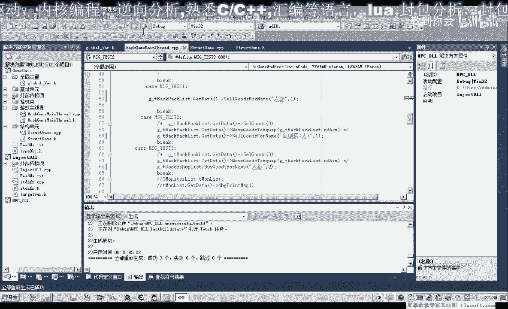
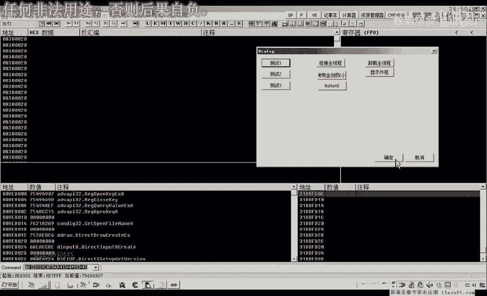
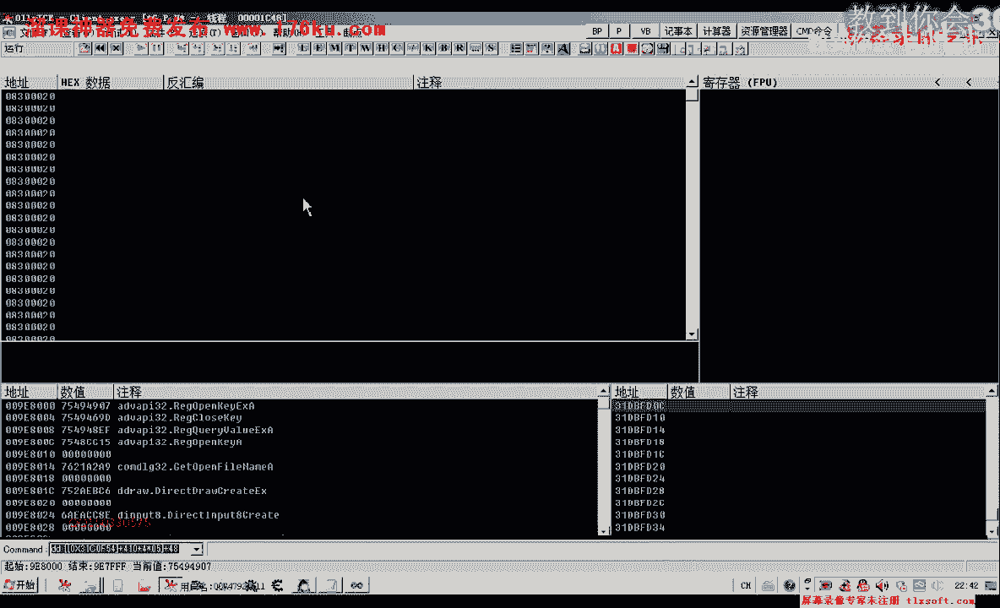
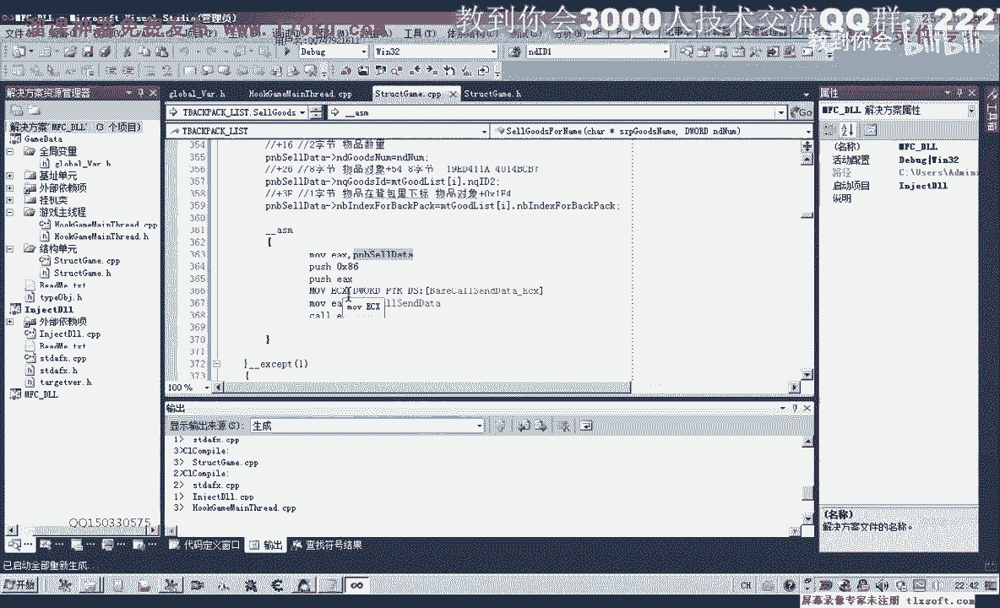

# P72：083-封装物品出售函数SellGoodsForName - 教到你会 - BV1DS4y1n7qF

大家好，我是郁金香老师，那么上一节课我们一起分析了物品出售，相关的风暴的结构，以及计算出来相应的偏移，那么这一节课我们一起来封装这个函数，那么也就是出售，向商店出售我们物品的函数。

那么首先打开第82课的代码，第82课的代码是，物品出售的函数是3。3%，第82课的代码是3。3%，那么我们先来看一下第82课的代码是多少，1。0%，第82课的代码是3。3%，第82课的代码是3。3%。

那么首先我们转到结构单元，那么我们看一下需不需要重新定义结构，之前我们用到的偏移，我们把它复制出来，首先+2这个地方，+6，然后+1，+2这个地方没有，那么这里它多了一些东西。

需要对+2这个地方进行一些修改，那么我们看一下+16之后，这里是1A，1A的话，我们1A到，因为这里是16过了，我们是2E这个地方，需要给它添加一个物品的类型，还有就是3F这个地方，那么这个结构的话。

我们需要重新的写一下，(音乐)，我们就在之前的基础上进行一下修改，应该也是可以的，因为它之前的这些偏移，给它应该是没有冲突的，我们再来看一下，里面这个地方，这个地方可以不要，1E，然后这是16。

16过了，我们是26这个地方，要加上16个字节，那么这16个字节的话，我们因为前面这里已经占了4个字节，那么实际上我们这里要减掉4个字节，那么实际上这里就是0X0C，那么在后边的话。

就是我们的+26这个地方，+26我们看一下是物品对象的8个字节，那么我们再来看一下之前的结构，之前是买入这个物品的话，它不需要我们26的这6个字节的数据，那么在这里我们在，这里我们应该是8个字节。

8个字节我们是google，那么26过了，我们再是21，6到21，那么6到1的话，我们也是占的好像是8字节，14这个地方，那么也就是说我们26来，恰好是加上这8个字节，恰好就等于21。

那么这里我们写Dword，26这里是8字节，21这里是4字节来源于4C这个地方，那么也就是我们的，Buy Sale Type，那么21之后，我们再看一下，这里还有一个3F，那么21过来是3E。

那么我们加上这里的4字节，那么实际上我们还要加上9个字节，应该是，我们再来计算一下21，那么这里占了4个字节，再加上12个字节，13个字节才可以，那么这里我们用Y点来表示，21加上这4个字节的话。

恰好就等于32，32的话，到3F的话，我们差13个字节，那么这里我们加上13，我们再来看一下是不是这样的，这里是我们的2E，到我们的这个地方，我们数一下有多少字节，3F应该是到这个地方。

那么这前面一共有13个字节，那么这里我们就是13，那么这一字节，我们就是它的一个下标，再来看一下，是背包的一个下标，一个字节来源于EF4，那么这个结构的话，我们就可以增加这些东西。

就可以增加这些相应的一些偏移，当然在后边的话，我们可以把它定义小一些，因为前面已经这里从这里已经是3F了，那么这里我们定义为0个字节，应该就够了，511加上3F的话，3F再加上这1字节的话。

前面就是0X40，这里加50就可以了，好的，我们先编译一下，那么接下来我们进行了相关功能，函数的一个封装，因为这些数据都是与我们背包的一些数据，相关联的，那么我们把它放在背包结构里面，啊，"關閉。

關閉"，(音樂)，(音樂)，轉到第一，然後我們在後面添加我們相關的函數，這裏有個Getty Google字音，Text for later，我們需要用到這是商店的，我們需要的是背包的同名的函數。

首先我們也是通過物品的名字去查詢，這個物品在背包裏面的一個下標，如果我們查詢到下標，它是小於0，我們直接就返回，就是沒有這個物品出現，如果查詢到相應的物品，我們就進行出售，(音樂)。

在這裏我們添加我們之前測試的匯邊代碼，當然之前的這一段我們也可以把它省略掉，在這之前我們只需要定義一個相應的結構就可以了，在定義結構的時候，我們也給它進行一個相應的初始化，移到我們的主線材。

我們先嘗試看編譯器，它是否支持字節集的初始化，我們首先編譯一下，編譯生成，看來它不支持這樣的一個初始化，所以說在這裏我們就用指針來進行一個操作，那麼指針在指向前面的緩衝區。

我們通過這種方式來進行一個轉換，再次編譯生成，(音樂)，然後我們再進行相應的修改，首先是+2這個篇，我們進行修改，然後+6這個地方，我們繼續修改，(音樂)，我們再轉到結構裏面去看一下。

好像這裏我們有些錯誤，這裏我們+6表示的是出色，我們再來看一下相關的編譯+6，這裏我們應該是+1或+2才是物品的類型，這裏我們在取名字的時候，有點失誤，+1+2，這裏是物品類型，我們這樣取名字更好一些。

那麼再次移到我們的源代碼單元，接著就是我們+0或+2這個篇，這裏就是Type2，然後我們進行相應的複製，那麼這裏的複製的話，我們需要先搜索一下相應的物品名字，這裏我們有一個相應的一個下標過去了。

那麼現在我們就需要用到這個下標，+5是這個地方物品類型，然後把它複製一下，還有是+2這個地方，也要進行一個類似的操作，然後是物品數量+16這個地方，物品數量這裏，我們之前參數這裏傳進來的數量。

然後這是一個8字，那麼來用ID2這個地方，或者我們也可以對它進行修改，這個地方我們把它替換為叫做物品的ID也可以，那麼最後這個是物品的一個下標，那麼直接複製為按，那麼或者是從輸出裏面取值。

它的屬性裏面也有這樣一個數值，那麼這一段對於指針的操作的話，我們需要來把它移到我們的，這個匯編代碼之外去進行一個操作，那麼接下來我們再進行編輯，對，這個下標，我們在這裏重新把它切換一下。

這裏聽音變亮的時候，好，那麼接下來我們進行相應的測試，移到我們主現成單元，先到全局變量單元，我們找到背包的全局變量，好，那麼我們在這裏，出售人參，出售數量1，那麼在測試二這個地方，我們這裏的金創要到。

那麼在這裏我們購買，那麼接下來我們進行一下測試，調整一下，工作目錄，掛接主現成。

然後我們轉到遊戲裏面看一下，那麼這個時候我們是出售人參，再看一下我們的代碼，這裏出售人參數量1，那麼因為我們打開的NPC不是平時值，這個NPC，那麼我們先打開NPC平時值，這個時候我們發現購買人參。

可以在出售人參的時候，這個時候沒有正確的反應，那麼我們先來看一下緩衝區的參數，是否正確，偏移，我們先來對比一下，再來檢測一下我們的代碼，然後我們再檢測一下我們的資料，我們現在是在出售人參的這個時候。

我們是有一個狀態，我們現在是在出售人參的這個時候，我們是有一個狀態，我們現在是在出售人參的這個時候，我們是有一個狀態，我們現在是在出售人參的這個時候，我們是有一個狀態，我們現在是在出售人參的這個時候。

我們是有一個狀態，我們是在出售人參的這個時候，我們是有一個狀態，我們是在出售人參的這個時候，我們是有一個狀態，我們是在出售人參的這個時候，我們是在出售人參的這個時候，我們是在出售人參的這個時候。

我們是在出售人參的這個時候，我們是在出售人參的這個時候，我們是在出售人參的這個時候，我們是在出售人參的這個時候，我們是在出售人參的這個時候，我們是在出售人參的這個時候，我們是在出售人參的這個時候。

我們是在出售人參的這個時候，我們是在出售人參的這個時候，我們是在出售人參的這個時候，我們是在出售人參的這個時候，我們是在出售人參的這個時候，我們是在出售人參的這個時候，我們是在出售人參的這個時候。

我們是在出售人參的這個時候，我們是在出售人參的這個時候。

我們是在出售人參的這個時候，我們是在出售人參的這個時候，我們是在出售人參的這個時候，我們是在出售人參的這個時候，我們是在出售人參的這個時候。

我們是在出售人參的這個時候，我們是在出售人參的這個時候，我們是在出售人參的這個時候。

我們是在出售人參的這個時候，我們是在出售人參的這個時候，我們是在出售人參的這個時候，我們是在出售人參的這個時候，我們是在出售人參的這個時候。

我們是在出售人參的這個時候，我們是在出售人參的這個時候，我們是在出售人參的這個時候，我們是在出售人參的這個時候，我們是在出售人參的這個時候，我們是在出售人參的這個時候，我們是在出售人參的這個時候。

我們是在出售人參的這個時候，我們是在出售人參的這個時候，我們是在出售人參的這個時候，我們是在出售人參的這個時候，我們是在出售人參的這個時候，我們是在出售人參的這個時候，我們是在出售人參的這個時候。

我們是在出售人參的這個時候，我們是在出售人參的這個時候，我們是在出售人參的這個時候，我們是在出售人參的這個時候，我們是在出售人參的這個時候，我們是在出售人參的這個時候，我們是在出售人參的這個時候。

我們是在出售人參的這個時候，我們是在出售人參的這個時候，我們是在出售人參的這個時候，我們是在出售人參的這個時候，我們是在出售人參的這個時候，我們是在出售人參的這個時候，我們是在出售人參的這個時候。

我們是在出售人參的這個時候，我們是在出售人參的這個時候，我們是在出售人參的這個時候，我們是在出售人參的這個時候，我們是在出售人參的這個時候，我們是在出售人參的這個時候，我們是在出售人參的這個時候。

我們是在出售人參的這個時候，我們是在出售人參的這個時候，我們是在出售人參的這個時候，我們是在出售人參的這個時候，我們是在出售人參的這個時候，我們是在出售人參的這個時候，我們是在出售人參的這個時候。

我們是在出售人參的這個時候，我們是在出售人參的這個時候，我們是在出售人參的這個時候，我們是在出售人參的這個時候，我們是在出售人參的這個時候，我們是在出售人參的這個時候，我們是在出售人參的這個時候。

我們是在出售人參的這個時候，我們是在出售人參的這個時候，我們是在出售人參的這個時候，我們是在出售人參的這個時候，我們是在出售人參的這個時候，我們是在出售人參的這個時候，我們是在出售人參的這個時候。

我們是在出售人參的這個時候，我們是在出售人參的這個時候，我們是在出售人參的這個時候，我們是在出售人參的這個時候，我們是在出售人參的這個時候，我們是在出售人參的這個時候。

