# 郁金香老师C／C++纯干货 - P73：084-1级任务分析_接任务 - 教到你会 - BV1DS4y1n7qF

大家好，我是欲擒相老師，前面的分析的話，我們已經到了一個階段，那麼接下來這一階段，我們主要分析任務相關的這些數據，那麼今天我們就來分析一下怎麼接這個任務，那麼我們以一級的任務。

天下第一虎空為例來分析一下怎麼接這個任務，那麼新建了一個賬號之後，進來之後我們打開control加扣，這個裏面有一個任務，當然前面這些任務它現在都不能夠接，那麼只有一個天下第一虎空，這個任務可以完成。

那麼其他的任務它是一些活動的任務，這個條件達不到，那麼首先我們把這個任務列表打開來，它要求這個任務去找這個門主，那麼可以查看地圖，實際上我們要在這個位置，先找這個NPC，不是找門主，而是找這個京香玉。

第一不是，說說這個遊戲它的描述，肯定有些問題，那麼現在就是在京香玉這個地方，那麼我們打開之後，需要在這裏來確認這個任務，天下第一虎空，我們看到這前面這裡是白色的，表示這個任務可以接，好。

那麼我們來看一下這個任務該怎麼接，那麼它需要幾個步驟，首先打開NPC，然後確定任務，最後才是點擊天下第一虎空，這樣能夠接這個任務，那麼我們這一刻主要就來分析這一部分的數據，那麼先打開OD。

那麼接任務的話，肯定會向我們的服務器來發送相關的數據。

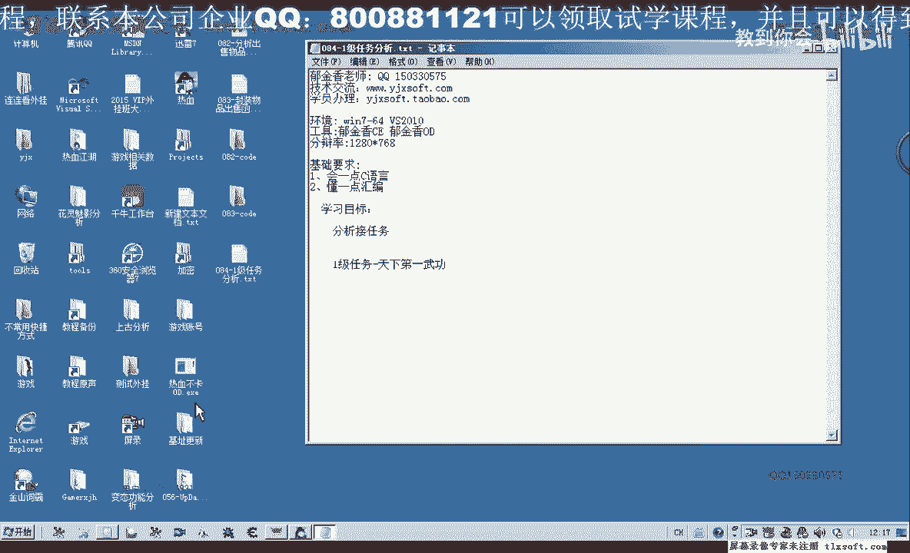

那麼我們就從數據包來入手。

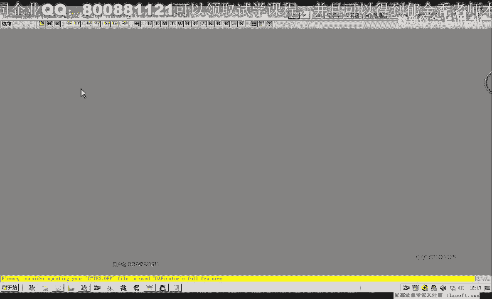

那麼首先我們下一個相應的斷點，當然了，我們主要是打開NPC，這些我們之前已經有過分析了，還有這些菜單的選項，我們也已經有分析，那麼我們主要的就是天下第一虎空，在接受這個任務的時候。

我們看一下它發包的一個情況，好。

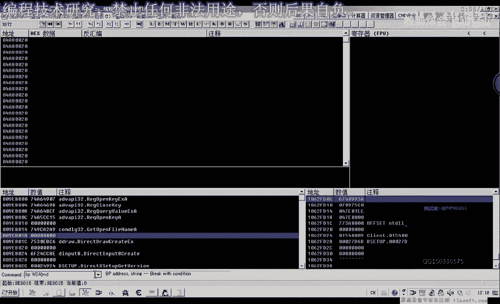

那麼再點擊天下第一虎空，那麼這個時候它會斷下來，會斷下來，那麼我們來看一下，這個時候我們可以讓它發包示範，那麼我們又可以分析相應的數據，那麼我們可以修改參數2，那麼這裡我們可以把它修改成另外的數字了。

就會造成它發包示範，但是我們數據的來源我們能夠分析到，這個時候，那麼我們執行到返回，這裡可以看到WSS，那麼再返回一層，那麼就到了6690這個地方，也就是我們買賣物品相關的這個庫，但是這裡它的參數是零。

說明它的緩衝區的話，數據只有12個字節要少一些，那麼這裡是它的緩衝區，我們在這個地方進行下段，那麼再退出來，那麼我們看一下退出關閉窗口的時候，它也會在這個地方發送一個公包，任務相關的。

那麼我們重新再來確認這個任務，這個時候我們這個任務還沒有確定，那麼我們再次點一下，天下第一武功，接這個任務的時候，我們看一下它的一個緩衝區，ECXUSP，那麼它的緩衝區非常的簡單。

那麼這裡有一個83006，就是這一串，那麼實際上不到16個字節，那麼後面的全部是一個大片的零，好的，我們複製一下這串數據，那麼我們還是要讓它失敗。

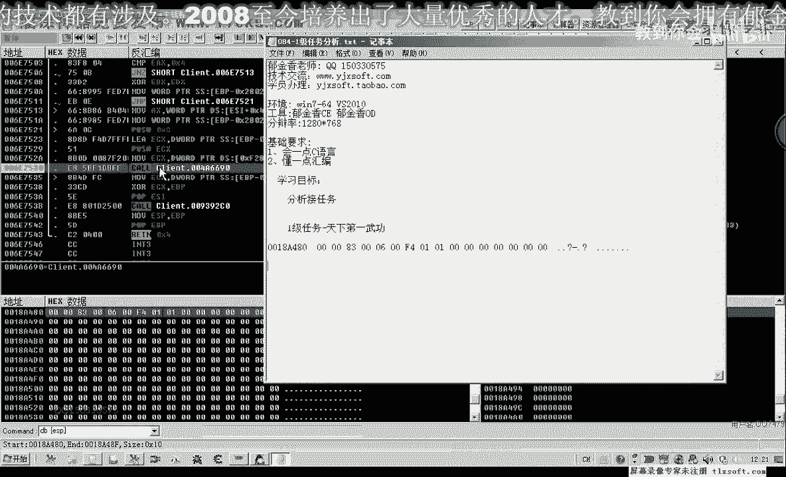

失敗的話，我們可以來NF7跟進，或者是修改一下緩衝區，讓它的指令出錯，這個時候它就不會真正的，不會真正的接這個任務，那麼我們接下來才方便測試，那麼先把這個斷點來取消掉，好，那麼我們再次的時候。

我們已經得到了它的一個緩衝區的一個數據，那麼就是這段數據，我們接這個任務的緩衝區數據，那麼我們需要把這段數據來填充進去，理論上就可以了，實現我們的接這個任務，接任務，那麼我們可以把第83個的代碼打開。

進行一下相應的測試，當然我們像這種數據少的，我們也可以用另外一種方法來測試，用代碼輸入器可能要簡單一些，那麼我們可以在查看數據的時候，把它分為四個字節一段，那麼在這裡的話，它就是我們從低位開始排序。

0000008300看一下，低位是這樣的，0000，這應該是低位，這樣來，從00830000這樣來，然後這裡我們的四字節，四字節的有一個單位，那麼這裡我們需要跟它反過來。

然後再是我們的01F400006，然後再是我們的0001，最後這裡是全0，這就是我們的四字節的低位等類型來顯示的話，那麼既然是這樣的顯示，也就是說加0這個偏移這裡是83，那麼我們可以先壓在一個。

然後再複習1，再複習相應的長量，那麼最後再複習這個數字，就可以進行一個相應的測試，那麼這樣的話，我們就構成了一個是ESP，以ESP為偏移的這樣的一個緩衝區，那麼這樣佔了16個字節。

那麼佔了16個字節之後，接下來我們把這個緩衝區的地址取給我們的ECX。

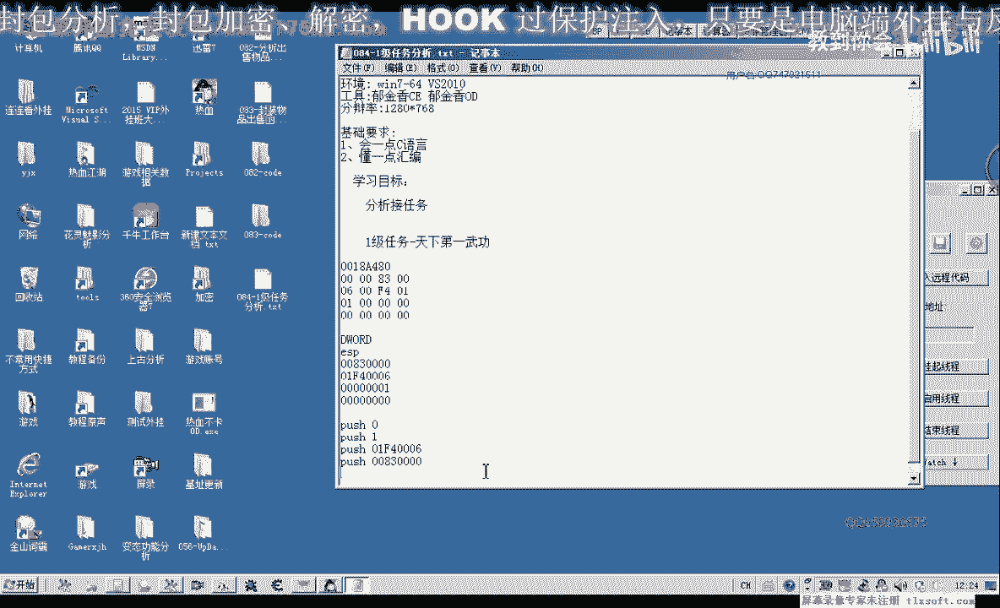

ESP，那麼然後再複習0C，然後再擴，當然還有一個ECX的參數，複製出來，那麼這裡我們要先複習，0C-0C-ECX，最後才是擴，當然這裡我們執行完了之後，之前這裡分配的這16個字節，我們要把它還原。

因為這裡的話讓我們的ESP的值改變了，減少了16個字節，那麼在這裡我們APP ESP-EX10要加上16個字節。

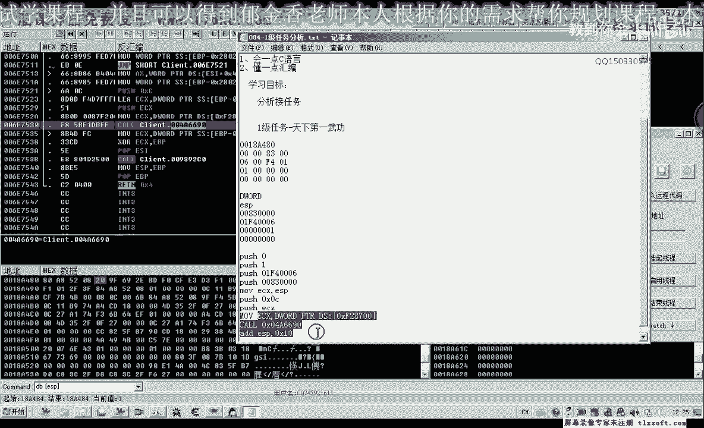

好，那麼這樣我們理論上的話就可以接天下第一武功的任務，那麼我們來嘗試一下，但是這個時候我們發現了這裡它沒有反應，輸入竟然也沒有出錯，也沒有成功，那麼成功的情況的話，它會出現。

那麼應該是點接受之後才是我們接這個任務，剛才我們分析的只是這個菜單，那麼我們重新在這裡來進行下段，那麼我們分析的地方可能錯了，再重新下段，再點接受，那麼這個時候才是真正的接任務，那麼我們返回。

同樣是這個地方，接任務，那麼我們看一下，現在ESP+4這個地方的偏移，那麼實際上我們用DD來查看，這樣方便了我們壓榨，修改一下我們的參數，把這幾個參數實際上只有12個字節的一個數據。

它代表的是接這個任務，當然我們把這個修改一下，讓它的任務先接收不成功，等一會我們才方便測試，好的。

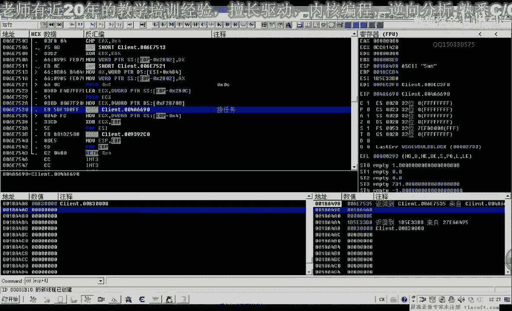

停到這個界面，然後我們修改一下我們的參數，剛才我們的數據沒有抓下來。

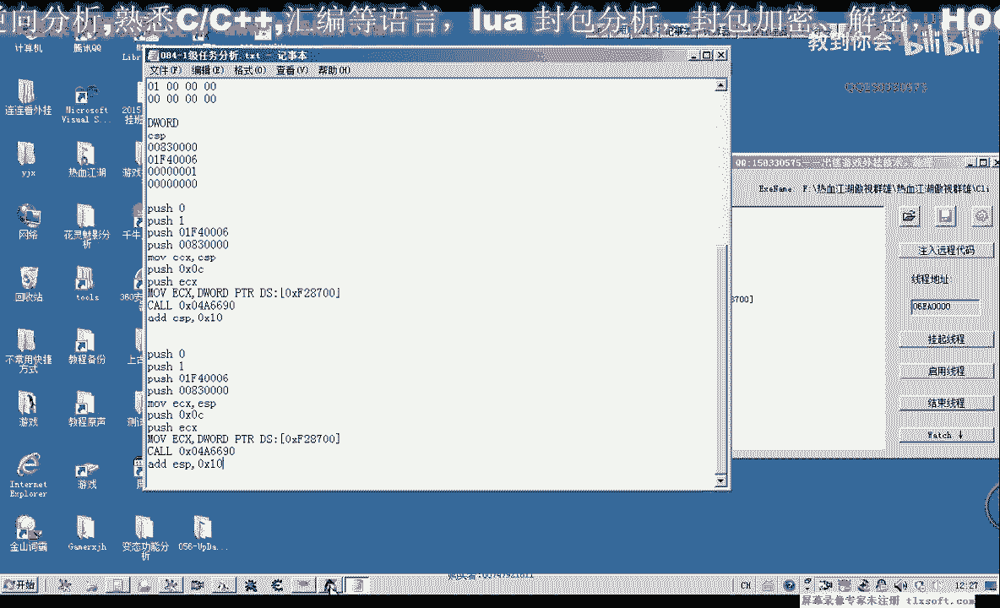

再重新抓一下，天下第一，接任務來這裡，點了它是第一次的數據。

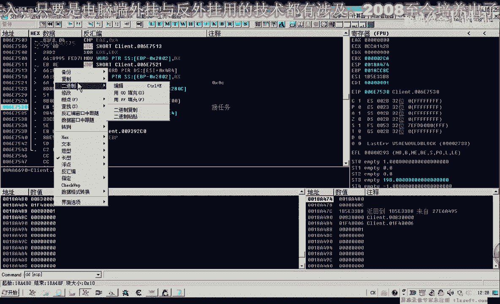

這裡是1。

然後顯示了之後，我們這裡有一個接受，接受之後，這裡它是2，這裡數據的一個變化。

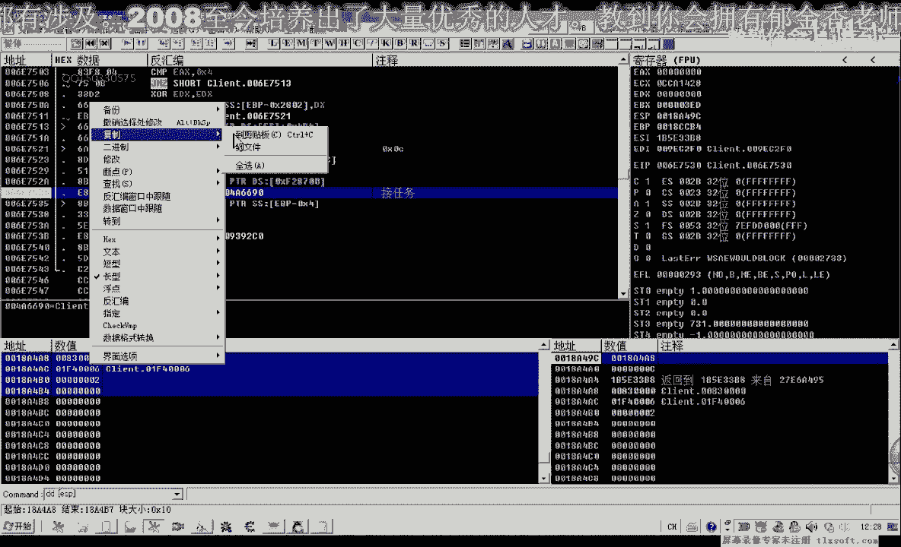

那麼我們先把它複製出來，那麼我們看到EF4083，它有1，2這兩個步驟，應該接連掉了兩次這個框。

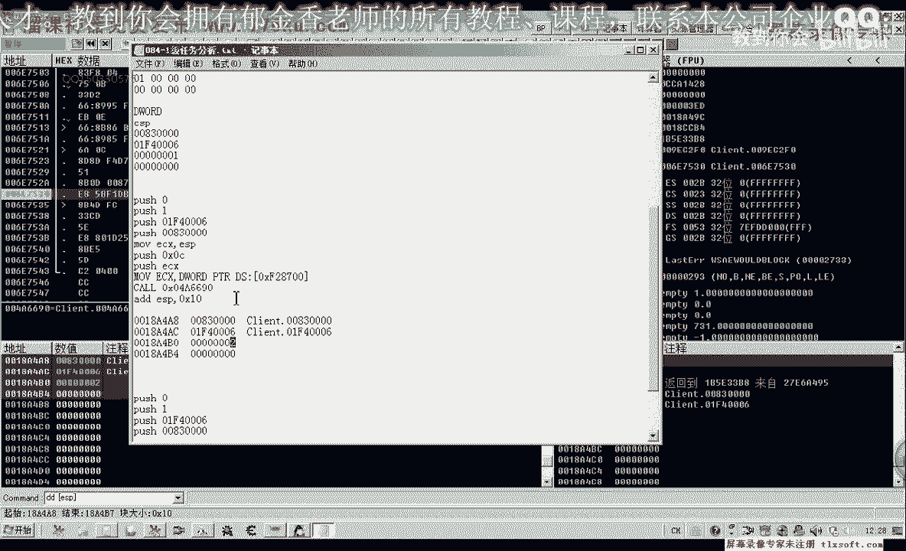

應該是，好，那麼我們再把它修改一下，讓它掉用失敗，那麼接下來我們重新來傳遞一下它的參數。

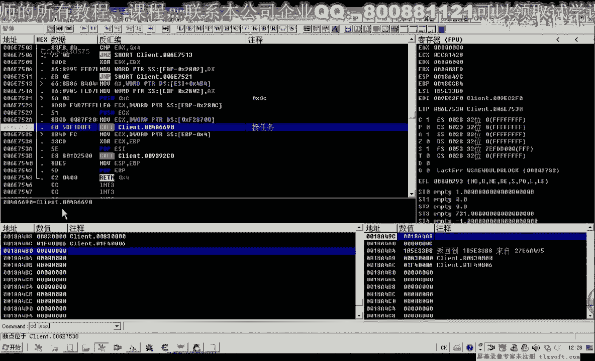

那麼也就是說這個地方是1，應該傳數字1進去，這個時候0，2，然後是EF406，然後是8300，這裡應該是2，那麼這個時候我們可以看到它說來獲得一個金香玉的書信，那麼說明這個任務我們已經接下來了。

現在這個任務目錄裡邊的話就沒有這個目錄了，那麼我們可以另外建一個任務來做一下相關的測試，那麼在這裡我們可以任意的創建一個任務，來做一個相關的測試，那麼我們以後會繼續做一些相關的測試。

那麼我們在這裡就先說到這裡，我們接下來會來做一個測試，然後我們再說一下這個任務的解決方案，那麼接下來我們會來做一個測試，那麼接下來我們會來做一個測試，那麼接下來我們會來做一個測試。

那麼接下來我們會來做一個測試，那麼接下來我們會來做一個測試，那麼接下來我們會來做一個測試，那麼接下來我們會來做一個測試，那麼接下來我們會來做一個測試，那麼接下來我們會來做一個測試。

那麼接下來我們會來做一個測試，那麼接下來我們會來做一個測試，那麼接下來我們會來做一個測試，那麼接下來我們會來做一個測試，那麼接下來我們會來做一個測試，那麼接下來我們會來做一個測試。

那麼接下來我們會來做一個測試，那麼接下來我們會來做一個測試，那麼接下來我們會來做一個測試。

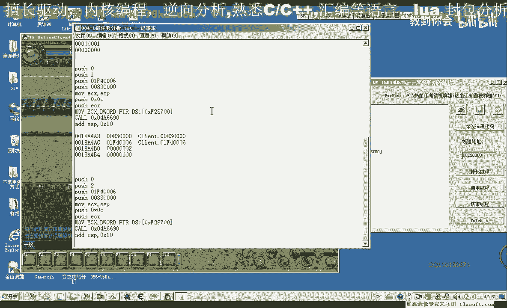

那麼接下來我們會來做一個測試，那麼接下來我們會來做一個測試，那麼接下來我們會來做一個測試，那麼接下來我們會來做一個測試，那麼接下來我們會來做一個測試，那麼接下來我們會來做一個測試。

那麼接下來我們會來做一個測試，那麼接下來我們會來做一個測試，那麼接下來我們會來做一個測試，那麼接下來我們會來做一個測試，那麼接下來我們會來做一個測試，那麼接下來我們會來做一個測試。

那麼接下來我們會來做一個測試，那麼接下來我們會來做一個測試，那麼接下來我們會來做一個測試，那麼接下來我們會來做一個測試，那麼接下來我們會來做一個測試，那麼接下來我們會來做一個測試。

那麼接下來我們會來做一個測試，那麼接下來我們會來做一個測試，那麼接下來我們會來做一個測試，那麼接下來我們會來做一個測試，那麼接下來我們會來做一個測試，那麼接下來我們會來做一個測試。

那麼接下來我們會來做一個測試，那麼接下來我們會來做一個測試，那麼接下來我們會來做一個測試，那麼接下來我們會來做一個測試，那麼接下來我們會來做一個測試，那麼接下來我們會來做一個測試。

那麼接下來我們會來做一個測試，那麼接下來我們會來做一個測試，那麼接下來我們會來做一個測試，那麼接下來我們會來做一個測試，那麼接下來我們會來做一個測試，那麼接下來我們會來做一個測試。

那麼接下來我們會來做一個測試，就在我這兒，不敢。

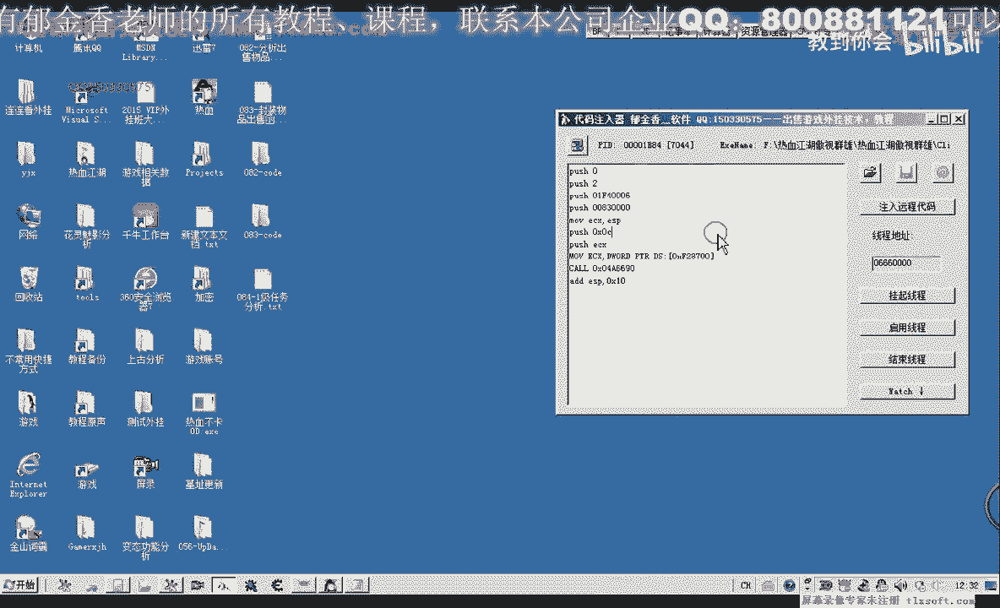