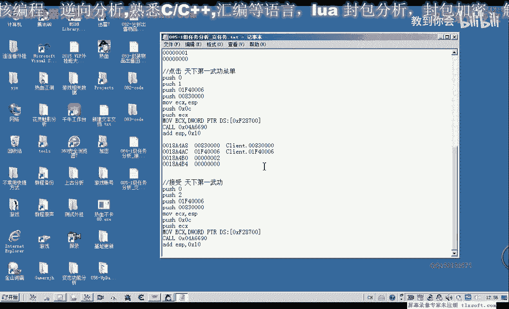
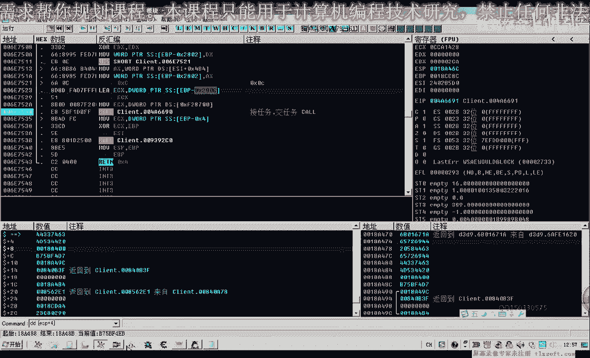
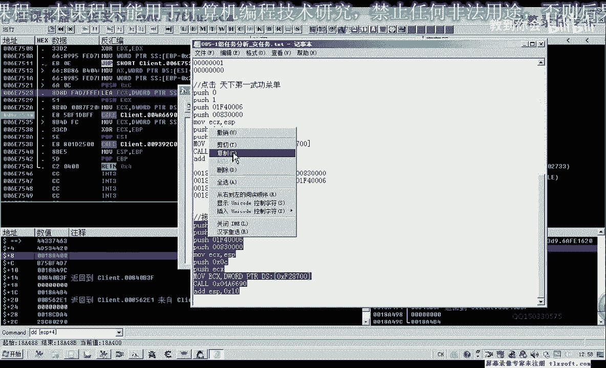
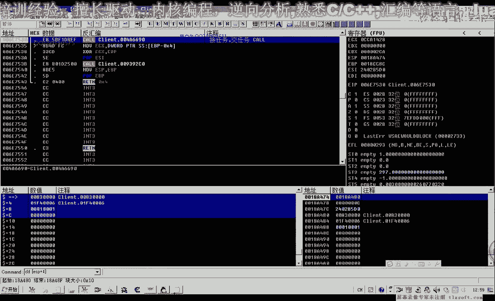
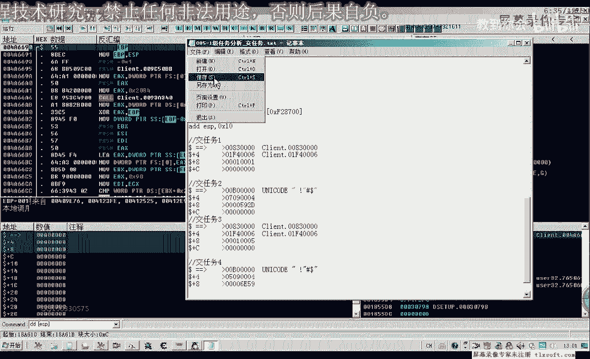
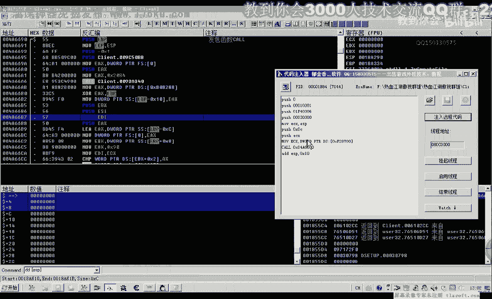
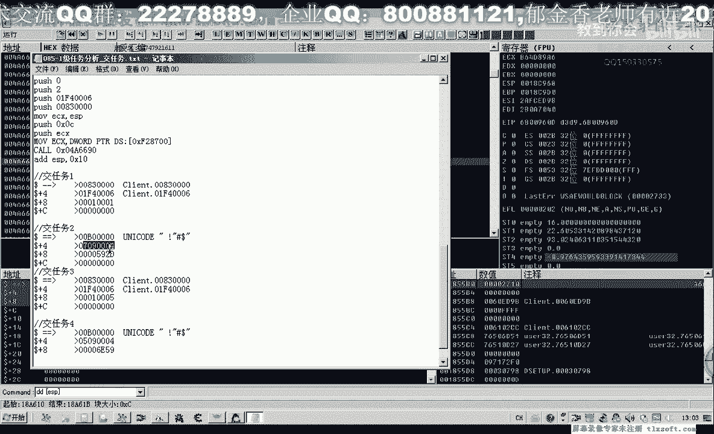
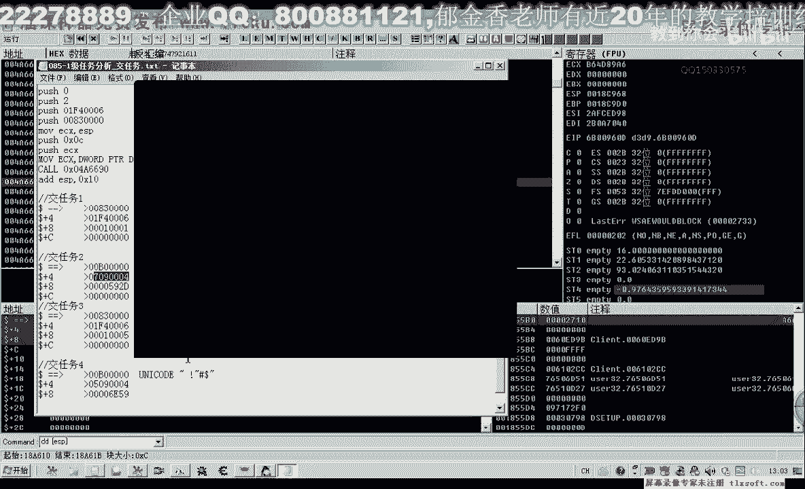
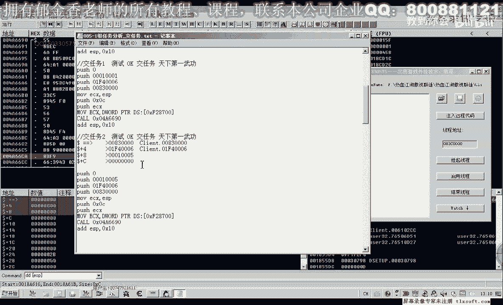

# 郁金香老师C／C++纯干货 - P74：085-1级任务分析_交任务 - 教到你会 - BV1DS4y1n7qF

大家好，我是郁金香老师，那么上一节课我们一起来分析了怎么来接这个详细的任务，那么这节课呢我们来分析一下呃，怎么把我们的任务来完成啊，把任务交给npc，那么上一节课我们接了任务之后呢。

在任务物品里面就有一个金镶玉的书信，那么我们再次按ctrl q打开我们的任务列表，里边有一个天下第一武功，他说拿着数据来去找这个盟主，那么我们需要找到某门主的这个位置，在这个这个位置。

那么我们跑到这个门主这个地方呢。

我们就可以完成我们的任务的一个交接，那么点一下这个天下第一武功的，话嗯好像就可以完成这个任务，那么我们通过通过我们的og来在46690这个地方的下段，也就是我们发包的这个函数，我们先下一个断点。

然后看一下，点击一下天下第一普空，这个时候呢它会断一下，那么我们看一下，返回上一层，那么我们可以看到也是在接任务这个地方，那么接任务呢与交任务呢，它是在同一个这个地方调用的，也是用的同一个结构，可，嗯。

那么首先呢我们也是转到这个usp加四这个地方，因为这里呢传进来这个前面的280售的话的地址呢，就是这个18480这里，那么我们转到这里看一下，那么前面呢都是一样的，这里这前面两句都是一样的。

那么可能后边加零八这个位置呢可能就是我们的任务任务编号啊，而这前面的表示我们交接任务这八个字节，那么这里呢它是1001，那么我们先破坏掉这个数据，先让它跑起来，然后呢我们再用我们的代码注入器进行测试。

那么现在呢这里呢已经改变了，变成了1001，好像是这么多哈，那么我们再进行一次拦截，看一下，天下第一幅图，这个数字复制出来，1001，那么我们先把它弄用零来填充，然后再用我们的这个相关的这个代码来完成。

按e s c键啊，再重新来退出来，进到打开m p c对话，然后呢，我们再注入我们的代码，但是这个时候注入呢我们并没有反应，那么我们先再重新下段啊，试一下，在这个地方也下一个断点点，天下第一武功。

那么我们看一下1001ef 4，我们把这里的缓冲区数据复制出来。

这里是交任务的数据，那么第二次呢他断在另外一个地方啊，那么我们从这里返回，那么可能是这个地方呢才是我们的交任务，那么我们先看一下它的一些相关的数据，那么这是它的一个缓冲区。

那么可能这个才是我们的真正的交任务的这个包，或者是要需要这两个包来组合起来完成，那么我们先让他跑起来，那么这里呢还会再次的断一下，我们再来看一下这个地方，usp加c啊，这里应该是看e s p的这个数字。

那1005，好再次让它跑起来，再看一下现在usp的数值，让他跑起，好那么这个时候呢我们看一下它可以来完成我们的呃，相应的这个任务就完成了，但是我们不知道它究竟是哪一步取了起了这个关键性的一个作用啊。

那么我们这里的堆栈的数据呢，我们都把它复制出来，相当于他可能发发送了一共四五个吧，这个数据包。

那么这个时候呢我们可以来啊换一个角色来重新进行这个测试啊，因为这个角色它的任务物品已经消失了，我们不能够再做相关的这个测试，好的，那么我们重新换一个账户，那么重新换一个账户之后呢。

我们也打开这个本质目列表啊，嗯这里呢显示我们的天下第一，我们这个任务还没有完成，那么我们接下来我们就用我们的代码注入器来进行相关的测试。

把我们刚才抓取的这些缓冲区数据来进行相应的测试，那么首先呢是1001，那么我们进行注入，那么注入之后呢没有反应，那么我们再来看一下在下边这个数据。

那么the one默认这个地方，那么首先是零，然后是这个525920，然后是这个数字，然后再是00b，那么我们再用这个缓冲区来试一下啊，这个参数，那么这个时候呢也没有环境。

那么我们接着用下面的这个数值来进行一下测试，这里是0100，然后再是ef 4，1005应该是在这个位置，最后呢这里是8300，好的，那么我们把相关的代码复制一下。

那么这个时候呢我们发现的是这一串数字呢来完成了我们的这个任务，来完成任务，那么可能呢就是这个任务三，这里这里测试，ok，哈哈哈哈哈，那么可能就是这两段代码一个是接任务，一个是交任务啊。

那么这是我们目前的一个分析，那么我们也可以再重新建一个账号来来做一下相关的测试，那么首先呢我们新建了一个账号之后呢，我们把第一段代码复制进去，然后呢注入到游戏里边。

那么这个时候我们看呢不打开npc对话呢，也可以接到这个任务，然后我们有了这个npc的物品呢，我们跑到门主这个地方去，那么到了门口这个位置呢，我们再把交任务的代码复制上去，那么看一下能不能够直接交任务。

那么这个时候呢没有用，没有用的话，我们先打开我们的npc再交任务，那么这个时候呢还是没有用，那么可能我们要与任务二啊，前面的这一步呢一起来完成，可能前面还有第一步啊，这里可能也需要执行。

那么我们先执行第一步，然后来再来执行我们后面的代码，那么这个时候呢能够获得这个金链子，那么说明的话，我们在第一步的这个呃这个消息呢也必须要发送给服务器才可以好的，那么这节课呢我们暂时做到测试到这里。

那么更详细的测试呢，大家呃自己下去啊，分析一下相关的这个数据，那么可能呢我们这里呢要经过三个阶段啊，交任务一，交任务二。

好的。