# 郁金香老师C／C++纯干货 - P75：086-封装发包函数及测试1级任务代码 - 教到你会 - BV1DS4y1n7qF

大家好，我是郁青青老师，因为我们很多地方都会调用到这个4a6690 这个函数，那么这个函数呢它有两个参数，那么一个就是我们呃数据的一个缓冲区，另外一个呢可能是缓冲区的一个大小是一个常量。

那么今天这这节课呢，我们先打开第83课的代码，有时候呢因为由于权限的问题呢，它不能够注入到我们的目标程序，那么在这里呢我们可以在呃这个链接器啊，输入清单这里调整它的这个级别。

调整为这个管理员的这个级别的命啊，那么最后这一个就行了啊，啊ui c执行级别，当然我们也可以自己呃编写代码实现提前啊，但是这样设设置的话要方便一些啊，就是注入代码的这个ex e这一部分我们可以提前。

那么另外呢我们嗯先封装一下发，那么首先呢我们转到我们的，结构单元，那么在最前边啊，这个地方，那么还有一个参数呢，可能是缓冲区的一个大小，devoid类型，再转到我们的源代码单元，那么我们把这两个参数啊。

首先是异常的一个处理，今天，哈哈，那么在这里呢添加汇编代码，那，么这个参数呢我们来源于我们的嗯这个变量里面传进来的这个大小，那么这个参数呢我们来源于呃e4 x呢，来源于我们的这个缓冲区的啊。

传进来的这个指针的这个地址，那么这里的话我们不，新的代替e4 x，那么这里呢我们可以先把这个货的地址放到ex寄存器里边，应该没那么这样以后我们可以直接调用我们自己写的这个函数啊。

那么这段代码的话我们就可以省略掉了，好的，我们也可以做一些相应的替换，那么在这里呢我们也需要一个返回值，如果是出现异常refresh，那么如果成功返回升，先编译一下啊，要么这里出售物品的哈。

这里呢我们也可以做一些改动哈，可以直接调用这个库来实现，那么这一段呢我们就可以了，不需要了，那么这里我们直接改为，新的dt，然后呢直接是指针的地址，p n p c data。

然后呢后面呢直接是缓冲区的大小等于x86 ，这样就可以了，那么我们看一下，可以测试一下回城符，转到主线程单元，然后我们换一个账号来进行相应的测试，挂机到主线层。

然后我们看一下现在人生的数量是143142，卖出了这个人声啊，那么我们的测试呢是成功的，那么我们再重新进一下游戏啊，可能是刚才og呃，退出的时候呢，忘了去掉这个相关的这个段子。

那么可能就会造成这样的错误，那么我们再重新测试一下挂机主线成，然后测试，那么这个时候呢我们发现了没有，打开这个买进买出的这个窗口呢，它也可以出售出售这个人生，也就是说只要npc对话打开了，他就可以出售。

1354134好的，那么我们的测试是成功的啊，那么我们就把它再给呢也记下呃，也就是在出售物品的时候，嗯，嗯，那么我们还有存仓库的这个地方呢，我们也可以把它改一下，保存到仓库。

那么这段代码呢我们也可以做一个调整，直接就是w胜的对，那，么取这个结构的地址就可以了，然后呢后面是也是0x86 ，那么现在呢我们就可以保存到我们的仓库里边，那么这里呢直接是指针指向我们的缓冲区的。

那么我们直接传递这个指针进去就可以了，那么后边这一段呢我们就可以注释掉，那么除了保存到仓库，我们还要从仓库里面取出物品，那么从仓库里面取出物品呢，我们当时呢是用的move固执啊，用的这个函数啊。

移动物品来实现的，应该也可以实现，那么这个地方呢我们也可以做一下修改，哈，那么这个地方问我们需要取地址，它本身是一个结构的地址啊，不是呃，不是指针，那么这里用的也是一个led指令啊，所以说在这里的话。

我们需要取他的地址，好那么我们再次编译一下啊，好那么接下来呢我们看一下我们上一节课呃的这一段代码，那么这一段的话我们就直接可以了，也是定义这个定义一个结构来存放这个相应的我们的这个数据。

但这个结构呢比较简单，那么首先我们来看一下嗯，e f4006 ，它分为三部分，第一部分我们先要封装，天下第一股疯涨，那么我们先在主线程单元直接测试，把这前面的代码删掉，嘟嘟。

那么在这里呢我们呃可以来直接给它构建啊这样的一个结构，然后给它传进去，那么注意我们构建结构的时候，这个呢它的呃数据呢是离我们偏离最近的，是加零这个偏移，那么我们现在可以在这里定义一个相关的一个变量。

局部变量来实现，那我们把这个变量呢放在前边，然后我们用这里边的数据啊去给它进行初始化就可以了，那么这个是第一个位置，然后这里呢是第二个位置，这里呢是它的第三个元素，最后这里面是零。

那么这就是它的一个缓冲区，那么它的还有一个参数呢是弧形零碎，那么我们可以把这段来注释掉啊，直接调用我们的w s新的代替去救助工具，代替米x c，这样呢我们就能够接到这个相应的这个任务。

那么第二步的话我们就是要打开npc，那么我们打开的npc来是门主，那么第三步呢我们就是交任务，那么交任务我们来看一下，交任务呢，它需要分分为两步，啊首先呢我们是调用这个相应的扣，那么另外还有一个空。

那么我们先写一下矫正补基，那么这里的参数呢都是一样的，那么我们只有这一部分，它数据的一个初始化不一样，把这道数据复制进去。

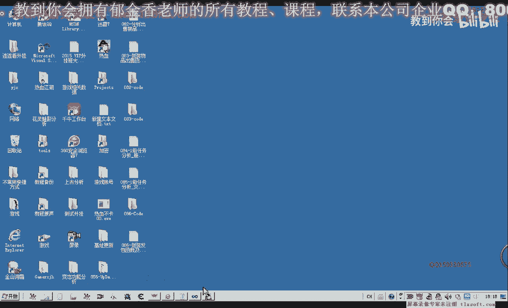

那，么我们从这里来开始复制，123，那么这里呢第二个呢是ef 4，这里，那么第三个是这个1001，那么最后一个呢，这里是零，那么最后呢我们就可以调用相应的这个wc的代替取他的地址，然后呢我们e x c。

当然我们还需要后边还需要进行第二步，那么第二步我们来看一下它的一个数据，那么1001来这里变成了我们的100，那么ef 4后边我们再看一下，变成了六，哦这里本来就是六啊，那么只有一个地方变动了啊。

也就是这里它的序号来设啊，大致就是这样，我们就可以交任务，一，嗯好的，那么接下来呢我们先编译一下，然后再新建一个账户做我们的测试，因为这个人物角色的话，它相应的这个任务已经完成了。

那么我们重新再建一个人物，好那么我们先注入代码，然后呢我们挂接到主线程，然后进游戏，我们看一下，先测试一，那么我们取得书信，这个时候呢我们可以写一个判断的嗯，判断的函数，判断接这个任务是否成功。

就通过这个任务列表里面的这个属性来判断嗯，然后呢我们测试二打开npc，然后测试三，那么我们看嗯打开npc的时候呢，呃这个时候没有正常的打开，我们看一下名字是否正确，open npc啊。

那么还有一个呢我们需要选中这个npc，那么我们看里面有没有选中npc的这个动作，或者对对象啊，然后呢这里有一个选中npc的一个动作，那么我们再来看一下是否有相关的出错信息。

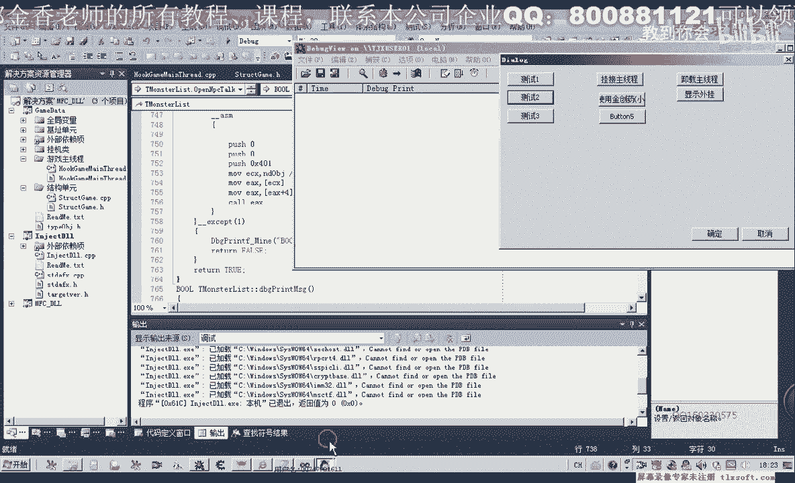

那么这个时候呢我们的npc呢它没有打开，再检测一下它的名字，那么我们用d加载看一下它的名字是否正确，或者我们也可以用c来搜一下。

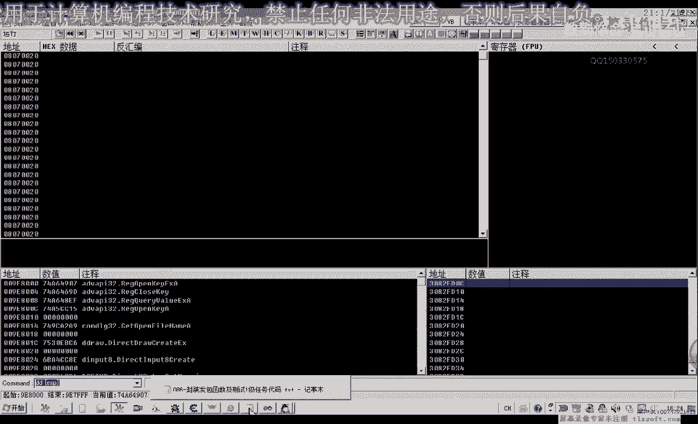

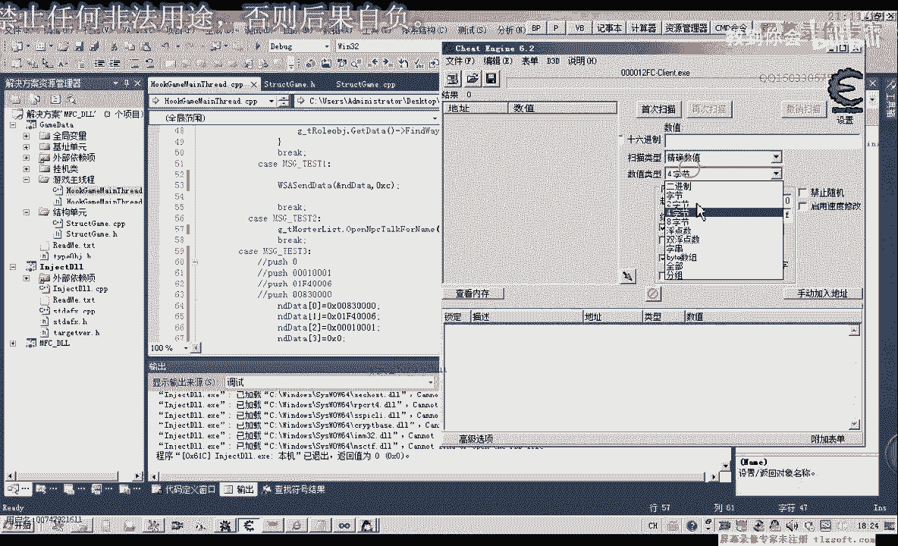

那么只有这三个地方呢是一个干净的一个名字，那么我们转到在o d里面，转到这三个地方，看一下是不是我们的嗯，这个相应的对象，那么往前看一下，npc的话对象应该是二一，那么在第一个的话可能不是。

三块的饼好像是，那么我们再来看一下最后一个，那么我们可以尝试改动一下它的名字，在进到游戏里面看一下423这个啊，嗯，嗯那么是这个，那我们再来看一下它的名字。

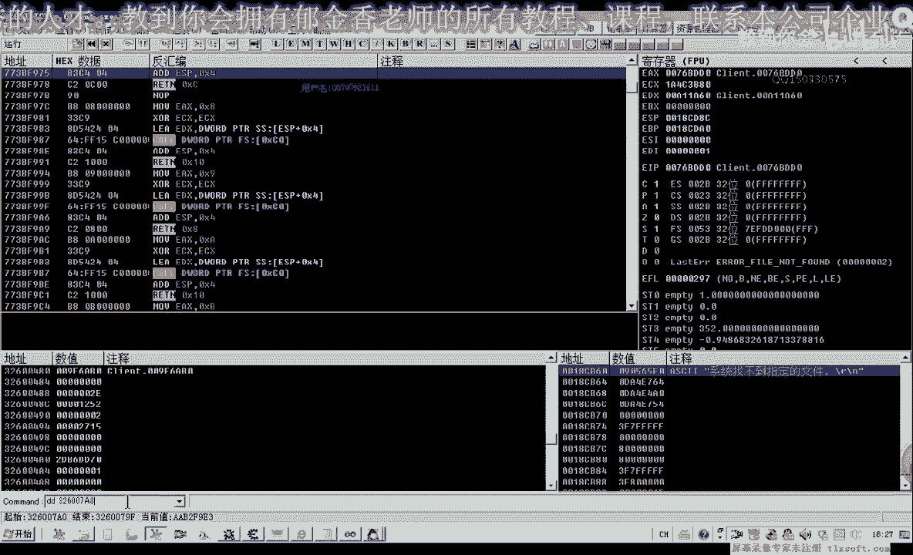

dp，那么我们没有找错，为什么没有打开这个npc，那么我们再来嗯这个相应的代码，我们再进行一下调试，那么首先我们看一下它是否找到了相应的这个对象。

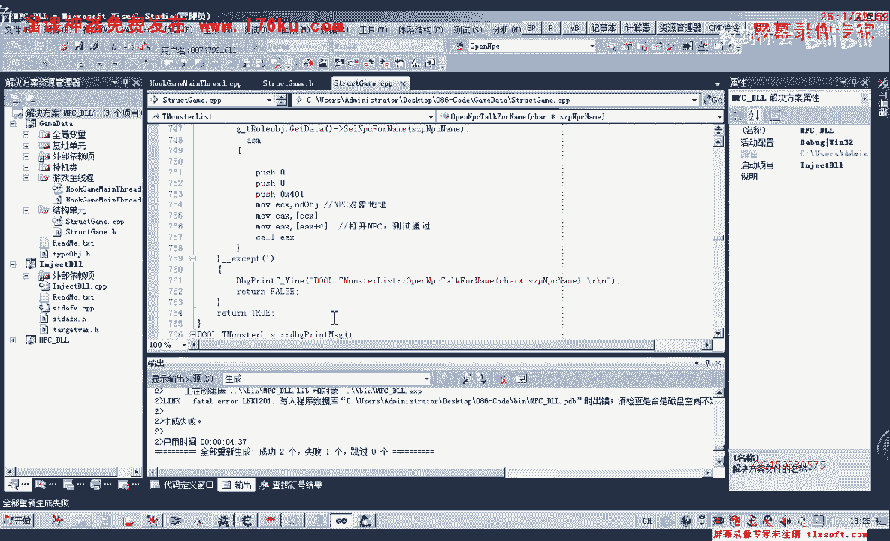

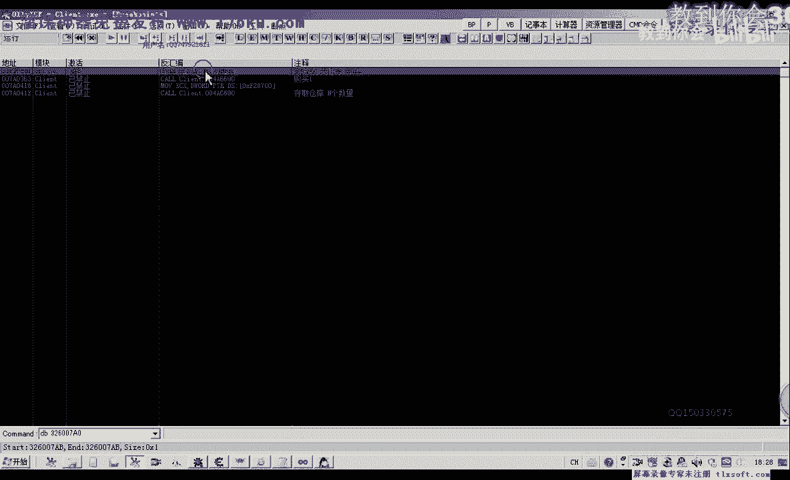

这个时候把断点哈禁止掉，我们再退出o d，再重新编辑一下，然后再移到主线程单元，打开npc的这个是我们txt 2这个地方，好在挂接到主线程测试二，我们看一下相关的信息呃。

那么这个时候的话我们看npc的对象的话，它是找到的，但是找到的这个对象的地址好像不太对，我们再来看一下啊，那么返回到这个对象地址的话，离我们刚才所找到的应该是在326这个地方开始的啊。

32600开始的才应该是我们的这个对象地址，那么它返回来的这个对象地址，的话应当是一个错误的一个地址，对啊，我们在后边呢没有跟相应的参数，那么我们重新再编译一下，再跨界到主线程测试。

那么这个时候呢我们没有正确的啊偏离到这个npc的这个对象，那么我们进去看一下，因为这里面它的一个比较的话，我们需要来一个呃在这里调用的时候的话，需要用一个get it代替来初始化。

那么这一步呢我们忘掉了，好的，那么我们重新，再编译一下，那我打不开这个npc的话，也可能是这个名字的问题，或者是这个字串呢，它很与我们所比较的这个字串不相同，但是我们从游戏里面来看的话。

它显示的这个文字的话，它显示的这个文字后边这里多了一个空格，好像啊从这个，从这个显示的图标来看，那么我们嗯进到啊用后技能加载到游戏里边进行一下观察。

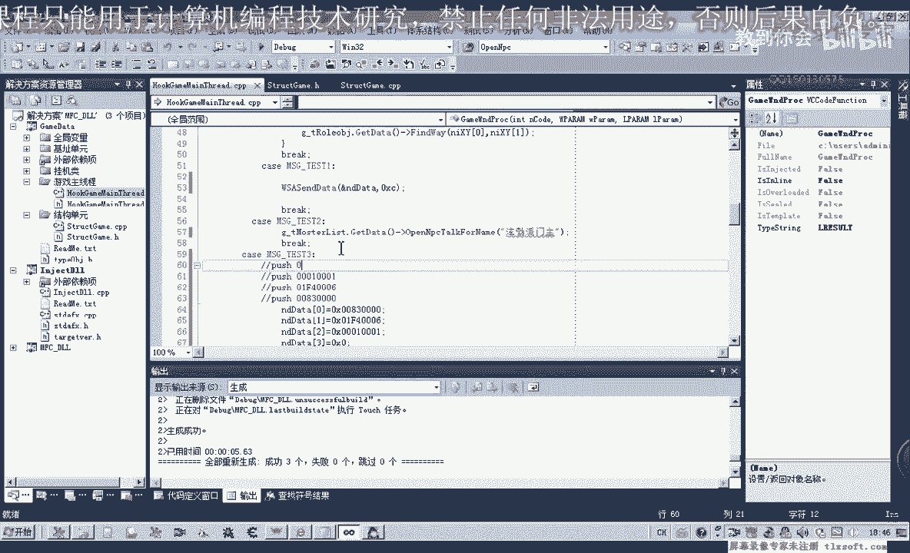

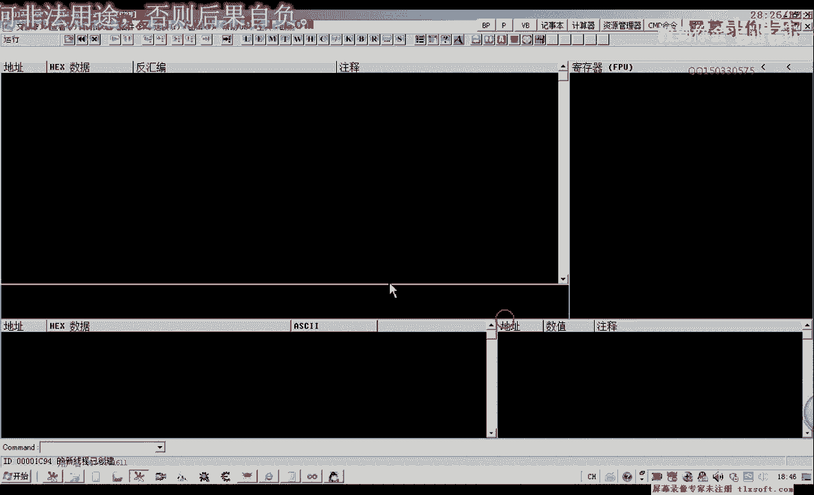

那么我们先来找嗯，把这个npc对象的地址找到，我们可以进入到打开npc的这个库里边，嗯，gt logo这个行为分类哈，那么在这里边偏离的时候呢，我们可以加上一些调试的语句，那么如果这个字串不为空的话。

我们打印出相应的调试信息，或者是对象名字，然后呢再是我们的对象电子行，嗯，嗯嗯，好的，那么我们再次编译，先骗你一下，再打开我们的调试信息查看，挂接到主线程测试，那么我们可以看到二dbc 2 f f0 。

这是对象的地址，那么在这里的话，明显的他空了一个。

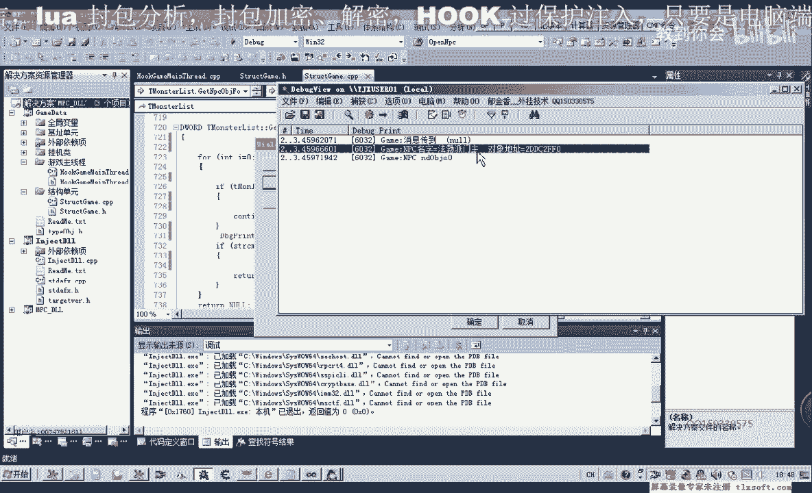

这里我们也有空格，但是你看一下。

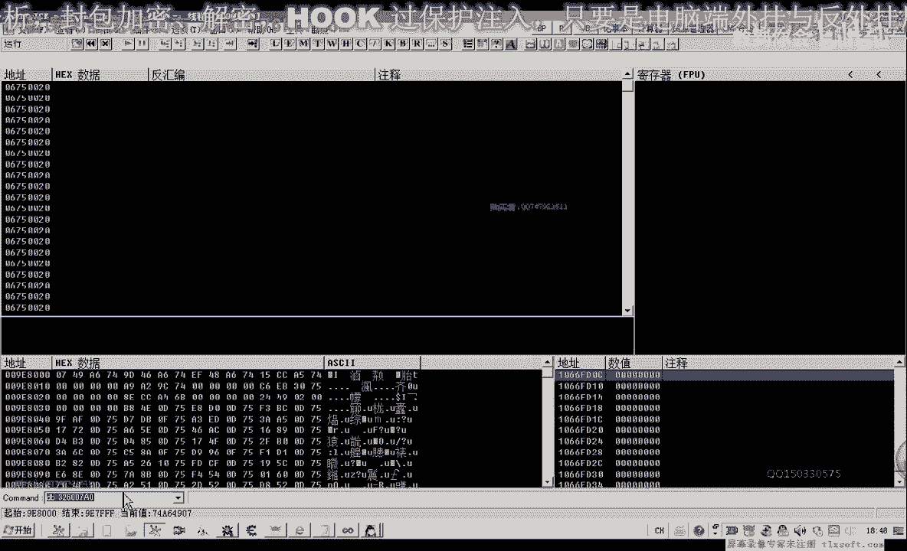

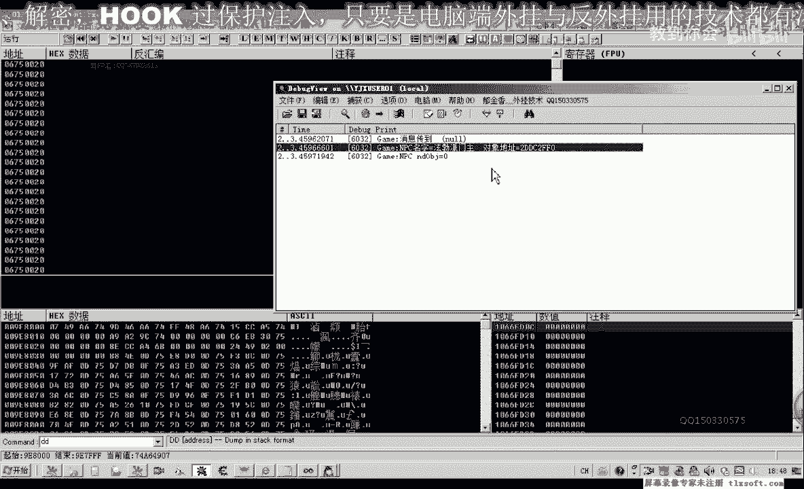

或者d j c20 级c2 f f0 加上320是名字的偏移。

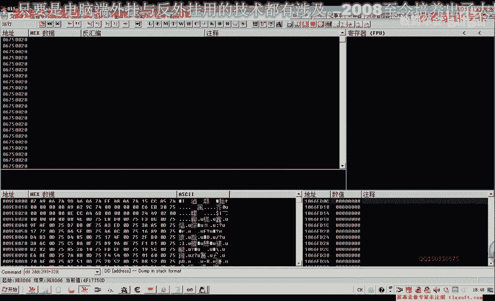

然后我们用dp来查看一下，那么我们注意这里呢以后是六个字，在这里我们能够看到一个空格，它多了一个结尾的字符呢是二零，那么所以说像这种的话，呃，二零它的这个好像是空格，但也可能不是啊，这个我记不太清楚嗯。

那么我们在比较的时候呢，这个时候我们就需要加上这个二零，加到这个后边去，那么在这里我们先加一个空格试一下，看是不是加了空格，我们先退出退出o d，再重新编译一下。

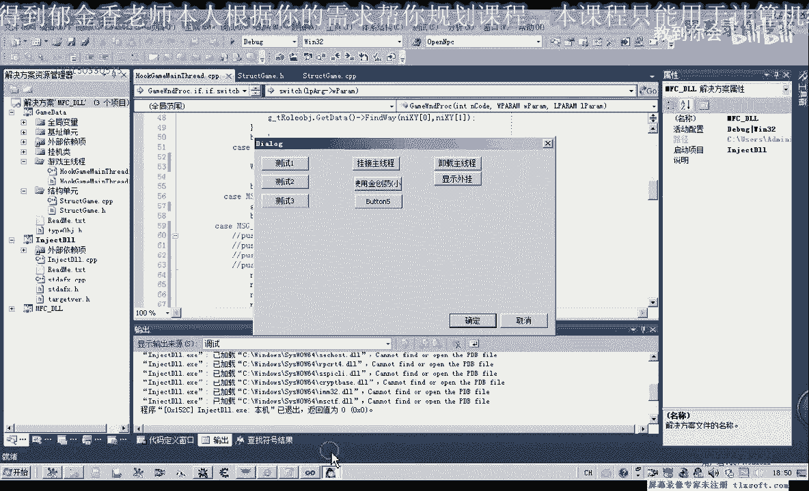

那么再次挂解主线程测试，呃看来他应该是加了这个空格，因为在这里的话，他已经呢应该是把这个npc打开了啊，这个时候啊，所以说在这个时候的话，那么我们再继续进行相应的测试，测试一测试二，那么测试三。

那么这个角色的话，这里有一些经验值了，应该是相应的任务已经完成了，那么我们另外呢再换一个角色来测试这个功能，好那么新建一个角色之后呢，我们再次输入我们的代码。

然后挂机到主线程测试方获得金镶玉的属性测试二，打开npc测试三啊，或者精炼，那么经过这三部了，这个任务啊就完成了，ok，好的，那么这节课呢我们先测试到这里，那么下一节课呢我们再把嗯。

再把它写成一个单独的函数来完成这个任务，好的。