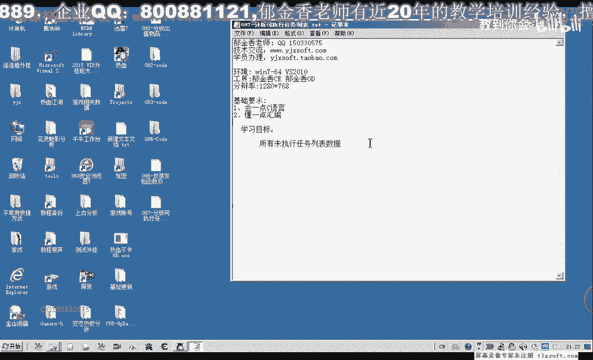
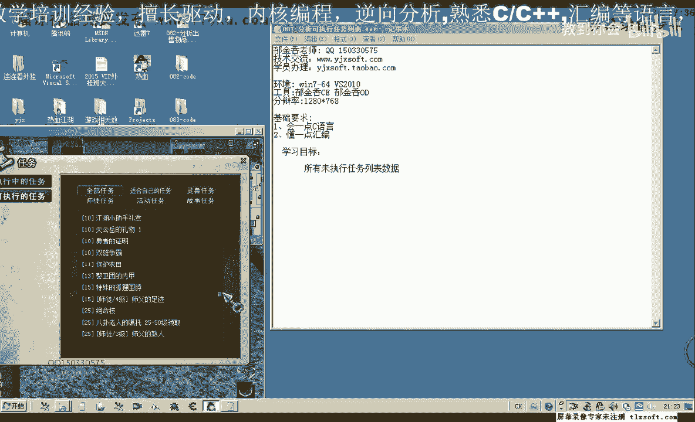

# 郁金香老师C／C++纯干货 - P76：087-分析可执行任务列表 - 教到你会 - BV1DS4y1n7qF

大家好，我是郁金香老师，那么这节课呢我们因为最近的课程呢都会分析任务相关的这些数据，嗯，那么我们这节课呢我们来分析一下未执行的任务列表，所有未执行的任务列表的数据。

那么也就是按下ctrl扣啊，全部任务这个列表的相关数据呢，我们把它分析出来，那么在这里呢我们随便选一个保护农田的任务。

那么首先呢我们用c1 ，附加到游戏来找一下游戏的任务名，那么这个时候呢会出来4~5个的列表，那么这个时候我们对任务的名字来进行修改，那么再再次进入游戏，我们看一下，那么一五这个呢是列表里边显示的。

但是呢这个并不是我们所要的，我们所要的是它这个列表的一个来源，我们再次按ctrl扣打开这个字幕的列表，在一道保护农田这个任务上，这个时候呢它变成了一二，那么说明的话这个所谓的缓冲区啊。

呃任务列表的这个缓冲区不区的话，可能是来源于这前面这两个，那么在后面这个三零开始的呢，应该是这个列表啊，列表里边的这个数据，那么我们要找的是它的一个数据的缓冲区的一个来源，那么可能是在前面这两个。

那么我们再次关掉关掉任务列表，再次修改，那么再次打开这个列表看一下，那么这个时候呢是二二啊，这个数据来源是二二，那么可能是前面这个，也可能是后边这一个再次修改一下，那么应该是来源于前面啊。

这个地址是我们的任务相关的一个缓冲区附近，那么我们就从这个关键的数据来来进行回溯，那么首先呢我们可以把og打开，也可以在这里边来找一下访问了这个地址的代码，或者是应该是改写了这个地址的代码。

嗯那么我们再来看一下啊，那么改写的话应该是找了它的一个数据的一个更新向服务器发送哈，那么我们先找一下访问的，那么这样涉及的代码呢会多一些，那么再次按一下ctrl刻画，那么一共呢有这三个地方。

那么我们先把这三个地方把它复制下来，相关的代码，那么这三个代码的话都是读取的代码，啊没有这个写入的，那么写入的话应该是某个任务它完成了之后，我们再次打开的时候，它可能是比较好，相应的地址不同。

那么呢他在会才会来呃更新写入这个相应的啊数据组，那么接下来呢我们把c一的调试器啊取消掉啊，卸载掉，然后用o d附加进入我们的游戏，去，然后我们转到第一个地方来看一下。

它是在这个地方呢读取了一个字节的数据出来，那么我们现在在这个地方下一个断点，然后再次按下ctrl q，这个时候呢他断下来有一个数据的一个来源，我们可以从这里看到。

那么这个阻止争夺争夺战应该是一个呃任务的名字，那么它数据的来源呢来源于我们上一层，那么我们先回到上一层这个库，那么回到这个地方，那么它的数据来源我们看到来源于ex这个地方，那么所以说我们从这里的话。

呃这里呢我们标注一下时政不明，可能是真不明，那么我们先让他跑起来，那么这个任务名的来源，我们看它是不是一个数字，那么继续再往前面看，他可能来这里有一个跳转，那么它有两种方式。

一种方式呢是直接从这个这里可能像是一个数组啊，从这个数组里面读取出来，那么另外还有一个条件，那么这个条件啊他不达成的时候呢，还会另外再读一次啊，会多读一次，那么我们接着往前边来看一下ex。

那么ex呢在这里的话看起来它像是一个数组的形式，但是这里呢它又有一个ex，我们看一下ex的来源，ex的来源的话，我们在这里呢能够找到一个机子，那么说明的话呃，这个e4 x来应应当是一个机制。

那么加上了后面的这个ex，那么1a x加四的话应当是一个偏移，那么它偏移的计算方式的话，计算有一些奇怪，它的这个偏移呢来源于e d i啊，那么e d i在这里呢。

它ex加ex乘二呢相当于就是我们的eti，然后史上三啊，这然后他在这里呢再左移了六位啊，左移六位的话，这里呢我们相当于是嗯，1248好像是乘以64的样子啊，124816 32呃，64。

那么这里它相当于是神医，那么64的话相当于是0x40 ，啊随意了，左移了这么多呢，相当于是神谕这个数字，那么也就是说在这里的话，它实际上是相当于我们的e d x d e d i里面的数据啊。

取出来乘以我们的那0x这里啊应该是这个数据，那么我们也可以来算一下，十进制的64，那么乘以三，等于16进制，啊设定也就是192，我们可以再算再算一下，64x3=192，也就是乘以三零。

相当于我们这个e d i的数值取出来，然后呢在这个地方的话，它相当于呢是ex的来加上这一个地址啊，e d i c e嗯，c0 ，再加上四，那么这样一个呃最终呢得到了我们的一个任务名，那么ec x的话。

我们这里呢它已经有一个机制了，那么我们代入进去啊，就是这个公司，那么关键就是这个e d i我们得找到，那么e d i我们往前边来找嗯，一直没有对这个e d i来进行一个呃更改这段代码。

那么我们再往前面走，三，那么找到这个位置的时候呢，我们发现这里有个e s i e d i n来源于13+0 x4 c4 ，那么接下来的话我们就需要找一si的一个来源，e si来源于e c x。

那么我们在这个地方下断，能再次让它断下，到上一层我们找一下ec x的来源，ec x呢再次来源于我们的e s i，那么我们再往前面走，或者我们最方便的方式呢就是用我们的c来搜索。

那么它又来源于我们上一层表ex，那么上一层的这个呢它来源于ex，我们再找一下ex的来源，那么ex呢来源于e d i加上2a4 ，但是这个不知道是不是可能是这个公式啊，那么我们把这一段呢复制下来。

那么在这里做一个标记，再退回来，按减号，退回来之后呢，我们把这前面的这个公式呢带进去，按加号啊，再退回来，退回到这个地方，那么es si的来源的话，就是这个地方，e d i加上2-4。

那么这个时候呢我们继续讲，找e d i的一个来源，把所有的断点呢先取消掉，然后再找di，那么这里有个e d i来来源于27c啊，那么可能是这个地方，但是这个也不确定哈。

因为从这个代码它有可能某一部分代码没有被执行到，那么我们也可以在这里给它做一个相应的标记，嗯嗯，那么我们在这里下一个断点，再次让它跑起来，啊这个时候呢他断线了断线，我们看这个公式是否可用啊。

这个公司是不可用的，他，这里有一大片的零，那么也可能是这个公司呢这里呢还没有开始复读，我跟他写入这个相应的数值，我们先让它跑起来再来看一下啊，发现这个地址栏是不可用的，那么说明我们的嗯找数据的时候呢。

可能是找错了，那么我们再退回来啊，按减号再退回，退回到最原来的这个地方，那么在这个库上面来下一个段，那么我们移到最前面，看一下现在di的一个数字，我们在这个地方重新给它下断。

那么我们注意观察一下这个di数值的变化，怎这里呢，他每次增加了八啊，八个字节，那么我们看一下e d i是在什么地方改变的，那么我们在这里找到了bi的一个变化吧，每次加了八，那么我们找一下它的一个初值。

看一下初值是不是我们在前面的啊，这个初值，好的，那么我们再次关掉这个窗口，再次让它断下来，那么我们看一下现在es si的一个数值，那么我们直接把这个常量带进去讲，这样可能更方便一些，加上44。

那么这是它的一个初值，那么初值的话我们来看一下呃，再加上按照我们这的这个公式来计算的话，也就是e d i的这个数值来取出来，再乘以c0 ，再加上四，再加上这前面的这个公式。

那么我们看一下现在e bi的数值取出来是多少，那么这个时候呢它取出来的数字呢是131啊，1c一嗯，那么我们取一下它的一个数值，那么一审一我们用计算器来计算一下，1c一乘以c0 ，再加上4150c4 。

那么我们把这个1c4 啊记录一下，那么它的这个公式的话，就是在前面的这一个呢加上我们的，然后dc 4，那么我们来看一下这个是不是我们的任务名，那么这样呢我们就能够找到我们的任务名，好的。

那么我们先让他跑起来，那么在这个机制已经有了，那么我们接下来呢就需要找我们的这个e d i的这个来源，e d i呢刚才我们找的，啊就是这个数字你选一，那么我们接下来找它的一个来源，c38 这个数字。

那么我们先在函数的头部往下断，断下来了之后，我们看一下这个438来源于e s i，那么我们再返回一层，看一下在这个地方看一下，按f4 执行到这里，那么这个时候呢我们没有找到c a38 相关的数据。

但是我们在这个地方下一个段啊，再次让它断下，图的扣，那么我们再来找一下，这个时候呢ex呢等于我们的c3 包啊，那么我们接出来就需要找这个ex的一个来源，那么我们往往前面找找到找到这个地方啊。

那么我们再次在这个地方下断，但是这个这个地方下断之后，那么我们发现了它不会断下来啊，说明不是的，那么我们在这前面这个地方再次下断，那么这个时候呢它会断下来，那么我们看一下e d i的一个数值。

那么我们按f8 执行一下啊，就是c38 ，那么它来源于我们的e d i加上一个2。4，那么我们把相应的公式呢代入进去，加上2=4，好这个断点呢我们也先取消掉，那么再找一下e d i的一个来源。

那么e d i呢有可能是来源于我们这一句，那么我们在这个地方下一个段，再次关掉我们的任务窗口打开，但是它不会断下来，说明这个地方没有被执行到，那么我们再找一下前边的复制，而其实这个地方。

这个地方呢也不会断下，再继续往前走，那么这里也有个274，那么我们发现了它都不会断下，继续再往前走，再往前找一下，这个时候呢还是没有断下来，继续往前走，e d i的来源，嗯。

那么或者我们用c一先来搜一下这个库呢，看起来它的代码很多啊，很大，选四字节16进制，那么这个时候呢我们直接能够找到两个地方，一个是6698，一个是f59840 。

那么这个6698呢可能是我们311开始的，可能是我们所有对象里面的这个数字，那么这个呢可能就是我们的所要找的一个机制，那么我们既然能够直接收到它，那么我们就直接用在我们的mod里边。

再来搜一下这个常量啊，这个时候呢能够找到这个场面，嗯就是，我们来搜一下，看调用它的地方，地方是不是很多所有，那么我们发现调用这个机子的地方的话是相当的多啊，说明这个机子的话。

它还是一个呃相当重要的一个机制，mf 59840，那么我们看一下之前有没有用到这个机制，这f59 ，八设定好像是这个这个机子f5984 ，那么实际上也就是我们f一和f 10的啊这个机制。

那么这个机制呢我们很早就有用好的，那么我们把它替换进去，好那我们保存一下，那么它的偏移的话就是来来源于这个地方啊，那么我们再退回来，按减号，那我把这一段代码呢，我们先复制出来任务名的啊。

这是关键的一部分，只要，那么在这里呢它是一个循环，那么可可能就是一个循环的，他也在偏离这个任务列表，然后每次来他家八个字节啊，那么我们主要的来看一下它加八个字节是一个什么意思，那么也就是说在这里的话。

他加八自己来分别取了1c11 比五，1431441比六，那么取的是这些数据，那么这些数据每一个取出来之后呢，它都会审议我们的呃040，然后呢再加上我们的这个公式啊，那么我们再来看一下，那么di的数据呢。

我们公司呢我们给他带进去，那么首先我们把后面的地址栏取出来，那么这个地址呢我们能够取出来，但是这个地地址我们乘以040的话呃，它不支持这个呃这个工具我们的这个，命令行呢它不支持这种啊审法的这个操作啊。

所以说我们需要来把相应的这个数据来取出来，再乘以我们的0c01 c0 c0 c0 ，啊那么这样的话它是可以的，哈哈，加上，1x1啊，那么我们好像是少加了一个括号啊，那么我们再来试一下这个公式。

看来他是不支持这样的一个访问方式，那么我们先把1c一取出来，用计算器算一下，一水1x40，一选b1 c1 ，154 零，那么我们加上幺五cd，再加上四来看一下它的名字，那么第二个呢我们再来看一下。

那么这是我们的第一个能认为你的一个来源，那么它加八之后，我们再来看一下，那么加八的话，这里是一比五，先清理一下1b5 乘以三零，14740，94740，那么这个时候呢我们显示的是一箭双雕啊。

那么证明的话，我们可以来这样的话是可以来骗你这个相关的这个任务列表的，那么我们下一节课呢再编写相应的代码来骗你，那么像这种情况的话，因为我们的代码路由器的话显然是无法完成的好的，那么我们下一节课再见啊。

那么这节课呢我们的分析就到这个地方，那么还有这里哈它有一个比较好，那么我们再往后看一下它加八这个位置，那么加八这里呢它也有一个比较啊，把当前的e d i与e si加上48做一个比较。

那么如果这两个数值相等的话，那么呢这个循环就结束啊，那么看来这里它是一个循环的一个结束的一个条件啊，偏离我们这么短，那么也就是说我们的这是它的一个初始值，而这个加48这个位置呢是它的一个结束结束地址。

那么这两句呢也相对的关键，把它复制一下，那么而且这个e d i r e s i它的来源也是来源于我们前面这个公式，这里是44，那么来源于这里边这一串，那么我们在这里呢也做上一个注释。

那么这是1i的一个来源，好的，那么我们再来整理一下我们的思路，那么最先开始呢它是从这个地址，那么开始了进行一个相应的一个偏离，那么在里边呢它是取出一个相应的偏移，那么这个偏移了最后在这个地方啊。

ec x呢是一个机制，ex加上我们的这个ex的这个偏移，再加上四轮，最后就得到这个任务名，但是呢这里它还有一个判断啊，那么这个判断呢我们下节课再编写代码的时候呢，在做相应的测试。

那么最核心的数据的话就是我们所分析的这些，按照这个公式来就能够取得我们的，当然这个公式的话直接在这个命令行下面呢，它不支持这样的呃，公式的显示涉及到这个手法，我们再看一下这个地址吧，哈哈哈哈哈，好。

啊需要把我们的e d i带进去，哈哈哈，好的。