# 郁金香老师C／C++纯干货 - P77：088-遍历可做任务列表 - 教到你会 - BV1DS4y1n7qF

大家好，我是郁金香老师，那么这一节这一节课呢我们一起来嗯，骗离我们的任务列表，上一节课呢我们已经分析了任务列表的相关数据。

哈哈哈，那么我们先打开第87课分析的这些数据，那么首先任务名呢它来源于我们这个公式，先把这个相应的公式呢取出来，相关的数据，那么这这就是我们任务的这个名字的指针，然后呢它偏离的时候呢。

有一个开始的一个条件和一个结束的一个条件，那么起始条件呢是这个加加上4c4 ，结束条件呢是加上4c8 ，每次呢他加的是八字节，好的，那么有了这些数据的话，我们接下来呢就可以了，来骗离我们的任务列表。

打开第86课的代码，那么我们先做一个测试，现在我们现在我们的主线程单元，嗯还有交任务的这个我们也没有封装哈，嗯，那么我们就在这个测试单元一啊，这里呢做一个相关的这个测试，那么在测试之前呢。

我们先把它封装成一个函数，先转到我们的结构单元，到最后在这里呢我们添加一个偏离的函数，那么首先呢我们也是要做日常的处理，好的帮我们准备的资料了啊，复制进来，先注释掉。

那么首先呢我们定义一个它的一个开始偏离的一个起始地址，那么这个是起始地址，那么这个是结束的一个地址，那我每次呢它是加上八字解这个地方，拜拜，那么这里呢我们可以来嗯。

用一个标签来定义它的一个循环的一个结束啊，来进行一个判断，那么首先我们取出一个起始地址，nj start，那我先读出这个机子里面的数据，那么这个数据呢我们来看一下，那么这个机子的话。

我们在之前的这个机子单元里边呢，好像是有的啊，也就是我们的f一和f1 ，f一和f 10的这个ec x参数，那么我们把它取出来，然后再加上一个第一个偏移是e x2 a4 。

那么第二个偏移我们这里我们看一下4c4 ，那么取取出来之后呢，这就是呃我们任务列表的它的一个起始地址，他乘以这个030+4，再加上之前的这个呃机子的话就是我们要片里的这个任务名。

那么我们看一下这个机子有没有在我们的记词列表里面，基础单元里面我们查找一下啊，没有，那么没有的话，我们先直接使用它，那么在这里呢它的结束地址呢是48，那么接下来呢我们就用汇编代码来进行相应的处理。

那么在处理的时候呢。

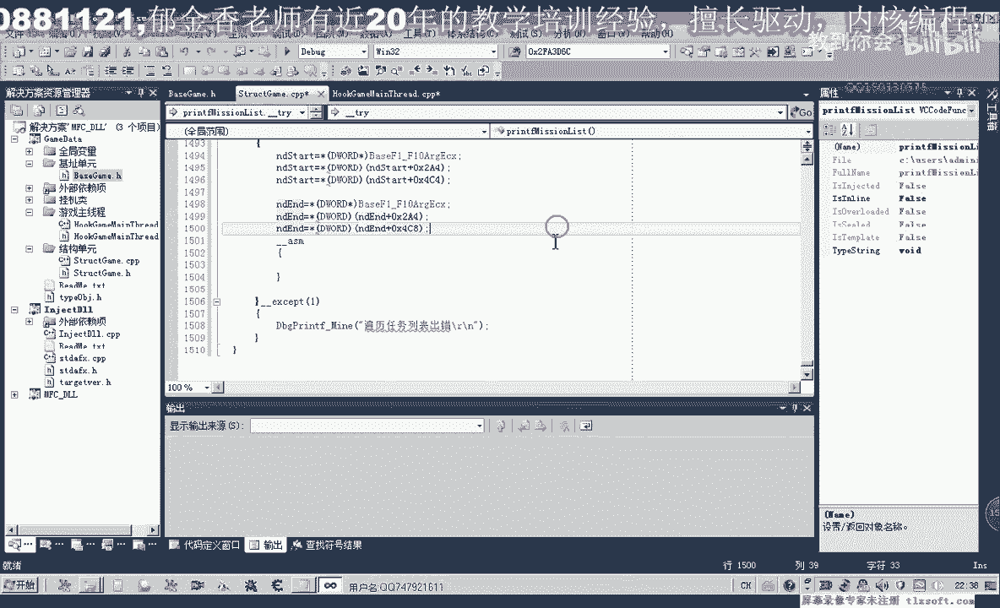

我们需要先打开游戏啊，进o d去看一下。

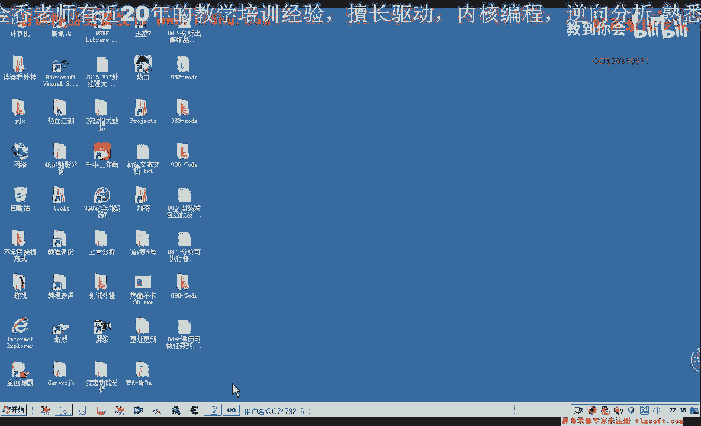

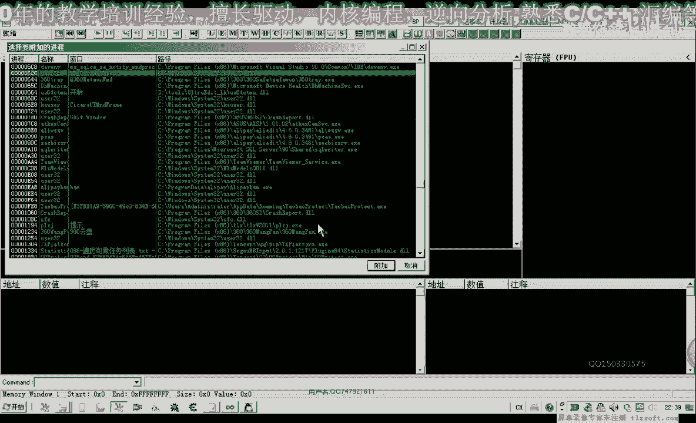

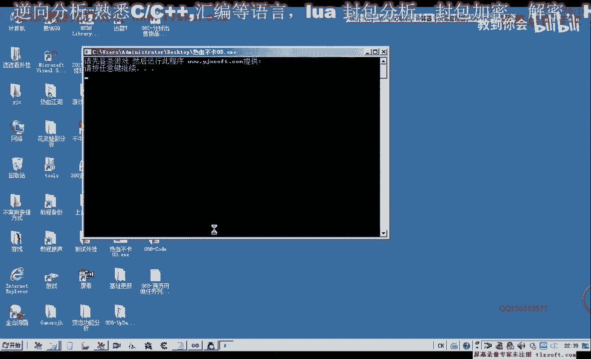

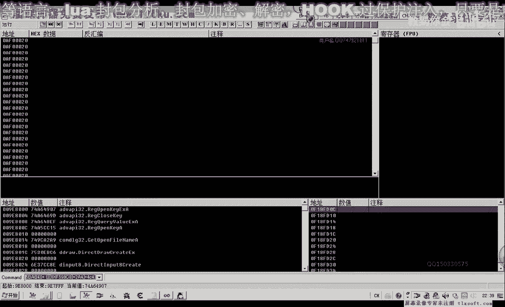

那么先打开第87课啊，我们看一下我们关键的代码这一部分，那么这里是任务名啊，那么实际上在这里这一段代码里面，我们也可以看出来，那么它在这里呢主要是有一个比较哈，我们可以把这段代码直接复制出来。

进行相关的修改啊，复制一下，然后把前面的啊这个字节齐了，删掉和这么，那么在这里呢它有一个跳转，根据前面的这个判断，那么人如果这个数值的话，它大于我们的这个16啊，也就是0x标题呢它将跳到后面这个位置。

那么它将跳到cf啊这个位置，也就是说会跳过这一句代码，那么在这里呢我们也给它加上类似的一个处理，那么在这里呢我们把它设置成一个标签，那么直接呢就会移到这个地方来执行，加上一个标签会跳过这一句。

那么这些呢di呢我们需要给它附一个初值，在这个地方，每一个寄存器呢我们都需要给它做一个初值，首先e d i来源于我们的，开始了一个地址，那么e4 x呢它由这里来来初始化。

而ex呢它也是来源于前面的e d i哈，那么这里呢所以我们也可以进行相应相应的初始化，那么这个e4 x呢来源于我们这个机子，那么在后面这里的话，这些呢我们都已经经过初始化了，那么关键点也就是这个ex。

那么它分为两种情况，一个是我们的这个名字来直接就是取这个字串，那么另一种情况呢，当他这里这个偏移大于一八的时候呢，那么在这里呢它还会另外再取一次，那么到了这个地方呢，我们取出来的才是真正的任，务名。

那么我们在前面再定义一个变量，用来指向我们当前的任务点，那么这个指针呢我们取出来就来源于我们的ex 5，那么我们再来看一下我们写的这个代码是不是正确的，那么ex呢有相应的数值的来源。

而ex呢来源于这个地方，那么这就是我们的任务名，那么这样的话看起来是没有问题的，那么接下来呢在这个地方呢我们就打印出我们的任务嗯，好那我们再看一下啊，而且呢这里还有一个循环啊。

我们需要做一个循环的一个判断，到这个最后啊，那么这里呢我们再加上一个判断，那么判断呢也就是说呃，这个e d i的这个数值呢，我们每次呢要加上八，还好，e b r加八，那么加八之后的数值呢。

我们要看要跟他这个n d n的呢进行一个比较，那么如果这个数值呢不相等，那么我们继续循环，那么继续循环呢，我们将在将从这个地方开始啊，继续的一个循环，在这里的设置一个标签，那我们再来看一下。

e d i加上它每次来加上八字解，好的，那么我们还是来进行相关的测试啊，那么我们以测试为准，首先呢我们编译生成一下，这里呢我们少了一个新号，那么我们把它加上，真。

那么我们这里呢是直接用它的这个原汇编代码来实现的，那么我们就不用来审议这个030了啊，因为这里呢他省了一，那ex呢是e3 ，然后在这里呢在左移了六位，相当于成立了一个四零啊，这个地方是，好的。

那么我们把这个相关的函数呢，嗯转到我们的测试单元进行一下相关的测试，这个呢我们还还需要在我们的这个头文件里面，后来套出一下，好输入到游戏里边，那么挂接到主线层来查看一下相关的信息。

那么这个时候呢我们看到获取神仙草，呃这个时候呢应该说它的这个列表的话应当是不对的吧，因为我们这里所有的任务可执行的所有任务呢，可能相关的内容呢没有刷新出来，那么我们再次来看一下银娇龙的自尊心。

那么他实际上只骗你了这一个地方的这个地址，那么我们再来看一下我们的循环啊，退出，那么我们先进到我们的呃o d里面，相关的代码，我们再看一下。

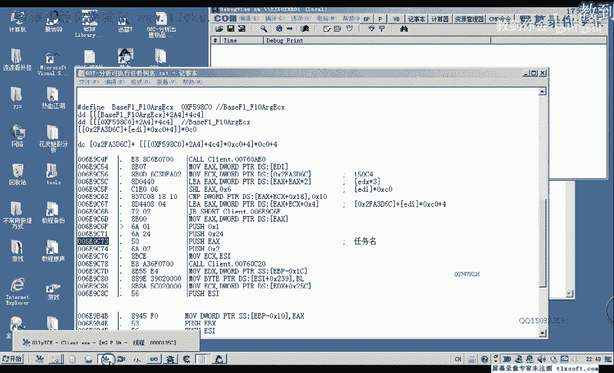

那么我们在这个地方下一个断点，看他的这个任务名的一个变化，是否偏离了所有的任务，那么第一个阻止争夺战，一剑双雕，厚厚的回忆录，获取神现场事件背后，你家龙的直升机啊，只有五个。

那么它实际上是这个执行中的这个任务，那么我们再看一下，如果是全部任务，再次打开它啊，同样的那说明我们所找的这个，说找到这个地址是错的啊，那么在这个函数的话，我们可以看到。

应当是把相应的这个任务列表来添加到我们的这个窗口列表点进去，那么我们在这个地方再下一个段重新呢。

再次让他断下，再看一下ex的一个数值，那么这个的话要全一些啊，那么我们看一下它返回的地址，实在是不定方，那么这个时候呢我们发现呢这里返回的话是在另外一个地方，那么可能这个才是我们所有的那么的一个列表。

那么我们上一节课的一个一个分析的有些片面，那么我们先把断点取消掉啊，再来进行相关的分析，那么很有可能是这个，但是我们的代码的话，我们看一下它看起来是相同的啊，嗯只是我们这个机子看一下相不相同。

那么我们看一下它的这个机子，因为我们现在代码的一个机制d6 c2 fa 3 d6 d6 c啊。

那么这个是相同的，那么我们再到前面来看一下他e si的这个数值。

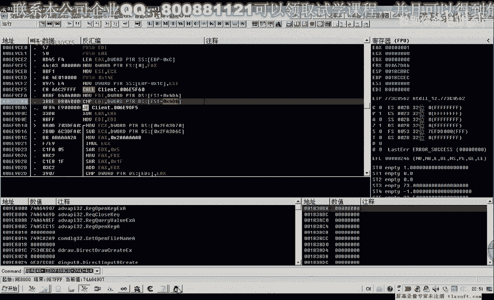

那么这个时候断下来，我们看一下es si的数值，那么我们之前用的是这一个公式。

e s i a da，123404第四删掉，a401 a12 没试题，那么这些这些都是相同的，我们一步一步的往下执行一下，那么我们在这里呢看到ex啊，传进机这里有个格式化字符，可能是它的一个等级。

那么这些所有的代码的话，看起来都是一样的，这里也是加上84d8 ，那么我们再次用这个代码输入啊。

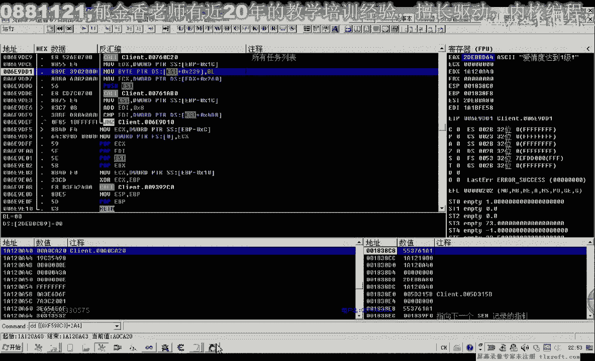

再次来啊，骗你一下，看一下我们的代码，对了我们这里呢它这个循环我们这个打印我们这的这个列表，这里呢我们这个循环的话啊，应当是放在这个位置来实现，但是这里实现之后。

有可能我们的这个函数呢它会改变e d i的这个数值，那么我们先进行一下尝试。

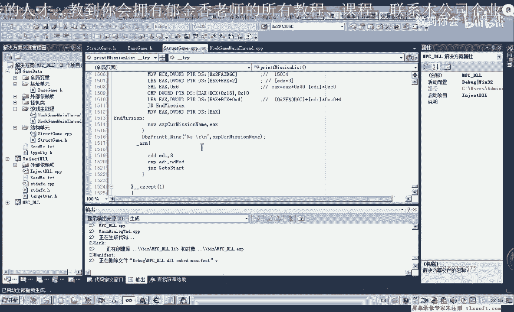

好再次注入。

挂件曲线层，再看一下我们的调试信息，那么这个时候的话嗯。

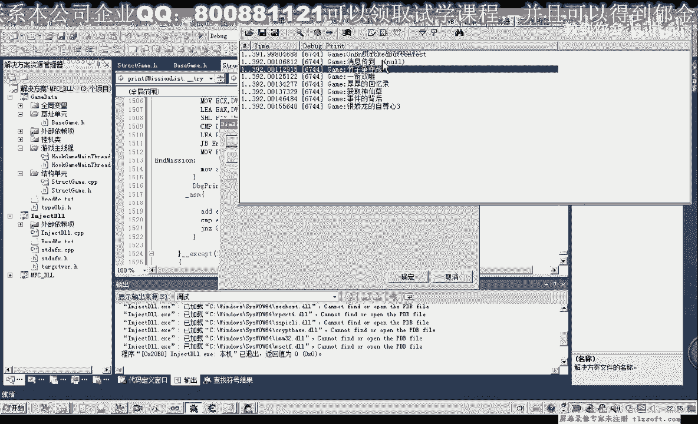

他是偏离了，应该是我们的呃，可执行的这个任务，阻止争夺战，而不是我们所说的这个所有任务啊，所有任务列表，那么我们再来看一下说明这两者之间的话应当是有一些区别，11a40 。

那么在这前面的这个起始地址应当是没有区别，那么我们再来看一下后面的这个地址，二fa 3 d6 c，这里是6x30，加四，四比二结束的这个条件，那么我们再来看一下，做一下比较啊，肯定是哪里有有区别。

所以说造成了这两个人他骗你啊，这里是谁，帮我们看一下前面的这个偏移，这里是4。44。8哈，这两个起始地址不一样啊，这两个偏移不一样，那么这才是关键点，好的，那么其他的都是一样的啊。

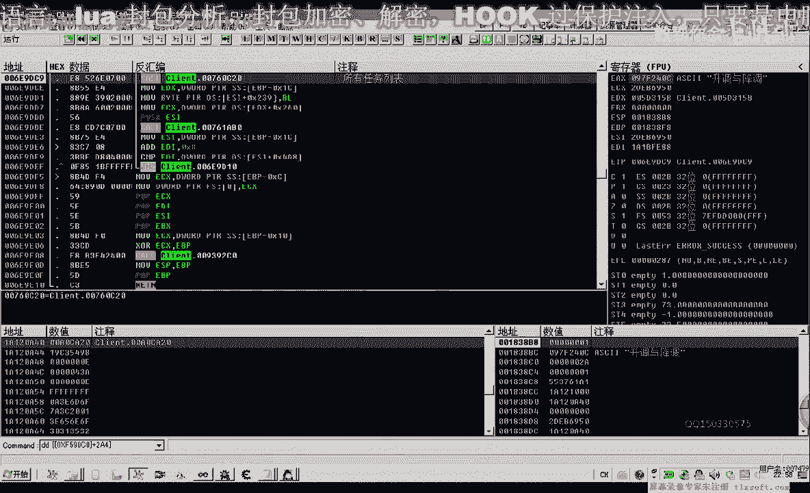

这个偏移呢是所有任务列表，而之前的，之前的这个偏移，我们看有没有，那么之前我们取下来的这个偏移的话，嗯这个4c4 这个地方，那么它是我们的当前可执行的这个代码。

那么我们之前分析的这个呢应该是执行中的这个全部任务，执行中全部任务，那么这两个偏移呢不一样，那么我们把这个偏移改一下，这里改为四比44啊，四级是四级八，那么我们再一次退出去。

那么首先呢我们把这里的所有断点啊先禁止掉，然后呢退出ot。

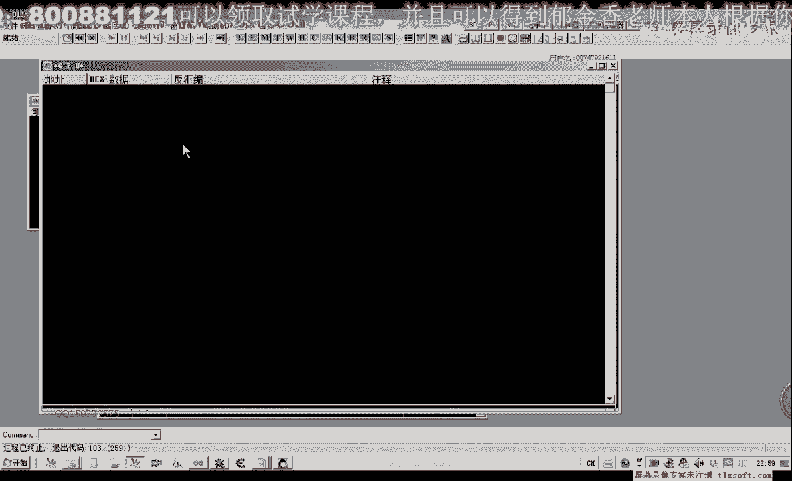

再重新编译一下，跨界主线程测试，那么这个时候我们所建立出来的啊，就是所有任务的这个列表，但是呢还有一点不不相同啊，也就是那么我们这个游戏当中的这个任务列表的话，所有任务的啊可执行的呢。

前面它有一个等级的一个标识，那么这个呢就流流流成一个坐垫哈，大家下去把它完成一下，那么这个相关的代码我们应该也是分析出来的，就在o d里边啊，它有一个格式化字符那个地方啊，那么这个下去分析一下。

那么下节课呢我们也一起来完成啊，在前面的啊这个任务列表的一个等级相关的信息呢的一个偏移，好的，那么我们这节课呢我们就到这里。

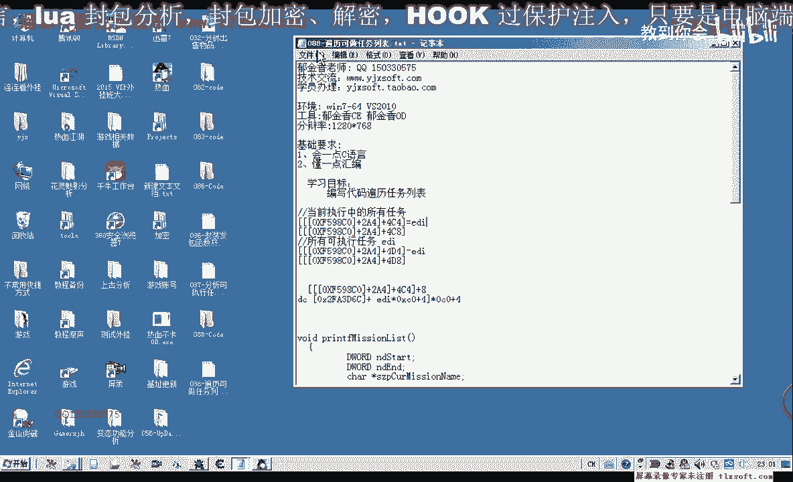