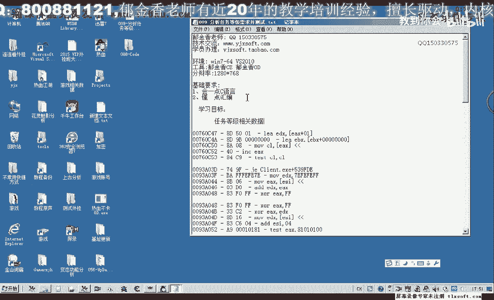
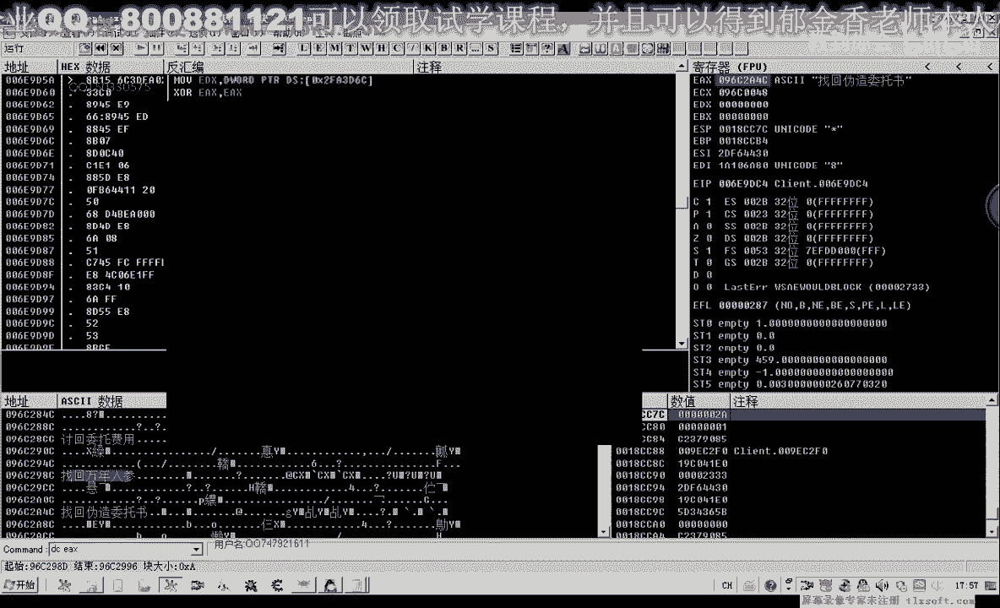
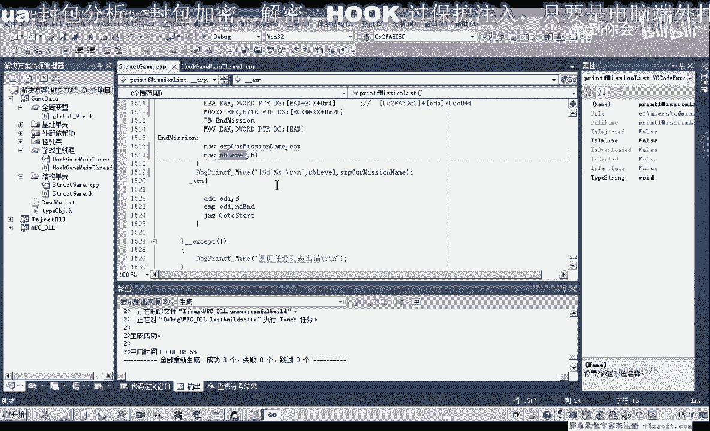
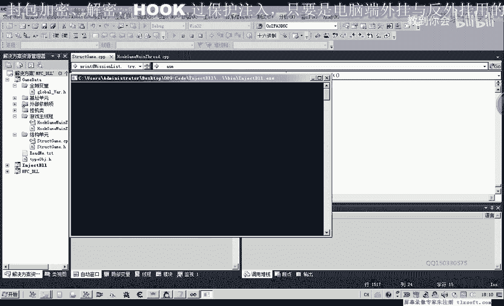
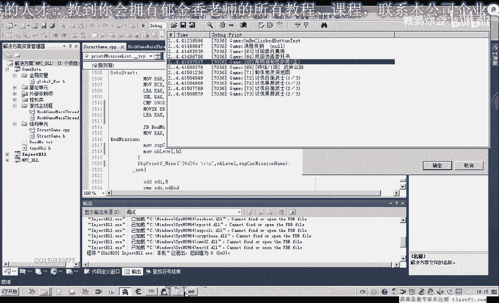
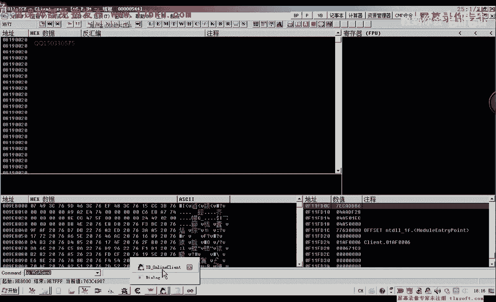
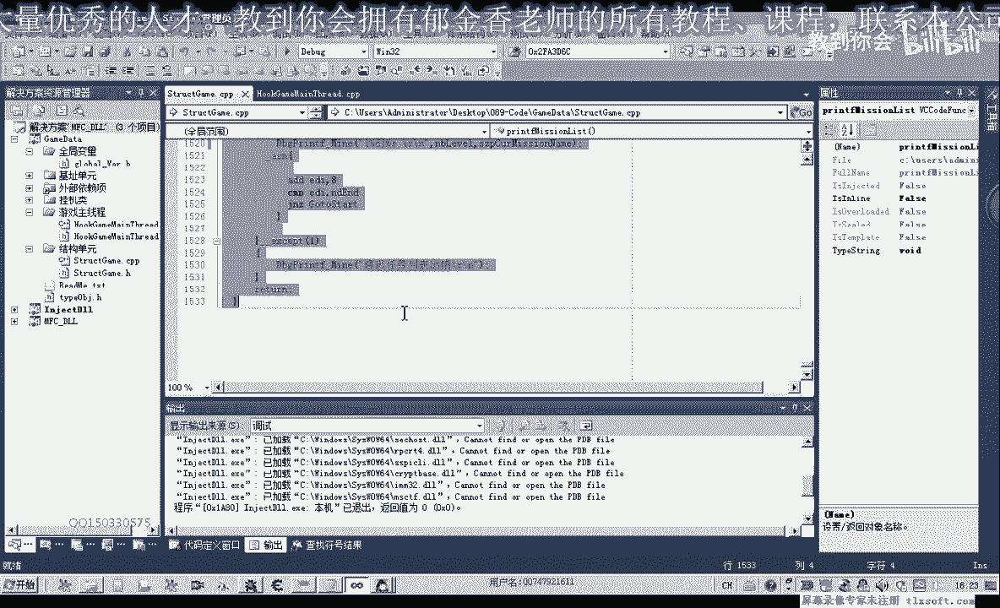
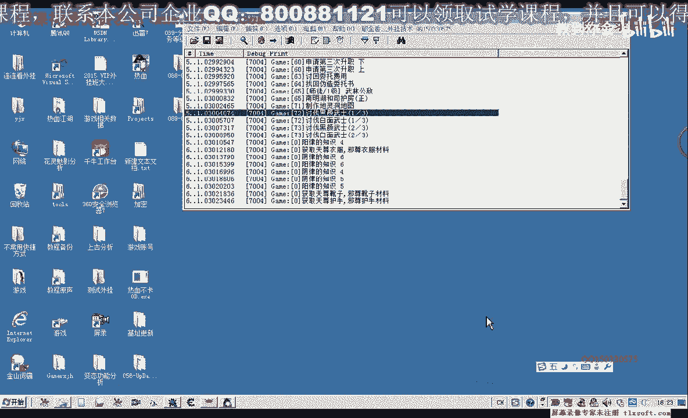

# 郁金香老师C／C++纯干货 - P78：089-分析任务等级需求并测试 - 教到你会 - BV1DS4y1n7qF

好，我是郁金香老师，那么今天这节课呢，我们一起来分析一下任务等级的相关数据，啊，那么首先呢我们转到游戏里面去啊。

转到我们所有任务列表，这里的我们下一个断点啊，先来看一下，那么然后打开ctrl q啊，这个时候呢显示出所有呃任务列表啊，第一个呢是八卦老人的一个研究啊，那么我们，啊有很多这些呢实际上在这个地方呢。

它肯定也是在骗离，我们的这个所有的任务列表好，那么我们先把这个断点呢取消掉，那么进到游戏里面来看一下，这里呢它也是相应的这些任务啊，这些任务，那么每个任务前面呢它都有一个等级，这些是等级依赖都可以做的。

这个呢是要等级达到25级的时候，才可以做，那么所以说我们今天的目的呢，就是要把前面的这个任务等级的数据呢，要不然那么我们看到它显示出来的呃，任务等级来前面都有一个括号啊，然后呢加上了一个等级，那。

么实际上应该说在这周围的话啊，那么就有嗯有一个哈任务等级的相关数据，可能是在一起的，在一个结构里面，那么我们在前后的找一下，那么我们看一下，这个e si的一个数值是什么，这里有个e si的一个来源。

那么e si的话，我们看到这里呢它传给了e c x，那么说明它是可能是一个窗口对象啊，这一类的，那么这个的话，可能因为我们的统计呢没有关系，那么我们等级相关的话，可能呢与这两个偏移啊，可能有一些关系。

因为我们从结构化编程的，这个思路出发的话，就像我们定义的结构，那么它的相关的属性，比如说他的名字和它的等级的话，肯定相离得都比较近啊，那么我们往前找一下相关的代码，那么这里呢我们能够发现一个比较可及的。

一个啊数据啊，就是这个字串，那么这个字串的话，我们非常的熟悉，就是格式化字符的一个字串，那么在这里在这个地方的话，要显示的是一个啊整形，那么那么这个整形的话，极有可能就是我们任务的一个等级。

那么我们也经常用pdf啊，这一类的来格式化字串啊，也有这这一类的函数，而是p c l i n t，那么这些也是一些格式化字串的一个函数，它可以把等级呢放在里边，那么我们来看一下现在这个ex。

那么可能就是这个等级啊，把它传进去，那么这是一个格式化字串啊，那么这可能是一个其他的什么什么参数，这类的，那么我们在这，个地方先下一个断点，先看一下它的一个数值，那么这个时候我们转换一下哈选项卡。

那么我们看一下啊，这个时候1a x的词类等于六三，那么可能它的等级呢就是63，那么我们在这个所有任务列表，在这个地方呢，下段再看一下，那么执行到后面来的时候呢，我们看一下e a x的一个数值多少。

那么这里呢它没有显示出相应的字串，那么在这里呢它有一个为任委托费用啊，这里呢有个找回万年人参，那么这里考虑的都是呃，都是一些任务相关的一个列表，那么这里呢又是4040的话，64。

那么执行到这里来的时候呢，呃找回我差五图书，那么我们先把这两个断点取消掉，来看一下我们的任务列表里面有什么，那么恰好我们发现了63，64呢就是这两个任务的一个等级，那么我们接下来看一下。

它的一个数据的来源等级，那么等级的话它取的是来一个字节啊，在这个地方，一个字节来源于e c e d加二零这个偏移，那么e4 x呢又是前面的这个偏移来的啊，那么这个加密的这个偏移的话。

与我们后边的这个偏移它是一样的，这个地方它的算法我们可以看到是一样的，另外呢还有一个，我们看到在这里有一个3d6 c，那么它的机子呢也是一样的啊，这里是一个机子加上e4 x呢，是一个偏移的来源。

那么也就是说我们这两部分呢，应当是一样的啊，是一样的，那么只是一个后面的偏移呢是零四，那么另外一个偏移，你呢在这里呢是二零。

那么我们再来看一下是不是这样一回事，在这个地方下断啊，那么等级，那么我们查找一下哈，全部任务，那么全部任务这里呢它肯定就是偏离的，是所有任务的这个列表，那么这个列表的话我们来看一下，现在的话。

它的等级的话应该就是d b e c x，加上b d x加上二零，那么它的等级呢是一，而它的名字的话应该是加上四这个地方，dc，1c x1 dx加上四啊，当然这样看起来的话它也不是很正确啊。

那么我们再来看一下下边的这个地址，那么我们转到这里来看一下，e x e c e x，那么这是他的任务名再转一下嘛，我这里呢它还需要取一次，可能还有一个其他的一个判断啊，就是说这里的要加一个判断。

这个地方呢它还需要取一次啊，这要看是某一种情况要比较的呢，是比较幺八这个位置，这样还比较的，那么如果幺八这个位置的话，它大于幺六啊，也就是你x10 ，那么呢我们才是直接就是这个地址，就是任务的名字。

如果它不大于它，那么就是小于等于这个0x10 的话，那么才是呃取再一次啊，要取他的这个地址数，才是我们的这个计算的地址，也就是说多要多多预计这个指令啊，多取一次好的，那么我们既然知道了，我们再来看一下。

那么这个时候等级是第一，b e t x加上b c x加上二零，那么等级呢同样是一，那么它的我们要首先要看一下，它加幺八这个位置是否大于510，那么这个时候呢它大于我们幺零了，那么我们直接就取得。

假设这个地方就是它的任务比，jb再来看一下大鱼的话，就会跳转到这个地方，那么我们再去一下地址看一下，这个地方的话，这个地方才是他的任务名，cbo应该是小于它，要小于这个数值的时候呢。

才直接跳到这个地方来啊，这里写错了，这里应该是小于，我们比较的时候是小于11 零好，那么我们再到前面来再看一下，那么这个地方呢它的等级的话加上，而同样是一啊，同样是一。

那么只有我们后面的这个等级要高一些，就是我们适合自己的这个任务呢，等级要高一些，那么我们用这个来做测试啊，考虑更明显一些，适合自己的任务，那么我们看一下他现在的等级是3f，那么3f的话应该是63。

63等级是63，那么这个等级63的话，我们来先来看一下他幺八这个位置取出来，看它是否小于0x10 ，那么这个时候呢它是小于的啊，小于呢它就会跳转跳转到这里来，也就是说这个语句呢就直接被跳过了。

也就是取得这个地址啊，加四这个偏移的话直接就是这，那么我们看一下啊，那么的确这样我们就能够取得这么，好，那么我们再来看一下将日宁这个地方，那么这个时候呢它的数值呢是十进制的，64啊，等级是64。

那我们看加幺八这个位置的一个判断，那么同样是小于一零的，那么直接取加四这个地方呢，就是他的啊名字都是他的名字，就是他的一个名字好的，那么我们既既然我们知道了这么多的话，我们就可以来呃。

来写我们相应的这个任务等级的，相关数据了，也就是说偏移不一样，它以后我们现在涉及到的偏移了，它实际上也是在一个结构里面，或者是叫做对象啊里面，那么它的加二零这个偏移呢，我们就是任务的等级。

那么加幺八这个偏移，那么这里是来加上一个判断，判断任务名是否指针的一个判断，那么如果它里面存放的是指针的话，也就是说它这个数值要小于我们额，要大于我们这个0x10 ，那么小于的时候呢。

我们直接都跳到这里来看，直接就是取得自数的地址，那么如果是指针的情况呢，我们还要再读一次这个数字，那么这里是一个条件啊，或者在一个判断，另外呢加四这个平台是我们的任务，赠与或者是任务名指针啊。

也就是任务名地址，那么直接是我们的任务名的话，呃这个地方直接存放的是任务名的话，那么我们直接就可以显示出我们的任务，那么如果是指向地址的这个指针的话，那么我们需要了下面这些代码，再重新读一次好。

那么我们把锥形的分析了，复制一下，这个呢是最关键的一个代码，那么这前面的这些分析呢，我们就可以不要了，这一段，这一段是关掉，那么现在我们知道啊，加四这个偏移，cd，加四，任何原因千万利息，那么或者前期。

类型，那么具体是哪个类型呢，我们需要的加腰胯这个地方来判断，真的，这里应该是大于我们的linux 10的话，那么大于等于我们x10 的情况了，那么这里呢就是我它的类型加四。

这里的路径呢就是指向指针的指针，就需要了再次读一次啊，嗯才是我们指向自创的一个类型，那么另外呢一个是加上我们的二点，这里是任务等级，那么这是我们现在的一个分析，好的，那么我们打开第。

88克的代码在他的基础上呢，我们进行测试修改，那么在这里呢我们也做了一个相应的判断，然后呢，我们把这个ex的数值呢，读到了我们的这个任务栏里面，到了任务名片，那么还有一个是任务的一个等级。

那么我们也需要用一个变量，来把它读取出来，那么这个呢是一字节的啊，要注意我们要把它任务等级呢只是一字节，那么我们就在这个标签啊，这个位置呢来读取的，那么这个数值呢，我们也需要先把它取出来啊。

那么我们可以先把它取到我们的ebx里边，那么我们再来看一下他之前的一个代码，那么这里取地址的话是用来指令，那么任务等级呢，我们是嗯用这个move zx这个指定的方法，取得一致几。

那么这里呢我们需要改一下，这里是嗯e x e x，再加上我们的0x20 ，那么它取出来之后呢，我们可以把它放到e4 x里面，或者是1b x啊，这然后呢我们再把它涂到我们这啊，这个局部变量里面。

然后在这下面的时候呢，我们就可以把它打打印出来，这里可能加上一个括号啊，你是d，然后分比啊这样就可以了好的，那么我们重新再编译一下，哦对了，这个地方呢我们只能取什么呢，取p l啊就可以了。

取一个字节过来，向里面进行写入就可以了，那么或者我们把它的等级呢，就定义成一个四字节的，那么才可以呢用我们的e p x来接受，不然的话它的空间大小没有这么多。

好的我们运行一下。

再重新再编译一下，对于成功，我们，看一下调试，需要设置一下它的一个调试地址目录，哈哈哈，那么这个时候呢我们的o d呢可以退出，退出的话，这样呢注入的速度呢会快快上一些，然后挂在主线程。

那么我们来尝试查看一下我们的任务列表，那么这个时候呢我们的这些字幕列表了，他就就会出来，那么我们看一下这个任务列表的话，它的一个等级的话是错误的，那是现在，2120294 9万。

那么我们看一下游戏里面它的一个等级，那么我们再来看一下啊，这个地方，加上二零，14x对的，因为这个时候呢ex的值呢它已经变化了，我们这句指令呢，需要添加在在它的前边才可以的。

因为这里的ex呢它影响到它的一个变化，那么所以说我们要需要把这这些指令呢，添加在前边，那么这个时候呢ex的使使得这个数值呢，这个偏移量才是正确的，才是我们的这个在前面的这个加密的，这个数据。

那么这里呢因为他取了这个地址啊，它实际上是取得字串的地址，那么如果我们用这个机子加上这个字串的，这个地址的话，再来加上二零的话，肯定就是错误的，那么我们再重新编译生成一下，好的那我们再调试一下。

而且我们测试测试的时候呢，我还发现一个问题，那么也就是我们我们偏离的这个列表的话，它应当是我们当前显示的这个列表，这就是也就是说我们当前在游戏里面，显示的这个当前任务的列表，那么如果我们在选项卡啊。

它切换了啊，那么这个时候的话我们再次偏离的话，就不是所有任务列表里面的数据了，就不是所有任务的，也是我们当前的这个任务，那么所以说我们实际上找的这个机制的话，应当啊并不是很不是很准确的，不是很准确的。

那么我们要找的话，应该应当是这个全部任务的，而且我们还要想一个办法要刷新这个列表，因为如果我们进去呃，没有经过一个初始化的话，这部分数据考虑可能的话不能够偏离出来，不能够偏离到这些任务等级的数据。

那么我们之所以现在能够偏离，从这些数据呢，是因为我们已经按下这个ctrl co啊，把这个任务列表呢已经初始化了一次，那么呢我们在这里骗你的时候，才能够出现这些数据。

那么所以说我们的分析工作呢，只是进行了一部分，还没有全部的完成，那么它是等级的这个结构呢，我们现在已经获取到了啊，已经获取到了，那么我有一种猜测哈，可能的话我们在游戏里边，按下这个ctrl q的时候呢。

可能呢也会向我们的服务器来发包，那么他发包的一个请求呢，就是向服务器来更新，我们的这个当前的一个呃，未完成的一个任务的一个列表，更新到我们的服务器这边来，那么我们可以来再按下ctrl q的时候呢。

下一个断点来试一下，那么我们要测试的目的呢，就是看它是否像我们的服务器发送的数据，在嗯，是本地打开的，还是向服务器请求的，这个呃获取了一个任务列表，然后由服务器服务器把这个数据呢，发回到我们的客户端上。

那么我们下一个断点。

按下ctrl客户，这个时候好像没有断下，那我先再次让它跑起来，再，这是心跳包啊，心跳包这一路我们先把它过掉，然后呢我们再来看一下下端之后，这是我自己的任务，全部任务，关掉这个窗口的时候。

好像它会有一个相关的，会发一个相关的数据包，那妈妈好像他是可能是游戏机进入的时候，就进行了这些初始化，好像是没有发包的，经过测试嗯，那么我们可以把游戏退出之后呢，再重新啊，再重新骗你一遍。

看能不能够偏离到相关的这个数据，那么我们也可以小退一下这个游戏，啊结束掉，重新进一下，那么重新进入游戏之后呢，这个时候呢我们不做相关的初始化啊，也就是我们不主动的去打开这个任务列表。

然后我们再用我们的代码来偏离的时候，看能不能够偏离到我们的任务列表里面的，相关数据，好再次输入，化解到主线程测试，那么这个时候呢我们就会发现呢，偏离任务列表出错嗯，那么这种情况的话。

就应当是我们的这个任务列表里面的，这些数据都没有初始化，那么怎么才才不会出错来，也就是我们自己要按一下这个country cp啊，然后呢这个时候任务列表它显示出来，我们再次骗你，它才会有相关的这个数据。

因为我们相当于给他做了一个初始化，这个时候呢我们就有相关的这些数据，需要他的自己初始化一次，那么这个是所有制作列表的，就是再次来看一下，做清掉这个数据，那么这个数据的话，我们看我们想找到的。

这个所有列表的数据的话，他应该是在这个考执行任务当中啊，显示出来在这个列表里面的一个数据，那么我们选不同的选项卡的话，它有不同的这个内容，那么所以说这个任务列表的话，我们还需要更进一步的分析。

我们所要的应当是这个列表，因为这个列表里面的数据的话，它是未完成的，任务的话，在这里边呢他最全最全，我们可以通过这个任务列表来来判断，哪些任务需要做哪些任务啊，没有做，好的，那么关于这些数据呢。

我们在下一节课呢我们再继续分析，那么这节课呢我们的测试呢就暂时到这里，把任务的等级和任务这个名字呢，相关的数据呢我们我们已经取出来了，那么现在我们要做的呢，也是留一个做列给大家，那么大家就下去思考一下。

那么我们怎么来更新啊，就是说我们是不是我们每次更新的时候，就要找到这个康复扣的这个call嗯，让他去初始化这个数据，那么大大家可以下去自己尝试一下，就这，那么分析更新任务的这个相关的这个数据，或者说呃。

分析更新我们任务的相关的这个空啊，或者是代码，那么这节课呢我们暂时就到这里。

