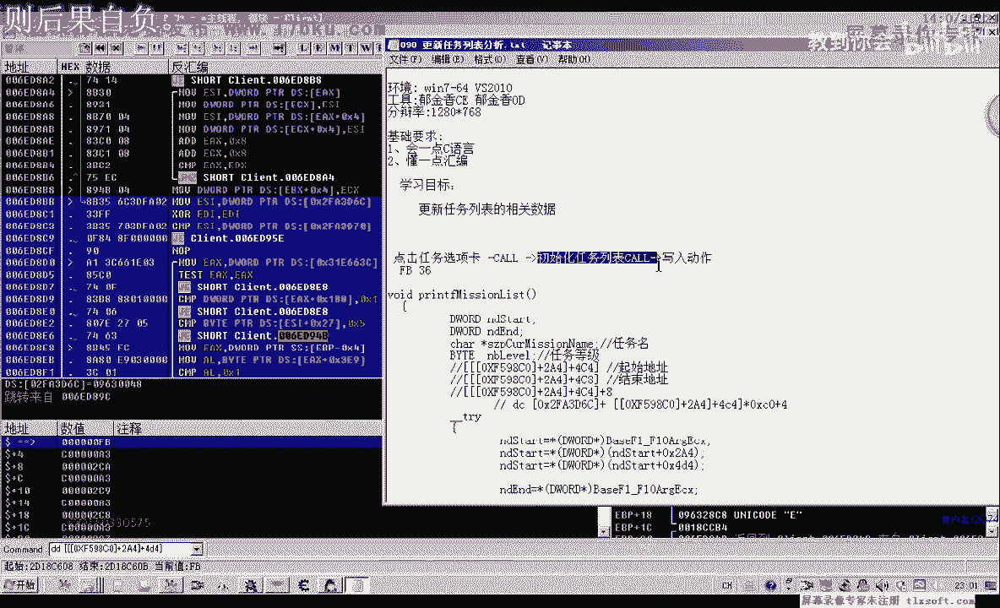
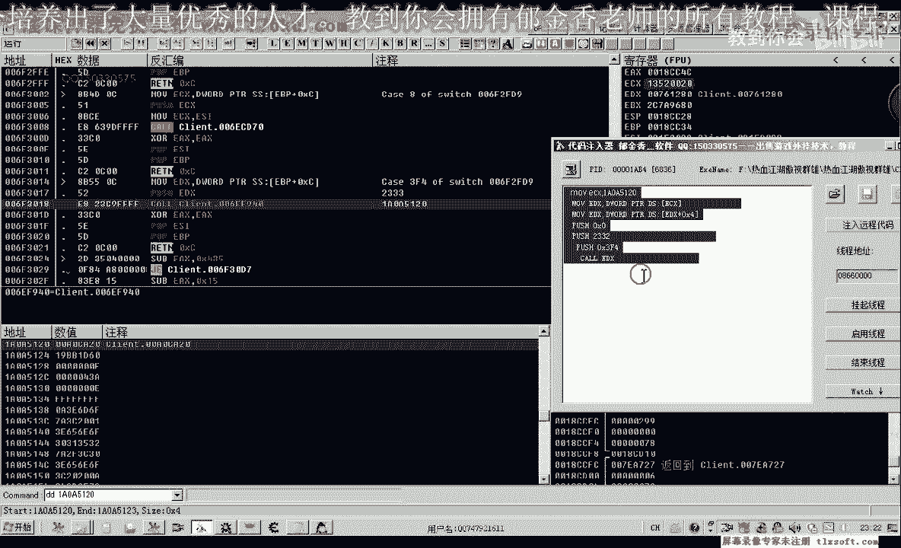
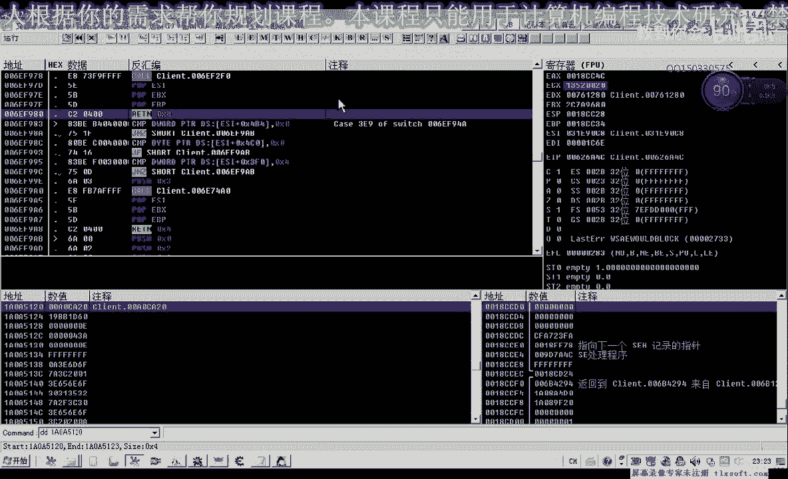

# 郁金香老师C／C++纯干货 - P79：090-更新任务列表分析 - 教到你会 - BV1DS4y1n7qF

大家好。

我是俞京香老師，那麼在這期我們來完成上一期課的作業，更新我們的任務列表，相關數據，那麼我們先來看一下，那麼在遊戲裡面。

我們按下"Ctrl+C"，任務之後，那麼這下面的任務列表，它會被初始化，會寫入相關的數據，相當於，那麼也就是說，我們一個是執行中的任務，一個是可執行的任務，那麼這兩個偏移的話，它實際上它不一樣。

它這個列表的偏移不一樣，那麼我們之前有過分析，那麼一個偏移是從我們的4C4開始，那麼4C8這個地方是結束地址，另外一個是4D4，結束地址是4D8，那麼我們來看一下，在這個地方，我們先轉到4D8這個地方。

那麼現在我們偏離的時候，也是用的4D8這個地方，那麼我們看一下，這個實際上是在我們選中可執行任務的時候，它會斷下，那麼說明這個選項卡的話，這裡面應該是可執行任務的，可執行的一個任務列表。

那麼另外還有一個地方，是4J4這個地方，那麼這個地方的話。

我們也可以下一個斷點，可以看一下，那麼這個實際上是執行中的，這個任務列表的相關的一個起始地址，那麼我們也可以按F4，執行到，執行到這個任務名這裡查看，那麼我們可以看到這個時候，它顯示的是主旨爭奪戰。

這一類的，那麼我們用代碼輸入，我們用我們的代碼來輸入進去看一下，上一節我們寫的相關的數據，那麼這個時候掛接主新程測試。

那麼你看我們看一下的，這個時候，它所有的數據的話，都是我們所有任務列表裡面的，但是我們的可執行中的任務的話。

沒有被遍離出來，因為我們用的偏移是4J4這個偏移，那麼我們先把斷點取消掉，那麼這裡還有一個伺候自己的任務，那麼這個倒是可以遍離出來，但是要遍離出我們的伺候自己的任務的話。

我們也需要來點擊伺候自己的任務這個選項卡，才能夠初始化它相關的列表，4D4相當於是4D4開始的列表，我們才可以初始化它，那麼也就是說它有這樣一個流程。

大致的有一個流程，那麼也就是我們點擊了上邊的選項卡，那麼點擊這個任務選項卡的話，它肯定會掉入一個相應的庫，那麼在這個庫裡面的話，它肯定在某一層裡面，它會執行一個初始化任務列表的動作。

那麼現在我們就是要找到的初始化任務列表的，這個庫或者是代碼，但是在我們這初始化任務列表這個庫裡面，它又有一個寫入的動作，可以寫入動作，那麼寫入什麼呢，也就是像我們的4C4這裡面的偏移，進行一個寫入動作。

那麼我們可以具體的用OT來看一下，那麼之前我們有分析它的偏移，那麼這個偏移肯定是變動的，因為我們的機子它不會變，變動的就只有這個偏移。

那麼這個偏移的話，也就是我們的從4C4，應該是我們現在的話應該是從4D4這個地方開始，那麼4C4是我們的執行中的任務的一個偏移，而我們現在所看到的這個是我們所有可執行任務的偏移。

其實地址是從這個機子公司裡面取出來的，那麼我們先看一下，再加一個括號，那麼這個時候它這裡有一個數據是36，那麼我們在上面下一個內存寫入的段點。

那麼我們選全部任務選項卡的時候，它肯定它就會有一段代碼，就是我們所說的，它會有一個寫入的動作，那麼實際上就是像這個機子裡面寫入。

那麼寫入之後的話，肯定它就改變了這個時候為0A，那麼實際上也就是這個數據的一個改動，那麼造成了我們的列表裡面的相關數據的一個變動，那麼這裡變成了0A，那麼也就是說它第一個的數據就有變動了。

那麼這個時候最終的數字它是FB，那麼我們再次內存寫入，給適合自己的任務，那麼我們看一下，這個時候它也會像這個地方寫入36，那麼也就是說它第一個數據，列表裡面的數據的話，它就是通過一個是36。

那麼另外一個好像是FB，這樣來進行一個關聯的，最終數據是FB。

FB和36，那麼這個數據的話，我們也不知道它具體是一個什麼意思，反正知道了它往裡面寫入了這個數字，那麼我們但是可以通過寫入動作的這段代碼，可以返回到它的上一層庫，那麼找到初始化我們所。

初始化這個任務列表的功能就可以了，那麼我們就能，就實現這個列表的初始化，就能夠得到我們想要的數據，那麼也可以，理論上也可以找到點擊選項卡的這個庫，那麼我們也可以模擬這個人的一個動作來點擊選項卡。

或者這個數據，那麼還有如果是找到中間的這個庫的話，那麼我們就是直接進行一個初始化動作。

而不會顯示這個任務界面，那麼好的我們再一次在這個地方，下一個路徑寫入斷點，來看一下它的相關代碼，點適合自己的任務，然後我們把斷點刪掉，那麼這個時候我們可以從這個堆在裡面，可以看到返回的獲得一些地址。

那麼我們看返回到上一層到這個地方來了，而且我們的任務列表的話，我們可以看到它任務列表有很多個，肯定它有一個循環，那麼有循環的這個庫的話，才是我們的這個給我們的這個列表來進行初始化的這個關鍵的這個庫。

那麼我們再回到上一層再看一下，那麼到這裡，我們能夠找到一個循環。

找到一個循環的地方，那麼這裡我們有一個比較熟悉的數據，這個C0它一次加了C0這個偏移。

那麼C0這個偏移的話，當時我們也有分析，那麼也就是這兩句匯邊代碼加起來，實際上它就讓我們這個ECX的值，最終就等於我們的C0，那我們算出來之後，好像就是等於C0，這裡是C3，在左一六。

最終也就是這個ECX的值，它省以C0，所以說這個數值我們比較熟悉，那麼這裡還有一個就是EDI+I，那麼這個EDI的話，實際上就是我們傳進來的這個數據，那麼這裡參數，它來源於我們的EBP-Z這個地址。

而這個地址它可能是代表了一個結構，結構指針，就像我們之前，像我們的發包的時候有一個緩衝區，那麼這裡它也是一個緩衝區的一個指針，相當於是，然後它從這裡加了一句，把這個EDI的數字。

寫入到這個緩衝區的地址裡面去了，那麼也就是說我們之前所看到的這個FP的話，它來源於的這個數字的話就是來源於EDI，那麼我們又找一下，EDI的數字的來源，那麼我們在這個地方能夠找到XOR，異活的一個命令。

那麼這句指令的目的，最終實際上就是讓這個EDI的數字等於0，相當於這樣一個操作，EDI-0，但是我們這個時候傳進去的數據，EDI它又不等於0，為什麼，因為在這個循環後邊，這個位置。

它每次的讓EDI繼承器的，是加了1，相當於EDI-EDI+1，也就是相當於我們Four循環當中的這個I++這一句，那麼從這裡來看的話，它可能也就是一個，樹種的一個下標。

而且這個樹種的話很可能是一個結構樹種，而這個結構的大小，它就是我們的，2DX+Z，恰好是這麼大，而且我們還應當有一個結構的初始地址，我們可以往前面來看一下，那麼它的起始地址的話，應該就是這個ESI。

它有個起始地址，那麼這裡應當是一個它的一個結束的一個地址，那麼我們看一下它的初始來源於什麼地方，那麼這個地方，我們能夠找到它的一個初始，那麼這個地址好像也比較熟悉，這裡有個D6社，這裡是它的初始。

那麼這個D6社的話，恰好也就是我們之前用到的這個機制，那麼它也出現在了這個地方，而且的話，我們在這裡的話，它最先傳進來的數字的話不是1，而是我們的FB，那麼說明它在對一個這個結構數出來進行遍地。

然後加了一些條件的一些判斷，一些比較，那麼最終是屬於我們的相應的符合了相應條件的這個數據了，那麼最終才進行寫入，那麼也就是說這個循環裡面，它加的這些條件判斷，就是來判斷這個任務是否適合自己。

是否達到了一個等級要求，是否已經做過了，這一些條件，可能就在這裡來進行判斷，但是我們不用去詳細的去分析它，那麼我們只需要了再返回兩層，找到我們所謂的這個，選項卡庫或者是初始化任務列表的庫。

能夠初始化我們的任務列表就可以了，那麼先讓它跑起來，那麼實際上這裡我們也可以做一個測試，就以這個機子為例，那麼我們也可以來加上0，那麼審議我們的這個FB，那麼我們可以看一下，那麼實際上這個地方。

它出現的就是這個任務的一個結構，而這個結構的大小應當就是C0，那麼這裡邊的話都是一些它相關的一些數據，或者是一些對話的內容，那麼在C0這裡應該結束，在這個地方結束，因為實際上在這裡就結束了。

因為它是從0開始的，那麼從C0這裡開始，又是下一個任務的地址，那麼我們再往後邊又來遍一C0，又到C0這個遍一的話，它又是下一個地址，那麼但是這個C0的話，可能還有一些不一樣，看起來，好，再看一下。

那麼它有兩種形式的，那麼這個這種形式的話。

它這裡沒有指針，那麼我們之前有個判斷，那麼一種情況它是指針。

另一種情況的話，這裡應當直接就是存放的文本，這裡是武林血戰什麼什麼，是武士，武軍這裡，那麼它直接就是文本，這裡，那麼這裡實際上就是一個文本，我們用db來顯示一下，就是在這個字串，因為它有兩種形式。

那麼我們在書寫的時候，那麼一種形式，它是+18這個，+18這個結構了，這個偏移這裡，它就是說大於10，我小於10，那麼它相關的這個任務名，取是不一樣，有一個要多取一次，有一個直接取就行，那麼在這裡。

實際上我們也可以看一下，那麼我們看一下。

它+，比較的話是+18這個位置，那麼這裡+18這個位置，它是小於我們10的，那麼小於10的也就是說直接取出來，那麼如果是大於的，才需要來接b，這裡應該是小於接b，小於的才需要執行這一句，接b大於跳轉。

那麼小於就是大於的話就跳轉，是這樣的，那麼這裡它的數據。

我們+18這個位置，它明顯的是小於10的。

小於10，那麼小於的話就會跳轉到這後面來執行，這一句就不會執行掉，那麼當它大於10的時候，那麼這句才會被執行。

那麼我們可以看到我們之前的這個地方，那麼它的+18這個位置，就是大於10的，是大於。

那麼接b它是小於的時候跳，那麼大於的時候，它跳轉了就不會被執行，那麼所以說在這裡。

它還會就直接轉到了這個數據窗口裡面，才是它相關的自創，好的，當然這個是題外話，我們只是為了便於了解這個結構，了解這個結構，那麼既然是在這個循環裡面，它對我們的相關的數值來進行了一個相關的初始化。

相當於在調動內部的這個擴放，這裡執行一個循環的一個初始化，那麼說明這個擴的話，就是我們初始化相關數據的擴，那麼我們在這裡下一個段點看一下它的參數，那麼這裡有可執行任務，這裡有6個選項卡，那麼說明的話。

它的參數肯定要可能就是01234，這樣來區分它，那麼也可能是用另外的一些數據編號來對它進行一個區分，肯定有不同的參數來區分這個相應的擴，那麼我們來看一下，它的一個參數，那麼返回到上一層。

但是我們發現了這個擴的話，它沒有一個壓占的一個參數，沒有壓占的，那麼沒有壓占的參數，我們可以再觀察一下再上一層的擴，那麼在這裡有一個都沒有看到有0123的相關的數據，好，那麼我們再次讓它運行起來。

再選第二個選項卡，再看一下我們上一層擴展，但是這個參數的話，它2F0我們記一下，第三個選項卡，但是這個參數沒有變，那麼我們發現有變化的，實際上一個是1BX，一個是1BX，繼承器那邊的數字它有變化。

那麼我們把這個2303，2303，我2335把它記一下，好，那麼我們再選兩個選項卡4，那麼這個時候我們是2304，2336，那麼這兩個的話，我們可以看到它是一個序號，是I組的有點像123這一組。

那麼我們再看一下，再選下一個，下一個，來這裡，恰好是2302337，那麼我們再選回去，再看一下，選擇無疑的2309，2307，那麼這個與我們所說的123，這位的參數，它也是一樣的，那麼這兩個參數。

可能是一個關鍵，很關鍵的一個數字，那麼我們就找一下這兩個數字的來源，那麼我們先在堆站裡面，這裡能夠找到一個2335，在這裡也能夠找到一個2335，那麼發現最早的話，應該是在這個地方傳入的。

我們的這個2335這個數字，那麼我們轉到這個地方來看一下，轉到這個地方來看的時候，我們看到這裡，就是我們打開倉庫關閉倉庫什麼物品，這個對象的一個6，對象的，那麼也就是我們打開倉庫關閉倉庫的時候。

對6的一個操作，那麼可能我們是找到界面，在上面來了，也就是說我們找到了點擊選項卡的這個庫，那麼它的EX這裡的，恰好也就是我們的，這裡是3F4，然後前面那裡就是2335，那麼也就是說在這裡的話。

它表示了掉入了某個選項卡，通過我們的這個數字，2335，可能是這樣的，那麼我們可以在這裡來做一下測試，下一個斷點，然後我們讓它再次斷下，那麼斷下之後，我們看一下，看一下EX的一個數字，2332。

那麼我們記一下，那麼順便我們記一下ECX的一個數字，那麼有了這個ECX的數字，我們直接就能夠計算出它破的一個地址，還有這些參數，我們全部都有了，好的，那麼我們接下來進行一下測試，當然這裡還有一個庫。

我們來看一下，在這裡看一下，好的，那麼我們再來，調用這個庫來進行代碼輸入器，打開，把這幾句代碼複製一下。

那麼把前面的這一段刪掉，最後這個ECX，我們需要給它附一個初值，就是剛才我們複製下來的數據，這就是ECX的一個初值，當然還有EX這個參數了，我們EX的數字。

直接我給它2332，看一下是不是這個數字。

2332，好的，那麼我們輸入到遊戲裡面測試一下，那麼首先我們看一下它界面有沒有變化，那麼我們發現有界面有變化了，那麼說明我們找到的是界面的這個庫，看一下，相當於是點擊了全部任務的這個庫，現在找到。

那麼這個是我們的全部任務，但是我們所說的我們要找的應該是，這個界面沒有打開的時候，那麼我們看一下把窗口關掉之後，我們再調用這個庫，會出現什麼問題，但是這個時候如果我們的任務窗口沒有打開的話。

我們調用這個庫來，它明顯是會出現問題的，因為ECX它沒有初始化，那麼所以說我們最好的結果，就是找的是什麼呢，找的也就是我們的初始化任務列表的這個庫，而這個是我們的選項卡庫。

所以說我們要找的是介於寫入動作，和選項卡庫它中間的這個庫，那麼這個庫的話，它不需要調用這個庫來實現，不需要初始化相關的結構，當然具體用哪一個，看你自己的一個選擇。

只要能夠實現既定的一個目的和一個功能就可以了。

好的，那麼我們再重新打開遊戲，那麼遊戲打開之後。

我們再次輸入，在接著找一下它中間的數據更新的庫就行了。

我們不需要點擊這個選項卡，但是我們可以從剛才的分析進行入手。

那麼剛才我們是一起到下一個地方。

嗯，嗯。

嗯，嗯，嗯，嗯，嗯，嗯，嗯，嗯，嗯，嗯，嗯，嗯，嗯，嗯，嗯，嗯，嗯，嗯，嗯，嗯，嗯，这里底下的有这个相应的断点，那么我们直接返回一下，用Ctrl+F键执行返回，用录音，再返回一下。

我们之前的这个分析的好像没有保存，没有保存的话，我们再重新的下一个相关的断点，嗯。

在这个fp这个地方也就是我们刚才说的，可能就是一个解构对象的一个下标，这里，那么我们在点击不同的选项卡的时候，他应当，当然我们现在点击的是执行中的这个任务的，下面才是可执行任务的，但是都可以。

但是我们在点击他的时候，他会，是断在这个地方，是C4，那么我们再返回一下，返回相应的这个数字，Ctrl+F键，再返回，刚才循环的那个地方，那么这里是打开仓库相关的这个地方。

那么我们从这里开始往下跟应是可以的，那么我们再点击一下全部任务，那么这个时候按F7跟进去，那么跟进去之后，我们可以看到这里有一个地方，这里有一个地方，他也是要一个，可能也是要一个相应的ECX的一个值。

那么具体需不需要ECX的数字，我们要跟进去看一下，而且这个EDX的值的话，好像就是来源于我们前面，这个2328，他最终还是掉了这个空，那么我们按F7跟进来可以看到，这里他同样的用了这个ECX。

而这个ECX我们按减号再退回来，看一下他的一个来源，那么转到之前面，那么这个ECX，他同样的来源于我们上一层的这个ECX，那么也就是来源于我们的这个Core里面，同样的用这个ECX，好的。

那么我们再次来看一下，点一下按F7跟进来，那么我们还是现在在我们的用，可能是我们输出了，也可能是我们没有，没有放在我们的这个，主线程来调用，那么我们可以先调用一下，再按减号再退回来。

那么我们可以单独的先调用一下，这个Core来试一下，看能不能够实现相关的调用，那么我们在这前面的话，他只是一个简单的一个判断，然后就转到这个地方来执行，那么相当于这两个Core的功能的话。

实际上是应该说功能是完全相同的，那么接下来的话，我们需要来找到这个ECX的一个机子才可以，下载过来，点适合自己的任务，然后我们看一下，适合自己的任务这个时候，他的数字是2333。

那么我们再调用这个Core，ECX的一个数字看一下，那么实际上的他就是在这个里面调用的，这个6F2 FD0在这个Core，那么这个是他相关的对象，那么我们再来看一下，把ECX的数字制作出来。

那么我们直接调用这个Core，看有什么效果，用代码输入器再次进行测试，测试，测试，测试。

测试，测试，测试。

测试，测试，那么从return这里看到了，他的确只有一个参数，而且是我们在这个Core里面。

反复的时候就实行屏障，屏障的一个平衡，那么我们发现这个Core的话，他也是直接就调用这个Core，那么我们把窗口再关上，再输入一下，那么这个时候我们发现，他有时也不会出错，偶尔才会出错。

那么可能是我们的数据，他没有同步到我们的主线程里面，所以说会出错，那么我们再把这段代码，添加到我们的89个的主线程单元里面去，大家测试一下，那么这节课我们就先分析到这里，那么下一节课我们再写代码来测试。

顺便我们找一下Ezx的机子，对象的机子的来源，那么这一节课我们先到这里，下一节课我们再见。

由 Amara。org 社群提供的字幕。