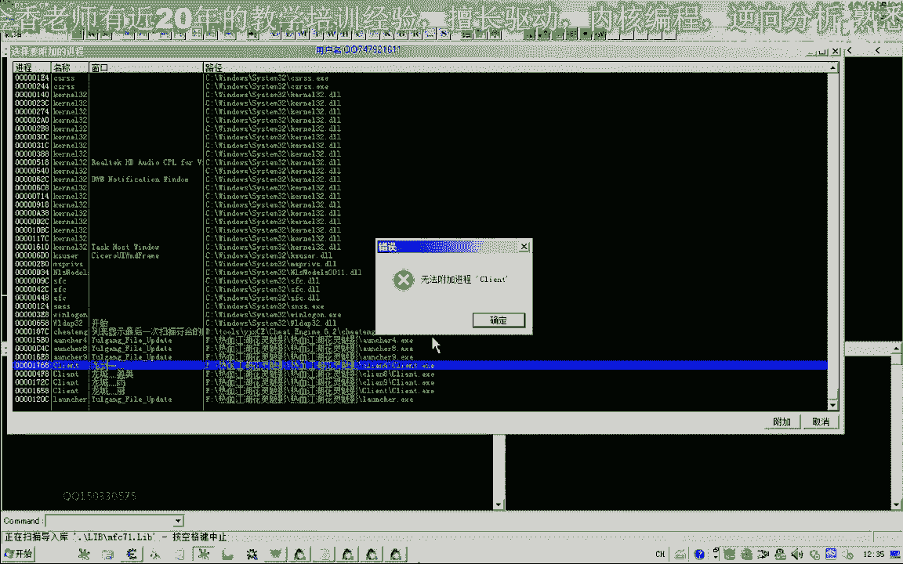
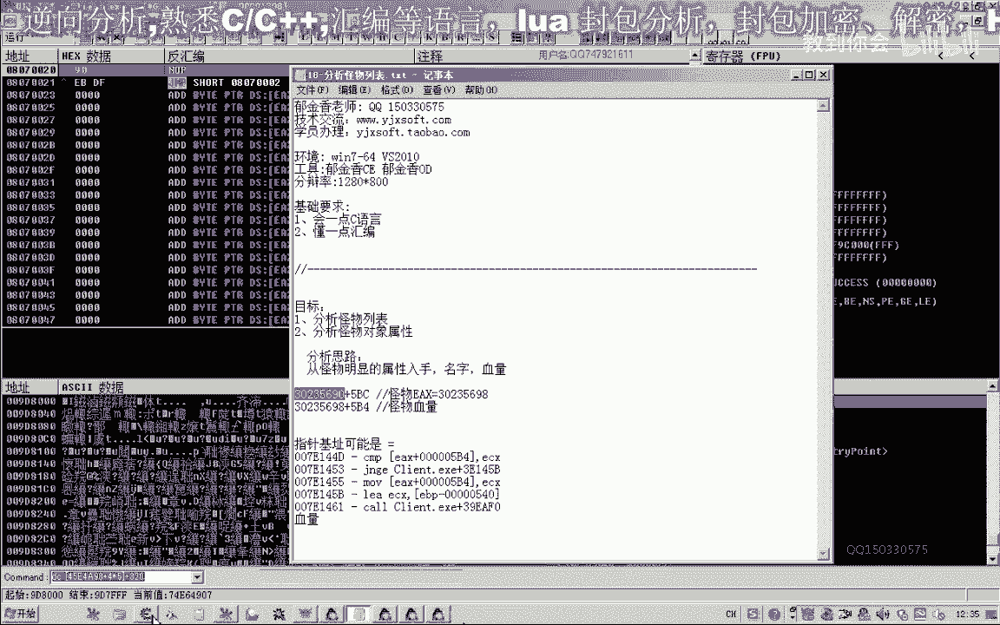
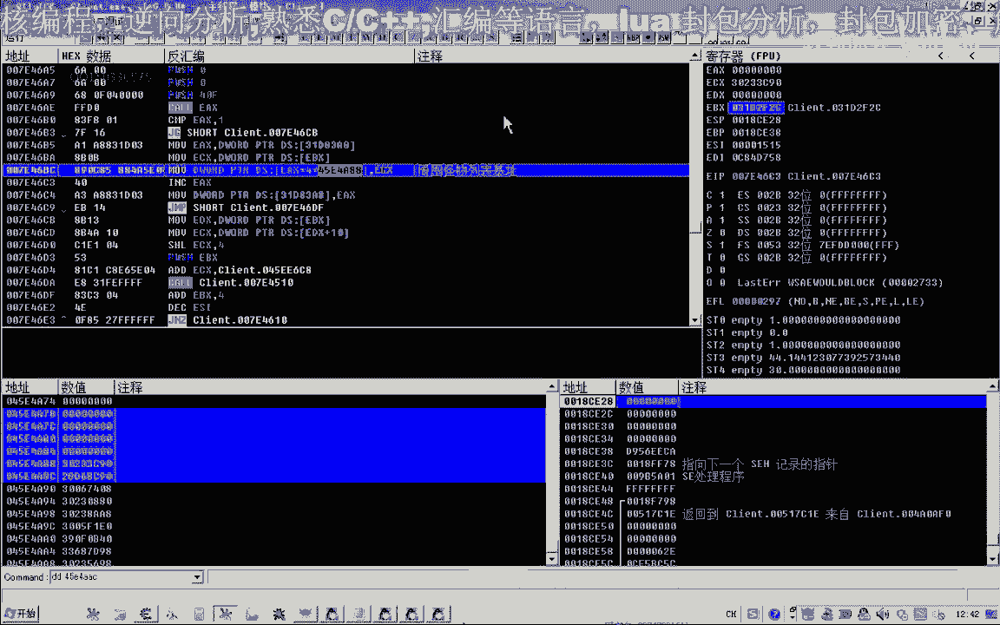

# 郁金香老师C／C++纯干货 - P7：018-分析怪物列表_m - 教到你会 - BV1DS4y1n7qF

大家好，我是郁金香老师，qq 15033057，欢迎大家参加，预计将技术编程培训，那么今天这节课呢我们一起来分析一下怪物的数码，怪物列表以及怪物对象的呃一些明显的属性。

那么我们啊分析怪物数组的一个思路呢，就是从怪物的对象入手，那么要分析出怪物对象呢，我们就可以从怪物的属性来入手，比如说怪物的名字血量，那这两个东西呢比较明显，但是名字这个数据呢它是啊固定的可能。

而且而且相同名字的怪物的话比较多啊，那么所以说具有一个唯一性的呢，就是这个血量，因为这个血量他在受到攻击的时候呢，它会改变，会改变好的，那么我们打开我们的c e工具啊，那么先呢我们附加到游戏里边。

那么附加进去之后，我们先选中一个怪物啊，那么比如说我们就以这个也是离我们最近的这个怪物能力选中它，那么现在它的一个血量的话啊，是没有变动的，而且是一个固定的一个值。

当然这个值的话它大致在100~2000这个范围之间，所以说我们先搜一下这个范围的数值，收了之后呢，我们再搜一下未变动的数值，啊多过滤几下，然后走上两步，再搜一下，因为变动的数值，那么收了几次之后呢。

我们再对这个怪物来进行一下攻击，那么攻击之后呢，这个时候呢它的数值就变动了，我们搜一下变动的数值，然后呢再收未未变动的数值，应该是当然不知道这个怪物回不回血啊，嗯那么所以说我们在这里呢。

我们再次让他的这个血量改变一下，那么然后呢我们收减少的数值，然后呢再进行一下这个范围的一个过滤啊，最后呢我们收到这几个地方再次对它进行攻击啊，攻击之后减少，我们再搜一下减少的数值。

然后呢这个时候呢他的数字为名额，因为这个怪物呢他死掉了，所以说它的血量没有，那么过一会儿呢应该把这个怪物的数值血量呢它刷新了，那么这个时候我们可以通过它的血量来找到这个对象，附加调试器上去。

那么这个怪物到哪里去了呢，也有可能是这个怪物，那么我们对它攻击了之后呢，我们看一下它产生看到变化产生的变化这个数字啊，那么应该呢就是这个范围就是这个范围，或者说那个怪物被别人拿给消灭掉了。

这个时候数值为零的啊，反正这个怪物是死掉了，卡了之后我把他杀掉的，也可能是其他周围还有其他的玩家啊，把他杀掉了，那么这个时候呢我们可以得到两个对象，一个偏移是五比四啊。

ex加上另外一个呢是1e si加上五比c，它们之间呢相差了一个八的一个偏移，那么我们先看一下哈，后面这个，记一下，这是我们找到的一个机子加五比c，这样是怪物的血量，那么另外还有一个机制在这个地方。

你复制一下，那么这个时候呢我们的e si的质量等于这个啊，它加上的是五比四啊，怪物血量，那么这两个对象的话，我们看哪一个更适合于我们来获取怪物的信息啊，那么接下来的分析的话，我们再搜一下啊。

因为怪物列表的话，他就是怪物的列表，怪物的数组呢它就是用来保存我们的怪物对象的，所以说，这两个对象的话呢，如果他是真正的是对象的话，它就便于我们搜索，这两个数据呢都存放在怪物列表里面。

那么我们再通过它来搜索一下啊，搜索到我们怪物列表的周围，那么怪物列表呢它一般是一个全局的，这两个数据在变，它实际上是堆栈里面，堆栈里面，那么刚才呢我们搜索到的是这两个地址。

但是这个地址呢它也变动了也变动了，我们再重新再扫描一下啊，对八起，那么这两个地址的话离得比较近啊，反正这几个都是机子，我们就先把它记录一下啊，那么另外还有一个就是这个690的这个，那么我们也来搜一下。

那这个呢我没有搜索出七成，那是另外的，可能是在一个另外的某个对象里面，那么这个呢我们暂时先保留，我们先看一下这两个机子里面有没有我们所要的东西，没有我们需要的贡献，这个变化就关掉。

这个数字呢也在不断的变化，这里已经有一个相同的数字，那么等一会呢我们就进去看一下，都进去看一下。

那么打开我们的o t。

那么我们先把oc里面的这个进程呢先取消掉。

再用我们的op附加，那么附加进来之后呢，我们把c里面所找到的这两个地址啊。

先把它记记录一下，是31d，34233，这是第一个，我们在这里看一下，那么这个时候呢我们在这里边呢发现了很多地址，很多很多的地址，那么这些地址的话可能就是我们的外部对象啊，也可能是其他的东西。

那么我们先进去看一下，那么先进入我们的怪物对象，刚才我们加五比四，这里是血量，这是1300的一个血量，我们收到的，那么我们看血量附近有没有怪物的名字啊，应该说这个怪物的名字呢，这个属性它也可能也在这里。

这里有个大概是在31318320左右的，有一个外部的名字，取下三幺几，用dc来显示一下。

那么还在后面365左右再厚1。320，那么从这里来确定的话，我们就是呢它的偏移呢呃就是320，当然是从我们五比四，从下面一个对象和偏移来算，这里面是320，是怪物的名字。

怪不那么如果这个是一个怪物的列表的话。

那么在后面呢这里加四这个位置的话，他也应该是我们的这个怪物的名字，那么我们也可以看到这里是那个大白条的删除啊，就是这样的，那么后面的数组的表现形式的话，这里是乘以i，那么乘以二龙，再看一下，修复三句。

这模型以删了啊，那么乘以三的话，这里呢是我们的那个终极的奇幻书，那么说明这个对象列表里面的话呃，它除了我们怪物列表里，在这个地址来可能是空的，没有东西呃，金刚石啊，这个也是我们汇报里面的物品。

那么说说明我们所找到的啊，这里呢也是一个对象的列表，但这个对象的列表的话，从我我们目前在一个分析来说的话，那么我们再来看一下它这个机子，再在上面我们下一个访问的断点，看一下能不能够找到所谓的基地址。

那么在这里呢我们就能够找到一个数组啊，就是这个31c e740 ，这里一个朝堂，一个朝堂，那么这里的话就是我们的所谓的这个呃对象列表，我们把它备注一下，把这个删掉啊，相遇，那我们先把这个复制一下。

看还有有没有其他的地方。

啊这个地方也有访问ebx这sb c那么1p x的来源呢，我们向上找一下，一bx就是来源来源于这个31c e740 就是来源于这个地方，那么这里我们能够看到的对象没有奇迹。

那么这里是数组的形式。

那么这里呢是直接出现了一个基层，好的，我们删掉这个相应的一个断点。

那么接下来呢我们再看一下啊，另外找到的这个机制是1144av 3。

那么从这里来看的话，里面的对象呢它不断的在变化，不断的在变化，在更新，我们这里可以看到，那么我们进去看一下哈，加上一个括号，进去看一下，我们先用看一下对象的名字，那么在这个地方哈大概也是加320左右啊。

能够看到我们的一个呃大块头山贼，然后我们加上数组的访问方式吧，巨幅山水，二哈这里呢也是大块的创作，三，这里是大骨头，上去是聚不上去，529396，你是怪物七啊，其实这里呢它没有尺寸。

所以我们不到看一下八字，后面都没有了九，那么说明这个地方的话，他全部都是我们的怪物对象，全部都是我们的怪物对象，那么这个呢才应该是我们周围的怪物的列表，那从这个形式上来看来。

可能是所以先这里啊归零的这个地方呢，可能就是我们的机制在这里下一个未成反面的断点，然后断到了e4 x这里，然后看一下e c x这个数字的来源，再让他跑一下，看一下有没有其他的地址，其实他在这里。

他直接就献了一个数组出来，直接献了一个数组出来，也就是这个a88 ，这个地方也就是这里是我们的数据，那这个时候呢它会清零了啊，我先删掉这个断点，让他跑起来，那么这里呢可能才是我们的，周围的怪物列表。

对象列表基础里面放的呢才是我们的呃，那么我们把这个蓝图制下来。

狗子强，那么这个时候呢我们找到两个两个对象，一个是周围的怪物啊，另外一个呢是其他的对象列表，这个内存机子里面呢，但是现在我们分析的是怪物列表的机制，暂时用不上它，先做一个记号。

那么呢这个就是我们的外部的列表的一个机制，我们可不可以把它整理一下，那么整理一下，我们把机子放在前边，加上我们的四神里的下标就行了，它是用ex的代表了下标，那么我们这里来从零开始好。

那么这就是访问到我们的对象。

我一个，那么这第一个对象我们看一下啊，刚才我们分析了加3200这个地方呢是它的名字啊名字，那么还有一个加五四这个地方呢是它的血量。

血量，那么我们把它记录一下。

那么另外还有一个属性呢，这里有个二零啊，它是32，那么32的话代表的恰好是他的一个等级啊，一个极品，那么很有可能的话，这个32就是它的一个等级，那么我们修改一下，看有没有效果，当然现在我们不知道呃。

所选择的这个怪物对象究竟是哪一个啊，那么我们可以先改它的一个名字，看看有没有效果，我第一次来显示一下，对了就是我们选中的这个它的名字就变化了，那么还有一个是我们的等级五比发射地。

看改一下它的本金也没有小30了，啊它的级别也变了，那么说明这个地方呢。

五比八这个地方是怪物的等级。

那么还有一些是怪物的一个坐标来看一下呃，用我们的火点数来看一下，那么我们要看一下当前我们的坐标是多少，2181，那么怪物的这个坐标呢，它也不会相差太多，不错，啊这里有一个坐标，2219。

对了201我们是20181，它是2171啊，这个是负的，那么这个的话就是我们的怪物的，应该是它的坐标了，我们把它记录一下，当然前面还有一个坐标，这里它一共有两个坐标，一共有两个坐标呃，1018。

我这一个让我们看一下1018。

那么这两个坐标呢都是我们的怪物坐标，因为它怪物呢它有两个来回移动的点，可能是它在移动，再看一下日，要求前任要求，哈哈哈，啊是这个怪物啊，它在移动在变化，我们看一下哪一个数值是变化的，你走到他跟前去啊。

21871984，这样这个1984这个离得比较近一点，应该是后面这个这是70啊，我这个是80，啊这个时候怪物的坐标与我们重活19842187，而要放弃，然后985这个是八四。

那么应该是后面一个坐标它离我们比较近啊，啊那就是这两个坐标之间到时候大概是过滤啊，都把它记下怪物的坐标，它有两个可能是来回移动的两个点，一个是1018，是我们的x坐标，还有一个是101c。

这是我们的y坐标，2018，这个是101c，这个是102，点看这个视频，我们再来看一下，这是1020，那么另外还有一个坐标呢，就是我们的加1024g的地方，还有一个坐标是加幺零，rc这个地方。

那么这就是他常用的几个属性，常用的几个属性。

好当然还有一个怪物的一个状态，就是再来看一下它的血量，这个地方，那么这个我们当前攻击的这个怪物来说，是我们刚才感动的那一个怪物，这个才是我们改动的这个快速动的快乐。

那么另外呢怪物应该还有一个死亡的一个状态啊，啊那么这个数值呢我们可以通过c一来搜一下，先移动到它的机子这个地方。

那么我们搜索的时候来看，就从他的机子开始时候，30233c9 ，然后他活着的时候呢，我们就这个时候已经被我们呃杀死掉了，应该呢它有一个状态是零或者是一两种状态，我们就是两个状态之间的一个数字，零和一啊。

这个地方，啊这个时候呢他一般来说呃，再搜一下灵活机的，但是我们不知道它是用一来表示的，是死亡还是用一来表示的，他是未死亡，所以说这一点我们不了解，那么不了解的话，我们这个时候搜一下未变动的数据啊。

这个变动的数值，然后我们攻击它啊，让它死亡之后呢，我们选一下变动的数值，那我们换一把武器，然后死亡之后呢，它这个数呢数字变动，搜一下变动的数值，然后呢再收一个两者之间的一个数字，零和一之间的，好然后呢。

看他有没有复活啊，啊这个就是我们的他已经复活了，那么复活之后呢，这个数值呢它应该是再次变动变动的数值，那么离得比较近的这两个他活着，如果是一的话，那么极有可能就是这两个数字代表它的我走的啊。

然后呢我们的数字之间的再扫一下，f a s和b这两个地方。

当然一个是哪个为零，一个是为一，那我们看一下偏移是多少。

314啊，那我们记一下这个，那么离他很近，这个地方314，那么另外还有一个地方呢。

这个地方离得比较远一点，那么离得太远的话，那么我们说这个可能性就比较低了啊，因为这个我们对象的话它不会太大，应该是不会到这个位置的，不会有前多个字节啊，那么就应该是刚才的这个位置，在314，在这个地方。

那么我们再次攻击它，让它死亡，看一下，好死亡之后来这里就为零了啊，那么所以说这个东西这个怪不得状态，我都的话是活着这个唯一啊。

那么是否，好久啊，那么死亡就为零，那么很多时候我们在攻击的时候呢，我们要判断判断这个怪物是否死亡了，如果这个怪物死亡了的话，我们就对他继续进行一个攻击了啊，继续攻击了，好的。

那么我们今天这节课呢我们就分析到这里，另外当然还有一个对象的一个列表，我们也把它整理出来，这个是对象列表，那这个对象列表的话，暂时我们还不知道啊，那么我们目前所知道的而言的话，好的。

那么我们下节课再编写代码呢，把我们的这个外部的这个属性呢，这些骗你出来啊，怪不得名字血量等级啊，是否是否死亡，这些属性呢我们在编写我们的代码啊，然后呢在把它封装好相应的数据。

